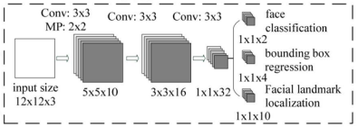
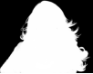
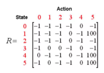
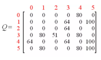

### 1. MTCNN人脸检测	实现IOU代码

```python
import numpy as np
# box[0]=x1
# box[1]=y1
# box[2]=x2
# box[3]=y2
def iou(box, boxes, isMin = False):
    # 最大置信度建议框的面积为(x2 - x1) * (y2 - y1)
    box_area = (box[2] - box[0]) * (box[3] - box[1])
    # 其他建议框的面积的集合
    area = (boxes[:, 2] - boxes[:, 0]) * (boxes[:, 3] - boxes[:, 1])
    # 取x1最大值的集合
    xx1 = np.maximum(box[0], boxes[:, 0])
    # 取y1最大值的集合
    yy1 = np.maximum(box[1], boxes[:, 1])
    # 取x2最小值的集合
    xx2 = np.minimum(box[2], boxes[:, 2])
    # 取y2最小值的集合
    yy2 = np.minimum(box[3], boxes[:, 3])
    
    # 宽度的集合
    w = np.maximum(0, xx2 - xx1)
    # 高度的集合
    h = np.maximum(0, yy2 - yy1)
    # 交集面积的
    inter = w * h
    if isMin:
        # 交集/最小值的集合
        ovr = np.true_divide(inter, np.minimum(box_area, area))
    else:
        # 交集/并集的集合
        ovr = np.true_divide(inter, (box_area + area - inter))
    return ovr
if __name__ == '__main__':
    # 置信度最大的建议框
    a = np.array([1,1,11,11])
    # 其他建议框
    bs = np.array([[1,1,10,10],[11,11,20,20]])
    # 打印IoU值
    print(iou(a,bs))
```

### 2. MTCNN人脸检测	实现NMS代码

```python
import numpy as np
def iou(box, boxes, isMin = False):
    box_area = (box[2] - box[0]) * (box[3] - box[1])
    area = (boxes[:, 2] - boxes[:, 0]) * (boxes[:, 3] - boxes[:, 1])
    xx1 = np.maximum(box[0], boxes[:, 0])
    yy1 = np.maximum(box[1], boxes[:, 1])
    xx2 = np.minimum(box[2], boxes[:, 2])
    yy2 = np.minimum(box[3], boxes[:, 3])
    w = np.maximum(0, xx2 - xx1)
    h = np.maximum(0, yy2 - yy1)
    inter = w * h
    if isMin:
        ovr = np.true_divide(inter, np.minimum(box_area, area))
    else:
        ovr = np.true_divide(inter, (box_area + area - inter))
    return ovr
# box[0]=x1
# box[1]=y1
# box[2]=x2
# box[3]=y2
# box[4]=置信度
def nms(boxes, thresh=0.3, isMin = False):
    # 判断是否为空
    if boxes.shape[0] == 0:
        return np.array([])
    # 根据置信度从大到小排序，argsort()默认从小到大，所以取负变为从大到小
    _boxes = boxes[(-boxes[:, 4]).argsort()]
    # 最终要保留的建议框
    r_boxes = []
    # 循环过滤建议框
    while _boxes.shape[0] > 1:
        # 置信度最高的建议框
        a_box = _boxes[0]
        # 其他建议框
        b_boxes = _boxes[1:]
        # 保存置信度最高的建议框
        r_boxes.append(a_box)
        # 过滤IoU大于0.3的建议框
        index = np.where(iou(a_box, b_boxes,isMin) < thresh)
        # 保存过滤后的建议框
        _boxes = b_boxes[index]
    # 保存最后一个建议框
    if _boxes.shape[0] > 0:
        r_boxes.append(_boxes[0])
    # 将array转化成np
    return np.stack(r_boxes)
if __name__ == '__main__':
    # 建议框的集合
    bs = np.array([[1, 1, 10, 10, 0.98], [1, 1, 9, 9, 0.8], [9, 8, 13, 20, 0.7], [6, 11, 18, 17, 0.85]])
    # 打印NMS结果
    print(nms(bs))		
```

### 3. MTCNN人脸检测	实现矩形转换正方形代码

```python
import numpy as np
# box[0]=x1
# box[1]=y1
# box[2]=x2
# box[3]=y2
def convert_to_square(bbox):
    # 复制建议框
    square_bbox = bbox.copy()
    # 判断是否为空
    if bbox.shape[0] == 0:
        return np.array([])
    # 高度的集合   
    h = bbox[:, 3] - bbox[:, 1]
    # 宽度的集合
    w = bbox[:, 2] - bbox[:, 0]
    # 最大边的集合
    max_side = np.maximum(h, w)
    # x1 = x1 + w * 0.5 - 最大边 * 0.5
    square_bbox[:, 0] = bbox[:, 0] + w * 0.5 - max_side * 0.5
    # y1 = y1 + h * 0.5 - 最大边 * 0.5
    square_bbox[:, 1] = bbox[:, 1] + h * 0.5 - max_side * 0.5
    # x2 = x1 + 最大边
    square_bbox[:, 2] = square_bbox[:, 0] + max_side
    # y2 = y1 + 最大边
    square_bbox[:, 3] = square_bbox[:, 1] + max_side
    
    return square_bbox
if __name__ == '__main__':
    # 建议框的集合
    box=np.array([[16,36,25,94],[54,62,79,12]])
    # 打印转换正方形结果
    print(convert_to_square(box))
```

### 4. MTCNN人脸检测	实现图中的网络代码



```python
import torch
import torch.nn as nn
class Net(nn.Module):
    def __init__(self):
        super(Net, self).__init__()
        # 前3层网络
        self.pre_layer = nn.Sequential(
            # 卷积，输出10*10*10
            nn.Conv2d(3, 10, kernel_size=3, stride=1),  
            # PReLU激活函数
            nn.PReLU(),
            # 最大池化，输出5 * 5 * 10
            nn.MaxPool2d(kernel_size=2, stride=2,padding=0),
            # 卷积，输出3 * 3 * 16
            nn.Conv2d(10, 16, kernel_size=3, stride=1), 
            # PReLU激活函数
            nn.PReLU(),
            # 卷积，输出1 * 1 * 32
            nn.Conv2d(16, 32, kernel_size=3, stride=1),
            # PReLU激活函数
            nn.PReLU()
        )
        # 卷积，输出1 * 1 * 2
        self.conv4_1 = nn.Conv2d(32, 2, kernel_size=1, stride=1)
        # 卷积，输出1 * 1 * 4
        self.conv4_2 = nn.Conv2d(32, 4, kernel_size=1, stride=1)
        # 卷积，输出1 * 1 * 10
        self.conv4_3 = nn.Conv2d(32, 10, kernel_size=1, stride=1)
    def forward(self, x):
        # 输入前3层网络
        x = self.pre_layer(x)
        # 输出人脸分类
        cls = torch.softmax(self.conv4_1(x),1)
        # 输出建议框偏移量
        bbox = self.conv4_2(x)
        # 输出特征点
        landmark = self.conv4_3(x)
        return cls, bbox,landmark
if __name__ == '__main__':
    # 随机生成数据
    data=torch.randn([10,3,12,12])
    # 初始化网络
    net=Net()
    # 网络输出
    out=net(data)
    # 打印人脸分类形状
    print(out[0].shape)
    # 打印建议框偏移量形状
    print(out[1].shape)
    # 打印特征点形状
    print(out[2].shape)
```

### 5. ArcFace人脸识别	实现Centerloss主体代码

```python
import torch
import torch.nn as nn
class CenterLoss(nn.Module):
    # lambdas：权重
    # feature_num：特征数量
    # class_num：类别数量
    def __init__(self,lambdas,feature_num=2,class_num=10):
        super(CenterLoss,self).__init__()
        self.lambdas=lambdas
        # torch.randn：随机矩阵
        # nn.Parameter：绑定参数
        # center = torch.randn(class_num, feature_num)，随机中心点
        self.center = nn.Parameter(torch.randn(class_num, feature_num), requires_grad=True)
    def forward(self, feature,label):
        # 标签[0,0,1,0,1]
        # 中心点[[1,1],[9,9]]
        # 通过索引选择中心点[[1,1],[1,1],[9,9],[1,1],[9,9]]
        center_exp = self.center.index_select(dim=0, index=label.long())
        # 统计不重复元素的个数
        # torch.histc：统计
        # 参数1：标签
        # 参数2：不重复的标签数量
        # 参数3：最小值
        # 参数4：最大值
        count = torch.histc(label, bins=int(max(label).item() + 1), min=0, max=int(max(label).item()))
        # 标签[0,0,1,0,1]
        # 数量[3,2]
        # 通过索引选择数量[[3],[3],[2],[3],[2]]
        count_exp = count.index_select(dim=0, index=label.long())
        # torch.mean：平均数
        # torch.div：除法
        # torch.sum：求和
        # torch.pow：幂次运算
        # 1. loss1 = torch.pow(feature - center_exp,2)，特征与中心点之差的平方
        # 2. loss2 = torch.sum(loss1,dim=1)，loss1的和
        # 3. loss3 = torch.div(loss2,count_exp)，loss2除以数量
        # 4. loss4 = torch.mean(loss3)，loss3的平均值
        # 5. loss = lambdas/2*loss4，loss4乘以二分之权重
        loss = self.lambdas/2*torch.mean(torch.div(torch.sum(torch.pow(feature - center_exp, 2),dim=1),count_exp))
        return loss
if __name__ == '__main__':
    # 特征数据
    data = torch.tensor([[3, 4], [5, 6], [7, 8], [9, 8], [6, 5]], dtype=torch.float32)
    # 特征标签
    label = torch.tensor([0, 0, 1, 0, 1], dtype=torch.float32)
    # 初始化Center Loss网络
    center_loss=Centerloss(2,2,5)
    # 网络输出
    print(center_loss(data,label))
    # 网络参数输出
    print(list(center_loss.parameters()))
```

### 6. ArcFace人脸识别	实现ArcFace Loss主体代码

```python
import torch
import torch.nn as nn
import torch.nn.functional as F
class ArcNet(nn.Module):
    def __init__(self,feature_dim=2,cls_dim=10):
        super().__init__()
        # torch.randn：随机矩阵
        # nn.Parameter：绑定参数
        # W = torch.randn(feature_dim, cls_dim)，随机向量（隔离带）
        self.W=nn.Parameter(torch.randn(feature_dim,cls_dim).cuda(),requires_grad=True)
    def forward(self, feature,m=0.5,s=64):
        # 标准化
        x = F.normalize(feature,dim=1)
        w = F.normalize(self.W, dim=0)
        # 余弦相似度
        # torch.matmul：内积
        cosa = torch.matmul(x, w)/s
        # 弧度
        # torch.acos：反余弦
        a=torch.acos(cosa)
        # ArcSoftMax Loss
        arcsoftmax = torch.exp(s * torch.cos(a + m)) / (torch.sum(torch.exp(s * cosa), dim=1, keepdim=True) - torch.exp(s * cosa) + torch.exp(s * torch.cos(a + m)))
        return arcsoftmax
if __name__ == '__main__':
    # 实例化网络
    arc=ArcNet(feature_dim=2,cls_dim=10)
    # 随机生成特征数据
    feature=torch.randn(100,2).cuda()
    # 网络输出
    out=arc(feature)
    # 打印特征形状
    print(feature.shape)
    # 打印输出形状
    print(out.shape)
```

### 7. YOLO系列检测识别	完成YOLOv3模型中的上采样层和下采样层代码

```python
import torch
import torch.nn.functional as F
# 上采样层
class UpsampleLayer(torch.nn.Module):
    def __init__(self):
        super(UpsampleLayer, self).__init__()
    def forward(self, x):
        # 邻近插值
        return F.interpolate(x, scale_factor=2, mode='nearest')
# 卷积层
class ConvolutionalLayer(torch.nn.Module):
    def __init__(self, in_channels, out_channels, kernel_size, stride, padding, bias=False):
        super(ConvolutionalLayer, self).__init__()
        self.sub_module = torch.nn.Sequential(
            torch.nn.Conv2d(in_channels, out_channels, kernel_size, stride, padding, bias=bias),
            torch.nn.BatchNorm2d(out_channels),
            torch.nn.LeakyReLU(0.1)
        )
    def forward(self, x):
        return self.sub_module(x)
# 下采样层
class DownsamplingLayer(torch.nn.Module):
    def __init__(self, in_channels, out_channels):
        super(DownsamplingLayer, self).__init__()
        self.sub_module = torch.nn.Sequential(
            ConvolutionalLayer(in_channels, out_channels, 3, 2, 1)
        )
    def forward(self, x):
        return self.sub_module(x)
```

### 8. YOLO系列检测识别	完成YOLOv3模型中的残差模块和卷积集模块代码

```python
import torch
# 卷积层
class ConvolutionalLayer(torch.nn.Module):
    def __init__(self, in_channels, out_channels, kernel_size, stride, padding, bias=False):
        super(ConvolutionalLayer, self).__init__()
        self.sub_module = torch.nn.Sequential(
            torch.nn.Conv2d(in_channels, out_channels, kernel_size, stride, padding, bias=bias),
            torch.nn.BatchNorm2d(out_channels),
            torch.nn.LeakyReLU(0.1)
        )
    def forward(self, x):
        return self.sub_module(x)
# 残差结构
class ResidualLayer(torch.nn.Module):
    def __init__(self, in_channels):
        super(ResidualLayer, self).__init__()
        self.sub_module = torch.nn.Sequential(
            ConvolutionalLayer(in_channels, in_channels // 2, 1, 1, 0),
            ConvolutionalLayer(in_channels // 2, in_channels, 3, 1, 1),
        )
    def forward(self, x):
        return x + self.sub_module(x)
# 卷积块
class ConvolutionalSet(torch.nn.Module):
    def __init__(self, in_channels, out_channels):
        super(ConvolutionalSet, self).__init__()
        self.sub_module = torch.nn.Sequential(
            ConvolutionalLayer(in_channels, out_channels, 1, 1, 0),
            ConvolutionalLayer(out_channels, in_channels, 3, 1, 1),
            ConvolutionalLayer(in_channels, out_channels, 1, 1, 0),
            ConvolutionalLayer(out_channels, in_channels, 3, 1, 1),
            ConvolutionalLayer(in_channels, out_channels, 1, 1, 0),
        )
    def forward(self, x):
        return self.sub_module(x)
```

### 9. YOLO系列检测识别	完成YOLOv3模型中的dataset采样代码

```python
from torch.utils.data import Dataset,DataLoader
import torchvision
import numpy as np
import os
from PIL import Image
import math
# 配置文件类
class cfg:
    # 图片高度416
    IMG_HEIGHT = 416
    # 图片宽度416
    IMG_WIDTH = 416
    # 图片类别10
    CLASS_NUM = 10
    # 对coco数据集聚类获得的锚框
    ANCHORS_GROUP_KMEANS = {
        52: [[10, 13], [16, 30], [33, 23]],
        26: [[30, 61], [62, 45], [59, 119]],
        13: [[116, 90], [156, 198], [373, 326]]}
    # 锚框（正方形、竖向长方形、横向长方形）
    ANCHORS_GROUP = {
        13: [[360, 360], [360, 180], [180, 360]],
        26: [[180, 180], [180, 90], [90, 180]],
        52: [[90, 90], [90, 45], [45, 90]]}
    # 锚框面积
    ANCHORS_GROUP_AREA = {
        13: [x * y for x, y in ANCHORS_GROUP[13]],
        26: [x * y for x, y in ANCHORS_GROUP[26]],
        52: [x * y for x, y in ANCHORS_GROUP[52]],
    }
# 图片变换，标准化处理
transforms = torchvision.transforms.Compose([
    torchvision.transforms.ToTensor(),
    torchvision.transforms.Normalize(
    mean = [0.485, 0.456, 0.406],
    std = [0.229, 0.224, 0.225])
])
# one-hot编码
def one_hot(cls_num, i):
    b = np.zeros(cls_num)
    b[i] = 1.
    return b
# 数据集类
class MyDataset(Dataset):
    def __init__(self,label_path,image_dir):
        # 标签路径
        self.label_apth=label_path
        # 图片路径
        self.image_dir=image_dir
        # 初始化标签
        with open(self.label_apth) as f:
            self.dataset = f.readlines()
    def __len__(self):
        return len(self.dataset)
    def __getitem__(self, index):
        # 标签
        labels = {}
        # 获取行
        line = self.dataset[index]
        # 分割行
        strs = line.split()
        # 获取图片
        _img_data = Image.open(os.path.join(self.image_dir, strs[0]))
        # 图片转换
        img_data = transforms(_img_data)
        # 获取真实锚框
        _boxes = np.array(float(x) for x in strs[1:])
        # 转换真实锚框
        boxes = np.split(_boxes, len(_boxes) // 5)
        # 13、26、52锚框
        for feature_size, anchors in cfg.ANCHORS_GROUP.items():
            # 创建标签（未填值），例如13，13，3，（5 + 10），其中5 + 10 为置信度、中心点x、中心点y、宽、高、10个分类
            labels[feature_size] = np.zeros(shape=(feature_size, feature_size, 3, 5 + cfg.CLASS_NUM))
            # 循环真实锚框
            for box in boxes:
                # 分类、中心点x、中心点y、宽、高
                cls, cx, cy, w, h = box
                # 计算中心点x偏移量和索引
                cx_offset, cx_index = math.modf(cx * feature_size / cfg.IMG_WIDTH)
                # 计算中心点y偏移量和索引
                cy_offset, cy_index = math.modf(cy * feature_size / cfg.IMG_WIDTH)
                # 循环正方形、竖向长方形、横向长方形锚框
                for i, anchor in enumerate(anchors):
                    # 获取锚框面积
                    anchor_area = cfg.ANCHORS_GROUP_AREA[feature_size][i]
                    # 获取真实锚框和锚框的比例
                    p_w, p_h = w / anchor[0], h / anchor[1]
                    # 获取真实锚框的面积
                    p_area = w * h
                    # 计算IOU值
                    iou = min(p_area, anchor_area) / max(p_area, anchor_area)
                    # 标签填充
                    labels[feature_size][int(cy_index), int(cx_index), i] = np.array([
                        iou, 
                        cx_offset, 
                        cy_offset, 
                        np.log(p_w), 
                        np.log(p_h), 
                        *one_hot(cfg.CLASS_NUM, int(cls))
                    ])
        return labels[13], labels[26], labels[52], img_data
        
if __name__ == '__main__':
    x=one_hot(10,2)
    print(x)
    LABEL_FILE_PATH = "data/person_label.txt"
    IMG_BASE_DIR = "data/"
    data = MyDataset(LABEL_FILE_PATH,IMG_BASE_DIR)
    dataloader = DataLoader(data,2,shuffle=True)
    for target_13, target_26, target_52, img_data in dataloader:
        print(target_13.shape)
        print(target_26.shape)
        print(target_52.shape)
        print(img_data.shape)
```

### 10. YOLO系列检测识别	完成YOLOv5模型中的Focus模块代码

```python
import torch
from torch import nn
class Focus(nn.Module):
    def __init__(self, c1, c2, k=1):
        super(Focus, self).__init__()
        self.conv = nn.Conv2d(c1 * 4, c2, k, 1)
    def forward(self, x):  # x(b,c,w,h) -> y(b,4c,w/2,h/2)
        return self.conv(torch.cat([x[..., ::2, ::2], x[..., 1::2, ::2], x[..., ::2, 1::2], x[..., 1::2, 1::2]], 1))
if __name__ == '__main__':
    data=torch.randn([1,64,224,224])
    focus=Focus(64,64)
    out=focus(data)
    print(out.shape)
```

### 11. VAE、GAN图像生成	使用6层全连接实现AutoEncoder主网络代码

```python
from torch import nn
import torch
class AutoEncoder(nn.Module):
    def __init__(self):
        super().__init__()
        self.aenet=nn.Sequential(
            nn.Linear(784,512),
            nn.BatchNorm1d(512),
            nn.ReLU(),
            nn.Linear(512,256),
            nn.BatchNorm1d(256),
            nn.ReLU(),
            nn.Linear(256, 128),
            nn.BatchNorm1d(128),
            nn.ReLU(),
            nn.Linear(128, 256),
            nn.BatchNorm1d(256),
            nn.ReLU(),
            nn.Linear(256, 512),
            nn.BatchNorm1d(512),
            nn.ReLU(),
            nn.Linear(512, 784),
            nn.Sigmoid()
        )
    def forward(self,x):
        return self.aenet(x)
if __name__ == '__main__':
    data=torch.randn(10,784)
    ae=AutoEncoder()
    out=ae(data)
    print(out.shape)
```

### 12. VAE、GAN图像生成	使用三层全连接分别完成原始GAN的D网络和G网络的代码

```python
from torch import nn
class D_Net(nn.Module):
    def __init__(self):
        super().__init__()
        self.dnet=nn.Sequential(
            nn.Linear(784,512),
            nn.ReLU(),
            nn.Linear(512,256),
            nn.ReLU(),
            nn.Linear(256,1),
            nn.Sigmoid()
        )
    def forward(self,x):
        return self.dnet(x)
class G_Net(nn.Module):
    def __init__(self):
        super(G_Net, self).__init__()
        self.gnet=nn.Sequential(
            nn.Linear(128,256),
            nn.ReLU(),
            nn.Linear(256,512),
            nn.ReLU(),
            nn.Linear(512,784)
        )
    def forward(self,x):
        return self.gnet(x)
```

### 13. Unet系列图像分割	完成Unet主干模型的代码

```python
import torch
import torch.nn.functional as F
class CNNLayer(torch.nn.Module):
    def __init__(self, C_in, C_out):
        super(CNNLayer, self).__init__()
        self.layer = torch.nn.Sequential(
            torch.nn.Conv2d(C_in, C_out, 3, 1, 1),
            torch.nn.BatchNorm2d(C_out),
            torch.nn.Dropout(0.3),
            torch.nn.LeakyReLU(),
            torch.nn.Conv2d(C_out, C_out, 3, 1, 1),
            torch.nn.BatchNorm2d(C_out),
            torch.nn.Dropout(0.4),
            torch.nn.LeakyReLU()
        )
    def forward(self, x):
        return self.layer(x)
class DownSampling(torch.nn.Module):
    def __init__(self, C):
        super(DownSampling, self).__init__()
        self.layer = torch.nn.Sequential(
            torch.nn.Conv2d(C, C, 3, 2, 1),
            torch.nn.LeakyReLU()
        )
    def forward(self, x):
        return self.layer(x)
class UpSampling(torch.nn.Module):
    def __init__(self, C):
        super(UpSampling, self).__init__()
        self.C = torch.nn.Conv2d(C, C // 2, 1, 1)#逐点卷积
    def forward(self, x, r):
        up = F.interpolate(x, scale_factor=2, mode='nearest')#临近插值
        x = self.C(up)
        return torch.cat((x, r), 1)
class MainNet(torch.nn.Module):
    def __init__(self):
        super(MainNet, self).__init__()
        self.C1 = CNNLayer(3, 64)
        self.D1 = DownSampling(64)#128
        self.C2 = CNNLayer(64, 128)
        self.D2 = DownSampling(128)#64
        self.C3 = CNNLayer(128, 256)
        self.D3 = DownSampling(256)#32
        self.C4 = CNNLayer(256, 512)
        self.D4 = DownSampling(512)#16
        self.C5 = CNNLayer(512, 1024)
        self.U1 = UpSampling(1024)#32
        self.C6 = CNNLayer(1024, 512)
        self.U2 = UpSampling(512)#64
        self.C7 = CNNLayer(512, 256)
        self.U3 = UpSampling(256)#128
        self.C8 = CNNLayer(256, 128)
        self.U4 = UpSampling(128)#256
        self.C9 = CNNLayer(128, 64)
        self.pre = torch.nn.Conv2d(64, 3, 3, 1, 1)#转换通道
        self.Th = torch.nn.Sigmoid()
    def forward(self, x):
        R1 = self.C1(x)
        R2 = self.C2(self.D1(R1))#128
        R3 = self.C3(self.D2(R2))#64
        R4 = self.C4(self.D3(R3))#32
        Y1 = self.C5(self.D4(R4))#16
        O1 = self.C6(self.U1(Y1, R4))#32
        O2 = self.C7(self.U2(O1, R3))#64
        O3 = self.C8(self.U3(O2, R2))#128
        O4 = self.C9(self.U4(O3, R1))#256
        return self.Th(self.pre(O4))#[3,256,256]
if __name__ == '__main__':
    a = torch.randn(2, 3, 416, 416).cuda()
    net = MainNet().cuda()
    print(net(a).shape)
```

### 14. Unet系列图像分割	完成Unet模型中对图像转正方形并居中处理的代码

```python
import PIL.Image as pimg
"按照缩放的边长对图片等比例缩放，并转成正方形居中"
def scale_img(img,scale_side):
    # "获得图片宽高"
    w1, h1 = img.size
    # print(w1,h1)
    # "根据最大边长缩放,图像只会被缩小，不会变大"
    # "当被缩放的图片宽和高都小于缩放尺寸的时候，图像不变"
    img.thumbnail((scale_side, scale_side))
    # "获得缩放后的宽高"
    w2, h2 = img.size
    # print(w2,h2)
    # "获得缩放后的比例"
    s1 = w1 / w2
    s2 = h1 / h2
    s = (s1 + s2) / 2
    # "新建一张scale_side*scale_side的空白黑色背景图片"
    bg_img = pimg.new("RGB", (scale_side, scale_side), (0, 0, 0))
    # "根据缩放后的宽高粘贴图像到背景图上"
    if w2 == scale_side:
        bg_img.paste(img, (0, int((scale_side - h2) / 2)))
    elif w2 == scale_side:
        bg_img.paste(img, (int((scale_side - w2) / 2), 0))
    # "原图比缩放后的图要小的时候"
    else:
        bg_img.paste(img, (int((scale_side - w2) / 2), (int((scale_side - h2) / 2))))
    return bg_img
if __name__ == '__main__':
    image="img.png"
    new_img=scale_img(pimg.open(image),416)
    new_img.show()
```

### 15. Unet系列图像分割	完成U²net中掩码分割图和原图合并成透明背景图的代码





```python
import numpy as np
from PIL import Image
def crop(img_file, mask_file):
    img_array = np.array(Image.open(img_file))
    mask = np.array(Image.open(mask_file))
    #从mask中随便找一个通道，cat到原图的RGB通道后面，转成RGBA通道模式
    res = np.concatenate((img_array, mask[:, :, [0]]), -1)
    img = Image.fromarray(res.astype('uint8'), mode='RGBA')
    return img
if __name__ == "__main__":
    img_file = "1.jpg"
    mask_root = "2.png"
    res = crop(img_file,mask_root)
    print(res.mode)
    res.show()
    res.save("./{}.png".format("result"))
```

### 16. 语音识别技术	完成对音频数据使用μ律压缩方法进行编码和解码的代码

```python
import torchaudio
import matplotlib.pyplot as plt
filename = r"0_0_0_0_1_1_1_1.wav"
#从语音文件读出音频图和采样率
waveform, sample_rate = torchaudio.load(filename)
#先查看当前的音频最大最小值，因为编码重构音频需要将输入的原音频数据规范到[-1,1]之间
print("Min of waveform:{}\nMax of waveform:{}\nMean of waveform:{}".format(waveform.min(),waveform.max(),waveform.mean()))
#如果音频数据本身就是在[-1,1]之间，就不需要进行缩放了
def normalize(tensor):
    # 减去均值，然后缩放到[-1,1]
    tensor_minusmean = tensor - tensor.mean()
    return tensor_minusmean/tensor_minusmean.abs().max()
# waveform = normalize(waveform)
#先对音频数据进行编码，输入范围是[-1,1]，输出范围是[0,255]
transformed = torchaudio.transforms.MuLawEncoding()(waveform)
print("Shape of transformed waveform: {}".format(transformed.size()))
plt.figure()
plt.plot(transformed[0, :].numpy())
plt.show()
#然后对编码后的音频数据解码重构，输入范围是[0,255]，输出范围和原音频范围一致
reconstructed = torchaudio.transforms.MuLawDecoding()(transformed)
print("Shape of recovered waveform: {}".format(reconstructed.size()))
plt.figure()
plt.plot(reconstructed[0, :].numpy())
plt.show()
#最后将重构的音频数据和原始音频数据进行比较，查看误差率
err = ((waveform - reconstructed).abs() / waveform.abs()).median()
print("Median relative difference between original and MuLaw reconstucted signals: {:.2%}".format(err))
```

### 17. 自然语言处理技术	使用pytorch创建Embedding对象，并一次性输出顺序和倒序的值

```python
import torch
from torch import nn
a = nn.Embedding(4,5)
print(a.weight)
idx = torch.tensor([[0,1,2,3],[3,2,1,0]])
print(a(idx))
```

### 18. 自然语言处理技术	根据torchtext的GloVe词向量包里的"china"和"beijing"的关系计算出"japan"对应的词

```python
import torch
import torchtext
gv = torchtext.vocab.GloVe(name="6B",dim=50)#一个词用50个长度的向量来表示
def get_wv(word):
    return gv.vectors[gv.stoi[word]]
def sim_10(word,n = 10):
    aLL_dists = [(gv.itos[i],torch.dist(word,w)) for i,w in enumerate(gv.vectors)]
    return sorted(aLL_dists,key=lambda t: t[1])[:n]
def answer(w1,w2,w3):
    print("{0}：{1}=={2}：{3}".format(w1,w2,w3,"x"))
    w4 = get_wv(w3)-get_wv(w1)+get_wv(w2)
    print(sim_10(w4))
    return sim_10(w4)[0][0]#拿出10组中的第一组的第一个值，也就是距离最小的词
print("x="+answer("china","beijing","japan"))
```

### 19. 深度强化学习	按图所示完成Q-Learning回报矩阵的更新，其中超参数 alpha=1, gamma=0.8





```python
import numpy as np
r_array = np.array([
    [-1, -1, -1, -1, 0, -1],
    [-1, -1, -1, 0, -1, 100],
    [-1, -1, -1, 0, -1, -1],
    [-1, 0, 0, -1, 0, -1],
    [0, -1, -1, 0, -1, 100],
    [-1, 0, -1, -1, 0, 100]], dtype=np.float32)
q_array = np.zeros(36).reshape(6,6)
alpha, gamma = 1,0.8
for epoch in range(20):
    for i in range(6):
        for j in range(6):
            if r_array[i][j]>=0:
                q_array[i][j]=q_array[i][j]+alpha*(r_array[i][j]+gamma*max(q_array[j])-q_array[i][j])
            else:
                continue
print((q_array/np.max(q_array)*100).round())
```

### 20. TensorFlow框架使用	使用TensorFlow1.x框架完成输入输出x、y和参数w、b的图构建，并且使用会话输出参数w的值

```python
import tensorflow as tf
print(tf.__version__)
#图当中是看不到真实数据的，只有数据的形状和类型
x = tf.placeholder(dtype=tf.float32,shape=[None,784])
y = tf.placeholder(dtype=tf.float32,shape=[None,10])
w= tf.Variable(tf.random_normal(shape=[784,10],stddev=0.01,dtype=tf.float32))
b = tf.Variable(tf.zeros(shape=[10],dtype=tf.float32))
print(x)
print(w)
#  初始化图中全局变量的操作.
init = tf.global_variables_initializer()
#会话当中可以看到真实数据
with tf.Session() as sess:
    sess.run(init)
    print(sess.run(w))
```