### 1 什么是人脸识别？

**人脸识别，是基于人的脸部特征信息进行身份识别的一种生物识别技术**

**活体检测，是在一些身份验证场景确定对象真实生理特征的方法，在人脸识别应用中，活体检测能通过眨眼、张嘴、摇头、点头等组合动作，使用人脸关键点定位和人脸追踪等技术，验证用户是否为真实活体本人操作**

### 2 人脸识别的基本步骤

- 人脸侦测

- 特征提取

- 特征对比

### 3 影响人脸检测的因素

- 角度

- 模糊

- 遮挡

- 亮度

### 4 MTCNN理解

> MTCNN（Multi-Task  Convolutional Neural Network），即多任务卷积神经网络。理解标题：

- 多任务：检测和对齐。

- 级联：三个网络串行使用。

理解网络：

- P-Net：Proposal Network，建议网络，12 * 12，找出建议框。

- R-Net：Refinement Network，精细网络，24 * 24，精细化建议框。

- O-Net：Output Network，输出网络，48 * 48，输出最终结果。

理解级联：

- P-Net的输出作为R-Net的输入

- R-Net的输出作为O-Net的输入

**总结：并行训练，串行使用**

### 5 MTCNN优势

- 广泛性：MTCNN在各行业的图像目标检测方面的应用较广泛。

- 代表性：MTCNN是图像检测方面的代表性模型。

- 兴趣性：MTCNN是一种较为容易实战的图像检测模型，这有助于培养学习者对AI的兴趣。

**总结：单类多目标的目标检测都可以使用MTCNN模型**

联合Center loss和Arc loss做人脸识别。

### 6 MTCNN样本

- 样本选择：

1. CelebA

1. Wider_Face

- 观察样本：

1. 样本数量

20w+，基础样本多，生成的样本更具多样性，训练的网络参数泛化能力更强

1. 样本质量

数据是否包含噪声，是否多样化，坐标是否标注准确，分类是否准确

- 生成样本：

1. 思考需要的样本种类

- 标签

1. 正样本，用于识别、检测

1. 负样本，用于识别

1. 部分样本，用于检测

- 尺寸

1. 12 * 12，用于P-Net

1. 24 * 24，用于R-Net

1. 48 * 48，用于O-Net

1. 如何生成所需的样本

- 对标签框偏移，对新的框计算IoU（交集/并集），获得正样本、负样本、部分样本。

- 网络在学习的过程中，主要学习了两个参数，一个是置信度，表示窗口滑动到当前位置时，检测到人脸的概率值。另一个是学习到的坐标偏移值，用来回归真实坐标。

- 根据需求，模型不仅仅要学习是否有人脸，还要学习人脸的具体位置。所以我们将每种尺寸下的样本都做了正样本（全人脸）、部分样本（部分人脸）、负样本（非人脸）。用正样本和负样本来训练是否有人脸的置信度，用正样本和部分样本训练人脸的坐标位置。

- 在原人脸框附近随机偏移、缩放人脸框，就可以得到和原人脸的IoU值。

- IoU值可以作为置信度的标签，根据置信度的大小，可以分成三种样本。

- 推荐：

正样本：IoU > 0.65

部分样本：0.4 < IoU < 0.65

负样本：IoU < 0.3

正样本：部分样本：负样本 = 1：1：3

### 7 MTCNN训练

根据样本的置信度分类为：负0，正1，部分2，对样本进行分类训练。

1. 将类别小于2的正、负样本用来做置信度的训练，损失函数选择BCE（Binary CrossEntropy/二进制交叉熵）。

1. 将类别大于0的正、部分样本用来做坐标偏移量的训练，损失函数选择MSE（Mean Square Error/均方误差）。

MTCNN的P、R、O三个网络在训练中是可以并行训练的，由于三个网络的样本都是各自独立的，所以可以同时训练三个网络。

而实际使用MTCNN模型的时候，三个网络是串行使用的，级联的思想也在此体现。

生成数据样本越多，模型泛化能力越强，推理能力越强，特征（遮挡）联想能力越强。

### 8 MTCNN网络结构

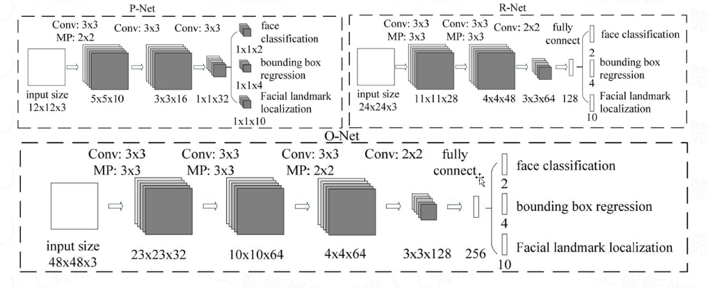

- P-Net

1. 输入12 * 12 * 3

1. 卷积核3 * 3 * 10，最大池化2 * 2，输出5 * 5 * 10

1. 卷积核3 * 3 * 16，输出3 * 3 * 16

1. 卷积核3 * 3 * 32，输出1 * 1 * 32

1. 输出

1. 卷积核1 * 1 * 2，输出人脸分类

1. 卷积核1 * 1 * 4，输出边界框回归

1. 卷积核1 * 1 * 10，输出面部标志定位

- R-Net

1. 输入24 * 24 * 3

1. 卷积核3 * 3 * 28，最大池化3 * 3，输出11 * 11 * 28

1. 卷积核3 * 3 * 48，最大池化3 * 3，输出4 * 4 * 48

1. 卷积核2 * 2 * 64，输出3 * 3 * 64

1. 全连接，输出128

1. 输出

1. 全连接，输出2，输出人脸分类

1. 全连接，输出4，输出边界框回归

1. 全连接，输出10，输出面部标志定位

- O-Net

1. 输入48 * 48 * 3

1. 卷积核3 * 3 * 32，最大池化3 * 3，输出23 * 23 * 32

1. 卷积核3 * 3 * 64，最大池化3 * 3，输出10 * 10 * 64

1. 卷积核3 * 3 * 64，最大池化2 * 2，输出4 * 4 *6

1. 卷积核2 * 2，输出3 * 3 * 128

1. 全连接，输出256

1. 输出

1. 全连接，输出2，输出人脸分类

1. 全连接，输出4，输出边界框回归

1. 全连接，输出10，输出面部标志定位

### 9 MTCNN基本使用流程

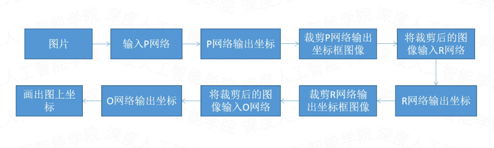

### 10 MTCNN知识点

#### 10.1 图像金字塔

- 目标检测选择建议框的两种方法：

1. 图像不变，建议框改变

1. 建议框不变，图像改变

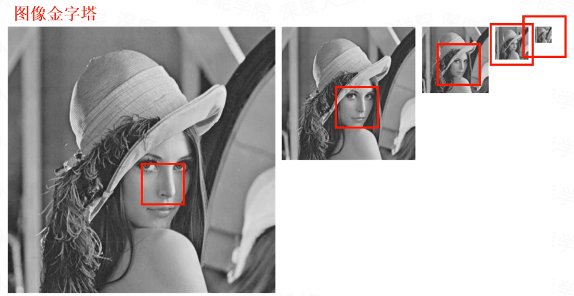

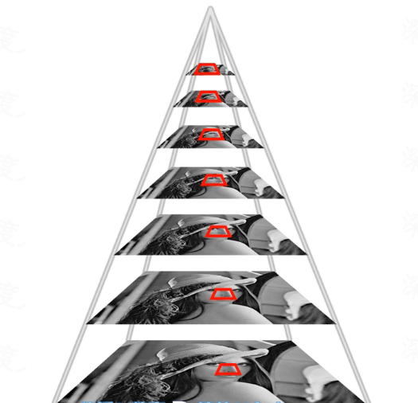

图片等比例缩放，滑动12 * 12的建议框。

- 为何会出现重复框？

1. P-Net置信度低，误判率比较高

1. 图像金字塔，缩放前后均包含重复人脸

1. 卷积，卷积步幅小导致包含重复人脸

#### 10.2 IoU

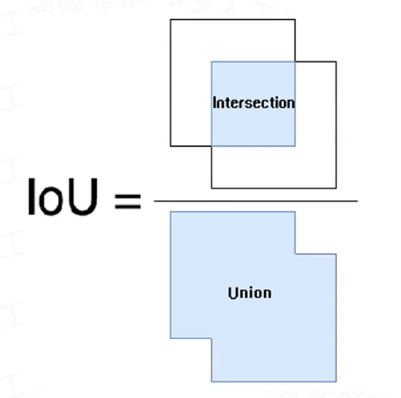

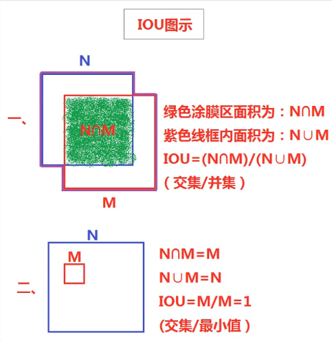

当大框套小框时，会导致IoU值比较小无法丢掉的情况，所以在大框套小框时，使用交集/最小值来丢掉重复框，一般只应用在O-Net。

#### 10.3 NMS

> NMS（Non-Maximum Suppression）：非极大值抑制，顾名思义就是抑制不是极大值的元素，可以理解为局部最大值搜索。

- NMS的计算

1. 按置信度排序

1. 取出置信度最大的框

1. 用最大的框跟剩余的所有的框做IoU

1. 在剩余的框中，重复1、2、3操作

#### 10.4 图像正方形转换

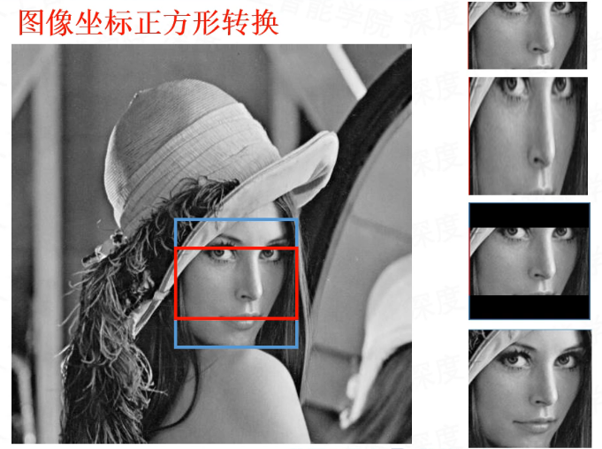

为了给R-Net（24 * 24）和O-Net（48 * 48）提供输入，需要将非正方形的建议框转换成正方形后再进行缩放。

#### 10.5 图像坐标反算

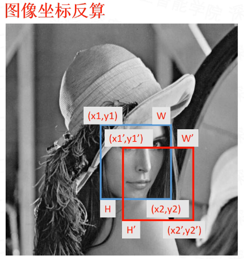

> offsetx₁ = (x₁-x₁′)/w′，x₁ = offsetx₁ × w′ + x₁′offsety₁ = (y₁-y₁′)/h′，y₁ = offsety₁ × h′ + y₁′offsetx₂ = (x₂-x₂′)/w′，x₂ = offsetx₂ × w′ + x₂′offsety₂ = (y₂-y₂′)/h′，y₂ = offsety₂ × h′ + y₂′

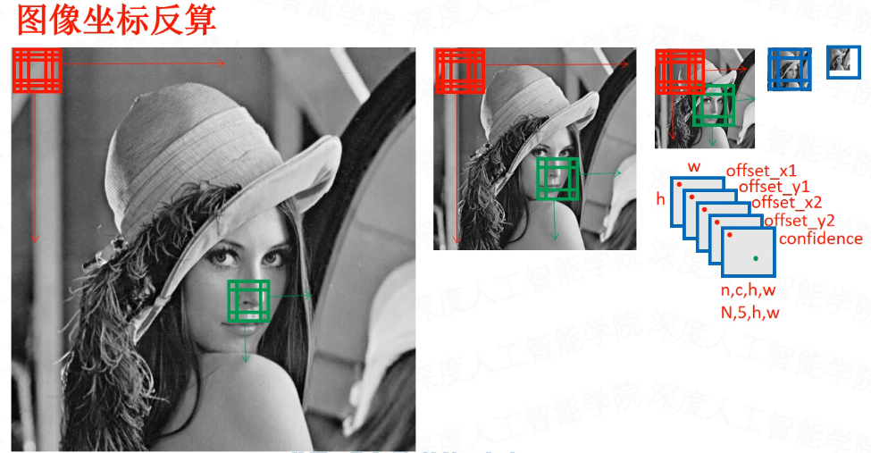

> N（Batch）：批量大小，表示这批图像有几张C（Channel）：特征图通道数，表示通道数（例如黑白=1，RGB=3）H（Height）：特征图的高，表示图像在竖直方向有多少像素W（Height）：特征图的宽，表示图像在水平方向有多少像素

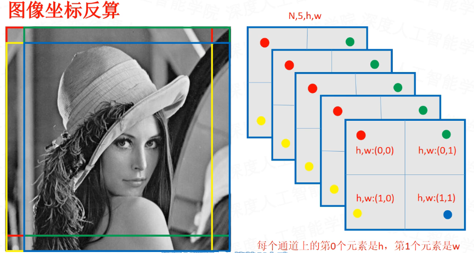

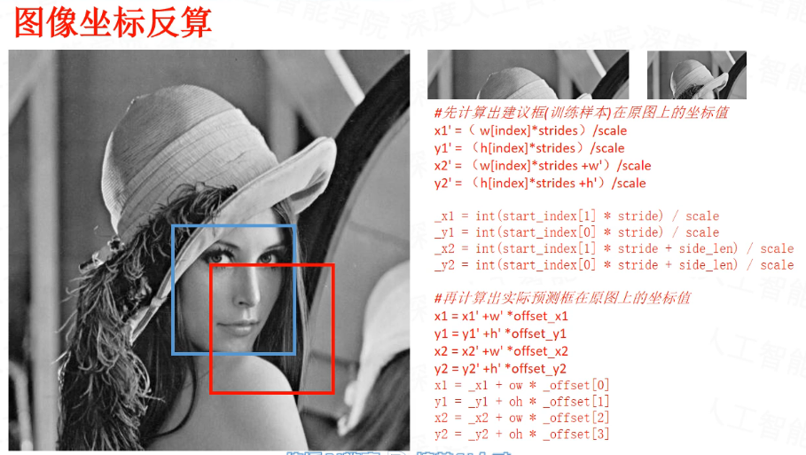

### 10.6 级联卷积

- 级联的意思

级联的意思就是指使用多个工具做一件事情，好比流水线工作，各个工作环节首尾相连，最终获得了一个完整的工作链。

- 级联的作用

级联卷积的作用主要体现在使用网络的时候，P-Net的输出经过处理之后，输入R-Net，R-Net的输出经过处理之后，输入O-Net，O-Net的输出处理之后，做为最终的输出结果。

- 级联的思想

级联的思想就是将复杂的任务进行分解，将要解决的复杂问题，转化成若干简单的问题，提高处理问题的效率和效果。

在训练三个网络的时候，是可以同时训练的，因为三个网络的样本不一样。

### 11 MTCNN详细使用流程

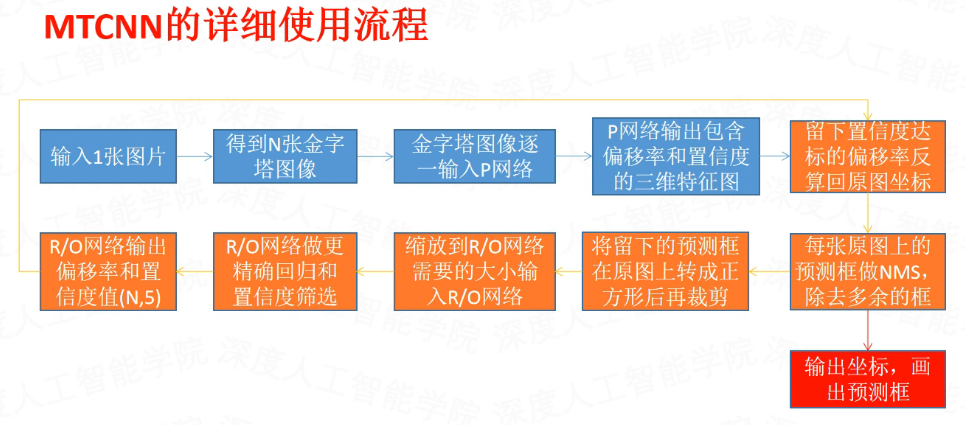

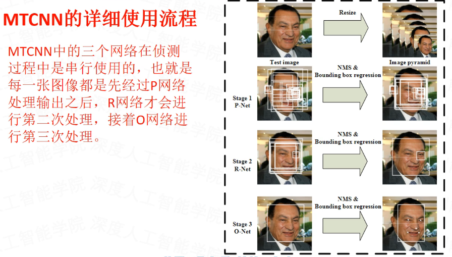

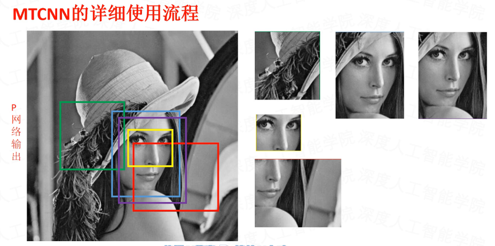

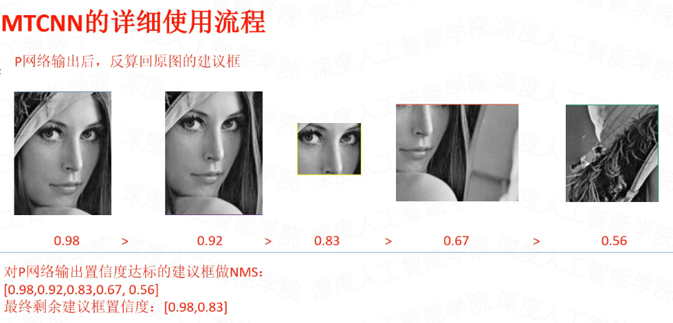

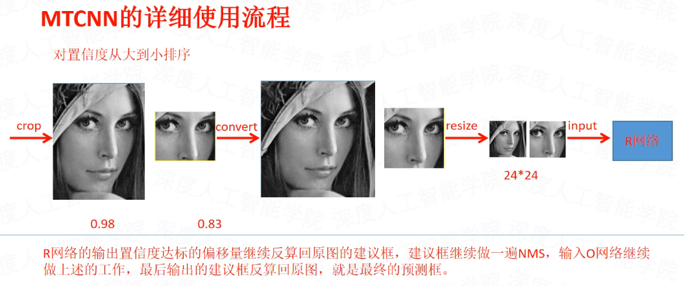

### 12 MTCNN的优缺点

- 优点

1. 设备要求低：使用了级联思想，将复杂问题分解，使得模型能够在小型设备上运行。

1. 容易训练：三个级联网络都较小，训练模型时容易收敛。

1. 精度较高：使用了级联思想，逐步提高精度。

- 缺点

1. 误检率较高

1. 原论文模型还有优化空间