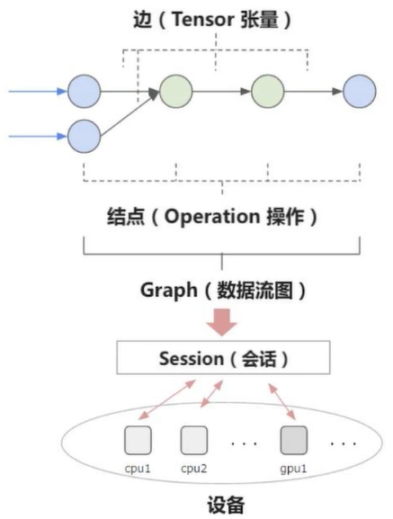
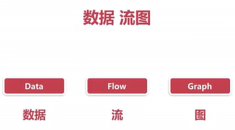
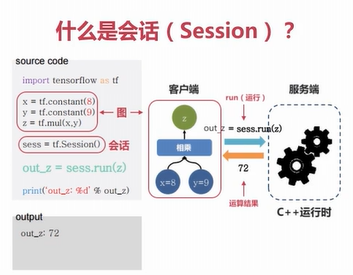
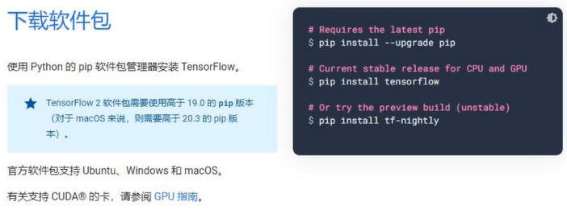

### 1. 前言

在开始深度学习项目之前，选择一个合适的框架是非常重要的，因为选择一个合适的框架能起到事半功倍的作用。研究者们使用各种不同的框架来达到他们的研究目的。

目前流行框架有tensorflow、keras、torch/pytorch、caffe/caffe2（贾扬清和伯克利人工智能实验室）、deeplearning4j（基于java，效率高，不支持python，社区不完善）、theano（框架鼻祖，蒙特利尔大学）、MXNet（亚马逊）、CNTK（微软，已经不更新项目）。

国内有飞桨（百度）、X-Deep Learning（阿里）、优图NCNN（腾讯）、MindSpore（华为）、天元（旷世）、parrots（商汤）、BytePS（字节跳动）、jittor（清华计图）。

至于选择哪个框架来学习，注意是看学习的目的是什么，但是无论是什么目的，一般都有一个共同的特点，那就是该框架使用人数较多，只有使用人数较多的框架和库，才有更多的开发者去维护，才会让该框架和库的生态逐渐完善。

一般来说学习深度学习，一般可以分为两个方向，第一个方向是学术界，第二个方向是工程界。在2018年以前，一般学术界人士使用pytorch的人数排名第一，工业界人士使用tensorflow的人数排名第一。但在2018年以后google公司推出了tensorflow2.x版本之后，和原来的tensorflow1.x版本彻底断代了，抛弃了1.x时代的静态图结构，启用了和pytorch一样的动态图结构，而pytorch也融合了很多tensorflow的工业部署的方法，比如分布式部署、使用tensorboard可视化模型等等，总之两家互相借鉴之后，他们的界限逐渐开始模糊起来，反正目前pytorch的使用总人数已经和tensorflow平分天下了，其他各家的框架占比都比较小，国内占比较大的属于百度的飞桨。

### 2. tensorflow的简介

#### 2.1 发展历史

从google内部使用到开源，tensorflow最初由google大脑小组的研究院和工程师们开发出来，用于机器学习和深度神经网络方面的研究，google公司在2015年9月开源了tensorflow框架。



#### 2.2 原理结构

整体分为图和会话两部分。tensorflow属于数据流图结构，先创建静态图结构，然后在会话中传入数据。因为图只是数据流向的一种表达方式，并没有具体的数值，所以在图中无法使用逻辑结构代码（循环、判断），只能查看图结构上每个节点设置好的形状和类型，没有具体数据。tensorflow之所以是静态图结构就是因为无法使用流程/条件控制语句，它只会自上而下的流动，不回去做循环和判断。所以部署起来非常方便，但是编写和调试起来非常麻烦，不适合新手。而pytorch的编写就像python语句语义，可以随意增加流程控制语句。



会话就是启动图结构，然后让数据流入图中，按照图的流动方式处理数据，最后得到结果。所以在会话中，图和数据结合到一起了，和普通编程一样，可以使用逻辑语句代码，也可以查看数据。



#### 2.3 优缺点

- 优点

    由于tensorflow是谷歌开发的深度学习框架，因此它能够使用一些谷歌的资源，比如TPU，有谷歌开发者提供的大量的开源库等等，此外，tensorflow具有分布式训练方式，以及可视化方法，是tensorflow在大型工业级应用部署上比较有优势。

- 缺点

    由于tensorflow是静态图的机构，普通编程人员很难上手，学习成本较高，虽然静态的代码在部署使用的时候比较有优势，但是在一般编程和训练调参的时候不够灵活，增加了一般开发人员的时间和精力。

### 3. tensorflow的1.X系列安装

#### 3.1 安装CPU版本

- 安装最新版本

    ```shell
    pip install tensorflow
    ```

- 安装指定版本

    ```shell
    pip install tensorflow==1.14.0
    ```

    tensorflow当前1.X版本最高支持python3.7，默认的python3.7以上版本是不能安装的。

    ```shell
    conda create -n minicodan_python37 python=3.7 //在虚拟环境中，使用该命令创建一个新的环境
    acitvate miniconda_python37 //激活当前新建的虚拟环境
    pip install --upgrade tensorflow==1.14.0 -i 
    ```

    打开pycharm后，设置环境，将当前环境中的python.exe替换为虚拟环境中的python.exe即可。

    由于miniconda只是一个较为纯净的python环境，并没有太多的第三方库，比如numpy、matplotlib、PIL等第三方库都需要在当前python3.7的虚拟环境中重新安装一次，安装时注意，一定要安装和当前python版本对应的第三方库版本，比如matplotlib历史版本的地址是[https://pypi.org/project/matplotlib/#files](https://pypi.org/project/matplotlib/#files)，找到python3.7所对应的matplotlib版本下载到本地，进行离线安装即可。

#### 3.2 安装GPU版本

- 安装最新版本

    ```shell
    pip install tensorflow-gpu
    ```

- 安装指定版本

    ```shell
    pip install tensorflow-gpu==1.14.0
    ```

    清华开源镜像站的各版本tensorflow的安装地址（包括了1.X和2.X版本）：[https://pypi.tuna.tsinghua.edu.cn/simple/tensorflow/](https://pypi.tuna.tsinghua.edu.cn/simple/tensorflow/)

    GPU版本的安装步骤和CPU版本的安装方法一样，由于本机的环境是适配了pytorch的，如果安装的是1.X版本系列，需要配置虚拟环境，到虚拟环境中安装才可以使用。

#### 3.3 安装注意事项

- 安装tensorflow的时候，会默认安装对应版本的tensorboard，会覆盖以往的tensorboard版本。

- 安装GPU版本需要安装对应版本的cuda，否则无法使用GPU版本的tensorflow。

### 4. tensorflow的2.X系列安装

```
pip install --upgrade pip
pip install tensorflow
pip install tf-nightly
```



tensorflow2.X系列历史版本地址：[https://tensorflow.google.cn/install/pip?hl=zh-cn](https://tensorflow.google.cn/install/pip?hl=zh-cn)

最新版本地址：[https://pypi.org/project/tensorflow/#files](https://pypi.org/project/tensorflow/#files)