### 1 人脸识别的步骤

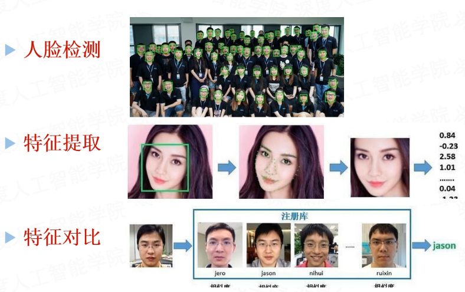

### 2 人脸识别的难点

- 不同人脸类别之间的界限不是很明显

- 脸与脸之间相似度很高，有时候人类都难以区分

- 如何解决人脸特征分类困难的问题？

- 使用神经网络做人脸分类，难点在哪里？模型？损失函数？

### 3 SoftMax和SoftMax Loss

#### 3.1 SoftMax Loss的使用

通过SoftMax函数可以将多分类的输出值转换为范围在[0,1]和为1的概率分布。

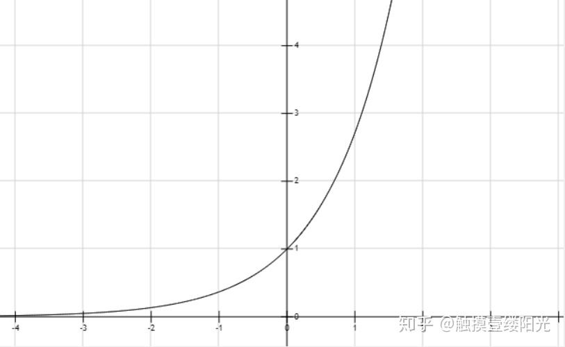

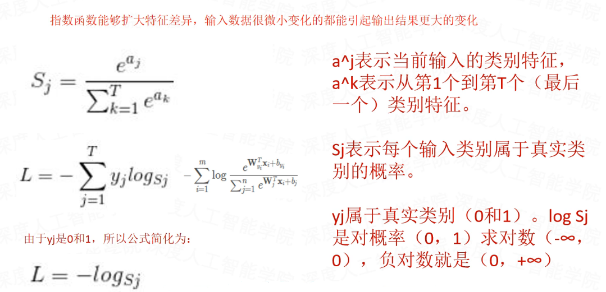

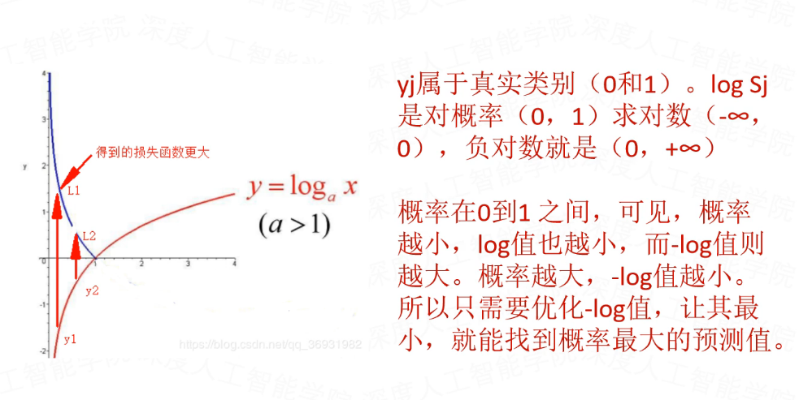

#### 3.2 SoftMax Loss的缺点

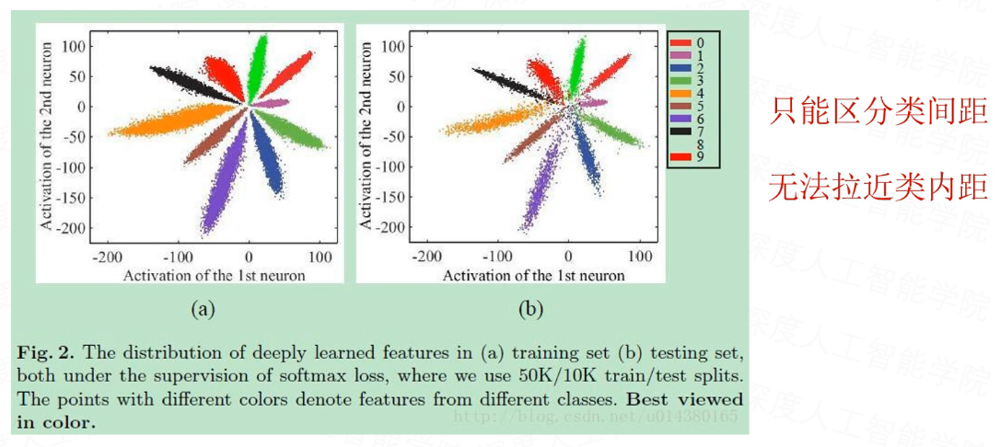

### 4 Center Loss

#### 4.1 Center Loss的使用

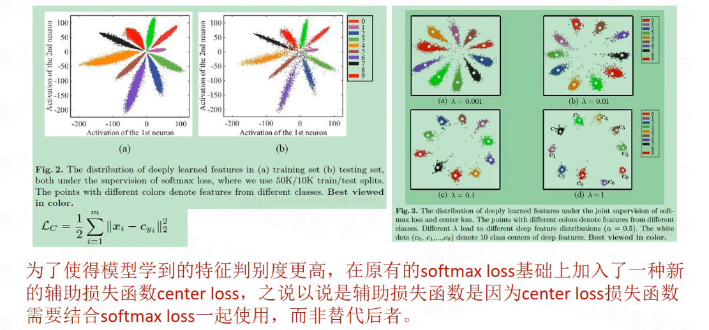

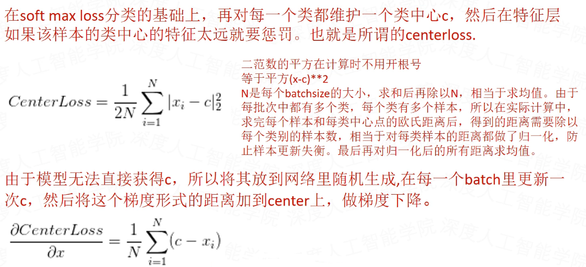

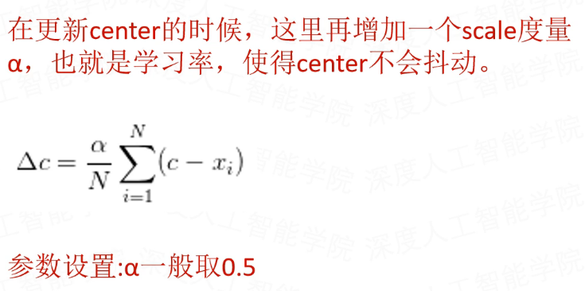

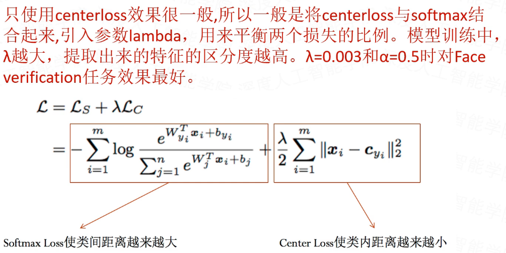

#### 4.2 Center Loss的缺点

1. 类别较多时，对硬件要求较高

由于Center Loss为每个类别需要保留一个类别中心，当类别数量很多（大于10000）时，内存、CPU消耗非常的大。

1. L2范数的离群点对loss的影响较大

由于Center Loss是基于L2范数约束的损失函数，如果某个类别的某个离群点较远，会导致损失下降困难，同样由于损失计算的是均值或和，即使整体损失下降，个别的离群点仍然里中心很远。

1. 个别类内距太大

从MNIST数据实验中可以看到，每一类特征占据的空间较大，如果类别过多，就无法清楚的区分每个类别。

1. 只适合同类样本差异不大的数据

属于一个陷阱，不一定适合所有场景。一般来说，如果同一类样本很类似，如MNIST手写数字，人脸数据，那么Center Loss往往能够带来效果提升。而如果本身同一类样本就差异很大，如cifar100，那么则不一定。也可以理解成一个人的一堆脸取平均值仍然是他的脸，而一群不同的狗取平均值则可能难以认出是什么。

### 5. ArcSoftMax Loss

衡量两个向量的相关性，也就是在计算两个向量之间的差异，差异越小相关性就越大。在实际场景中，比如人脸识别，我们可以将用户的一张人脸照片提取一组特征，和下一次的照片提取的特征进行比较，通过比较得出的差异值来判断是否为同一个人。

衡量向量相关性差异的表示方法有很多，一般分为距离表示方法和相似度表示方法。这里只介绍一下欧式距离和余弦相似度。欧式距离是最常见的距离度量，而余弦相似度则是最常见的相似度度量，很多的距离度量和相似度度量都是基于这两者的变形和衍生。

#### 5.1 欧氏距离

距离度量用于衡量个体在空间上存在的距离，距离越远说明个体间的差异越大。欧氏距离（也叫欧几里得距离）是最常见的距离度量，衡量的是多维空间中各个点之间的绝对距离。

因为计算是基于各维度特征的绝对数值，所以欧氏距离需要保证各维度指标在相同的刻度级别，比如对身高（cm）和体重（kg）两个单位不同的指标使用欧氏距离可能结果失败。

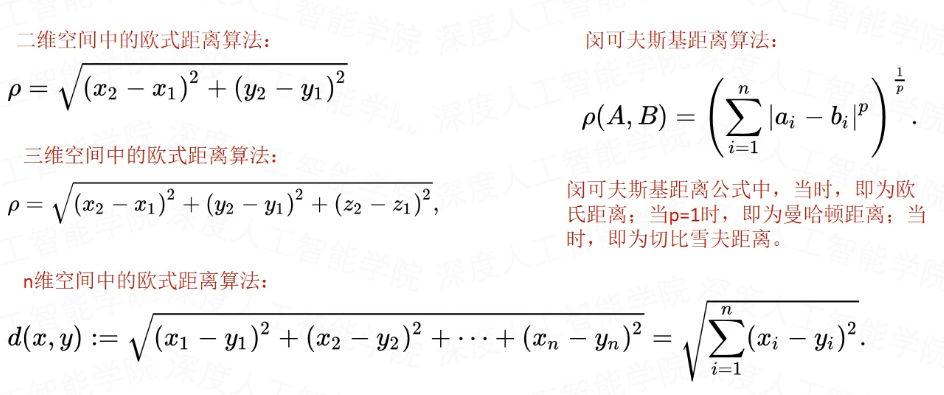

#### 5.2 曼哈顿距离

曼哈顿是一个极为繁华的街区，高楼林立，街道纵横，从A地点到达B地点没有直线路径，必须绕道，而且至少要经过C地点，走AC和CB才能到达，由于街道很有规则，ACB就像一个直角三角形，AB是斜边，AC和CB是直角边，根据毕达哥拉斯定理，或者向量理论，都可以知道用AC和CB可以表达AB的长度。

在早期的计算机图形学中，屏幕是由像素构成，是整数，点的坐标也一般是整数，原因是浮点运算很昂贵，很慢而且有误差，如果直接使用AB的距离，则必须要进行浮点运算，如果使用AC和CB，则只要计算加减法即可，这就大大提高了运算速度，而且不管累计运算多少次，都不会有误差。因此，计算机图形学就借用曼哈顿来命名这一表示方法。

在我们常用的平面CAD中，都会有格点，他是基本单位，定义了格点大小后，就可以使用整数来表示和运算，不会引入计算误差，又快又精确。

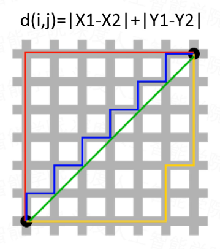

#### 5.3 余弦相似度

余弦相似度用向量空间中两个向量夹角的余弦值作为衡量两个个体间差异的大小。相比距离度量，余弦相似度更加注重两个向量在方向上的差异，而非距离或长度上。

两个向量最大正相关为0度，相似度为1，最大负相关为180度，相似度为-1，不相关为90度，相似度为0，两个向量之间的角度越小，相似度系数越大，两个向量越相关，反之，角度越大，相似度系数越小，越不相关。

所以，要区分两个向量，最好的办法是增大角度θ+m，或者减小相似度系数cos(θ)-m。

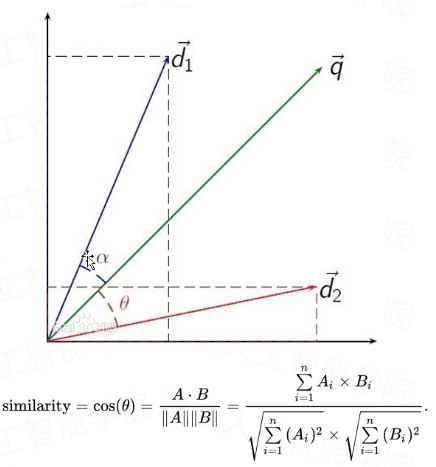

余弦相似度通常用于正空间，因此一般的值为0到1之间。这个界限对任意维度的向量空间都适用，而且余弦相似度最常应用于高维正空间。它通常应用于文本挖掘中的文件比较，另外，在数据挖掘领域，常用来度量集群内部的凝聚力。

余弦距离就是用1减去我们的余弦相似度。余弦相似度的取值范围是[-1,1]，方向相同的两个向量之间的相似度是1，余弦距离的取值范围是[0,2]

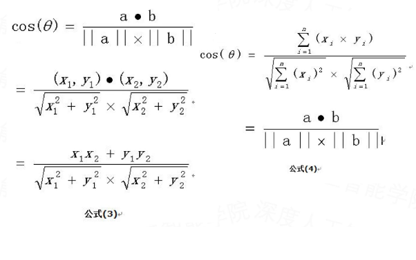

#### 5.4 余弦相似度和欧氏距离的区别

两个向量的余弦相似度不能代替两个点的距离，距离越小，相似度越大，但是相似度越大，距离不一定越小。

从图上可以看出距离度量衡量的空间各点间的绝对距离，跟各个点所在的位置坐标（即个体特征维度的数值）直接相关；而余弦相似度衡量的是空间向量的夹角，更加的是体现在方向上的差异，而不是位置。

如果保持A点的位置不变，B点朝原方向远离坐标轴原点，那么这个时候余弦相似度cosθ是保持不变的，因为夹角不变，而A、B两点的距离显然在发生改变，这就是欧氏距离和余弦相似度的不同之处。

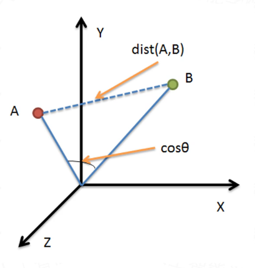

根据欧氏距离和余弦相似度各自的计算方式和衡量特征，分别适用于不同的数据分析模型：

- 欧氏距离能够体现个体数值特征的绝对差异，所以更多的用于需要维度的数值大小中体现差异的分析，如使用用户行为指标分析用户价值的相似度或差异。

- 余弦相似度更多的是从方向上区分差异，而对绝对的数值不敏感，更多的用于使用用户对内容评分来区分用户兴趣的相似度和差异，同时修正了用户间可能存在的度量标准不统一的问题（因为余弦相似度对绝对数值不敏感）。

用户对内容评分，按5分制，X和Y两个用户对两个内容的评分分别为(1,2)和(4,5)，使用余弦相似度得到的结果是0.98，两者极为相似。

但从评分上看X似乎不喜欢2这个内容，而Y则比较喜欢，余弦相似度对数值的不敏感导致了结果的误差，需要修正这种不合理性就出现了调整余弦相似度，即所有维度上的数值都减去一个均值。

比如X和Y的评分均值都是3，那么调整后为(-2,-1)和(1,2)，再用余弦相似度计算，得到-0.8，相似度为负值并且差异很大，但显然更加符合现实。

#### 5.5 余弦相似度和欧氏距离等价性

标准化后的两个向量，他们的欧氏距离的平方与余弦距离成正比，标准化后的向量间的区别主要体现在方向上。

重要结论：余弦相似度在某种程度上与l2标准化的欧氏距离相同。

#### 5.6 回顾SoftMax函数

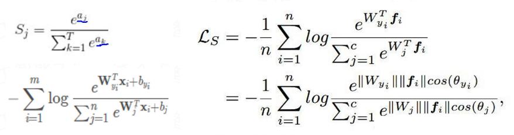

SoftMax的目标是尽可能最大化正确分类的概率，它会忽略掉一些比较难分辨的图片（也就是低质量的图片），而优先拟合高质量的图片。因此把特征强行归一化会使得低范数的图片变得高范数，也会获得更多的网络的注意力。

可以发现，只在相似度上做变化，跟||w||与||f||无关系，所以可以直接将这两者归一化，相当于单位向量。

#### 5.7 L-SoftMax Loss

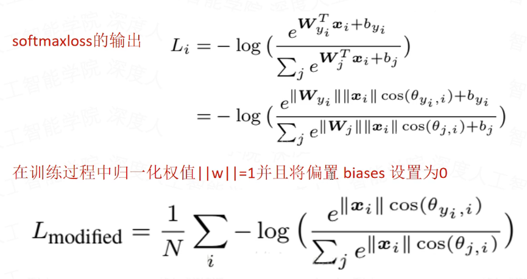

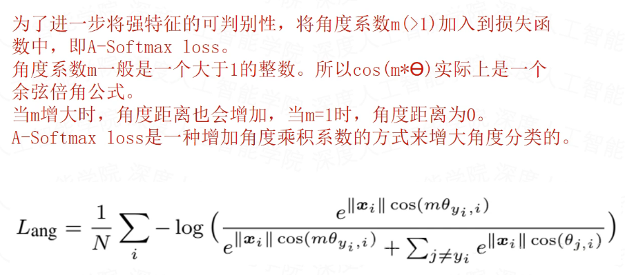

### 5.8 AM-SoftMax Loss

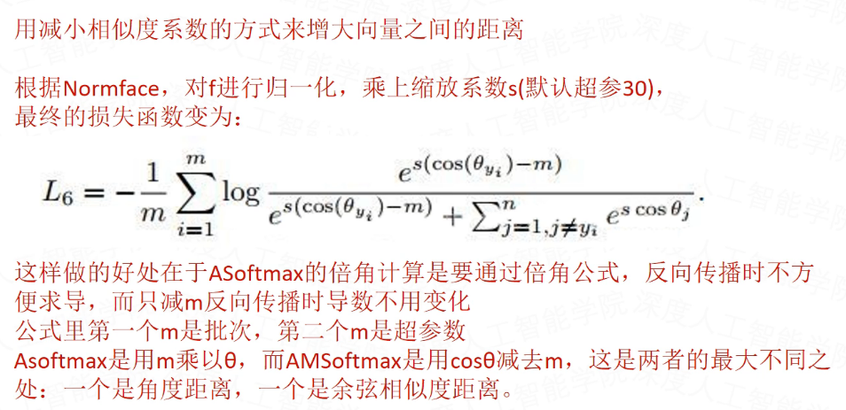

#### 5.9 ArcSoftMax Loss（ArcFace Loss）

根据cos的性质，优化角度距离比优化余弦距离更有效果，因为余弦距离相对密集。

公式里第一个m是批次，第二个m是超参数。

增大角度比减小相似度距离对分类的影响更加直接，所以可以改为直接增加角度的方式。

注意：反三角余弦计算出来的是弧度，而非角度。所以实际增加的m也是增加的弧度。

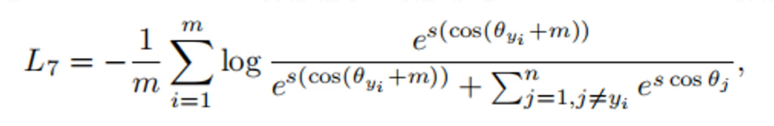