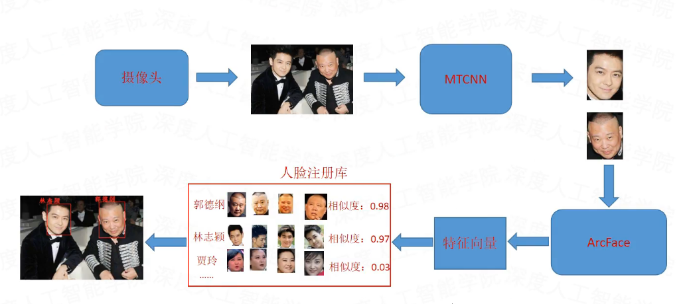

### 1 人脸识别的概念

- 人脸识别的解释

    人脸识别，是基于人的脸部特征信息进行身份识别的一种生物识别技术。用摄像机或摄像头采集有人脸的图像或视频流，并自动在图像中检测和跟踪人脸，进而对检测到的人脸进行脸部识别的一系列相关技术，通常也叫做人像识别、面部识别。

- 人脸识别出现的时间及影响

    人脸识别系统的研究始于20世纪60年代，80年代后随着计算机技术和光学成像技术的发展得到提高，而真正进入初级的应用阶段则在90年后期，并且以美国、德国和日本的技术实现为主。

- 目前人脸识别在AI领域的地位

    从应用程度来说，人脸识别项目是目前落地应用中最广泛的人工智能技术之一。但是从实现技术和难度上来说，人脸识别仍然是行业内具有一定难度的项目。尤其是对于精确度的提高方面，以及陌生人识别方面。

### 2 人脸识别的应用

- 确认：这是人脸图像与数据库中已存在的该人图像比对的过程，回答你是不是你的问题（即通常所说的1：1比对），比如手机解锁。

- 辨认：这是人脸图像与数据库中已存在的所有图像匹配的过程，回答你是谁的问题（即通常所说的1：N比对），比如考勤打卡。

### 3 人脸识别的流程

1. 人脸检测

1. 特征提取

1. 特征比对

### 4 实现仍连识别的方法

1. 早期的机器学习方法

    检测：haar特征、Adaboost算法、OpenCV

    提取：LBP……

1. 现在常用的深度学习方法

    Rcnn+svm系列

    Yolo+centerloss（arcfaceloss）

    Mtcnn+centerloss（arcfaceloss）

    PCN、RetinaFace、version-slim、version-RFB，……

### 5 MTCNN+ArcFaceLoss实现人脸识别

1. 训练一个特征提取器

    - 创建特征提取网络

    - 准备训练数据集

    - 设计合理的目标函数

    - 训练网络使网络获得人脸特征提取的能力

1. 创建人脸特征标签库

    - 通过mtcnn网络获取当前图像中的人脸框

    - 将获取的人脸框传入特征提取器提取人脸特征

    - 将每个人脸标签和人脸特征作为一组特征值保存到人脸特征库

1. 获取目标人脸特征

    - 通过mtcnn网络获取当前画面中的所有人脸框

    - 将获取的所有人脸框传入特征提取器提取人脸特征

1. 对比人脸特征

    - 将从当前画面获取到的每个人脸特征和人脸特征库的人脸特征一一比对，这是多对多的交叉比对过程。

    - 如果当前画面中的人脸特征和人脸特征库中的人脸特征的相似度最大值大于所设阈值，则认为当前画面中的人脸和人脸库中正在对比的人脸是同一个人脸。

    - 如果当前画面中的人脸特征和人脸特征库里的人脸特征的相似度最大值小于所设阈值，则认为当前画面中的人脸和人脸库中正在对比的人脸不是同一个人脸。

    - 在条件允许的情况下，每个人的人脸标签图像至少是3张以上，这样相当于每个人的人脸特征不止一组，这种情况下对比特征的时候可以把同一个人脸的多组特征拼接成一组来提高人脸对比的精度。

### 6 视频人脸识别的过程

- 关于视频人脸识别在实际使用过程中，对于人脸特征的比对是基于连续帧画面的目标特征提取和对比得出的结果。

- 所以实际应用中，只要某一帧画面中的目标被认为是人脸库的某个人脸，就可以认为完成对这个人的识别。

- 作为标签的人脸采集不只是一张人脸的图像特征，而是在相同的光度下对每个标签人脸的各个方位不同表情都进行采集，这样就相当于采集了一个人的各个角度的不同表情的人脸特征，最后拼接同一个人脸标签下的不同特征，从而提高了对这个人的识别率。

### 7 人脸识别的训练数据集

- 训练数据集

    1. VGG-Face 2

    1. MS-Celeb-1M

- 验证数据集

    1. LFW

    1. CFP

    1. AgeDB

- 测试数据集

    1. MegaFace

    1. FDDB

### 8 人脸识别训练模型选择

- MobileNet

- ResNet

- DenseNet

- ShuffleNet

### 9 人脸识别的安全问题

1. 可识别特征减少带来的安全性问题

    新冠病毒肺炎大流行期间，佩戴口罩是很常见的行为。这种情况下，用户还能使用面部识别功能解锁自己的只能手机吗？

    目前，大多数面部识别算法可以识别出佩戴口罩的用户。但是，由于部分面部被遮挡，所以2D和3D识别系统赖以评判的特征有所减少。这使得欺骗的成功率得以相应的提高。如果用户不想牺牲安全性，则可以使用其他身份验证技术，但这可能会影响用户体验。

1. 3D打印技术带来的安全性问题

    我们知道在人脸识别应用场景中，人脸图像扮演着密码这一角色，密码可以破解，人脸也不例外。伴随着人脸识别技术广泛应用于刷脸认证、刷脸支付等场景，各种破解人脸识别系统的新闻不断涌现。iPhone X搭载的3D结构光活体检测被称为当前安全系数最高的人脸识别检测技术，但2017年，一家越南公司通过3D打印面具成功骗过了苹果的Face ID，实现了解锁。

1. 对抗样本带来的安全性问题

    近年来机器学习领域兴起另一种热门方法——对抗样本，通过添加肉眼察觉不到的噪音欺骗神经网络，让识别系统出错，是一种诱导识别算法的图像补丁。RealAI安全研究团队实现了基于对抗样本技术破解人脸解锁的案例。RealAI团队在商用手机上成功实现破解，攻击难度更上一个台阶，是世界范围内首个在现实世界中实现黑盒攻击的团队。

1. 信息隐私带来的安全性问题

    高校教室里安装人脸识别系统对学生课堂听讲情况的全程监控，任何动作都逃不过人脸识别系统的法眼。这不仅侵犯学生的个人隐私，背后的信息去向更为人担忧。

    目前很多高校信息化程度高、信息化意识也较强，拥有自己的数据中心，校内的识别系统采集到数据会存储在学校的服务器。但如果是普通的幼儿园、小学等单位，数据有可能是被存储至厂商处，最终数据会流向何处难以得知。这些单位往往只是觉得人脸识别是比较流行的一种方式，但对背后的信息安全缺乏概念。

1. 反人脸识别带来的安全性问题

    反人脸识别技术商业化，被人利用来做坏事的机会，实在太高了。比如，某些人可以放心的去看张学友的演唱会，而不用担心被抓了。

    如果被心怀不轨的人使用，这种反人脸识别技术有可能成为一种AI病毒。比如，不法黑客将这种技术用于无人驾驶，车子识别不了人，直接就开过去了。