### 1. 对象生成AE（Auto Encoder）

#### 1.1 自编码网络的介绍

##### 1.1.1 自编码网络模型

什么是自编码？所谓自编码就是让输入数据自己给自己编码，简单来说就是让输出等于输入，但不完全等于输入。

比如重铸的过程：

1. 原器具（数据）

1. 输入铸造设备（模型）

1. 打压成碎块（特征提取，碎块越小，新器具造的越好，也就是特征维度越高，特征提取的越好）

1. 重塑器具（使用特征生成原数据）

1. 新器具（输出）

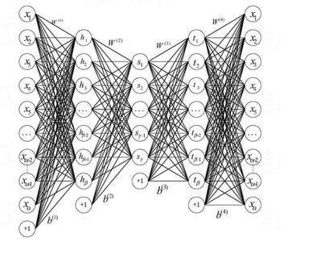

##### 1.1.2 自编码网络结构

自编码网络的本质是图像的压缩再还原的过程，反映到图像上就是图像的编码部分和解码部分

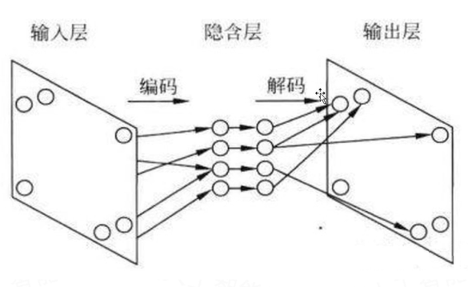

##### 1.1.3 自编码网络运行过程

自编码的过程就是网络先将输入的图像大小压缩到一定的范围（隐藏层），然后再还原到原来大小的过程，在这个过程中间，图像的大小是可以被还原的。

当然自编码的隐藏层可以比输入层的神经元个数还多，然后我们可以在神经网络的损失函数构造上，加入正则化约束项进行稀疏约束，这个时候就演化成了稀疏自编码了。

如果不加正则化约束，会出现什么情况？模型学习不到任何东西。意味着输出数据不会发生任何噪声变化，完全和输入数据一样。一般做自编码是为了增加数据的多样性，比如增加样本。

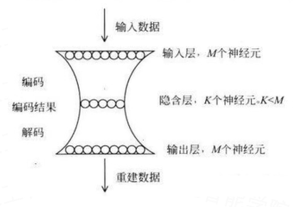

#### 1.2 自编码网络的作用

##### 1.2.1 使用自编码的原因

1. 提取主要特征数据作为模型的输入，以减小计算量。

    当神经网络要输入大量的信息，比如高清图片的时候，输入的图像数量可以达到上千万，要神经网络直接从输入的数据中进行学习，计算量非常巨大，参数众多，是一件非常费力不讨好的工作（计算量大，冗余信息过多，不利于网络学习）。

    因此我们对输入数据进行了压缩，提取出原图片中最具有代表性的信息，缩减输入中的信息量，然后在把缩减过后的信息放入到神经网络中学习，这样学习起来就变得轻松了，所以自编码就是能在这个时候发挥作用。（RCNN就是从原图聚类框侦测变成从特征图聚类框侦测）

1. 增加数据的多样性

    众所周知，神经网络的学习依赖于大量的具有多样性的数据，如果数据较少的话，神经网络很难学习到理想的结果。这个时候就需要更多的数据来参与训练。最好的办法就是增加训练样本，而且增加的样本和原来的样本之间最好有一些细微的变化，这样对于网络的泛化能力更好。自编码这时候就可以充当增加样本的角色。

##### 1.2.2 自编码的特点

自编码是一种非监督学习，通常我们在使用自编码的时候通常只会使用自编码的前半部分，这个部分也叫做编码器，编码器可以得到源数据的特征。然后我们只需要在创建一个小的神经网络模型再去学习这个特征中的数据，不仅可以减少神经网络的负担，并且同样可以达到一个很好的效果。

压缩依靠的是输入数据（图像、文字、声音）本身存在不同程度的冗余信息，自编码通过学习去掉这些冗余信息，把有用的特征输入到隐藏层中。这里和PCA有些类似，要找到可以代表源数据的主要成分。自编码通过隐藏层对输入进行压缩，并在输出层中解压缩，整个过程肯定会丢失信息，但是通过训练我们能够使丢失的信息尽量减少，最大化的保留其特征。

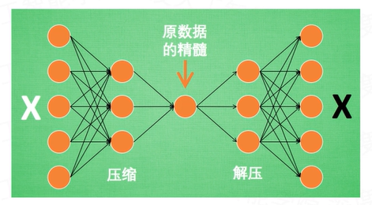

下图中，虚线蓝色框内就是一个自编码器模型，它由编码器和解码器两部分组成，本质上都是对输入信号做某种变换。编码器将输入信号x变换成编码信号y，而解码器将编码y转换成输出信号x'。即y=f(x)，x'=g(y)=g(f(x))。

自编码器的目的是，让输出x'尽可能复现输入x。如果f和g都是恒等映射（隐藏层特征大于输入层），那不就恒有x'=x？不错，但是这样的变换没有啥作用。因此，我们对中间信息号y做一定的约束，这样，系统往往能学出很有趣的编码变换f和编码y。

对于自编码，我们需要强调一点，我们往往并不关心输出是啥（反正只是复现输入），我们关心的是中间层的编码，或者说是从输入到编码的映射。可以这么理解，我们在强迫编码y和输入x不同的情况下，系统还能复原原始信号x，那么说明编码y已经承载了原始数据的所有信息，但以另一种形式表现。这就是特征提取，而且是主动学出来的。实际上，自动学习原始数据的特征表达式也是神经网络和深度学习的核心目的之一。

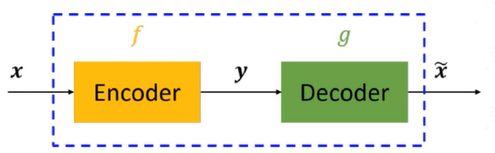

y=f(x)=s(wx+b)

x'=g(y)=s(w'y+b')

L(x,x')=L(x,g(f(x)))

其中L表示损失函数，结合数据的不同形式，可以是二次误差或者交叉熵误差。为了尽量学到有意义的表达，我们会给隐藏层加入一定的约束。

从数据维度来看，常见一下两种情况：

1. n>p，即隐藏层维度小于输入数据维度。也就是说从x到y的变化是一种降维操作，网络试图以更小的维度去描述原始数据而尽量不损失数据信息。实际上，当每两层之间的变换均为线性，且监督训练的误差是二次型误差时，该网络等价于PCA。

1. n<p，即隐藏层维度大于输入数据维度（无意义）。这里有一种情况，我们约束y的表达尽量稀疏（有大量维度为0，未被激活，增加正则化约束实现），此时的编码器便是稀疏自编码器。从特征的角度来说，稀疏的表达意味着系统在尝试特征选择，找出大量维度中真正重要的若干维度。

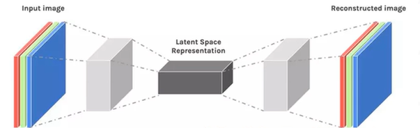

#### 1.3 自编码网络的类别

##### 1.3.1 普通自编码网络（Auto Encoder）

普通自编码网络也叫欠完备的自编码器，从自编码器获得有用特征的一种方法是限制h的维度比x小，这种编码维度小于输入维度的自编码器称为欠完备自编码器。学习欠完备的表示将强制自编码器捕捉训练数据中最显著的特征。

当解码器是线性的且L是均方误差，欠完备的自编码器会学习出与PCA相同的生成子空间。这种情况下，自编码器在训练来执行复制任务的同时学到了训练数据的主元子空间。

因此，拥有非线性编码器函数f和非线性解码器函数g的自编码器能够学习出更强大的PCA非线性推广。不幸的是，如果编码器和解码器被赋予过大的容量，自编码器会执行复制任务而捕捉不到任何有关数据分布的有用信息。

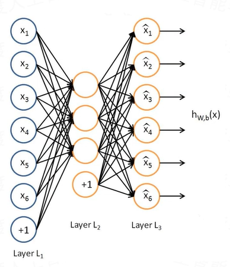

##### 1.3.2 稀疏自编码网络（Sparse Auto Encoder）

稀疏自编码的隐藏层神经元大于输入层神经元，下图中隐藏层中灰色的圆圈表示没有被激活的神经元。

之所以要将隐藏层稀疏化，是由于，如果隐藏层神经元的数量较大（可能比输入像素的个数还要多），不稀疏化我们无法得到输入的压缩表示。具体来说，如果我们给隐藏层神经元加入稀疏性限制，那么自编码神经网络即使在隐藏层神经元数量较多的情况下仍然发现输入数据中的一些有趣的结构。

为了满足隐藏层神经元的活跃度，将在优化目标中加入一个额外的惩罚因子，即正则项（L1、L2、dropout）。权重衰减和其他正则惩罚可以被解释为一个MAP近似贝叶斯推断，正则化的惩罚对于模型参数的先验概率分布。

当神经元的输出接近于1时认为其被激活，输出接近0时则认为被抑制，那么使得神经元大部分时间都是被抑制的现在被称为稀疏性抑制。

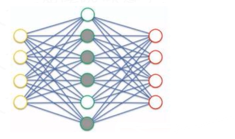

##### 1.3.3 降噪自编码网络（Denoising Auto Encoder）

人类具有认知被阻挡的破损图像识别能力，此源于我们高等的联想记忆感受机能。

我们能以多种形式去记忆（比如图像、声音、甚至如上图的词根记忆法），所以即便是数据破损丢失，我们也能回想起来。

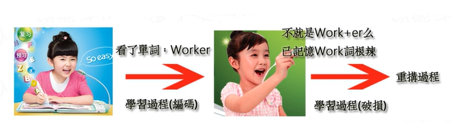

以一定概率分布（通常使用二项分布）去擦除（dropout）原始输入矩阵，即每个值都随机置0，这样看起来部分数据的部分特征是丢失了。

以这丢失的数据x'去计算y，计算z，并将z与原始x做误差迭代，这样，网络就学习了这个破损的数据。

这个破损的数据是很有用的，原因有二：

1. 其一，通过与非破损数据训练的对比，破损数据训练出来的噪声比较小。降噪因此得名，原因不难理解，因为擦除的时候不小心把输入噪声给擦除掉了。

1. 其二，破损数据一定程度上减轻了训练数据与测试数据的代购。由于数据的部分被拆除掉了，因而这破损数据在一定程度上比较接近测试数据。（训练、测试肯定有同有异，当然我们要求同舍异）。这样训练出来的鲁棒性就提高了。

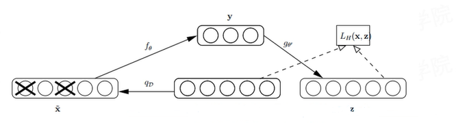

##### 1.3.4 收缩自编码网络（Contractive Auto Encode）

降噪自编码网络利用重构函数抵抗输入的微扰；

收缩自编码网络使用特征抽取函数来抵抗输入的微扰。

二者都是对输入的数据进行去噪，不同的是抽缩自编码器的鲁棒性体现在对隐藏层表达上，而去噪自编码器的鲁棒性体现在重构信号中。降噪自编码是普通的自编码，收缩自编码类似稀疏自编码（增加了正则项）。可以看作是降噪自编码+稀疏自编码

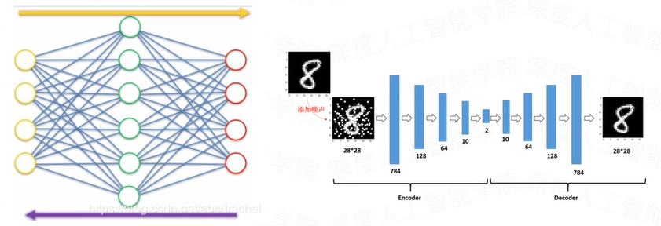

##### 1.3.5 堆叠自编码网络（Stacked Auto Encode）

顾名思义，堆叠自编码器就是多个自编码器级联，已完成逐层特征提取的任务，最终得到的特征更有代表性，并且维度很小。

堆叠自编码器的训练过程是，n个AE按顺序训练，第1个AE模型训练完后，将其编码器的输出特征作为第2个AE模型的输入数据，以此类推。最后得到的特征作为分类器的输入，完成最终的分类训练。

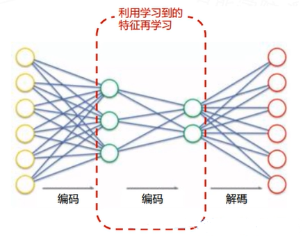

##### 1.3.6 深度自编码网络（Deep Auto Encode）

使用预先训练好的限制波兹曼机。

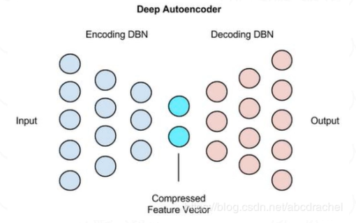

训练好多个编码器对应多个解码器构成的一个深度自编码器。

#### 1.4 自编码网络中的转置卷积

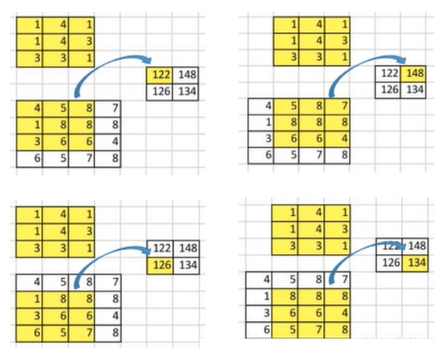

卷积的时候是将卷积核和对应输入矩阵中的9个值相乘，并且相加，将其转变为一个输出值。一个卷积操作是一个多对一的映射关系。

反过来操作，我们想要将输入矩阵中的一个值映射到输出矩阵的9个值，这将是一个一对多的映射关系。这个就像是卷积操作的反操作，其核心观点就是用转置卷积。

之所以叫转置卷积是因为，它其实是把我们平时所用普通卷积操作中的卷积核做一个转置，然后把普通卷积的输出作为转置卷积的输入，而转置卷积的输出，就是普通卷积的输入。

根据反卷积的数学含义，通过反卷积可以将通过卷积的输出信号，完全还原输入信号。转置卷积只能还原形状大小，而不能还原值。所以说转置卷积与真正的反卷积有点相似，因为两者产生了相同的空间分辨率。

转置卷积的过程中图像上采样，越来越大，通道越来越浅。需要注意的是，转置前后padding，stride仍然是卷积过程指定的数值，不会改变。

stride=1时的反卷积，不进行填充。

当stride>1时，需要在原输入中插入0像素值。

转置卷积一般会放大图像，也成为上采样过程，而卷积一般是缩小图像，也成为下采样过程。

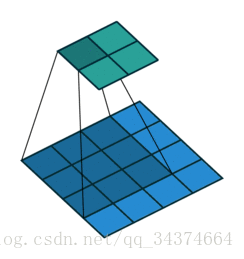

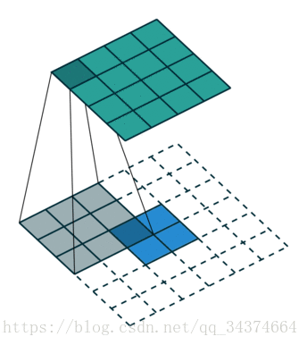

### 2. 对象生成VAE（Variational Auto Encoder）

#### 2.1 变分自编码的原理介绍

##### 2.1.1 自编码和变分自编码的关系

Auto Encoder的基本原理是通过编码器和解码器实现，与PCA类似，在卷积的Auto Encoder中，编码器通过卷积池化进行降维，解码器通过反卷积或反池化进行升维，目标是使输入和输出图片的差异性最小，这也使得自编码器生成的图片多与输入相似，无法生成新的图片。

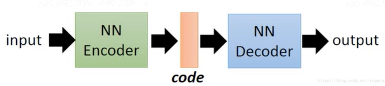

Auto Encoder本来就是为了尽可能拟合原始数据，但是一般的Auto Encoder在工程中只是被用来作为降维的手段，并不具备产生新的样本的功能，如果要生成新样本，那就是VAE（变分自编码）要解决的问题了。

##### 2.1.2 回顾自编码网络

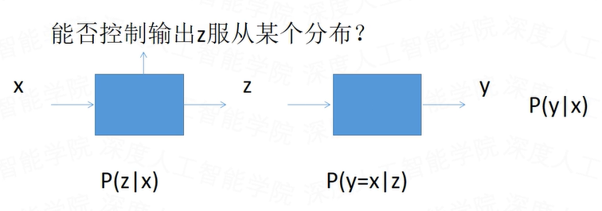

##### 2.1.3 分布变换的问题

假如我们有一批样本X，这个时候，我们想生成一批和它类似的样本X'，且分布相同，这个时候我们该怎么办呢？

1. 如果我们知道样本的分布的情况下，这个事情就好办了，先生成一批正态分布的样本，通过真实分布的具体形式与正态分布之间的关系，生成一批新的样本。

1. 如果我们不知道样本分布的情况下，是否可以通过一些方法得到类似的样本？

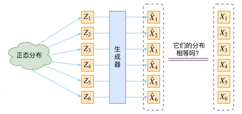

那现在假设Z服从标准的正态分布，那么我就可以从中采样得到若干Z1，Z2，……，Zn，然后对它做变换得到X1=g(Z1)，X2=g(Z2)，……，Xn=g(Zn)，我们怎么判断这个通过g构造出来的数据集，它的分布跟我们目标的数据集分布是不是一样的呢？这种情况下，我们只有样本本身，没有分布表达式。也就是说不知道神经网络输出的分布。

##### 2.1.4 分布变换的解决方法

既然不知道神经网络的输出分布，也就是说没有办法让神经网络输出一个分布，那么我们可以尝试让神经网络输出的值为一个分布的均值和方差，这样，问题就变得简单了，因为控制神经网络的输出值是可以做到的。

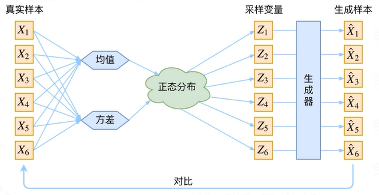

如果像这个图的话，我们其实完全不清楚，究竟经过重新采样出来的Zk(1……6)，是不是还对应着原来的Xk(1……6)，所以我们如果直接最小化D(Xk(1……6),Xk(1……6))²（这里D代表某种距离函数）是很不科学的。

事实上，VAE是为每个样本构造专属的正态分布，然后采样来重构。具体来说，给定一个真实样本Xk，我们假设存在一个专属于Xk的分布p(Z|Xk)（学名叫后验分布），并进一步假设这个分布是（独立的、多元的）正态分布。为什么要强调“专属”呢？因为我们后面要训练一个生成器X=g(Z)，希望能够把从分布p(Z|Xk)采样出来的一个Zk还原为Xk。如果假设p(Z)是正态分布，然后从p(Z)中采样一个Z，那么我们怎么知道这个Z对应于哪个真实的X呢？现在p(Z|Xk)专属于Xk，我们有理由说从这个分布采样出来的Z应该要还原到Xk中去。

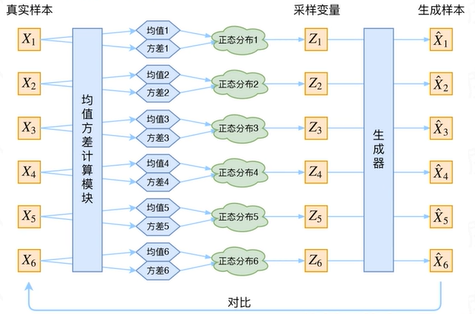

其实，在整个VAE模型中，我们并没有去使用p(Z)（隐变量空间的分布）是正态分布的假设，我们用的是假设p(Z|X)（后验分布）是正态分布。

这时候每一个Xk都配上了一个专属的正态分布，才方便后面的生成器做还原。但这样有多少个X就有多少个正态分布了。我们知道正态分布有两组参数：均值μ和方差σ²，那我们怎么找出专属于Xk的正态分布p(Z|Xk)的均值和方差呢？

我们来思考一下，根据上图的训练过程，最终会得到什么结果。

首先，我们希望重构X，也就是最小化D(X^k,Xk)²，但是这个重构过程受到噪声的影响，因为Zk是通过重新采样出来的，不是直接由编码器算出来的。显然噪声会增加重构的难度，不过好在这个噪声强度（也就是方差）通过一个神经网络算出来的，所以最终模型为了重构得更好，肯定会想尽办法让方差为0.而方差为0的话，也就没有随机性了，所以不管怎么采样其实都只是得到确定的结果（也就是均值），只拟合一个当然比拟合多个要容易，而均值是通过另外一个神经网络算出来的。

说白了，模型会慢慢退化成普通的Auto Encoder，噪声不再起作用。

这样不久白费力气了吗？

其实VAE还让所有的p(Z|X)都向标准正态分布看齐，这样就防止了噪声为零，同时保证了模型具有生成能力。怎么理解“保证了生成能力”呢？

如果所有的p(Z|X)都很接近标准正态分布N(0,1)，那么根据定义

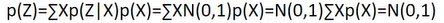

这样我们就能达到我们的先验假设：p(Z|X)是标准正态分布。然后我们就可以放心的从N(0,1)中采样来生成图像了。

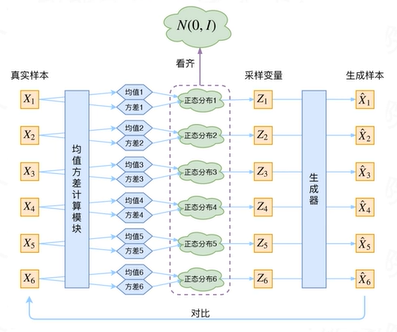

VAE本质上就是在我们常规的自编码器的基础上，对编码器的结果（在VAE中对应着计算均值的网络）加上了高斯噪声，使得结果解码器能够对噪声有鲁棒性。而那个额外的KL loss（目的是让均值为0，方差为1），事实上就是相当于对编码器的一个正则项，希望编码器出来的东西均有零均值。

编码器的另外一个（对应着计算方差的网络）作用是用来动态调节噪声的强度。当解码器还没有训练好时（重构误差远大于KL loss），就会适当降低噪声（KL loss增加），使得拟合起来容易一些（重构误差开始下降）。反之，如果解码器训练的还不错时（重构误差小于KL loss），这时候噪声就会增加（KL loss减少），使得拟合更加困难了（重构误差又开始增加），这时候解码器就要想办法提高它的生成能力了。

重构的过程是希望没噪声的，而KL loss则希望有高斯噪声，两者是对立的。所以，VAE跟GAN一样，内部其实是包含了一个对抗的过程，只不过他们两者混合起来，共同进化。

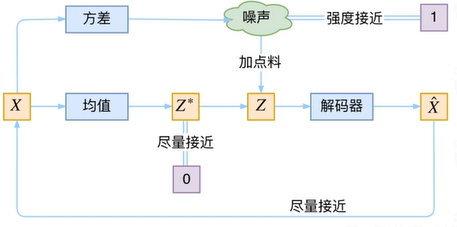

为什么不直接学习sigma或std？主要是因为方差sigma和标准差std都有一个取值范围，都是0到正无穷的数，而神经网络的输出一般是不受控制的，可能会有负数的输出，而log(sigma)的取值范围就是负无穷到正无穷，符合神经网络的输出条件。

能不能使用relu函数限制呢？不能，因为relu具有稀疏性，形成部分0特征。

#### 2.2 变分自编码的实现过程

##### 2.2.1 变分自编码的实现过程

变分自编码的实现过程如下：与AE相比，VAE的编码器和解码器过程都不变，但在中间加入了一些技巧，编码器输出的是两个向量，假设原本AE中的编码器生成的编码是1组10个特征（v1，v2，……，v10）的特征向量，那么VAE的编码器将会生成两组10个特征的特征向量（m1，m2，……，m10）和（σ1，σ2，……，σ10），之后再从正态分布中生成一个向量（e1，e2，……，e10），执行计算（ci=exp(σi)×ei+mi），从而生成（c1，c2，……，c10），再丢进解码器中得到输出，通过“使输入和输出越来越接近越好”的原则优化模型。

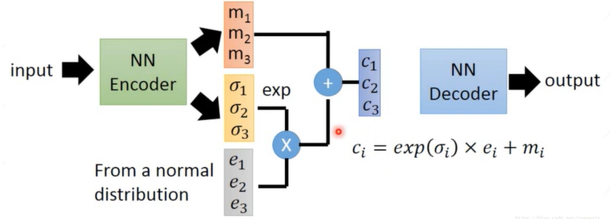

##### 2.2.2 变分自编码的训练流程

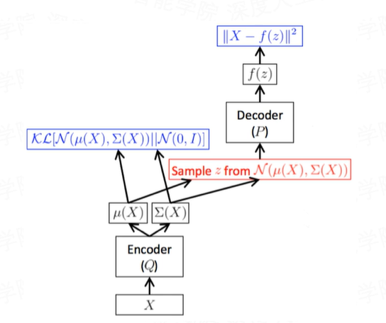

我们将从N(μ,σ²)采样变成了从N(0,1)中采样，然后通过参数变换得到和从N(μ,σ²)中一样的采样结果。这样以来，采样这个操作就不用参与梯度下降了，改为采样的结果参与，使得整个模型可训练了。

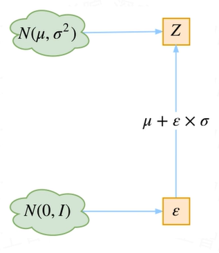

对从标准正态分布N(0,1)中采样的Z(0,1)，做一个变化：x=z×exp(σ)+μ，这时候的x相当于是从N(μ,σ²)分布中得到的采样数据，这也是为什么VAE很难学到清晰图像的原因，因为VAE后期图像重构的不是N(μ,σ²)分布，而是N(μ,σ²)分布的采样分布。因为0加任何数等于任何数，1乘以任何数也等于任何数，但是这时候的分布有了数据，不只是单纯的统计量了，也相当于是从N(μ,σ²)中采样的数据了。

任何一个分布都可以用标准正态分布表示：N(μ,σ)=N(0,1)×σ+μ

- 整个训练框架就是在对样本进行编解码。是将样本编码为隐变量，而又将隐变量解码，进而最小化重构误差。

- 无监督训练的目的是学习出编码器的映射函数和解码器的映射函数，所以训练过程实际上实在进行变分推断，即寻找出某一个函数来优化目标。

- 整个过程可以这么认为，真实的概率分布，我们很难得到，我们希望做的是通过编解码去逼近，因此前者可以理解为某一种近似的概率分布。

#### 2.3 变分自编码的损失函数

##### 2.3.1 变分自编码的损失构成

VAE将经过神经网络编码后的隐藏层假设为一个标准的高斯分布，然后再从这个分布中采样一个特征，再用这个特征进行解码，期望得到与原始输入相同的结果，损失和AE几乎一样，只是增加编码推断分布与标准高斯分布的KL散度的正则项，显然增加这个正则项的目的就是防止模型退化成普通的AE，因为网络训练时为了尽量减少重构误差，必然使得方差逐渐被降到0，这样便不会再有随机采样噪声，也就变成了普通的AE。

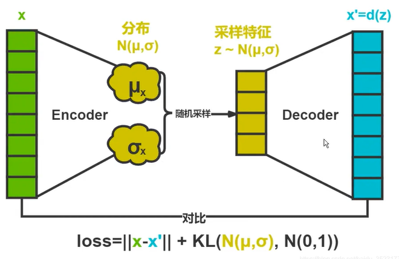

##### 2.3.2 回顾自编码网络

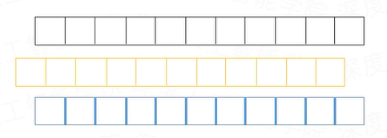

隐变量的本质是神经网络学习到了数据的每部分的特征，比如人脸的眼睛大小，鼻子大小，嘴巴大小等等，整体是一个多维的正态分布，而每个类都是一个低维的正态分布。

重新生成的图像就是从每个类的正态分布特征中采样，经过重构后，就可以组合成一个新的人脸。

而实际情况是一组特征中，隐变量特征之间并不是有很清楚的界限来表达每个类别的特征，比如往往是前两个特征表示眼睛，前三个特征表示鼻子，第二个到第四个特征表示嘴巴，会发现特征之间是由重叠和交集的，这种情况称为纠缠，或特征纠缠。

当把KL距离损失降的很低的时候，网络的解纠缠能力越好，生成的分布越靠近标准正态分布，但是图像重构的损失就较高，重构的图像效果就很糟糕。

当把重构损失降的很低的时候，网络的重构能力越好，生成的图像越好，但是网络的解纠缠能力越差，生成的分布跟标准正态分布差的较远。

### 3. 对象生成GAN（Generative Adversarial Networks）

#### 3.1 GAN的原理和表现效果

##### 3.1.1 从一张门票说起

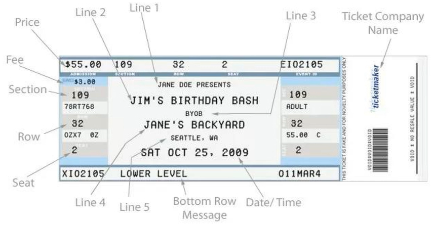

##### 3.1.2 GAN让你化身为灵魂画手

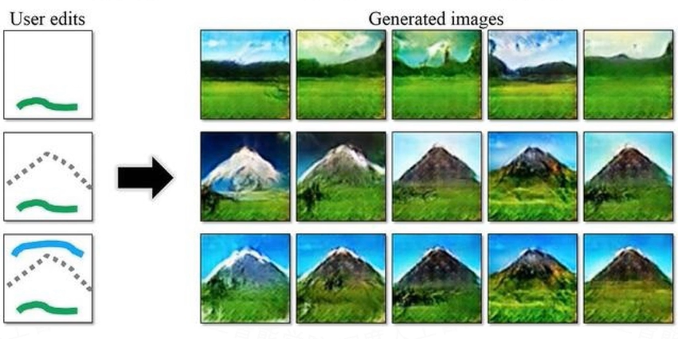

##### 3.1.3 画风变化

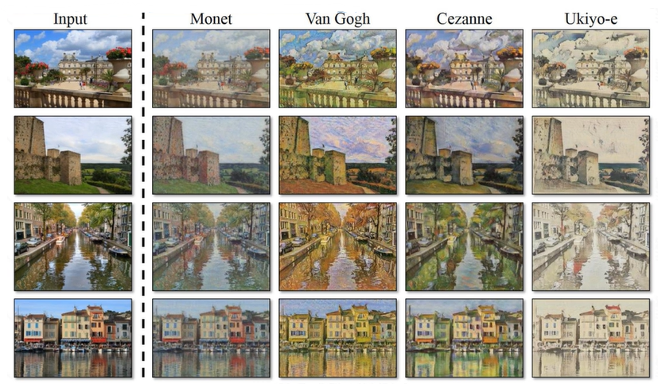

##### 3.1.4 季节变化

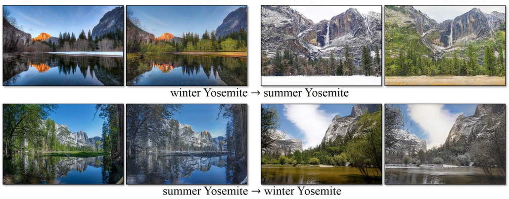

##### 3.1.5 对象变化

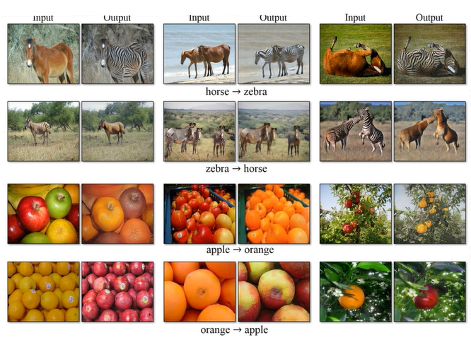

##### 3.1.6 景深变化

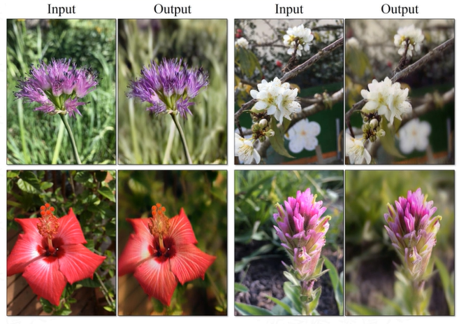

##### 3.1.7 纹理变化

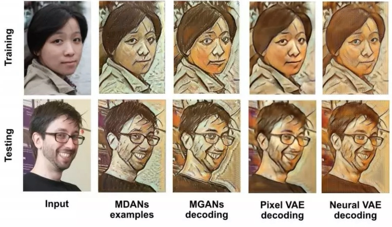

##### 3.1.8 分辨率变化

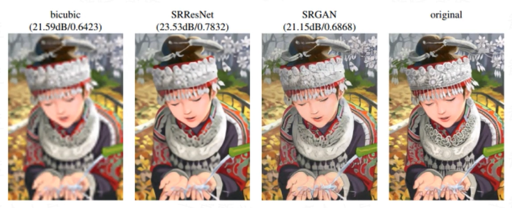

##### 3.1.9 马赛克变化

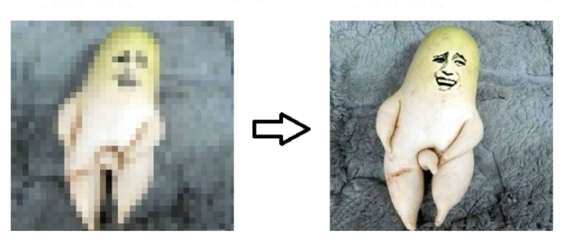

##### 3.1.10 衣服变化

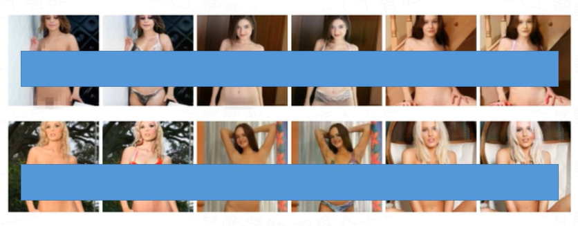

##### 3.1.11 面容变化

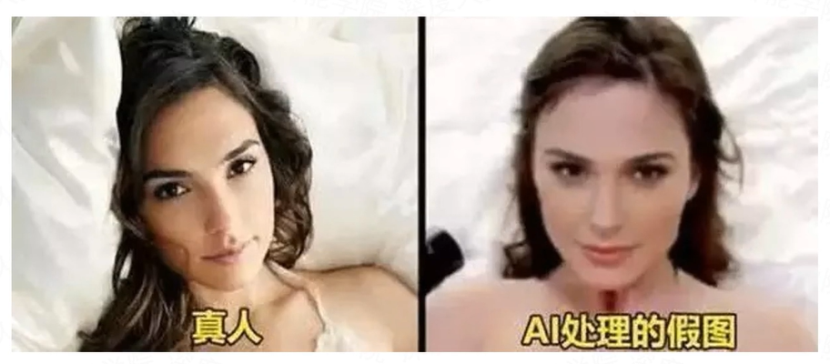

#### 3.2 GAN的网络结构

##### 3.2.1 GAN原理

- GAN所建立的一个学习框架，实际上就是生成模型和判别模型之间的一个模仿游戏。生成模型的目的，就是要去尽量的模仿和学习真实数据分布；判别模型则是要判别自己所得到的一个输入数据，究竟是来自于真实的数据分布还是来自于一个生成模型。

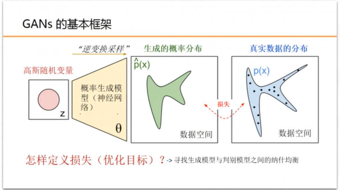

- GAN的主要灵感来源于博弈论中零和博弈的思想，应用到深度学习神经网络上来说，就是通过生成网络G（Generator）和判别网络D（Discriminator）不断博弈，进而使G学习到数据的分布，如果用到图片生成上，则训练完成后，G可以从一段随机数中生成逼真的图像。

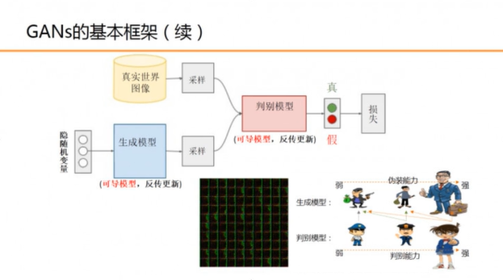

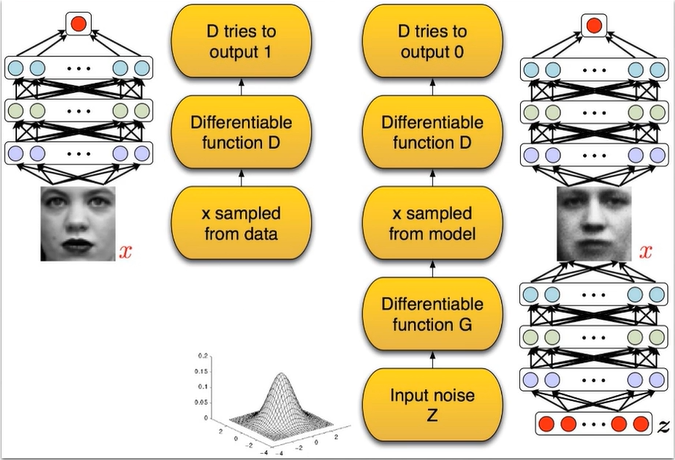

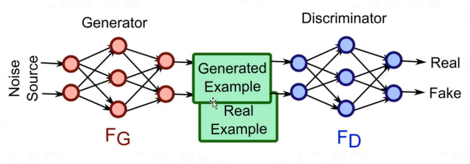

GAN的核心思想是：同时训练两个相互协作、同时又相互竞争的深度神经网络（一个成为生成器Generator，另一个成为判别器Discriminator）来处理无监督学习的相关问题。在训练过程中，两个网络最终都要学习如何处理任务。

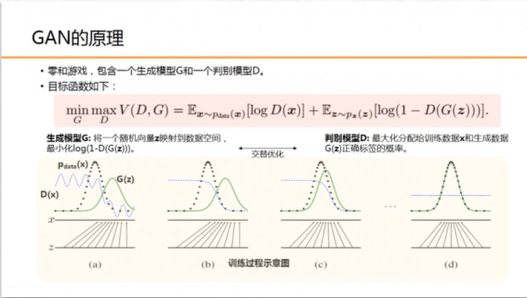

图中黑色大点虚线P(x)是真实的数据分布，绿线G(z)是通过生成模型产生的数据分布（输入是均匀分布变量z，输出是绿的曲线）。蓝色的小点虚线D(x)代表判别函数。

- 生成模型G构建一个从先验分布Pz(z)到数据空间的映射函数G(z;θg)。判别模型D的输入是真实图像或者生成图像，D(x;θd)输出一个标量，表示输入样本来自训练样本（而非生成样本）的概率。

- 模型G和D同时训练

- 固定判别模型D，训练生成器G，调整G的参数使得logD(X)和log(1-D(G(z)))的期望最小化；实际就是让判别器对真实数据的打分越来越好，对假数据的打分越高越好，让logD(X)的输出最小，让(1-D(G(z)))的输出也最小，也就是D(G(z))的期望最大化，接近于1。

- 固定生成器模型G，训练判别器D，调整D的参数使得logD(X)+log(1-D(G(z)))的期望最大化，也就是D(G(z))的期望最小化，这个优化过程可以归结为一个二元极小极大博弈问题。

##### 3.2.2 GAN优点

- GAN采用的是一种无监督的学习方式训练，可以被广泛用在无监督学习和半监督学习领域

- 相当于变分自编码VAE，GAN学习到的是真实数据的分布，而VAE是从真实数据学到均值和方差，再经过扰动后从正态分布中采样，这样的到的数据会有偏差，导致了VAE生成的图像比GAN模糊

- 相比VAE，如果GAN的判别器训练良好，那么生成器可以完美的学习到训练样本的分布，换句话说，GAN是逐渐一致的，但是VAE是有偏差的

- GAN应用到一些场景上，比如图像风格迁移，超分辨率，图像补全，去噪，避免了损失函数设计的困难，只要有一个的基准，直接机上判别器，剩下的就交给对抗训练了。

##### 3.2.3 GAN缺点

- 训练GAN需要达到纳什平衡，有时候可以用梯度下降法做到，有时候做不到。

- GAN不适合处理离散形式的数据，比如文本。

- GAN存在训练不稳定、梯度消失、模式崩溃/坍塌的问题。

- 难以训练，需要小心设置网络训练中的参数。

#### 3.3 CGAN的网络结构

- 条件生成式对抗网络（CGAN）是对原始GAN的一个拓展，生成器和判别器都增加额外信息y为条件，y可以使任意信息，例如类别信息，或者其他模态的数据。通过将额外信息y输送给判别模型和生成模型，作为输入层的一部分，从而实现条件GAN。在生成模型中，先验输入噪声p(z)和条件信息y联合组成了联合隐层表征。条件GAN的目标函数是带有条件概率的二元极小极大值博弈，如果条件变量y是类别标签，可以看作CGAN是把纯无监督的GAN变成有监督的模型的一种改进。

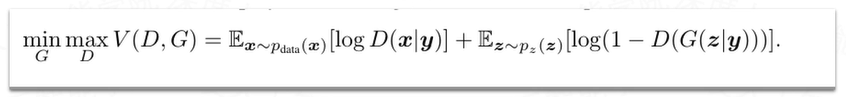

- CGAN的网络机构

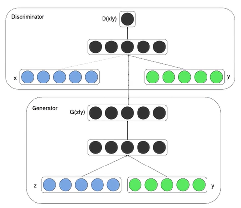

#### 3.4 DCGAN的网络结构

- DCGAN是继GAN之后比较好的改进，其主要的改进实在网络结构上，到目前为止，DCGAN的网络结构还是被广泛的使用，DCGAN极大的提升了GAN训练的稳定性以及生成结果的质量。

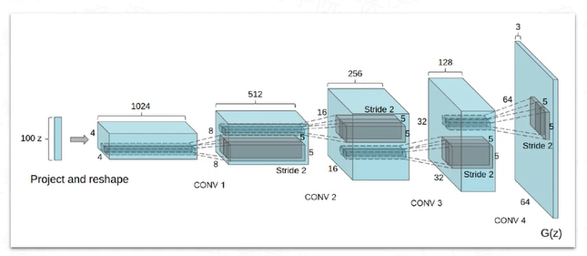

- DCGAN的生成器网络结构如上图所示，相较原始的GAN，DCGAN完全使用了卷积层代替全链接层，判别器几乎适合生成器对称的，从上图中我们可以看到，G网络没有池化层，使用了转置卷积并且步长大于等于2进行上采样。

##### 3.4.1 DCGAN网络结构设计要点

- 在D网络中用strided卷积（stride>1）代替pooling层，在G网络中用conv2d_transpose代替上采样层。

- 在G和D网络中直接将BN应用到所有层会导致样本震荡和模型不稳定，通过在generator输出层和discriminator输入层不采用BN可以防止这种现象。

- 不适用全链接层作为输出。

- G网络中除了输出层（tanh）都使用ReLu激活函数。

- D网络中都使用LeakyReLu激活函数。

##### 3.4.2 DCGAN训练细节

- 预处理环节，将图像scale到tanh的[-1,1]。

- 所有的参数初始化由(0,0.02)的正态分布中随机得到。

- LeakyReLu的斜率是0.2。

- 优化器使用调好超参的Adam optimizer。

- learning rate=0.0002。

- 将momentum参数beta从0.9降为0.5来防止震荡和不稳定。

##### 3.4.3 DCGAN生成的卡通人脸效果

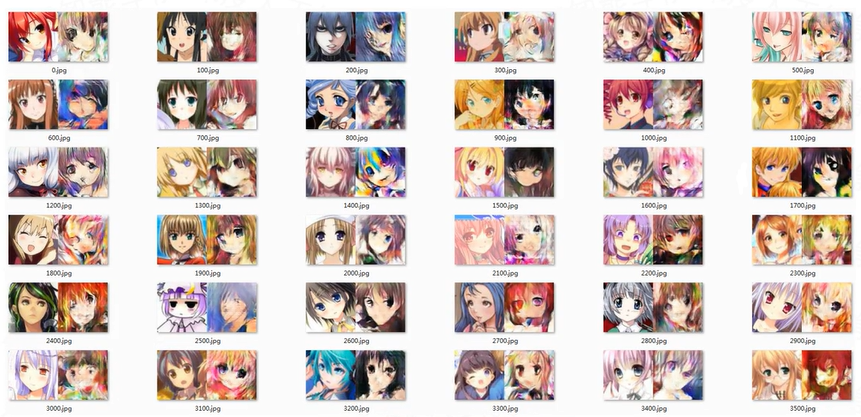