### 1. UNet

#### 1.1 图像分割的概念

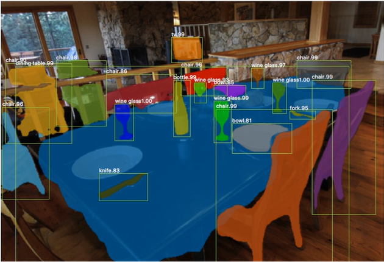

图像分割的本质是像素级别的分割。

#### 1.2 图像分割的应用

- 细胞图像分割

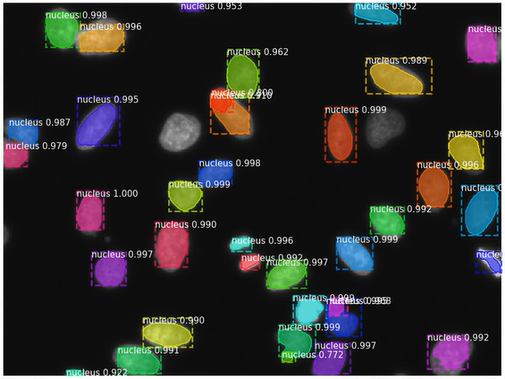

- CT/MR脑图像分割

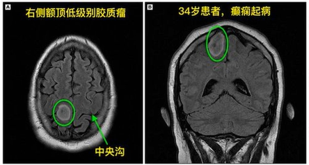

- 自动驾驶图像分割

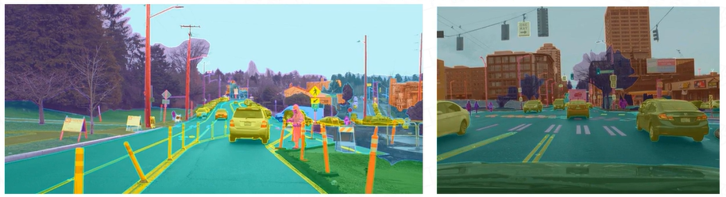

#### 1.3 图像分割的发展

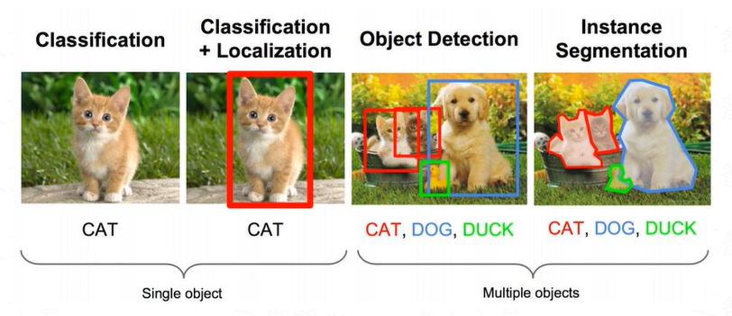

一般情况下，获取图像的语义信息和位置信息是矛盾的。

#### 1.4 图像分割的分类

- 普通分割：

将分属不同物体的像素区域分开。如前景与后景分割开，狗的区域与猫的区域与背景分隔开（二分类）。

- 语义分割：

在普通分割的基础上，分类出每一块区域的语义（即这块区域是什么物体）。如把画面中的所有物体都指出它们各自的类别。

- 实例分割：

在语义分割的基础上，给每个物体编号。如这个是该画面中的A物体，那个是画面中的B物体。

#### 1.5 图像分割的结构

1. 下采样+上采样：Convolution+Deconvolution/Resize

1. 多尺度特征融合：特征驻点相加/特征channel维度拼接

1. 获得像素级别的segement map：对每个像素点进行判断类别

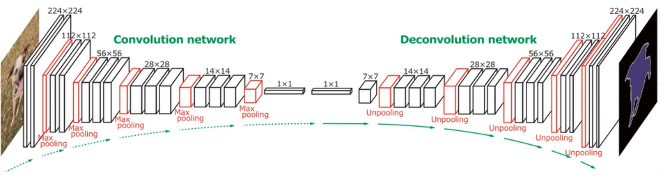

##### 1.5.1 图像下采样的方法

1. 使用池化的下采样

1. 使用较大步长卷积的下采样

1. 使用像素通道变换的下采样

##### 1.5.2 图像上采样的方法

1. 像素插值：信息有所丢失，速度较快

1. 转置卷积：需要学习参数，速度适中

1. 像素融合：通道信息平铺，不丢失信息

能否使用转置卷积？转置卷积对特征的叠加不够均匀，有些点的特征叠加较多，有些点的特征叠加较少，所以会产生象棋格子的效果，也就是特征分布不均匀。

临近插值法：临近的区域插入一个相同的数。比如123，变成112233。缺点是插入的数不够平滑，与原来的图像像素之间差异较大。

线性插值法：在两个数之间插入的值取决于距离哪个数更近。如果插入的位置距离两个数一样，就插入两个数的平均值。说明线性插值有位置信息，而临近插值没有。比如1、2插入1.5，变成1、1.5、2，缺点是只插入一个方向的信息。没有办法进行全局计算信息的位置。

双线性插值法：使用周围的几个点来估算出中间点的数据信息。得到的信息位置全面。

像素融合是将通道信息平铺到宽高上，没有任何信息丢失，但是需要卷积来提取特征学习。

#### 1.6 图像分割的模型

##### 1.6.1 Fully Convolutional Networks（FCN）

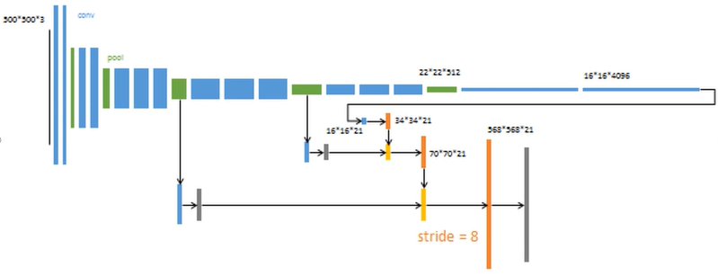

FCN是一个简单的哑铃结构网络，输入500×500×3的图像，上采样时进行两次跳跃连接。由于网络设计较为简单，下采样层和上采样层并不是严格对应，输出为568×568×21。另外skip connection的信息时加法，而非cat，其分割效果并不好。

FCN分割效果如下图：

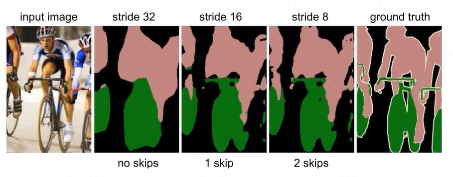

##### 1.6.2 U-Net

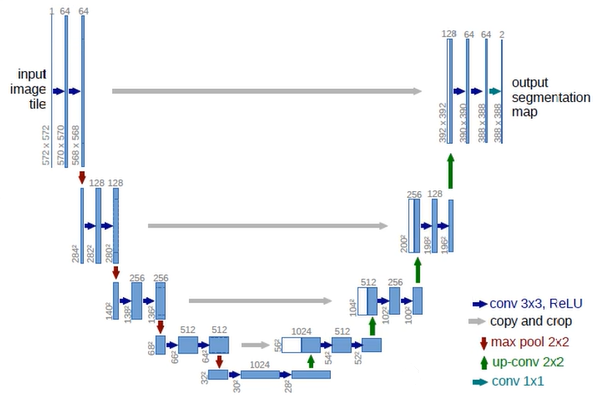

1. 每阶段的卷积层不止一层，提高了模型每个阶段的特征提取能力。

1. 上采样不使用转置卷积，防止由于特征叠加不均匀出现色差。

1. skip connection时把大图周围裁剪了，和小图做cat，缩放会使像素位置发生偏移。

##### 1.6.3 U-Net和FCN异同

1. U-Net完全对称，也就是左边和右边是很类似的，而FCN的decoder相对简单，只用了一个转置卷积的操作，之后并没有跟上卷积结构。

1. 都使用了跳跃连接（skip connection），FCN用的是加操作（summation），U-Net用的是叠操作（concatenation）。

1. 它们的结构都用了一个比较经典的思路，也就是编码和解码（encoder-decoder）。

##### 1.6.4 U-Net应用

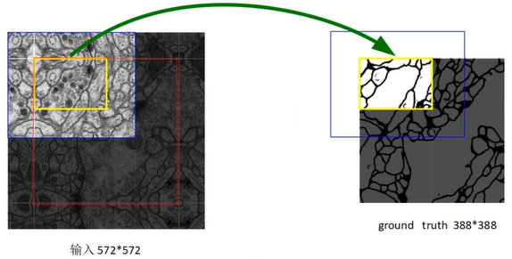

蓝色框是输入大小，黄色框是输出大小。让输出拼接到一起。

在医学领域，图像的分割精度要求非常高，所以对分割的图像需要做一些处理。一般是输入的被分割的原图较大，而输出的分割图只取中间的部分。这是因为卷积的时候，卷积核对于图像外侧的信息关注比例较少，为了减少误差，从而裁掉了外侧的图像。

另外一个原因是医学图像想较大时，可以被裁剪成多个小图进行分割任务。被建材的各个图像边缘时有重合区域的，也是为了提高分割精度。让两张图的拼接部位的分割更加精确。

所以模型输入的是一张大图，而标签是被截取后的小图，自然网络也就需要设计成输入是大图，输出是小图的结构，这样输出才和标签的大小一致，好和标签做损失。

##### 1.6.5 U-Net效果

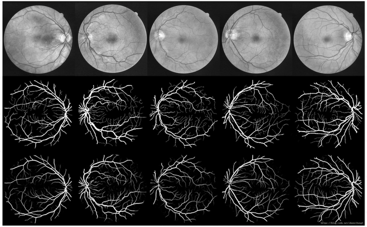

##### 1.6.6 U-Net模型的拓扑结构

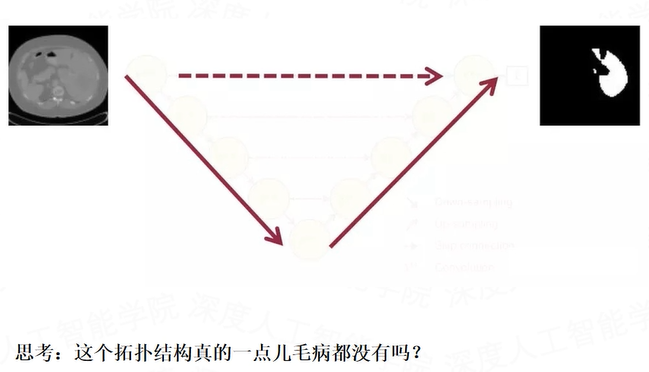

问题1：网络要多深才合适？

问题2：降采样对于分割网络到底是不是必须的？既然输入和输出都是相同大小的图，为什么要折腾去降采样一下再升采样呢？

##### 1.6.7 U-Net模型的深度

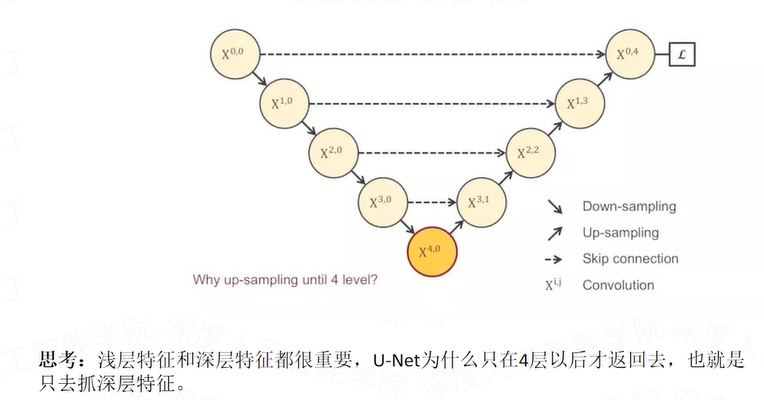

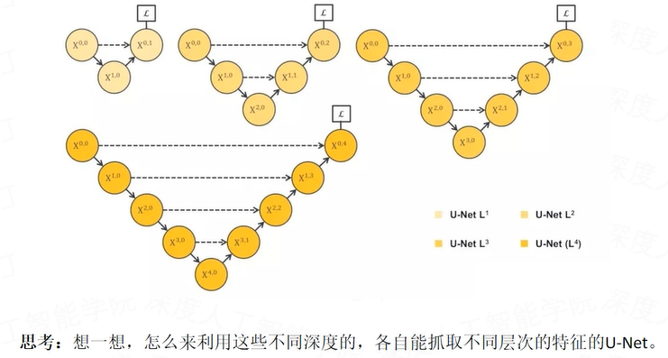

##### 1.6.8 U-Net模型的改进

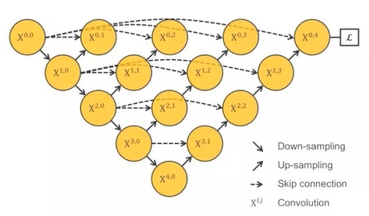

我们把1~4层的U-Net全连在一起，再来看他们的子集，包含1层U-Net，2层U-Net，以此类推。

优势1：不管网络的哪个深度的特征有效，都可以留给网络去学习，让网络自己去学习不同深度的特征的重要性。

优势2：共享了一个特征提取器，也就是你不需要训练一堆U-Net，而是只训练一个encoder，它的不同层次的特征由不同的decoder路径来还原。这个encoder依旧可以灵活的用各种不同的backbone来代替。

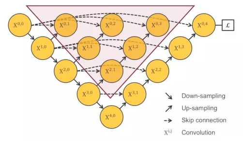

尽管这个网络优势非常大，但可惜的是，这个网络结构是不能被训练的，原因在于，不会有任何梯度会经过这个红色区域，因为它和算loss function的地方实在反向传播时是断开的。那么该如何改进这个模型？

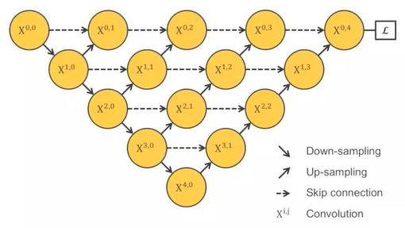

思考：这个结构有什么问题？

不难发现这个结构强行去掉了U-Net本身自带的长连接，取而代之的是一系列的短连接。那么我们来看U-Net引以为傲的长连接到底有什么优点。

U-Net中的长连接是有必要的，它联系了输入图像的很多信息，有助于还原降采样所带来的信息损失，在一定程度上，它和残差的操作非常类似，也就是residual操作，x+f(x)。因此，建议最好给出一个综合长连接和短连接的方案。

##### 1.6.9 U-Net++

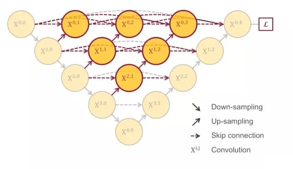

这个改进就是U-Net++，它把原来空心的U-Net填满了，优势是可以抓取不同层次的特征，将他们通过特征叠加的方式整合，不同层次的特征，或者说不同大小的感受野，对于大小不一的目标对象的敏感度是不同的，比如，感受野大的特征，可以很容易的识别出大物体的，但是在实际分割中，大物体的边缘信息和小物体的本身是很容易被深层网络一次次的降采样和一次次的升采样给弄丢的，这个时候就可能需要感受野小的特征来帮助。另外U-Net++横着看是一个稠密结构的网络-DenseNet，U-Net是一个残差网络-ResNet。因此，U-Net++对于U-Net分割效果提升可以和DenseNet对于ResNet分类效果的提升相比。

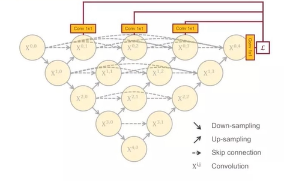

如果只用最右边的一个loss来做损失函数的话，这个结构在反向传播的时候中间部分会收不到传过来的损失。

那么如何解决这个问题呢？

这个非常直接的解决方案就是深监督，也就是deep supervision。深监督的含义就是一个多分支网络，每个分支都有其对应的loss函数，然后全局的loss由分支的损失函数加权累加而成。具体的实现操作就是在途中X0.1，X0.2，X0.3，X0.4后面加一个1×1的卷积核，相当于去监督每一层，或者每个分支的U-Net的输出。也就是可以在1×1卷积后加入非线性函数来和标签做loss了。

##### 1.6.10 U-Net++的剪枝应用

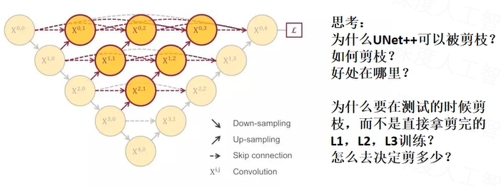

在测试的阶段，由于输入的图像只会前向传播，扔掉这部分对前面的输出完全没有影响的，而在训练阶段，因为既有前向，又有反向传播，被剪掉的部分是会帮助其他部分做权重更新的。也就是测试时，剪掉部分对剩余结构不做影响，训练时，剪掉部分对剩余部分有影响。

因为在深监督的过程中，每个子网络的输出都其实已经是图像的分割结果了，所以如果小的子网络的输出结果已经足够好了，我们可以随意的剪掉那些多余的部分了。

##### 1.6.11 U-Net+++

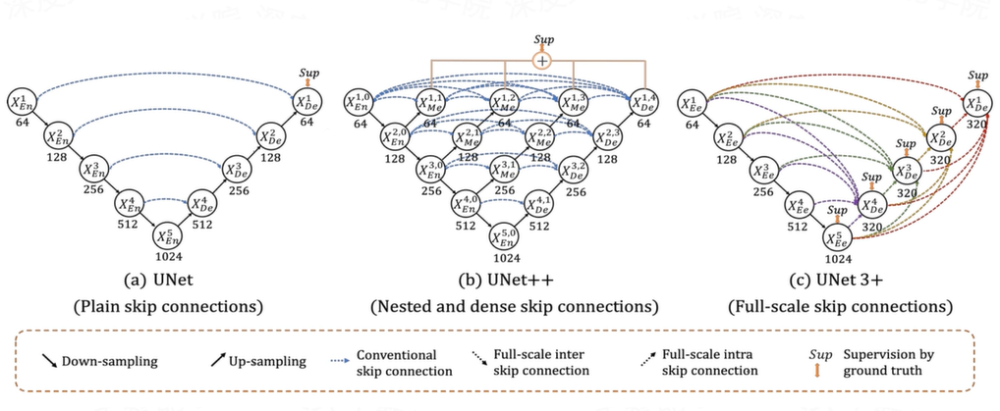

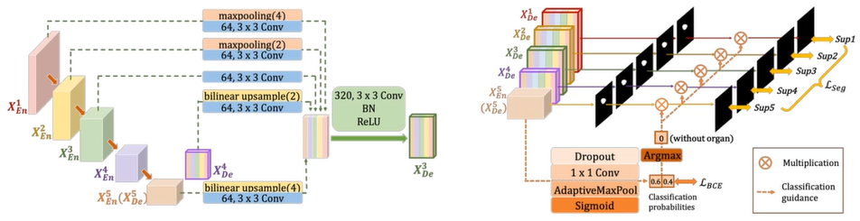

无论是连接简单的U-Net，还是连接紧密嵌套的U-Net++，都缺乏从全尺度探索足够信息的能力，未能明确了解器官的位置和边界。为了弥补U-Net和U-Net++的缺陷，U-Net+++中的每个解码器层都融合了来自编码器中的小尺度和同尺度的特征图，以及来自解码器的大尺度的特征图，这些特征图铺货了全尺度下的细粒度语义和粗粒度语义。

为了进一步增强器官的边界，作者提出了一个多尺度结构相似度指数损失函数来赋予模糊边界更高的权重。受益于此，U-Net+++将关注模糊边界，区域分布差异越大，MS-SSIM值越高。

从分割结果p和g裁剪了两个相应的N×M大小的块。定义p和g的MS-SSIM损失函数为：

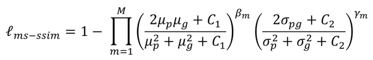

其中，M表示尺度的总数量，μp、μg和σp、σg分别是p，g的均值和方差，σpg表示它们的协方差。βm，γm定义定义每个尺度中这两个部分的相对重要性。两个小的常量C1=0.01²和C2=0.03²是避免被0除。在原文中，作者将尺度数量M设置为5（和U-Net、U-Net++保持一致）。

结合focal损失函数，MS-SSIM损失函数和IoU损失函数，作者提出了一种混合损失函数用于分割三个不同层次像素级别分割、块分割、图像级别分割，它能捕获大尺度的和精细结构清晰的界限。混合分割损失被定义为：

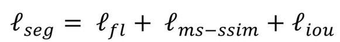

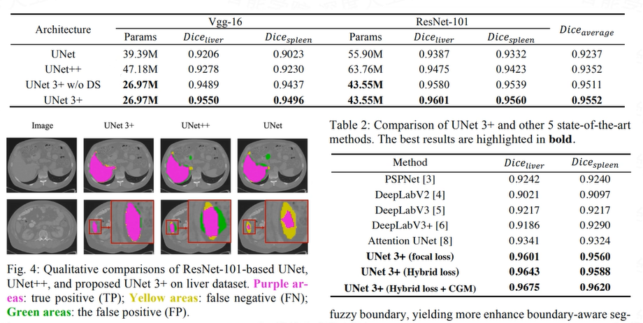

##### 1.6.12 U²-Net

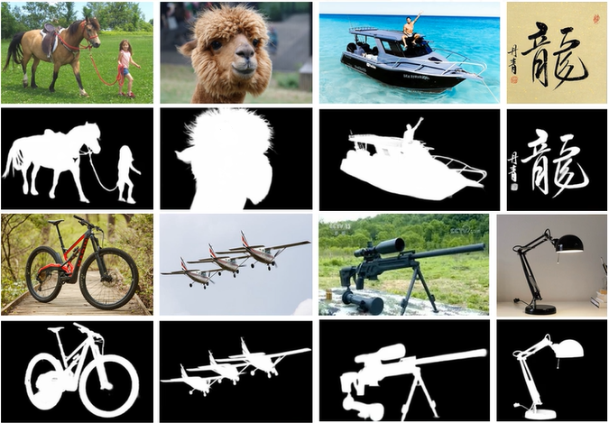

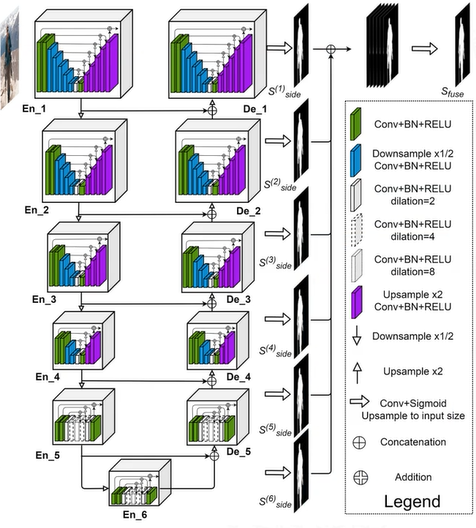

##### 1.6.13 U-Net系列为什么适用于医学影响分割？

为什么适用于医学图像？

1. 因为医学图像边界模糊、梯度复杂，需要较多的分辨率信息。高分辨率用于精准分割。

1. 人体内部结构相对固定，分割目标在人体图像中的分布很具有规律，语义简单明确，低分辨率信息能够提供这一信息，用于目标物体的识别。U-Net结合了低分辨率信息（提供物体类别识别依据）和高分辨率信息（提供精准风格定位依据），完美适用于医学图像分割。

底层（深层）信息：经过多次下采样后的低分辨率信息。能够提供分割目标在整个图像中上下文语义信息，可理解为反应目标和它的环境之间关系的特征。这个特征有助于物体的类别判断（所以分类问题通常只需要低分辨率/深层信息，不涉及多尺度融合）

高层（渐层）信息：经过concatenate操作从encoder直接传递到同高度decoder上的高分辨率信息。能够为分割提供更加精细的特征，如梯度等。

##### 1.6.14 DeepLab

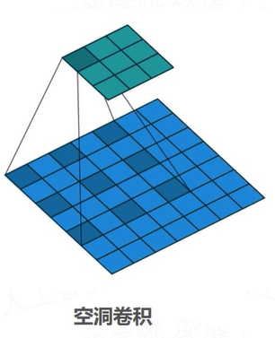

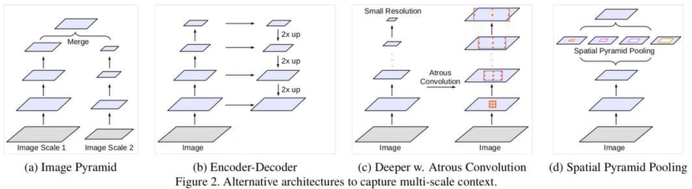

1. Image Pyramid：将输入图片放缩成不同比例，分别应用在DCNN上，将预测结果融合得到最终输出。

1. Encoder-Decoder：利用Encoder阶段的多尺度特征，运用到Decoder阶段上恢复空间分辨率，代表工作有FCN、SegNet、PSPNet等。

1. 是CNN和PGM（概率图模型）的结合，对CNN最后一层加上fully connected CRFs，使得分割更精确。

1. Spatial Pyramid Pooling：空间金字塔池化具有不同采样率和多种视野的卷积核，能够以多尺度捕捉对象。

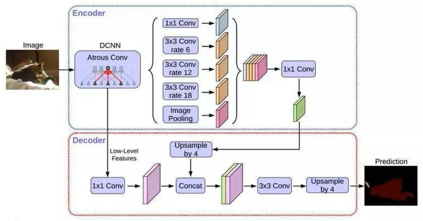

##### 1.6.15  空间金字塔池化SPP（Spatial Pyramid Pooling）

空间金字塔池化，要解决的就是从卷积层到全连接层之间的一个过度。

SPP显著特点：

1. 不管输入尺寸是怎样，SPP可以产生固定大小的输出

1. 使用多个窗口（pooling window）

1. SPP可以使用同一图像不同尺寸作为输入，得到相同长度的池化特征。

其他特点：

1. 由于对输入图像的不同纵横比和不同尺寸，SPP同样可以处理，所以提高了图像的尺度不变和降低了过拟合。

1. 实验表明训练图像尺寸的多样性比单一尺寸的训练图像更容易使得网络收敛。

1. SPP对于特定的CNN网络设计和结构是独立的。也就是说，只要把SPP放在最后一层卷积层后面，对网络的机构是没有影响的，它只是替换了原来的pooling层。

1. 不仅可以用于图像分类而且可以用来目标检测。

##### 1.6.16 空洞金字塔池化ASPP（Atrous Spatial Pyramid Pooling）

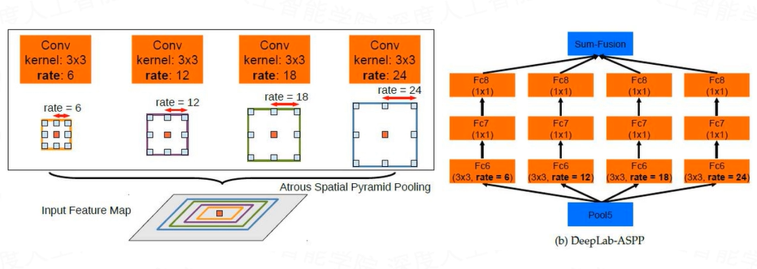

##### 1.6.17 Mask-RCNN

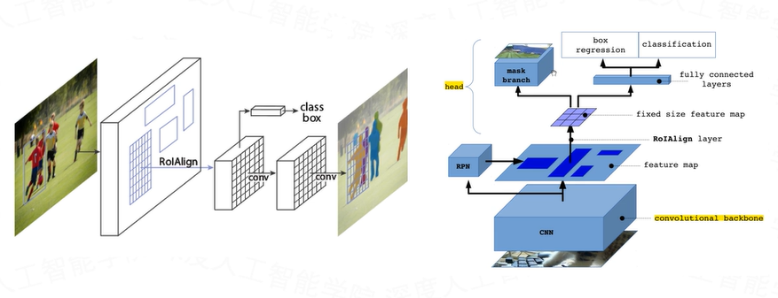

Mask-RCNN是大神何凯明的力作，将Object Detection与Semantic Segmentation合在了一起做。它的贡献主要是以下几点：

1. 神经网络有了多个分支输出。Mask-RCNN使用类似Faster-RCNN的框架，Faster-RCNN的输出是物体的bounding box和类别，而Mask-RCNN则多了一个分支，用来预测物体的语义分割图。也就是说神经网络同时学习两项任务，可以互相促进。

1. 在语义分割中使用Binary Mask。原来的语义分割预测类别需要使用0、1、2、3、4等数字代表各个类别。在Mask-RCNN中，检测分支会预测类别。这时候分割只需要用0、1预测这个物体的形状面具就行了。

1. Mask-RCNN提出了RoiAlign用来替换Faster-RCNN中的RoiPooling。RoiPooling的思想是将输入图像中任意一块区域对应到神经网络特征图中的对应区域。RoiPooling使用了化整的近似来寻找对应区域，导致对应关系与实际情况有偏移。这个偏移在分类任务中可以容忍，但对于精细度更高的分割则影响较大。

##### 1.6.18 RoiPooling和RoiAlign

#### 1.7 图像分割的评估

##### 1.7.1 IOU LOSS

可类比DICE LOSS，也是直接针对评价标准进行优化。

在图像分割领域评价标准IOU实际上是

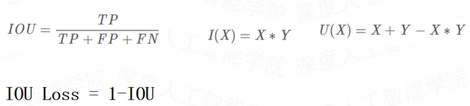

IOU LOSS的缺点同DICE LOSS是相类似的，训练曲线可能并不可信，训练的过程也可能并不稳定。

##### 1.7.2 DICE系数

根据Lee Raymond Dice命名，是一种集合相似度度量函数，通常用于计算两个样本的相似度（值范围[0,1)）：

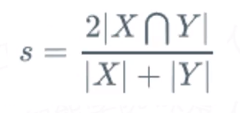

|X∩Y|是X和Y之间的交集；|X|和|Y|分别表示X和Y的元素个数，其中，分子中的系数2，是因为分母存在重复计算X和Y之间的共同元素的原因。

预测的分割图的dice系数计算，首先将|X∩Y|近似为预测图与GT分割图之间的点乘，并将点乘的元素结果相加

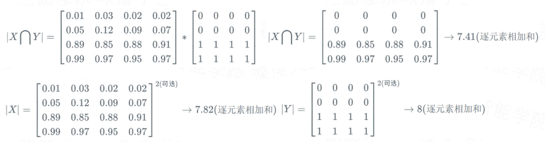

关于|X|和|Y|的量化计算，可采用直接简单的元素相加；也有采用取元素平方求和的做法。

对于二分类问题，GT分割图是只有0，1两个值的，因此|X∩Y|可以有效的将在Pred分割图中未在GT分割图中激活的所有像素清零，对于激活的像素，主要是惩罚低置信度的预测，较高值会得到更好的dice系数。

##### 1.7.3 DICE系数和IOU的关系

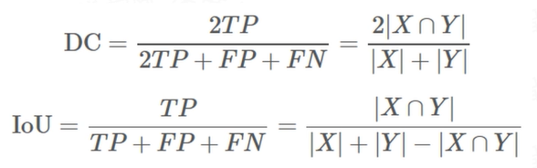

其中TP,FP,FN分别是真阳性、假阳性、假阴性的个数。

真正（True Positive，TP）：被模型预测为正的正样本。

假正（False Positive，FP）：被模型预测为正的负样本。

假负（False Negative，FN）：被模型预测为负的正样本。

真负（True Negative，TN）：被模型预测为负的负样本。

真正率（True Positive Rate，TPR）：TPR=TP/(TP+FN)，即被预测为正的正样本数/正样本实际数。

假正率（False Positive Rate，FPR）：FPR=FP/(FP+TN)，即被预测为正的负样本数/负样本实际数。

假负率（False Negative Rate，FNR）：FNR=FN/(TP+FN)，即被预测为负的正样本数/正样本实际数。

真负率（True Negative Rate,TNR）：TNR=TN/(TN+FP)，即被预测为负的负样本数/负样本实际数。

##### 1.7.4 DICE LOSS

也称dice系数差异函数，dice可以理解为两个轮廓区域的相似程度，用A、B表示两个轮廓区域所包含的点集：

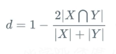

dice loss比较适用于样本极度不均的情况，一般的情况下，使用dice loss会对反向传播造成不利的影响，容易使训练变得不稳定。

##### 1.7.5 SOFT DICE LOSS

因为考虑到数据集中可能存在某些样本的掩模均为负样本，没有正样本的情况，所以需要将类标从[0,1]变为[-1,1]。此时，若真实掩模没有mask，预测出来也全部没有mask，不会因为全部值为0，导致dice的分子为0，loss为1。相反此时全部值为-1，dice的值为1，loss为0，更符合我们的实际需求。

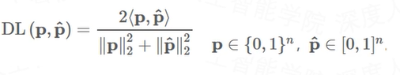

使用加权的损失函数解决样本不均衡问题，对于每一个正样本和负样本均有对应的加权系数：

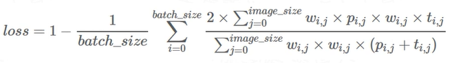

其中，tij ∈ -1,1，而pij∈[-1,1]。若正样本的系数wij为0.8，而负样本的系数wij为0.2，则正样本对dice的影响更大，负样本对dice的影响更小。从而让网络更加关注正样本。

##### 1.7.6 U-Net+++中的MS-SSIM LOSS损失函数

MS-SSIM LOSS：多尺度结构相似度指数损失函数主要赋予模糊边界更高的权重（相当于增加了模糊边界的注意力）。让U-Net+++更关注模糊边界，区域分布差异越大，MS-SSIM值越高。从分割结果P和标签G裁剪了两个相应的N×N大小的块。定义p和g的MS-SSIM损失函数为：

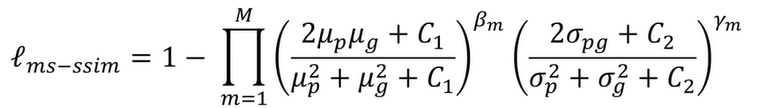

其中，M表示尺度的总数量，μp、μg和σp、σg分别是p,g的均值和方差，σpg表示它们的协方差。βm,γm定义每个尺度中这两个部分的相对重要性。两个小的常量C1=0.01²和C2=0.03²是避免被0除。在原文中，作者将尺度数量M设置为5。结合focal损失函数，MS-SSIM损失函数和IoU损失函数，我们提出一种混合损失函数用于分割在三个不同层次像素级别分割、块分割、图像级别分割，它能捕获大尺度的和精细结构清晰的界限。混合分割损失被定义为：

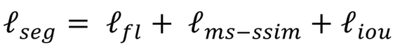

##### 1.7.7 BCE LOSS

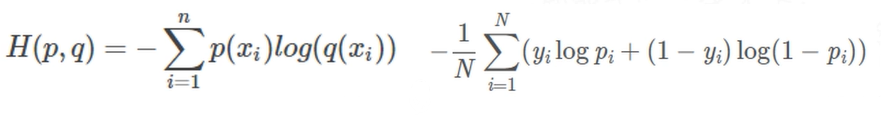

其中，yi为输入实例xi的真实类别，pi为预测输入实例xi属于类别1的概率，对所有样本的负对数求损失，可以表示为所有样本的对数损失的平均值，对于完美的分类器，对数损失为0。

BCE LOSS每一次梯度的回传对每一个类别具有相同的关注度，所以极易受到类别不平衡的影响，在图像分割领域尤其如此。

例如目标在整幅图像当中占比也就仅仅1‰，那么在一幅图像中，被分割的正样本（像素点）与负样本的比例约为1:1000，如果训练图像中还包含大量的背景图，即图像当中不包含任何的疾病像素，那么不平衡的比例将扩大到>10000，那么训练的结果将会是，网络倾向于什么也不预测，生成的mask几乎没有病灶像素区域，也就是由于被分割的图像中负样本占比较大，从而导致了损失函数大部分都学习了负样本的特征，最后的结果就是对于正样本不进行预测。所以样本不均衡的情况下，BCE LOSS并不是合适的损失函数。

##### 1.7.8 FOCAL LOSS

- 二分类的情况：

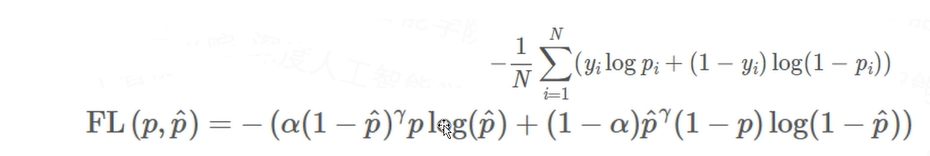

- 多分类的情况：

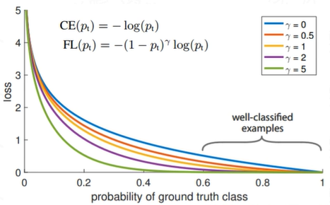

该损失函数降低easy examples的权重，使得模型更加关注hard examples。

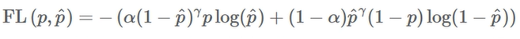

其中γ为超参数，当γ=0时，我们得到标准BCE。

当γ>1时：

- 当样本为正样本时，此时上式右边只有第一项不为0。若p^较大的时候，意味着网络对该数据的分类效果较好，(1-p^)^γ值较小，意味着该数据的loss更小，网络接下来对于该数据的关注会更小；反之，当p^较小的时候，意味着网络对该数据的分类效果较差，(1-p^)^γ较大，意味着该数据的loss更大，网络接下来对于该数据的关注会更大。

- 当样本为负样本时，此时上式右边只有第二项不为0。若p^较大的时候，意味着网络对该数据的分类效果较差，p^^γ值较大，意味着该数据的loss更大，网络接下来对于该数据的关注会更大；反之，当p^较小的时候，意味着网络对该数据的分类效果较好，p^^γ值较小，意味着该数据的loss更小，网络接下来对于该数据的关注会更小。

当γ<1时，此时损失函数会使得简单样本和困难样本之间的得分比例差距减小。简单样本和困难样本之间的界限会越来越不明显。

当γ<0时，此时损失函数会越加关注容易分的样本，而越加不关注难分的样本，与该损失函数的设计初衷背道而驰。所以实际使用的时候，γ≥1。

##### 1.7.9 图像分割中的常用LOSS组合

- BCE LOSS + DICE LOSS

- DICE + FOCAL LOSS

- DICE(IOU) + MS-SSIM LOSS + FOCAL LOSS