### 1. 语音识别的概念

- 语音识别的解释

    语音识别（Automatic Speech Recognition），缩写为ASR，主要是将人类语音中的词汇内容转换为计算机可读的输入，一般都是可以理解的文本内容，也有可能是二进制编码或者字符序列。我们一般理解的语音识别其实都是狭义的语音转文字的过程，简称语音转文本识别（SpeechToText，STT）更合适，这样就能与语音合成（TextToSpeech，TTS）对应起来。

- 语音识别包含的技术

    语音识别是一门交叉学科。语音识别技术所涉及的领域包括：信号处理、模式识别、概率论和信息论、发声机理和听觉机理，覆盖了数学与统计学、升学与语言学、计算机与人工智能等基础学科和前沿学科，是人机自然交互技术中的关键环节。

- 语音识别的发展

    语音识别诞生于1952年贝尔研究所Davis等人研究成功的世界上第一个能识别10个英文数字发音的实验系统。经过了半世纪的技术发展，目前的语音识别技术已经非常成熟。

进入2000年后，语音识别的研究方向多了机器学习领域，特别是2009年以来，借助机器学习领域深度学习研究的发展，以及大数据语料和积累，语音识别技术得到突飞猛进的发展。

### 2. 语音识别的分类

- 根据不同对象分类

- 孤立词识别

- 关键词识别

- 连续语音识别

- 根据不同发音人分类

- 特定人语音识别

- 非特定人语音识别

- 根据语音设备和通道分类

- 桌面语音识别

- 电话语音识别

- 嵌入式语音识别

- 根据应用场景分类

- 语音输入系统

- 语音控制系统

- 智能对话查询系统

### 3. 语音识别数据库

#### 3.1 语音数据库

- MIT Media lab Speech Dataset（麻省理工学院媒体实验室语音数据集）

- Pitch and Voicing Estimates for Aurora 2（Aurora2语音库的基因周期和声调估计）

- Congressional speech data（国会语音数据）

- Mandarin Speech Frame Data（普通话语音帧数据）

- 自制数据集，如果是特定的语音识别，则需要自制数据集

#### 3.2 开源语音识别库

- Kaldi

    Kaldi是一个用C++编写的语音识别工具包，并在Apache License 2.0下获得许可。Kaldi旨在供语音识别研究人员使用。开源语音识别Kaldi是业界语音识别框架的基石。Kaldi的存在始于2009年约翰普金斯大学的研讨会，其标题为“新语言和领域的低开发成本、高质量语音识别”。

    该项目的重点是基于子空间高斯混合模型（SGMM）的建模和对词典学习的一些调查。现在Kaldi的软件就是在那里开始开发的。

- Torchaudio

    Torchaudio是一个使用PyTorch进行音频和信号处理的库。它提供IO、信号和数据处理功能、数据集、模型实现和应用程序组件。torchaudio在torchaudio.kaldi_io中提供与Kaldi的兼容性。

    torchaudio提供与Kaldi兼容的spectrogram和fbank转换并支持GPU。

    torchaudio还提供了统一的数据集界面。该接口支持将文件延迟加载到内存，下载和提取函数以及数据集构建模型。

### 4. 语音识别的采样

- 采样率：每秒采集数据的次数，单位为赫兹（HZ），通常是44100

    理论上采样率越高，声音的还原度越高，但是基于采样定理而言，采样率是有一个最高限度的。

- 采样精度：每次采集数据的位数

    每次采样得到的点一般是一个浮点数，保存在计算机中，需要什么精度的方式来保存。一般以1个字节8bit、2个字节16bit、4个字节32bit等精度来保存，单位为bit/s。

- 通道数：存在几路音频

    和图像通道类似，比如左声道、右声道。

- 比特率：针对编码格式，表示压缩编码后每秒的音频数据量大小。

    平时我们接触到的音频都是被压缩后的，根据原始声音采样得到的音频文件比较大。一般原始的采样音频播放文件都是wav格式，wav属于无损压缩，而mp3等都是有损压缩，压缩格式也成为编码格式，比特率就是压缩率，即编码率。比特率越大，被压缩的数据还原度越高。高清音频的比特率一般往往比普通音频要大。

- 音频的帧：音频的帧的概念没有视频帧那么清晰，几乎所有视频编码格式都可以简单的认为一帧就是编码后的一幅图像。

    但音频帧跟编码格式相关，它是各个编码标准自己实现的。因为如果以PCM（未经编码的音频数据，从原始声波数据采样的数据）来说，它根本就不需要帧的概念，根据采样率和采样精度就可以播放了。比如采样率为44.1HZ，采样精度为16位的音频，你可以算出比特率是44100×16kbps，每秒的音频数据是固定的44100×16/8字节。

    对采样率为44.1kHz的AAC音频进行解码时，一帧的解码时间需控制在23.22毫秒内。

    ACC通常是按1024个采样点一帧，mp3每帧均为1152个采样点。

    AAC一帧的播放时间是1024×1000/44100=23.22ms，mp3一帧的播放时间是1152×1000/44100=26.12ms

### 5. 语音识别预处理

在对语音数据的特征提取之前，一般先对原始语音进行处理，部分消除噪声和不同说话人带来的影响，使处理后的信号更能反应语音的本质特征。最常用的前端处理有端点检测和语音增强。

- 端点检测

    端点检测是指在语音信号中将语音和非语音信号时段区分开来，准确的确定出语音信号的起始点。经过端点检测后，后续处理就可以只对语音信号进行，这对提高模型的精确度和识别正确率有重要的作用。

- 语音增强

    语音增强的主要任务就是消除环境噪声对语音的影响。目前通用的方法是采用维纳滤波，该方法在噪声较大的情况下效果好于其他滤波器。

    和傅里叶变换的滤波器不同的是，深度学习中对于提取某个人的声音时，需要训练一个对这个人的声波特点的滤波器来专门提取他的声音。而傅里叶变换的滤波器是固定的几种滤波。

- Mu-Law-Encoding

    Mu-Law是由国际电话电报咨询委员会颁布的用于脉码调制的标准多媒体数字信号编解码运算法则。

    目前，Mu-Law被美国和日本采用，而欧洲和其他地方则采用另外一种多媒体数字信号编解码器运算法则，A-Law。

    Mu-Law-Encoding的操作过程就是对原音频图进行编码重构，一般来说，对输入数据编码范围内小信号或大信号都采用灯亮化级进行量化，这对小信号来说是不利的，小信号容易消失。

    为了提高小信号的利用，同时不降低对大信号的量化作用。也就是对小信号放大，对大信号量化压缩。采用了非线性的压缩量化方法，这里的压缩量化的实质是“压大补小”，使小信号在整个动态范围内的信噪比基本一致。

    由于小信号的幅度得到较大的放大，从而使小信号的信噪比大为改善。目前常用的压扩方法是对数型的A-Law压缩和Mu-Law压缩。Mu-Law可以改善信噪比率而不需要增加更多的数据，使用Mu-Law算法来减少背景噪声。在数字系统中，这个公式将数字信号压缩到8位，同时保持相同的噪声水平。

    Mu-Law公式：γ=ln(1+μx)/ln(1+μ)

    其中x为归一化的量化器输入，γ为归一化的量化器输出。常数μ越大，则小信号的压扩效益越高，目前多采用μ=255。

### 6. 语音识别的模型

#### 6.1 常用模型

- 机器学习方法

    - LPC

    - CEP

    - MEL

    - MFCC

    - HMM

    - 语言模型

    - 深度学习方法

    - RNN(LSTM，BLSTM，SEQ2SEQ)

    - CONV

    - CTC

    - DNN-GMM

    - DNN-HMM

    - DNN-MFCC

GMM（Gaussian Mixtrue Model）混合高斯模型，就是一堆不同分布的高斯模型按一定比例组合在一起，用来对特征进行分类

HMM（Hidden Markov Model）是隐马尔可夫模型，用来对序列进行建模，从一个观测序列，推出对应的状态序列，也就是“由果找因”。这里的“因”一般是隐藏的，无法简单的看出来的，所以叫Hidden，潜变量、隐变量也都是这个意思。

#### 6.2 MFCC

- 音频图

    声音通过震动而产生，我们发出的声音是一段声波震幅图，也称音频图，声波可以理解为介质偏离平衡态的扰动的传播，声波的传播实质上是能量在介质中的传递，一般声音越大声波振幅就越大。既然语音可以用震幅图来表示，那么要对语音进行识别，对震幅图识别就可以了。但是一般直接对震幅图做识别是起不到识别的目的。因为震幅图上不光包含了对识别有用的信息，还包括了很多无用信息，比如人说话时的情绪、语气、噪声等等。所以就需要对震幅图进行特征的提取。

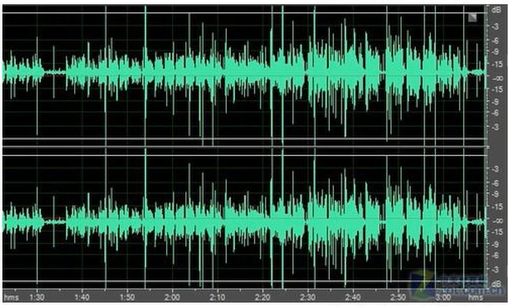

- 音频图的转换

    我们无法对原始音频图直接进行特征提取，因为原始的声波中包含了有用的信息和无关的噪声，在对声音提取特征之前要先做过滤，一般是通过梅尔频率倒谱系数（MFCC）来实现。而实现的第一步就是要对音频图（时域图）做傅里叶变换转换成频谱图（频域图），然后在频谱图的频域上去噪操作。

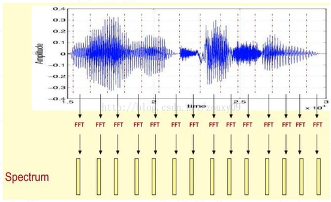

    这段语音被分为很多帧，每帧语音都对应于一个频谱（通过短时FFT计算），频谱表示频率与能量的关系。在实际使用中，频谱图有三种，即线性振幅谱、对数振幅谱、自功率谱（对数振幅谱中各谱线的振幅都作了对数计算，所以其纵坐标的单位是dB（分贝），对振幅做对数后单位为分贝，也是衡量振幅大小的单位，这个变换的目的是使那些振幅较低的成分相对高振幅成分得以拉高，以便观察掩盖在低幅噪声中的周期信号），对数会压小较大的振幅值（距离：正数）。

- 傅里叶变换

    时域：自变量是时间，即横轴是时间，纵轴是信号的变化（振幅）。其动态信号x(t)是描述信号在不同时刻取值的函数。

    频域：自变量是频率，即横轴是频率，纵轴是该频率信号的幅度（振幅），就是指信号电压大小，也就是通常说的频谱图。

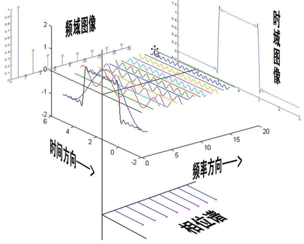

- 图像/信号滤波

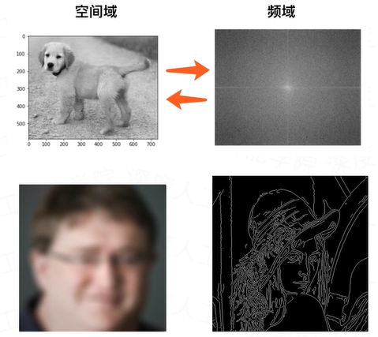

- 频谱图

    频谱图是在立体模型的频率轴方向上进行切片（单位时间内），丢去时间轴（即在每个时刻都可以拿刀在与时间轴垂直的方向上进行切片），形成以横坐标为频率，纵坐标为幅值的频谱图，表示的是一个静态的时间点上各频率正弦波的幅值大小的分布情况。

    再说的直白一点，频谱就是为了找出一个波是由多少波复合而成的。然后再对切割的这一帧图像进行90度旋转，根据振幅得到对应的频谱/声谱值。

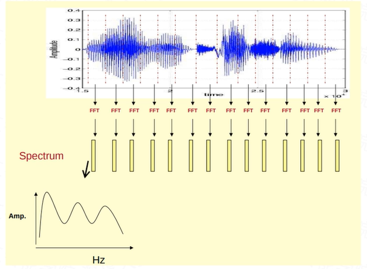

- 频谱图、声谱图

    先将其中一帧语音的频谱通过坐标表示出来。再将左边的频谱旋转90度。然后把这些幅度映射到一个灰度级表示（也可以理解为将连续的幅度量化为256个量化值），0表示黑，255表示白色。幅度值越大，相应的区域越黑。那为什么要这样呢？为的是增加时间这个维度，这样就可以显示一段语音而不是一帧语音的频谱，而且可以直观的看到静态和动态的信息。

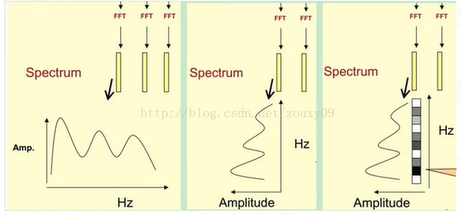

    通过FFT将音频图转成频谱图，然后再使用灰度(255,0)来表示振幅从弱到强的变化，最终得到一个随着时间变化的频谱图，这个就是描述语音信号的声谱图（音频图→频谱图→声谱图）。

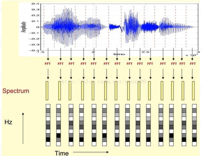

- 声谱图

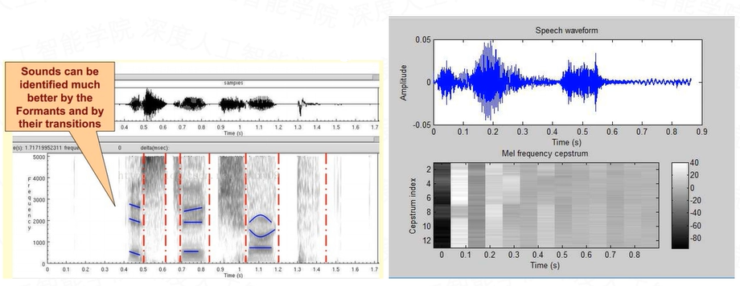

    图中很黑的地方就是频谱图中的峰值（共振峰formants）。

- 频谱图包络线

    频谱图峰值就表示语音的主要频率成分，我们把这些峰值称为共振峰（formants），而共振峰就是携带了声音的辨识属性（就是个人身份证一样）。所以它特别重要。用它就可以识别不同的声音。

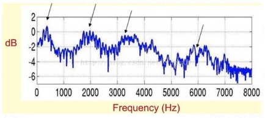

    既然它那么重要，那我们就是需要把它取出来。我们要提取的不仅仅是共振峰的位置，还得提取它们转变的过程。所以我们提取的是频谱的包络（Spectral Envelope）。这包络就是一条连接这些共振峰点的平滑曲线。

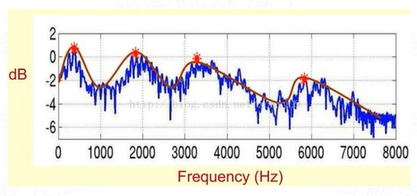

    我们可以这么理解，将原始的频谱由两部分组成：包络和频谱的细节。这里用到的是对数频谱，所以单位是dB。那现在我们需要把这两部分分离开，这样我们就可以得到包络了。

    振幅是可以通过一些手段测量得到的。而响度反映的是人对声音大小的主观感受，不仅仅与振幅有关，也和频率、频谱包络以及时域包络有关系。

    响度是人耳对声音强弱的主观感受，符号为N。声音的振幅越大，声压级（dBSPL）就越大，声压级其实也就是人们常说的“分贝”，分贝可以作为振幅的测量单位。声压级是个客观量，不受人的主观视听影响。

    一般情况下同样的声压级，不同的人的感受是不一样的。响度是个主观量，取决于听觉神经刺激的程度，比如说老年人耳朵会背，刺激成都就弱了，那么同样大的声音对老年人来说，响度就变弱了，所以响度是个主观量。

- 频谱图的FFT

    那怎么把他们分离开呢？也就是，怎么在给定logX[k]的基础上，求得logH[k]和logE[k]以满足logX[k]=logH[k]+logE[k]呢？

    为了达到这个目标，我们需要Play a Mathematical Trick。这个Trick是什么呢？就是对频谱做FFT。在频谱上做傅里叶变换就相当于做逆傅里叶变换Inverse FFT（IFFT）。频谱图就是对音频图做FFT得到的，再对频谱图做FFT，就相当于又转回了时域，所以说是FFT。需要注意的一点是，我们是在频谱的对数域上面处理的，这也属于Trick的一部分。这时候，在对数频谱上面做IFFT就相当于在一个伪频率坐标轴上面描述信号。

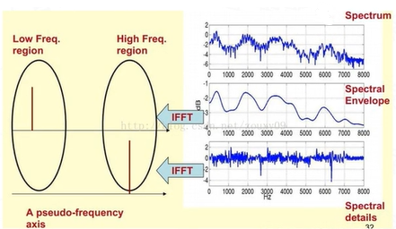

    图中我们可以看到，包络是主要是低频成分（这时候需要转变思维，这时候的横轴就不要看成是频率了，咱们可以看成时间），我们把它看成是一个每秒4个周期的正弦信号。这样我们在伪坐标轴上面的4Hz的地方给它一个峰值。而频谱的细节部分主要是高频。哦我们把它看成是一个每秒100个周期的正弦信号。这样我们在伪坐标轴上面的100Hz的地方给它一个峰值。

    在实际中咱们已经知道logX[k]，所以我们可以得到了x[k]。h[k]是x[k]的低频部分，那么我们将x[k]通过一个低通滤波器就可以得到h[k]了。没错，到这里就可以将它们分离开了，得到了我们想要的h[k]，也就是频谱的包络。

    x[k]实际上就是倒谱Cepstrum（这个是一个新造出来的词，把频谱的单词spectrum的前面四个字母顺序倒过来就是倒谱的单词了）。而我们所关心的h[k]就是倒谱的低频部分。h[k]描述了频谱的包络，它在语音识别中被广泛用于描述特征。可以认为是被高度去噪后的频谱信息。

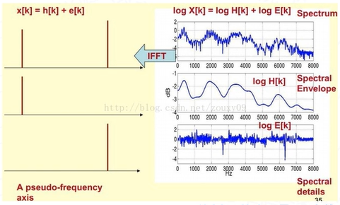

- 倒谱

    1. 将原音频信号经过傅里叶变换得到频谱：X[k]=H[k]×E[k]；只考虑幅度就是：|X[k]|=|H[k]|×|E[k]|；

    1. 我们在两边取对数：log||X[k]||=log(||H[k]||×||E[k]||)=log||H[k]||+log||E[k]||

    1. 再在两边取逆傅里叶变换得到：x[k]=h[k]+e[k]

    将线性特征转为非线性特征，或者将非线性特征转换为线性特征。

    这实际上有个专业的名字叫做同态信号处理。它的目的是将非线性问题问题转化为线性问题的处理方法。对应上面，原来的语音信号实际上是一个卷性信号（声道相当于一个线性时不变系统，声音的产生可以理解为一个激励通过这个系统），第一步通过卷积将其变成了乘性信号（时域的卷积相当于频域的乘积）。第二步通过取对数将乘性信号转化为加性信号，第三步进行逆变换，使其恢复为卷性信号。这时候，虽然前后均是时域序列，但它们所处的离散时域显然不同，所以后者称为倒谱频域。总结下，倒谱（cepstrum）就是一种信号的弗列也变换经过对数运算后再进行傅里叶变换得到的谱。

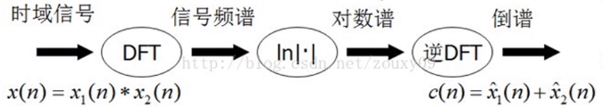

- Mel频率分析

    给出一段语音，我们可以得到它的频谱包络（连接所有共振峰值点的平滑曲线）了。但是，对于人类听觉感知的实验表明，人类听觉的感知只聚焦在某些特定的区域，而不是整个频谱包络。

    而Mel频率分析就是基于人类听觉感知实验的。实验观测发现人耳就像一个滤波器组一样，它只关注某些特定的频率分量（人的听觉对频率是有选择性的）。也就是说，它只让某些频率的信号通过，而压根就直接无视它不想感知的某些频率信号。但是这些滤波器在频率坐标轴上却不是统一分布的，在低频区域有很多的滤波器，他们分布比较密集，但在高频区域，滤波器的数目就变得比较少，分布很稀疏。

    人的听觉系统是一个特殊的非线性系统，它响应不同频率信号的灵敏度是不同的。在语音特征的提取上，人类听觉系统做得非常好，它不仅能提取出语义信息，而且能提取出说话人的个人特征，这些都是现有的语音识别系统所望尘莫及的。如果在语音识别系统中能模拟人类听觉感知处理特点，就有可能提高语音的识别率。

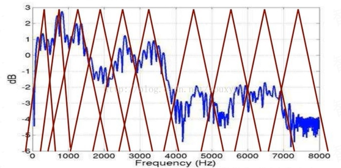

- 梅尔频率倒谱系数

    梅尔频率倒谱系数（Mel Frequency Cepstrum Coeffcient，MFCC）考虑到了人类的听觉特征，先将线性频谱映射到基于听觉感知的Mel非线性频谱中，然后转换到倒谱上，还原成线性。

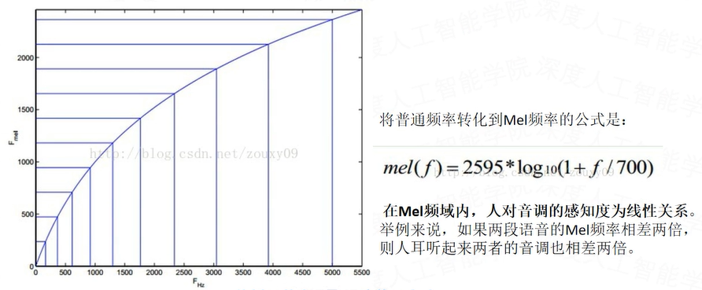

    在Mel频率上面获得的倒谱系数h[k]就称为Mel频率倒谱系数，简称MFCC。我们将频谱通过一组Mel滤波器就得到Mel频谱。

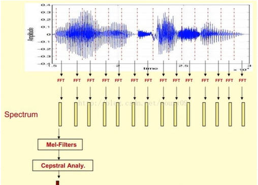

MFCC特征提取过程：

    1. 先对语音进行预加重、分帧和加窗（加强语音信号性能、信噪比、、处理精度等的一些预处理）

    1. 对每一个短时分析窗，通过FFT得到对应的频谱（获得分布在时间轴上不同时间窗内的频谱）

    1. 将上面的频谱通过Mel滤波器组得到Mel频谱（通过Mel频谱，将线性的自然频谱转换为体现人类听觉特性的Mel频谱，非线性）

    1. 在Mel频谱上进行倒普分析（取对数，转回线性，做逆变换，通过DCT实现），获得Mel频率倒谱系数MFCC，MFCC就是这帧语音的特征；这时候，语音就可以通过一系列的倒谱向量来描述了，每个向量就是每帧的MFCC特征向量。这样就可以通过这些倒谱向量对语音分类器进行训练和识别了。

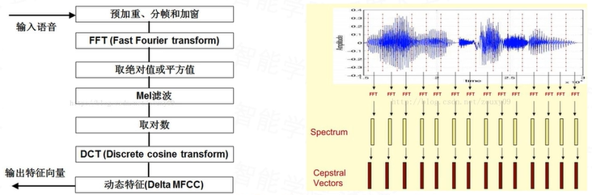

- MFCC流程图

    DCT是DFT的一种形式，所谓“余弦变换”，实在DTFT傅里叶级数展开式中，如果被展开的函数是实偶函数，那么其傅里叶级数中只包含余弦项，再将其离散化（DFT）可导出余弦变换，因此称之为离散余弦变换（DCT）。其实DCT属于DFT的一个子集。DCT用于语音和图像处理比较多。

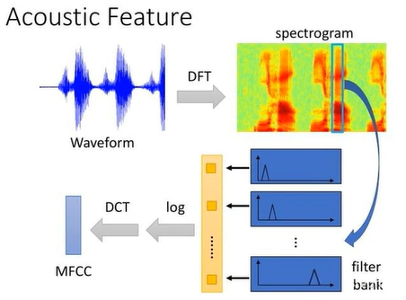

### 7. 语音识别的应用

- 语音唤醒（使用特定词唤醒设备）

- 语音命令（使用特定词进行特定的操作）

- 声纹识别（语音解锁）

- 语音生成（类似图像生成，生成一段特定的语音）

### 8. 语音识别的问题

当前技术还存在很多不足，如对于强噪声、超远场、强干扰、多语种、大词汇等场景下的语音识别还需要很大的提升；另外，多人语音识别和离线语音识别也是当前需要重点解决的问题。虽然语音识别还无法做到无限制领域、无限制人群的应用，但是至少从应用实践中我们看到了一些希望。

语音识别主要有以下五个问题：

- 对自然语言的识别和理解。首先必须将连续的讲话分解为词、音素等单位，其次要建立一个理解语义的规则。

- 语音信息量大。语音模式不仅对不同的说话人不同，对同一说话人也是不同的，例如，一个说话人在随意说话和认真说话的语音信息是不同的。一个人的说话方式随着时间变化。

- 语音的模糊性。说话者在讲话时，不同的词可能听起来是相似的。这在英语和汉语中常见。

- 单个字母或词、字的语音特性受上下文的影响，以致改变了重音、音调、音量和发音速度等。

- 环境噪声和干扰对语音识别有严重影响，致使识别率低。