### 1. 

- 什么是自然语言？

自然语言指的是人类语言，区别与机器语言。

- 什么是语义？

人类语言所能表达的涵义，受语境（上下文）影响很大。

- 什么是自然语言处理？

让计算机处理人类语言。

### 2. 词向量

#### 2.1 词向量简介

- beijing和china的关系，相当于tokyo和谁的关系？

在自然语言中，可以很轻松的理解为首都和国家之间的关系。为了让计算机可以处理这些单词，那么就需要将单词转换为计算机可以识别的向量，也就是词向量。每个词向量还需要保留彼此之间的关联关系，用于加强对语义的处理。

- 人类怎么衡量两个字/词之间的相关性？计算机怎么衡量两个字/词之间的相关性？

beijing是china的首都，tokyo是japan的首都，这是人类的思维理解方式。那么计算机是如何衡量的呢？体现在词向量的相似度。

#### 2.2 字词的向量化

1. 词向量的概念

将普通的词汇转换成一组具有某种关联的向量，这种向量应该和词一一对应。

1. 词向量的维（长）度

词向量的长度越长表达的越细节。

1. 分词与词频

分词就是将语句拆分成词汇的过程，比如”我喜欢你“可以分为我、喜欢、你，可以理解为词是自然语言里的最小单位。

词频是在分词过程中对词汇的频率统计。

1. 词向量之间的关系

比如beijing和china之间的关系，tokyo和japan之间的关系。

### 3. 词编码

#### 3.1 OneHot编码

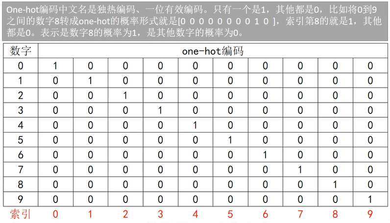

#### 3.2 OneHot优势

1. 通过one-hot编码，可以对特征进行扩充。

1. 连续变量经过编码后，从一个权重变为多个权重，提升了模型的非线性能力。

1. 不需要多参数进行归一化处理，每组特征之间的距离是一样的，显得更合理。

1. 随着将大权重拆分成几个小权重管理特征，降低了异常值对模型的影响，增加了模型稳定性。

1. 生成了较大的稀疏矩阵（数值为0的元素数目远远多于非0元素），计算速度更快。

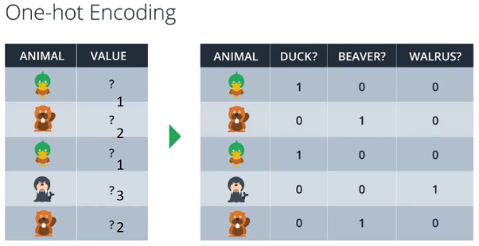

#### 3.3 霍夫曼编码

3棵二叉树，都有4个叶子节点a、b、c、d，分别带权7、5、2、4，求他们各自的带权路径长度。

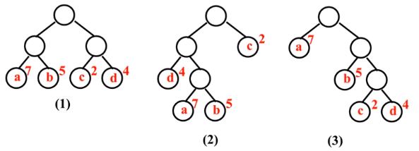

1. WPL = 7 × 2 + 5  × 2 + 2  × 2 + 4  × 2 = 36

1. WPL = 7 × 3 + 5  × 3 + 2  × 1 + 4  × 2 = 46

1. WPL = 7 × 1 + 5  × 2 + 2  × 3 + 4  × 3 = 35

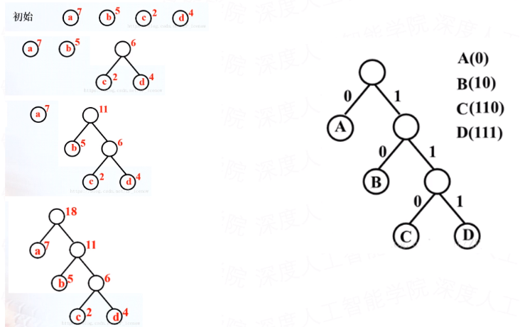

### 4. SEQ注意力

#### 4.1 SEQ2SEQ注意力

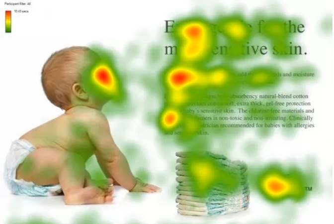

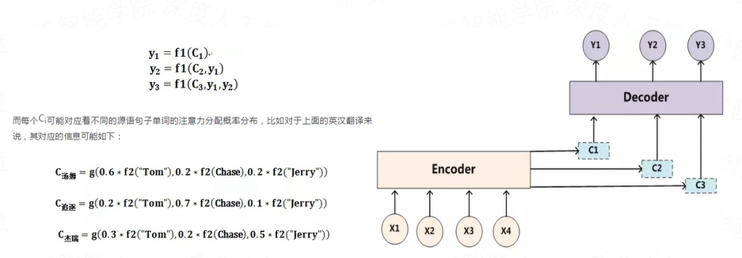

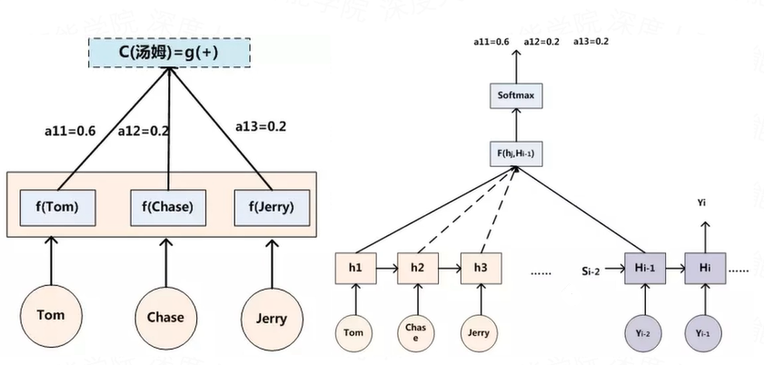

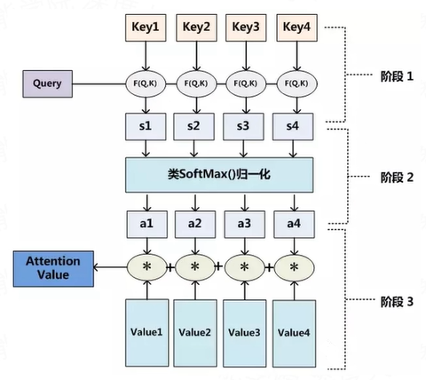

### 5. 语言模型

#### 5.1 词向量

1. 什么是词向量

真实世界抽象存在的文字转换成可以进行数学公式操作的向量，而对这些向量的操作，才是NLP真正要做的任务。

1. 横向比较word2vec、ELMo、BERT

word2vec→ELMo：上下文无关的static静态向量变成上下文相关的dynamic动态向量，比如苹果在不同语境vector不同。

ELMo→BERT：训练出的word-level单词层向量变成sentence-level句子层的向量，下游具体NLP任务调用更方便，修正了ELMo模型的潜在问题。

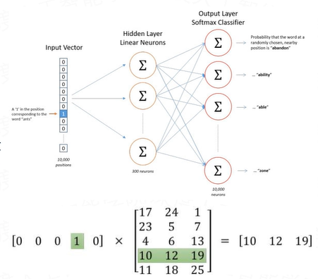

#### 5.2 word2vec

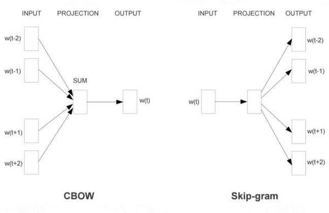

#### 5.3 EMLo

2018年论文《Deep contextualized word representations》，在这篇论文中提出了一个很重要的思想ELMo。ELMo的提出对后面的GPT和BERT有一个很好的引导和启发的作用。ELMo是一种基于特征的语言模型，用预训练好的语言模型，生成更好的特征。

ELMo是一种新型深度语境化词表征，可对词进行复杂特征（如句法和语义）和词在语言语境中的变化进行建模（即对多义词进行建模）。

ELMo的主要做法是先训练一个完整的语言模型，再用这个语言模型去处理需要训练的文本，生成相应的词向量。

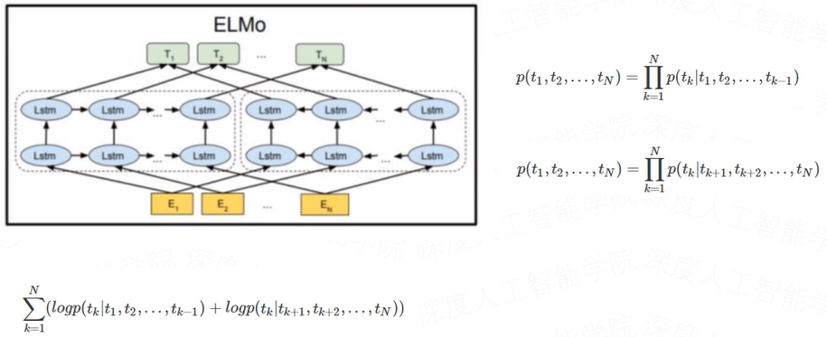

总结：

1. ELMo的假设前提一个词的词向量不应该是固定的，所以在一词多义方面ELMo的效果一定比word2vec要好。

1. word2vec的学习词向量的过程是通过中心词的上下窗口去学习，学习的范围太小了，而ELMo在学习语言模型的时候是从整个语料库去学习的，而后再通过语言模型生成的词向量就相当于基于整个语料库学些的词向量，更加准确代表一个词的意思。

1. ELMo还有一个优势，就是它建立语言模型的时候，可以运用非任务的超大语料库去学习，一旦学习好了，可以平行的运用到相似问题。

#### 5.4 Transformer

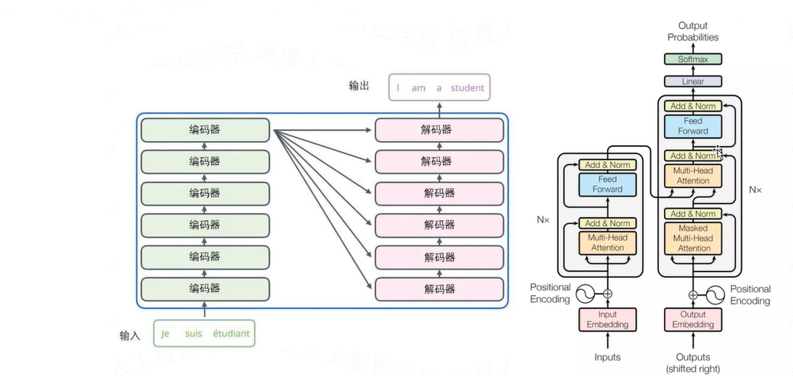

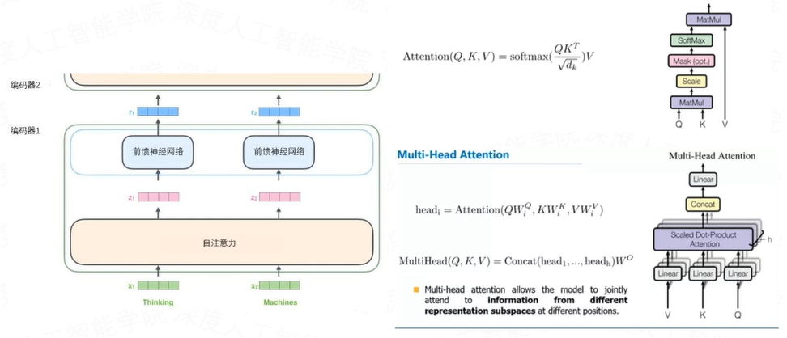

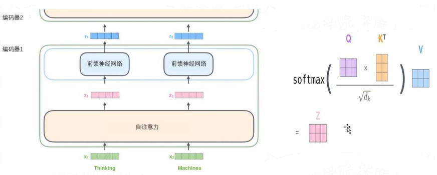

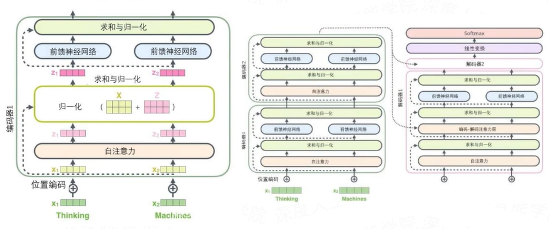

#### 5.5 Self-Attention

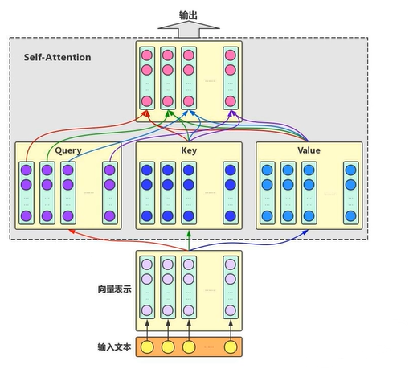

#### 5.6 Multi-head Self-Attention

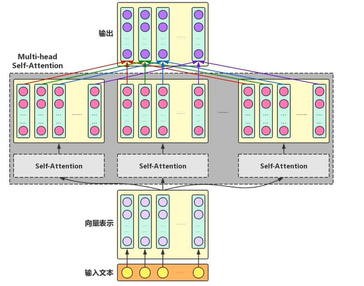

#### 5.7 位置编码

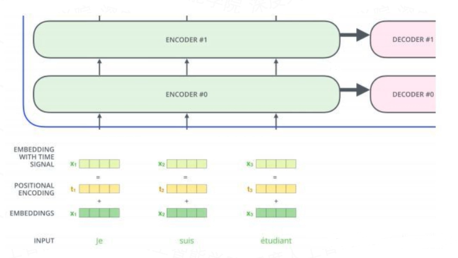

#### 5.8 BERT

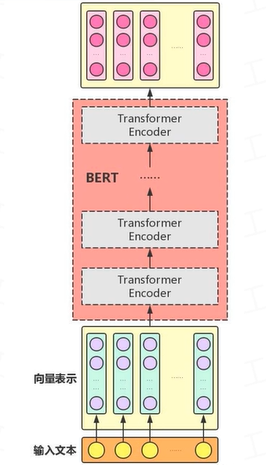

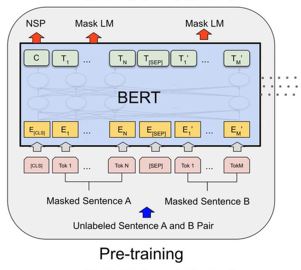

#### 5.9 Mask LM

类似于完形填空，随机mask掉15%的词，让BERT来预测。

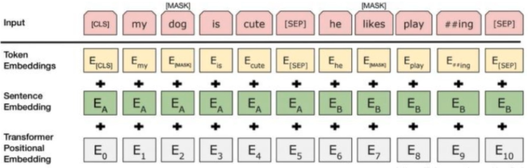

#### 5.10 GPT

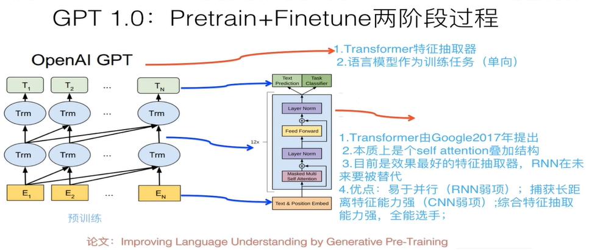

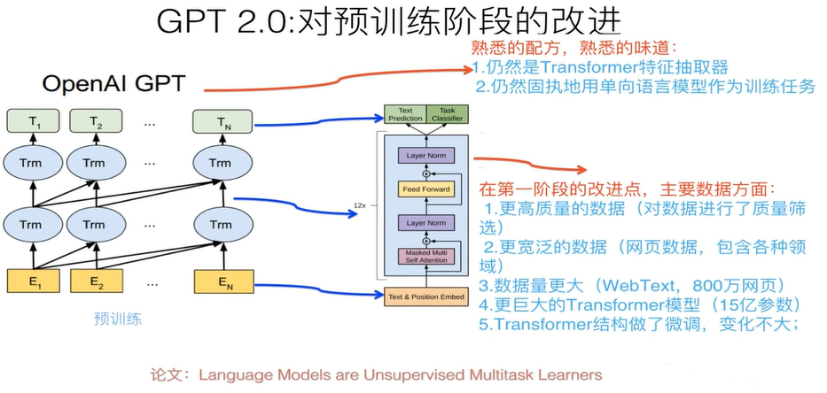

GPT2与GPT的不同点

1. fine-tuning层：不再针对不同任务分别进行微调建模，而是不定义这个模型应该做什么任务，模型会自动识别出来需要做什么任务。学习的是一个通用NLP模型。

1. 增加数据集：数据集包含800万个网页，大小为40G。GPT2需要的是带有任务信息的数据。

1. 增加网络参数：GPT2将Transformer堆叠的层数增加到48层，隐层的维度为1600，参数量更是达到了15亿（BERT是3.4亿）。

1. 调整Transformer：将layernorm放到每个sub-block之前；在最终自注意块之后添加了额外的层标准化；残差层的参数初始化根据网络深度进行调节。

1. 其他：GPT2将词汇表增加到5万（BERT英文是3万，中文是2万）;embedding size包括768，1024，1280，1600；可处理单词序列长度从GPT的512提升到1024；batchsize增加到512。

#### 5.11 GPT-mask

有4个单词的序列（例如，机器人必须遵守命令）。在一个语言建模场景中，这个序列会分为4个步骤处理，每个步骤处理一个词（假设现在每个词是一个token）。由于这些模型是以batch size的形式工作的，我们可以假设这个玩具模型的batch size为4，它会将整个序列作（包括4个步骤）为一个batch处理。

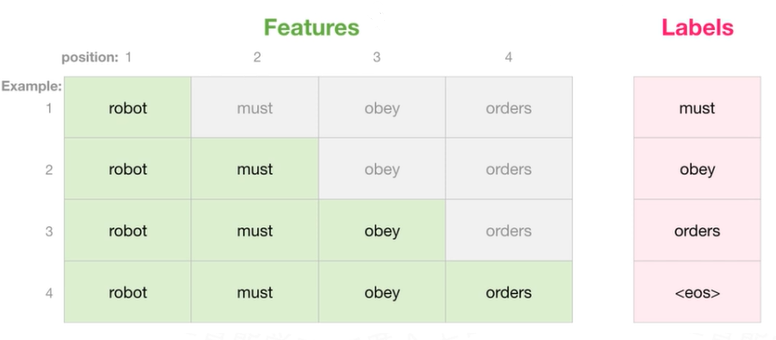

在矩阵的形式中，我们把Query矩阵和Key矩阵相乘来计算分数。让我们将其可视化如下，不同的是，我们不使用单词，而是使用与格子中单词对应的Query矩阵（或者Key矩阵）。

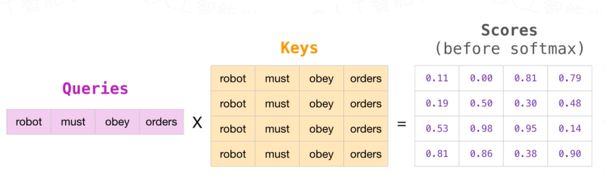

在做完乘法之后，我们加上三角形的attention mask。它将我们想要屏蔽的单元格设置为负无穷大或者一个非常大的负数（例如GPT2中的负十亿）。

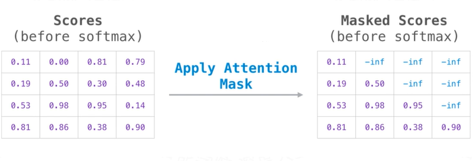

然后对每一行应用softmax，会产生实际的分数，我们会将这些分数用于Self Attention。

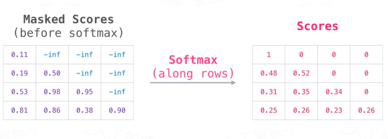