### 1. 从蹒跚学步说起

1. 宝宝开始走路，成功的到达了沙发上

由于沙发是最终目标，孩子和父母都很开心。

所以，宝宝很开心并得到父母的赞赏。

这是积极的（或者说正向的/阳性的），宝宝感觉良好（正奖励+n）。

1. 宝宝开始走路，由于中间的障碍而摔倒，并被擦伤。

宝宝受伤并且疼痛。这是消极的，婴儿哭（负奖励-n）。

这就是我们人类学习的方式，通过跟踪和试错。

强化学习在概念上与此相同，它通过行为进行学习，是一种计算的方法。

### 2. 强化学习的过程

假设强化学习智能体正在学习马里奥。强化学习过程可以建模为迭代循环，其工作方式如下：

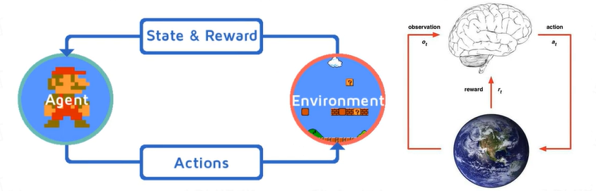

RL智能体从环境（即马里奥）接收状态S0。

基于该状态S0，RL智能体采取动作A0，比如说智能体向右移动。最初，这是随机的。

现在，环境处于新的状态S1（来自马里奥或游戏引擎的新帧）

环境给予RL智能体一些奖励R1。它可能会给出+1，因为智能体还没有死。

这个RL循环一直持续到我们死了或到达目的地，并且它不断输出一系列状态，动作和奖励。

我们的RL智能体的基本目标是最大化奖励。

### 3. 奖励最大化

假设RL智能体（机器老鼠）在迷宫中，其中包含奶酪、电击和猫。目标是在被猫吃掉或者受到电击之前吃掉最多的奶酪。

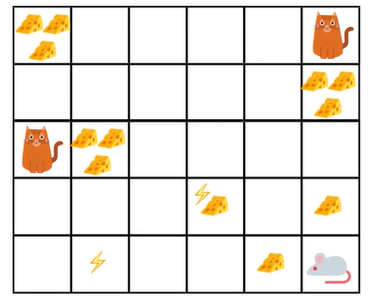

很明显，最好吃它附近的奶酪而不是靠近猫或有电击的奶酪，因为机器老鼠越接近电击或猫，死亡的危险就越大。因此，猫或电击附近的奖励，即使它更大（奶酪更多），也会打折扣。这是因为不确定因素。

### 4. 探索和开发的权衡

强化学习中有一个重要的探索和开发权衡概念。探索就是要找到有关环境的更多未知的信息，而开发则利用已知信息来最大化回报。

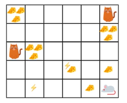

在上面的游戏中，我们的机器鼠可以吃很多小奶酪（每个+0.5），但在迷宫顶部有一堆奶酪（+100）.因此，如果我们只专注于最近的奖励，我们的机器鼠永远不会获得大堆的奶酪，他只会开发。

### 5. 奖励的折扣率

可以定义一个名为γ的折扣率。它应该在0和1之间。γ越大，折扣越小。因此，我们的累计的预期（折扣）奖励是：

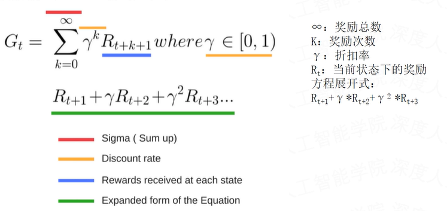

### 6. 强化学习中的任务及其类型

任务是强化学习问题的一个实例。一般有两种类型的任务：持续和偶发。

- 持续的任务

持续的任务类型。例如，一个做自动外汇/股票交易的RL智能体。

在这种情况下，智能体必须学习如何选择最佳操作，并且同时要与环境交互。没有起点和终点状态。RL智能体必须持续运行，直到我们决定手动停止它。

- 偶发的任务

在这种情况下，我们有一个起点和终点，称为终端状态（terminal state）。这会创建一个情节（episode）：状态列表S、行为列表A、奖励列表R

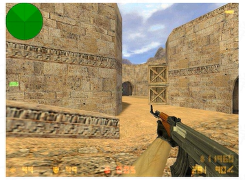

例如，打一场反恐精英，我们射杀对手或者被他们杀死。要么杀死了所有对手，要么被对手杀死，只有两种情况可以完成情节。

### 7. 强化学习的方法

1. 基于价值的方法（价值模型）

在基于价值的强化学习中，智能体的目标是优化价值函数V(s)，这个函数被定义为告诉我们智能体要达到的每个状态下获得的最大预期未来奖励。

每个状态的价值是RL智能体可以预期从特定状态获得的奖励总额，包括当前奖励和未来奖励的期望。

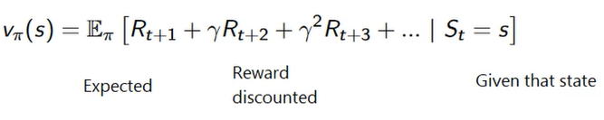

当前V价值就等于当前状态下（做了某个动作后）对未来汇报的影响，这种影响具体到数值上的表现就是（做了这个动作后）未来每个特定状态下的奖励总和的期望值。

智能体将使用上述价值函数来挑选每个步骤中选择的状态。智能体将始终采用具有最大价值的状态。

1. 基于策略的方法（策略模型）

在基于策略的强化学习中，我们有一个需要优化的策略函数。该策略主要定义了智能体的行为：

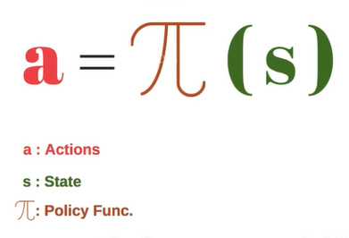

智能体在当前状态下，执行不同的策略会发出不同的行为动作，不同的动作奖励也不同。一般的策略模型是选择奖励最大的动作来执行。

这也就是说在每一步行动中，智能体最终发出什么动作，和智能体执行的策略相关。所以整个过程可以使用策略函数来表示。策略函数实际上就是一个最优路径选择模型。

我们学习了一个策略函数，帮助我们将每种情况映射到最佳行为。

我们将策略分为两类：

- 确定性：给定状态下的策略将始终返回相同的行为(a)。这意味着，它被预映射为S=(s) → A=(a) 。

- 随机性：它给出了不同行为的概率分布。即随机策略→p(A=a|S=s)

### 8. 马可夫链

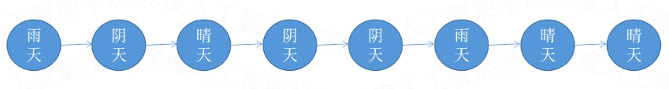

马可夫链只和上个已知状态有关，和上个状态之前的状态无关。但是如果不知道上个状态的时候，就和上上个状态，甚至更早的状态有关了。这种就不是马可夫链。还有一种是当前状态由前两个或几个状态共同决定的，也不是马可夫链。这种情况称为高阶马可夫链。

### 9. 马可夫模型

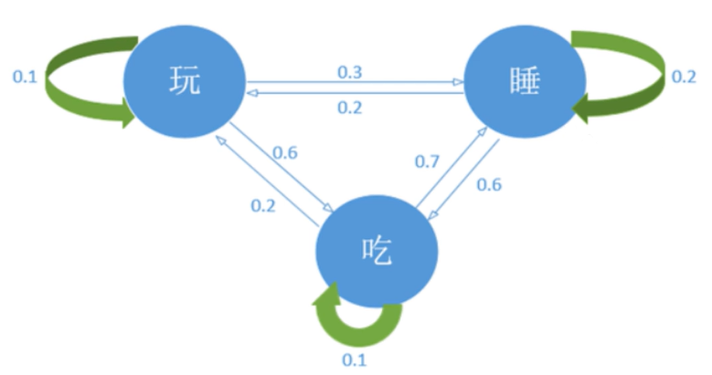

### 10. 马可夫随机过程

马可夫随机过程实际上是一个价值模型，当前状态下的奖励等于未来所有奖励总和的期望。

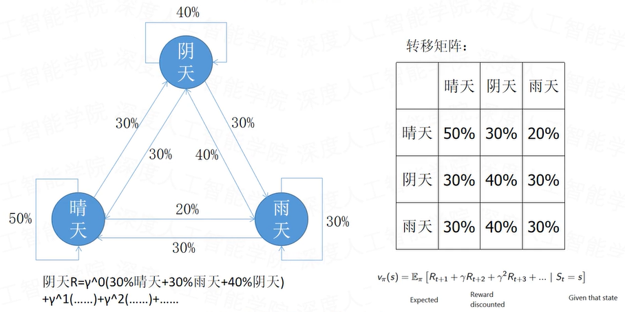

### 11. 马可夫决策过程

和马可夫随机相比，马可夫决策过程是一个策略模型，当前状态下的奖励等于当下所选择的路径（策略）带来的未来奖励的总和。

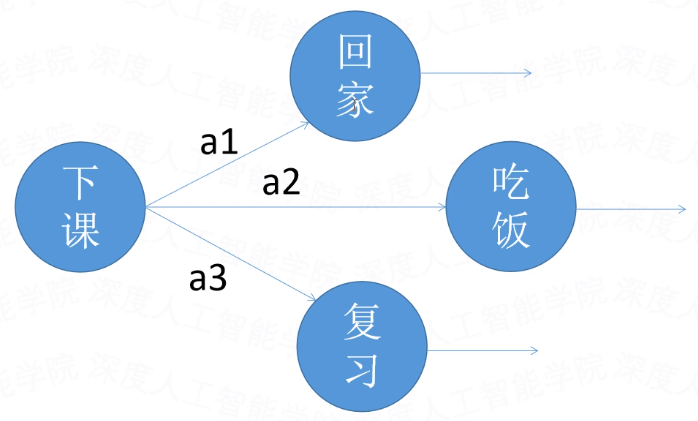

### 12. V价值

V价值是用状态来衡量的，当前的价值由未来每个状态的价值总和的期望来决定，可以用马可夫随机过程来衡量，是一个价值模型。

从一个状态转移到另一个状态会得到一个分数，而这个分数是由转移概率来分配的。这个过程中，V价值是确定的，只和前一步的已知状态有关：V(s)。

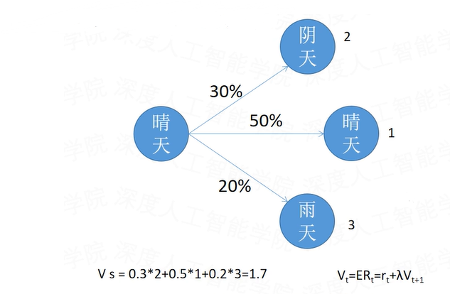

### 13. V价值的更新

在只有一种状态转移的情况下的更新：

V价值更新时，只和下一步的奖励有关，在折扣率γ为1的情况下，当前这一步的奖励=当前奖励+下一步的奖励（折扣为1）。

由于V价值是未来奖励综合的期望，所以当奖励不再被更新的时候的奖励就是V价值。

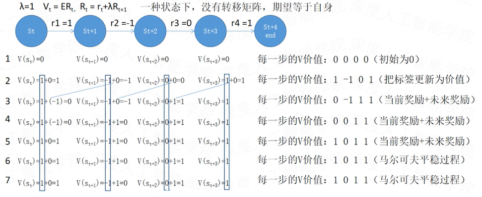

### 14. Q价值

Q价值是在一种状态S下，先执行某个动作a后，再采取某策略（最优策略）后，所带来的累积奖励。

Q价值是马可夫决策过程产生的，是一个策略模型。

当前的状态不能完全决定价值，还和下一步选择哪个动作走哪条路径有关：Q(s,a)。

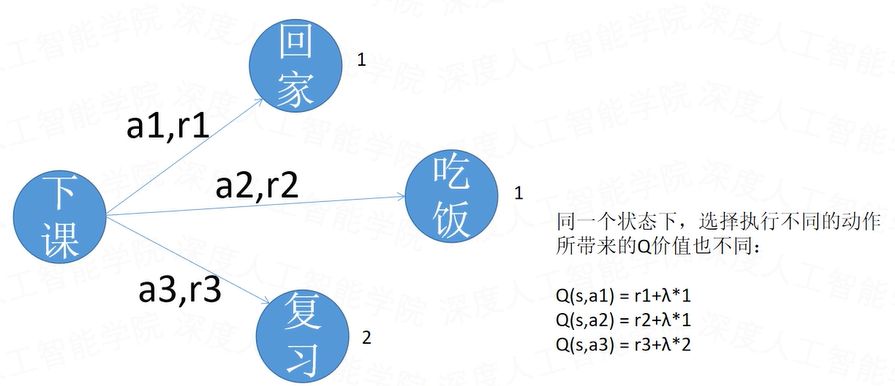

### 15. 动作优势

V价值是总奖励的期望值，一个价值减去期望值，就是它的价值优势。也就是说做了这个动作比做另一个动作的优势有多少。Q价值一定比V价值有优势吗？

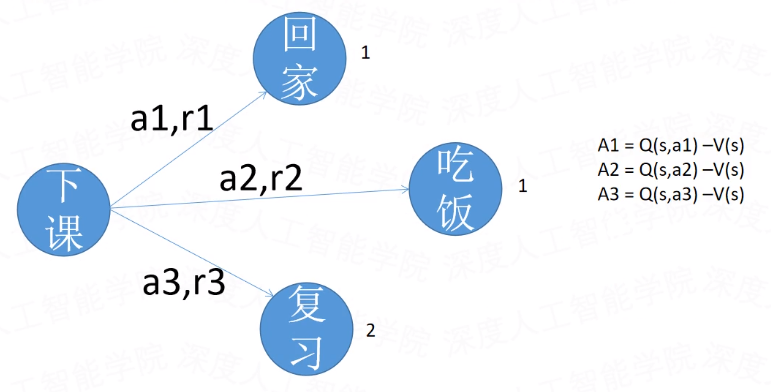

### 16. V价值和Q价值的计算

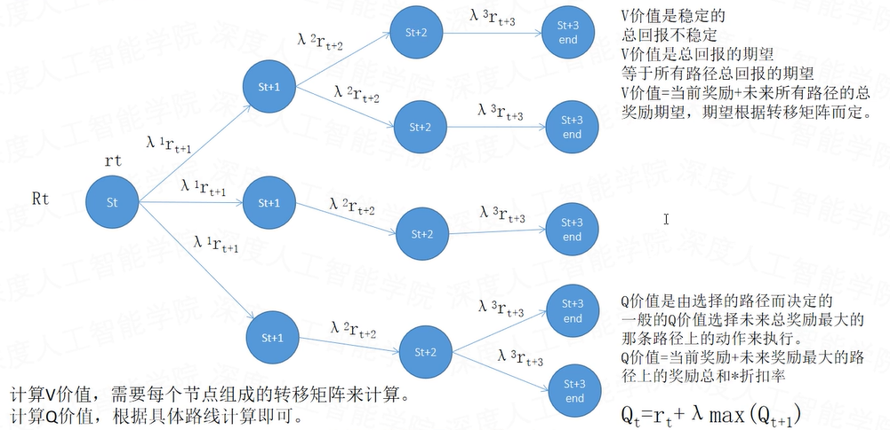

### 17. Bellman方程

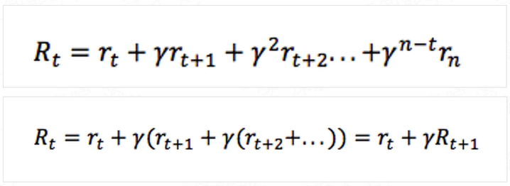

### 18. Q函数

使用Q函数来衡量Q价值。Q价值就是未来奖励最大的那条路径上的奖励总和，是一个策略函数。

在Q价值中，从一个状态到另一个状态的转换，选择什么动作，是跟价值相关的。

未来的奖励是在未来每个状态下，执行最大奖励下的动作得到的，但是事先并不知道最大奖励是多少，因为最大奖励在未来才会出现。

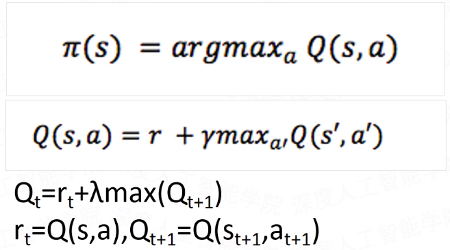

### 19. Q-Learning

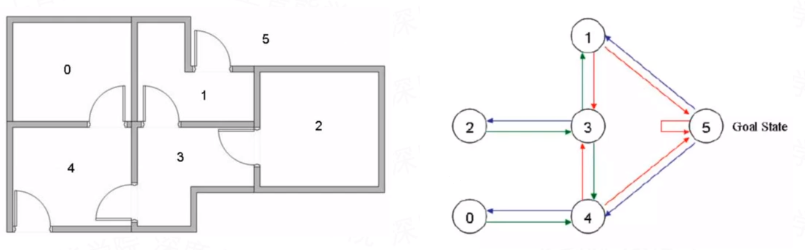

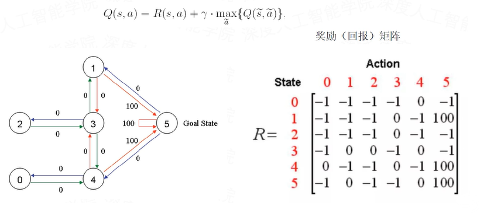

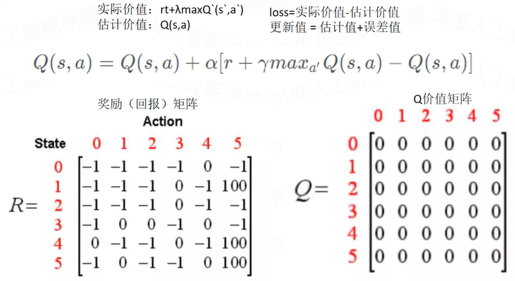

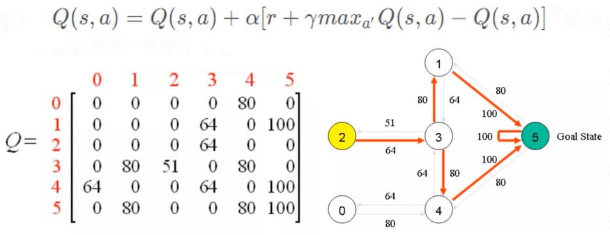

- 不能解决状态无限问题

- 不能解决动作无限问题

### 20. DQN（Deep Q-Network）

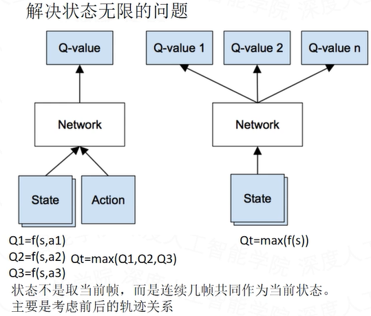

估计值：

第一种神经网络输入三次，每次输出一个Q值。

第二种神经网络输入一次，输出三个可能的Q值，选择执行了这次动作a对应的那个Q值。

实际值：

实际值选的是st+1状态下的回报最大的那个动作a的Q值。

st、at、rt、st+1在采样过程中，选择不了动作最大的Q值来计算估计值的。因为样本已经被采集来训练了，是已经形成的事实。所以只能选择已经执行了的某个动作所带来的Q值。

因为未来还没有发生，所以可以选择回报可能最大的动作，以此来获得最大的Q值作为实际值，可见实际值也是预估的。

### 21. DQN的样本

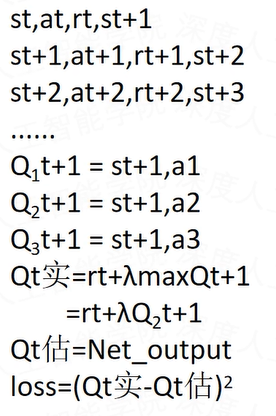

顺序采样得到的样本相关性很大，往往上一帧的图像和下一帧的图像是很接近的，相关性太大，它们之间的损失就很小，梯度很难更新，容易造成梯度弥散，神经网络也就难训练。

另外数据之间的相关性大，相当于减少了可学习的样本，这样很容易导致过拟合。一般样本的有效数量大于参数的10-20倍左右，网络才能学习到数据的特征。当数据过少的时候，就过拟合了。

采用随机采样去除样本之间的相关性。

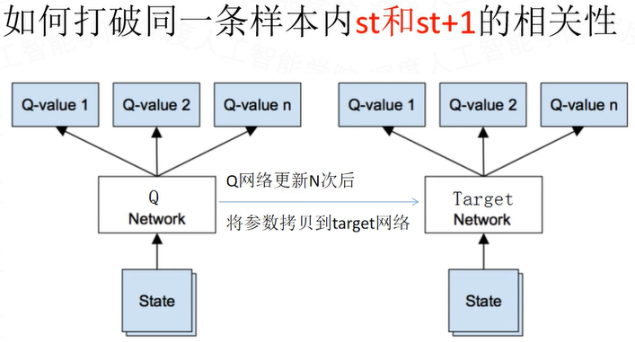

训练两个网络：从图中可知，target网络一直是一个old网络，而Q网络是一个实时更新的网络，target网络具有延后性。所以估计（St）值使用Q网络去算，实际值（St+1）可以使用target网络去算。由于实际值也是预估出来的，所以可以使用target网络。

### 22. 强化学习的开发和探索

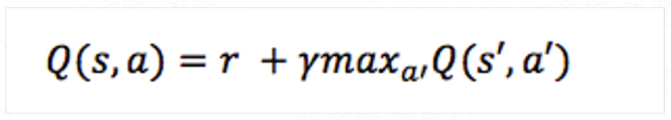

探索值给一个0到1的定值，每次训练的时候，随机生成一个0到1的小数，如果随机数大于探索值，就执行Q值最大的那个动作（开发），如果随机数小于探索值，就随机选择一个动作执行（探索）。

探索值随时间衰减（随机数增加），刚开始探索值较大，随着训练，对环境越来越熟悉，探索值可以逐渐减小。

### 23. AC模型

- 基于价值的网络：输入一个状态和一个动作，输出这个状态和动作下的价值，用来衡量某次状态动作带来的价值回报。

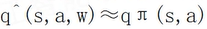

- 基于策略的网络：创建一个神经网络，输入一个状态，然后输出一个动作的概率值。

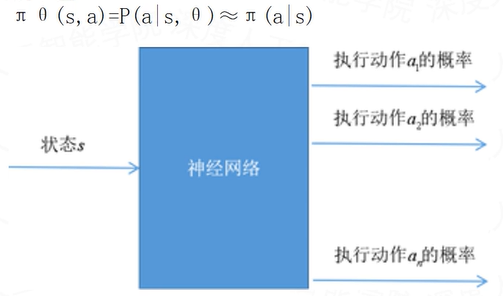

Actor基于概率分布选择行为，Critic基于Actor生成的行为评判得分，Actor再根据Critic的评分修改选行为的概率。

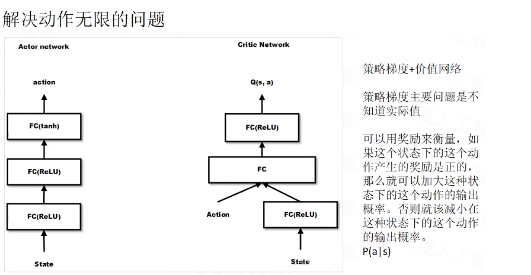

### 24. DDPG（Deep Deterministic Policy Gradient）

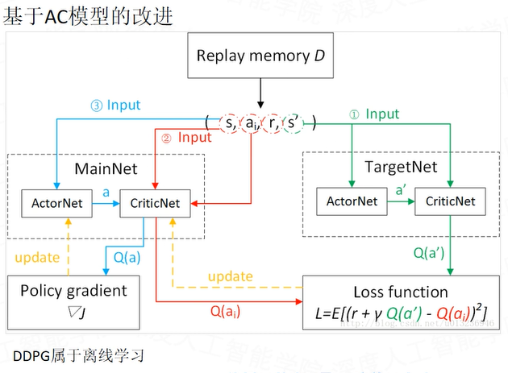