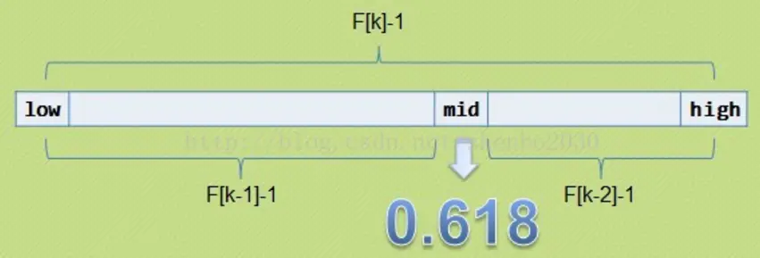
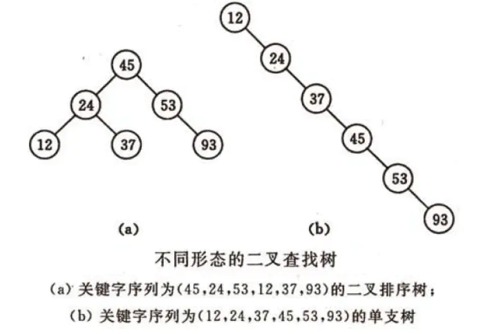
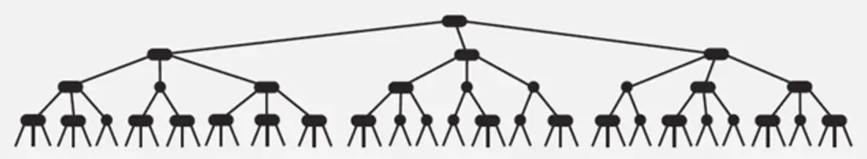
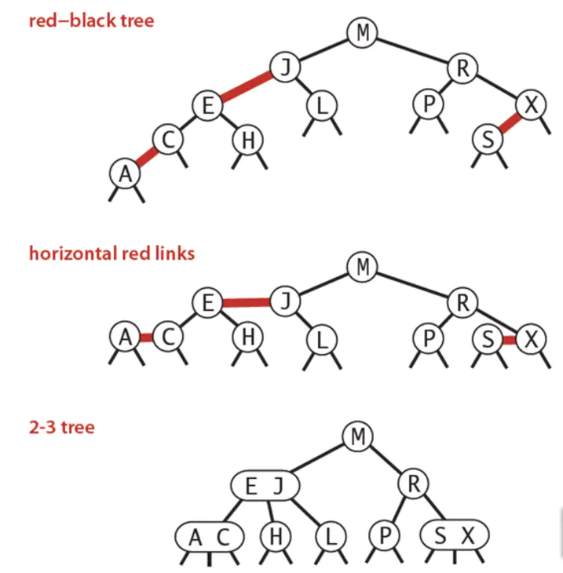
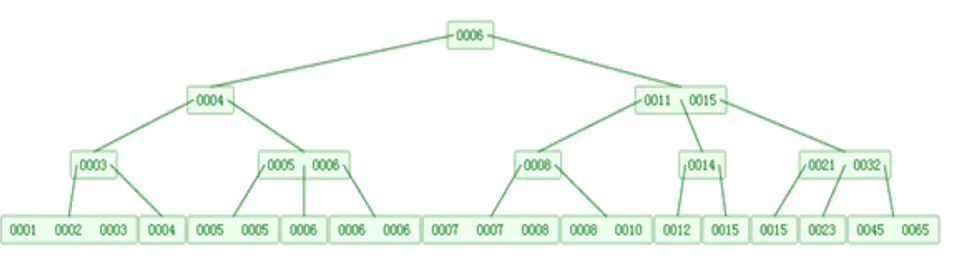
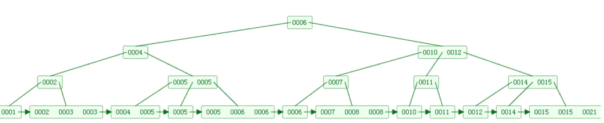
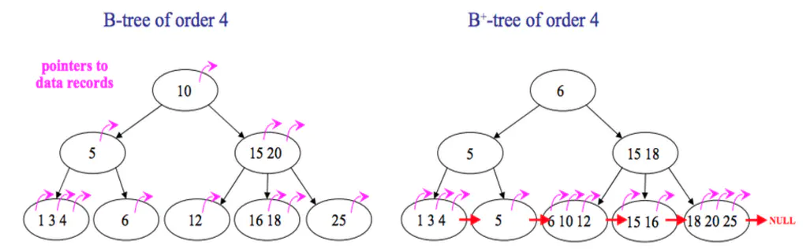

### 七大查找算法

本文简单概括性的介绍了常见的七种查找算法，说是七种，其实二分查找、插值查找以及斐波那契查找都可以归为一类——插值查找。插值查找和斐波那契查找是在二分查找的基础上的优化查找算法。

查找定义：根据给定的某个值，在查找表中确定一个其关键字等于给定值的数据元素（或记录）。

- 查找算法分类：

1. 静态查找和动态查找

    静态或者动态查找都是针对查找表而言的。动态表指查找表中有删除和插入操作的表。

1. 无序查找和有序查找

    无序查找：被查找数列有序无序均可；

    有序查找：被查找数列必须为有序序列。

- 平均查找长度（Average Search Length，ASL）：

    需和指定key进行比较的关键字的个数的期望值，称为查找算法在查找成功时的平均查找长度。

    对于含有n个数据元素的查找表，查找成功的品滚查找长度为：ASL = Pi * Ci。

    Pi：查找表中第i个数据元素的概率。

    Ci：找到第i个数据元素时已经比较过的次数。

#### 1. 顺序查找

- 说明：

    顺序查找适合于存储结构为顺序存储或链接存储的线性表。

- 基本思想：

    顺序查找也称为线形查找，属于无序查找算法。从数据结构线形表的一端开始，顺序扫描，依次将扫描到的结点关键字与给定值k相比较，若相等则表示查找成功；若扫描结束仍没有找到关键字等于k的结点，表示查找失败。

- 复杂度分析：

    查找成功时的平均查找长度为（假设每个数据元素的概率相等）ASL = (n + 1) / 2；

    查找失败时，需要n + 1次比较，时间复杂度为O(n)；

    所以，顺序查找的时间复杂度为O(n)。

#### 2. 二分查找

- 说明：

    元素必须时有序的，如果是无序的则要先进行排序操作。

- 基本思想：

    也称折半查找，属于有序查找算法。用给定值k先与中间结点的关键字比较，中间结点把线形表分成两个子表，若相等则查找成功；若不相等，再根据k与该中间结点关键字的比较结果确定下一步查找哪个子表，这样递归进行，直到查找到或查找结束发现表中没有这样的结点。

- 复杂度分析：

    最坏情况下，关键词比较次数为log2(n+1)，且期望时间复杂度为O(log2n)；

注：折半查找的前提条件是需要有序表顺序存储，对于静态查找表，一次排序后不再变化，折半查找能得到不错的效率。但对于需要频繁执行插入或删除操作的数据集来说，维护有序的排序会带来不小的工作量，那就不建议使用。

#### 3. 插值查找

在介绍插值查找之前，首先考虑一个新问题，

打个比方，在英文字典里面查“apple”，你下意识翻开字典是翻前面的书页还是后面的书页呢？如果再让你查“zoo”，你又怎么查？很显然，这里你绝对不会是从中间开始查起，而是有一定目的的往前或往后翻。

同样的，比如要在取值范围1 ~ 10000中间100个元素从小到大均匀分布的数组中查找5，我们自然会考虑从数组下标较小的开始查找。

经过以上分析，折半查找这种查找方式，不是自适应的（也就是说是傻瓜式的）。二分查找中查找点计算如下：

mid = (low + high)/2，即mid = low + (high - low)/2；

通过类比，我们可以将查找的点改进如下：

mid = low + (key - a[low])/(a[high] - a[low]) * (high - low)，

也就是将上述的比例参数1/2改进为自适应的，根据关键字在整个有序表中所处的位置，让mid值的变化更靠近关键字key，这样也就简介的减少了比较次数。

- 基本思想：

    基于二分查找算法，将查找点的选择改进为自适应选择，可以提高查找效率。当然，插值查找也属于有序查找。

注：对于表长较大，而关键字分布又比较均匀的查找表来说，插值查找算法的平均性能比折半查找要好的多。反之，数组中如果分布非常不均匀，那么插值查找未必是很合适的选择。

- 复杂度分析：

    查找成功或失败的时间复杂度均为O(log2(log2n))。

#### 4. 斐波那契查找

在介绍斐波那契查找算法之前，我们先介绍一下跟它很紧密相连并且大家都熟知的一个概念——黄金分割。

黄金比例又称黄金分割，是指事物各部分间一定的数学比例关系，即将整体一分为二，较大部分与较小部分之比等于整体与较大部分之比，其比值约为1:0.618或1.618:1。

0.618被公认为最具有审美意义的比例数字，这个数值的作用不仅仅体现在诸如绘画、雕塑、音乐、建筑等艺术领域，而且在管理、工程设计等方面也有着不可忽视的作用。因此被称为黄金分割。

大家记不记得斐波那契数列：1，1，2，3，5，8，13，21，55，89……（从第三个数开始，后边每一个数偶是前两个数的和）。然后我们会发现，随着斐波那契数列的递增，前后两个数的比值会越来越接近0.618，利用这个特性，我们就可以将黄金比例运用到查找技术中。

- 基本思想：

    也是二分查找的一种提升算法，通过运用黄金比例的概念在数列中选择查找点进行查找，提高查找效率。同样的，斐波那契查找也属于一种有序查找算法。

    相对于折半查找，一般将带比较的key值与第mid = (low + high)/2位置的元素比较，比较结果分三种情况：

    1. 相等，mid位置的元素即为所求

    1. >，low = mid + 1

    1. <，high = mid - 1

    斐波那契查找与折半查找很相似，它是根据斐波纳契序列的特点对有序表进行分割的。他要求开始表中记录的个数为某个斐波那契数小1，即n = F(k) - 1；

    开始将k值与第F(k-1)位置的记录进行比较（即mid = low + F(k-1) - 1）比较结果也分为三种：

    1. 相等，mid位置的元素即为所求

    2. >，low = mid + 1，k-=2

    说明： low = mid + 1说明待查找的元素在[mid + 1,high]范围内，k-=2说明范围[mid + 1,high]内的元素个数为n - （F(k-1)） = Fk - 1 - F(k-1) = Fk - F(k-1) - 1 = F(k - 2) - 1，所以可以递归的应用斐波那契查找。

    3. <，high = mid - 1，k-=1

    说明：low = mid + 1说明待查找的元素在[low,mid-1]范围内，k-=1说明范围[low,mid-1]内的元素个数为F(k-1) - 1个，所以可以递归的应用斐波那契查找。

- 复杂度分析：

    最坏情况下，时间复杂度为O(log2n)，且其期望复杂度也为O(log2n)。

#### 5. 树表查找

##### 5.1 最简单的树表查找算法——二叉树查找算法

- 基本思想：

    二叉查找树是先对待查找的数据进行生成树，确保树的左分支的值小于右分支的值，然后在就行和每个系欸但的父节点比较大小，差很早最合适的范围。这个算法的查找效率很高，但是如果使用这种查找方法要首先创建树。

    二叉查找树（Binary Search Tree，也叫二叉搜索树，或称二叉排序树Binary Sort Tree）或者是一颗空树，或者是具有下列性质的二叉树：

    1. 若任意节点的左子树不空，则左子树上所有节点的值均小于它的根节点的值；

    1. 若任意节点的右子树不空，则右子树上所有节点的值均大于它的根节点的值；

    1. 任意节点的左、右子树也分别为二叉查找树。

    二叉查找树性质：对二叉查找树进行中序遍历，即可得到有序的数列。

    不同形态的二叉查找树如下图所示：

    

- 复杂度分析：

    它和二分查找一样，插入和查找的时间复杂度均为O(logn)，但是在最坏的情况下仍然会有O(n)的时间复杂度。原因在于插入和删除元素的时候，树没有保持平衡（比如，我们查找上图（b）中的“93”，我们需要进行n次查找操作）。我们追求的是在最坏的情况下仍然有较好的时间复杂度，这就是平衡查找树设计的初衷。

> 基于二叉查找树进行优化，进而可以得到其他的树表查找算法，如平衡树、红黑树等高效算法。

##### 5.2 平衡查找树之2-3查找树（2-3 Tree）

- 2-3查找树定义：

    和二叉树不一样，2-3树运行每个节点保存一个或者两个的值。对于普通的2节点（2-node），它保存一个key和左右两个自己点。对应3节点（3-node），保存两个key。

    2-3查找树的定义如下：

    1. 空；

    1. 对于2节点，该节点保存一个key以及对应value，以及两个指向左右节点的节点，左节点也是一个2-3节点，所有的值逗比key要小，右节点也是一个2-3节点，所有的值比key要大。

    1. 对于3节点，该节点保存两个key及对应value，以及三个指向左中右的节点。左节点也是一个2-3节点，所有的值均比两个key中的最小的key还要小；中间节点也是一个2-3节点，中间节点的key值在两个根节点key值之间；右节点也是一个2-3节点，节点的所有key值比两个key中的最大的key还要大。

- 2-3查找树的性质：

    1. 如果中序遍历2-3查找树，就可以得到排好序的序列；

    1. 在一个完全平衡的2-3查找树中，根节点到每一个为空节点的距离都相同。（这也是平衡树中“平衡”一词的概念，根节点到叶节点的最长距离对应于查找算法的最坏情况，而平衡树中根节点到叶节点的距离都一样，最坏情况也具有对数复杂度。）如下图所示：

    

- 复杂度分析：

    在最坏的情况下，也就是所有的节点都是2-node节点，查找效率为lgN。

    在最好的情况下，所有的节点都是3-node节点，查找效率为log3N约等于0.631lgN。

    举例来说，对于一百万个节点的2-3树，树的高度为12-20之间，对于十亿个节点的2-3树，树的高度为8-30之间。

    对于插入来说，只需要常数次操作即可完成，因为它只需要修改与该节点关联的节点即可，不需要检查其他节点，所以效率和查找类似。下面是2-3查找树的效率：

##### 5.3 平衡查找树之红黑树（Red-Black Tree）

2-3查找树能保证在插入元素之后能保持树的平衡状态，最坏情况下即所有的子节点都是2-node，树的高度为lgn，从而保证了最坏情况下的时间复杂度。但是2-3树实现起来比较复杂，于是就有了一种简单实现2-3树的数据结构，即红黑树（Red-Black Tree）。

- 基本思想：

    红黑树的思想就是对2-3查找树进行编码，尤其是对2-3查找树中的3-nodes节点添加额外的信息。

    红黑树中将节点之间的链接分为两种不同类型：

    - 红色链接：用来链接两个2-nodes节点来表示一个3-nodes节点。

    - 黑色链接：用来链接普通的2-3节点。

    - 特别的：使用红色链接的两个2-nodes来表示一个3-nodes节点，并且向左倾斜，即一个2-node是另一个2-node的左子节点。这种做法的好处是查找的时候不用做任何修改，和普通的二叉树相同。

- 红黑树的定义：

    红黑树是一种具有红色和黑色链接的平衡查找树，同时满足：

    - 红色节点向左倾斜

    - 一个节点不可能又两个红色链接

    - 整个树完全黑色平衡，即从根节点到所有叶子节点的路径上，黑色链接的个数都相同。

    下图可以看到红黑树其实是2-3树的另外一种表现形式：如果我们将红色的连线水平绘制，那么它链接的两个2-node节点就是2-3树种的一个3-node节点了。

    

- 红黑树的性质：

    整个树完全黑色平衡，即从跟节点到所有叶子节点的路径上，黑色链接的个数都相同（2-3树的第2性质），从根节点到叶子节点的距离都相等。

- 复杂度分析：

    最坏的情况就是，红黑树中除了最左路径全部是由3-node节点组成，即红黑相间的路径长度是全黑路径长度的2倍。

    红黑树的平均高度大约为logn。

    红黑树这种数据结构应用十分广泛，在多种编程语言中被用作符号表的实现，如：Java中的java.util.TreeMap，java.util.TreeSet。

##### 5.4 B树和B+树（B Tree/B+ Tree）

平衡查找树中的2-3树以及其实现红黑树。2-3树中，一个节点最多2个key，而红黑树则使用染色的方式来标识这两个key。

维基百科对B树的定义为“在计算机科学中，B树是一种树状数据结构，它能够存储数据、对其进行排序并允许以O(logn)的时间复杂度运行进行查找、顺序读取、插入和删除的数据结构”。B树，概括来说是一个节点可以拥有多于2个子节点的二叉查找树。与自平衡二叉查找树不同， 

- B树定义

    B树可以看作是对2-3查找树的一种扩展，即它允许每个节点有M-1个子节点。

    - 根节点至少有两个子节点

    - 每个节点有M-1个key，并且以升序排列

    - 位于M-1和M key的子节点的值位于M-1和M key对应的Value之间

    - 其他节点至少有M/2个子节点

    下图是一个M=4阶的B树：

    

- B+树定义

    B+树是对B树的一种变形树，它与B树的差异在于：

    - 有k个子节点的节点必然有k个关键码

    - 非叶子节点仅具有索引作用，跟记录有关的信息均存放在叶子节点中

    - 树的所有羯子节点构成一个有序链表，可以按照关键码排序的次序遍历全部记录。

    如下图，是要给B+树：

    

- B+树的优点在于：

    - 由于B+树内部节点上不好含数据信息，因此在内存页中能够存放更多的key。数据存放的更加紧密，具有更好的空间局部性。因此访问叶子节点上关联的数据也具有更好的缓存命中率。

    - B+树的叶子节点都有相链的，因此对整棵树的遍历只需要一次线性遍历叶子节点即可。而且由于数据顺序排列并且相连，所以便于区间查找和搜索。而B树则需要进行每一层的递归遍历。相邻的元素可能在内存中不相邻，所以缓存命中率没有B+树好。

    下面是B树和B+树的区别图：

    

#### 6. 分块查找

分块查找又称索引顺序查找，它是顺序查找的一种改进方法。

- 算法思想

    将n个数据元素“按块有序”划分为m块（m ≤ n）。每一块中的节点不必有序，但块与块之间必须“按块有序”；即第1块中任一元素的关键字都必须小于第2块中任一元素的关键字；而第2块中任一元素又都必须小于第3块中的任一元素，……

- 算法流程

    1. 先选取各块中的最大关键字构成一个索引表；

    1. 查找分两个部分：先对索引表进行二分查找或顺序查找，以确定待查记录在哪一块中；然后，在已确定的块中用顺序法进行查找。

#### 7. 哈希查找

哈希表是一个在时间和空间上做出权衡的经典例子。如果没有内存限制，那么可以直接将键作为数组的索引。那么所有的查找时间复杂度为O(1)；如果没有时间限制，那么我们可以使用无序数组并进行顺序查找，这样值需要很少的内存。哈希表使用了适度的时间和空间来在这两个极端之间找到平衡。只需要调整哈希函数算法即可在时间和空间上做出取舍。