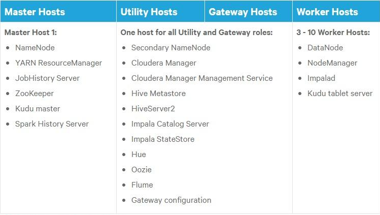
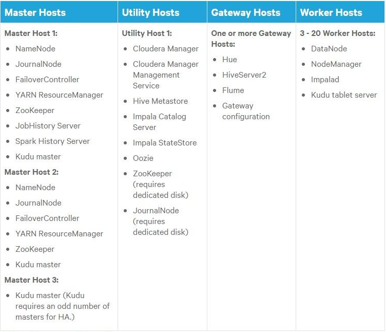
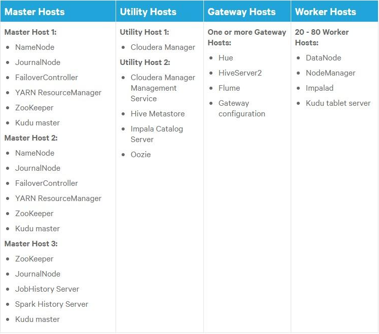
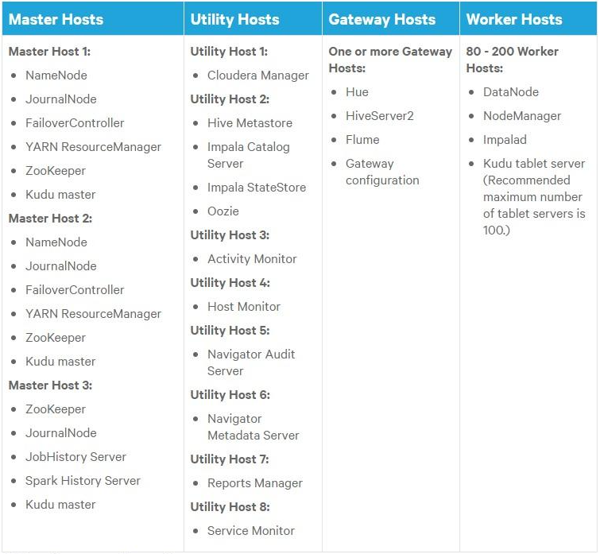
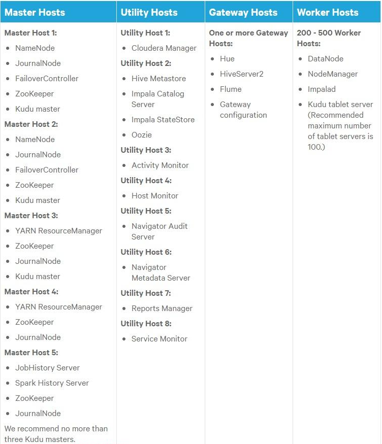
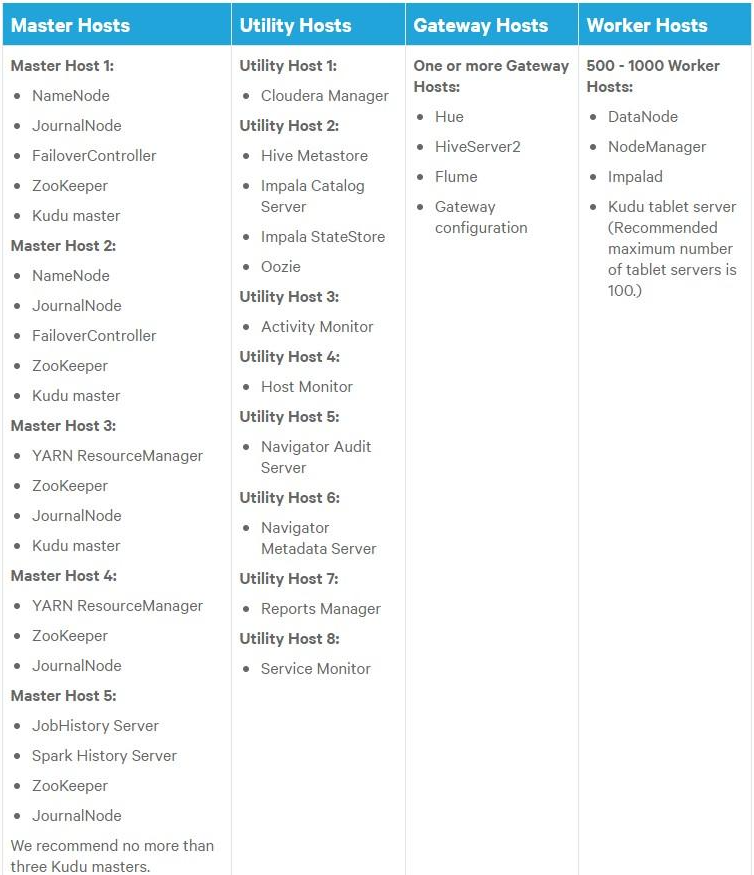

### 1. 主机角色分配

> Master Hosts：运行 Hadoop 主进程，例如 HDFS NameNode 和 YARN 资源管理器。Utility Hosts： 运行其他不是主进程的集群进程，例如 Cloudera Manager 和 Hive Metastore。Gateway Hosts： 是用于在集群中启动作业的客户端访问点。 所需网关主机的数量因工作负载的类型和大小而异。Worker Hosts： 主要运行 DataNodes 和其他分布式进程，例如 Impalad。

#### 1.1 3-10个Worker主机（非高可用）

#### 1.2 3-20个Worker主机（高可用）

#### 1.3 20-80个Worker主机（高可用）

#### 1.4 80-200个Worker主机（高可用）

#### 1.5 200-500个Worker主机（高可用）

#### 1.6 500-1000个Worker主机（高可用）

### 2. 关键组件资源分配

- HDFS：

    CPU：★☆☆☆☆

    内存：★☆☆☆☆

    硬盘IO：★★★★☆

    网络IO：★★★★☆

- Impala：

    CPU：★☆☆☆☆

    内存：★★★★★

    硬盘IO：★☆☆☆☆

    网络IO：★★☆☆☆

- YARN：

    CPU：★★★★★

    内存：★★★★★

    硬盘IO：★☆☆☆☆

    网络IO：★☆☆☆☆

### 3. 主机角色及资源分配示例

> 主机配置：CPU96核、内存128G共20台

| 主机名 | 分组 | 角色 | 资源 | 
| -- | -- | -- | -- |
| 主机01 | Master Host | NameNode、ZooKeeper Server |   | 
| 主机02 | Master Host | SecondaryNameNode、ZooKeeper Server |   | 
| 主机03 | Master Host | JobHistory Server、ResourceManager、ZooKeeper Server |   | 
| 主机04 | Utility Hosts + Gateway Hosts | Hive Metastore Server、HiveServer2、Hive Gateway、Hue Server、Impala Catalog Server、Impala StateStore、Oozie Server、Alert Publisher、Event Server、Host Monitor、Service Monitor |   | 
| 主机05 | Worker Hosts | DataNode、Impala Daemon、NodeManager | 内存：Impala Daemonala（50G）、NodeManager（50G）；CPU：NodeManager（96） | 
| 主机06 | Worker Hosts | DataNode、Impala Daemon、NodeManager | 内存：Impala Daemonala（50G）、NodeManager（50G）；CPU：NodeManager（96） | 
| 主机07 | Worker Hosts | DataNode、Impala Daemon、NodeManager | 内存：Impala Daemonala（50G）、NodeManager（50G）；CPU：NodeManager（96） | 
| 主机08 | Worker Hosts | DataNode、Impala Daemon、NodeManager | 内存：Impala Daemonala（50G）、NodeManager（50G）；CPU：NodeManager（96） | 
| 主机09 | Worker Hosts | DataNode、Impala Daemon、NodeManager | 内存：Impala Daemonala（50G）、NodeManager（50G）；CPU：NodeManager（96） | 
| 主机10 | Worker Hosts | DataNode、Impala Daemon、NodeManager | 内存：Impala Daemonala（50G）、NodeManager（50G）；CPU：NodeManager（96） | 
| 主机11 | Worker Hosts | DataNode、Impala Daemon、NodeManager | 内存：Impala Daemonala（50G）、NodeManager（50G）；CPU：NodeManager（96） | 
| 主机12 | Worker Hosts | DataNode、Impala Daemon、NodeManager | 内存：Impala Daemonala（50G）、NodeManager（50G）；CPU：NodeManager（96） | 
| 主机13 | Worker Hosts | DataNode、Impala Daemon、NodeManager | 内存：Impala Daemonala（50G）、NodeManager（50G）；CPU：NodeManager（96） | 
| 主机14 | Worker Hosts | DataNode、Impala Daemon、NodeManager | 内存：Impala Daemonala（50G）、NodeManager（50G）；CPU：NodeManager（96） | 
| 主机15 | Worker Hosts | DataNode、Impala Daemon、NodeManager | 内存：Impala Daemonala（50G）、NodeManager（50G）；CPU：NodeManager（96） | 
| 主机16 | Worker Hosts | DataNode、Impala Daemon、NodeManager | 内存：Impala Daemonala（50G）、NodeManager（50G）；CPU：NodeManager（96） | 
| 主机17 | Worker Hosts | DataNode、Impala Daemon、NodeManager | 内存：Impala Daemonala（50G）、NodeManager（50G）；CPU：NodeManager（96） | 
| 主机18 | Worker Hosts | DataNode、Impala Daemon、NodeManager | 内存：Impala Daemonala（50G）、NodeManager（50G）；CPU：NodeManager（96） | 
| 主机19 | Worker Hosts | DataNode、Impala Daemon、NodeManager | 内存：Impala Daemonala（50G）、NodeManager（50G）；CPU：NodeManager（96） | 
| 主机20 | Worker Hosts | DataNode、Impala Daemon、NodeManager | 内存：Impala Daemonala（50G）、NodeManager（50G）；CPU：NodeManager（96） | 

