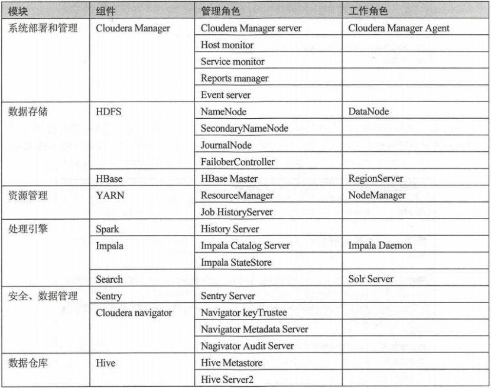
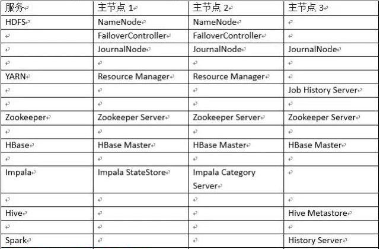
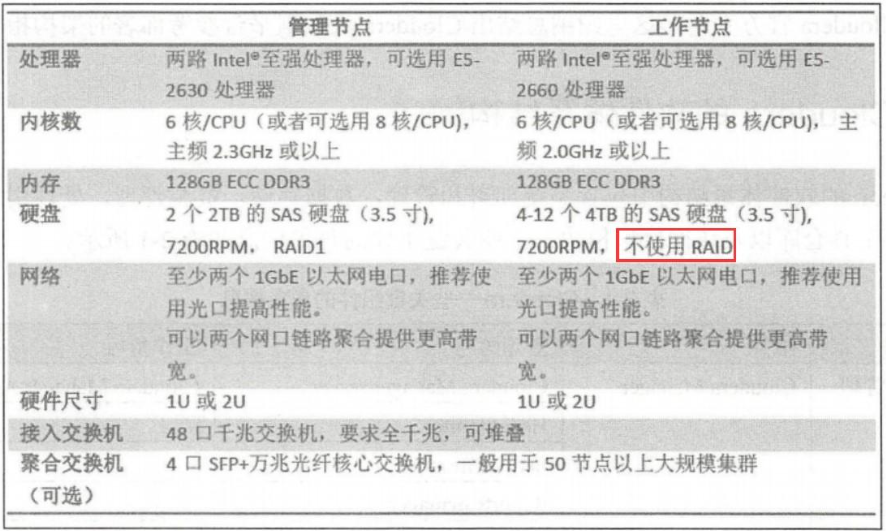
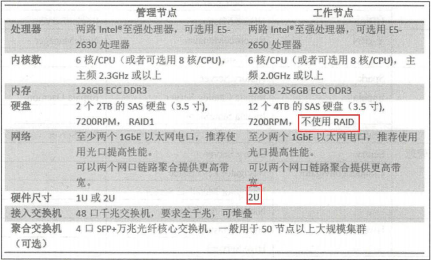
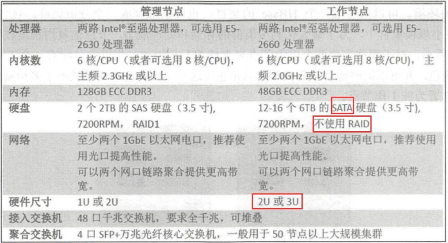

### 1. CDH组件角色说明

Hadoop 集群服务器按照节点任务的不同可以分为管理节点和工作节点。管理节点上部署各组件的管理角色，工作节点部署各角色的存储、容器或计算角色。但因为Hadoop 不同组件之间兼容性的问题，所以一般使用Cloudera 套件。 在CDH套件中就有如下角色。

### 2. CDH 节点数量建议

#### 2.1 小规模集群

一般来说，小于20个节点的都属于小规模集群，受限于集群的存储和处理能力，小规模集群不太适合用于多业务的环境。可以部署成 HBase 的集群，也可以部署成分析集群，包含 YARN、Impala 。在小规模集群中，为了最大化利用集群的存储和处理能力，节点的复用程度往往比较高。

#### 2.2 中等规模集群

一个中等规模的集群，集群的节点数一般在20到200左右，通常的数据存储可以规划到几百TB，适用于一个中型企业的数据平台，或者大型企业的业务部门数据平台。节点的复用程度可以降低，可以按照管理节点、主节点、工具节点和工作节点来划分。

这些节点中包含：

- 1个CM管理节点：用来安装 Cloudera Manager 和Cloudera Management Service，以对CDH进行管理。

- 3个主节点：用来安装 CDH 服务以HA 的组件。如3个ZKServer、两个 NameNode（主备）、两个ResourceManager，3个HBase Master1个Hive Metastore 、1个spark History Server之类管理角色。角色分配可以参考下图：

- N个工具节点：用来部署HIVE Server2，、Hue Server、Oozie Server、Flum Agent 、Sqoop Client 、Gateway等。

- N个工作节点：部署HDFS DataNode,YARN NodeManager,Implala Daemon,HBase Region Server。

#### 2.3 大规模集群

大规模集群的节点数量一般会在 200 以上，存储容量可以是几百TB甚至是PB级别的数据，适用于大型企业搭建的数据平台。大型集群的架构和中型集群的类似，只是主节点的数量从3个增加到5个，从而增加了主节点的可用性。剩下都是工作节点的增加。

当主节点增加到5个后，HDFS JournalNode 也从3个增加到5个，ZooKeeper Server 和HBase Master 也从3个增加到5个，Hive Metastore 由1个增加到3个。

#### 2.4 CDH 节点推荐的硬件配置

业务类型不同，集群具体配置也有区别。

1. 实时流处理服务集群：

由于性能的原因， Hadoop 实时流处理对节点内存和 CPU 有较高要求，基于 Spark Streaming 的流处理消息吞吐量可随节点数量增加而线性增长，配置可参考下图：

1. 在线分析业务集群：

在线分析业务一般基于Impala等 MPP SQL 引擎，复杂的 SQL计算对内存容量有较高要求，因此需要128GB至更多的内存的硬件，推荐配置如下：

1. 云存储业务集群：

存储业务主要面向海量数据和文件的存储和计算，强调单节点存储容量和成本，因此配置相对廉价的SATA 硬盘，满足成本和容量的需求，推荐配置如下：

