# 一、引言

Apache Atlas 是托管于 Apache 旗下的一款元数据管理和治理的产品，目前在大数据领域应用颇为广泛，可以很好的帮助企业管理数据资产，并对这些资产进行分类和治理，为数据分析，数据治理提供高质量的元数据信息。

随着企业业务量的逐渐膨胀，数据日益增多，不同业务线的数据可能在多种类型的数据库中存储，最终汇集到企业的数据仓库中进行整合分析，这个时候如果想要追踪数据来源，理清数据之间的关系将会是一件异常头疼的事情，倘若某个环节出了问题，追溯的成本将是巨大的，于是 Atlas 在这种背景下应运而生了，通过它，我们可以非常方便的管理元数据，并且可以追溯表级别，列级别之间的关系（血缘关系），为企业的数据资产提供强有力的支撑和保障。Atlas 支持从 HBase 、Hive、Sqoop、Storm、Kafka 中提取和管理元数据，同时也可以通过 Rest Api 的方式自行定义元数据模型，生成元数据。

本文我们着重介绍一下 Atlas 的相关概念，帮助大家更好的理解 Atlas，同时详细讲解如何通过 Rest Api 的方式自定义数据模型，生成血缘关系，以便开发自己的个性化需求。

# 二、Atlas 原理及相关概念

## 2.1 元数据

元数据其实就是描述数据的数据，比如表，字段，视图等，每个业务系统可能都会自己定义表，字段，视图，这些数据从哪来到往哪去，数据之间是否存在关联，和其他系统的数据是否存在重复和矛盾字段，这些就是元数据管理要解决的问题，也是 Atlas 要解决的问题。

## **2.2 运行原理**

Atlas 的原理其实并不难理解，主要是通过内部提供的脚本读取数仓中的数据库结构，生成数据模型，存储到 Atlas的 Hbase 中，同时通过 hook 的方式监听数仓中的数据变化，分析执行的 sql 语句，从而生成表与表，列与列的血缘关系依赖，在前台展示给用户查看。

## **2.3 数仓支持**

Atlas 对 Hive 支持最好，我们都知道，Hive 是依赖于 Hadoop 的，数据存储在 HDFS 中，Atlas 有专门的 shell 脚本可以直接运行读取 Hive 的表结构等元数据信息同步到 Atlas 的存储库中，自动生成元数据模型，同时 Atlas 提供的 HiveHook 可以监听 Hive 的数据变化，根据 Hive 执行的 sql 推断出数据与数据之间的关系，生成血缘关系图，如果我们想要分析其他数据存储介质的元数据和血缘关系，Atlas 的支持并不是很理想。但通常情况下，我们会定时把业务库如 mysql，oracle 中的数据定时同步到数仓中整合分析，而数仓我们一般都会采用 Hadoop 的生态体系，所以这一点并不是问题。

## **2.4 架构图解**

以下是 Atlas 的架构图解，可以看出，Atlas 所依赖的生态体系是异常庞大的，这也直接导致了它部署起来十分繁琐，本文不再讲解 Atlas 的部署，网上相关的教程有很多，感兴趣的朋友可以自己搜索尝试。

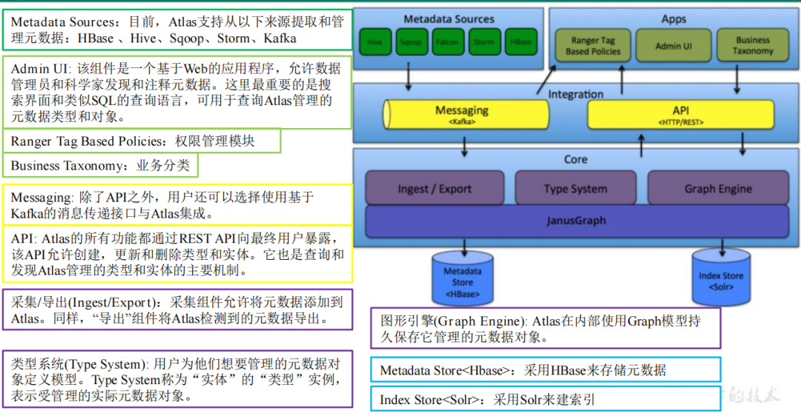

## **2.5 核心组件概念**

Atlas 中主要有以下核心组件，这些需要我们着重了解，接下来我们通过 Rest Api 自定义建模其实就是对以下组件的增删查改操作。

### **2.5.1. Type**

元数据类型定义，这里可以是数据库，表，列等，还可以细分 mysql 表( mysql_table )，oracle 表( oracle_table )等，atlas自带了很多类型，如 DataSet，Process 等，一般情况下，数据相关的类型在定义类型的时候都会继承 DataSet，而流程相关的类型则会继承 Process，便于生成血缘关系。我们也可以通过调用 api 自定义类型。这是一切的起点，定义完类型之后，才能生成不同类型的元数据实体，生成血缘关系，我个人更喜欢把元数据类型称之为建模。

### **2.5.2. Classification**

分类，通俗点就是给元数据打标签，分类是可以传递的，比如 A 视图是基于 A 表生成的，那么如果 A 表打上了 a 这个标签，A 视图也会自动打上 a 标签，这样的好处就是便于数据的追踪。

### **2.5.3. Entity**

实体，表示具体的元数据，Atlas 管理的对象就是各种 Type 的 Entity。

### **2.5.4. Lineage**

数据血缘，表示数据之间的传递关系，通过 Lineage 我们可以清晰的知道数据的从何而来又流向何处，中间经历了哪些操作，这样一旦数据出现问题，可以迅速追溯，定位是哪个环节出现错误。

# 三、Altas 使用

Altas 成功部署之后，使用还是很简单的，这是登录界面，用户名密码默认是 admin，admin：

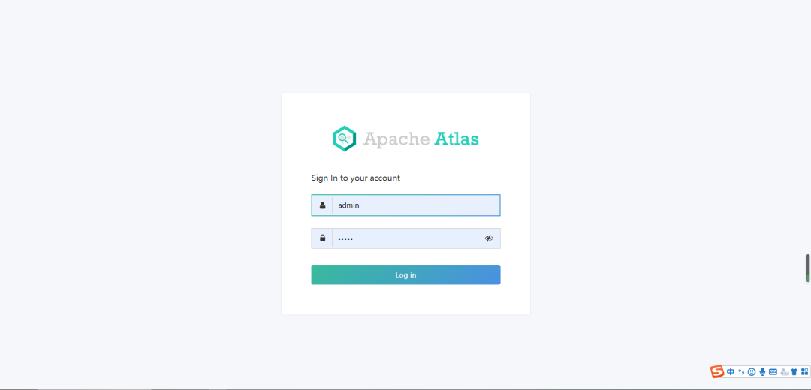

进入主页，点击右上角 switch to new ，使用新版界面，更直观：

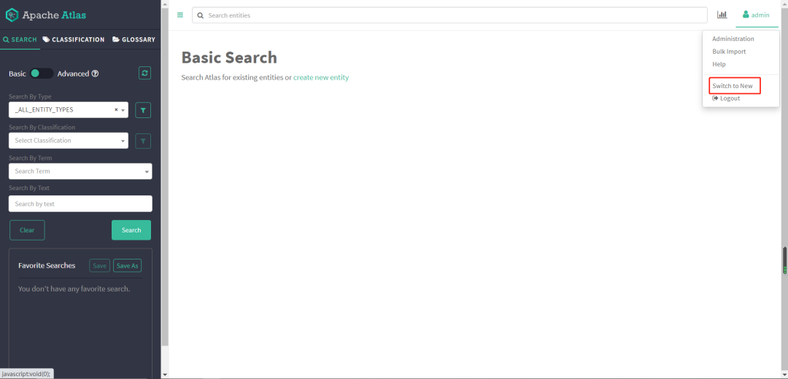

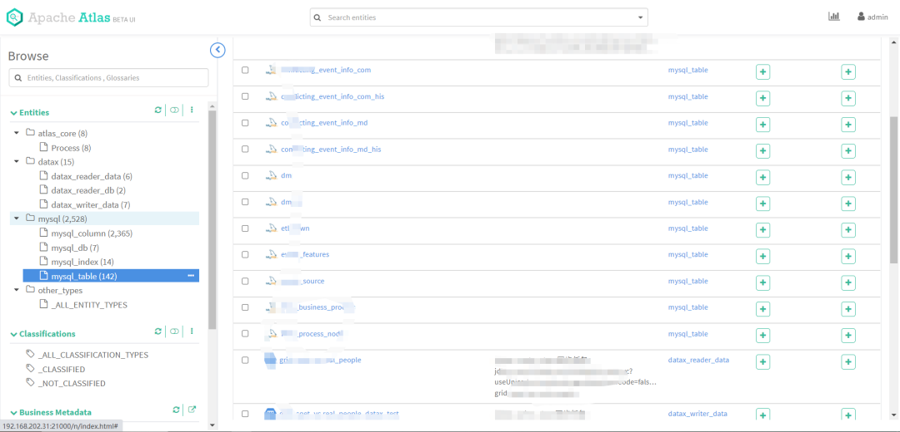

页面左侧便是 Atlas 的类型树，点击树节点的某个类型，可以查看下面的实体，这里我们点击 mysql_table：

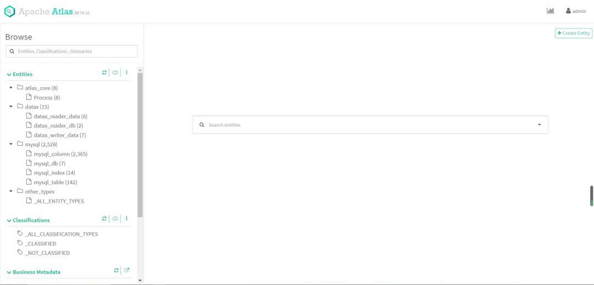

可以看到下面有很多表，这些都是我之前自己利用 Rest Api 上传定义的，下面我们来讲解一下如何通过 Rest Api 的方式自定义类型，生成实体，创建血缘关系。

# 四、Atlas Rest Api 详解及示例

我们点击主页上方的 Help-》API Documentation，便可以查看 Atlas 所有的开放接口：

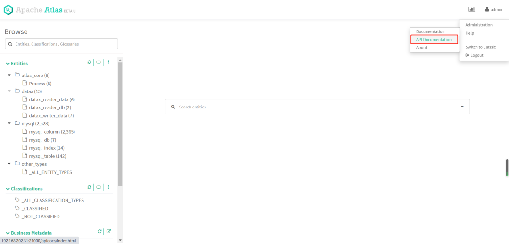

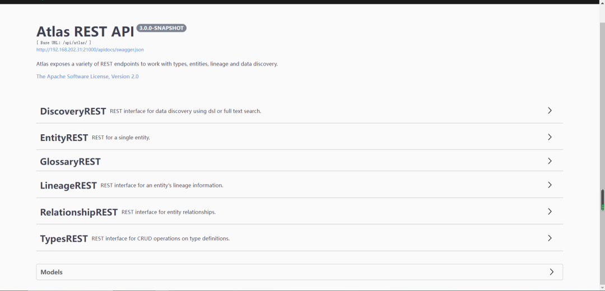

有一点我们需要注意，Atlas 的接口在使用的时候是需要鉴权的，所以我们构建 http 请求的时候需要带上用户名和密码认证信息，本次示例中我们使用 atlas-client-v2 开源组件来进行 Atlas 的 api 调用。

本次示例我们定义一个 my_db 类型，my_table 类型，并且让 my_db 一对多 my_table，然后创建 test_db 实体到 my_db 下，创建 test_table_source 和 test_table_target 实体到 my_table 下，并且定义 test_table_target 的数据来自 test_table_source，生成两个实体的血缘关系依赖。

## **4.1 自定义 my_db 和 my_table 类型**

我们对 my_db 和 my_table 类型进行定义，在 Atlas 的Rest Api 中，允许一个请求定义多种类型，在这里我们先构建 json 请求体，然后再通过编码方式实现，二者对比，更容易理解，json 请求体如下（关键地方有注释）：

```
{
  "enumDefs": [],
  "structDefs": [],
  "classificationDefs": [],
  //类型定义
  "entityDefs": [
    {
      "name": "my_db",
      //数据类型的定义，约定俗成，继承Atlas自带的DataSet
      "superTypes": [
        "DataSet"
      ],
      //服务类型（便于在界面分组显示类型）
      "serviceType": "my_type",
      "typeVersion": "1.1",
      "attributeDefs": []
    },
    {
      "name": "my_table",
      "superTypes": [
        "DataSet"
      ],
      "serviceType": "my_type",
      "typeVersion": "1.1",
      "attributeDefs": []
    }
  ],
  //定义类型之间的关系
  "relationshipDefs": [
    {
      "name": "my_table_db",
      "serviceType": "my_type",
      "typeVersion": "1.1",
      //关系类型：ASSOCIATION：关联关系，没有容器存在，1对1 
      //AGGREGATION：容器关系，1对多，而且彼此可以相互独立存在 
      //COMPOSITION：容器关系，1对多，但是容器中的实例不能脱离容器存在
      "relationshipCategory": "AGGREGATION",
      //节点一
      "endDef1": {
        "type": "my_table",
        //表中关联的属性名称，对应下面的 my_db
        "name": "db",
        //代表这头是不是容器
        "isContainer": false,
        //cardinality： 三种类型SINGLE, LIST, SET
        "cardinality": "SINGLE"
      },
      // 节点2
      "endDef2": {
        "type": "my_db",
        "name": "tables",
        "isContainer": true,
        // db 包含 table，table不能重复，所以类型设置为 SET
        "cardinality": "SET"
      },
      // 推导tag NONE 不推导
      "propagateTags": "NONE"
    }
  ]
}
```

编码实现：

引入 pom 依赖，注意，如果要集成到自己的业务系统之中，业务系统如果使用了其他的日志框架，需要去除 slf4j-log4j12 依赖，否则日志框架会起冲突，导致启动失败，另外 atlas-client-common 中依赖了 commons-configuration 1.10，如果业务系统中有低版本依赖，记得排除，不然二者会冲突，导致 client 初始化失败。

```
<dependencies>
        <!-- Apache Atlas -->
        <dependency>
            <groupId>org.apache.atlas</groupId>
            <artifactId>atlas-client-common</artifactId>
            <version>2.1.0</version>
            <exclusions>
                <exclusion>
                    <artifactId>slf4j-log4j12</artifactId>
                    <groupId>org.slf4j</groupId>
                </exclusion>
            </exclusions>
        </dependency>
        <!-- Apache Atlas Client  Version2 -->
        <dependency>
            <groupId>org.apache.atlas</groupId>
            <artifactId>atlas-client-v2</artifactId>
            <version>2.1.0</version>
            <exclusions>
                <exclusion>
                    <artifactId>slf4j-log4j12</artifactId>
                    <groupId>org.slf4j</groupId>
                </exclusion>
                <exclusion>
                    <artifactId>log4j</artifactId>
                    <groupId>log4j</groupId>
                </exclusion>
            </exclusions>
        </dependency>
        <dependency>
            <groupId>com.alibaba</groupId>
            <artifactId>fastjson</artifactId>
            <version>${fastjson.version}</version>
        </dependency>
    </dependencies>
```

引入 atlas-application.properties（必须得有，否则会初始化失败）：

```
atlas.rest.address=http://127.0.0.1:21000
```

代码实现如下（对照json非常容易理解）：

```
    AtlasClientV2 atlasClientV2 = new AtlasClientV2(new String[]{"http://127.0.0.1:21000"}, new String[]{"admin", "admin"});
    //父类集合
    Set<String> superTypes = new HashSet<>();
    superTypes.add(AtlasBaseTypeDef.ATLAS_TYPE_DATASET);
    //定义myType
    AtlasTypesDef myType = new AtlasTypesDef();
    //定义myDb
    AtlasEntityDef myDb = new AtlasEntityDef();
    myDb.setName("my_db");
    myDb.setServiceType("my_type");
    myDb.setSuperTypes(superTypes);
    myDb.setTypeVersion("1.1");
    //定义mytable
    AtlasEntityDef myTable = new AtlasEntityDef();
    myTable.setName("my_table");
    myTable.setServiceType("my_type");
    myTable.setSuperTypes(superTypes);
    myTable.setTypeVersion("1.1");
    //定义relationshipDef
    AtlasRelationshipDef relationshipDef = new AtlasRelationshipDef();
    relationshipDef.setName("my_table_db");
    relationshipDef.setServiceType("my_type");
    relationshipDef.setTypeVersion("1.1");
    relationshipDef.setRelationshipCategory(AtlasRelationshipDef.RelationshipCategory.AGGREGATION);
    relationshipDef.setPropagateTags(AtlasRelationshipDef.PropagateTags.NONE);
    //定义endDef1
    AtlasRelationshipEndDef endDef1 = new AtlasRelationshipEndDef();
    endDef1.setType("my_table");
    endDef1.setName("db");
    endDef1.setIsContainer(false);
    endDef1.setCardinality(AtlasStructDef.AtlasAttributeDef.Cardinality.SINGLE);
    relationshipDef.setEndDef1(endDef1);
    //定义endDef2
    AtlasRelationshipEndDef endDef2 = new AtlasRelationshipEndDef();
    endDef2.setType("my_db");
    endDef2.setName("tables");
    endDef2.setIsContainer(true);
    endDef2.setCardinality(AtlasStructDef.AtlasAttributeDef.Cardinality.SET);
    relationshipDef.setEndDef2(endDef2);
    //entityDefs
    List<AtlasEntityDef> entityDefs = new ArrayList<>(2);
    entityDefs.add(myDb);
    entityDefs.add(myTable);
    myType.setEntityDefs(entityDefs);
    //relationshipDefs
    List<AtlasRelationshipDef> relationshipDefs = new ArrayList<>(1);
    relationshipDefs.add(relationshipDef);
    myType.setRelationshipDefs(relationshipDefs);
    //查询是否已有my_db类型,没有则创建
    SearchFilter filter = new SearchFilter();
    filter.setParam("name", "my_db");
    AtlasTypesDef allTypeDefs = atlasClientV2.getAllTypeDefs(filter);
    if (allTypeDefs.getEntityDefs().isEmpty()) {
      //请求 rest api
      atlasClientV2.createAtlasTypeDefs(myType);
    }
```

执行以上代码，执行完毕后，前往 Atlas 主页查看，类型已成功创建：

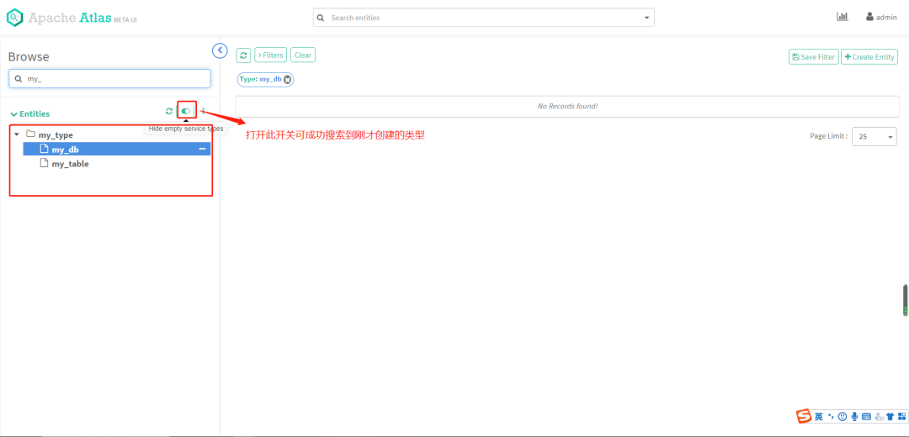

查看类型模型图：

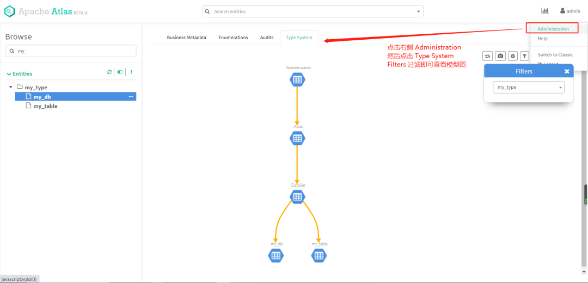

类型创建完毕，接下来我们进行实体的创建。

## **4.2 创建实体 test_db，test_table_source 和 test_table_target**

json 如下：

```
//my_db 实体
{
  "typeName": "my_db",
  "attributes": {
    "qualifiedName": "test_db",
    "name": "test_db",
    "description": "测试创建db"
  }
}
//test_table_source 实体
{
  "typeName": "my_table",
  "attributes": {
    "qualifiedName": "test_table_source",
    "name": "test_table_source",
    "description": "测试创建test_table_source"
  },
  "relationshipAttributes": {
    "db": {
      "typeName": "my_db",
      //my_db的guid（创建完my_db后会返回）
      "guid": "xxxx"
    }
  }
}
//test_table_target 实体
{
  "typeName": "my_table",
  "attributes": {
    "qualifiedName": "test_table_target",
    "name": "test_table_target",
    "description": "测试创建test_table_target"
  },
  "relationshipAttributes": {
    "db": {
      "typeName": "my_db",
      "guid": "xxx"
    }
  }
}
```

代码实现如下：

```
    //创建实体 test_db
    AtlasEntity testDb = new AtlasEntity();
    testDb.setTypeName("my_db");
    Map<String, Object> attributes = new HashMap<>();
    attributes.put("qualifiedName", "test_db");
    attributes.put("name", "test_db");
    attributes.put("description", "测试创建db");
    testDb.setAttributes(attributes);
    Map<String, String> queryAttributes = new HashMap<>();
    queryAttributes.put("qualifiedName", "test_db");
    String myDbGuid = null;
    try {
      //查询不到会报错
      AtlasEntity.AtlasEntityWithExtInfo extInfo = atlasClientV2.getEntityByAttribute("my_db", queryAttributes);
      myDbGuid = extInfo.getEntity().getGuid();
    } catch (AtlasServiceException e) {
      if (ClientResponse.Status.NOT_FOUND.equals(e.getStatus())) {
        AtlasEntity.AtlasEntityWithExtInfo extInfo = new AtlasEntity.AtlasEntityWithExtInfo(testDb);
        //请求
        EntityMutationResponse response = atlasClientV2.createEntity(extInfo);
        myDbGuid = response.getGuidAssignments().values().toArray(new String[]{})[0];
      }
    }
    //创建与db的关系
    Map<String, Object> relationShipAttr = new HashMap<>();
    Map<String, String> dbMap = new HashMap<>();
    dbMap.put("guid", myDbGuid);
    dbMap.put("typeName", "my_db");
    relationShipAttr.put("db", dbMap);
    //创建实体 test_table_source
    AtlasEntity testTableSource = new AtlasEntity();
    testTableSource.setTypeName("my_table");
    attributes.put("qualifiedName", "test_table_source");
    attributes.put("name", "test_table_source");
    attributes.put("description", "测试创建test_table_source");
    testTableSource.setAttributes(attributes);
    testTableSource.setRelationshipAttributes(relationShipAttr);
    queryAttributes.put("qualifiedName", "test_table_source");
    try {
      //atlasClientV2.updateEntity(new AtlasEntity.AtlasEntityWithExtInfo(testTableSource));
      AtlasEntity.AtlasEntityWithExtInfo extInfo = atlasClientV2.getEntityByAttribute("my_table", queryAttributes);
      testTableSource = extInfo.getEntity();
    } catch (AtlasServiceException e) {
      if (ClientResponse.Status.NOT_FOUND.equals(e.getStatus())) {
        AtlasEntity.AtlasEntityWithExtInfo extInfo = new AtlasEntity.AtlasEntityWithExtInfo(testTableSource);
        //请求
        EntityMutationResponse response = atlasClientV2.createEntity(extInfo);
        testTableSource.setGuid(response.getGuidAssignments().values().toArray(new String[]{})[0]);
      }
    }
    //创建实体 test_table_target
    AtlasEntity testTableTarget = new AtlasEntity();
    testTableTarget.setTypeName("my_table");
    attributes.put("qualifiedName", "test_table_target");
    attributes.put("name", "test_table_target");
    attributes.put("description", "测试创建test_table_target");
    testTableTarget.setAttributes(attributes);
    testTableTarget.setRelationshipAttributes(relationShipAttr);
    queryAttributes.put("qualifiedName", "test_table_target");
    try {
      //atlasClientV2.updateEntity(new AtlasEntity.AtlasEntityWithExtInfo(testTableTarget));
      AtlasEntity.AtlasEntityWithExtInfo extInfo = atlasClientV2.getEntityByAttribute("my_table", queryAttributes);
      testTableTarget = extInfo.getEntity();
    } catch (AtlasServiceException e) {
      if (ClientResponse.Status.NOT_FOUND.equals(e.getStatus())) {
        AtlasEntity.AtlasEntityWithExtInfo extInfo = new AtlasEntity.AtlasEntityWithExtInfo(testTableTarget);
        //请求
        EntityMutationResponse response = atlasClientV2.createEntity(extInfo);
        testTableTarget.setGuid(response.getGuidAssignments().values().toArray(new String[]{})[0]);
      }
    }
```

执行代码完毕后，查看类的树形图，发现已经产生了实体：

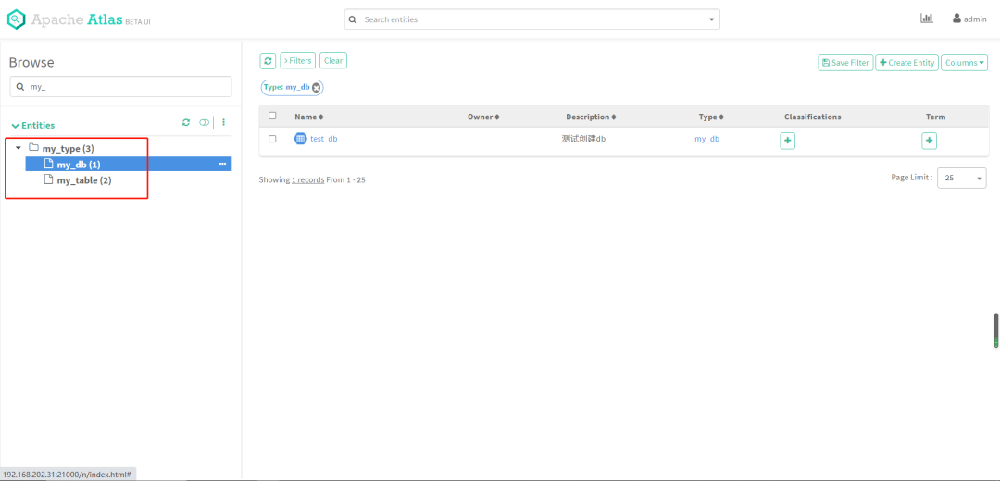

我们点击右侧的 test_db 实体，可以看到它的基本信息，也可以看到它的 relationship 信息，包含了 test_table_source 和 test_table_target 两个实体：

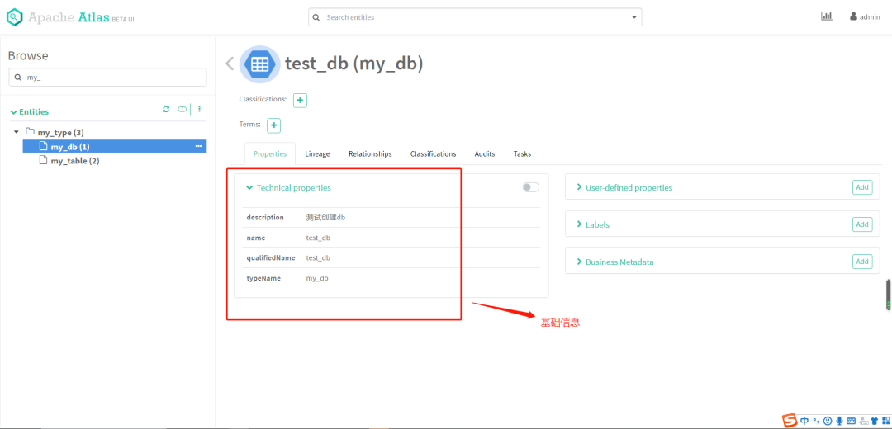

查看 relationship 信息，包含 test_table_source 和 test_table_target：

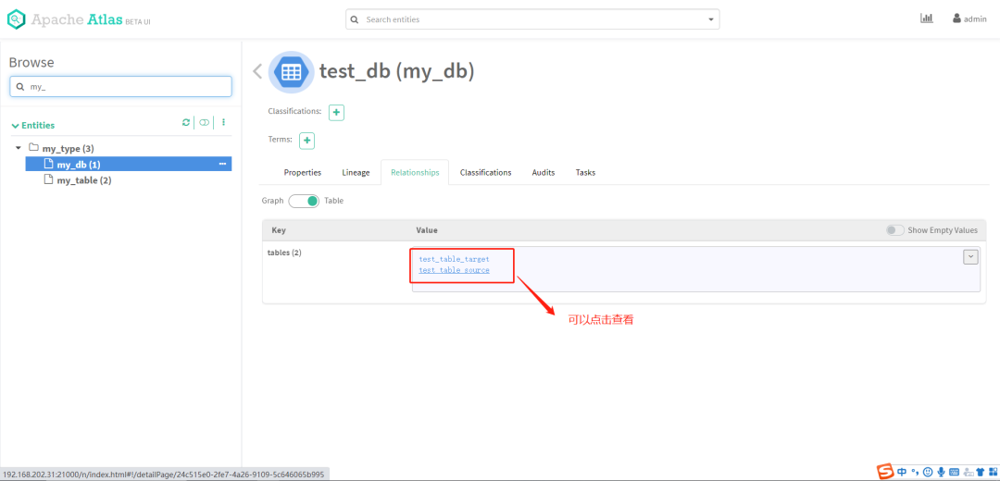

## **4.3 创建 test_table_source 和 test_table_target 的血缘关系依赖**

前面我们提到，定义 test_table_target 的数据来自 test_table_source，血缘关系依赖在 Atlas 中其实也是作为实体 Entity 存在，只不过继承的父类是 Process，这样可以定义 inputs 和 outputs 属性，构建血缘关系，json 如下：

```
{
  "typeName": "Process",
  "attributes": {
    "name": "test_process",
    "qualifiedName": "test_process",
    "description": "test_table_target 的数据来自 test_table_source",
    "inputs": [{
      "typeName": "my_table",
      //test_table_source的guid，创建实体从返回的信息中获取
      "guid": "xxx"
    }],
    "outputs": [{
      "typeName": "my_table",
      ////test_table_target的guid，创建实体从返回的信息中获取
      "guid": "xxx"
    }]
  }
}
```

代码实现如下：

```
    AtlasEntity lineage = new AtlasEntity();
    //设置为process类型构建血缘
    lineage.setTypeName(AtlasBaseTypeDef.ATLAS_TYPE_PROCESS);
    attributes.put("qualifiedName", "test_process");
    attributes.put("name", "test_process");
    attributes.put("description", "test_table_target 的数据来自 test_table_source");
    attributes.put("inputs", getLineAgeInfo(testTableSource));
    attributes.put("outputs", getLineAgeInfo(testTableTarget));
    lineage.setAttributes(attributes);
    queryAttributes.put("qualifiedName", "test_process");
    System.out.println(SingletonObject.OBJECT_MAPPER.writeValueAsString(lineage));
    try {
      //查询是否存在
      atlasClientV2.getEntityByAttribute(AtlasBaseTypeDef.ATLAS_TYPE_PROCESS, queryAttributes);
    } catch (AtlasServiceException e)  {
      if (ClientResponse.Status.NOT_FOUND.equals(e.getStatus())) {
        //创建
        AtlasEntity.AtlasEntityWithExtInfo extInfo = new AtlasEntity.AtlasEntityWithExtInfo(lineage);
        atlasClientV2.createEntity(extInfo);
      }
    }
    
  //构建inputs和outputs
  private static List<Map<String, String>> getLineAgeInfo(AtlasEntity entity) {
    List<Map<String, String>> list = new ArrayList<>();
    Map<String, String> map = new HashMap<>();
    map.put("guid", entity.getGuid());
    map.put("typeName", entity.getTypeName());
    list.add(map);
    return list;
  }
```

执行以上代码，然后打开主页，点击 my_table 中的 test_table_source，查看 lineage 标签，血缘关系已成功构建：

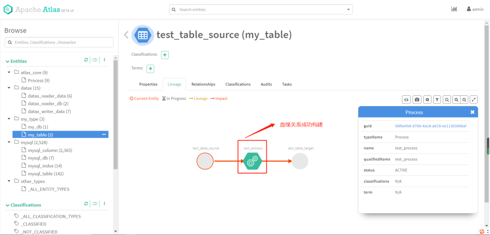

至此，我们通过 Atlas Rest Api 的方式自行建模，创建实体，构建血缘关系就完成了。