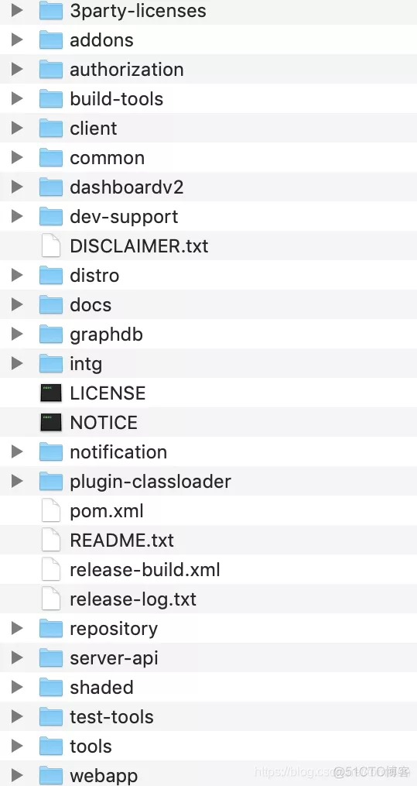
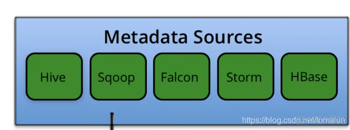
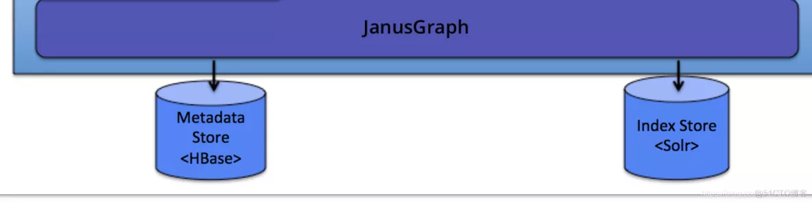

# 一、根目录结构

从官方网站下载

# 二、3party-licenses

第三方组件许可，可以看出Atlas主要用到的第三方技术组件，绝大部分是前端技术组件，janusgraph和titan是图数据库组件，JanusGraph是Titan的继承者，老版本用的是Titan，新版本是用的JanusGraph

# 三、addons

安装扩展组件源代码，主要是Atlas接入各种Hadoop元数据数据源的桥接代码，对应Atlas架构图中的部分：

## 3.1 falcon-bridge

**falcon桥接扩展模块**

这个模块的详细介绍说明和使用说明见官方文档：​ ​[http://atlas.apache.org/#/HookFalcon](http://atlas.apache.org/#/HookFalcon)​​，或者本地文档：docs/src/site/twiki/Hook-Falcon.twiki

## 3.2 falcon-bridge-shim

falcon桥接扩展垫片，即atlas的falcon桥接插件

## 3.3 hbase-bridge

**Hbase桥接扩展模块**[http://atlas.apache.org/#/HookHBase](http://atlas.apache.org/#/HookHBase)​​，或本地文档：docs/src/site/twiki/Hook-HBase.twiki

## 3.4 hive-bridge

**hive桥接扩展模块**

这个模块的详细介绍说明和使用说明见官方文档：​ ​[http://atlas.apache.org/#/HookHive](http://atlas.apache.org/#/HookHive)​​，或本地文档：docs/src/site/twiki/Hook-Hive.twiki

## 3.5 kafka-bridge

**Kafka桥接扩展模块**[http://atlas.apache.org/#/HookKafka](http://atlas.apache.org/#/HookKafka)​​

## 3.6 models

提供Atlas各种元数据模型类型定义json文件

## 3.7 sqoop-bridge

**Sqoop桥接扩展模块**[http://atlas.apache.org/#/HookSqoop](http://atlas.apache.org/#/HookSqoop)​​

## 3.8 storm-bridge

**Storm桥接扩展模块**[http://atlas.apache.org/#/HookStorm](http://atlas.apache.org/#/HookStorm)

# 四、authorization

**Atlas鉴权模块**[http://atlas.apache.org/#/AuthorizationModel](http://atlas.apache.org/#/AuthorizationModel)​​

# 五、build-tools

**构建工具**

# 六、client

**客户端API代码**

- client-v1包：V1版本客户端API代码

- client-v2包：V2版本客户端API代码，客户端调用Atlas API接口时可以直接调用这里封装的API接口方法，减轻代码开发工作量

# 七、Common

**公共模块**

# 八、dashboardv2

**Atlas管理台UI前端应用**

- 界面展示html模板代码在dashboardv2/public/js/templates目录下

- 界面功能业务Js代码在dashboardv2/public/js/views目录下

- 从package.json中的依赖项可以看出该前端项目主要采用的jquery+requireJS+backbone架构，主要依赖项：

- backbone.js：前端框架，backbone.js是一个轻量级的MVC JavaScript库， Backbone 框架中的主要组件包括模型model、视图view、集合collection和路由器router。

- backgrid.js ：基于backbone.js 用于构建语义和容易样式化的 HTML 表格组件

- jQuery：一个高效、精简并且功能丰富的 JavaScript 工具库。它提供的 API 易于使用且兼容众多浏览器，这让诸如 HTML 文档遍历和操作、事件处理、动画和 Ajax 操作更加简单。

- RequireJS：一个JavaScript文件和模块加载器，可视为模块管理工具，可以提高前端代码的加载速度和质量。

- 项目开发构建依赖grunt-基于 Node.js 的前端项目自动构建工具

# 九、dev-support

开发支持，主要提供Docker部署配置，各种API操作的客户端shell执行脚本，样例数据json文件

# 十、distro

- atlas分布式部署相关的一些开发配置文件

- pom.xml中提供了一些图数据库存储Hbase和图数据库索引检索组件solr的默认配置

- zk目录下提供了zookeeper安装压缩包zookeeper-3.4.6.tgz

- bin目录下提供atlas基本安装部署的Python脚本文件，比如启动、停止atlas服务等

- conf下提供Atlas配置文件

- hbase下是hbase的配置文件

- solr下是solr相关的配置文件

- zookeeper下是zookeeper的配置文件

- 另外主要有：Atlas应用配置文件atlas-application.properties、Atlas环境变量配置文件atlas-env.sh、日志配置文件atlas-log4j.xml，鉴权策略配置文件atlas-simple-authz-policy.json、用户认证配置文件users-credentials.properties

- main/assemblies目录下是打包相关的描述符配置文件

# 十一、docs

**Atlas官方文档**[http://atlas.apache.org/#/](http://atlas.apache.org/#/)

# 十二、graphdb

**图数据库模块**

- api：图数据库API，主要提供Atlas从图数据库操作元数据的API接口

- common：图数据库公共代码，主要是Tinkerpop图数据库和图计算框架，主要提供了图数据库查询表达式和查询接口

- graphdb-impls：Atlas图数据库实现依赖，无源代码

- janus：JanusGraph图数据库实现模块

- graphson：主要提供GraphSON格式数据操作实用工具方法，主要工具方法和业务代码在AtlasGraphSONUtility类中，提供唯一的公共静态API方法：jsonFromElement，用于将图元素对象转化成json格式的GraphSON对象

- migration包：数据迁移相关的代码包，主类是GraphDBGraphSONMigrator，用于导入旧数据，入口方法：importData

- query包：查询相关的代码包，主要提供图计算查询构造器AtlasJanusGraphQuery

- serializer包：序列化相关的的代码包，提供几种数据类型的序列化实现

- 另外是一些图数据库操作相关的类

- janus-hbase2：JanusGraph图数据库HBase存储管理模块

# 十三、intg

**Atlas集成模块**

- entitytransform包：实体转化处理相关的代码，主要关注几个hive和hdfs实体处理的Handler类

- listener包：提供2个监听器接口定义，Atlas元数据实体变更通知监听接口和类型变更监听接口

- model包：提供各种模型定义

- pc包：提供WorkItem作业条目管理

- security包：提供安全相关的配置管理

- store：提供Atlas类型定义持久化存储接口

- type包：提供各种Atlas类型定义以及类型操作的实用工具静态API方法

- utils包：提供Atlas实体处理的实用工具静态API方法、Kerberos认证的实用工具静态API方法

- v1：提供V1版本的模型定义和类型操作API方法

- ApplicationProperties和AtlasConfiguration提供Atlas属性参数管理

# 十四、notification

提供基于kafka的消息通知处理，包括一些钩子消息的处理，对应架构图中的Messaging<kafka>，参考官方文档：​ ​[http://atlas.apache.org/#/Notifications](http://atlas.apache.org/#/Notifications)​​

# 十五、plugin-classloader

**Atlas插件类加载器**

# 十六、repository

**Atlas元数据仓库管理模块**

- discovery：提供元数据搜索、检索相关的服务

- glossary：提供元数据术语相关的操作服务

- query：提供基于Gremlin图遍历语言和DSL（Domain Specific Search）语言的元数据查询服务

- repository： Atlas元数据仓库核心服务

- audit ：提供元数据仓库操作日志审计功能

- converters：Atlas各种数据类型格式转换处理

- graph：提供图数据库服务

- impexp：元数据导入导出处理

- migration：数据迁移服务

- ogm：各种数据传输对象DTO定义

- patches：补丁管理服务

- store：Atlas元数据存储访问服务层

- userprofile：用户Profile服务

- services：提供统计度量服务

- util：提供实用工具API

# 十七、server-api

**Atlas服务器相关API**

# 十八、test-tools

**测试工具模块**

# 十九：tools

**工具模块**

分类修改处理代码和shell脚本

# 二十、webapp

**Atlas Web应用模块**

- web应用需要登录，登录页面为login.jsp

- 跟管理台UI前端模块结合使用，登录js在前端模块，登录成功后进入前端模块功能界面，前端调用webapp提供的API接口

- examples包：提供快速测试样例，用来测试web API接口

- notification包：通知消息处理，Atlas实体变更通知处理、kafka通道钩子消息监听处理

- util包提供唯一类CredentialProviderUtility，用于安全认证处理

- web包：主要提供Rest API接口

- dao.UserDao用户登录处理数据访问层实现

- errors：异常错误处理

- filters：过滤器，主要是登录认证的过滤器，提供SSO登录、CSRF攻防、访问审计日志等功能

- listeners.LoginProcessor：用户登录处理，包括简单登录处理和kerberos认证登录处理

- model.User用户属性定义

- params：参数类型定义

- resources.AdminResource：管理API资源服务，提供获取系统线程Dump、版本信息、服务状态、会话信息、性能度量信息、元数据导入导出、集群服务器信息等API接口

- rest包：提供Rest API接口

- DiscoveryREST：提供元数据搜索相关的REST API接口，支持DSL查询或全文检索查询

- EntityREST：提供Atlas元数据实体增删改查操作相关的REST API接口

- GlossaryREST：提供Atlas术语增删改查操作相关的REST API接口

- LineageREST：提供获取Atlas元数据实体的血统图REST API接口

- RelationshipREST：提供Atlas元数据关联关系增删改查操作相关的REST API接口

- TypesREST：提供Atlas元数据类型增删改查操作相关的REST API接口

- security包：提供安全相关的处理服务

- service包：基础服务包

- setup包：web容器启动初始化自动装配服务，提供KerberosAwareListener监听类用于自动装配Kerberos登录服务

- util包：实用工具包

- Atlas类：Atlas单机部署启动服务驱动类，通过distro模块Python脚本atlas_start.py调用，通过内嵌的jetty服务器独立运行Atlas元数据服务系统