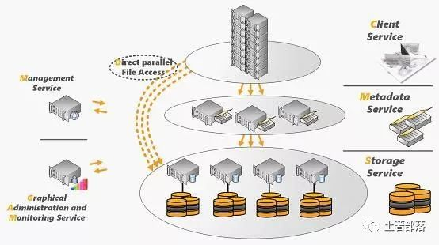
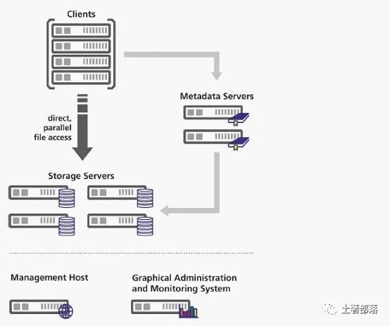
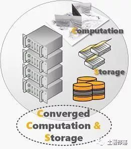
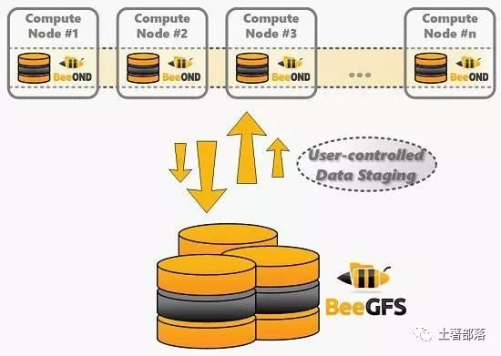
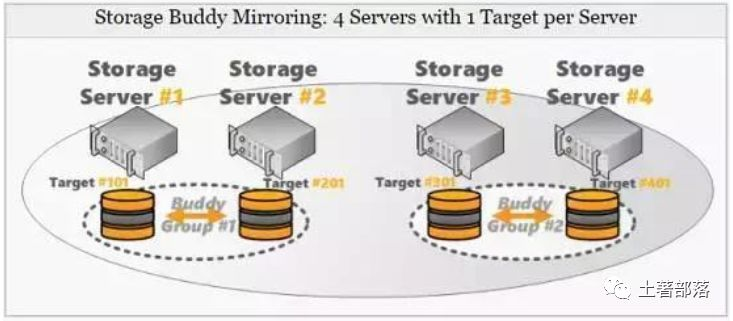
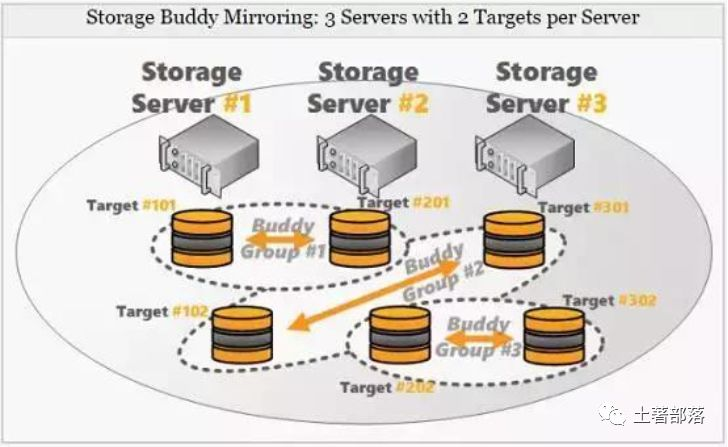
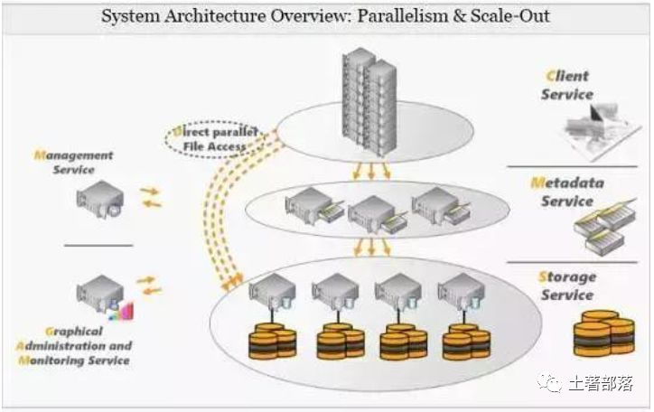
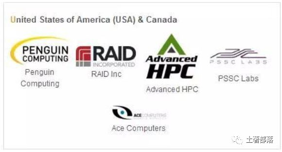

ThinkParQ成立于2013年底，由BeeGFS背后的一些关键人物组成，为BeeGFS客户提供专业的支持，服务和咨询。BeeGFS原名为FhGFS，是由Fraunhofer Institute为工业数学计算而设计开发，由于在欧洲和美国的中小型HPC系统性能表现良好，在2014年改名注册为BeeGFS并受到科研和商业的广泛应用。

BeeGFS既是一个网络文件系统也是一个并行文件系统。客户端通过网络与存储服务器进行通信(具有TCP/IP或任何具有RDMA功能的互连，如InfiniBand，RoCE或Omni-Path，支持native verbs 接口)。通过BeeGFS添加更多的服务器，其容量和性能被聚合在单个命名空间中。

BeeGFS是遵循GPL的“免费开源”产品，文件系统没有许可证费用。无论谁想要自己使用，都可以从www.beegfs.com下载并安装使用。由ThinkParQ提供专业支持，系统集成商可以为客户构建使用BeeGFS的解决方案。

### 1. BeeGFS操作系统兼容性

BeeGFS具备良好的兼容性，支持包括x86，x86_64，ARM和OpenPower等硬件平台和RHEL、Scientific Linux、CentOS、SuSE Linux Enterprise Server、SuSE Linux Enterprise Desktop、OpenSuSE、Debian和Ubuntu在内的Linux操作系统版本。

### 2.BeeGFS系统架构

BeeGFS实现了ObjectData和MetaData的分离。ObjectData是用户希望存储的数据，而MetaData是包括访问权限、文件大小和位置的“关于数据的数据”，MetaData中最重要的是如何从多个文件服务器中找到具体对应的文件，这样才能使客户端获取特定文件或目录的MetaData后，可以直接与ObjectData服务器对话以检索信息。

BeeGFS可以面向需要大型或快速存储的每个人服务，如传统领域是高性能、高吞吐量计算和大型研究数据。Object Storage Servers和MetaData Servers的数量可以弹性伸缩。因此，可以通过扩展到适当数量的服务器来满足不同性能要求。

BeeGFS是一个基于Linux的文件系统，BeeGFS所有的部分(如客户端，服务器)都在Linux操作系统下运行，到目前为止还不支持其他平台。搭建一套BeeGFS至少需要管理服务器(MS)、对象存储服务器(OSS)、元数据服务器(MDS)和文件系统Client四个主要组件和有两个守护进程。

- Helper-daemon守护进程，文件系统客户端需要一个“helper-daemon”才能在客户端上运行。

- Admon守护进程在存储集群中运行，并让系统管理员更好地了解发生了什么，但它不是必需的组件，BeeGFS在没有它的情况下也是完全可运行操作的。

在设计上，BeeGFS旨在与符合POSIX标准的本地文件系统(例如ext4，xfs或zfs)一起用于数据存储。 这样系统管理员可以选择他们喜欢和熟练的本地文件系统，减少其他系统或工具的学习成本。

- Management Server(MS)：

系统中必须要有一个MS， BeeGFS安装的所有配置文件必须指向同一个MS。MS维护所有文件系统组件的列表，包括Client，MetaData Servers，MetaData Targets，Storage Servers和Storage Targets。此外，MS具有正常、低和关键三个标签选项来标记Storage Targets和MetaData Targets。当创建新文件时，这些标签会影响目标选择的方式，标签是根据目标可用空间分配的。运行在MetaData Server上目标选择器将优选标记为正常的目标。

- MetaData Server(MDS)：

    MDS包含系统中Meta Data的信息。MetaData服务器无限制可扩展。每个MDS都有一个MetaData Target(MDT，存储MDS的Meta Data)。MDT上文件系统的推荐选择是ext4，因为它对小文件和小文件操作提供很好性能。MDT通常由SSD组成并推荐采用RAID1或RAID10进行RAID保护，选择RAID5/6对元数据随机小IO访问模式将导致MetaData性能严重下降。

    BeeGFS全局文件系统中的每个目录都附加到处理其内容的一个MDS。如果目录A的MetaData由MDS＃1处理，则位于A中的文件的MetaData存储在存储＃1上。由于将目录分配给MDS是随机BeeGFS可以有效利用大量的MDS。只要目录数量明显大于MDS的数量，则每个MDS上的分配的目录数量和大致相等。

    有一个例外，根级别目录始终在MDS＃1上，这样就定义了一个入口点。顶级目录具有指向MDS的链接，其中包含有关子目录的信息。有了这个信息，客户端可以走路径目录树，找到负责特定目录的MDS。与机械驱磁盘相比，SSD可以降低时延并提供大量的随机IOPS，强烈推荐把SSD使用在MetaDataTarget上。

    对于不同应用场景来说，线程的数量的选择有没有完美的建议，一方面，如果线程太多将浪费系统内存和CPU资源，并且可能会因为许多任务切换而对性能产生负面影响。 另一方面，线程太少限制了系统的性能。

- ObjectStorage Server(OSS)：

    OSS是存储文件内容的主要服务。每个OSS可能具有一个或多个Object Storage Targets(OST)，OST可以是本地文件系统(如xfs，ext4或zfs)或LUN。典型的OST推荐6到12个硬盘并采用RAID6级别，因此具有36个驱动器的OSS可能会组成3个OST，每个OST都是带有12个磁盘。

    OSS是用户空间启动的完全多线程的守护进程。它将适用于任何符合POSIX标准的本地文件系统，底层文件系统可能根据工作负载或个人喜好和经验来挑选。OSS线程数量取决于OSS服务的OST的性能和数量。与MDS不同，OST上的IO通常是大的顺序IO。

    BeeGFS的主要功能之一就是条带，在BeeGFS文件系统中，每个目录都有两个非常重要的属性，定义了这些目录中的文件的处理方式。

- numtargets定义文件创建的目标数量。如果选择4，则每个文件将获得4个OST，分配给该文件的数据存储在这些OST中。

- chunksize指定在客户端移动到下一个目标之前，在该分配的目标OST上存储多少数据。

    文件条带的目标是提高单个文件的性能以及容量，假设OST容量大小为30 TB，提供500MB/s性能，那么4个OST目标之间的文件大小可以增长到120TB，并以2 GB/s进行访问。

- 文件系统客户端(Client)：

    BeeGFS客户端是在Linux中运行的一个内核模块，必须编译以匹配使用的内核。客户端是GPL提供的开源产品。BeeGFS客户端服务提供了一个正常的挂载点，使您的应用程序可以直接访问BeeGFS存储系统，客户端包含两个守护进程服务。

- beegfs-helperd守护程序为beegfs-client提供了一些辅助功能(DNS和写日志文件功能等)，它是由同一主机上运行的beegfs-client访问，不需要任何其他配置。

- beegfs-client加载客户端内核模块，如果需要，它将重新编译内核模块。重新编译使用自动构建过程完成，该过程在内核版本更改时启动。

    为了展示BeeGFS存储集群中通常存在哪些服务，前面分析都是基于所有服务都在不同的主机上运行 。

    

    一般在小型应用场景，BeeGFS的相关服务(Client和Server组件)的任意组合(如上图)也可以在同一台机器上一起运行。当BeeGFS完全使用没有独立的专用存储服务器时，我们称之为“融合设备”。

### 3. BeeGFS安装和设置

有两种方式可以安装BeeGFS，一种是基于GUI(使用图形化Java界面)，另一种是手动(使用shell命令)。

图形化安装是基于图形化Java界面连接到BeeGFS Admon(Administration and Monitoring)服务实现。一般来说，无经验的用户建议基于GUI的安装，但对老司机来说，手动安装是最佳选择，因为GUI不能提供手动安装的完全灵活性。

### 4. BeeGFS调优和配置

BeeGFS的调优包含了存储服务器格式化调优、元数据服务器调优、客户端调优、条带化、网络(Infiniband和以太网)调优和高速缓存调优，具体请参考BeeGFS配置指导，这里不再赘述。

beegfs-ctl工具从默认位置读取BeeGFS的配置文件(beegfs-client.conf)，虽然该工具也可以在没有客户端配置文件的情况下使用，但在相应机器上存在这样的基本客户端配置时，通常更方便。

### 5. BeeOND Burst Buffer

BeeOND(BeeGFS On Demand)用来创建一个或多个BeeGFS实例来满足云环境中临时工作文件系统需求。另外，BeeOND在计算节点内部聚本地SSD或硬盘的性能和容量提供了额外的性能和Burst Buffer能力。

如今，大多数HPC集群系统使用专用全局并行文件系统提供高吞吐量，但是计算节点通常配备(或可以轻松配备)本地硬盘或固态硬盘，BeeOND就是很好利用特定计算任务的计算节点磁盘资源来提供更高的系统性能。

Beeond可以独立于全局共享并行文件系统，这就意味着无论并行文件系统是BeeGFS还是其他技术都可以使用Beeond。Beeond使用时需要创建一个新的单独文件系统挂载点。任何如cp或rync标准工具都可将数据写入和迁出BeeOND，但Beeond软件包本身包含一个并行copy工具，用于在BeeOND实例和另一个文件系统之间传输数据。

由于BeeOND启动非常简单，所以可以轻松将BeeOND与Torque或Slurm工作负载管理器集成，可以通过一个命令启动和停止新的BeeGFS实例，所以当计算作业启动时，您可以轻松地添加脚本命令，以便在作业完成时停止。另外，在计算节点使用BeeOND带来了以下几方面的优势：

- BeeOND很容易消除全局并行文件系统的IO重载和令人难以接受的浪涌性IO。无论如何，在作业运行时创建的临时数据不必一定需要移动到全局持久并行文件系统中。即使在作业结束后，应该持久化保存的数据也可以更好地先存储到Beeond实例中，然后以大块的顺序IO复制到全局持久并行文件系统中，获得最大的带宽。

- 在BeeOND上运行的应用程序不会干扰全局持久并行文件系统中的其他用户，反过来，也可以在不受其他用户影响的情况下获得BeeOND提供的性能。

- 采用运行在SSD之上的BeeOND可以极大地加速高性能计算任务，结合多个计算节点的SSD不仅可以轻松实现高带宽，还可以提供高IOPS性能，以便处理大文件小IO型的IOPS业务。

- BeeOND Burst Buffer软件直接部署在计算节点服务器上，不会增加任何硬件成本。

BeeOND在BeeGFS中呈现为一个标准的软件包，可以通过使用发行版的包管理器进行安装。BeeOND也是依赖BeeGFS服务器和客户端组件，这种依赖体现在相应的包依赖关系，并将自动安装。BeeOND基于计算节点在软件层面实现了Burst Buffer功能，可以广泛兼容不同并行文件系统。

BeeOND 聚合计算节点内部的性能和 SSD 容量，并在计算任务计算期间以 Burst Buffer的方式持续增加性能，这在云环境或者 scratch数据场景是非常有用的。接下来的时间，我们一起谈谈 BeeGFS 的其他特性，如配额、镜像、网络等特性。

### 6. BeeGFS 配额特性

BeeGFS 配额支持基于用户和组的配额，通过两个步骤实现。第一步首先查询用户和组在 BeeGFS 上使用的数据量和块文件数，第二步实施配额，允许定义用户和组的配额限制。 目前只支持基与 ZFS使用的空间配额，而不支持 ZFS 用户和组使用文件数配额。

BeeGFS 配额系统需要使用存储服务器 Target 目标上的底层本地文件系统(例如 XFS 和 EXT4)的配额信息。因此，存储 Target目标的底层文件系统也需要支持配额跟踪。在元数据 Target 目标上不需要配额支持。当启用配额执行时， BeeGFS 管理守护程序会定期从 BeeGFS 存储 Target 目标中收集配额信息，检查是否超出的配额限制.

BeeGFS 的内置配额功能跟踪和执行基于用户和组配额。如果要跟踪使用的空间或基于子目录树的文件数量，您可能需要查看Robin hood 策略引擎， Robin hood 可以定期对文件系统进行并行扫描，并将发现的文件和目录信息存储在 SQL 数据库中。一方面采用数据库的各种查询可以快速检索结果。另一方面可以在 Robin hood 中定义某些事件的自动操作。

由于 BeeGFS 在元数据服务器(通常为闪存存储)上保留所有扫描元数据，为了确保 Robin hood 的 SQL 数据库不会降低扫描速度，建议将 Robin hood 数据库存储在闪存上。

### 7. BeeGFS的 Buddy 镜像

从 2012.10 发行版开始， BeeGFS 提供对元数据和文件镜像的支持。镜像功能集成到 BeeGFS 服务中，因此该功能不需要单独的服务或第三方工具支持。元数据镜像和文件内容镜像可以彼此独立使用。

从 BeeGFS v6.0 开始，元数据镜像也以高可用性功能扩展，高可用性和据镜像基于所谓的 Buddy 组实现。一般来说， Buddy 组是一对内部管理数据副本的两个 Target 目标。

存储服务器 Buddy Mirroring 也可以与奇数个存储服务器一起使用(偶数当时是可以的)，这是因为 BeeGFS 的 Buddy 组由独立的存储 Target 目标组成，独立于服务器的，如以下示例图所示， 采用 3 个服务器和 2 个 Target 存储目标，存储 Buddy 组由不同服务器提供的 Target 目标组成，甚至可以由连接到同一服务器的 2 个 Target目标组成。

需要注意的是元数据服务器要求是偶数，在正常操作中，Buddy 组中的一个 Target 存储目标(或元数据服务器)被认为是primary 的，而另一个是 secondary 的。更新操作将始终发送到primary 服务器负责镜像过程。 文件和元数据采用同步镜像方式完成，数据在两个 Target 存储目前完成后才返回客户端。

如果 Buddy 组的 Primary 存储目标或 Primary 元数据服务器无法访问，它将被标记为 Offline，并切换到 Secondary 上。Secondary 将变成新的 Primary， 故障透明切换，改变的数据将同步到所有节点以证系统的一致性。

默认情况下，新文件系统实例的镜像功能是被禁用。可以使用命令行工具启用镜像功能。在启用元数据或存储镜像之前，首先需要定义 Buddy 组，因为 Buddy 组是镜像的基础。

### 8. BeeGFS 支持 API 概述

除了 POSIX 接口外， BeeGFS 还提供了其他 API 来更好地控制数据存放位置，查询附加信息或通过其他接口访问数据。

条带化 API 允许应用程序开发人员创建具有单独条带模式的文件，这些文件将针对特定文件的访问模式进行调整或调优。

缓存 API 提供了在 BeeGFS 缓存文件系统(通常为 Beeond 实例)和全局BeeGFS 之间复制数据的功能。从缓存文件系统预取和刷新数据支持同步和异步方式。

Hadoop BeeGFS 连接器 API 为 BeeGFS 提供了 Hadoop 文件系统(HDFS)的支持功能，使得 Hadoop 应用程序开发人员可以使用通用 Hadoop API来访问 BeeGFS

### 9. BeeGFS 系统配置要求

目前，本地 BeeGFS Client 和服务器组件适用于 x86，x86_64 和 PowerPC/ Cell 架构上的 Linux 操作系统。一般来说， 所有 BeeGFS 组件都可以在单个机器上运行，甚至只有单个 CPU 内核，单个硬盘和 RAM 小于 1GB 规格。但实际运用中这可能不是你想做的，所以下面是一些关于硬件配置的建议。

存储服务器配置

- 存储服务器应具有至少 4GB 的 RAM 以具有足够的可用于缓存和客户端连接缓冲区的内存。根据磁盘的实际类型和文件系统客户端的数量，每个附加磁盘的 1GB RAM 通常是一个不错的选择。

- 如果您使用传统的 SATA 硬盘(即不是固态硬盘或快速 SAS 驱动器)，则通常需要使用每个服务器至少有 8 个硬盘的 RAID。

- 即使存储服务器任务通常不是非常 CPU 密集型， Linux 缓冲区高速缓存可以通过快速 RAID 阵列产生高 CPU 负载，因此在这里使用快速 CPU可以实现高吞吐量，特别是在高速网络上通常是件好事。

- 注意磁盘数量(整个系统和每个服务器)，网络互连带宽和文件系统客户端数量之间的平衡。(例如，根据您的用例，如果服务器仅配备 10Gb互连，则每个服务器使用超过 12 个硬盘驱动器可能无意义)。

元数据服务器配置

- 如果您正在主要使用大文件，那么元数据服务器的工作不会太多，您可能只想在与存储服务器和同一硬盘分区上运行的相同的计算机上运行它。

- 在具有不同类型工作负载的群集上，您可能希望在存储服务器上运行元数据服务守护程序(拥有大量元数据服务器，而不需要为专用计算机花费额外的资金)，但是应该使用专用磁盘用于元数据存放。 由于元数据服务器正在进行大量的小型磁盘随机访问(例如，它们正在读取和写入大量小文件)，因此如果两者位于同一磁盘上，则可能会对存储和元数据访问产生显着的性能影响，因此您可能希望在单独的存储上存放元数据。

- 如果您有大量客户端处理许多(小)文件，则元数据服务器上的 CPU 使用率可能会很高。因此，确保使用快速的 CPU 和快速磁盘(通常为 SSD)来保证元数据的低访问延迟。

- 与总存储容量相比，元数据所需的空间量取决于实际使用情况(存储的文件总数)。对于临时文件系统，元数据所需的空间通常约为总存储容量的 0.3％至 0.5％左右。

客户端服务器配置

- 客户端不需要特定的 Linux 发行版，即使是最近的内核也可以自由使用。由于 BeeGFS 的客户端组件设计非常轻便，因此没有特殊的 RAM内存或 CPU 要求。

管理守护进程配置

- 管理守护程序仅使用最少的 CPU 周期和内存。访问管理守护程序与文件系统性能无关。只需在任何存储/元数据服务器或群集主服务器上运行此守护程序。

- Admon 守护程序经常存储和查询其内部数据库中的大量值，因此它将运行一些存储事务并使用适量的 RAM 和 CPU 周期。在任何其他存储/元数据服务器计算机上运行它通常很好，但是您的集群主机可能是此守护程序更好的位置，以确保对文件系统性能没有影响。

### 9. BeeGFS 支持的网络类型

BeeGFS 支持 TCP/IP 网络、 InfiniBand 协议(基于 OFED verbs 框架)、 Omni-Path 和 RDMA over Converged Ethernet(RoCE)协议。存储服务器和客户端 Client 可以同时支持混合网络请求(例如，存储服务器配备 Infiniband 和以太网互连，一些客户端 Client 通过本地 InfiniBand 连接，而其他的 Client 通过 TCP/IP 的 Ethernet进行连接)。

如 果 主 连 接 路 径 发 生 故 障 ， 具 有 多 个 连 接 路 径 ( 如InfiniBand 和以太网或多个以太网端口)的客户端也可以接管实现网络故障转移。

### 10. 通过 NAS 导出 BeeGFS

在 BeeGFS 中可以导出成 SMB 或 CIFS 标准 NAS 文件系统。将 BeeGFS 客户端主机配置为 Samba 服务器。通过在 BeeGFS 配置权限和挂载点。重新启动 Samba 服务器服务，就可以从 windows Samba 客户端访问 BeeGFS 文件系统。通过 NAS 导出 BeeGFS

在 BeeGFS 中可以导出成 NFS 标准 NAS 文件系统。从 2014.01发行版开始， BeeGFS 支持 Linux 内核 NFS 服务器导出。 通过 NFS 导出 BeeGFS ，通常它比 Samba(SMB)具有更好的性能。为了以 NFS 方式提供文件，请将 BeeGFS 客户端主机配置为 NFS 服务器，并通过 NFS重新导出 BeeGFS 客户端挂载点。

### 11. BeeGFS 生态和合作

由于 BeeGFS 是免费的，因此其全球部署情况没有得到精准的统计。 然而，全球约有 100 多个客户使用的 BeeGFS 是得到Fraunhofer 的支持的(BeeGFS 由 Fraunhofer 高性能计算中心开发和维护，由 ThinkParQ 提供交付和服务支持)。其中包括大学和研究机构等学术用户，以及金融或石油和天然气行业的营利性公司，目前BeeGFS 已经得到全球合作伙伴的加盟和支持(如下所示)。

值得注意的是全球 TOP500 排名的超算系统中，有多家就是采用BeeGFS，包括德国法兰克福歌德大学的 Loewe-CSC 集群，奥地利维也纳大学的维也纳科学集群(安装时排名为＃56)(数据来源基维百科)，以及挪威奥斯陆大学的 Abel 集群(安装时排名为＃96)。从现 BeeGFS在全球客户群体来看，已经快速从教育科研行业渗透到金融或石油和天然气等行业。

BeeGFS 的轻量级架构设计和对现在高性能计算中对Burst Buffer 技术需求的精确把握，加上对开源趋势和势态的开怀拥抱将力助 BeeGFS 在商业上获得成功。这种种迹象表明， BeeGFS 无疑将会是下一个高性能计算领域的 Lustre。