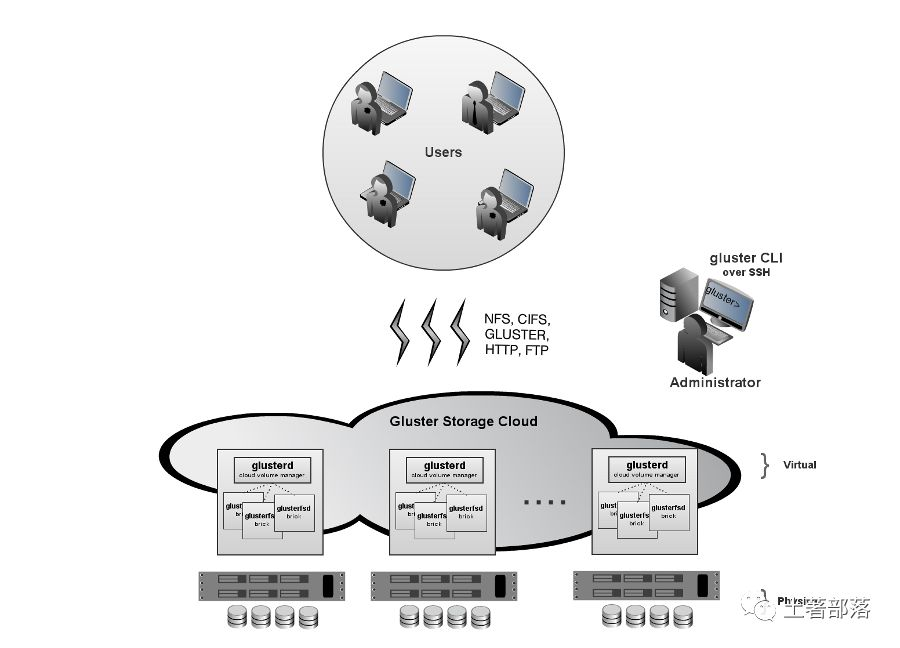
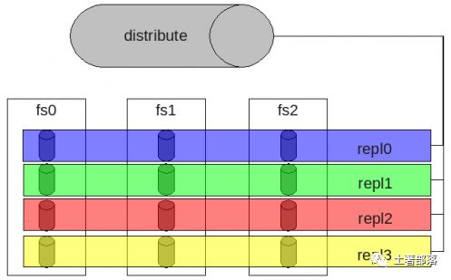

### 1. GlusterFS概述

GlusterFS是Scale-Out存储解决方案Gluster的核心，它是一个开源的分布式文件系统，具有强大的横向扩展能力，通过扩展能够支持数PB存储容量和处理数千客户端。GlusterFS借助TCP/IP或InfiniBand RDMA网络将物理分布的存储资源聚集在一起，使用单一全局命名空间来管理数据。GlusterFS基于可堆叠的用户空间设计，可为各种不同的数据负载提供优异的性能。

GlusterFS支持运行在任何标准IP网络上标准应用程序的标准客户端，如图2所示，用户可以在全局统一的命名空间中使用NFS/CIFS等标准协议来访问应用数据。GlusterFS使得用户可摆脱原有的独立、高成本的封闭存储系统，能够利用普通廉价的存储设备来部署可集中管理、横向扩展、虚拟化的存储池，存储容量可扩展至TB/PB级。GlusterFS主要特征如下：

- 扩展性和高性能GlusterFS利用双重特性来提供几TB至数PB的高扩展存储解决方案。Scale-Out架构允许通过简单地增加资源来提高存储容量和性能，磁盘、计算和I/O资源都可以独立增加，支持10GbE和InfiniBand等高速网络互联。Gluster弹性哈希（Elastic Hash）解除了GlusterFS对元数据服务器的需求，消除了单点故障和性能瓶颈，真正实现了并行化数据访问。

- 高可用性GlusterFS可以对文件进行自动复制，如镜像或多次复制，从而确保数据总是可以访问，甚至是在硬件故障的情况下也能正常访问。自我修复功能能够把数据恢复到正确的状态，而且修复是以增量的方式在后台执行，几乎不会产生性能负载。GlusterFS没有设计自己的私有数据文件格式，而是采用操作系统中主流标准的磁盘文件系统（如EXT3、ZFS）来存储文件，因此数据可以使用各种标准工具进行复制和访问。

- 全局统一命名空间全局统一命名空间将磁盘和内存资源聚集成一个单一的虚拟存储池，对上层用户和应用屏蔽了底层的物理硬件。存储资源可以根据需要在虚拟存储池中进行弹性扩展，比如扩容或收缩。当存储虚拟机映像时，存储的虚拟映像文件没有数量限制，成千虚拟机均通过单一挂载点进行数据共享。虚拟机I/O可在命名空间内的所有服务器上自动进行负载均衡，消除了SAN环境中经常发生的访问热点和性能瓶颈问题。

- 弹性哈希算法GlusterFS采用弹性哈希算法在存储池中定位数据，而不是采用集中式或分布式元数据服务器索引。在其他的Scale-Out存储系统中，元数据服务器通常会导致I/O性能瓶颈和单点故障问题。GlusterFS中，所有在Scale-Out存储配置中的存储系统都可以智能地定位任意数据分片，不需要查看索引或者向其他服务器查询。这种设计机制完全并行化了数据访问，实现了真正的线性性能扩展。

- 弹性卷管理数据储存在逻辑卷中，逻辑卷可以从虚拟化的物理存储池进行独立逻辑划分而得到。存储服务器可以在线进行增加和移除，不会导致应用中断。逻辑卷可以在所有配置服务器中增长和缩减，可以在不同服务器迁移进行容量均衡，或者增加和移除系统，这些操作都可在线进行。文件系统配置更改也可以实时在线进行并应用，从而可以适应工作负载条件变化或在线性能调优。

- 基于标准协议Gluster存储服务支持NFS, CIFS, HTTP, FTP以及Gluster原生协议，完全与POSIX标准兼容。现有应用程序不需要作任何修改或使用专用API，就可以对Gluster中的数据进行访问。这在公有云环境中部署Gluster时非常有用，Gluster对云服务提供商专用API进行抽象，然后提供标准POSIX接口。

### 2. 设计目标

GlusterFS的设计思想显著区别有现有并行/集群/分布式文件系统。如果GlusterFS在设计上没有本质性的突破，难以在与Lustre、PVFS2、Ceph等的竞争中占据优势，更别提与GPFS、StorNext、ISILON、IBRIX等具有多年技术沉淀和市场积累的商用文件系统竞争。其核心设计目标包括如下三个：

- 弹性存储系统（Elasticity）

    存储系统具有弹性能力，意味着企业可以根据业务需要灵活地增加或缩减数据存储以及增删存储池中的资源，而不需要中断系统运行。GlusterFS设计目标之一就是弹性，允许动态增删数据卷、扩展或缩减数据卷、增删存储服务器等，不影响系统正常运行和业务服务。GlusterFS早期版本中弹性不足，部分管理工作需要中断服务，目前最新的3.1.X版本已经弹性十足，能够满足对存储系统弹性要求高的应用需求，尤其是对云存储服务系统而言意义更大。GlusterFS主要通过存储虚拟化技术和逻辑卷管理来实现这一设计目标。

- 线性横向扩展（Linear Scale-Out）

    线性扩展对于存储系统而言是非常难以实现的，通常系统规模扩展与性能提升之间是LOG对数曲线关系，因为同时会产生相应负载而消耗了部分性能的提升。现在的很多并行/集群/分布式文件系统都具很高的扩展能力，Luster存储节点可以达到1000个以上，客户端数量能够达到25000以上，这个扩展能力是非常强大的，但是Lustre也不是线性扩展的。

- 纵向扩展（Scale-Up）

    旨在提高单个节点的存储容量或性能，往往存在理论上或物理上的各种限制，而无法满足存储需求。横向扩展（Scale-Out）通过增加存储节点来提升整个系统的容量或性能，这一扩展机制是目前的存储技术热点，能有效应对容量、性能等存储需求。目前的并行/集群/分布式文件系统大多都具备横向扩展能力。

    GlusterFS是线性横向扩展架构，它通过横向扩展存储节点即可以获得线性的存储容量和性能的提升。因此，结合纵向扩展GlusterFS可以获得多维扩展能力，增加每个节点的磁盘可增加存储容量，增加存储节点可以提高性能，从而将更多磁盘、内存、I/O资源聚集成更大容量、更高性能的虚拟存储池。GlusterFS利用三种基本技术来获得线性横向扩展能力：

    1. 消除元数据服务

    1. 高效数据分布，获得扩展性和可靠性

    1. 通过完全分布式架构的并行化获得性能的最大化

- 高可靠性（Reliability）

    与GFS（Google File System）类似，GlusterFS可以构建在普通的服务器和存储设备之上，因此可靠性显得尤为关键。GlusterFS从设计之初就将可靠性纳入核心设计，采用了多种技术来实现这一设计目标。首先，它假设故障是正常事件，包括硬件、磁盘、网络故障以及管理员误操作造成的数据损坏等。GlusterFS设计支持自动复制和自动修复功能来保证数据可靠性，不需要管理员的干预。其次，GlusterFS利用了底层EXT3/ZFS等磁盘文件系统的日志功能来提供一定的数据可靠性，而没有自己重新发明轮子。再次，GlusterFS是无元数据服务器设计，不需要元数据的同步或者一致性维护，很大程度上降低了系统复杂性，不仅提高了性能，还大大提高了系统可靠性。

### 3. 技术特点

GlusterFS在技术实现上与传统存储系统或现有其他分布式文件系统有显著不同之处，主要体现在如下几个方面。

- 完全软件实现（Software Only）

    GlusterFS认为存储是软件问题，不能够把用户局限于使用特定的供应商或硬件配置来解决。

    GlusterFS采用开放式设计，广泛支持工业标准的存储、网络和计算机设备，而非与定制化的专用硬件设备捆绑。对于商业客户，GlusterFS可以以虚拟装置的形式交付，也可以与虚拟机容器打包，或者是公有云中部署的映像。开源社区中，GlusterFS被大量部署在基于廉价闲置硬件的各种操作系统上，构成集中统一的虚拟存储资源池。简而言之，GlusterFS是开放的全软件实现，完全独立于硬件和操作系统。

- 完整的存储操作系统栈（Complete Storage Operating System Stack）

    GlusterFS不仅提供了一个分布式文件系统，而且还提供了许多其他重要的分布式功能，比如分布式内存管理、I/O调度、软RAID和自我修复等。GlusterFS汲取了微内核架构的经验教训，借鉴了GNU/Hurd操作系统的设计思想，在用户空间实现了完整的存储操作系统栈。

- 用户空间实现（User Space）

    与传统的文件系统不同，GlusterFS在用户空间实现，这使得其安装和升级特别简便。另外，这也极大降低了普通用户基于源码修改GlusterFS的门槛，仅仅需要通用的C程序设计技能，而不需要特别的内核编程经验。

- 模块化堆栈式架构（Modular Stackable Architecture）

    GlusterFS采用模块化、堆栈式的架构，可通过灵活的配置支持高度定制化的应用环境，比如大文件存储、海量小文件存储、云存储、多传输协议应用等。每个功能以模块形式实现，然后以积木方式进行简单的组合，即可实现复杂的功能。比如，Replicate模块可实现RAID1，Stripe模块可实现RAID0，通过两者的组合可实现RAID10和RAID01，同时获得高性能和高可靠性。

- 原始数据格式存储（Data Stored in Native Formats）

    GlusterFS以原始数据格式（如EXT3、EXT4、XFS、ZFS）储存数据，并实现多种数据自动修复机制。因此，系统极具弹性，即使离线情形下文件也可以通过其他标准工具进行访问。如果用户需要从GlusterFS中迁移数据，不需要作任何修改仍然可以完全使用这些数据。

- 无元数据服务设计（No Metadata with the Elastic Hash Algorithm）

    对Scale-Out存储系统而言，最大的挑战之一就是记录数据逻辑与物理位置的映像关系，即数据元数据，可能还包括诸如属性和访问权限等信息。传统分布式存储系统使用集中式或分布式元数据服务来维护元数据，集中式元数据服务会导致单点故障和性能瓶颈问题，而分布式元数据服务存在性能负载和元数据同步一致性问题。特别是对于海量小文件的应用，元数据问题是个非常大的挑战。

    GlusterFS独特地采用无元数据服务的设计，取而代之使用算法来定位文件，元数据和数据没有分离而是一起存储。集群中的所有存储系统服务器都可以智能地对文件数据分片进行定位，仅仅根据文件名和路径并运用算法即可，而不需要查询索引或者其他服务器。这使得数据访问完全并行化，从而实现真正的线性性能扩展。无元数据服务器极大提高了GlusterFS的性能、可靠性和稳定性。

### 4. 总体架构与设计

GlusterFS总体架构与组成主要由存储服务器（Brick Server）、客户端以及NFS/Samba存储网关组成。不难发现，GlusterFS架构中没有元数据服务器组件，这是其最大的设计这点，对于提升整个系统的性能、可靠性和稳定性都有着决定性的意义。GlusterFS支持TCP/IP和InfiniBand RDMA高速网络互联，客户端可通过原生Glusterfs协议访问数据，其他没有运行GlusterFS客户端的终端可通过NFS/CIFS标准协议通过存储网关访问数据。

存储服务器主要提供基本的数据存储功能，最终的文件数据通过统一的调度策略分布在不同的存储服务器上。它们上面运行着Glusterfsd进行，负责处理来自其他组件的数据服务请求。如前所述，数据以原始格式直接存储在服务器的本地文件系统上，如EXT3、EXT4、XFS、ZFS等，运行服务时指定数据存储路径。多个存储服务器可以通过客户端或存储网关上的卷管理器组成集群，如Stripe（RAID0）、Replicate（RAID1）和DHT（分布式Hash）存储集群，也可利用嵌套组合构成更加复杂的集群，如RAID10。

由于没有了元数据服务器，客户端承担了更多的功能，包括数据卷管理、I/O调度、文件定位、数据缓存等功能。客户端上运行Glusterfs进程，它实际是Glusterfsd的符号链接，利用FUSE（File system in User Space）模块将GlusterFS挂载到本地文件系统之上，实现POSIX兼容的方式来访问系统数据。在最新的3.1.X版本中，客户端不再需要独立维护卷配置信息，改成自动从运行在网关上的glusterd弹性卷管理服务进行获取和更新，极大简化了卷管理。GlusterFS客户端负载相对传统分布式文件系统要高，包括CPU占用率和内存占用。

GlusterFS存储网关提供弹性卷管理和NFS/CIFS访问代理功能，其上运行Glusterd和Glusterfs进程，两者都是Glusterfsd符号链接。卷管理器负责逻辑卷的创建、删除、容量扩展与缩减、容量平滑等功能，并负责向客户端提供逻辑卷信息及主动更新通知功能等。GlusterFS 3.1.X实现了逻辑卷的弹性和自动化管理，不需要中断数据服务或上层应用业务。对于Windows客户端或没有安装GlusterFS的客户端，需要通过NFS/CIFS代理网关来访问，这时网关被配置成NFS或Samba服务器。相对原生客户端，网关在性能上要受到NFS/Samba的制约。

 

GlusterFS是模块化堆栈式的架构设计，如图3所示。模块称为Translator，是GlusterFS提供的一种强大机制，借助这种良好定义的接口可以高效简便地扩展文件系统的功能。服务端与客户端模块接口是兼容的，同一个translator可同时在两边加载。每个translator都是SO动态库，运行时根据配置动态加载。每个模块实现特定基本功能，GlusterFS中所有的功能都是通过translator实现，比如Cluster, Storage, Performance, Protocol, Features等，基本简单的模块可以通过堆栈式的组合来实现复杂的功能。这一设计思想借鉴了GNU/Hurd微内核的虚拟文件系统设计，可以把对外部系统的访问转换成目标系统的适当调用。大部分模块都运行在客户端，比如合成器、I/O调度器和性能优化等，服务端相对简单许多。客户端和存储服务器均有自己的存储栈，构成了一棵Translator功能树，应用了若干模块。模块化和堆栈式的架构设计，极大降低了系统设计复杂性，简化了系统的实现、升级以及系统维护。

### 5. 弹性哈希算法

对于分布式系统而言，元数据处理是决定系统扩展性、性能以及稳定性的关键。GlusterFS另辟蹊径，彻底摒弃了元数据服务，使用弹性哈希算法代替传统分布式文件系统中的集中或分布式元数据服务。这根本性解决了元数据这一难题，从而获得了接近线性的高扩展性，同时也提高了系统性能和可靠性。GlusterFS使用算法进行数据定位，集群中的任何服务器和客户端只需根据路径和文件名就可以对数据进行定位和读写访问。换句话说，GlusterFS不需要将元数据与数据进行分离，因为文件定位可独立并行化进行。GlusterFS中数据访问流程如下：

1. 计算hash值，输入参数为文件路径和文件名；

1. 根据hash值在集群中选择子卷（存储服务器），进行文件定位；

1. 对所选择的子卷进行数据访问。

GlusterFS目前使用Davies-Meyer算法计算文件名hash值，获得一个32位整数。Davies-Meyer算法具有非常好的hash分布性，计算效率很高。假设逻辑卷中的存储服务器有N个，则32位整数空间被平均划分为N个连续子空间，每个空间分别映射到一个存储服务器。这样，计算得到的32位hash值就会被投射到一个存储服务器，即我们要选择的子卷。难道真是如此简单？现在让我们来考虑一下存储节点加入和删除、文件改名等情况，GlusterFS如何解决这些问题而具备弹性的呢？

逻辑卷中加入一个新存储节点，如果不作其他任何处理，hash值映射空间将会发生变化，现有的文件目录可能会被重新定位到其他的存储服务器上，从而导致定位失败。解决问题的方法是对文件目录进行重新分布，把文件移动到正确的存储服务器上去，但这大大加重了系统负载，尤其是对于已经存储大量的数据的海量存储系统来说显然是不可行的。另一种方法是使用一致性哈希算法，修改新增节点及相邻节点的hash映射空间，仅需要移动相邻节点上的部分数据至新增节点，影响相对小了很多。然而，这又带来另外一个问题，即系统整体负载不均衡。GlusterFS没有采用上述两种方法，而是设计了更为弹性的算法。GlusterFS的哈希分布是以目录为基本单位的，文件的父目录利用扩展属性记录了子卷映射信息，其下面子文件目录在父目录所属存储服务器中进行分布。由于文件目录事先保存了分布信息，因此新增节点不会影响现有文件存储分布，它将从此后的新创建目录开始参与存储分布调度。这种设计，新增节点不需要移动任何文件，但是负载均衡没有平滑处理，老节点负载较重。GlusterFS在设计中考虑了这一问题，在新建文件时会优先考虑容量负载最轻的节点，在目标存储节点上创建文件链接直向真正存储文件的节点。另外，GlusterFS弹性卷管理工具可以在后台以人工方式来执行负载平滑，将进行文件移动和重新分布，此后所有存储服务器都会均会被调度。

GlusterFS目前对存储节点删除支持有限，还无法做到完全无人干预的程度。如果直接删除节点，那么所在存储服务器上的文件将无法浏览和访问，创建文件目录也会失败。当前人工解决方法有两个，一是将节点上的数据重新复制到GlusterFS中，二是使用新的节点来替换删除节点并保持原有数据。

如果一个文件被改名，显然hash算法将产生不同的值，非常可能会发生文件被定位到不同的存储服务器上，从而导致文件访问失败。采用数据移动的方法，对于大文件是很难在实时完成的。为了不影响性能和服务中断，GlusterFS采用了文件链接来解决文件重命名问题，在目标存储服务器上创建一个链接指向实际的存储服务器，访问时由系统解析并进行重定向。另外，后台同时进行文件迁移，成功后文件链接将被自动删除。对于文件移动也作类似处理，好处是前台操作可实时处理，物理数据迁移置于后台选择适当时机执行。

弹性哈希算法为文件分配逻辑卷，那么GlusterFS如何为逻辑卷分配物理卷呢？GlusterFS3.1.X实现了真正的弹性卷管理，如图4所示。存储卷是对底层硬件的抽象，可以根据需要进行扩容和缩减，以及在不同物理系统之间进行迁移。存储服务器可以在线增加和移除，并能在集群之间自动进行数据负载平衡，数据总是在线可用，没有应用中断。文件系统配置更新也可以在线执行，所作配置变动能够快速动态地在集群中传播，从而自动适应负载波动和性能调优。    

弹性哈希算法本身并没有提供数据容错功能，GlusterFS使用镜像或复制来保证数据可用性，推荐使用镜像或3路复制。复制模式下，存储服务器使用同步写复制到其他的存储服务器，单个服务器故障完全对客户端透明。此外，GlusterFS没有对复制数量进行限制，读被分散到所有的镜像存储节点，可以提高读性能。弹性哈希算法分配文件到唯一的逻辑卷，而复制可以保证数据至少保存在两个不同存储节点，两者结合使得GlusterFS具备更高的弹性。

### 6. Translators

如前所述，Translators是GlusterFS提供的一种强大文件系统功能扩展机制，这一设计思想借鉴于GNU/Hurd微内核操作系统。GlusterFS中所有的功能都通过Translator机制实现，运行时以动态库方式进行加载，服务端和客户端相互兼容。GlusterFS 3.1.X中，主要包括以下几类Translator：

1. Cluster：存储集群分布，目前有AFR, DHT, Stripe三种方式

1. Debug：跟踪GlusterFS内部函数和系统调用

1. Encryption：简单的数据加密实现

1. Features：访问控制、锁、Mac兼容、静默、配额、只读、回收站等

1. Mgmt：弹性卷管理

1. Mount：FUSE接口实现

1. Nfs：内部NFS服务器

1. Performance：io-cache, io-threads, quick-read, read-ahead, stat-prefetch, sysmlink-cache, write-behind等性能优化

1. Protocol：服务器和客户端协议实现

1. Storage：底层文件系统POSIX接口实现

这里我们重点介绍一下Cluster Translators，它是实现GlusterFS集群存储的核心，它包括AFR（Automatic File Replication）、DHT（Distributed Hash Table）和Stripe三种类型。

AFR相当于RAID1，同一文件在多个存储节点上保留多份，主要用于实现高可用性以及数据自动修复。AFR所有子卷上具有相同的名字空间，查找文件时从第一个节点开始，直到搜索成功或最后节点搜索完毕。读数据时，AFR会把所有请求调度到所有存储节点，进行负载均衡以提高系统性能。写数据时，首先需要在所有锁服务器上对文件加锁，默认第一个节点为锁服务器，可以指定多个。然后，AFR以日志事件方式对所有服务器进行写数据操作，成功后删除日志并解锁。AFR会自动检测并修复同一文件的数据不一致性，它使用更改日志来确定好的数据副本。自动修复在文件目录首次访问时触发，如果是目录将在所有子卷上复制正确数据，如果文件不存则创建，文件信息不匹配则修复，日志指示更新则进行更新。

DHT即上面所介绍的弹性哈希算法，它采用hash方式进行数据分布，名字空间分布在所有节点上。查找文件时，通过弹性哈希算法进行，不依赖名字空间。但遍历文件目录时，则实现较为复杂和低效，需要搜索所有的存储节点。单一文件只会调度到唯一的存储节点，一旦文件被定位后，读写模式相对简单。DHT不具备容错能力，需要借助AFR实现高可用性,如图5所示应用案例。

Stripe相当于RAID0，即分片存储，文件被划分成固定长度的数据分片以Round-Robin轮转方式存储在所有存储节点。Stripe所有存储节点组成完整的名字空间，查找文件时需要询问所有节点，这点非常低效。读写数据时，Stripe涉及全部分片存储节点，操作可以在多个节点之间并发执行，性能非常高。Stripe通常与AFR组合使用，构成RAID10/RAID01，同时获得高性能和高可用性，当然存储利用率会低于50%。

### 7. 设计讨论

GlusterFS是一个具有高扩展性、高性能、高可用性、可横向扩展的弹性分布式文件系统，在架构设计上非常有特点，比如无元数据服务器设计、堆栈式架构等。然而，存储应用问题是很复杂的，GlusterFS也不可能满足所有的存储需求，设计实现上也一定有考虑不足之处，下面我们作简要分析。

- 无元数据服务器 vs 元数据服务器

    无元数据服务器设计的好处是没有单点故障和性能瓶颈问题，可提高系统扩展性、性能、可靠性和稳定性。对于海量小文件应用，这种设计能够有效解决元数据的难点问题。它的负面影响是，数据一致问题更加复杂，文件目录遍历操作效率低下，缺乏全局监控管理功能。同时也导致客户端承担了更多的职能，比如文件定位、名字空间缓存、逻辑卷视图维护等等，这些都增加了客户端的负载，占用相当的CPU和内存。

- 用户空间 vs 内核空间

    用户空间实现起来相对要简单许多，对开发者技能要求较低，运行相对安全。用户空间效率低，数据需要多次与内核空间交换，另外GlusterFS借助FUSE来实现标准文件系统接口，性能上又有所损耗。内核空间实现可以获得很高的数据吞吐量，缺点是实现和调试非常困难，程序出错经常会导致系统崩溃，安全性低。纵向扩展上，内核空间要优于用户空间，GlusterFS有横向扩展能力来弥补。

- 堆栈式 vs 非堆栈式

    这有点像操作系统的微内核设计与单一内核设计之争。GlusterFS堆栈式设计思想源自GNU/Hurd微内核操作系统，具有很强的系统扩展能力，系统设计实现复杂性降低很多，基本功能模块的堆栈式组合就可以实现强大的功能。查看GlusterFS卷配置文件我们可以发现，translator功能树通常深达10层以上，一层一层进行调用，效率可见一斑。非堆栈式设计可看成类似Linux的单一内核设计，系统调用通过中断实现，非常高效。后者的问题是系统核心臃肿，实现和扩展复杂，出现问题调试困难。

- 原始存储格式 vs 私有存储格式

    GlusterFS使用原始格式存储文件或数据分片，可以直接使用各种标准的工具进行访问，数据互操作性好，迁移和数据管理非常方便。然而，数据安全成了问题，因为数据是以平凡的方式保存的，接触数据的人可以直接复制和查看。这对很多应用显然是不能接受的，比如云存储系统，用户特别关心数据安全，这也是影响公有云存储发展的一个重要原因。私有存储格式可以保证数据的安全性，即使泄露也是不可知的。GlusterFS要实现自己的私有格式，在设计实现和数据管理上相对复杂一些，也会对性能产生一定影响。

- 大文件 vs 小文件

    GlusterFS适合大文件还是小文件存储？弹性哈希算法和Stripe数据分布策略，移除了元数据依赖，优化了数据分布，提高数据访问并行性，能够大幅提高大文件存储的性能。对于小文件，无元数据服务设计解决了元数据的问题。但GlusterFS并没有在I/O方面作优化，在存储服务器底层文件系统上仍然是大量小文件，本地文件系统元数据访问是一个瓶颈，数据分布和并行性也无法充分发挥作用。因此，GlusterFS适合存储大文件，小文件性能较差，还存在很大优化空间。

- 可用性 vs 存储利用率

    GlusterFS使用复制技术来提供数据高可用性，复制数量没有限制，自动修复功能基于复制来实现。可用性与存储利用率是一个矛盾体，可用性高存储利用率就低，反之亦然。采用复制技术，存储利用率为1/复制数，镜像是50%，三路复制则只有33%。其实，可以有方法来同时提高可用性和存储利用率，比如RAID5的利用率是(n-1)/n，RAID6是(n-2)/n，而纠删码技术可以提供更高的存储利用率。但是，鱼和熊掌不可得兼，它们都会对性能产生较大影响。

    另外，GlusterFS目前的代码实现不够好，系统不够稳定，BUGS数量相对还比较多。从其官方网站的部署情况来看，测试用户非常多，但是真正在生产环境中的应用较少，存储部署容量几TB－几十TB的占很大比率，数百TB－PB级案例非常少。这也可以从另一个方面说明，GlusterFS目前还不够稳定，需要更长的时间来检验。然而不可否认，GlusterFS是一个有着光明前景的集群文件系统，线性横向扩展能力使它具有天生的优势，尤其是对于云存储系统。