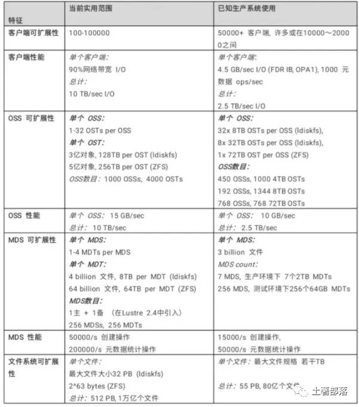
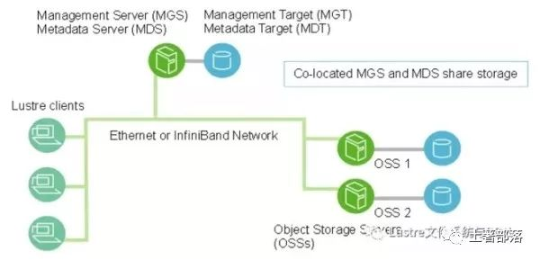
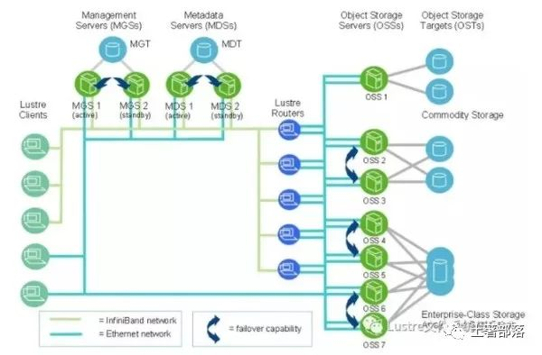
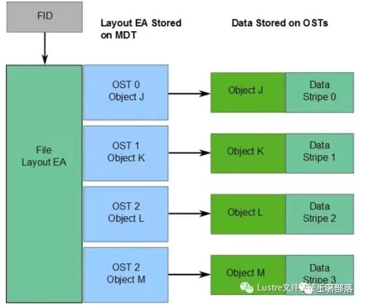
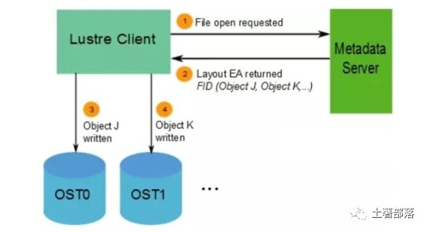
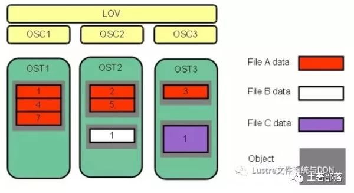

Lustre架构是一种集群存储体系结构，其核心组件就是Lustre文件系统。该文件系统可在Linux操作系统上运行，并提供了符合POSIX标准的UNIX文件系统接口。

### 1. Lustre文件系统是什么

Lustre架构用于许多不同种类的集群。众所周知，它服务于许多全球最大的高性能计算(HPC)集群，提供了数以万计的客户端，PB级存储和每秒数百GB的吞吐量。许多HPC站点使用Lustre文件系统作为全站范围的全局文件系统，为数十个群集提供服务。

Lustre文件系统具有按需扩展容量和性能的能力，降低了部署多个独立文件系统的必要性(如每个计算群集部署一个文件系统)，从而避免了在计算集群之间复制数据，简化了存储管理。Lustre文件系统不仅可将许多服务器的存储容量进行聚合，也可将其I / O吞吐量进行聚合，并通过添置服务器进行扩展。通过动态地添加服务器，轻松实现整个集群的吞吐量和容量的提升。

虽然Lustre文件系统可以在许多工作环境中运行，但也并非就是所有应用程序的最佳选择。当单个服务器无法提供所需容量时，使用Lustre文件系统集群无疑是最适合的。在某些情况下，由于其强大的锁定和数据一致性，即使在单个服务器环境下Lustre文件系统也比其他文件系统表现得更好。

目前，Lustre文件系统并不特别适用于“端对端”的用户模式。在这种模式下，客户端和服务器在同一节点上运行，每个节点共享少量存储。由于Lustre缺少软件级别的数据副本，如果一个客户端或服务器发生故障，存储在该节点上的数据在该节点重新启动前将不可访问。

### 2. Lustre文件系统特性

Lustre文件系统可运行在各种厂商的内核上。一个Lustre文件系统在客户端节点数量、磁盘存储量、带宽上进行扩大或缩小。可扩展性和性能取决于可用磁盘、网络带宽以及系统中服务器的处理能力。

Lustre文件系统可以以多种配置进行部署，这些配置的可扩展性远远超出了迄今所观察到生产系统中的规模和性能。下表中列出了一些Lustre文件系统的可扩展性和性能:

- 性能增强的ext4文件系统：

Lustre文件系统使用改进版的ext4日志文件系统来存储数据和元数据。这个版本被命名为ldiskfs，不仅性能有所提升且提供了Lustre文件系统所需的附加功能。

Lustre 2.4或更高版本中，可使用ZFS作为Lustre的MDT，OST和MGS存储的后备文件系统。这使Lustre能够利用ZFS的可扩展性和数据完整性特性来实现单个存储目标。

- 符合POSIX标准：

通过完整的POSIX测试集，像测试本地文件系统Ext4一样，测试Lustre文件系统客户端，只有极少量例外。在集群中，大多数操作都是原子操作，因此客户端永远不会看到损坏的数据或元数据。 Lustre软件支持mmap()文件I / O操作。

- 高性能异构网络：

Lustre软件支持各种高性能低延迟的网络，可使用远程直接内存访问(RDMA)方式，实现在InfiniBand、Intel OmniPath等高级网络上的快速高效网络传输。可使用Lustre路由桥接多个RDMA网络以获得最佳性能。Lustre软件同时也集成了网络诊断。

- 高可用性：

Lustre文件系统通过OSTs(OSS targets)的共享存储分区实现主动/主动故障切换。 Lustre 2.3或更早版本通过使用MDT(MDS target)的共享存储分区实现主动/被动故障切换。 Lustre文件系统可以与各种高可用性(HA)管理器一起工作，以实现自动故障切换并消除了单点故障(NSPF)。这使得应用程序透明恢复成为可能。多重挂载保护(MMP)提供了对高可用性系统中错误的综合保护，避免导致文件系统损坏。

Lustre 2.4或更高版本中，可配置多个MDT的主动/主动故障切换。这允许了通过添加MDT存储设备和MDS节点来扩展Lustre文件系统的元数据性能。

- 安全性：

默认情况下，TCP连接只允许授权端口通过。 UNIX组成员身份在MDS上进行验证。

- 访问控制列表(ACL)及扩展属性：

Lustre安全模型遵循UNIX文件系统原则，并使用POSIX ACL进行增强。此外还有一些额外功能，如root squash。

- 互操作性：

Lustre文件系统可运行在各种CPU架构和大小端混合的群集上，连续发布的Lustre主要软件版本之间保持互操作性性。

- 基于对象的体系结构：

客户端与磁盘文件结构相互隔离，可在不影响客户端的情况下升级存储体系结构。

- 字节粒度文件锁和细粒度元数据锁：

许多客户端可以同时读取和修改相同的文件或目录。 Lustre分布式锁管理器(LDLM)确保了文件系统中所有客户端和服务器之间的文件是一致的。其中，MDT锁管理器负责管理inode权限和路径名。每个OST都有其自己的锁管理器，用于锁定存储在其上的文件条带，其性能可随着文件系统大小增长而扩展。

- 配额：

用户、组和项目配额(User、Group、Project Quota)可用于Lustre文件系统。

- 容量增长：

通过向群集添加新的OST和MDT，可以在不中断服务的情况下增加Lustre文件系统的大小和集群总带宽。

- 受控文件布局：

可以在每个文件，每个目录或每个文件系统基础上配置跨OST的文件布局。这允许了在单个文件系统中调整文件I/O以适应特定的应用程序要求。 Lustre文件系统使用RAID-0进行条带化并可在OST之间调节空间使用大小。

- 网络数据完整性保护：

从客户端发送到OSS的所有数据的校验和可防止数据在传输期间被损坏。

- MPI I/O：

Lustre架构具有专用的MPI ADIO层，优化了并行I/O以匹配基础文件系统架构。

- NFS和CIFS导出：

可以使用NFS(通过Linux knfsd)或CIFS(通过Samba)将Lustre文件重新导出，使其可以与非Linux客户端(如Microsoft Windows和Apple Mac OS X)共享。

- 灾难恢复工具：

Lustre文件系统提供在线分布式文件系统检查(LFSCK)，当发生主要文件系统错误的情况下恢复存储组件之间的一致性。 Lustre文件系统在存在文件系统不一致的情况下也可以运行，而LFSCK可以在文件系统正在使用时运行，因此LFSCK不需要在文件系统恢复生产之前完成。

- 性能监视：

Lustre文件系统提供了多种机制来检查性能和进行调整。

- 开放源代码：

为在Linux操作系统上运行，Lustre软件使用GPL 2.0许可证。

### 3. Lustre组件介绍

一个Lustre安装实例包括管理服务器(MGS)和一个或多个与Lustre网络(LNet)互连的Lustre文件系统。Lustre文件系统组件的基本配置如下图所示：

#### 3.1 管理服务器(MGS)

MGS存储集群中所有Lustre文件系统的配置信息，并将此信息提供给其他Lustre组件。每个Lustre目标(target)通过联系MGS提供信息，而Lustre客户通过联系MGS获取信息。MGS最好有自己的存储空间，以便可以独立管理。但同时，MGS可以与MDS放在一起，并共享存储空间，如上图中所示。

#### 3.2 Lustre文件系统组件

- 元数据服务器(MDS):

MDS使存储在一个或多个MDT中的元数据可供Lustre客户端使用。每个MDS管理Lustre文件系统中的名称和目录，并为一个或多个本地MDT提供网络请求处理。

- 元数据目标(MDT):

在Lustre 2.3或更早版本中，每个文件系统只有一个MDT。 MDT在MDS的附加存储上存储元数据(例如文件名，目录，权限和文件布局)。虽然共享存储目标上的MDT可用于多个MDS，但一次只能有一个MDS可以访问。如果当前MDS发生故障，则备用MDS可以为MDT提供服务，并将其提供给客户端。这被称为MDS故障切换。

在Lustre 2.4中，分布式命名空间环境(DNE)中可支持多个MDT。除保存文件系统根目录的主MDT之外，还可以添加其他MDS节点，每个MDS节点都有自己的MDT，以保存文件系统的子目录树。

在Lustre 2.8中，DNE还允许文件系统将单个目录的文件分布到多个MDT节点。分布在多个MDT上的目录称为条带化目录。

- 对象存储服务器(OSS)：

OSS为一个或多个本地OST提供文件I / O服务和网络请求处理。通常，OSS服务于两个到八个OST，每个最多16TB;在专用节点上配置一个MDT;在每个OSS节点上配置两个或更多OST;而在大量计算节点上配置客户端。

- 对象存储目标(OST)：

用户文件数据存储在一个或多个对象中，每个对象位于Lustre文件系统的单独OST中。每个文件的对象数由用户配置，并可根据工作负载情况调试到最优性能。

- Lustre客户端：

Lustre客户端是运行Lustre客户端软件的计算、可视化或桌面节点，可挂载Lustre文件系统。

Lustre客户端软件为Linux虚拟文件系统和Lustre服务器之间提供了接口。客户端软件包括一个管理客户端(MGC)，一个元数据客户端(MDC)和多个对象存储客户端(OSC)。每个OSC对应于文件系统中的一个OST。

逻辑对象卷(LOV)通过聚合OSC以提供对所有OST的透明访问。因此，挂载了Lustre文件系统的客户端会看到一个连贯的同步名字空间。多个客户端可以同时写入同一文件的不同部分，而其他客户端可以同时读取文件。

与LOV文件访问方式类似，逻辑元数据卷(LMV)通过聚合MDC提供一种对所有MDT透明的访问。这使得了客户端可将多个MDT上的目录树视为一个单一的连贯名字空间，并将条带化目录合并到客户端形成一个单一目录以便用户和应用程序查看。

### 4. Lustre网络 (LNet)

Lustre Networking(LNet)是一种定制网络API，提供处理Lustre文件系统服务器和客户端的元数据和文件I/O数据的通信基础设施。

### 5. Lustr文件系统 集群

在规模上，一个Lustre文件系统集群可以包含数百个OSS和数千个客户端(如下图所示)。 Lustre集群中可以使用多种类型的网络，OSS之间的共享存储启用故障切换功能。

### 6. Lustre文件系统存储与I/O

在 Lustre 2.0 中引入了Lustre文件标识符(FID)来替换用于识别文件或对象的UNIX inode编号。 FID是一个128位的标识符，其中，64位用于存储唯一的序列号，32位用于存储对象标识符(OID)，另外32位用于存储版本号。序列号在文件系统(OST和MDT)中的所有Lustre目标中都是唯一的。这一改变使未来支持多种 MDT 和ZFS(均在Lustre 2.4中引入)成为了可能。

同时，在此版本中也引入了一个名为FID-in-dirent(也称为Dirdata)的ldiskfs功能，FID作为文件名称的一部分存储在父目录中。该功能通过减少磁盘I/O显著提高了ls命令执行的性能。 FID-in-dirent是在创建文件时生成的。

在 Lustre 2.4 中，LFSCK文件系统一致性检查工具提供了对现有文件启用FID-in-dirent的功能。具体如下：

- 为1.8版本文件系统上现有文件生成IGIF模式的FID。

- 验证每个文件的FID-in-dirent，如其无效或丢失，则重新生成FID-in-dirent。

- 验证每个linkEA条目，如其无效或丢失，则重新生成。 linkEA由文件名和父类FID组成，它作为扩展属性存储在文件本身中。因此，linkEA可以用来重建文件的完整路径名。

有关文件数据在OST上的位置信息将作为扩展属性布局EA，存储在由FID标识的MDT对象中(具体如下图所示)。若该文件是普通文件(即不是目录或符号链接)，则MDT对象1对N地指向包含文件数据的OST对象。若该MDT文件指向一个对象，则所有文件数据都存储在该对象中。若该MDT文件指向多个对象，则使用RAID 0将文件数据划分为多个对象，将每个对象存储在不同的OST上。

当客户端读写文件时，首先从文件的MDT对象中获取布局EA，然后使用这个信息在文件上执行I / O，直接与存储对象的OSS节点进行交互。具体过程如下图所示。

Lustre文件系统的可用带宽如下：

- 网络带宽等于OSS到目标的总带宽。

- 磁盘带宽等于存储目标(OST)的磁盘带宽总和，受网络带宽限制。

- 总带宽等于磁盘带宽和网络带宽的最小值。

- 可用的文件系统空间等于所有OST的可用空间总和。

### 7. Lustre文件系统条带化

Lustre文件系统高性能的主要原因之一是能够以轮询方式跨多个OST将数据条带化。用户可根据需要为每个文件配置条带数量，条带大小和OST。当单个文件的总带宽超过单个OST的带宽时，可以使用条带化来提高性能。同时，当单个OST没有足够的可用空间来容纳整个文件时，条带化也能发挥它的作用。

如图下图所示，条带化允许将文件中的数据段或“块”存储在不同的OST中。在Lustre文件系统中，通过RAID 0模式将数据在一定数量的对象上进行条带化。一个文件中处理的对象数称为stripe_count。每个对象包含文件中的一个数据块，当写入特定对象的数据块超过stripe_size时，文件中的下一个数据块将存储在下一个对象上。stripe_count和stripe_size的默认值由为文件系统设置的，其中，stripe_count为1，stripe_size为1MB。用户可以在每个目录或每个文件上更改这些值。

下图中，文件C的stripe_size大于文件A的stripe_size，表明更多的数据被允许存储在文件C的单个条带中。文件A的stripe_count为3，则数据在三个对象上条带化。文件B和文件C的stripe_count是1。OST上没有为未写入的数据预留空间。

最大文件大小不受单个目标大小的限制。在Lustre文件系统中，文件可以跨越多个对象(最多2000个)进行分割，每个对象可使用多达16 TB的ldiskfs，多达256PB的ZFS。也就是说，ldiskfs的最大文件大小为31.25 PB，ZFS的最大文件大小为8EB。Lustre文件系统上的文件大小受且仅受OST上可用空间的限制，Lustre最大可支持2 ^ 63字节(8EB)的文件。

注意: Lustre 2.2之前，单个文件的最大条带数为160个OST。尽管一个