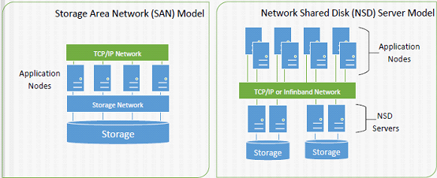
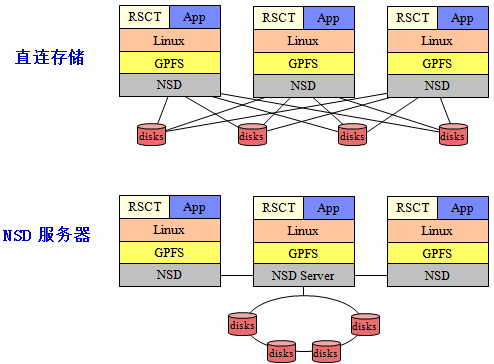
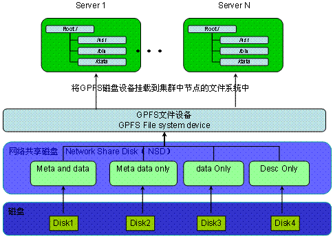
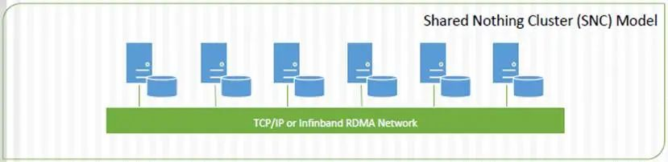
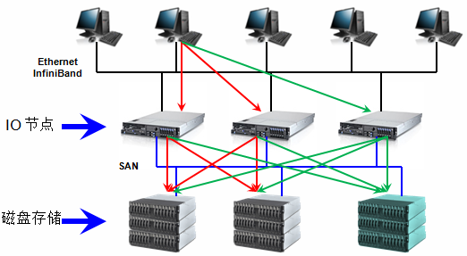
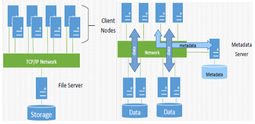
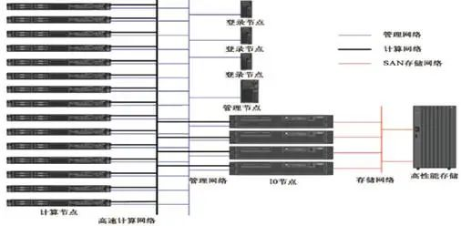
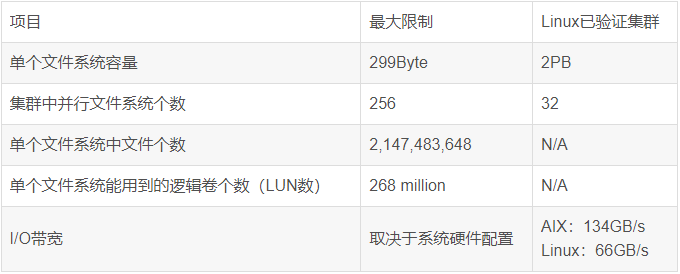

### 1. GPFS历史背景及发展

GPFS（General Parallel File System）是IBM公司推出的行业领先的并行分布式通用并行集群文件系统，GPFS从1993开始研发，1995年投入商用（最早投入使用在多媒体处理行业，所以我们现在看到GPFS的很多目录和命令为什么都有MM[multimedia]两个字母，就是根据这个背景延续下来的）。

从1998年开始首先应用于AIX集群，2001年后应用于Linux集群，2010年后支持windows集群，IBM改名GPFS为Spectrum Scale，最新版本为Spectrum Scale5.1.x。

### 2. GPFS架构

GPFS是一个共享磁盘，并行集群文件系统。可以跑在AIX，Linux和Windows操作系统的IBM Power和英特尔/AMD的x86架构下。

#### 2.1 SAN架构和NSD架构

目前，GPFS有三种架构，第一个示意图中的每个Application Nodes上安装GPFS，形成集群，下面的存储和每一个Nodes相连。第二个示意图中某一个或多个Node作为NSD server，直接和存储相连，其他Nodes通过NSD servers访问存储，图中的Application Nodes和NDS Servers共同组成GPFS Cluster。将示意图打开：

从另外一个角度来看GPFS的基本结构：

- 磁盘：

    GPFS 文件系统最底层的是物理磁盘设备。原则上可以采用系统上任何块设备。

- 网络共享磁盘（NSD）：

    NSD 是由磁盘映射出来的虚拟设备（LUN），NSD 与磁盘（LUN）是一一对应的关系。NSD 被标记了不同属性来区分其用途，我们可以将磁盘标记为 4 种用途(如上图所示)

- GPFS 文件设备：

    GPFS 设备是一个可被系统挂载的文件设备，由 NSD 创建而成，可以并行的同时挂载在多个节点上。

Server 1~Server N，对应示意图中的Application Nodes

#### 2.2 SNC（Share Nothing Cluster）架构

第三种架构是在2010年推出的，这种新架构是搭建在IBM并行文件系统集群(GPFS)之上的，融合Hadoop Distributed File System (HDFS)通过集群技术提供高可用性、动态文件系统管理和高级数据复制技术。

IBM将GPFS-SNC描述成一种通用的文件系统，让IBM能够在“所有领域”竞争，不管是针对Google的MapReduce框架，在传统数据仓库环境下针对Oracle的Exadata Database Machine和EMC的Greenplum Data Computing Appliance，或是在云领域。

### 3. GPFS工作方式和扩展方式

GPFS可以在线添加存储和服务器，不影响应用正常运行，在IO服务器和磁盘存储两层都有很好的线性扩展能力。

最右侧的IO节点和磁盘存储是在线扩展的，支持8192节点的集群系统，目前在线最大集群规模的为2440个linux节点和1530个AIX节点

很多实际安装的GPFS集群规模都在500个节点以上

#### 3.1. GPFS与NFS,SAN File System系统结构的比较

GPFS不同于以下常见的两种架构：

第一种，File Server为传统的NAS，扩展受限，存在性能瓶颈。但是对于isilon、N9000这种分布式NAS来说，不存在这个问题。

第二种，有元数据节点，有潜在的性能瓶颈和单点故障。如果是大文件读写场景，或者文件不是很小、规模不是很大的场景，也不存在性能瓶颈问题。

### 4. GPFS的优势

GPFS是从Tiger Shark 发展过来的，是目前应用范围较广的一个系统。在系统设计中采用了多项先进技术。它是一个共享磁盘（shared-disk）的分布式并行文件系统，客户端采用基于光纤通道或者iSCSI 与存储设备相连，也可以通过通用网络相连。

GPFS 的磁盘数据结构可以支持大容量的文件系统和大文件，通过采用分片存储、较大的文件系统块、数据预读等方法获得了较高的数据吞吐率；采用扩展哈希（extensible hashing）技术来支持含有大量文件和子目录的大目录，提高文件的查找和检索效率。GPFS 采用不同粒度的分布式锁解决系统中的并发访问和数据同步问题：字节范围的锁用于用户数据的同步，动态选择元数据节点（metanode）进行元数据的集中管理；具有集中式线索的分布式锁管理整个系统中空间分配等。

GPFS 采用日志技术对系统进行在线灾难恢复。每个节点都有各自独立的日志，且单个节点失效时，系统中的其他节点可以代替失效节点检查文件系统日志，进行元数据恢复操作。GPFS 还有效地克服了系统中任意单个节点的失效、网络通信故障、磁盘失效等异常事件。此外，GPFS 支持在线动态添加、减少存储设备，然后在线重新平衡系统中的数据。这些特性在需要连续作业的高端应用中尤为重要。

- 性能

    文件存储采用条带化技术，单个文件跨节点和存储系统分布，提高并发访问性能

    智能预取机制，通过对文件访问模式的预测来进行预取，降低读写延迟

    分布式的字节级锁管理，允许最大程度的并发访问

    分布式元数据服务器，所有元数据分散在磁盘阵列中，并可以由任何I/O节点管理，避免元数据处理成为系统瓶颈

    支持客户端数据缓存，不同节点可以根据需要设置不同的缓存大小

    数据块的大小可自定义，16 KB, 64 KB, 128 KB, 256 KB, 512 KB, 1 MB, 2 MB, 4MB, 8 MB and 16 MB

    NSD通信支持InfiniBand高速网络

- 可扩展性

    最大可支持数千个节点的集群规模和数百GB每秒的IO吞吐量

    在不停止服务的情况下向集群添加和删除节点

    在不停止服务的情况下向文件系统加入和删除磁盘

    在不停止服务的情况下修改文件系统inode数目

- 高可用性

    先进的仲裁管理机制，确保系统最大程度的可用性，没有单一故障点

    管理服务器在manager资源池内实现自动故障切换

    支持多路径磁盘访问，一条路径访问失败，可以通过其它路径实现，每个NSD可以支持8个NSD Server

    支持对元数据和用户数据做replication，保证系统稳定可靠

    Rolling Update，不停机升级

    支持日志功能，实现系统快速恢复

- 管理简单

    用户接口简单，与常用文件系统类似，方便用户使用

    单点管理，可以集群内任何一个节点上完成对GPFS的管理任务，命令将在所有节点上生效

    自动在各个节点间同步配置文件和系统信息

- GPFS的其它功能

    SnapShot（快照）

    ILM（信息生命周期管理）、HSM（分级存储管理）

    跨集群数据共享（multi-cluster cross mount）

    Traditional GPFS ACL、NFS V4 ACL

    配额管理：User Qutota、Group Quota、fileset Quota

    直接通过TSM server备份数据

### 5. GPFS与高性能计算

HPC 领域里面使用 GPFS，一般会在所有节点里面都安装 GPFS，只有 IO 节点（NSD Server）上可以直接访问存储（一般使用的 SAN 存储），计算节点和登录节点一般是安装 GPFS Client（或者叫NSD Client）。对应NSD Server Model。

GPFS License分为Server和Client两种，价格不同。

GPFS文件系统被广泛应用于世界上超大规模的高性能计算机系统中，包括运行速度最快的IBM Blue Gene系统。在TOP500计算机排名中的100+、200+套IBM计算机系统几乎都采用了GPFS并行文件系统方案。这些项目成功实施和顺利运行充分证明了GPFS完全可以胜任用来构建超大规模的计算机系统。

IBM GPFS并行文件系统软件在设计上不存在任何性能瓶颈，因此GPFS并行文件系统可以充分发挥硬件系统的性能。换句话说，GPFS并行文件系统的性能完全取决于硬件配置的好坏，而文件系统软件本身对性能的影响微乎其微。GPFS+DDN是业界最佳拍档。

### 6. GPFS不足

GPFS 在 HPC 领域并没有多少突出的缺点，但是GPFS涉及到大量的性能调优服务，且需要用户自身对存储相关技术领域有深厚的基础，对业务流程理解较深入，实际上只适合用户数量较少且本身比较专业的情况。如，GPFS 的 Cache（pagepool）是预先分配好的（可以通过一个参数调整），不能根据需要灵活的分配和回收。

在IBM网站上有个视频<理解IBM GPFS的优势>，里面有相关描述，在其他视频网站上也可以获取这个视频。