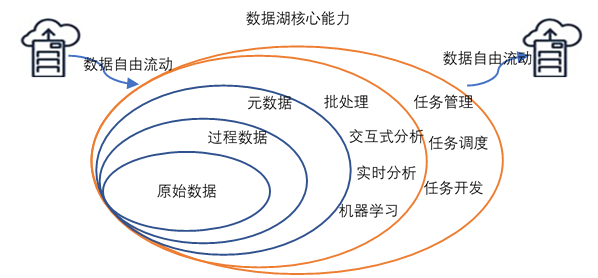

数据湖是目前比较热的一个概念，许多企业都在构建或者计划构建自己的数据湖。但是在计划构建数据湖之前，搞清楚什么是数据湖，明确一个数据湖项目的基本组成，进而设计数据湖的基本架构，对于数据湖的构建至关重要。关于什么是数据湖，有如下定义。

Wikipedia是这样定义的：

> 数据湖是一类存储数据自然/原始格式的系统或存储，通常是对象块或者文件。数据湖通常是企业中全量数据的单一存储。全量数据包括原始系统所产生的原始数据拷贝以及为了各类任务而产生的转换数据，各类任务包括报表、可视化、高级分析和机器学习。数据湖中包括来自于关系型数据库中的结构化数据（行和列）、半结构化数据（如 CSV、日志、XML、JSON）、非结构化数据（如 email、文档、PDF 等）和二进制数据（如图像、音频、视频）。数据沼泽是一种退化的、缺乏管理的数据湖，数据沼泽对于用户来说要么是不可访问的要么就是无法提供足够的价值。

AWS的定义相对就简单一点：

> 数据湖是一个集中式存储库，允许您以任意规模存储所有结构化和非结构化数据。您可以按原样存储数据（无需先对数据进行结构化处理），并运行不同类型的分析 – 从控制面板和可视化到大数据处理、实时分析和机器学习，以指导做出更好的决策。

微软的定义就更加模糊了，并没有明确给出什么是数据湖，而是取巧的将数据湖的功能作为定义：

> Azure 的数据湖包括一切使得开发者、数据科学家、分析师能更简单的存储、处理数据的能力，这些能力使得用户可以存储任意规模、任意类型、任意产生速度的数据，并且可以跨平台、跨语言的做所有类型的分析和处理。数据湖在能帮助用户加速应用数据的同时，消除了数据采集和存储的复杂性，同时也能支持批处理、流式计算、交互式分析等。数据湖能同现有的数据管理和治理的 IT 投资一起工作，保证数据的一致、可管理和安全。它也能同现有的业务数据库和数据仓库无缝集成，帮助扩展现有的数据应用。Azure 数据湖吸取了大量企业级用户的经验，并且在微软一些业务中支持了大规模处理和分析场景，包括 Office 365, Xbox Live, Azure, Windows, Bing 和 Skype。Azure 解决了许多效率和可扩展性的挑战，作为一类服务使得用户可以最大化数据资产的价值来满足当前和未来需求。

关于数据湖的定义其实很多，但是基本上都围绕着以下几个特性展开：

1. 数据湖需要提供足够用的数据存储能力，这个存储保存了一个企业/组织中的所有数据。

1. 数据湖可以存储海量的任意类型的数据，包括结构化、半结构化和非结构化数据。

1. 数据湖中的数据是原始数据，是业务数据的完整副本。数据湖中的数据保持了他们在业务系统中原来的样子。

1. 数据湖需要具备完善的数据管理能力（完善的元数据），可以管理各类数据相关的要素，包括数据源、数据格式、连接信息、数据 schema、权限管理等。

1. 数据湖需要具备多样化的分析能力，包括但不限于批处理、流式计算、交互式分析以及机器学习；同时，还需要提供一定的任务调度和管理能力。

1. 数据湖需要具备完善的数据生命周期管理能力。不光需要存储原始数据，还需要能够保存各类分析处理的中间结果，并完整的记录数据的分析处理过程，能帮助用户完整详细追溯任意一条数据的产生过程。

1. 数据湖需要具备完善的数据获取和数据发布能力。数据湖需要能支撑各种各样的数据源，并能从相关的数据源中获取全量/增量数据；然后规范存储。

1. 数据湖能将数据分析处理的结果推送到合适的存储引擎中，满足不同的应用访问需求。对于大数据的支持，包括超大规模存储以及可扩展的大规模数据处理能力。

综上，个人认为数据湖应该是一种不断演进中、可扩展的大数据存储、处理、分析的基础设施；以数据为导向，实现任意来源、任意速度、任意规模、任意类型数据的全量获取、全量存储、多模式处理与全生命周期管理；并通过与各类外部异构数据源的交互集成，支持各类企业级应用。

这里需要再特别指出两点：

1. 可扩展是指规模的可扩展和能力的可扩展，即数据湖不但要能够随着数据量的增大，提供“足够”的存储和计算能力；还需要根据需要不断提供新的数据处理模式，例如可能一开始业务只需要批处理能力，但随着业务的发展，可能需要交互式的即席分析能力；又随着业务的实效性要求不断提升，可能需要支持实时分析和机器学习等丰富的能力。

1. 以数据为导向，是指数据湖对于用户来说要足够的简单、易用，帮助用户从复杂的 IT 基础设施运维工作中解脱出来，关注业务、关注模型、关注算法、关注数据。数据湖面向的是数据科学家、分析师。目前来看，云原生应该是构建数据湖的一种比较理想的构建方式，后面在“数据湖基本架构”一节会详细论述这一观点。