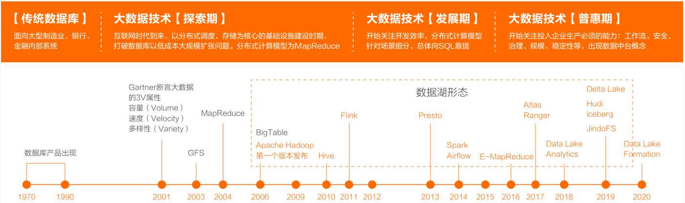
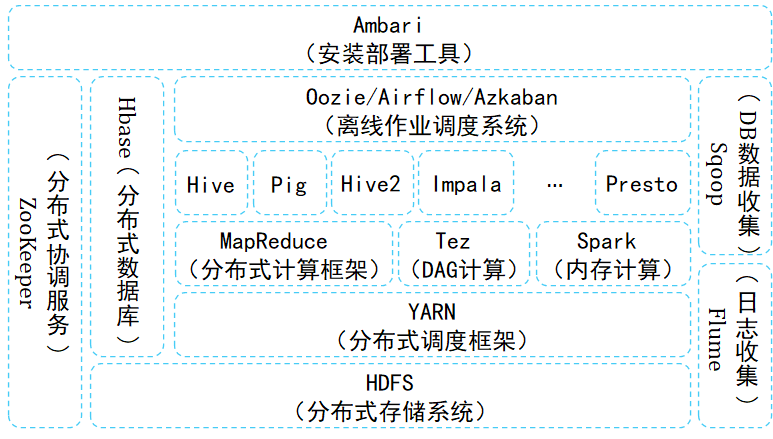
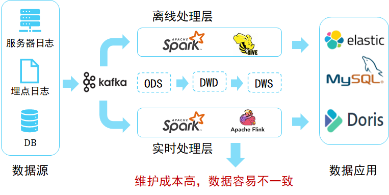
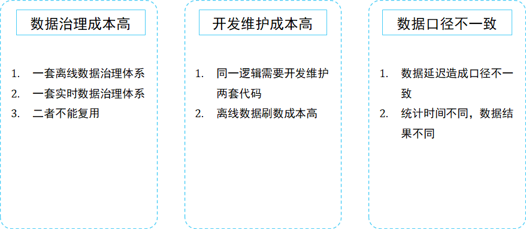
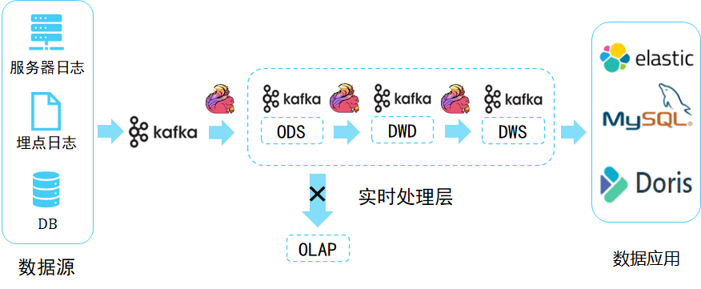
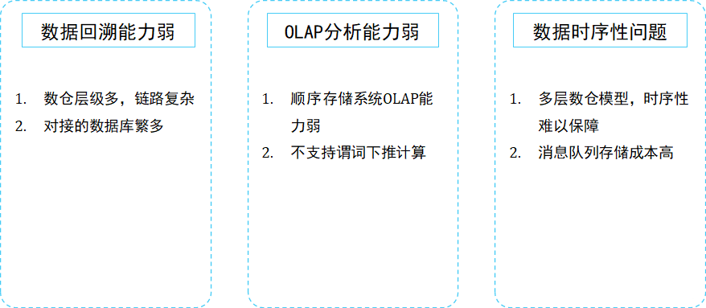
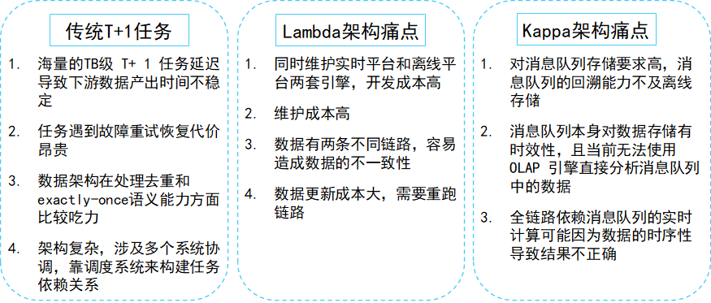
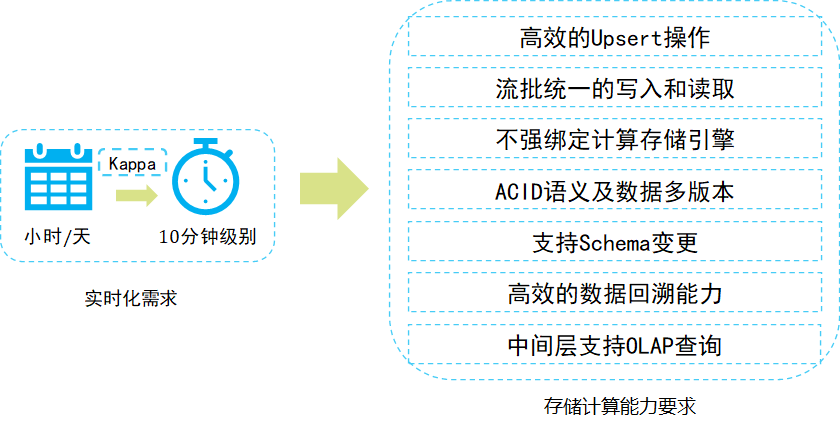
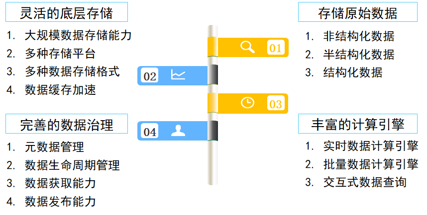
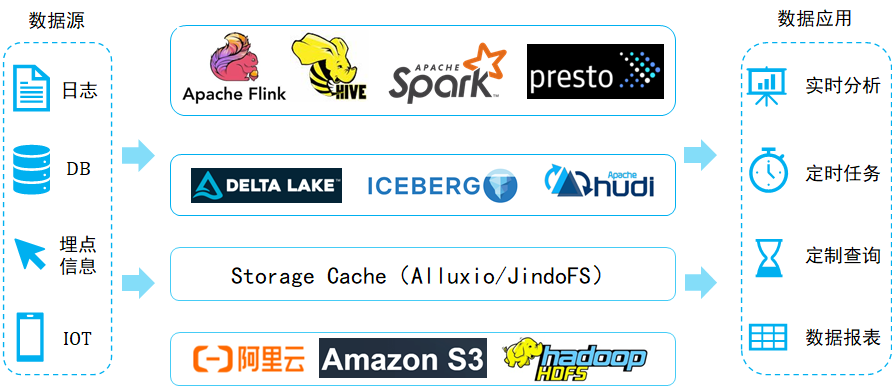

### 1. 背景

国内的大型互联网公司，每天都会生成几十、几百TB，甚至几PB的原始数据。这些公司通常采用开源的大数据组件来搭建大数据平台。大数据平台经历过“以Hadoop为代表的离线数据平台”、“Lambda架构平台”、“Kappa架构平台”三个阶段。

可以把数据湖认为是最新一代大数据技术平台，为了更好地理解数据湖的基本架构，我们先来看看大数据平台的演进过程，从而理解为什么要学习数据湖技术。

### 2. 离线大数据平台

以Hadoop为代表的离线数据处理组件。Hadoop是以HDFS为核心存储，以MapReduce为基本计算模型的批量数据处理基础组件。围绕HDFS和MR，为不断完善大数据平台的数据处理能力，先后诞生了一系列大数据组件，例如面向实时KV操作的HBase、面向SQL的Hive、面向工作流的Pig等。同时，随着大家对于批处理的性能要求越来越高，新的计算模型不断被提出，产生了Tez、Spark、Presto等计算引擎，MR模型也逐渐进化成DAG模型。

为减少数据处理过程中的中间结果写文件操作，Spark、Presto等计算引擎尽量使用计算节点的内存对数据进行缓存，从而提高整个数据过程的效率和系统吞吐能力。

### 3. Lambda架构

#### 3.1 架构介绍

随着数据处理能力和处理需求的不断变化，越来越多的用户发现，批处理模式无论如何提升性能，也无法满足实时性要求高的处理场景，流式计算引擎应运而生，例如Storm、Spark Streaming、Flink等。

然而，随着越来越多的应用上线，大家发现，其实批处理和流计算配合使用，才能满足大部分应用需求，对实时性要求高的场景，就会使用Flink+Kafka的方式构建实时流处理平台，来满足用户的实时需求。于是Lambda架构被提出，如下图所示。

Lambda架构的核心理念是“流批分离”，如上图所示，整个数据流向自左向右流入平台。进入平台后一分为二，一部分走批处理模式，一部分走流式计算模式。无论哪种计算模式，最终的处理结果都通过服务层对应用提供，确保访问的一致性。

这种数据架构包含非常多的大数据组件，很大程度上增强了整体架构的复杂性和维护成本。

#### 3.2 痛点

经过多年的发展，Lambda架构比较稳定，能满足过去的应用场景。但是它有很多致命的弱点：

1. 数据治理成本高

实时计算流程无法复用离线数仓的数据血缘、数据质量管理体系。需要重新实现一套针对实时计算的数据血缘、数据质量管理体系。

1. 开发维护成本高

需要同时维护离线和实时两套数据仓库系统，同一套计算逻辑要存储两份数据。例如，某一条或几条原式数据的更新，就需要重新跑一遍离线数据仓库，数据更新成本非常大。

1. 数据口径不一致

因为离线和实时计算走的是两个完全不同的代码，由于数据数据的延迟到达和两类代码运行的时间不一样，导致计算结果不一致。

那么有没有一种架构能解决Lambda架构的问题呢？

### 4. Kappa架构

Lambda架构的“流批分离”处理链路增大了研发的复杂性。因此，有人就提出能不能用一套系统来解决所有问题。目前比较流行的做法就是基于流计算来做。接下来我们介绍一下Kappa架构，通过Flink+Kafka将整个链路串联起来。Kappa架构解决了Lambda架构中离线处理层和实时处理层之间计算引擎不一致，开发、运维成本成本高，计算结果不一致等问题。

#### 4.1 架构介绍

Kappa架构的方案也被称为“批流一体化”方案。我们借用Flink+Kafka来构建流批一体化场景，当需要对ODS层数据做进一步的分析时，将Flink计算结果的DWD层写入到Kafka，同样也会将一部分DWS层的计算结果Kafka。Kappa架构也不是完美的，它也有很多痛点。

#### 4.2 痛点

1. 数据回溯能力弱

Kafka对复杂的需求分析支持能力弱，在面对更复杂的数据分析时，又要将DWD和DWS层的数据写入到ClickHouse、ES、MySQL或者是Hive里做进一步分析，这无疑带来了链路的复杂性。更大的问题是在做数据回溯时，由于链路的复杂性导致数据回溯能力非常弱。

1. OLAP分析能力弱

由于Kafka是一个顺序存储的系统，顺序存储系统是没有办法直接在其上进行OLAP分析的，例如谓词下推这类的优化策略，在顺序存储平台（Kafka）上实现是比较困难的事情。

1. 数据时序性受到挑战

Kappa架构是严重依赖于消息队列的，我们知道消息队列本身的准确性严格依赖它上游数据的顺序，但是，消息队列的数据分层越多，发生乱序的可能性越大。通常情况下，ODS层的数据是绝对准确的，把ODS层数据经过计算之后写入到DWD层时就会产生乱序，DWD到DWS更容易产生乱序，这样的数据不一致性问题非常大。

### 5. 大数据架构痛点总结

从传统的hadoop架构往Lambda架构，从Lambda架构往Kappa架构的演进，大数据平台基础架构的演进逐渐囊括了应用所需的各类数据处理能力，但是这些平台仍然存在很多痛点。

是否存在一种存储技术，既能够支持数据高效的回溯能力，支持数据的更新，又能够实现数据的批流读写，并且还能够实现分钟级到秒级的数据接入？

### 6. 实时数仓建设需求

这也是实时数仓建设的迫切需求。实际上是可以通过对Kappa架构进行升级，以解决Kappa架构中遇到的一些问题，接下来主要分享当前比较火的数据湖技术。

那么有没有这样一个架构，既能够满足实时性的需求，又能够满足离线计算的要求，而且还能够减轻开发运维的成本，解决通过消息队列方式构建的Kappa架构中遇到的痛点？答案是肯定的。

### 7. 数据湖架构

#### 7.1 数据湖理念

数据湖是一个集中式存储库，可以存储结构化和非结构化数据。可以按业务数据的原样存储（无需先对数据进行结构化处理），并运行不同类型的分析 – 从控制面板和可视化到大数据处理、实时分析和机器学习，以指导做出更好的决策。 

1. 存储原始数据

1. 数据湖需要有足够的存储能力，能够存储公司的全部数据。

1. 数据湖可以存储各种类型的数据，包括结构化、半结构化（XML、Json等）和非结构化数据（图片、视频、音频）。

1. 数据湖中的数据是原始业务数据的完整副本，这些数据保持了他们在业务系统中原来的样子。

1. 灵活的底层存储功能

在实际的使用过程中，数据湖中的数据通常并不会被高频访问，为了达到可接受的性价比，数据湖建设通常会选择性价比高的存储引擎（如S3/OSS/HDFS）。

- 对大数据提供超大规模存储，以及可扩展的大规模数据处理能力。

- 可以采用S3/HDFS/OSS等分布式存储平台作为存储引擎。

- 支持Parquet、Avro、ORC等数据结构格式。

- 能够提供数据缓存加速功能。

1. 丰富的计算引擎

从数据的批量计算、流式计算，交互式查询分析到机器学习，各类计算引擎都属于数据湖应该囊括的范畴。随着大数据与人工智能技术的结合，各类机器学习/深度学习算法也被不断引入进来，例如TensorFlow/PyTorch框架已经支持从HDFS/S3/OSS上读取样本数据进行机器学习训练。因此，对于一个合格的数据湖项目而言，计算存储引擎的可插拔性，是数据湖必须具备的基础能力。

1. 完善的数据管理

- 数据湖需要具备完善的元数据管理能力：包括对数据源、数据格式、连接信息、数据schema、权限管理等能力。

- 数据湖需要具备完善的数据生命周期管理能力。不仅能够存储原始数据，还需要能够保存各类分析处理的中间结果数据，并完整的记录数据的分析处理过程，帮助用户能够完整追溯任意一条数据的产生过程。

- 数据湖需要具备完善的数据获取和数据发布能力。数据湖需要能支撑各种各样的数据源，并能从相关的数据源中获取全量/增量数据；然后规范存储。数据湖能将数据推送到合适的存储引擎中，以满足不同的应用访问需求。

#### 7.2 数据湖架构

LakeHouse架构成为当下架构演进最热的趋势，可直接访问存储的数据管理系统，它结合了数据仓库的主要优势。LakeHouse是基于存算分离的架构来构建的。存算分离最大的问题在于网络，特别是对于高频访问的数仓数据，网络性能至关重要。实现Lakehouse的可选方案很多，比如Delta，Hudi，Iceberg。虽然三者侧重点有所不同，但都具备数据湖的一般功能，比如：统一元数据管理、支持多种计算分析引擎、支持高阶分析和计算存储分离。

那么开源数据湖架构一般是啥样的呢？这里我画了一个架构图，主要分为四层：

1. 分布式文件系统

第一层是分布式文件系统，对于选择云上技术的用户，通常会选择S3和阿里云存储数据；喜欢开源技术的用户一般采用自己维护的HDFS存储数据。

1. 数据加速层

第二层是数据加速层。数据湖架构是一个典型的存储计算分离架构，远程读写的性能损耗非常大。我们常见的做法是，把经常访问的数据（热点数据）缓存在计算节点本地，从而实现数据的冷热分离。这样做的好处是，提高数据的读写性能，节省网络带宽。我们可以选择开源的Alluxio，或者阿里云的Jindofs。

1. Table format 层

第三层是Table format层，把数据文件封装成具有业务含义的表，数据本身提供ACID、snapshot、schema、partition等表级别的语义。这一层可以选择开源数据湖三剑客Delta、Iceberg、Hudi之一。Delta、Iceberg、Hudi是构建数据湖的一种技术，它们本身并不是数据湖。

1. 计算引擎

第四层是各种数据计算引擎。包括Spark、Flink、Hive、Presto等，这些计算引擎都可以访问数据湖中的同一张表。