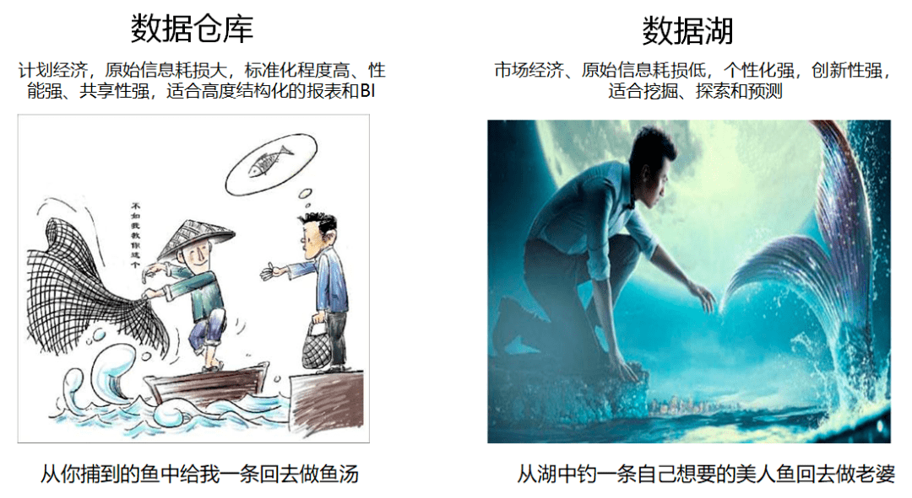
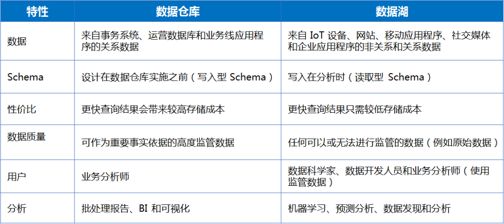
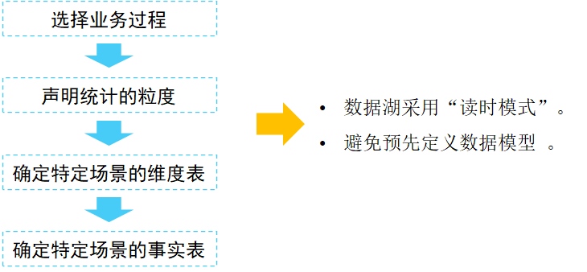
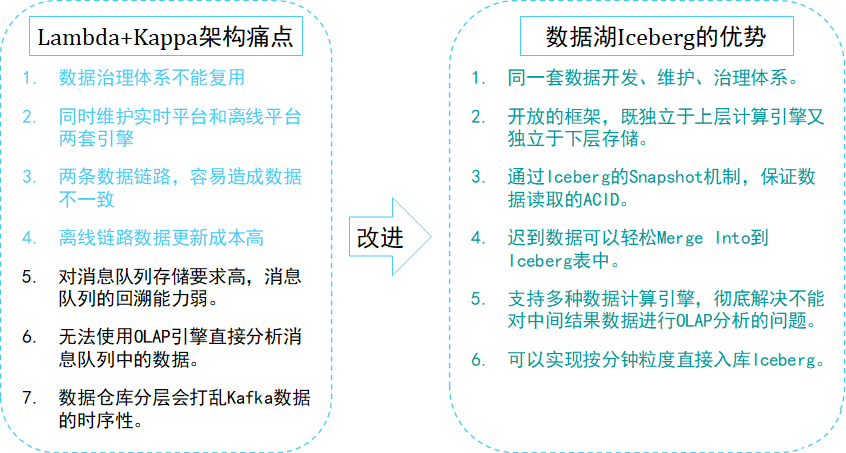
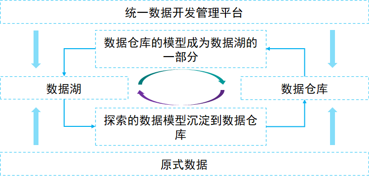

### 1. 对比

下面跟大家聊聊我所理解的数据湖的本质，对于一种新事物不了解本质，你就很难驾驭它，下面这张图道尽了一切。

对数据湖的概念有了基本的认知之后，需要进一步明确数据湖需要具备哪些基本特征，特别是与数据仓库相比，数据湖具有哪些特点。引用一下AWS数据仓库和数据湖对比官方对比表格。

每个公司需要数据仓库和数据湖，因为它们分别满足不同的需要和使用案例：

1. 数据仓库是一个优化后的数据库，用于分析来自事务系统和业务线应用系统的关系型数据。事先定义好数据结构和Schema，以便提供快速的SQL查询。原始数据经过一些列的ETL转换，为用户提供可信任的“单一数据结果”。

1. 数据湖有所不同，因为它不但存储来自业务线应用系统的关系型数据，还要存储来自移动应用程序、IoT设备和社交媒体的非关系型数据。捕获数据时，不用预先定义好数据结构或Schema。这意味着数据湖可以存储所有类型的数据，而不需要精心设计数据结构。可以对数据使用不同类型的分析方式（如SQL查询、大数据分析、全文搜索、实时分析和机器学习）。

随着使用数据仓库的组织看到数据湖的优势，他们正在改进其仓库以包括数据湖，并启用各种查询功能、数据科学使用案例和用于发现新信息模型的高级功能。Gartner 将此演变称为“分析型数据管理解决方案”或“DMSA”。

上表介绍了数据湖与传统数据仓库的区别，下面我们将从数据存储和计算两个层面进一步分析数据湖应该具备哪些特征。

### 2. 写时模式和读时模式

- 写时模式

数据仓库的“写入型Schema”背后隐藏的逻辑就是在数据写入之前，必须确认好数据的Schema，然后进行数据导入，这样做的好处是：可以把业务和数据很好的结合在一起；不足就是在业务模式不清晰，还处于探索阶段时，数仓的灵活性不够。

- 读时模式

数据湖强调的是“读取型Schema”，背后潜在的逻辑是，认为业务的不确定性是常态：既然我们无法预测业务的发展变化，那么我们就保持一定的灵活性。将结构化设计延后，让整个基础设施具备使数据“按需”贴合业务的能力。因此，数据湖更适合发展、创新型企业。

### 3. 数据仓库开发流程

数据湖采用的是灵活，快速的“读时模式” ，在数字化转型的浪潮下真正帮助企业完成技术转型，完成数据沉淀，应对企业快速发展下层出不穷的数据需求问题。

### 4. 数据湖的架构方案

数据湖可以认为是新一代的大数据基础设施。在这套架构中，无论是数据的流式处理，还是批处理，数据存储都统一到数据湖-Iceberg上。很明显，这套架构可以解决Lambda架构和Kappa架构的痛点问题：

1. 解决Kafka存储数据量少的问题

目前所有数据湖基本思路都是基于HDFS之上实现的一个文件管理系统，所以数据体量可以很大。

1. 支持OLAP查询

同样数据湖基于HDFS之上实现，只需要当前的OLAP查询引擎做一些适配，就可以对中间层数据进行OLAP查询。

1. 数据治理一体化

批流的数据在HDFS、S3等介质上存储之后，就完全可以复用一套相同的数据血缘、数据质量管理体系。

1. 流批架构统一

数据湖架构相比Lambad架构来说，schema统一，数据处理逻辑统一，用户不再需要维护两份数据。

1. 数据统计口径一致

由于采用统一的流批一体化计算和存储方案，因此数据一致性得到了保证。

### 5. 孰优孰劣

数据湖和数据仓库，不能说谁更好谁更差，大家都有可取之处，可以实现双方的优势互补，我这里画一张图，方便你的理解：

1. 湖和仓的元数据无缝打通，互相补充，数据仓库的模型反哺到数据湖（成为原始数据一部分），湖的结构化应用沉淀到数据仓库。

1. 统一开发湖和仓，存储在不同系统的数据，可以通过平台进行统一管理。

1. 数据湖与数据仓库的数据，根据业务的发展需要决定哪些数据放在数仓，哪些放在数据湖，进而形成湖仓一体化。

1. 数据在湖，模型在仓，反复演练转换。