### 1. 数据湖框架

如前面几篇文章所述，目前市面上流行的三大开源数据湖方案分别为：DeltaLake、Apache Iceberg和Apache Hudi。

- Delta Lake：DataBricks公司推出的一种数据湖方案，网址：

- Apache Iceberg：以类似于SQL的形式高性能的处理大型的开放式表，网址：

- Apache Hudi：Hadoop Upserts anD Incrementals，管理大型分析数据集在HDFS上的存储，网址：

#### 1.1 Delta Lake

- 流批一体的Data Lake存储层，支持 update/delete/merge

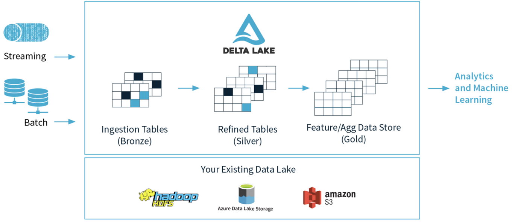

- 由于出自Databricks，Spark的所有数据写入方式，包括基于dataframe的批式、流式，以及SQL的Insert、Insert Overwrite等都是支持的（开源的SQL写暂不支持，EMR做了支持）。

- 在数据写入方面，Delta 与 Spark 是强绑定的；

- 在查询方面，开源 Delta 目前支持 Spark 与 Presto，但是，Spark 是不可或缺的，因为 delta log 的处理需要用到 Spark。

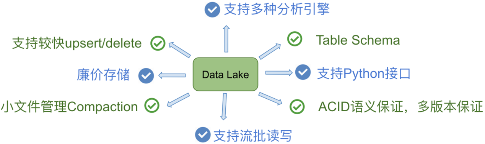

#### 1.2 Iceberg

- 用于跟踪超大规模表的新格式，是专门为对象存储（如S3）而设计的

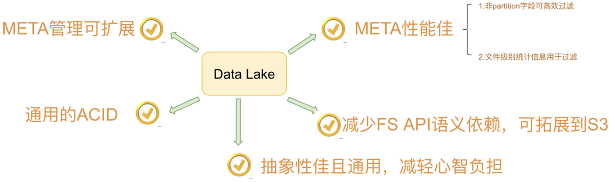

- 由 Netflix 开发开源的，其于 2018年11月16日进入 Apache 孵化器，是 Netflix 公司数据仓库基础。

- 一种可伸缩的表存储格式，允许在一个文件里面修改或者过滤数据，多个文件也支持，内置了许多最佳实践。

- 在查询方面，Iceberg 支持 Spark、Presto，提供了建表的 API，用户可以使用该 API 指定表明、schema、partition 信息等，然后在 Hive catalog 中完成建表。

#### 1.3 Apache Hudi

Apache Hudi：提供的fast upsert/delete以及compaction等功能，管理存储在HDFS上数据，设计目标正如其名，Hadoop Upserts Deletes and Incrementals（原为 Hadoop Upserts anD Incrementals）。

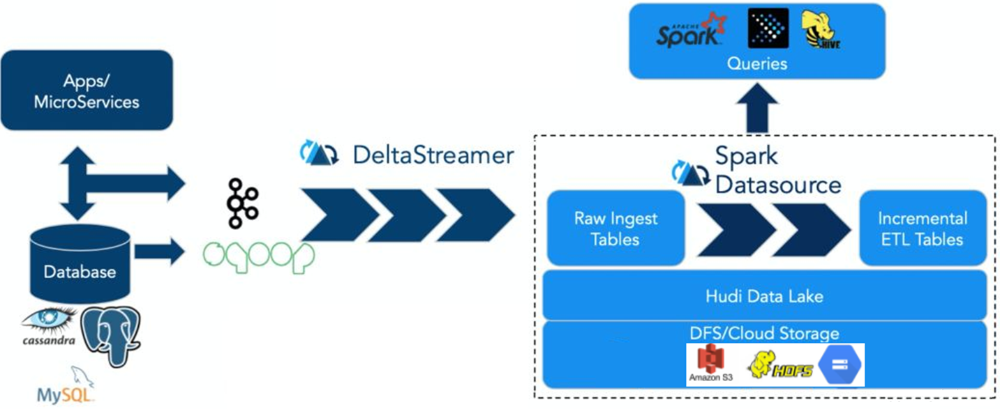

强调其主要支持Upserts、Deletes和Incrementa数据处理，支持三种数据写入方式：UPSERT，INSERT 和 BULK_INSERT。

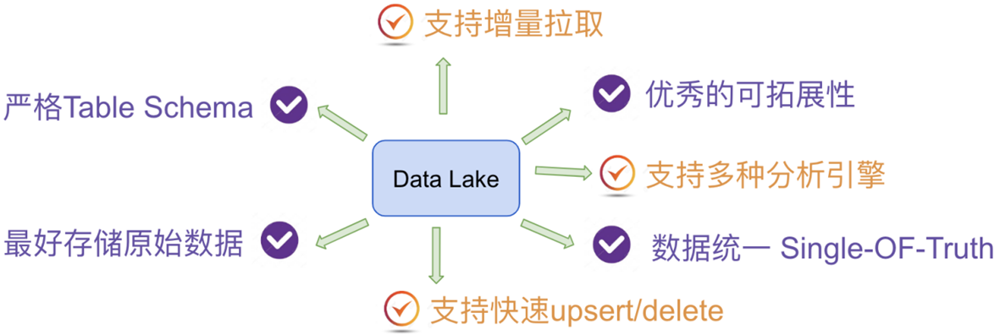

#### 1.4 痛点对比

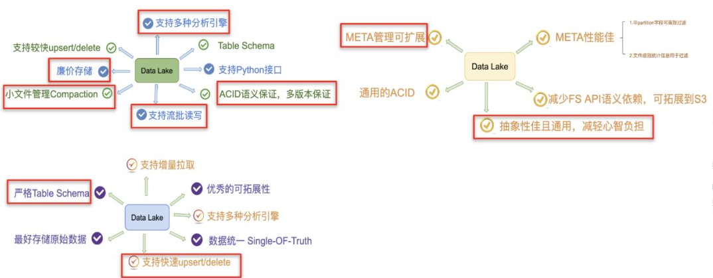

### 2. 功能对比

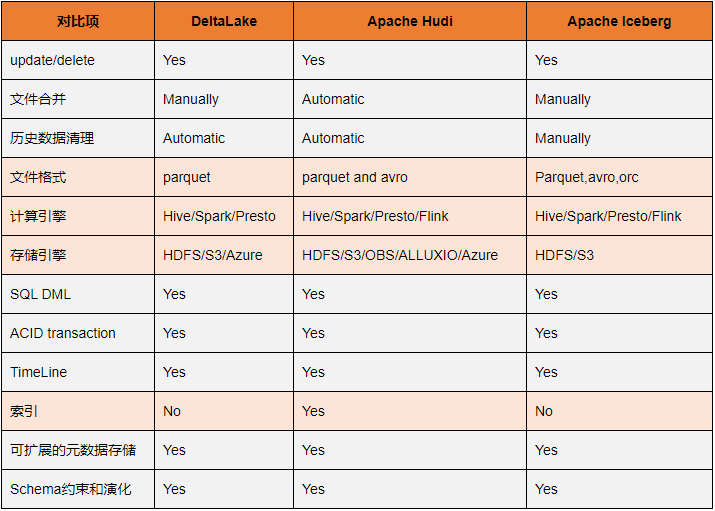

### 3. 七大维度对比

接下来我们从7个维度来对比评估三大项目的差异。通常人们在考虑数据湖方案选型时，Hive ACID也是一个强有力的候选人，因为它提供了人们需要的较为完善功能集合，所以这里我们把Hive ACID纳入到对比行列中。

#### 3.1 ACID和隔离级别支持

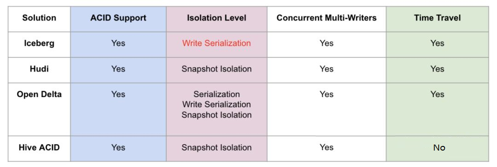

主要解释下，对数据湖来说三种隔离分别代表的含义。

1. Serialization是说所有的reader和writer都必须串行执行；

1. Write Serialization: 是说多个writer必须严格串行，reader和writer之间则可以同时跑；

1. Snapshot Isolation: 是说如果多个writer写的数据无交集，则可以并发执行；否则只能串行。Reader和writer可以同时跑。

1. 综合起来看，Snapshot Isolation隔离级别的并发性是相对比较好的。

#### 3.2 Schema变更支持和设计

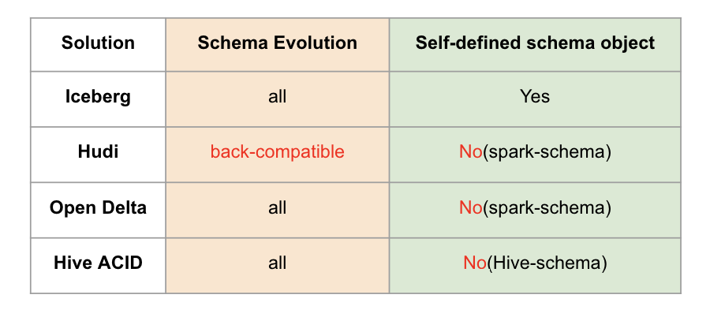

这里有两个对比项，一个是schema变更的支持情况，我的理解是hudi仅支持添加可选列和删除列这种向后兼容的DDL操作，而其他方案则没有这个限制。另外一个是数据湖是否自定义schema接口，以期跟计算引擎的schema解耦。这里iceberg是做的比较好的，抽象了自己的schema，不绑定任何计算引擎层面的schema。

在Hudi 0.11.0版本中，针对Spark 3.1、Spark 3.2版本增加了schema功能的演进。如果启用 set hoodie.schema.on.read.enable=true以后，我们可以对表列和对表进行一系列的操作。列的变更（增加、删除、重命名、修改位置、修改属性），表的变更（重命名、修改属性） 等。

#### 3.3 流批接口支持

目前Iceberg和Hive暂时不支持流式消费，不过Iceberg社区正在issue 179上开发支持。

#### 3.4 接口抽象程度和插件化

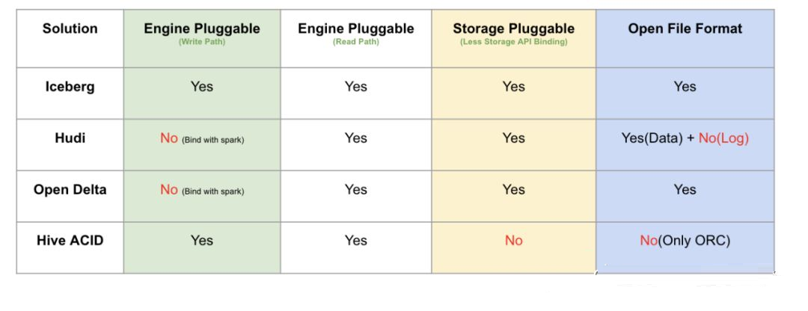

主要从计算引擎的写入和读取路径、底层存储可插拔、文件格式四个方面来做对比。这里Iceberg是抽象程度做得最好的数据湖方案，四个方面都做了非常干净的解耦。delta是databricks背后主推的，必须天然绑定spark；hudi的代码跟delta类似，也是强绑定spark。存储可插拔的意思是说，是否方便迁移到其他分布式文件系统上（例如S3），这需要数据湖对文件系统API接口有最少的语义依赖，例如若数据湖的ACID强依赖文件系统rename接口原子性的话，就难以迁移到S3这样廉价存储上，目前来看只有Hive没有太考虑这方面的设计；文件格式指的是在不依赖数据湖工具的情况下，是否能读取和分析文件数据，这就要求数据湖不额外设计自己的文件格式，统一用开源的parquet和avro等格式。这里，有一个好处就是，迁移的成本很低，不会被某一个数据湖方案给绑死。

#### 3.5 查询性能优化

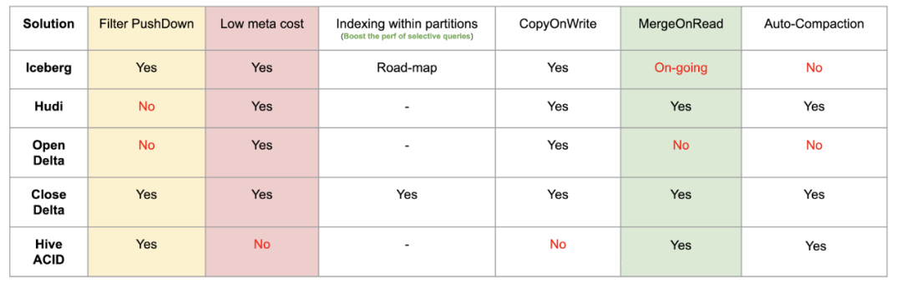

#### 3.6 其他功能

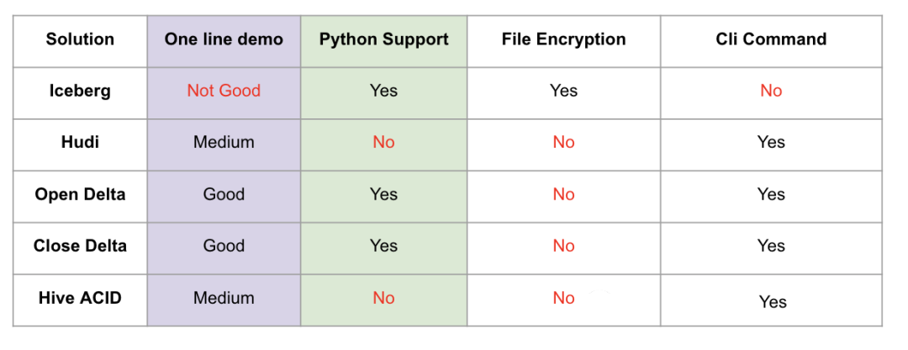

这里One line demo指的是，示例demo是否足够简单，体现了方案的易用性，Iceberg稍微复杂一点（我认为主要是Iceberg自己抽象出了schema，所以操作前需要定义好表的schema）。做得最好的其实是delta，因为它深度跟随spark易用性的脚步。

Python支持其实是很多基于数据湖之上做机器学习的开发者会考虑的问题，可以看到Iceberg和Delta是做的很好的两个方案。

出于数据安全的考虑，Iceberg还提供了文件级别的加密解密功能，这是其他方案未曾考虑到的一个比较重要的点。

#### 3.7 社区现状

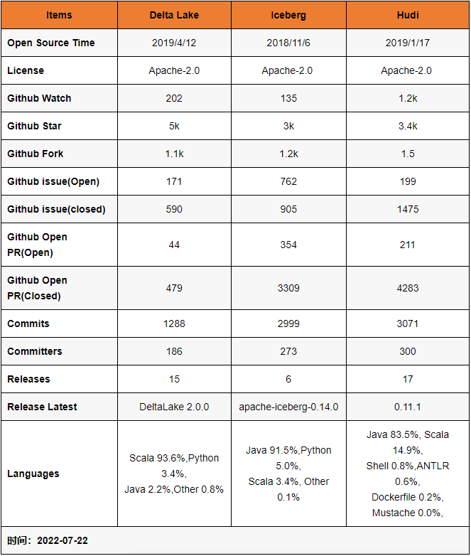

说明的是，Delta和Hudi两个项目在开源社区的建设和推进方面，做的比较好。

Delta 的开源版和商业版本，提供了详细的内部设计文档，用户很是容易理解这个方案的内部设计和核心功能，同时Databricks还提供了大量对外分享的技术视频和演讲，甚至邀请了他们的企业用户来分享Delta的线上经验。

Uber的工程师也分享了大量Hudi的技术细节和内部方案落地，研究官网的近10个PPT已经能较为轻松理解内部细节，此外国内的小伙伴们也在积极地推进社区建设，提供了官方的技术公众号和邮件列表周报。

Iceberg 相对会平静一些，社区的大部分讨论都在 Github 的 issues 和 pull request 上，邮件列表的讨论会少一点，不少有价值的技术文档要仔细跟踪 issues 和 PR 才能看到，这也许跟社区核心开发者的风格有关。

### 4. 总结

#### 4.1 作者1的看法

摘自：[https://www.infoq.cn/article/fjebconxd2sz9wloykfo](https://www.infoq.cn/article/fjebconxd2sz9wloykfo)

Delta 的房子底座相对结实，功能楼层也建得相对比较高，但这个房子其实可以说是 Databricks 的，本质上是为了更好的壮大 Spark 生态，在 Delta 上其他的计算引擎难以替换 Spark 的位置，尤其是写入路径层面。

Iceberg 的建筑基础非常扎实，扩展到新的计算引擎或者文件系统都非常的方便，但是现在功能楼层相对低一点，目前最缺的功能就是 upsert 和 compaction 两个，Iceberg 社区正在以最高优先级推动这两个功能的实现；Hudi 的情况要相对不一样，它的建筑基础设计不如 iceberg 结实，举个例子，如果要接入 Flink 作为 Sink 的话，需要把整个房子从底向上翻一遍，把接口抽象出来，同时还要考虑不影响其他功能。

当然 Hudi 的功能楼层还是比较完善的，提供的 upsert 和 compaction 功能直接命中广大群众的痛点。

Hive 的房子，看起来是一栋豪宅，绝大部分功能都有，把它做为数据湖有点像靠着豪宅的一堵墙建房子，显得相对重量级一点，另外正如 Netflix 上述的分析，细看这个豪宅的墙面是其实是有一些问题的。

#### 4.2 作者2的看法

摘自：[https://www.cnblogs.com/xuzhujack/p/15771027.html](https://www.cnblogs.com/xuzhujack/p/15771027.html)

三个引擎的初衷场景并不完全相同，Hudi 为了 incremental 的 upserts，Iceberg 定位于高性能的分析与可靠的数据管理，Delta 定位于流批一体的数据处理。这种场景的不同也造成了三者在设计上的差别。尤其是 Hudi，其设计与另外两个相比差别更为明显。 因此后面是趋同还筑起各自专长优势壁垒未可知。

Delta、Hudi、Iceberg三个开源项目中，Delta和Hudi跟Spark的代码深度绑定，尤其是写入路径。这两个项目设计之初，都基本上把Spark作为他们的默认计算引擎了。而Apache Iceberg的方向非常坚定，宗旨就是要做一个通用化设计的Table Format。

Apache Iceberg完美的解耦了计算引擎和底下的存储系统，便于多样化计算引擎和文件格式，很好的完成了数据湖架构中的Table Format 这一层的实现，因此也更容易 成为Table Format层的开源事实标准。

另一方面，Apache Iceberg也在朝着流批一体的数据存储层发展，manifest和snapshot的设计，有效地隔离不同transaction的变更 ，非常方便批处理和增量计算。并且，Apache Flink已经是一个流批一体的计算引擎，二都可以完美匹配，合力打造流批一体的数据湖架构。

最后，Apache Iceberg这个项目背后的社区资源非常丰富。在国外，Netflix、Apple、Linkedin、Adobe等公司都有PB级别的生产数据运行在Apache Iceberg上；在国内，腾讯这样的巨头也有非常庞大的数据跑在Apache Iceberg之上，最大的业务每天有几十T的增量数据写入。社区成员同样非常资源和多样化，拥有来自其他项目的7位ApachePMC ， 1为VP。体现在代码和设计的review上，就变得非常苛刻，一个稍微大一点的PR涉及100+的comment很常见。这些都使得Apache Iceberg的设计+代码质量比较高。

Apache Iceberg 0.10.0 版本的发布，已经拉开集成 Flink 和 Iceberg 的序幕。

基于以上，个人比较推荐选择Apache Iceberg，并且建议和Apark Flink搭配。

#### 4.3 字节的选择

摘自：[https://www.cnblogs.com/bytedata/p/15839385.html](https://www.cnblogs.com/bytedata/p/15839385.html)

关于数据湖技术选型的思考

我们的目光集中在了 Apache 软件基金会旗下的两款开源数据湖框架 Iceberg 和 Hudi 中。

Iceberg 和 Hudi 两款数据湖框架都非常优秀。但两个项目被创建的目的是为了解决不同的问题，所以在功能上的侧重点也有所不同：

- Iceberg：核心抽象对接新的计算引擎的成本比较低，并且提供先进的查询优化功能和完全的 schema 变更。

- Hudi：更注重于高效率的 Upsert 和近实时更新，提供了 Merge On Read 文件格式，以及便于搭建增量 ETL 管道的增量查询功能。

一番对比下来，两个框架各有千秋，并且离我们想象中的数据湖最终形态都有一定距离，于是我们的核心问题便集中在了以下两个问题：

- 哪个框架可以更好的支持我们 CDC 数据处理的核心诉求？

- 哪个框架可以更快速补齐另一个框架的功能，从而成长为一个通用并且成熟的数据湖框架？

经过多次的内部讨论，我们认为：Hudi 在处理 CDC 数据上更为成熟，并且社区迭代速度非常快，特别是最近一年补齐了很多重要的功能，与 Flink 的集成也愈发成熟，最终我们选择了 Hudi 作为我们的数据湖底座。

#### 4.4 京东的选择

摘自：[https://www.sohu.com/a/484066894_411876](https://www.sohu.com/a/484066894_411876)

当时我们团队也在技术方案选型上讨论了很久，使用不同的应用场景做了不同方面的测试，最终选择了Delta。首先是因为功能完整性上比较符合我们的要求；其次我们本身将数据湖定位成基于离线计算的数据存储更新服务，再加上我们团队本身就承担着spark的基础研发工作，比如常见的sql查询优化，shuffle优化等等，对spark的了解会比较深入一些，所以我们最终选择Delta作为数据湖的基础，同时开发过程中吸取Hudi和Iceberg的各自特点。