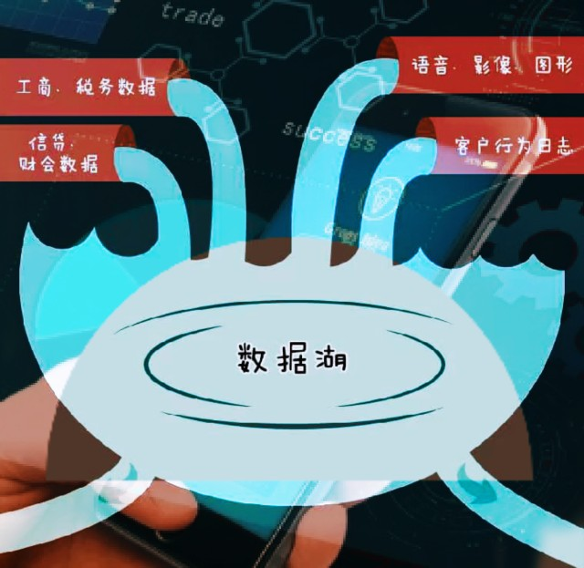
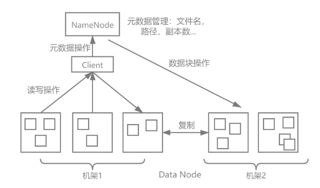
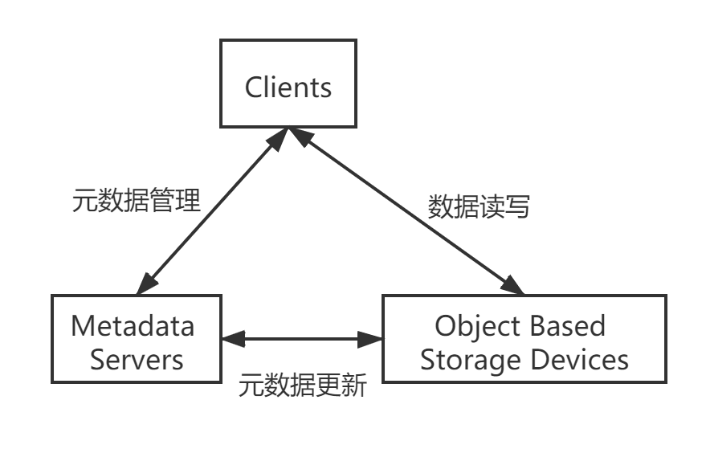
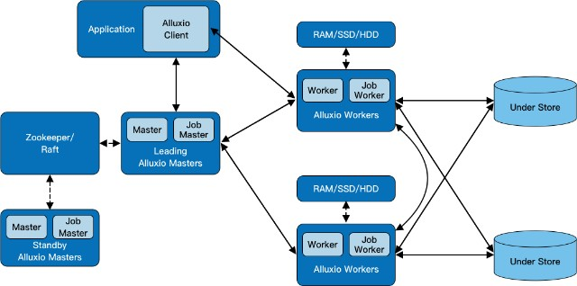
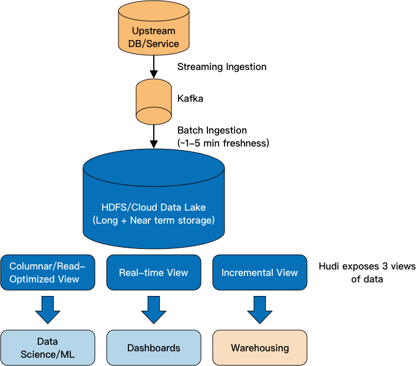
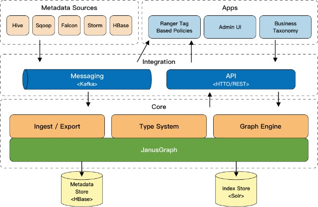
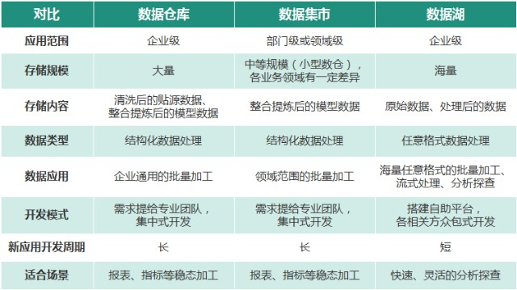
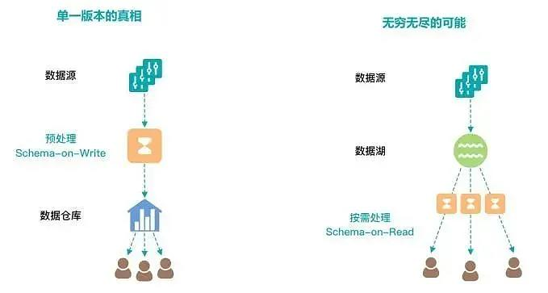
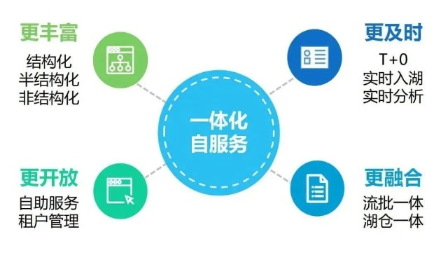
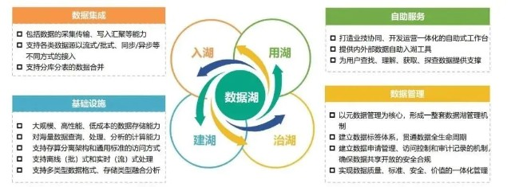

随着互联网的加速发展和移动互联网的快速兴起，数据采集更方便、数据种类更丰富，行为轨迹、语音视频等非结构化数据爆发式增长，数据规模进一步扩大。在新形势下，传统的数据库、数据仓库等处理技术无法适应快速响应、实时分析的数据需求，难以处理日志、语音等非结构化数据，企业迫切需要一个新型大数据解决方案——“数据湖”应运而生。

### 1. 数据湖的起源

如果把数据比作大自然中的水，数据湖就是汇聚源流的湖泊。

诞生之初，数据湖通常被定位为各类原始数据的集中存储库。在数据内容方面，既包括业务系统数据的原始副本，也包括用于报告、分析和机器学习等任务的加工后数据；在数据格式方面，既包括来自关系数据库的结构化数据，也包括半结构化数据（XML、JSON）、非结构化数据（图像、音视频、文档）等。

随着技术的不断发展和应用的不断深入，人们逐渐发现数据湖仅存储不管理会带来一系列问题。湖内各类数据又多又杂难以使用，最终会退化为“数据沼泽”，存储其中的数据也失去价值。因此，数据湖必须精细管控、有序开放，不仅要支持海量异构数据的集中存储，还要能支持海量数据的分析处理，实现存得下、管得好、用得上。

数据湖优势如图所示。

时至今日，数据湖已经发展为涵盖大数据存算、治理、安全、应用的平台级一揽子解决方案，通常具备多源异构数据的采集能力、强大的数据存储和计算能力、完善的数据管理与服务能力，可以满足新形势下灵活多样的数据需求。

### 2. 数据湖的关键技术

为实现海量多源异构数据集中存储，提升存储计算资源集约化管理水平，支持存储计算能力快速交付，数据湖需要包括多种技术能力，总结归纳现有企业和开源数据湖的实践情况，数据湖的关键技术主要包括：

#### 2.1 异构存储引擎

数据湖需要容纳海量各种类型的数据，单一存储引擎很难满足所有的要求。

分布式文件存储HDFS虽然在结构化数据存储领域表现优异，但是由于扩容和元数据管理困难，面对海量小文件的半结构化和非结构化数据的存储和处理需求难以满足。HDFS存储原理如图2所示。

而对象存储可以满足企业对非结构化数据的存储需求，扁平化的数据结构允许存储容量从传统的SAN、NAS的TB级扩展到PB甚至EB级，同时管理数十到百亿个存储对象。

因此目前应用最广泛的数据湖存储引擎是将分布式文件存储与对象存储结合使用，综合数据格式特点和生命周期规划存储区域，低成本、易维护地实现海量数据的集中存储。

#### 2.2 统一存储视图

为了适应数据量的爆炸式增长和数据类型的不断丰富，数据湖存储底座通常由多种存储引擎构成。当存储引擎发生变化或数据在不同存储引擎之间流动时，应用程序开发人员往往需要开发多种数据访问方式并随之频繁调整，面临着巨大的挑战。

因此，为了便于应用程序访问数据，数据湖使用数据编排技术搭建上层计算框架和底层存储引擎的桥梁。例如加州大学伯克利分校开源的Alluxio项目，为不同存储引擎中的数据构建统一存储视图，向上层应用程序提供通用的客户端api和全局命名空间；同时，它还具备缓存功能，支持热数据的快速访问。这类技术使得开发人员只需将重点放在数据应用逻辑上，而不需要关注数据保存在数据湖何处或存储的特性如何。

Alluxio工作流程如图所示。

#### 2.3 增强存储管理

数据湖存储了海量原始数据文件，一方面数据定义规范的缺失会导致使用成本大幅增加；另一方面HDFS和对象存储对于数据的快速更新，都没有便捷的解决方案。以HDFS存储为例，HDFS文件一旦被写入就无法修改，只允许在文件尾继续追加数据，如果数据错误需要更新只能重新全量写一份，运维成本很高。因此，如何快速、一致地管理湖中存储的数据，成为亟待解决的问题。

Apache Iceberg、Apache Hudi、Delta Lake等项目将数据库事务能力引入大数据领域，重新定义数据和元数据的组织方式，在底层数据存储格式（如Parquet、ORC等）之上提供了一种更优的数据组织格式，进一步增强了数据湖的存储管理能力。这些新型数据组织格式支持索引、Schema预定义、ACID事务保证和小文件自动合并，能够便捷地实现湖内数据的快速更新、插入、删除和多版本管理。同时，一份数据可以同时拥有多种读取视图，能更好地支持对数据湖流批数据的使用需求。Apache Hudi工作流程如图5所示。

#### 2.4 元数据自动采集与血缘分析

数据湖的精细管理需要以元数据为核心。元数据是关于数据的数据，贯通从数据源到数据湖，记录了数据从产生到消费的全过程。元数据信息可以帮助数据湖开发人员和使用人员方便地查找并定位数据、理解和使用数据，是数据湖发挥价值的关键所在。

数据湖中的数据又多又杂，应尽量选用可以自动采集、智能分析的元数据工具。以开源的元数据工具Apache Atlas为例，它为Hadoop集群提供了包括数据分类、集中策略引擎、数据血缘、安全和生命周期管理在内的元数据治理核心能力，同时支持S3接口与对象存储交互。Apache Atlas包含一组可伸缩和可扩展的核心基础治理服务，能够方便地与各类大数据组件集成，自动监听并分析数据源变化情况，实时采集元数据基础信息和血缘管理，为数据湖提供统一高效的元数据采集和管理能力。Apache Atlas架构如图6所示。

### 3. 数据湖的优势

与传统的数据仓库相比，数据湖具备以下优势。数据湖与数据仓库、数据集市的对比见表。

#### 3.1 数据类型丰富

数据湖的存储底座通常采用对象存储或者对象存储与传统大数据存储（如HDFS等）结合的方式，可以兼容多种数据格式，方便存储结构化、非结构化和半结构化的数据，对象存储易于扩展的特性也方便支持数据量的快速增长。结构化数据、半结构化数据和非结构化数据对比如图7所示。

#### 3.2 数据模式灵活

传统的数据仓库通常面向稳定的数据需求建模，采用Schema on Write（写时定义）预先定义好数据格式，加载前进行清洗、转换等统一的预处理，向用户提供标准、规范、一致的数据服务，但数据模型建设完成后，Schema的修改和变更会非常繁琐。

而数据湖一般采用Schema on Read（读时定义）的数据模式，可直接加载原始文件，入湖前无需定义复杂的结构，用户使用时再自行定义数据格式并按需处理，服务方式更加灵活。数据湖、数据仓库工作模式对比如图8所示。

#### 3.3 数据时效提升

数据湖支持流批一体架构，能够兼顾流处理的及时性和批处理的可靠性。当前多种开源数据湖框架均可以实现流批一体，既可以摄取增量数据，提升数据加载速度，为实时场景需求提供支撑；也可以提取全量数据，进行全量的数据加工，提供稳定的数据服务。

### 4. 数据湖的应用场景

#### 4.1 丰富客户画像

数据湖集中了客户的照片、语音、文本、行为等各种结构和类型的数据，支持各种引擎对数据全方面的探查分析，将非结构化数据与结构化数据相融合，在现有的以结构化数据为主的客户分析视图中，补充非结构化数据特有的用户个性数据，全方位丰富客户画像，构建以“客户为中心”的全景视图。

#### 4.2 实时产品营销

通过埋点工具捕获客户在掌银、网银、小程序等各渠道的行为日志信息，实时传输到数据湖中，利用实时数据引擎，减少数据加工时间，缩短数据加工链路，第一时间完成场景分析，关联客户交易行为，挖掘客户业务需求场景，实现实时的产品推荐与精准营销。

#### 4.3 深挖客户需求

对银行现有客户群，开展进一步的用户需求挖掘，主动将银行服务与客户的潜在需求进行匹配，通过多种分析引擎，完成服务与客户的关联，实现服务主动找客户、主动服务客户的功能。例如，在数据湖中，结合银行现有服务场景，使用机器学习技术，对数据湖中存储的客户行驶证影像数据进行分析，获取客户的购车日期、车型档次等信息，精准定位客户车型续保时点，预测客户换车需求，为车险、购车分期等信用卡产品营销活动提供参考。

### 5. 行业数据湖建设情况

数据湖技术正处于蓬勃发展期，市面上各类开源和商业产品百花齐放，主要分为Hadoop数据湖和云原生数据湖两大体系，均以“存算分离”和“流批融合”等关键技术为支撑，向着“湖仓一体”的架构演进。国外包括亚马逊AWS数据湖、微软ADLS Gen2数据湖等，国内阿里、腾讯、华为、金山等互联网企业纷纷推出了数据湖产品，字节跳动、网易、快手等互联网公司在内部搭建了自己的企业数据湖。

金融同业近两年也在积极开展数据湖技术的研究，逐步落地并不断演化。工商银行已初步建成Hadoop数据湖，支持数据批量加工、实时分析和交互式分析，计划未来将数据湖迁移到云上，同步探索向“湖仓一体”的架构演化。建设银行正在开展数据湖建设，依托大数据云平台提供的各类基础能力，规划各类标准化数据服务。中信银行也启动了数据湖建设，基于Hadoop生态支撑离线数据存储加工、实时数据处理等各类场景。

### 6. 农行数据湖建设展望

农业银行选择在企业级大数据平台的基础上，围绕“采、建、管、用”四个关键环节进行数据湖建设。从源头上丰富数据种类，在建设中提升海量数据存储计算能力，在管理上加强数据资产线上化和规范化水平，在消费端通过租户管理、资源开放和自助服务，实现数据应用的快速构建。农业银行数据湖一体化与自服务建设如图所示。

现已通过立机制、建工具、落实施，实现了海量内外部数据的快速入湖，为全行各业务领域百余个应用场景提供数据支撑。同时正在积极开展数据湖新技术架构的建设落地，通过开源软件和国产商用产品融合的方式，完成了异构存储管理、元数据管理、计算引擎上云及实时数据处理等关键技术攻关和重点场景验证。数据湖全流程建设如图所示。

后续拟按照“试点落地，湖仓一体，全面上云”三步走的路线，持续推进数据湖建设。近期在数据湖新技术架构的基础上，上线各类新业务场景；中期打通数据湖与现有数仓，实现湖仓架构融合，并推进大数据与云计算的融合，进一步提升资源管理和服务能力；最终，建成云数据湖，实现集团数据一体化管理，形成行业领先的大数据基础架构，全面夯实企业级数据底座，为集团提供更丰富、更及时、更开放、更融合的数据支撑。