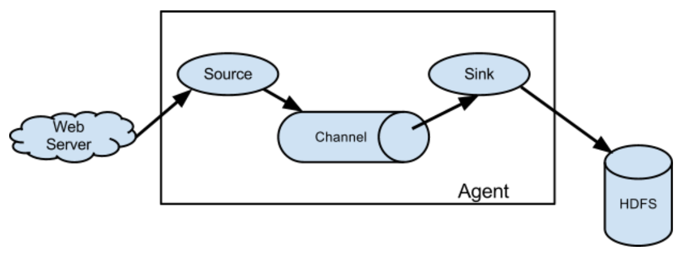

### 1. 概述

Flume是的一个分布式、高可用、高可靠的海量日志采集、聚合和传输的系统，支持在日志系统中定制各类数据发送方，用于收集数据，同时提供了对数据进行简单处理并写到各种数据接收方的能力。

Flume的设计原理是基于数据流的，能够将不同数据源的海量日志数据进行高效收集、聚合、移动，最后存储到一个中心化数据存储系统中。Flume能够做到近似实时的推送，并且可以满足数据量是持续且量级很大的情况。比如它可以收集社交网站日志，并将这些数量庞大的日志数据从网站服务器上汇集起来，存储到HDFS或HBase分布式数据库中。

Flume官网：[http://flume.apache.org/](http://flume.apache.org/)

Flume官方文档：[http://flume.apache.org/FlumeUserGuide.html](http://flume.apache.org/FlumeUserGuide.html)

### 2. 基本架构

首先在每个数据源上都会部署一个 flume agent ，这个agent就是用来采取数据的。

这个agent由3个组件组成：source，channel，sink。而在flume中，数据传输的基本单位是event。

1. source

    用于从数据源采集数据，并将数据传输在channel中。source支持多种数据源采集方式。比如监听端口采集数据，从文件中采集，从目录中采集，从http服务中采集等。

1. channel

    位于source和sink之间，是数据的一个暂存区域。一般情况下，从source流出数据的速率和sink流出的数据的速率会有所差异。所以需要一个空间暂存那些还没办法传输到sink进行处理的数据。所以channel类似于一个缓冲区，一个队列。

1. sink

    从channel获取数据，并将数据写到目标源。目标源支持多种，比如本地文件、hdfs、kafka、下一个flume agent的source等均可。

1. event

    传输单元，flume传输的基本单位，包括 headers和body两部分，header可以添加一些头部信息，body则是数据。

### 3. Flume特点

- 可靠性

    当节点出现故障时，日志能够被传送到其他节点上而不会丢失。Flume提供了三种级别的可靠性保障，从强到弱依次分别为：

    1. end-to-end（收到数据agent首先将event写到磁盘上，当数据传送成功后，再删除；如果数据发送失败，可以重新发送）；

    1. Store on failure（这也是scribe采用的策略，当数据接收方crash时，将数据写到本地，待恢复后，继续发送）；

    1. Best effort（数据发送到接收方后，不会进行确认）。

- 可扩展性

    Flume采用了三层架构，分别为agent，collector和storage，每一层均可以水平扩展所有agent和collector由master统一管理，这使得系统容易监控和维护，且master允许有多个（使用ZooKeeper进行管理和负载均衡），这就避免了单点故障问题。

- 可管理性

    1. 所有agent和colletor由master统一管理，这使得系统便于维护。

    1. 多master情况，Flume利用ZooKeeper和gossip，保证动态配置数据的一致性。

    1. 用户可以在master上查看各个数据源或者数据流执行情况，且可以对各个数据源配置和动态加载。

    1. Flume提供了web 和shell script command两种形式对数据流进行管理。

- 功能可扩展性

    1. 用户可以根据需要添加自己的agent，collector或者storage。

    1. 此外，Flume自带了很多组件，包括各种agent（file， syslog等），collector和storage（file，HDFS等）。

- 文档丰富，社区活跃

    Flume 是Apache下的一个顶级项目，已经成为 Hadoop 生态系统的标配，它的文档比较丰富，社区比较活跃，方便我们学习。

### 4. 其他问题

Flume 采集数据会丢失吗?

根据 Flume 的架构原理，Flume 是不可能丢失数据的，其内部有完善的事务机制，Source 到 Channel 是事务性的， Channel 到 Sink 是事务性的，因此这两个环节不会出现数据的丢失，唯一可能丢失数据的情况是 Channel 采用 memoryChannel， agent 宕机导致数据丢失，或者 Channel 存储数据已满，导致 Source 不再写入，未写入的数据丢失。Flume 不会丢失数据，但是有可能造成数据的重复，例如数据已经成功由 Sink 发出，但是没有接收到响应， Sink 会再次发送数据，此时可能会导致数据的重复。