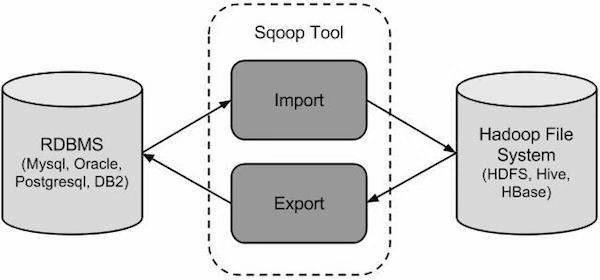
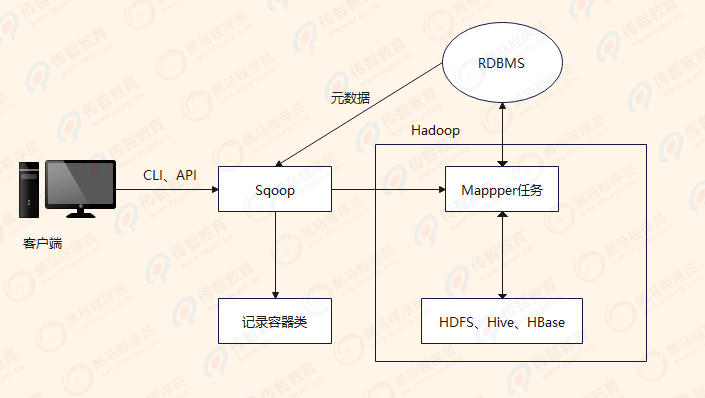

Sqoop（SQL-to-Hadoop）是Apache旗下的一款开源工具，该项目开始于2009年，最早是作为Hadoop的一个第三方模块存在，后来为了让使用者能够快速部署，也为了让开发人员能够更快速的迭代开发，并在2013年，独立成为Apache的一个顶级开源项目。

### 1. 概述

Apache Sqoop项目旨在协助RDBMS与Hadoop之间进行高效的大数据交流。用户可以在 Sqoop 的帮助下，轻松地把关系型数据库的数据导入到 Hadoop 与其相关的系统 (如HBase和Hive)中；同时也可以把数据从Hadoop系统里抽取并导出到关系型数据库里。

Sqoop是一个在结构化数据和Hadoop之间进行批量数据迁移的工具，结构化数据可以是MySQL、Oracle等RDBMS。Sqoop底层用MapReduce程序实现抽取、转换、加载，MapReduce天生的特性保证了并行化和高容错率，而且相比Kettle等传统ETL工具，任务跑在Hadoop集群上，减少了ETL服务器资源的使用情况。

在特定场景下，抽取过程会有很大的性能提升。如果要用Sqoop，必须正确安装并配置Hadoop，因依赖于本地的Hadoop环境启动MR程序；MySQL、Oracle等数据库的JDBC驱动也要放到Sqoop的lib目录下。

其功能如下图所示

### 2. Sqoop1和Sqoop2

目前Sqoop主要分为Sqoop1和Sqoop2两个版本，其中，版本号为1.4.x属于Sqoop1，而版本号为1.99.x的属于Sqoop2。这两个版本开发时的定位方向不同，体系结构具有很大的差异，因此它们之间互不兼容。

架构方面：

- Sqoop1：仅仅使用一个Sqoop客户端；

- Sqoop2：引入了Sqoop Server，对Connector实现了集中的管理，其访问方式也变得多样化了，其可以通过REST API、JAVA API、WEB UI以及CLI控制台方式进行访问。

安全性能方面：

- Sqoop1：经常用脚本的方式将HDFS中的数据导入到MySQL中，或者反过来将MySQL数据导入到HDFS中，其中在脚本里边都要显示指定MySQL数据库的用户名和密码的，安全性做的不是太完善。

- Sqoop2：如果是通过CLI方式访问的话，会有一个交互过程界面，输入的密码信息不被看到，同时Sqoop2引入基于角色的安全机制。

优缺点：

- Sqoop1

优点：架构部署简单；

缺点：命令行方式容易出错，格式紧耦合，无法支持所有数据类型，安全机制不够完善，例如密码暴漏，安装需要root权限，connector必须符合JDBC模型；

- Sqoop2

优点：多种交互方式，命令行，Web UI，REST API，Conncetor集中化管理，所有的链接安装在Sqoop Server上，完善权限管理机制，Connector规范化，仅仅负责数据的读写；

缺点：架构稍复杂，配置部署更繁琐。

### 3. 工作原理

Sqoop是传统关系数据库服务器与Hadoop间进行数据同步的工具，其底层利用MapReduce并行计算模型以批处理方式加快了数据传输速度，并且具有较好的容错性功能，工作流程如下图所示。

从上图中可以看出，通过客户端CLI(命令行界面)方式或Java API方式调用Sqoop工具，Sqoop可以将指令转换为对应的MapReduce作业(通常只涉及Map任务，每个Map任务从数据库中读取一片数据，这样多个Map任务实现并发地复制，可以快速地将整个数据复制到HDFS上)，然后将关系数据库和Hadoop中的数据进行相互转换，从而完成数据的迁移。

可以说，Sqoop是关系数据库与Hadoop 之间的数据桥梁，这个桥梁的重要组件是Sgoop连接器，它用于实现与各种关系数据库的连接，从而实现数据的导人和导出操作。

Sqoop连接器能够支持大多数常用的关系数据库，如MySQL、Oracle、DB2和SQL Server等，同时它还有一个通用的JDBC连接器，用于连接支持JDBC协议的数据库。

#### 3.1 导入原理

在导人数据之前，Sqoop使用JDBC检查导人的数据表，检索出表中的所有列以及列的SQL数据类型，并将这些SQL类型映射为Java数据类型，在转换后的MapReduce应用中使用这些对应的Java类型来保存字段的值，Sqoop的代码生成器使用这些信息来创建对应表的类，用于保存从表中抽取的记录。

#### 3.2 导出原理

在导出数据之前，Sqoop会根据数据库连接字符串来选择一个导出方法，对于大部分系统来说，Sqoop会选择JDBC。Sqoop会根据目标表的定义生成一个Java类，这个生成的类能够从文本中解析出记录数据，并能够向表中插人类型合适的值，然后启动一个MapReduce作业，从HDFS中读取源数据文件，使用生成的类解析出记录，并且执行选定的导出方法。