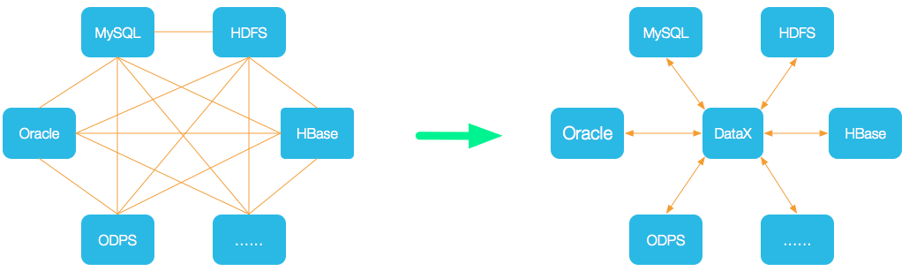
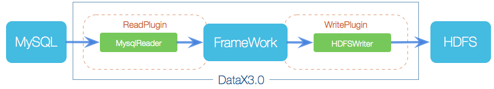
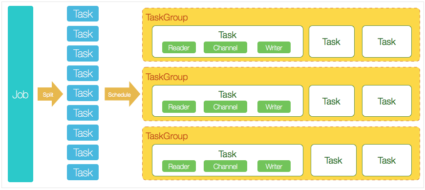

### 1. DataX是什么

DataX 是阿里云 DataWorks数据集成的开源版本，主要就是用于实现数据间的离线同步。 DataX 致力于实现包括关系型数据库（MySQL、Oracle 等）、HDFS、Hive、ODPS、HBase、FTP 等 各种异构数据源（即不同的数据库） 间稳定高效的数据同步功能。

为了 解决异构数据源同步问题，DataX 将复杂的网状同步链路变成了星型数据链路，DataX 作为中间传输载体负责连接各种数据源；

当需要接入一个新的数据源时，只需要将此数据源对接到 DataX，便能跟已有的数据源作为无缝数据同步。

### 2. DataX3.0框架设计

DataX 采用 Framework + Plugin 架构，将数据源读取和写入抽象称为 Reader/Writer 插件，纳入到整个同步框架中。

- Reader（采集模块）

负责采集数据源的数据，将数据发送给 Framework。

- Writer（写入模块）

负责不断向 Framework 中取数据，并将数据写入到目的端。

- Framework（中间商）

负责连接 Reader 和 Writer，作为两者的数据传输通道，并处理缓冲，流控，并发，数据转换等核心技术问题。

### 3. DataX3.0 核心架构

DataX 完成单个数据同步的作业，称为 Job，DataX 接收到一个 Job 后，将启动一个进程来完成整个作业同步过程。DataX Job 模块是单个作业的中枢管理节点，承担了数据清理、子任务切分、TaskGroup 管理等功能。

DataX Job 启动后，会根据不同源端的切分策略，将 Job 切分成多个小的 Task (子任务)，以便于并发执行。

接着 DataX Job 会调用 Scheduler 模块，根据配置的并发数量，将拆分成的 Task 重新组合，组装成 TaskGroup（任务组）

每一个 Task 都由 TaskGroup 负责启动，Task 启动后，会固定启动 Reader --> Channel --> Writer 线程来完成任务同步工作。

DataX 作业运行启动后，Job 会对 TaskGroup 进行监控操作，等待所有 TaskGroup 完成后，Job 便会成功退出（异常退出时 值非 0）

DataX 调度过程：

1. 首先 DataX Job 模块会根据分库分表切分成若干个 Task；

1. 然后根据用户配置并发数，来计算需要分配多少个 TaskGroup：计算过程：Task / Channel = TaskGroup，

1. 最后由 TaskGroup 根据分配好的并发数来运行 Task（任务）