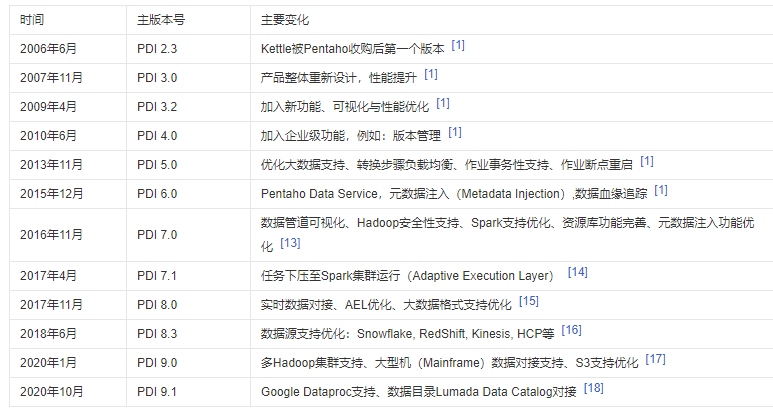

### 1. Kettle是什么

Kettle最早是一个开源的ETL工具，全称为KDE Extraction, Transportation, Transformation and Loading Environment。

ETL即数据抽取（Extract）、转换（Transform）、装载（Load）的过程，是构建数据仓库的重要环节。

数据仓库是面向主题的、集成的、稳定的且随时间不断变化的数据集合，用以支持经营管理中的决策制定过程。

数据仓库系统中有可能存在着大量的噪声数据,引起的主要原因有：滥用缩写词、惯用语、数据输入错误、重复记录、丢失值、拼写变化等。即便是一个设计和规划良好的数据库系统，如果其中存在着大量的噪声数据，那么这个系统也是没有任何意义的，因为“垃圾进，垃圾出”（garbage in, garbage out），系统根本就不可能为决策分析系统提供任何支持。

为了清除噪声数据，必须在数据库系统中进行数据清洗。

Kettle以Java开发，支持跨平台运行，其特性包括：支持100%无编码、拖拽方式开发ETL数据管道；可对接包括传统数据库、文件、大数据平台、接口、流数据等数据源；支持ETL数据管道加入机器学习算法。

Kettle（已经称之为Pentaho Data Integration）分为商业版与开源版，开源版的截止2021年1月的累计下载量达836万，其中19%来自中国。

### 2. Kettle的发展

在2006年，Pentaho公司收购了Kettle项目，原Kettle项目发起人Matt Casters加入了Pentaho团队，成为Pentaho套件数据集成架构师；从此，Kettle成为企业级数据集成及商业智能套件Pentaho的主要组成部分，Kettle亦重命名为Pentaho Data Integration  。

2015年，Pentaho公司被Hitachi Data Systems收购。

主要版本变化：

### 3. Kettle主要功能

Pentaho Data Integration作为一个端对端的数据集成平台，可以对多种数据源进行抽取(Extraction)、加载（Loading）、数据落湖（Data Lake Injection）、对数据进行各种清洗（Cleaning）、转换（Transformation）、混合（Blending），并支持多维联机分析处理（OLAP）和数据挖掘（Data mining）。部分特色功能包括：

#### 3.1 无代码拖拽式构建数据管道

PDI采用拖拽组件、连线、配置的方式来构建数据管道，透过超过200个不同的组件 ，用户可以在不编写一句代码就能轻松完成对数据源读取，对数据进行关联、过滤、格式转换、计算、统计、建模、挖掘、输出到不同的数据目标。极大程度地降低开发技术门槛和有效减低开发和维护成本。

#### 3.2 多数据源对接

关系型数据库支持类型包括：AS/400, DB2, Google BigQuery, Greenplum, Hive, Impala, MS SQL Server, MySQL, Oracle, PostgreSQL, SAP, Snowflake, SparkSQL, Sybase, Teradata, Vertica等 [7]  。大数据源支持包括：Avro, Cassanddra, HBase, HDFS, MongoDB, ORC, Parquet, Splunk等。文件格式支持包括：CSV, TXT, JSON, Excel, XML等。流数据支持包括：AMPQ, JMS, Kafka, Kinesis, MQTT, 其他数据源对接包括：HL7, S3, SAS, Salesforce, HCP, REST等。

#### 3.3 数据管道可视化

PDI支持用户在数据管道任何一个步骤对当前数据进行查看（Examine）,并可以在线以表格和图表（例如：柱状图、饼图等）输出步骤的数据，甚至可以支持不落地直接把任何一个步骤的数据以JDBC的方式提供给第三方应用访问 。

#### 3.4 板化开发数据管道

在数据抽取的过程中，ETL工程师通常要从众多不同的数据源把数据抽取到数仓的ODS层，或者到Hadoop的HDFS，整个过程的数据转换逻辑比较简单，但往往因为数据源很多而导致大量低价值重复开发工作，为了有效节省开发的时间和成本，Pentaho Data Integration提供了一个叫MDI的功能，MDI全称是Metadata Injection元数据注入，用户可以透过MDI把数据转换模板化，然后把像数据表名、文件路径、分隔符、字符集等等这些变量放在一个表或者文件里，然后利用MDI把这些变量注入数据转换模板，Pentaho Data Integration就能够自动生成所需要的数据转换了 [9]  。这个功能为很多客户节省了大量的开发时间。

#### 3.5 可视化计划任务

Pentaho Data Integration提供可视化方式配置任务计划（Schedule）,用户可透过Spoon或网页端的Pentaho User Console来配置和维护任务具体的执行时间、间隔、所使用的参数值、以及具体运行的服务器节点。用户亦可以透过Spoon或Pentaho User Console查看任务计划列表 [10]  ；当然，用户也可以透过Spoon或Pentaho User Console对任务执行情况进行实时监控。

#### 3.6 深度Hadoop支持

Pentaho Data Integration针对Hadoop主流厂家预置专用的对接插件，支持的Hadoop版本包括Cloudera, Hortonworks, AWS EMR, Google Dataproc等，用户除了可以透过插件轻松对接Hadoop集群的数据源（HDFS, Hive, HBase, Impala等）Pentaho还提供与Kerberos、Sentry和Ranger等Hadoop企业级安全机制对接，以满足企业安全要求；另外，Pentaho Data Integration的Pentaho MapReduce提供用户以无编码方式定义MapReduce任务；同时，用户亦可以在作业中执行Sqoop、Pig、MapReduce、Oozie和Spark任务。

#### 3.7 数据任务下压Spark集群

对于很多使用Hadoop的企业，往往因为数据量大，考虑到性能，会以脚本的方式来在集群里直接进行数据转换，我们一般叫这个做ELT（Extract-Load-Transform），就是先把数据加载到Hadoop，再在Hadoop集群里进行转换。为了让用户仍然能够透过Pentaho Data Integration简单的拖拽方式构建数据转换管道，同时又可以让数据在集群里进行In-Cluster转换，Pentaho提供了把数据转换任务下压到Spark来执行的AEL（Adaptive Execution Layer）功能，搭建好的数据管道会被AEL转成Spark任务来执行 [12]  ，这样数据就不需要离开集群，而是在集群里透过Spark强大的分布式处理能力来进行处理。

#### 3.8 数据挖掘与机器学习支持

最新版的Pentaho9.1预置了超过20种数据挖掘算法类的转换步骤，用户可以轻松把把机器学习集成到数据管道里，用来做数据模型训练和进行预测分析。预置算法包括：决策树、深度学习、线性回归、逻辑回归、Naive贝尔斯、随机森林等等，用户也可以利用Pentaho Data Integration作数据预备，然后把数据以dataframe的方式输入到Python或R中进行模型训练或预测。