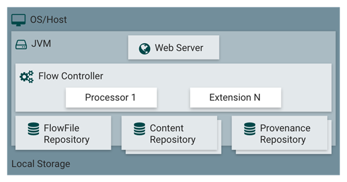
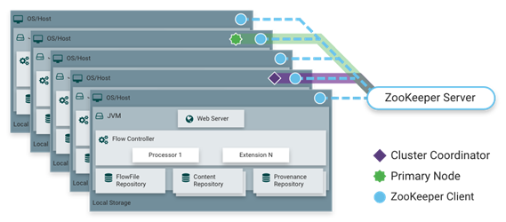

### 1. NiFi是什么

简单地说，Apache NiFi是为了自动化系统之间的数据流而构建的。虽然术语“数据流”在各种环境中使用，但我们在此处使用它来表示系统之间自动化和管理的信息流。这个问题空间一直存在，因为企业有多个系统，其中一些系统创建数据，一些系统消耗数据。已经讨论并广泛阐述了出现的问题和解决方案模式。企业集成模式 中提供了一个全面且易于使用的表单。

NiFi的诞生，要致力于解决的问题：

1. 因为网络故障、磁盘故障、软件崩溃、人们犯错导致的系统错误。

1. 数据读写超出了自身系统的处理能力。

1. 获取的数据不具有规范性。

1. 数据结构的优先级变化很快，启用新流和更改现有流的速度必须非常快。

1. 数据结构化管理的可移植性与不同数据格式之间的依赖性。

### 2. 核心概念

NiFi的基本设计概念与基于流程的编程的主要思想密切相关。以下是一些主要的NiFi概念以及它们如何映射到FBP：

- Processor

FBP映射：Information Packet

描述：processor是各种处理插件执行器，我们可以从中选择一个或者一组进行执行。

- ProcessGroup

FBP映射：subnet

描述：ProcessGroup 是特定的一些processor，connnection的集合，这一组集合被定义成新的逻辑上的Processor,我们可以像普通的processor一样操作它。

- FlowFile

FBP映射：Information Packet

描述：flowfile是系统传输的对象，里面包含各种属性key/value对以及真正的数据content。

- FlowFile Prcessor

FBP映射：Black Box

描述：flowfile processor负责实际对数据流执行工作。

- Flow Controller

FBP映射：Scheduler

描述：flow controller负责各个processor组件调度，路由等工作。

- Connection

FBP映射：Bounded Buffer

描述：connection用来连接各个processor,编排processor流转网络。

### 3. NiFi架构原理

NiFi在主机操作系统上的JVM内执行。JVM上NiFi的主要组件如下：

1. Web Server

Web服务器的目的是托管NiFi基于HTTP的命令和控制API。

1. Flow Controller

流量控制器是操作的大脑。它为扩展程序提供运行的线程，并管理扩展程序何时接收要执行的资源的计划。

1. Extensions

在其他文献中描述了各种类型的NiFi扩展。这里的关键点是扩展在JVM中运行和执行。

1. FlowFile Repository

FlowFile存储库是NiFi跟踪其对流中当前活动的给定FlowFile的了解状态的地方。存储库的实现是可插入的。默认方法是位于指定磁盘分区上的持久性预写日志。

1. Content Repository

内容存储库是给定FlowFile的实际内容字节。存储库的实现是可插入的。默认方法是一种相当简单的机制，它将数据块存储在文件系统中。可以指定多个文件系统存储位置，以便获得不同的物理分区以减少任何单个卷上的争用。

1. Provenance Repository

Provenance Repository是存储所有出处事件数据的地方。存储库构造是可插入的，默认实现是使用一个或多个物理磁盘卷。在每个位置内，事件数据被索引并可搜索。

### 4. NiFi运行在集群

从NiFi 1.0版本开始，采用了Zero-Master Clustering范例。NiFi群集中的每个节点对数据执行相同的任务，但每个节点都在不同的数据集上运行。

Apache ZooKeeper选择单个节点作为集群协调器，ZooKeeper自动处理故障转移。

所有群集节点都会向群集协调器报告心跳和状态信息。群集协调器负责断开和连接节点。此外，每个群集都有一个主节点，也由ZooKeeper选举。作为DataFlow管理器，您可以通过任何节点的用户界面（UI）与NiFi群集进行交互。您所做的任何更改都将复制到群集中的所有节点，从而允许多个入口点。

1. 对于IO

可以预期的吞吐量或延迟会有很大差异，具体取决于系统的配置方式。鉴于大多数主要NiFi子系统都有可插拔的方法，性能取决于实施。

但是，对于具体且广泛适用的内容，请考虑开箱即用的默认实现。

这些都是持久的保证交付，并使用本地磁盘这样做。因此保守一点，假设典型服务器中的适度磁盘或RAID卷大约每秒50 MB读/写速率。

然后，对于大类数据流的NiFi应该能够有效地达到每秒100 MB或更高的吞吐量。这是因为预期每个物理分区和添加到NiFi的内容存储库都会出现线性增长。

这将在FlowFile存储库和originance存储库的某个点上出现瓶颈。我们计划提供一个基准测试和性能测试模板，以包含在构建中，允许用户轻松测试他们的系统并确定瓶颈在哪里，以及他们可能成为一个因素。此模板还应使系统管理员可以轻松进行更改并验证其影响。

1. 对于CPU

流控制器充当引擎，指示特定处理器何时被赋予执行线程。编写处理器以在执行任务后立即返回线程。可以为Flow Controller提供一个配置值，指示它维护的各个线程池的可用线程。

理想的线程数取决于主机系统资源的核心数量，系统是否正在运行其他服务，以及流程中处理的性质。对于典型的IO大流量，可以使许多线程可用。

1. 对于RAM

NiFi存在于JVM中，因此仅限于JVM提供的内存空间。JVM垃圾收集成为限制总实际堆大小以及优化应用程序运行时间的一个非常重要的因素。定期阅读相同内容时，NiFi作业可能是I / O密集型的。配置足够大的磁盘以优化性能。