### 1. OLAP和OLTP的区别

OLTP（On-Line Transaction Processing）联机事务处理，它使分析人员能够迅速、一致、交互地从各个方面观察信息，以达到深入理解数据的目的。它具有FASMI(Fast Analysis of Shared Multidimensional Information)，即共享多维信息的快速分析的特征。主要应用是传统关系型数据库。OLTP系统强调的是内存效率，实时性比较高。 Mysql、Oracle、Redis、Hbase。

OLAP（On-Line Analytical Processing）联机分析处理，也称为面向交易的处理过程，其基本特征是前台接收的用户数据可以立即传送到计算中心进行处理，并在很短的时间内给出处理结果，是对用户操作快速响应的方式之一。应用在数据仓库，使用对象是决策者。OLAP系统强调的是数据分析，响应速度要求没那么高。目前市面上主流的开源OLAP引擎包含不限于：Hive、Presto、Kylin、Impala、Sparksql、Druid、Greenplum等。

OLAP领域，百家争鸣: Presto，Druid ，Impala，SparkSQL，AnalyticDB，(Hbase)Phoenix，kudu， Kylin，Greenplum，Clickhouse, Hawq, Drill，ES等。

### 2. OLAP分类

- 按存储器的数据存储格式划分：

1. MOLAP（Multi-dimensional OLAP）（多维在线分析）：用空间换时间，基于多维数组的存储模型，也是OLAP最初的形态，特点是对数据进行预计算，以空间换效率，明细和聚合数据都保存在cube中。但生成cube需要大量时间和空间。MOLAP可选Kylin、Druid，

1. ROLAP（Relational OLAP）（关系型在线分析）：充分利用所有资源快速计算 ，完全基于关系模型进行存储数据，不需要预计算，按需即时查询。明细和汇总数据都保存在关系型数据库事实表中。ROLAP可选Presto、impala等，ClickHouse则是ROLAP的佼佼者。

1. HOLAP（Hybrid OLAP）：混合模型，细节数据以ROLAP存放，聚合数据以MOLAP存放。这种方式相对灵活，且更加高效。可按企业业务场景和数据粒度进行取舍，没有最好，只有最适合。

- 按照查询类型划分：

1. 即席查询：通过手写sql完成一些临时的数据分析需求，这类sql形式多变、逻辑复杂，对查询时间没有严格要求

1. 固化查询：指的是一些固化下来的取数、看数需求，通过数据产品的形式提供给用户，从而提高数据分析和运营的效率。这类的sql固定模式，对响应时间有较高要求。

- 按照架构实现划分，主流的OLAP引擎主要有下面三点：

1. MPP架构系统(Presto/Impala/SparkSQL/Greenplum/Drill等)。这种架构主要还是从查询引擎入手，使用分布式查询引擎，而不是使用hive+mapreduce架构，提高查询效率。

1. 搜索引擎架构的系统(es，solr等)，在入库时将数据转换为倒排索引，采用Scatter-Gather计算模型，牺牲了灵活性换取很好的性能，在搜索类查询上能做到亚秒级响应。但是对于扫描聚合为主的查询，随着处理数据量的增加，响应时间也会退化到分钟级。

1. 预计算系统（Druid/Kylin等）则在入库时对数据进行预聚合，进一步牺牲灵活性换取性能，以实现对超大数据集的秒级响应。

- 大数据查询目前来讲可以大体分为三类：

1. 基于hbase预聚合的，比如Opentsdb,Kylin,Druid等,需要指定预聚合的指标，在数据接入的时候根据指定的指标进行聚合运算，适合相对固定的业务报表类需求，只需要统计少量维度即可满足业务报表需求

1. 基于Parquet列式存储的，比如Presto, Drill，Impala等，基本是完全基于内存的并行计算，Parquet系能降低存储空间，提高IO效率，以离线处理为主，很难提高数据写的实时性，超大表的join支持可能不够好。spark sql也算类似，但它在内存不足时可以spill disk来支持超大数据查询和join

1. 基于lucene外部索引的，比如ElasticSearch和Solr,能够满足的的查询场景远多于传统的数据库存储，但对于日志、行为类时序数据，所有的搜索请求都也必须搜索所有的分片，另外，对于聚合分析场景的支持也是软肋

- 需要从以下三个方面考虑框架选型：

1. 数据存储和构建

1. 安装搭建

1. 开发成本

### 3. OLAP场景的关键特征

- 绝大多数是读请求

- 数据以相当大的批次(> 1000行)更新，而不是单行更新;或者根本没有更新。

- 已添加到数据库的数据不能修改。

- 对于读取，从数据库中提取相当多的行，但只提取列的一小部分。

- 宽表，即每个表包含着大量的列

- 查询相对较少(通常每台服务器每秒查询数百次或更少)

- 对于简单查询，允许延迟大约50毫秒

- 列中的数据相对较小：数字和短字符串(例如，每个URL 60个字节)

- 处理单个查询时需要高吞吐量(每台服务器每秒可达数十亿行)

- 事务不是必须的

- 对数据一致性要求低

- 每个查询有一个大表。除了他以外，其他的都很小。

- 查询结果明显小于源数据。换句话说，数据经过过滤或聚合，因此结果适合于单个服务器的RAM中

很容易可以看出，OLAP场景与其他通常业务场景(例如,OLTP或K/V)有很大的不同， 因此想要使用OLTP或Key-Value数据库去高效的处理分析查询场景，并不是非常完美的适用方案。例如，使用OLAP数据库去处理分析请求通常要优于使用MongoDB或Redis去处理分析请求。

### 4. 列式数据库更适合OLAP场景的原因

列式数据库更适合于OLAP场景(对于大多数查询而言，处理速度至少提高了100倍)，下面详细解释了原因(通过图片更有利于直观理解)：

- 行式

- 列式

看到差别了么？下面将详细介绍为什么会发生这种情况。

- 输入/输出

1. 针对分析类查询，通常只需要读取表的一小部分列。在列式数据库中你可以只读取你需要的数据。例如，如果只需要读取100列中的5列，这将帮助你最少减少20倍的I/O消耗。

1. 由于数据总是打包成批量读取的，所以压缩是非常容易的。同时数据按列分别存储这也更容易压缩。这进一步降低了I/O的体积。

1. 由于I/O的降低，这将帮助更多的数据被系统缓存。

例如，查询«统计每个广告平台的记录数量»需要读取«广告平台ID»这一列，它在未压缩的情况下需要1个字节进行存储。如果大部分流量不是来自广告平台，那么这一列至少可以以十倍的压缩率被压缩。当采用快速压缩算法，它的解压速度最少在十亿字节(未压缩数据)每秒。换句话说，这个查询可以在单个服务器上以每秒大约几十亿行的速度进行处理。这实际上是当前实现的速度。

### 5. 预计算

#### 5.1 Druid

Druid同kylin一样，是采用预计算的方式。主要解决的是对于大量的基于时序的数据进行聚合查询。数据可以实时摄入，进入到Druid后立即可查，同时数据是几乎是不可变。通常是基于时序的事实事件，事实发生后进入Druid，外部系统就可以对该事实进行查询。

Druid是一个用于大数据实时查询和分析的高容错、高性能开源分布式系统，用于解决如何在大规模数据集下进行快速的、交互式的查询和分析。

是一个实时处理时序数据的OLAP数据库，因为它的索引首先按照时间分片，查询的时候也是按照时间线去路由索引。

- 需要预计算，将数据存储在druid的Segment文件中，占用一部分存储资源

- 需要与现场确认是否能提供

- 对sql支持不友好，需要用他自己的方言书写

Druid架构：

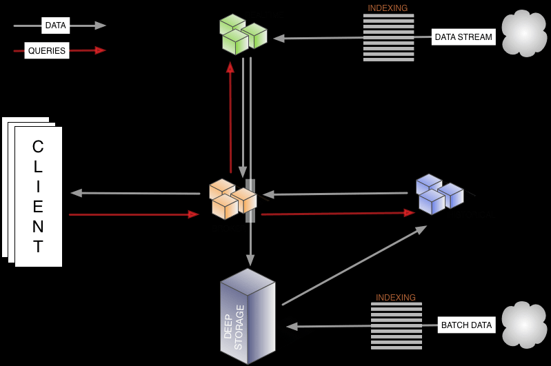

Druid 是一个分布式的支持实时分析的数据存储系统，具有以下几个特点

- 亚秒级 OLAP 查询，包括多维过滤、Ad-hoc 的属性分组、快速聚合数据等等。

- 实时的数据消费，真正做到数据摄入实时、查询结果实时。

- 高效的多租户能力，最高可以做到几千用户同时在线查询。

- 扩展性强，支持 PB 级数据、千亿级事件快速处理，支持每秒数千查询并发。

- 极高的高可用保障，支持滚动升级。

实时数据分析是 Apache Druid 最典型的使用场景。该场景涵盖的面很广，例如：

- 实时指标监控

- 推荐模型

- 广告平台

- 搜索模型

#### 5.2 Kylin

产品特性

1. Kylin是对hive中的数据进行预计算，利用hadoop的mapreduce框架实现

1. Kylin为Hadoop提供标准SQL支持大部分查询功能

1. 用户可以与Hadoop数据Hive表进行亚秒级交互，在同样的数据集上提供比Hive更好的性能

1. 用户能够在Kylin里为百亿以上数据集定义数据模型并构建立方体

1. 友好的web界面以管理，监控和使用立方体

1. 支持额外功能和特性的插件，与BI工具（如Tableau）集成ODBC、JDBC、RestAPI、还有自带的Zepplin插件，来访问Kylin服务

1. 与调度系统，ETL，监控等生命周期管理系统的整合

1. 通过预计算的方式缓存了所有 需要查询的的数据结果，需要大量的存储空间（原数据量的10+倍）

kylin是一种OLAP数据引擎，支持大数据生态圈的数据分析业务，主要是通过预计算的方式将用户设定的多维度数据立方体(cube)缓存起来，达到快速查询的目的。应用场景应该是针对复杂sql join后的数据缓存。

核心是Cube，cube是一种预计算技术，基本思路是预先对数据作多维索引，查询时只扫描索引而不访问原始数据从而提速。

这种OLAP引擎，一般包括以下几部分：

- 数据构建存储：cube构建，元数据信息

- sql解析执行：Query引擎(sql解释器)，routing模块(sql执行)

- 上层接口服务；jdbc/odbc接口，rest服务

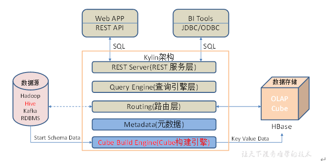

1. REST 服务层：应用程序开发的入口点

1. 查询引擎层:Cube准备就绪后，与系统中的其他组件进行交互，从而向用户返回对应的结果

1. 路由层：将解析的SQL生成的执行计划转换成Cube缓存的查询，cube通过预计算缓存在hbase中，这些操作可以在毫秒级完成，还有一些操作使用的原始查询，这部分延迟较高（麒麟高版本中已删除该层）

1. 元数据管理工具：kylin的元数据管理存储在hbase中

1. 任务引擎：处理所有离线任务：包括shell脚本、javaAPI以及MapReduce任务等等

应用思路：将hive中的数据按照查询列构建成cube，存储到hbase中，数据轨迹连接kylin的jdbc接口实现快速查询。

- 需要预计算，将数据构建成cube存储到hbase

- 需要与现场确认是否能提供

- 提供jdbc接口和rest服务

适用范围：数据仓库，用户行为分析，流量（日志）分析，自助分析平台，电商分析，广告效果分析，实时分析，数据服务平台等各种场景

### 6. MPP

#### 6.1 impala

impala是Cloudera开发开源的，Impala是Cloudera开发并开源的，能查询存储在HDFS和HBase中的数据。同Hive一样，也是一种SQL on Hadoop解决方案。但Impala抛弃了MapReduce,使用更类似于传统的MPP数据库技术来提高查询速度。

- impala可以直接查询hdfs或hbase上的数据，可以与现有的存储无缝对接。

- impala需要单独安装，公司内paas主推。需要与现场确认。

- impala提供jdbc接口和sql执行引擎，可以与现有系统集成

产品特性

1. 查询速度快。不同于hive底层执行使用的是MapReduce引擎，它仍然是一个批处理过程。impala中间结果不写入磁盘，即使及时通过网络以流的形式传递，大大降低的节点的IO开销。

1. 灵活性高。可以直接查询存储在HDFS上的原生数据，也可以查询经过优化设计而存储的数据，只需要数据的格式能够兼容MapReduce、hive、Pig等等。

1. 易整合。很容易和hadoop系统整合，并使用hadoop生态系统的资源和优势，不需要将数据迁移到特定的存储系统就能满足查询分析的要求。

1. 可伸缩性。可以很好的与一些BI应用系统协同工作，如Microstrategy、Tableau、Qlikview等。

1. 使用Impala比使用Hive能提高3-90的效率

#### 6.2 Presto

presto是Facebook开源的大数据查询引擎，为了解决hive查询慢产生。使用java编写，数据全部在内存中处理。

产品特性

- 本身并不存储数据，但是可以接入多种数据源，包括Hive、RDBMS（Mysql、Oracle、Tidb等）、Kafka、MongoDB、Redis等

- 完全支持ANSI SQL标准，用户可以直接使用 ANSI SQL 进行数据查询和计算

- 可以混合多个catalog进行join查询和计算，支持跨数据源的级联查询

- 基于PipeLine进行设计的，流水管道式数据处理，支持数据规模GB~PB，计算中拿出一部分放在内存、计算、抛出、再拿。

- SQL on Hadoop：弥补Hive的效率性能和灵活性的不足，Presto和Spark SQL、Impala有很多异曲同工之处。

- Presto支持在线数据查询，包括Hive, Cassandra

- 一条Presto查询可以将多个数据源的数据进行合并，可以跨越整个组织进行分析

- 完全基于内存的并行计算

- 流水线

- 本地化计算

- 动态编译执行计划

- 小心使用内存和数据结构

- 类BlinkDB的近似查询

- GC控制

Facebook开源的一个java写的分布式数据查询框架，原生集成了Hive、Hbase和关系型数据库，Presto背后所使用的执行模式与Hive有根本的不同，它没有使用MapReduce，大部分场景下比hive快一个数量级，其中的关键是所有的处理都在内存中完成。

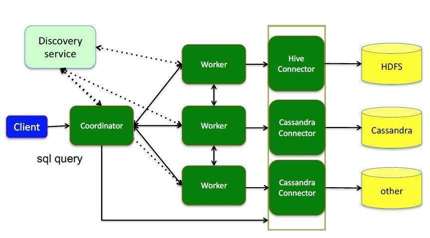

Presto应用场景：

1. Presto 支持 SQL 并提供了一个标准数据库的语法特性，但其不是一个通常意义上的关系数据库。

1. Presto 是一个可选的工具，可以用来查询 HDFS

1. 被设计为处理数据仓库和分析：分析数据，聚合大量的数据并产生报表，这些场景通常被定义为 OLAP

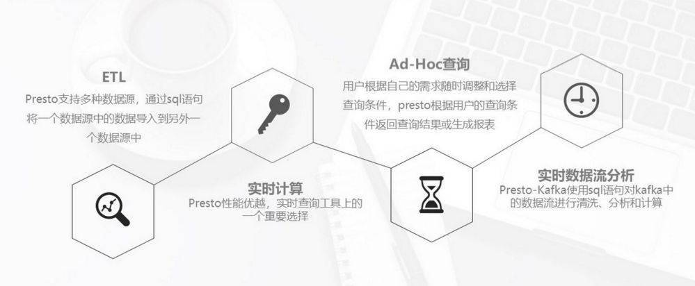

#### 6.3 Spark SQL

基于spark平台上的一个olap框架，本质上也是基于DAG的MPP， 基本思路是增加机器来并行计算，从而提高查询速度。

Spark SQL应该还是算做Batching Processing, 中间计算结果需要落地到磁盘，所以查询效率没有MPP架构的引擎（如Impala）高

#### 6.4 Clickhouse

Clickhouse是一个用于在线分析处理（OLAP）的列式数据库管理系统（DBMS）。

是由俄罗斯的Yandex公司为了Yandex Metrica网络分析服务而开发。它支持分析实时更新的数据，Clickhouse以高性能著称。

场景特征：

- 大多数是读请求

- 数据总是以相当大的批(> 1000 rows)进行写入

- 不修改已添加的数据

- 每次查询都从数据库中读取大量的行，但是同时又仅需要少量的列

- 宽表，即每个表包含着大量的列

- 较少的查询(通常每台服务器每秒数百个查询或更少)

- 对于简单查询，允许延迟大约50毫秒

- 列中的数据相对较小：数字和短字符串(例如，每个URL 60个字节)

- 处理单个查询时需要高吞吐量（每个服务器每秒高达数十亿行）

- 事务不是必须的

- 对数据一致性要求低

- 每一个查询除了一个大表外都很小

- 查询结果明显小于源数据，换句话说，数据被过滤或聚合后能够被盛放在单台服务器的内存中

clickhouse自身限制：

- 不支持真正的删除/更新支持 不支持事务

- 不支持二级索引

- 有限的SQL支持，join实现与众不同

- 不支持窗口功能

- 元数据管理需要人工干预维护

ClickHouse开源的出现让许多想做大数据并且想做大数据分析的很多公司和企业耳目一新。ClickHouse 正是以不依赖Hadoop 生态、安装和维护简单、查询速度快、可以支持SQL等特点在大数据分析领域披荆斩棘越走越远。

- Clickhouse：中国社区是我在组织，有SQL查询接口，主要面向非结构化的用户行为数据分析，也就是大家常见的用户事件流水，更像是一个用户数据集市，易观自主研发的秒算引擎和易观方舟也是类似的商业版产品，支持比较固定场景的SQL查询语句，可以支持数据流实时加载时时查询，这类产品是后面两个数据库都达不到的；

- Greenplum：老牌的MPP数据仓库，查询稳定性很强，SQL支持非常全面，具体可以参考我的文章《从0到N建立高性价比大数据平台》，主要面向结构化数据，几个Pb查询都没有问题，也可以支持HDFS外表（我也是这么注使用的），不过他是一个OLAP类型数据库，因此单条插入和QPS一般支持都不好。

#### 6.5 Greenplum

Greenplum是一种基于PostgreSQL的分布式数据库。其采用shared nothing架构（MPP），主机，操作系统，内存，存储都是自我控制的，不存在共享。也就是每个节点都是一个单独的数据库。节点之间的信息交互是通过节点互联网络实现。通过将数据分布到多个节点上来实现规模数据的存储，通过并行查询处理来提高查询性能。

这个就像是把小数据库组织起来，联合成一个大型数据库。将数据分片，存储在每个节点上。每个节点仅查询自己的数据。所得到的结果再经过主节点处理得到最终结果。通过增加节点数目达到系统线性扩展。

#### 6.6 Kudu

1. Cloudera带头开发的存储系统，其整体应用模式和HBase比较接近，即支持行级别的随机读写，并支持批量顺序检索功能。

1. Kudu管理的是类似关系型数据库的结构化的表。

1. Kudu底层核心代码使用C++开发，对外提供Java API接口。

适用范围

1. Kudu的定位是提供fast analytics on fast data，也就是在快速更新的数据上进行快速的查询。

1. 它定位OLAP和少量的OLTP工作流，如果有大量的random accesses，官方建议还是使用HBase最为合适。不建议频繁的删改数据

产品特性

1. Kudu的集群架构基本和HBase类似，采用主从结构，Master节点管理元数据，Tablet节点负责分片管理数据。

1. Kudu采用了类似log-structured存储系统的方式，增删改操作都放在内存中的buffer，然后才merge到持久化的列式存储中。Kudu还是用了WALs来对内存中的buffer进行灾备。

#### 6.7 总结

这几种框架各有优缺点，存在就是合理，如何选型个人看法如下：

- 从成熟度来讲：

kylin>spark sql>Druid>presto

- 从超大数据的查询效率来看：

Druid>kylin>presto>spark sql

- 从支持的数据源种类来讲：

presto>spark sql>kylin>Druid

### 7. 选型

#### 5.1 社区活跃度对比

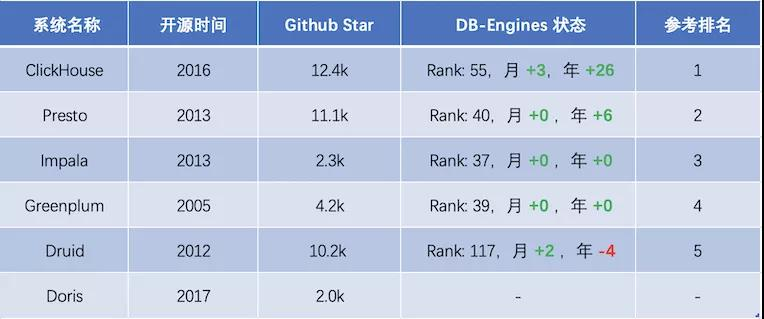

#### 5.2 即席查询对比

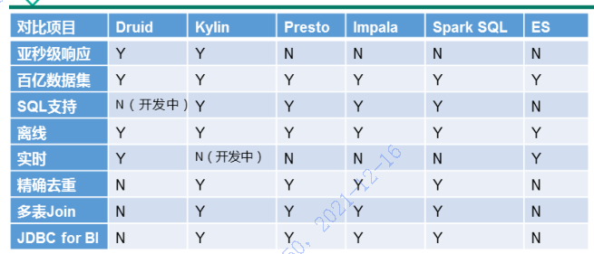

1. Druid：是一个实时处理时序数据的OLAP数据库，因为它的索引首先按照时间分片，查询的时候也是按照时间线去路由索引。

1. Kylin：核心是Cube，Cube是一种预计算技术，基本思路是预先对数据作多维索引，查询时只扫描索引而不访问原始数据从而提速。

1. Presto：它没有使用MapReduce，大部分场景下比Hive快一个数量级，其中的关键是所有的处理都在内存中完成。

1. Impala：基于内存运算，速度快，支持的数据源没有Presot多。

1. Spark SQL：基于Spark平台上的一个OLAP框架，基本思路是增加机器来并行计算，从而提高查询速度。

从差打数据的查询效率来看：

Druid > Kylin ＞ Presto ＞ Spark SQL

从支持的数据源种类来看：

Presto ＞ Spark SQL ＞ Kylin ＞ Druid

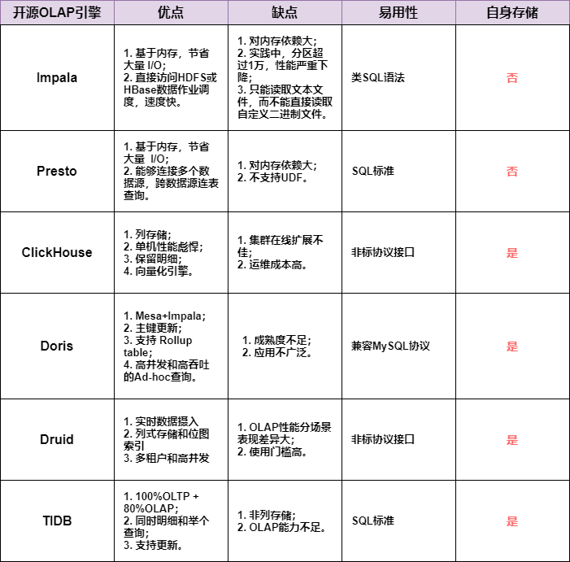

#### 5.3 查询对比

单表查询：clickhouse > impala > presto > sparksql > greeplum > hive

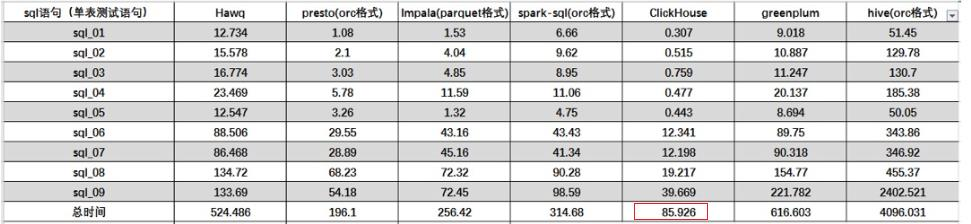

关联查询:  presto > impala > greeplum > clickhouse > sparksql > hive

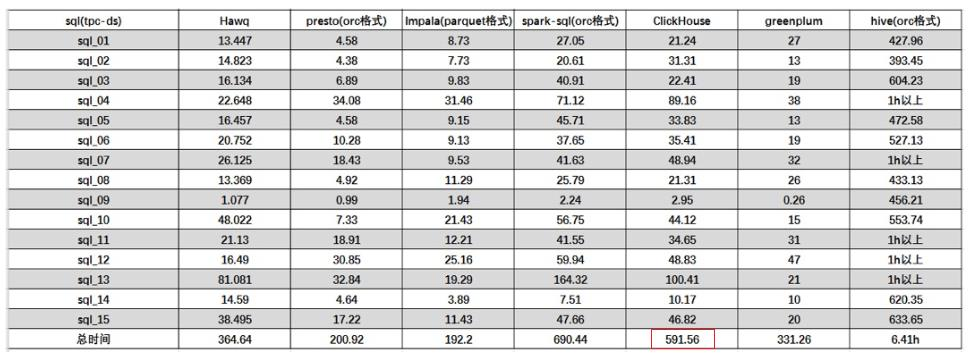

Greenplum、Kylin、ElasticSearch、ClickHouse对比：

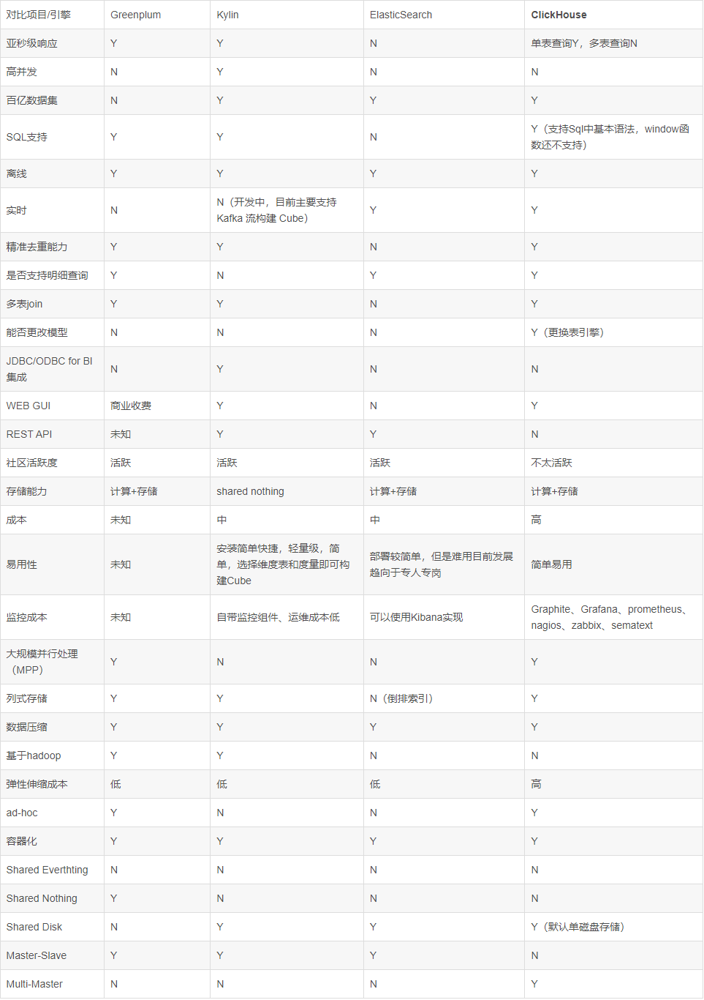

Hive、Impala、Presto、Sparksql、Clickhouse、Greenplum 对比：

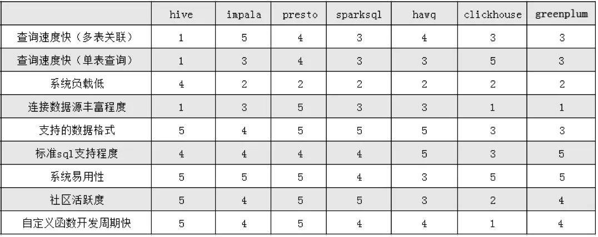