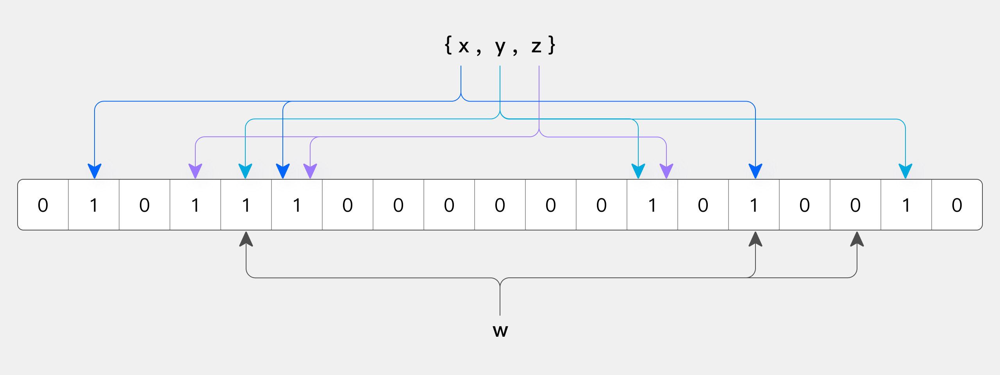

# 1 概述
## 1.1 表的创建
使用 `CREATE TABLE` 语句在 Doris 中进行表的创建。 还可以同时使用 `LIKE` 或 `AS` 条件语句复制另一个表的结构。

## 1.2 表的名称
在 Doris 中，表名默认区分大小写。 

可以在初始群集设置时配置 `lower_case_table_namest` 参数，使其不区分大小写。 

表名的默认最大长度为 64 字节，可以通过修改 `table_name_length_limit` 配置来变更。 不建议将此值设置过高。 

## 1.3 表的属性
在 `CREATE TABLE` 语句中，可以指定表的属性。比如，分区数量(buckets)、存储介质(storage_medium)、复制数量(replication_num)和冷热存储策略(storage_policy)。

也就是说，一旦创建了分区，表就会有自己的属性。 修改表的属性只会影响未来创建的分区，而不会影响到已创建的分区。

## 1.4 注意 
1. 数据模型无法更改，因此需要在创建表时选择合适的数据模型。 
2. 无法修改现有分区的分区数量。 
    可以通过更换分区来更改分区的数量。 
    可以在动态分区下修改尚未创建的分区的数量。
3. 添加或删除 VALUE 列是一项轻量级操作，几秒钟内即可完成。 
添加或删除 KEY 列或修改数据类型是一项重量级操作，完成时间取决于数据量。 
    在数据量较大的情况下，最好避免添加或删除 KEY 列或修改数据类型。 
4. 您可以使用分层存储将冷数据保存到硬盘或 S3 / HDFS。

# 2 数据类型

Apache Doris 支持标准 SQL 语法，使用 MySQL 网络连接协议，与 MySQL 语法协议高度兼容。 因此，在数据类型支持方面，Apache Doris 尽可能与 MySQL 相关数据类型保持一致。 

## 2.1 数字数据类型

| 类型名称 | 存储(字节) | 描述 |
| -- | -- | -- |
| BOOLEAN | 1 | 布尔数据类型，只存储两个值： 0 表示假，1 表示真。 |
| TINYINT | 1 | 整数值，取值范围为 -128 至 127。 |
| SMALLINT | 2 | 整数值，取值范围为 -32768 至 32767。 |
| INT | 4 | 整数值，取值范围为 -2147483648 至 2147483647。 |
| BIGINT | 8 | 整数值，取值范围为 -9223372036854775808 至 9223372036854775807。 |
| LARGEINT | 16 | 整数值，取值范围为 [-2^127 + 1 至 2^127 -1]。 |
| FLOAT | 4 | 单精度浮点数，取值范围为 [-3.4 10^38 至 3.4 10^38]。 |
| DOUBLE | 8 | 双精度浮点数，取值范围为 [-1.79 10^308 至 1.79 10^308]。 |
| DECIMAL | 4/8/16 | 精确定点数，由精度(总位数)和刻度(小数点右边的位数)定义。 格式为 DECIMAL(M[,D])，其中 M 是精度，D 是刻度。 M 的范围是 [1，38]，D 的范围是 [0，精度]。 存储要求： - 0 < 精度 <= 9 时为 4 字节，- 9 < 精度 <= 18 时为 8 字节，- 18 < 精度 <= 38 时为 16 字节。 |

## 2.2 日期时间数据类型

| 类型名称 | 存储(字节) | 描述 |
| -- | -- | -- |
| DATE | 16 | DATE 包含日历年、月、日的值，支持范围为['0000-01-01', '9999-12-31']。 默认打印格式： yyyy-MM-dd'。 |
| DATETIME | 16 | 日期和时间的组合格式： datetime([p])。 可选参数 P 代表时间精度，取值范围为 [0,6]，最多支持 6 位小数(微秒)。 不设置时，其值为 0。支持的范围为['0000-01-01 00:00:00 [.000000]', '9999-12-31 23:59:59 [.999999]'] 。 默认打印格式： 默认打印格式：'yyyy-MM-dd HH: mm: ss. SSSSSS '. |

## 2.3 字符串数据类型

| 类型名称 | 存储(字节) | 描述 |
| -- | -- | -- |
| CHAR | M | 固定长度字符串，参数 M 指定列长度(以字符为单位)。 M 的取值范围为 1 至 255。 |
| VARCHAR | 可变长度 | 长度可变的字符串，参数 M 指定字符串的最大长度(以字符为单位)。 M 的范围是 1 到 65533。 可变长度字符串以 UTF-8 编码存储。 英文字符占 1 个字节，中文字符占 3 个字节。 |
| STRING | 可变长度 | 长度可变的字符串，默认支持 1048576 字节(1 MB)，最大精度限制为 2147483643 字节(2 GB)。 字符串的大小可以通过 BE 设置 string_type_length_soft_limit_bytes 进行调整。 字符串类型只能用于值列，不能用于键列和分区列。 |

## 2.4 半结构化数据类型

| 类型名称 | 存储(字节) | 描述 |
| -- | -- | -- |
| ARRAY | 可变长度 | 由 T 类型元素组成的数组不能用作键列。 目前支持在具有重复和唯一模型的表中使用。 |
| MAP | 可变长度 | 由 K 和 V 类型元素组成的映射不能用作关键字列。 目前，使用重复和唯一模型的表支持这些映射。 |
| STRUCT | 可变长度 | 由多个字段组成的结构也可以理解为多个列的集合。 它不能用作键。 目前，STRUCT 只能在重复模型表中使用。 结构体中字段的名称和数量是固定的，并且始终为空。 |
| JSON | 可变长度 | 二进制 JSON 类型，以二进制 JSON 格式存储，通过 JSON 函数访问内部 JSON 字段。 默认最多支持 1048576 字节(1MB)，最大可调整为 2147483643 字节(2GB)。 该限制可通过 BE 配置参数 "jsonb_type_length_soft_limit_bytes "进行修改。 |
| VARIANT | 可变长度 | VARIANT 数据类型具有动态适应性，专为 JSON 等半结构化数据而设计。 它可以存储任何 JSON 对象，并自动将 JSON 字段分割成子列，以提高存储效率和查询性能。 长度限制和配置方法与 STRING 类型相同。 不过，VARIANT 类型只能用于值列，不能用于键列或分区列。 |

## 2.5 聚合数据类型

| 类型名称 | 存储(字节) | 描述 |
| -- | -- | -- |
| HLL | 可变长度 | HLL 是 HyperLogLog 的缩写，是一种模糊重复数据删除技术。 在处理大型数据集时，它的性能优于 Count Distinct。 HLL 的错误率通常在 1%左右，有时可能达到 2%。 HLL 不能用作键列，创建表时的聚合类型为 HLL_UNION。 用户无需指定长度或默认值，因为它会根据数据的聚合级别进行内部控制。 HLL 列只能通过 hll_union_agg、hll_raw_agg、hll_cardinality 和 hll_hash 等配套函数进行查询或使用。 |
| BITMAP | 可变长度 | BITMAP 类型可用于聚合表、唯一表或重复表。 - 在唯一表或重复表中使用时，BITMAP 必须用作非键列。 - 在聚合表中使用时，BITMAP 也必须作为非键列，并且在创建表时必须将聚合类型设置为 BITMAP_UNION。 用户无需指定长度或默认值，因为它是根据数据的聚合级别进行内部控制的。 BITMAP 列只能通过配套函数(如 bitmap_union_count、bitmap_union、bitmap_hash 和 bitmap_hash64)来查询或使用。 |
| QUANTILE_STATE | 可变长度 | 用于计算近似量化值的类型。 加载时，它会对具有不同值的相同键进行预聚合。 当值的数量不超过 2048 个时，它会详细记录所有数据。 当数值超过 2048 个时，它会采用 TDigest 算法对数据进行聚合(聚类)，并存储聚类后的中心点。 QUANTILE_STATE 不能用作键列，在创建表时应与聚合类型 QUANTILE_UNION 搭配使用。 用户无需指定长度或默认值，因为它是根据数据的聚合级别进行内部控制的。 QUANTILE_STATE 列只能通过 QUANTILE_PERCENT、QUANTILE_UNION 和 TO_QUANTILE_STATE 等配套函数进行查询或使用。 |
| AGG_STATE | 可变长度 | 聚合函数只能与状态/合并/联合函数组合器一起使用。 AGG_STATE 不能用作键列。 创建表时，需要同时声明聚合函数的签名。 用户无需指定长度或默认值。 实际数据存储大小取决于函数的实现。 |

## 2.6 IP 类型

| 类型名称 | 存储(字节) | 描述 |
| -- | -- | -- |
| IPv4 | 4 | 它与 ipv4_* 系列函数结合使用。 |
| IPv6 | 16 | 它与 ipv6_* 系列函数结合使用。 |

以使用 `SHOW DATA TYPES` 语句查看 Doris 支持的所有数据类型。

# 3 表索引
## 3.1 表索引概述

数据库索引用于加速查询。 为了加速不同的查询场景，Doris 支持各种丰富的索引。

### 3.1.1 索引类型和原则
从加速查询及其原理的角度来看，Doris 索引主要分为两类：点查询索引和跳数索引。 
* 点查询索引： 常用于加速点查询，其原理是通过索引找到满足 WHERE 条件的行，并直接读取这些行。 当满足条件的行数较少时，点查询索引非常有效。 Doris 的点查询索引包括前缀索引和倒排索引。 
    * 前缀索引： Doris 根据排序键有序存储数据，每 1024 行创建一个稀疏的前缀索引。 索引中的键是当前 1024 行第一行中已排序列的值。 如果查询涉及已排序列，系统将找到相关 1024 行组的第一行，并从该行开始扫描。 
    * 倒排索引： 对于具有倒排索引的列，系统会创建一个发布列表，将每个值映射到一组行 ID。 对于相等查询，首先会从发布列表中找到行 id 集，然后直接读取这些行的数据，避免逐行扫描。 倒排索引还能加速范围过滤和全文检索。 算法更加复杂，但基本原理相似。 (注意：以前的 BITMAP 索引已被功能更强大的倒置索引取代)。 
* 跳数索引： 常用于加速分析，其原理是通过索引确定不满足 WHERE 条件的数据块，并跳过这些数据块，只读取可能满足条件的数据块，然后逐行过滤，最终得到满足条件的行。 当满足条件的行数较多时，跳数索引会更加有效。 Doris 的跳数索引包括 ZoneMap 索引、BloomFilter 索引和 NGram BloomFilter 索引。 
    * ZoneMap 索引： 自动维护每个列的统计信息，记录每个数据文件(Segment)和数据块(Page)的最大值、最小值以及是否存在 NULL 值。 对于相等查询、范围查询和 IS NULL，它可以根据最大值、最小值和是否存在 NULL 值来确定数据文件和数据块是否包含满足条件的数据。 如果不能，Doris 会跳过读取相应的文件或数据块，从而减少 IO 并加速查询。 
    * BloomFilter 索引： 将索引列的值存储在 BloomFilter 数据结构中，能以极低的存储空间快速确定某个值是否在 BloomFilter 中。 对于相等查询，如果值不在 BloomFilter 中，则可跳过相应的数据文件或数据块，从而减少 IO 并加快查询速度。 
    * NGram BloomFilter 索引： 用于加速文本 LIKE 查询。 其原理与 BloomFilter 索引类似，但不是存储原始文本值，而是对文本执行 NGram 分词，并将每个分词存储在 BloomFilter 中。 对于 LIKE 查询，LIKE 模式也使用 NGram 进行分词。 如果 BloomFilter 中没有任何分词，则表示相应的数据文件或数据块不符合 LIKE 条件，可以跳过。 
    
在上述索引中，前缀索引和 ZoneMap 索引是由 Doris 自动维护的内置索引，无需用户管理。 倒排索引、BloomFilter 索引和 NGram BloomFilter 索引则需要用户根据实际情况手动创建和管理。
* 比较不同类型索引的特点

| 类型     | 索引     |   优势   |   局限性   |
| -------- | -------- | -------- | -------- |
| 点查询索引 | 前缀索引 | 内置索引，性能最佳 | 每个表只有一个前缀索引 |
| 点查询索引 | 倒排索引 | 支持分词和关键字匹配、在任意列上建立索引、多条件组合和加速更多功能 | 索引存储空间大，与原始数据类似 |
| 跳数索引 | ZoneMap 索引 | 内置索引，索引存储空间小 | 每个表只有一个前缀索引 |
| 跳数索引 | BloomFilter 索引 | 比 ZoneMap 更精确，索引空间适中 | 支持的查询类型很少，只支持等价查询，不支持其他查询(不等价、范围、LIKE、MATCH) |
| 跳数索引 | NGram BloomFilter 索引 | 支持 LIKE 加速，索引空间适中 | 支持的查询类型很少，仅支持 LIKE 加速 |
* 用于索引加速的运算符和函数列表

| 运算符和函数 | 前缀索引 | 倒排索引 | ZoneMap 索引 | BloomFilter 索引 | NGram BloomFilter 索引 |
| -------- | -------- | -------- | -------- | -------- | -------- |
| = | YES | YES | YES | YES | NO |
| != | YES | YES | NO | NO | NO |
| IN | YES | YES | YES | YES | NO |
| NOT IN | YES | YES | NO | NO | NO |
| >, >=, <, <=, BETWEEN | YES | YES | YES | NO | NO |
| IS NULL | YES | YES | YES | NO | NO |
| IS NOT NULL | YES | YES | NO | NO | NO |
| LIKE | NO | NO | NO | NO | YES |
| MATCH, MATCH_* | NO | YES | NO | NO | NO |
| array_contains | NO | YES | NO | NO | NO |
| array_overlaps | NO | YES | NO | NO | NO |
| is_ip_address_in_range | NO | YES | NO | NO | NO |

### 3.1.2 索引设计指南
数据库表索引的设计和优化与数据分布和查询密切相关，需要根据实际情况进行测试和优化。 虽然没有 "灵丹妙药"，但 Doris 一直在努力降低使用索引的难度。 用户可以遵循以下简单指南进行索引选择和测试。 
1. 指定最常用的过滤条件作为关键字，自动创建前缀索引，因为它的过滤效果最好。 不过，每个表只能创建一个前缀索引，所以应该用于最常用的过滤条件。 
2. 对于需要过滤加速的非关键字段，首选是创建倒排索引，因为它具有广泛的适用性和多条件组合。 第二种选择包括以下两种索引： 
    1. 如果需要进行字符串 LIKE 匹配，则添加一个 NGram BloomFilter 索引。 
    2. 如果索引存储空间至关重要，则用 BloomFilter 索引取代倒置索引。 
3. 如果性能不如预期，则通过 QueryProfile 分析索引过滤的数据量和消耗的时间。 有关具体情况，请参阅每个索引的详细文档。

## 3.2 排序键和前缀索引

### 3.2.1 索引原理
Doris 存储数据的结构类似于 SSTable(Sorted String Table)。 这种结构是一种有序数据结构，可以根据一个或多个指定列进行排序和存储。 在这种数据结构中，对全部或部分排序列进行条件查询的效率非常高。

在 Aggregate、Unique 和 Duplicate 数据模型中，底层数据存储分别根据 CREATE TABLE 语句中指定的 AGGREGATE KEY、UNIQUE KEY 和 DUPLICATE KEY 下的列进行排序。 这些键被称为排序键。 有了排序键，Doris 就可以在查询过程中通过指定排序列的条件，在不扫描整个表的情况下快速定位所需数据，从而降低搜索复杂度并加快查询速度。

根据排序键，Doris 引入了前缀索引。 前缀索引是一种稀疏索引。 表中的数据根据相应的行数形成一个逻辑数据块(Data Block)。 每个逻辑数据块在前缀索引表中存储一个索引条目，索引条目的长度不超过 36 字节。 条目内容是由数据块中第一行的排序列组成的前缀。 查找前缀索引表时，它有助于确定行数据所在逻辑数据块的起始行号。 由于前缀索引相对较小，因此可以完全缓存在内存中，从而可以快速定位数据块并显著提高查询效率。

数据块中某一行的前 36 个字节用作该行的前缀索引。 遇到 VARCHAR 类型时，前缀索引会被直接截断。 如果第一列是 VARCHAR，即使未达到 36 字节，也会被直接截断，后续列将不包含在前缀索引中。

### 3.2.2 使用场景
前缀索引可以加快相等查询和范围查询的速度。

由于表的 KEY 定义是唯一的，因此一个表只能有一种前缀索引。 对于使用其他列的查询，如果不能将前缀索引作为条件，则效率可能达不到要求。 有两种解决方案： 
* 在需要加速查询的列上创建倒排索引，因为一个表可以有多个倒排索引。 
* 对于 DUPLICATE 表，可以通过创建相应的强一致性物化视图并调整列顺序来间接实现多前缀索引。 有关详细信息，请参阅查询加速/物化视图。

### 3.2.3 语法
定义前缀索引没有特定的语法。 创建表时，表 KEY 的前 36 个字节会自动作为前缀索引。

### 3.2.4 使用示例
假设表的排序列如下，则前缀索引为：user_id(8 字节)+ age(4 字节)+ message(前缀 20 字节)。

| 列名 | 类型 |
| - | - |
| user_id | BIGINT | 
| age | INT | 
| message | VARCHAR(100) | 
| max_dwell_time | DATETIME | 
| min_dwell_time | DATETIME | 

假设表的排序列如下，则前缀索引为 user_name(20 字节)。 即使没有达到 36 字节，也会因为遇到 VARCHAR 而直接截断，并且不包括后续列。

| 列名 | 类型 |
| - | - |
| user_name | VARCHAR(20) | 
| age | INT | 
| message | VARCHAR(100) | 
| max_dwell_time | DATETIME | 
| min_dwell_time | DATETIME | 

当我们的查询条件是前缀索引的前缀时，可以大大加快查询速度。 例如，在第一个示例中，执行以下查询：

```sql
SELECT * FROM table WHERE user_id = 1829239 AND age = 20;
```

这种查询比下面的查询要有效得多：

```sql
SELECT * FROM table WHERE age = 20;
```

因此，在创建表时选择正确的列顺序可以大大提高查询效率。

## 3.3 倒排索引
### 3.3.1 索引原理
倒排索引是信息检索领域常用的一种索引技术。 它将文本划分为单个词，并构建一个词->文档 ID 索引，以便快速搜索确定哪些文档包含特定的词。

从 2.0.0 版开始，Doris 支持倒排索引，可用于文本类型的全文检索、普通数字和日期类型的相等和范围查询，以及从海量数据中快速筛选符合条件的行。

在 Doris 实现的倒排索引中，表中的每一行对应一个文档，每一列对应文档中的一个字段。 因此，使用倒排索引，可以快速查找包含特定关键字的行，从而加快 WHERE 子句的处理速度。

与 Doris 中的其他索引不同，倒排索引在存储层使用独立文件，与数据文件一一对应，但物理存储是独立的。 这种方法允许在不重写数据文件的情况下创建和删除索引，大大减少了处理开销。

### 3.3.2 使用场景
倒排索引的应用范围很广，可以加速等值、范围和全文检索(关键字匹配、短语匹配等)。 一个表可以有多个倒排索引，查询时可以任意组合多个倒排索引的条件。

下面简要介绍一下倒排索引的功能：
1. 加速字符串类型的全文搜索
* 支持关键字搜索，包括同时匹配多个关键字 `MATCH_ALL`，以及匹配任意一个关键字 `MATCH_ANY`。
* 支持短语查询 `MATCH_PHRASE` 
    * 支持指定词之间距离 
    * 支持短语 + 前缀 `MATCH_PHRASE_PREFIX` 
* 支持分词正则表达式查询 `MATCH_REGEXP` 
* 支持英文、中文和 Unicode 分词器
2. 加速普通等式和范围查询，覆盖并取代 BITMAP 索引的功能 
* 支持对字符串、数字和日期时间类型的 =, !=, >, >=, <, <= 进行快速过滤 
* 支持对字符串、数字和日期时间数组类型的 array_contains 进行快速过滤
3. 支持全面的逻辑组合 
* 不仅支持 AND 条件的加速，还支持 OR 和 NOT 条件 
* 支持 AND、OR、NOT 多个条件的任意逻辑组合
4. 灵活高效的索引管理 
* 支持在创建表时定义倒排索引 
* 支持在现有表中添加倒排索引，增量式索引构建无需重写表中的现有数据 
* 支持从现有表中删除倒排索引，无需重写表中的现有数据

使用倒排索引有一些限制：
1. 浮点类型 FLOAT 和 DOUBLE 存在精度问题，由于精度不准确，因此不支持倒排索引。 解决方法是使用精确的 DECIMAL 类型，它支持倒排索引。
2. 某些复杂数据类型尚不支持倒排索引，包括 MAP、STRUCT、JSON、HLL、BITMAP、QUANTILE_STATE 和 AGG_STATE。
3. 启用了 Merge-on-Write 功能的 DUPLICATE 和 UNIQUE 表模型支持在任何列上建立倒排索引。 但是，未启用 Merge-on-Write 的 AGGREGATE 和 UNIQUE 模型只支持在关键字列上建立倒排索引，非关键字列不能建立倒排索引。 这是因为这两种模型需要读取所有数据进行合并，因此无法使用索引进行预过滤。

要查看倒排索引对查询的影响，可以分析查询配置文件中的相关指标。
* InvertedIndexFilterTime：倒排索引消耗的时间
  * InvertedIndexSearcherOpenTime：打开倒排索引的时间
  * InvertedIndexSearcherSearchTime：内部查询倒排索引的时间
* RowsInvertedIndexFiltered：已被倒排索引过滤的行数，可与其他行数值进行比较，以分析 BloomFilter 索引的过滤效果。

### 3.3.3 语法
#### 3.3.3.1 创建表时定义倒排索引
在创建表语句中，COLUMN 定义之后是索引定义：
```sql
CREATE TABLE table_name
(
  column_name1 TYPE1,
  column_name2 TYPE2,
  column_name3 TYPE3,
  INDEX idx_name1(column_name1) USING INVERTED [PROPERTIES(...)] [COMMENT 'your comment'],
  INDEX idx_name2(column_name2) USING INVERTED [PROPERTIES(...)] [COMMENT 'your comment']
)
table_properties;
```

语法解释：
1. `idx_column_name(column_name)` 是必填项，`column_name` 是索引的列名，必须是之前定义的列，`idx_column_name` 是索引名，在表级别必须是唯一的，推荐命名约定：在列名前加上前缀 `idx_` 
2. 必须使用 `USING INVERTED` 来指定索引类型为倒排索引 
3. `PROPERTIES` 是可选项，用于指定倒排索引的其他属性，目前支持的属性有：
    * parser
        * 默认为未指定，即不进行分词 
        * `english`： 英文分词，适用于包含英文文本的栏目，使用空格和标点符号进行分词，性能高 
        * `chinese`： 中文分词，适用于主要包含中文文本的栏目，性能低于英文分词
        * `unicode`： Unicode 分词，适用于中英文混合和多语言混合文本。 它可以分词电子邮件前缀和后缀、IP 地址以及字符和数字混合字符串，还可以按字符分词中文。 
        
        可使用 TOKENIZE SQL 函数验证分词结果。
    * parser_mode
        指定分词模式，`parser = chinese` 当前支持的模式有： 
        * fine_grained：细粒度模式，倾向于生成更短、更多的单词，例如，"武汉市长江大桥 "将被分词为 "武汉'、'武汉市'、'市长'、'长江'、'长江大桥'、'大桥'"。 
        * cross_grained：粗粒度模式，倾向于生成较长、较少的单词，例如，"武汉市长江大桥 "将被分词为 "武汉市"、"长江大桥"。
        * 默认 cross_grained 
    * support_phrase
        指定索引是否支持 MATCH_PHRASE 短语查询加速 
        * true：支持，但索引需要更多存储空间  
        * false：不支持，存储效率更高，可使用 MATCH_ALL 查询多个关键词 
        * 默认为 false
        
        例如，下面的示例指定了中文分词、coarse-grained模式，并支持短语查询加速。
        ```sql
        INDEX idx_name(column_name) USING INVERTED PROPERTIES("parser" = "chinese", "parser_mode" = "coarse_grained", "support_phrase" = "true")
        ```
    * char_filter
        指定在分词前对文本进行预处理，通常是为了影响分词行为 
        char_filter_type：指定不同功能的 char_filter(目前仅支持 char_replace)  
        char_replace 将模式中的每个字符替换为替换字符中的一个字符。
        * char_filter_pattern：要替换的字符
        * char_filter_replacement：替换字符数组，可选，默认为空格字符
        
        例如，下面的示例将 `点` 和 `下划线` 替换为 `空格` ，从而将它们视为单词分隔符，影响标分词行为。
        ```sql
        INDEX idx_name(column_name) USING INVERTED PROPERTIES("parser" = "unicode", "char_filter_type" = "char_replace", "char_filter_pattern" = "._", "char_filter_replacement" = " ")
        ```
    * ignore_above
        指定非分词字符串索引的长度限制(未指定解析器) 
        * 长度超过 ignore_above 设置的字符串将不会被索引。 对于字符串数组，ignore_above 分别适用于每个数组元素，长度超过 ignore_above 的元素将不被索引。 
        * 默认为 256，单位为字节 
    * lower_case
        是否将分词转换为小写，以便进行大小写不敏感匹配 
        * true: 转换为小写 
        * false：不转换为小写 
        
        从 2.0.7 和 2.1.2 版开始，默认为 true，自动转换为小写。 早期版本的默认值为 false 。 
    * stopwords
        指定要使用的停止词列表，这将影响分词符号生成器的行为 
        * 默认的内置停用词列表包括 "is"、"the"、"a "等无意义的词。 在编写或查询时，分词符号生成器将忽略停用词列表中的单词。 
        * none： 使用空停止词表 

4. `COMMENT` 是可选项，用于指定索引注释

#### 3.3.3.2 为现有表添加倒排索引
1. 添加索引
    支持 `CREATE INDEX` 和 `ALTER TABLE ADD INDEX` 语法。 参数与创建表时定义索引时使用的参数相同。

    ```sql
    -- Syntax 1
    CREATE INDEX idx_name ON table_name(column_name) USING INVERTED [PROPERTIES(...)] [COMMENT 'your comment'];
    -- Syntax 2
    ALTER TABLE table_name ADD INDEX idx_name(column_name) USING INVERTED [PROPERTIES(...)] [COMMENT 'your comment'];
    ```
2. 构建索引 
    `CREATE / ADD INDEX` 操作仅添加索引定义。 在此操作后写入的新数据将生成倒排索引，但现有数据需要使用 `BUILD INDEX` 才能触发索引：

    ```sql
    -- Syntax 1, by default, builds the index for all partitions in the table
    BUILD INDEX index_name ON table_name;
    -- Syntax 2, you can specify partitions, one or more
    BUILD INDEX index_name ON table_name PARTITIONS(partition_name1, partition_name2);
    ```

    要检查 `BUILD INDEX` 的进度，请使用 `SHOW BUILD INDEX` ：

    ```sql
    SHOW BUILD INDEX [FROM db_name];
    -- Example 1, view the progress of all BUILD INDEX tasks
    SHOW BUILD INDEX;
    -- Example 2, view the progress of BUILD INDEX tasks for a specific table
    SHOW BUILD INDEX where TableName = "table1";
    ```

    要取消 `BUILD INDEX` ，请使用 `CANCEL BUILD INDEX` ：

    ```sql
    CANCEL BUILD INDEX ON table_name;
    CANCEL BUILD INDEX ON table_name (job_id1, job_id2, ...);
    ```

`BUILD INDEX` 会创建一个异步任务，由每个 BE 上的多个线程执行。 线程数可通过 BE 配置 `alter_index_worker_count` 设置，默认值为 3。 在 2.0.12 和 2.1.4 之前的版本中，`BUILD INDEX` 会不断重试，直到成功为止。 从这些版本开始，失败和超时机制防止了无休止的重试。 3.0(云模式)目前不支持该命令。
1. 如果某个分片的大多数副本都无法 `BUILD INDEX`，则整个 `BUILD INDEX` 操作都会失败。
2. 如果时间超过 `alter_table_timeout_second`，则 `BUILD INDEX` 操作超时。
用户可以多次触发 `BUILD INDEX`；已成功建立的索引将不会重建。

#### 3.3.3.3 从现有表中删除倒排索引

```sql
-- Syntax 1
DROP INDEX idx_name ON table_name;
-- Syntax 2
ALTER TABLE table_name DROP INDEX idx_name;
```

`DROP INDEX` 会删除索引定义，因此新数据将不再写入索引。 这将创建一个异步任务来执行索引删除，由每个 BE 上的多个线程执行。 可以使用 BE 参数 `alter_index_worker_count` 设置线程数，默认值为 3。

#### 3.3.3.4 使用倒排索引加速查询

```sql
-- 1. Full-text search keyword matching using MATCH_ANY and MATCH_ALL
SELECT * FROM table_name WHERE column_name MATCH_ANY | MATCH_ALL 'keyword1 ...';

-- 1.1 Rows in the content column containing keyword1
SELECT * FROM table_name WHERE content MATCH_ANY 'keyword1';

-- 1.2 Rows in the content column containing keyword1 or keyword2; you can add more keywords
SELECT * FROM table_name WHERE content MATCH_ANY 'keyword1 keyword2';

-- 1.3 Rows in the content column containing both keyword1 and keyword2; you can add more keywords
SELECT * FROM table_name WHERE content MATCH_ALL 'keyword1 keyword2';
```

```sql
-- 2. Full-text search phrase matching using MATCH_PHRASE

-- 2.1 Rows in the content column containing both keyword1 and keyword2, where keyword2 must immediately follow keyword1
-- 'keyword1 keyword2', 'wordx keyword1 keyword2', 'wordx keyword1 keyword2 wordy' all match because they contain 'keyword1 keyword2' with keyword2 immediately following keyword1
-- 'keyword1 wordx keyword2' does not match because there is a word between keyword1 and keyword2
-- 'keyword2 keyword1' does not match because the order is reversed
SELECT * FROM table_name WHERE content MATCH_PHRASE 'keyword1 keyword2';

-- 2.2 Rows in the content column containing both keyword1 and keyword2, with a slop (maximum word distance) of 3
-- 'keyword1 keyword2', 'keyword1 a keyword2', 'keyword1 a b c keyword2' all match because the slop is 0, 1, and 3 respectively, all within 3
-- 'keyword1 a b c d keyword2' does not match because the slop is 4, exceeding 3
-- 'keyword2 keyword1', 'keyword2 a keyword1', 'keyword2 a b c keyword1' also match because when slop > 0, the order of keyword1 and keyword2 is not required. To enforce the order, Doris provides a + sign after slop
SELECT * FROM table_name WHERE content MATCH_PHRASE 'keyword1 keyword2 ~3';
-- To enforce order, use a positive sign with slop; 'keyword1 a b c keyword2' matches, while 'keyword2 a b c keyword1' does not
SELECT * FROM table_name WHERE content MATCH_PHRASE 'keyword1 keyword2 ~3+';

-- 2.3 Prefix matching the last word keyword2, with a default limit of 50 prefixes (controlled by session variable inverted_index_max_expansions)
-- 'keyword1 keyword2abc' matches because keyword1 is identical and keyword2abc is a prefix of keyword2
-- 'keyword1 keyword2' also matches because keyword2 is a prefix of keyword2
-- 'keyword1 keyword3' does not match because keyword3 is not a prefix of keyword2
-- 'keyword1 keyword3abc' does not match because keyword3abc is not a prefix of keyword2
SELECT * FROM table_name WHERE content MATCH_PHRASE_PREFIX 'keyword1 keyword2';

-- 2.4 If only one word is provided, it defaults to a prefix query with a limit of 50 prefixes (controlled by session variable inverted_index_max_expansions)
SELECT * FROM table_name WHERE content MATCH_PHRASE_PREFIX 'keyword1';

-- 2.5 Regular expression matching on tokenized words, with a default limit of 50 matches (controlled by session variable inverted_index_max_expansions)
-- Similar to MATCH_PHRASE_PREFIX but with regex instead of prefix
SELECT * FROM table_name WHERE content MATCH_REGEXP 'key*';
```

```sql
-- 3. Normal equality, range, IN, and NOT IN queries using standard SQL syntax, for example:
SELECT * FROM table_name WHERE id = 123;
SELECT * FROM table_name WHERE ts > '2023-01-01 00:00:00';
SELECT * FROM table_name WHERE op_type IN ('add', 'delete');
```

#### 3.3.3.5 TOKENIZE 函数
要检查分词的实际效果或对一段文本进行分词，可以使用 `TOKENIZE` 函数进行验证。

`TOKENIZE` 函数的第一个参数是要分词的文本，第二个参数指定创建索引时使用的分词参数。

```sql
mysql> SELECT TOKENIZE('I love CHINA','"parser"="english"'); 
+------------------------------------------------+ 
| tokenize('I love CHINA', '"parser"="english"') | 
+------------------------------------------------+ 
| ["i", "love", "china"]                         | 
+------------------------------------------------+ 
1 row in set (0.02 sec)

mysql> SELECT TOKENIZE('I love CHINA 我爱我的祖国','"parser"="unicode"'); 
+-------------------------------------------------------------------+ 
| tokenize('I love CHINA 我爱我的祖国', '"parser"="unicode"')        | 
+-------------------------------------------------------------------+ 
| ["i", "love", "china", "我", "爱", "我", "的", "祖", "国"]         | 
+-------------------------------------------------------------------+ 
1 row in set (0.02 sec)
```

**使用示例**

演示使用 HackerNews 的 100 万条记录创建倒排索引、全文搜索和常规查询。 其中包括与无索引查询的简单性能比较。

**创建表**

```sql
CREATE DATABASE test_inverted_index;

USE test_inverted_index;

-- Create a table with an inverted index on the comment field
--   USING INVERTED specifies the index type as an inverted index
--   PROPERTIES("parser" = "english") specifies using the "english" tokenizer; other options include "chinese" for Chinese tokenization and "unicode" for mixed-language tokenization. If the "parser" parameter is not specified, no tokenization is applied.

CREATE TABLE hackernews_1m
(
    `id` BIGINT,
    `deleted` TINYINT,
    `type` String,
    `author` String,
    `timestamp` DateTimeV2,
    `comment` String,
    `dead` TINYINT,
    `parent` BIGINT,
    `poll` BIGINT,
    `children` Array<BIGINT>,
    `url` String,
    `score` INT,
    `title` String,
    `parts` Array<INT>,
    `descendants` INT,
    INDEX idx_comment (`comment`) USING INVERTED PROPERTIES("parser" = "english") COMMENT 'inverted index for comment'
)
DUPLICATE KEY(`id`)
DISTRIBUTED BY HASH(`id`) BUCKETS 10
PROPERTIES ("replication_num" = "1");
```

#### 3.3.3.6 数据导入
通过数据流加载导入数据

```shell
wget https://doris-build-1308700295.cos.ap-beijing.myqcloud.com/regression/index/hacknernews_1m.csv.gz

curl --location-trusted -u root: -H "compress_type:gz" -T hacknernews_1m.csv.gz http://127.0.0.1:8030/api/test_inverted_index/hackernews_1m/_stream_load
{
    "TxnId": 2,
    "Label": "a8a3e802-2329-49e8-912b-04c800a461a6",
    "TwoPhaseCommit": "false",
    "Status": "Success",
    "Message": "OK",
    "NumberTotalRows": 1000000,
    "NumberLoadedRows": 1000000,
    "NumberFilteredRows": 0,
    "NumberUnselectedRows": 0,
    "LoadBytes": 130618406,
    "LoadTimeMs": 8988,
    "BeginTxnTimeMs": 23,
    "StreamLoadPutTimeMs": 113,
    "ReadDataTimeMs": 4788,
    "WriteDataTimeMs": 8811,
    "CommitAndPublishTimeMs": 38
}
```

使用 SQL count() 确认数据导入成功

```sql
mysql> SELECT count() FROM hackernews_1m;
+---------+
| count() |
+---------+
| 1000000 |
+---------+
1 row in set (0.02 sec)
```

#### 3.3.3.7 查询
1. 全文搜索
* 使用 `LIKE` 对 `comment` 列中包含 "OLAP "的记录进行匹配和计数耗时 0.18 秒。

    ```sql
    mysql> SELECT count() FROM hackernews_1m WHERE comment LIKE '%OLAP%';
    +---------+
    | count() |
    +---------+
    |      34 |
    +---------+
    1 row in set (0.18 sec)
    ```
* 使用基于倒排索引的 `MATCH_ANY` 全文搜索来计算 `comment` 列中包含 "OLAP "的行，耗时 0.02 秒，速度提高了 9 倍。 在更大的数据集上，性能提升将更为显著。
结果数量上的差异是由于倒排索引通过将术语转换为小写字母等过程对术语进行了规范化处理，因此 `MATCH_ANY` 产生的结果比 `LIKE` 多。

    ```shell
    mysql> SELECT count() FROM hackernews_1m WHERE comment MATCH_ANY 'OLAP';
    +---------+
    | count() |
    +---------+
    |      35 |
    +---------+
    1 row in set (0.02 sec)
    ```
* 同样，在计算 "OLTP "的出现次数时，0.07 秒对 0.01 秒。 由于缓存的作用，`LIKE` 和 `MATCH_ANY` 的速度都有所提高，但倒排索引的速度仍然提高了 7 倍。

    ```sql
    mysql> SELECT count() FROM hackernews_1m WHERE comment LIKE '%OLTP%';
    +---------+
    | count() |
    +---------+
    |      48 |
    +---------+
    1 row in set (0.07 sec)

    mysql> SELECT count() FROM hackernews_1m WHERE comment MATCH_ANY 'OLTP';
    +---------+
    | count() |
    +---------+
    |      51 |
    +---------+
    1 row in set (0.01 sec)
    ```
* 计算同时出现 "OLAP "和 "OLTP "的行耗时 0.13s 对 0.01s，速度提高了 13 倍。
要要求多个术语同时出现(AND 关系)，请使用 `MATCH_ALL 'keyword1 keyword2 ...'` 。

    ```sql
    mysql> SELECT count() FROM hackernews_1m WHERE comment LIKE '%OLAP%' AND comment LIKE '%OLTP%';
    +---------+
    | count() |
    +---------+
    |      14 |
    +---------+
    1 row in set (0.13 sec)

    mysql> SELECT count() FROM hackernews_1m WHERE comment MATCH_ALL 'OLAP OLTP';
    +---------+
    | count() |
    +---------+
    |      15 |
    +---------+
    1 row in set (0.01 sec)
    ```
* 计算出现 "OLAP "或 "OLTP "的行耗时 0.12s 对 0.01s，速度提高了 12 倍。
要要求出现多个术语中的任意一个或多个(OR 关系)，请使用 `MATCH_ANY 'keyword1 keyword2 ...'` 。

    ```sql
    mysql> SELECT count() FROM hackernews_1m WHERE comment LIKE '%OLAP%' OR comment LIKE '%OLTP%';
    +---------+
    | count() |
    +---------+
    |      68 |
    +---------+
    1 row in set (0.12 sec)

    mysql> SELECT count() FROM hackernews_1m WHERE comment MATCH_ANY 'OLAP OLTP';
    +---------+
    | count() |
    +---------+
    |      71 |
    +---------+
    1 row in set (0.01 sec)
    ```
2. 标准相等和范围查询
* `DateTime` 类型列上的范围查询

    ```sql
    mysql> SELECT count() FROM hackernews_1m WHERE timestamp > '2007-08-23 04:17:00';
    +---------+
    | count() |
    +---------+
    |  999081 |
    +---------+
    1 row in set (0.03 sec)
    ```
* 为 `timestamp` 列添加倒排索引

    ```sql
    -- For date-time types, USING INVERTED does not require specifying a parser
    -- CREATE INDEX is one syntax for creating an index, another method will be shown later
    mysql> CREATE INDEX idx_timestamp ON hackernews_1m(timestamp) USING INVERTED;
    Query OK, 0 rows affected (0.03 sec)
    ```

    ```sql
    mysql> BUILD INDEX idx_timestamp ON hackernews_1m;
    Query OK, 0 rows affected (0.01 sec)
    ```
* 检查索引创建进度 从 `FinishTime` 和 `CreateTime` 之间的差值可以看出，在时间戳列上为 100 万行建立倒排索引只用了 1 秒钟。

    ```sql
    mysql> SHOW ALTER TABLE COLUMN;
    +-------+---------------+-------------------------+-------------------------+---------------+---------+---------------+---------------+---------------+----------+------+----------+---------+
    | JobId | TableName     | CreateTime              | FinishTime              | IndexName     | IndexId | OriginIndexId | SchemaVersion | TransactionId | State    | Msg  | Progress | Timeout |
    +-------+---------------+-------------------------+-------------------------+---------------+---------+---------------+---------------+---------------+----------+------+----------+---------+
    | 10030 | hackernews_1m | 2023-02-10 19:44:12.929 | 2023-02-10 19:44:13.938 | hackernews_1m | 10031   | 10008         | 1:1994690496  | 3             | FINISHED |      | NULL     | 2592000 |
    +-------+---------------+-------------------------+-------------------------+---------------+---------+---------------+---------------+---------------+----------+------+----------+---------+
    1 row in set (0.00 sec)
    ```

    ```sql
    -- If the table has no partitions, PartitionName defaults to TableName
    mysql> SHOW BUILD INDEX;
    +-------+---------------+---------------+----------------------------------------------------------+-------------------------+-------------------------+---------------+----------+------+----------+
    | JobId | TableName     | PartitionName | AlterInvertedIndexes                                     | CreateTime              | FinishTime              | TransactionId | State    | Msg  | Progress |
    +-------+---------------+---------------+----------------------------------------------------------+-------------------------+-------------------------+---------------+----------+------+----------+
    | 10191 | hackernews_1m | hackernews_1m | [ADD INDEX idx_timestamp (`timestamp`) USING INVERTED],  | 2023-06-26 15:32:33.894 | 2023-06-26 15:32:34.847 | 3             | FINISHED |      | NULL     |
    +-------+---------------+---------------+----------------------------------------------------------+-------------------------+-------------------------+---------------+----------+------+----------+
    1 row in set (0.04 sec)
    ```
* 创建索引后，范围查询将使用相同的查询语法。 Doris 会自动识别索引以进行优化。 不过，由于数据集较小，性能差异不大。

    ```sql
    mysql> SELECT count() FROM hackernews_1m WHERE timestamp > '2007-08-23 04:17:00';
    +---------+
    | count() |
    +---------+
    |  999081 |
    +---------+
    1 row in set (0.01 sec)
    ```
* 使用相等匹配查询对数字列的 `parent` 执行类似操作。

    ```sql
    mysql> SELECT count() FROM hackernews_1m WHERE parent = 11189;
    +---------+
    | count() |
    +---------+
    |       2 |
    +---------+
    1 row in set (0.01 sec)

    -- For numeric types, USING INVERTED does not require specifying a parser
    -- ALTER TABLE t ADD INDEX is the second syntax for creating an index
    mysql> ALTER TABLE hackernews_1m ADD INDEX idx_parent(parent) USING INVERTED;
    Query OK, 0 rows affected (0.01 sec)

    -- Execute BUILD INDEX to create the inverted index for existing data
    mysql> BUILD INDEX idx_parent ON hackernews_1m;
    Query OK, 0 rows affected (0.01 sec)

    mysql> SHOW ALTER TABLE COLUMN;
    +-------+---------------+-------------------------+-------------------------+---------------+---------+---------------+---------------+---------------+----------+------+----------+---------+
    | JobId | TableName     | CreateTime              | FinishTime              | IndexName     | IndexId | OriginIndexId | SchemaVersion | TransactionId | State    | Msg  | Progress | Timeout |
    +-------+---------------+-------------------------+-------------------------+---------------+---------+---------------+---------------+---------------+----------+------+----------+---------+
    | 10030 | hackernews_1m | 2023-02-10 19:44:12.929 | 2023-02-10 19:44:13.938 | hackernews_1m | 10031   | 10008         | 1:1994690496  | 3             | FINISHED |      | NULL     | 2592000 |
    | 10053 | hackernews_1m | 2023-02-10 19:49:32.893 | 2023-02-10 19:49:33.982 | hackernews_1m | 10054   | 10008         | 1:378856428   | 4             | FINISHED |      | NULL     | 2592000 |
    +-------+---------------+-------------------------+-------------------------+---------------+---------+---------------+---------------+---------------+----------+------+----------+---------+

    mysql> SHOW BUILD INDEX;
    +-------+---------------+---------------+----------------------------------------------------+-------------------------+-------------------------+---------------+----------+------+----------+
    | JobId | TableName     | PartitionName | AlterInvertedIndexes                               | CreateTime              | FinishTime              | TransactionId | State    | Msg  | Progress |
    +-------+---------------+---------------+----------------------------------------------------+-------------------------+-------------------------+---------------+----------+------+----------+
    | 11005 | hackernews_1m | hackernews_1m | [ADD INDEX idx_parent (`parent`) USING INVERTED],  | 2023-06-26 16:25:10.167 | 2023-06-26 16:25:10.838 | 1002          | FINISHED |      | NULL     |
    +-------+---------------+---------------+----------------------------------------------------+-------------------------+-------------------------+---------------+----------+------+----------+
    1 row in set (0.01 sec)

    mysql> SELECT count() FROM hackernews_1m WHERE parent = 11189;
    +---------+
    | count() |
    +---------+
    |       2 |
    +---------+
    1 row in set (0.01 sec)
    ```
* 为未分词的字符串列 `author` 创建倒排索引。 等式查询也可以利用该索引来加快速度。

    ```sql
    mysql> SELECT count() FROM hackernews_1m WHERE author = 'faster';
    +---------+
    | count() |
    +---------+
    |      20 |
    +---------+
    1 row in set (0.03 sec)

    -- Here, USING INVERTED is used without tokenizing the `author` column, treating it as a single term
    mysql> ALTER TABLE hackernews_1m ADD INDEX idx_author(author) USING INVERTED;
    Query OK, 0 rows affected (0.01 sec)

    -- Execute BUILD INDEX to add the inverted index for existing data
    mysql> BUILD INDEX idx_author ON hackernews_1m;
    Query OK, 0 rows affected (0.01 sec)
    ```
    
    为 100 万条作者记录创建增量索引仅需 1.5 秒。

    ```sql
    mysql> SHOW ALTER TABLE COLUMN;
    +-------+---------------+-------------------------+-------------------------+---------------+---------+---------------+---------------+---------------+----------+------+----------+---------+
    | JobId | TableName     | CreateTime              | FinishTime              | IndexName     | IndexId | OriginIndexId | SchemaVersion | TransactionId | State    | Msg  | Progress | Timeout |
    +-------+---------------+-------------------------+-------------------------+---------------+---------+---------------+---------------+---------------+----------+------+----------+---------+
    | 10030 | hackernews_1m | 2023-02-10 19:44:12.929 | 2023-02-10 19:44:13.938 | hackernews_1m | 10031   | 10008         | 1:1994690496  | 3             | FINISHED |      | NULL     | 2592000 |
    | 10053 | hackernews_1m | 2023-02-10 19:49:32.893 | 2023-02-10 19:49:33.982 | hackernews_1m | 10054   | 10008         | 1:378856428   | 4             | FINISHED |      | NULL     | 2592000 |
    | 10076 | hackernews_1m | 2023-02-10 19:54:20.046 | 2023-02-10 19:54:21.521 | hackernews_1m | 10077   | 10008         | 1:1335127701  | 5             | FINISHED |      | NULL     | 2592000 |
    +-------+---------------+-------------------------+-------------------------+---------------+---------+---------------+---------------+---------------+----------+------+----------+---------+
    ```

    ```sql
    mysql> SHOW BUILD INDEX ORDER BY CreateTime DESC LIMIT 1;
    +-------+---------------+---------------+----------------------------------------------------+-------------------------+-------------------------+---------------+----------+------+----------+
    | JobId | TableName     | PartitionName | AlterInvertedIndexes                               | CreateTime              | FinishTime              | TransactionId | State    | Msg  | Progress |
    +-------+---------------+---------------+----------------------------------------------------+-------------------------+-------------------------+---------------+----------+------+----------+
    | 13006 | hackernews_1m | hackernews_1m | [ADD INDEX idx_author (`author`) USING INVERTED],  | 2023-06-26 17:23:02.610 | 2023-06-26 17:23:03.755 | 3004          | FINISHED |      | NULL     |
    +-------+---------------+---------------+----------------------------------------------------+-------------------------+-------------------------+---------------+----------+------+----------+
    1 row in set (0.01 sec)
    ```

    创建索引后，字符串等价匹配的速度也明显加快。

    ```sql
    mysql> SELECT count() FROM hackernews_1m WHERE author = 'faster';
    +---------+
    | count() |
    +---------+
    |      20 |
    +---------+
    1 row in set (0.01 sec)
    ```

## 3.4 BloomFilter索引
### 3.4.1 索引原理
BloomFilter索引是一种基于BloomFilter的跳数索引。其原理是使用BloomFilter跳过不符合指定条件的数据块进行相等性查询，从而减少IO，加速查询。

BloomFilter是Bloom在1970年提出的一种快速查找算法，它使用多个哈希函数。它通常用于需要快速确定元素是否属于集合而不需要100%精度的场景。BloomFilter具有以下特点：
* 一种空间效率高的概率数据结构，用于检查一个元素是否在集合中。
* 对于成员检查，BloomFilter返回两种结果之一：可能在集合中，或者肯定不在集合中。

BloomFilter由一个很长的二进制位数组和一系列哈希函数组成。位数组最初全部设置为0。当要检查一个元素时，它被一系列哈希函数散列以生成一系列值，并且数组中这些位置的位被设置为1。

下图显示了一个m=18, k=3的BloomFilter示例(其中m是位数组的大小，k是哈希函数的数量)。集合中的元素x、y和z被3个不同的哈希函数散列到位数组中。在查询元素w时，如果哈希函数计算出的任何位为0，则w不在集合中。相反，如果所有的位都是1，它只表明w可能在集合中，但不确定，因为可能存在哈希冲突。



因此，如果计算位置上的所有位都为1，则仅表示该元素可能在集合中，而不是一定在集合中，因为可能存在哈希冲突。这就是BloomFilter的 "false positive" 本质。因此，基于bloomfilter的索引只能跳过不满足条件的数据，而不能精确定位满足条件的数据。

Doris BloomFilter索引建立在每页的基础上，每个数据块存储一个BloomFilter。在写入过程中，数据块中的每个值被散列到相应的BloomFilter中。在查询相等条件时，将检查每个数据块的BloomFilter是否包含该值。如果不是，则跳过数据块，减少IO并加快查询速度。

### 3.4.2 使用场景
BloomFilter索引可以加速相等性查询(包括 `=` 和 `IN` )，并且对高基数字段有效，例如像userid这样的唯一id字段。

BloomFilter有以下限制：
1. 它对 `in` 和 `=` 以外的查询没有影响，例如 `！=、NOT in、>、<` 等。
2. 它不支持对 `Tinyint、Float、Double` 类型的列进行BloomFilter索引。
3. 它对低基数域的加速效果有限。例如，只有两个值的 "gender" 字段可能会包含在几乎每个数据块中，这使得BloomFilter索引毫无意义。

要检查BloomFilter索引对查询的影响，您可以分析查询配置文件中的相关指标。
* BlockConditionsFilteredBloomFilterTime是BloomFilter索引消耗的时间。
* RowsBloomFilterFiltered是BloomFilter过滤掉的行数。您可以将它与其他Rows值进行比较，以分析BloomFilter索引的过滤效果。

### 3.4.3 语法
#### 3.4.3.1 创建表时创建BloomFilter索引
由于历史原因，定义BloomFilter索引的语法不同于用于倒排索引的一般INDEX语法。使用“bloom_filter_columns”在表的PROPERTIES中指定BloomFilter索引，它可以指定一个或多个字段。

```
PROPERTIES (
"bloom_filter_columns" = "column_name1,column_name2"
);
```

#### 3.4.3.2 查看BloomFilter索引
```sql
SHOW CREATE TABLE table_name;
```

#### 3.4.3.3 在现有表上添加或删除BloomFilter索引
通过ALTER table修改表的bloom_filter_columns属性来添加或删除BloomFilter索引。

**为column_name3添加BloomFilter索引**
```sql
ALTER TABLE table_name SET ("bloom_filter_columns" = "column_name1,column_name2,column_name3");
```

**删除column_name1的BloomFilter索引**
```sql
ALTER TABLE table_name SET ("bloom_filter_columns" = "column_name2,column_name3");
```

### 3.4.4 使用示例
下面是一个如何在Doris中创建BloomFilter索引的示例。

#### 3.4.4.1 创建BloomFilter索引
Doris中的BloomFilter索引是通过在CREATE TABLE语句中添加“bloom_filter_columns”属性来创建的，其中k1、k2、k3是BloomFilter索引的关键列。例如，下面的代码在saler_id和category_id上创建BloomFilter索引。

```sql
CREATE TABLE IF NOT EXISTS sale_detail_bloom  (
    sale_date date NOT NULL COMMENT "Sale date",
    customer_id int NOT NULL COMMENT "Customer ID",
    saler_id int NOT NULL COMMENT "Salesperson",
    sku_id int NOT NULL COMMENT "Product ID",
    category_id int NOT NULL COMMENT "Product category",
    sale_count int NOT NULL COMMENT "Sales quantity",
    sale_price DECIMAL(12,2) NOT NULL COMMENT "Unit price",
    sale_amt DECIMAL(20,2)  COMMENT "Total sales amount"
)
DUPLICATE KEY(sale_date, customer_id, saler_id, sku_id, category_id)
DISTRIBUTED BY HASH(saler_id) BUCKETS 10
PROPERTIES (
"replication_num" = "1",
"bloom_filter_columns"="saler_id,category_id"
);
```

## 3.5 N-Gram BloomFilter索引
### 3.5.1 索引原理
NGram BloomFilter索引与BloomFilter索引类似，是基于BloomFilter的跳数索引。

与BloomFilter索引不同，NGram BloomFilter索引用于加速文本LIKE查询。它没有存储原始文本值，而是使用NGram对文本进行分词，并将每个分词存储在BloomFilter中。对于LIKE查询，LIKE ‘%pattern%’中的模式也使用NGram进行分词。每个词根都根据BloomFilter进行检查，如果没有找到任何词根，则对应的数据块不符合LIKE条件，可以跳过，从而减少IO并加速查询。

### 3.5.2 使用场景
NGram BloomFilter索引只能加速字符串LIKE查询，并且LIKE模式中连续出现的字符数必须大于等于NGram索引中定义的N。
* NGram BloomFilter只支持字符串列，只能加速LIKE查询。
* NGram BloomFilter索引和BloomFilter索引是互斥的，这意味着一个列只能有其中一个。
* NGram BloomFilter指数的性能分析与BloomFilter指数的性能分析类似。

### 3.5.3 语法
#### 3.5.3.1 创建一个NGram BloomFilter索引
索引定义遵循CREATE TABLE语句中的COLUMN定义
```sql
INDEX `idx_column_name` (`column_name`) USING NGRAM_BF PROPERTIES("gram_size"="3", "bf_size"="1024") COMMENT 'username ngram_bf index'
```

语法解释：
1. `idx_column_name (column_name)` 为必选参数。`column_name` 是要索引的列，必须出现在上面的列定义中。`idx_column_name` 是索引名，在表级别上必须是唯一的。建议使用 `idx_` 前缀和列名来命名它。
2. `USING NGRAM_BF` 是必选项，指定索引类型为NGram BloomFilter索引。
3. `PROPERTIES` 是可选的，用于为NGram BloomFilter索引指定附加属性。支持的属性有：
    1. gram_size: NGram中的N，指定形成标记的连续字符的数量。例如，N = 3的‘an ngram示例’将被标记为‘an ’， ‘ n n ’， ‘ng ’， ‘ngr’， ‘gra’， ‘ram’(6个标记)。
    2. bf_size: BloomFilter的大小。bf_size决定每个数据块对应的索引大小。这个值越大，它占用的存储空间就越多，但是哈希冲突的概率就越低。

    在LIKE查询中，建议将gram_size设置为字符串的最小长度，但不小于2。一般建议设置为“gram_size”=“3”，“bf_size”=“1024”，然后根据Query Profile进行调整。
4. `COMMENT` 是可选的，指定索引注释。

#### 3.5.3.2 查看NGram BloomFilter索引
```sql
SHOW CREATE TABLE table_ngrambf;
```

#### 3.5.3.3 删除NGram BloomFilter索引
```sql
ALTER TABLE table_ngrambf DROP INDEX idx_ngrambf;
```

#### 3.5.3.4 修改NGram BloomFilter索引
```sql
CREATE INDEX idx_column_name2(column_name2) ON table_ngrambf USING NGRAM_BF PROPERTIES("gram_size"="3", "bf_size"="1024") COMMENT 'username ngram_bf index';

ALTER TABLE table_ngrambf ADD INDEX idx_column_name2(column_name2) USING NGRAM_BF PROPERTIES("gram_size"="3", "bf_size"="1024") COMMENT 'username ngram_bf index';
```

### 3.5.4 使用示例
本节使用Amazon产品评论数据集 `amazon_reviews` 演示了NGram BloomFilter索引的用法和有效性。

#### 3.5.4.1 表创建
```sql
CREATE TABLE `amazon_reviews` (  
  `review_date` int(11) NULL,  
  `marketplace` varchar(20) NULL,  
  `customer_id` bigint(20) NULL,  
  `review_id` varchar(40) NULL,
  `product_id` varchar(10) NULL,
  `product_parent` bigint(20) NULL,
  `product_title` varchar(500) NULL,
  `product_category` varchar(50) NULL,
  `star_rating` smallint(6) NULL,
  `helpful_votes` int(11) NULL,
  `total_votes` int(11) NULL,
  `vine` boolean NULL,
  `verified_purchase` boolean NULL,
  `review_headline` varchar(500) NULL,
  `review_body` string NULL
) ENGINE=OLAP
DUPLICATE KEY(`review_date`)
COMMENT 'OLAP'
DISTRIBUTED BY HASH(`review_date`) BUCKETS 16
PROPERTIES (
  "replication_allocation" = "tag.location.default: 1",
  "compression" = "ZSTD"
);
```

#### 3.5.4.2 数据导入
使用wget或其他工具从以下网址下载数据集：

```shell
https://datasets-documentation.s3.eu-west-3.amazonaws.com/amazon_reviews/amazon_reviews_2010.snappy.parquet
https://datasets-documentation.s3.eu-west-3.amazonaws.com/amazon_reviews/amazon_reviews_2011.snappy.parquet
https://datasets-documentation.s3.eu-west-3.amazonaws.com/amazon_reviews/amazon_reviews_2012.snappy.parquet
https://datasets-documentation.s3.eu-west-3.amazonaws.com/amazon_reviews/amazon_reviews_2013.snappy.parquet
https://datasets-documentation.s3.eu-west-3.amazonaws.com/amazon_reviews/amazon_reviews_2014.snappy.parquet
https://datasets-documentation.s3.eu-west-3.amazonaws.com/amazon_reviews/amazon_reviews_2015.snappy.parquet
```

使用流加载导入数据：

```shell
curl --location-trusted -u root: -T amazon_reviews_2010.snappy.parquet -H "format:parquet" http://127.0.0.1:8030/api/${DB}/amazon_reviews/_stream_load
curl --location-trusted -u root: -T amazon_reviews_2011.snappy.parquet -H "format:parquet" http://127.0.0.1:8030/api/${DB}/amazon_reviews/_stream_load
curl --location-trusted -u root: -T amazon_reviews_2012.snappy.parquet -H "format:parquet" http://127.0.0.1:8030/api/${DB}/amazon_reviews/_stream_load
curl --location-trusted -u root: -T amazon_reviews_2013.snappy.parquet -H "format:parquet" http://127.0.0.1:8030/api/${DB}/amazon_reviews/_stream_load
curl --location-trusted -u root: -T amazon_reviews_2014.snappy.parquet -H "format:parquet" http://127.0.0.1:8030/api/${DB}/amazon_reviews/_stream_load
curl --location-trusted -u root: -T amazon_reviews_2015.snappy.parquet -H "format:parquet" http://127.0.0.1:8030/api/${DB}/amazon_reviews/_stream_load
```

数据文件可能超过10gb，您可能需要调整be.conf中的streaming_road_max_mb，以防止超过流加载的上传大小限制。您可以按照以下步骤动态调整它：
```shell
curl -X POST http://{be_ip}:{be_http_port}/api/update_config?streaming_load_max_mb=32768
```
每个BE都需要执行上述命令。

执行count查询确认数据导入成功：

```sql
mysql> SELECT COUNT(*) FROM amazon_reviews;
+-----------+
| count(*)  |
+-----------+
| 135589433 |
+-----------+
```

#### 3.5.4.3 查询
首先，运行不带任何索引的查询。WHERE子句包含LIKE条件，查询耗时7.60秒：

```sql
SELECT
    product_id,
    any(product_title),
    AVG(star_rating) AS rating,
    COUNT(*) AS count
FROM
    amazon_reviews
WHERE
    review_body LIKE '%is super awesome%'
GROUP BY
    product_id
ORDER BY
    count DESC,
    rating DESC,
    product_id
LIMIT 5;
```

结果：
```sql
+------------+------------------------------------------+--------------------+-------+
| product_id | any_value(product_title)                 | rating             | count |
+------------+------------------------------------------+--------------------+-------+
| B00992CF6W | Minecraft                                | 4.8235294117647056 |    17 |
| B009UX2YAC | Subway Surfers                           | 4.7777777777777777 |     9 |
| B00DJFIMW6 | Minion Rush: Despicable Me Official Game |              4.875 |     8 |
| B0086700CM | Temple Run                               |                  5 |     6 |
| B00KWVZ750 | Angry Birds Epic RPG                     |                  5 |     6 |
+------------+------------------------------------------+--------------------+-------+
5 rows in set (7.60 sec)
```

接下来，添加一个NGram BloomFilter索引并再次运行相同的查询。查询耗时0.93秒，性能提升了8倍：

```sql
ALTER TABLE amazon_reviews ADD INDEX review_body_ngram_idx(review_body) USING NGRAM_BF PROPERTIES("gram_size"="10", "bf_size"="10240");
```

```sql
+------------+------------------------------------------+--------------------+-------+
| product_id | any_value(product_title)                 | rating             | count |
+------------+------------------------------------------+--------------------+-------+
| B00992CF6W | Minecraft                                | 4.8235294117647056 |    17 |
| B009UX2YAC | Subway Surfers                           | 4.7777777777777777 |     9 |
| B00DJFIMW6 | Minion Rush: Despicable Me Official Game |              4.875 |     8 |
| B0086700CM | Temple Run                               |                  5 |     6 |
| B00KWVZ750 | Angry Birds Epic RPG                     |                  5 |     6 |
+------------+------------------------------------------+--------------------+-------+
5 rows in set (0.93 sec)
```

# 4 分层存储
## 4.1 SSD和HDD分层存储
通过设置不同磁盘类型的动态分区参数，便于数据从ssd盘迁移到hdd盘。这种策略提高了 Doris 的读写性能，同时降低了成本。

通过配置 `dynamic_partition.Hot_partition_num` 和 `dynamic_partition.storage_medium` ，可以使用SSD和HDD分层存储。

**dynamic_partition.hot_partition_num** 

如果存储路径中不包含SSD盘路径，配置该参数将导致动态分区创建失败。

`hot_partition_num` 表示当前分区和以前的hot_partition_num - 1分区以及以后的所有分区都将存储在SSD介质上。

让我们举个例子。假设今天是2021-05-20，按天划分，动态分区的属性设置为：hot_partition_num=2, end=3, start=-3。系统将自动创建如下分区，并设置 `storage_medium` 和 `storage_cooldown_time` 属性：

```shell
p20210517: ["2021-05-17", "2021-05-18") storage_medium=HDD storage_cooldown_time=9999-12-31 23:59:59
p20210518: ["2021-05-18", "2021-05-19") storage_medium=HDD storage_cooldown_time=9999-12-31 23:59:59
p20210519: ["2021-05-19", "2021-05-20") storage_medium=SSD storage_cooldown_time=2021-05-21 00:00:00
p20210520: ["2021-05-20", "2021-05-21") storage_medium=SSD storage_cooldown_time=2021-05-22 00:00:00
p20210521: ["2021-05-21", "2021-05-22") storage_medium=SSD storage_cooldown_time=2021-05-23 00:00:00
p20210522: ["2021-05-22", "2021-05-23") storage_medium=SSD storage_cooldown_time=2021-05-24 00:00:00
p20210523: ["2021-05-23", "2021-05-24") storage_medium=SSD storage_cooldown_time=2021-05-25 00:00:00
```

**dynamic_partition.storage_medium**

为新创建的动态分区指定最终存储介质。默认为HDD，也可以选择SSD。

注意：当设置为SSD时，`hot_partition_num` 属性将不再生效，所有分区默认为SSD存储介质，冷却时间为99999-12-31 23:59:59。

## 4.2 远程存储
### 4.2.1 使用场景
未来一个重要的用例是类似于ES日志存储，其中日志场景中的数据是根据日期分割的。许多数据都是查询不频繁的冷数据，因此需要降低此类数据的存储成本。考虑到节约成本:
* 来自不同厂商的常规云磁盘的定价比对象存储更昂贵。
* Doris 集群实际在线使用时，常规云盘利用率不能达到100%。
* 云磁盘不按需计费，对象存储按需计费。
* 使用普通云磁盘实现高可用性需要多个副本和副本迁移，以防止出现故障。相比之下，将数据存储在对象存储中可以消除这些问题，因为它是共享的。

### 4.2.2 解决方案
在分区级别设置冻结时间，即一个分区将被冻结多长时间，并定义冻结后数据的远程存储位置。在BE(后端)守护线程中，会定期检查表的冻结状态。如果满足冻结条件，则上传数据到兼容S3协议和HDFS的对象存储。

冷热分层支持所有Doris功能，并且只将一些数据移动到对象存储中，以节省成本而不牺牲功能。因此，它具有以下特点：
* 冷数据存储在对象存储上，用户无需担心数据的一致性和安全性。
* 灵活的冻结策略，其中冷远程存储属性可以应用于表和分区级别。
* 用户可以查询数据，而不用担心数据的分布。如果数据不是本地的，它将从对象存储中提取，并在be(后端)本地缓存。
* 副本克隆优化。如果存储的数据在对象存储上，克隆副本时不需要在本地获取存储的数据。
* 远程对象空间回收。当表或分区被删除或冷热分级过程中出现特殊情况导致空间浪费时，回收线程会定期回收空间，从而节省存储资源。
* 缓存优化，在BE中本地缓存访问的冷数据，以实现类似于非-冷-热分层的查询性能。
* BE线程池优化，区分来自本地和对象存储的数据源，以防止读取对象的延迟影响查询性能。

### 4.2.3 存储策略的使用
存储策略是使用冷热分层特性的入口点。用户只需要在表创建期间或使用Doris时将存储策略与表或分区关联起来。

在创建S3资源时，将执行远程S3连接验证，以确保资源的正确创建。

下面是创建S3资源的示例：

```
CREATE RESOURCE "remote_s3"
PROPERTIES
(
    "type" = "s3",
    "s3.endpoint" = "bj.s3.com",
    "s3.region" = "bj",
    "s3.bucket" = "test-bucket",
    "s3.root.path" = "path/to/root",
    "s3.access_key" = "bbb",
    "s3.secret_key" = "aaaa",
    "s3.connection.maximum" = "50",
    "s3.connection.request.timeout" = "3000",
    "s3.connection.timeout" = "1000"
);

CREATE STORAGE POLICY test_policy
PROPERTIES(
    "storage_resource" = "remote_s3",
    "cooldown_ttl" = "1d"
);

CREATE TABLE IF NOT EXISTS create_table_use_created_policy 
(
    k1 BIGINT,
    k2 LARGEINT,
    v1 VARCHAR(2048)
)
UNIQUE KEY(k1)
DISTRIBUTED BY HASH (k1) BUCKETS 3
PROPERTIES(
    "enable_unique_key_merge_on_write" = "false",
    "storage_policy" = "test_policy"
);
```

如果在UNIQUE表中设置 `"enable_unique_key_merge_on_write"="true"` ，则不能使用此特性。

下面是一个创建HDFS资源的示例：

```
CREATE RESOURCE "remote_hdfs" PROPERTIES (
        "type"="hdfs",
        "fs.defaultFS"="fs_host:default_fs_port",
        "hadoop.username"="hive",
        "hadoop.password"="hive",
        "dfs.nameservices" = "my_ha",
        "dfs.ha.namenodes.my_ha" = "my_namenode1, my_namenode2",
        "dfs.namenode.rpc-address.my_ha.my_namenode1" = "nn1_host:rpc_port",
        "dfs.namenode.rpc-address.my_ha.my_namenode2" = "nn2_host:rpc_port",
        "dfs.client.failover.proxy.provider.my_ha" = "org.apache.hadoop.hdfs.server.namenode.ha.ConfiguredFailoverProxyProvider"
    );

CREATE STORAGE POLICY test_policy PROPERTIES (
    "storage_resource" = "remote_hdfs",
    "cooldown_ttl" = "300"
)

CREATE TABLE IF NOT EXISTS create_table_use_created_policy (
    k1 BIGINT,
    k2 LARGEINTv1 VARCHAR(2048)
)
UNIQUE KEY(k1)
DISTRIBUTED BY HASH (k1) BUCKETS 3
PROPERTIES(
    "enable_unique_key_merge_on_write" = "false",
    "storage_policy" = "test_policy"
);
```

如果在UNIQUE表中设置 `"enable_unique_key_merge_on_write"="true"` ，则不能使用此特性。

使用以下命令将存储策略与现有表关联：

```sql
ALTER TABLE create_table_not_have_policy SET ("storage_policy" = "test_policy");
```

使用实例将存储策略与已有分区关联。

```sql
ALTER TABLE create_table_partition MODIFY PARTITION (*) SET ("storage_policy" = "test_policy");
```

如果在表创建过程中为整个表和某些分区指定了不同的存储策略，那么分区的存储策略集将被忽略，表的所有分区将使用表的存储策略。如果希望某个特定分区具有不同于其他分区的存储策略，可以使用上面提到的方法修改该特定分区的关联。
要了解更多细节，

**限制条件**
* 一个表或分区只能与一个存储策略相关联。一旦关联，如果不首先删除它们之间的关联，则不能删除存储策略。
* 存储策略关联的对象信息不支持修改数据存储路径，如bucket、endpoint、root_path等信息。
* 存储策略支持创建、修改和删除。在删除存储策略之前，请确保没有表引用该存储策略。
* 当启用Merge-on-Write特性时，Unique模型不支持设置存储策略。

### 4.2.4 已占用的冷数据对象大小
* 方法一：可以使用 `show proc '/backends'` 命令查看每个后端上传对象的大小。查找 `RemoteUsedCapacity` 字段。请注意，这种方法可能会有一些延迟。
* 方法2：可以使用 `show tablet from tableName` 命令查看表中每个分片的大小，由 `RemoteDataSize` 字段表示。

### 4.2.5 冷数据缓存
如前所述，对冷数据引入缓存是为了优化查询性能和节省对象存储资源。当冷数据在冷却后首次被访问时，Doris将冷却后的数据重新加载到后端(BE)的本地磁盘上。冷数据缓存具有以下特点：
* 缓存存储在BE的磁盘上，不占用内存空间。
* 缓存可以限制大小，并使用LRU (Least Recently Used)进行数据清除。
* 冷数据缓存的实现与联邦查询编目的缓存相同。

### 4.2.6 冷数据的压缩
冷数据进入的时间是从数据行集文件写入本地磁盘的那一刻算起，再加上冷却持续时间。由于数据不是一次性写入和冷却的，因此Doris对冷数据执行压缩，以避免对象存储中的小文件问题。然而，冷数据压缩的频率和资源优先级不是很高。建议在降温前对本地热数据进行压缩处理。您可以调整以下BE参数：
* BE参数 `cold_data_compaction_thread_num` 设置冷数据压缩的并发性。默认值为2。
* BE参数 `cold_data_compaction_interval_sec` 设置数据冷压缩的时间间隔。缺省值是1800秒(30分钟)。

### 4.2.7 冷数据的模式更改
冷数据支持以下模式更改类型：
* 添加或删除列
* 修改列类型
* 调整列序
* 添加或修改索引

### 4.2.8 冷数据的垃圾回收
冷数据的垃圾数据是指没有被任何副本使用的数据。以下情况可能会在对象存储上产生垃圾数据：
1. 上传部分segment成功，但上传rowset失败。
2. 在FE重新选择CooldownReplica之后，旧的和新的CooldownReplica的行集版本不匹配。FollowerReplicas同步新CooldownReplica的CooldownMeta，旧CooldownReplica中版本不一致的行集成为垃圾数据。
3. 在冷数据压缩之后，合并前的行集不能立即删除，因为它们可能仍被其他副本使用。但是，最终，所有FollowerReplicas都使用最新合并的行集，合并之前的行集成为垃圾数据。

此外，对象上的垃圾数据不会立即清理。BE参数 `remove_unused_remote_files_interval_sec` 设置冷数据垃圾收集的时间间隔。缺省值是21600秒(6小时)。

### 4.2.9 待办
一些远程占用度量可能没有全面的更新检索。

### 4.2.10 常见问题解答
```
ERROR 1105 (HY000): errCode = 2, detailMessage = Failed to create repository: connect to s3 failed: Unable to marshall request to JSON: host must not be null.
```

S3 SDK默认使用虚拟托管样式。然而，一些对象存储系统(例如，MinIO)可能没有启用或支持虚拟托管样式访问。在这种情况下，你可以添加 `use_path_style` 参数来强制使用路径式访问：

```
CREATE RESOURCE "remote_s3"
PROPERTIES
(
    "type" = "s3",
    "s3.endpoint" = "bj.s3.com",
    "s3.region" = "bj",
    "s3.bucket" = "test-bucket",
    "s3.root.path" = "path/to/root",
    "s3.access_key" = "bbb",
    "s3.secret_key" = "aaaa",
    "s3.connection.maximum" = "50",
    "s3.connection.request.timeout" = "3000",
    "s3.connection.timeout" = "1000",
    "use_path_style" = "true"
);
```

# 5 数据模型
## 5.1 数据模型概述
本主题从逻辑角度介绍了Doris中的数据模型，以便您可以在不同的业务场景中更好地使用Doris。

### 5.1.1 基本概念
本文主要从逻辑的角度描述Doris的数据模型，旨在帮助用户更好地利用Doris在不同的场景。

在Doris中，数据在逻辑上以表的形式表示。表由行和列组成。行表示来自用户的单个数据条目。这一行包含一组相关的值，这些值表示表的列(Column)定义的不同属性或字段。

列可以大致分为两种类型：键和值。从业务角度来看，Key和Value可以分别对应于维度列和度量列。在Doris中，Key列是在表创建语句中指定的列。在表创建语句中，`unique key, aggregate key, 和 duplicate key` 后面的列被认为是键列，而其余列是值列。

Doris中的数据模型分为三种类型：
* Duplicate：此数据模型允许基于指定的键列存储重复行。它适用于必须保留所有原始数据记录的场景。
* Unique：在此数据模型中，每一行都由键列中的值组合唯一标识。这确保给定的键值集不存在重复行。适用于需要更新数据的场景。
* Aggregate：该模型支持基于键列的数据聚合。它通常用于需要汇总或聚合信息(如总数或平均值)的场景。

## 5.2 Duplicate Key模型
在某些多维分析场景中，有必要保留所有原始数据记录。对于这个需求，可以使用Duplicate Key模型。在Duplicate Key模型中，存储层将保留所有写入的数据。即使两行数据相同，也将保留这两行数据。在表创建语句中指定的Duplicate Key用于指示应该对数据进行排序的列，并且可用于优化常见查询。建议选择“Duplicate Key”的前2 ~ 4列。

例如，一个表有以下数据列，并且需要保留所有原始数据记录。有两种方法可以创建Duplicate Key模型表：指定排序列或使用默认的重复数据模型。

| 列名 | 类型 | 排序键 | 备注 |
| -- | -- | -- | -- |
| timstamp | DATETIME | Yes | Log time | 
| type | INT | Yes | Log type | 
| error_code | INT | Yes | Error code | 
| Error_msg | VARCHAR (128) | No | Error details | 
| op_id | BIGINT | No | Operator ID | 
| op_time | DATETIME | No | Operation time | 

### 5.2 1 排序键的Duplicate Key模型
在表创建语句中，可以指定 `Duplicate Key` 来指示数据存储应该根据这些键列进行排序。选择 `Duplicate Key` 时，建议选择前2 ~ 4列。

表创建语句的示例如下，它根据 `timestamp, type, 和 error_code` 列指定排序。

```sql
CREATE TABLE IF NOT EXISTS example_tbl_duplicate
(
    `timestamp` DATETIME NOT NULL COMMENT "Log time",
    `type` INT NOT NULL COMMENT "Log type",
    `error_code` INT COMMENT "Error code",
    `error_msg` VARCHAR(1024) COMMENT "Error detail message",
    `op_id` BIGINT COMMENT "Operator ID",
    `op_time` DATETIME COMMENT "Operation time"
)
DUPLICATE KEY(`timestamp`, `type`, `error_code`)
DISTRIBUTED BY HASH(`type`) BUCKETS 10
PROPERTIES (
"replication_allocation" = "tag.location.default: 3"
);

MySQL> desc example_tbl_duplicate; 
+------------+---------------+------+-------+---------+-------+
| Field      | Type          | Null | Key   | Default | Extra |
+------------+---------------+------+-------+---------+-------+
| timestamp  | datetime      | No   | true  | NULL    |       |
| type       | int           | No   | true  | NULL    |       |
| error_code | int           | Yes  | true  | NULL    |       |
| error_msg  | varchar(1024) | Yes  | false | NULL    | NONE  |
| op_id      | bigint        | Yes  | false | NULL    | NONE  |
| op_time    | datetime      | Yes  | false | NULL    | NONE  |
+------------+---------------+------+-------+---------+-------+
```

### 5.2.2 默认的Duplicate Key模型
如果在创建表时没有指定数据模型(Unique、Aggregate或Duplicate)，则默认创建Duplicate Key模型表，并根据一定的规则自动选择排序列。例如，在下面的表创建语句中，如果没有指定数据模型，则会建立一个Duplicate Key模型表，系统将自动选择前三列作为排序列。

```sql
CREATE TABLE IF NOT EXISTS example_tbl_by_default
(
    `timestamp` DATETIME NOT NULL COMMENT "Log time",
    `type` INT NOT NULL COMMENT "Log type",
    `error_code` INT COMMENT "Error code",
    `error_msg` VARCHAR(1024) COMMENT "Error detail message",
    `op_id` BIGINT COMMENT "Operator ID",
    `op_time` DATETIME COMMENT "Operation time"
)
DISTRIBUTED BY HASH(`type`) BUCKETS 10
PROPERTIES (
"replication_allocation" = "tag.location.default: 3"
);

MySQL > desc example_tbl_by_default; 
+------------+---------------+------+-------+---------+-------+
| Field      | Type          | Null | Key   | Default | Extra |
+------------+---------------+------+-------+---------+-------+
| timestamp  | datetime      | No   | true  | NULL    |       |
| type       | int           | No   | true  | NULL    |       |
| error_code | int           | Yes  | true  | NULL    |       |
| error_msg  | varchar(1024) | Yes  | false | NULL    | NONE  |
| op_id      | bigint        | Yes  | false | NULL    | NONE  |
| op_time    | datetime      | Yes  | false | NULL    | NONE  |
+------------+---------------+------+-------+---------+-------+
```

## 5.3 Unique Key模型
当用户有数据更新需求时，他们可以选择使用Unique Key模型。Unique Key模型可以保证主键的唯一性。当用户更新数据时，新写入的数据将用相同的主键覆盖旧数据。

Unique Key模型提供了两种实现方法：
* Merge-on-write。在1.2版本中，引入了写时合并(merge-on-write)实现，它在数据写入阶段完成所有的重复数据删除任务，从而提供了出色的查询性能。从版本2.1开始，写时合并已经变得非常成熟和稳定。由于其出色的查询性能，它已成为Unique Key模型的默认实现。
* Merge-on-read。当用户写入数据时，不会触发重复数据删除相关操作。所有的重复数据删除操作都在查询或压缩过程中执行。因此，merge-on-read的写性能较好，查询性能较差，内存消耗也较高。

Unique Key模型的默认更新语义是全行UPSERT，它代表update或INSERT。如果行数据的键存在，则执行更新；如果不存在，则插入新数据。在全行UPSERT语义下，即使用户使用INSERT INTO指定要写入的部分列，Doris也会用NULL值或默认值填充未提供的列。

如果用户希望更新部分字段，需要使用写时合并实现，并通过特定参数启用对部分列更新的支持。

让我们以一个典型的用户基本信息表为例，看看如何创建一个具有读时合并和写时合并的Unique Key模型表。该表没有聚合要求，只需要保证主键的唯一性(主键为user_id + username)。

| 列名 | 类型 | 排序键 | 备注 |
| -- | -- | -- | -- |
| timstamp | DATETIME | Yes | Log time | 
| user_id | BIGINT | Yes | User ID |
| username | VARCHAR (50) | Yes | Username |
| city | VARCHAR (20) | No | User location city |
| age | SMALLINT | No | User age |
| sex | TINYINT | No | User gender |
| phone | LARGEINT | No | User phone number |
| address | VARCHAR (500) | No | User address |
| register_time | DATETIME | No | User registration time |

### 5.3.1 Merge-on-Write
Merge-on-Write的表创建语句如下：

```sql
CREATE TABLE IF NOT EXISTS example_tbl_unique
(
    `user_id` LARGEINT NOT NULL COMMENT "User ID",
    `username` VARCHAR(50) NOT NULL COMMENT "Username",
    `city` VARCHAR(20) COMMENT "User location city",
    `age` SMALLINT COMMENT "User age",
    `sex` TINYINT COMMENT "User gender",
    `phone` LARGEINT COMMENT "User phone number",
    `address` VARCHAR(500) COMMENT "User address",
    `register_time` DATETIME COMMENT "User registration time"
)
UNIQUE KEY(`user_id`, `username`)
DISTRIBUTED BY HASH(`user_id`) BUCKETS 10
PROPERTIES (
"replication_allocation" = "tag.location.default: 3"
);
```

### 5.3.2 Merge-on-Read
Merge-on-Read的表创建语句如下：

```sql
CREATE TABLE IF NOT EXISTS example_tbl_unique
(
    `user_id` LARGEINT NOT NULL COMMENT "User ID",
    `username` VARCHAR(50) NOT NULL COMMENT "Username",
    `city` VARCHAR(20) COMMENT "User location city",
    `age` SMALLINT COMMENT "User age",
    `sex` TINYINT COMMENT "User gender",
    `phone` LARGEINT COMMENT "User phone number",
    `address` VARCHAR(500) COMMENT "User address",
    `register_time` DATETIME COMMENT "User registration time"
)
UNIQUE KEY(`user_id`, `username`)
DISTRIBUTED BY HASH(`user_id`) BUCKETS 10
PROPERTIES (
"replication_allocation" = "tag.location.default: 3",
"enable_unique_key_merge_on_write" = "false"
);
```

用户需要在创建表时添加 `"enable_unique_key_merge_on_write" = "false"` 属性来启用读时合并。

```
"enable_unique_key_merge_on_write" = "false"
```

### 5.3.3 注意事项
* Unique Key模型的实现只能在表创建期间确定，不能通过模式更改进行修改。
* 读时合并表不能无缝地升级到写时合并表(由于完全不同的数据组织方法)。如果您需要切换到Merge-on-write，您必须手动执行 `INSERT INTO unique-mow-table SELECT * FROM source_table` 来重新导入数据。
* 整行更新：Unique Key模型的默认更新语义是整行UPSERT，代表update或INSERT。如果一行数据的键存在，它将被更新；如果不存在，则插入新数据。在整行UPSERT语义下，即使用户使用INSERT INTO只指定要插入的某些列，Doris也会在计划阶段用NULL值或默认值填充未提供的列。
* 部分列更新：如果用户希望只更新某些字段，他们必须使用写时合并，并通过特定参数启用对部分列更新的支持。

## 5.4 Aggregate Key模型
Aggregate Key模型基于键列聚合数据。Doris 存储层保留了聚合后的数据，减少了存储空间，提高了查询性能。该模型通常用于需要汇总或汇总信息(例如总数或平均值)的场景。

下面的示例说明了聚合模型是什么以及如何正确使用它。

### 5.4.1 导入数据聚合
假设业务具有以下数据表模式：

| 列名 | 类型 | 聚合类型 | 备注 |
| -- | -- | -- | -- |
| userid | LARGEINT |  | user id |
| date | DATE |  | date of data filling |
| City | VARCHAR (20) |  | User City |
| age | SMALLINT |  | User age |
| sex | TINYINT |  | User gender |
| Last_visit_date | DATETIME | REPLACE | Last user access time |
| Cost | BIGINT | SUM | Total User Consumption |
| max dwell time | INT | MAX | Maximum user residence time |
| min dwell time | INT | MIN | User minimum residence time |

与CREATE TABLE语句对应的语句如下(省略Partition和Distribution信息)：

```sql
CREATE DATABASE IF NOT EXISTS example_db;

CREATE TABLE IF NOT EXISTS example_db.example_tbl_agg1
(
    `user_id` LARGEINT NOT NULL COMMENT "user id",
    `date` DATE NOT NULL COMMENT "data import time",
    `city` VARCHAR(20) COMMENT "city",
    `age` SMALLINT COMMENT "age",
    `sex` TINYINT COMMENT "gender",
    `last_visit_date` DATETIME REPLACE DEFAULT "1970-01-01 00:00:00" COMMENT "last visit date time",
    `cost` BIGINT SUM DEFAULT "0" COMMENT "user total cost",
    `max_dwell_time` INT MAX DEFAULT "0" COMMENT "user max dwell time",
    `min_dwell_time` INT MIN DEFAULT "99999" COMMENT "user min dwell time"
)
AGGREGATE KEY(`user_id`, `date`, `city`, `age`, `sex`)
DISTRIBUTED BY HASH(`user_id`) BUCKETS 10
PROPERTIES (
"replication_allocation" = "tag.location.default: 3"
);
```

如您所见，这是一个典型的用户信息和访问行为事实表。在星型模型中，用户信息和访问行为通常分别存储在维度表和事实表中。这里，为了便于解释，我们将这两种类型的信息存储在一个表中。

表中的列根据是否使用 `AggregationType` 设置，分为Key(维度)列和Value(指示符)列。键列没有 `AggregationType` ，例如 `user_id、date和age` ，而值列有 `AggregationType` 。

在导入数据时，在Key列中具有相同内容的行将聚合为一行，并且它们在Value列中的值将按照其 `AggregationType` 指定的方式聚合。目前，有几种聚合方法和“agg_state”选项可用：
* SUM：将值累加到多行中。
* REPLACE：新导入的值将替换之前的值。
* MAX：保持最大值。
* MIN：保持最小值。
* REPLACE_IF_NOT_NULL：替换非空值。与REPLACE不同，它不替换空值。
* HLL_UNION: HLL类型列的聚合方法，使用HyperLogLog算法进行聚合。
* BITMAP_UNION: BITMAP类型列的聚合方法，执行位图的联合聚合。

如果这些聚合方法不能满足需求，您可以选择使用“agg_state”类型。

假设您有以下导入数据(原始数据)：

| user_id | date | city | age | sex | last_visit_date | cost | max_dwell_time | min_dwell_time |
| -- | -- | -- | -- | -- | -- | -- | -- | -- |
| 10000 | 2017-10-01 | Beijing | 20 | 0 | 2017-10-01 06:00 | 20 | 10 | 10 |
| 10000 | 2017-10-01 | Beijing | 20 | 0 | 2017-10-01 07:00 | 15 | 2 | 2 |
| 10001 | 2017-10-01 | Beijing | 30 | 1 | 2017-10-01 17:05:45 | 2 | 22 | 22 |
| 10002 | 2017-10-02 | Shanghai | 20 | 1 | 2017-10-02 12:59:12 | 200 | 5 | 5 |
| 10003 | 2017-10-02 | Guangzhou | 32 | 0 | 2017-10-02 11:20:00 | 30 | 11 | 11 |
| 10004 | 2017-10-01 | Shenzhen | 35 | 0 | 2017-10-01 10:00:15 | 100 | 3 | 3 |
| 10004 | 2017-10-03 | Shenzhen | 35 | 0 | 2017-10-03 10:20:22 | 11 | 6 | 6 |

你可以用下面的sql来导入数据：

```sql
insert into example_db.example_tbl_agg1 values
(10000,"2017-10-01","Beijing",20,0,"2017-10-01 06:00:00",20,10,10),
(10000,"2017-10-01","Beijing",20,0,"2017-10-01 07:00:00",15,2,2),
(10001,"2017-10-01","Beijing",30,1,"2017-10-01 17:05:45",2,22,22),
(10002,"2017-10-02","Shanghai",20,1,"2017-10-02 12:59:12",200,5,5),
(10003,"2017-10-02","Guangzhou",32,0,"2017-10-02 11:20:00",30,11,11),
(10004,"2017-10-01","Shenzhen",35,0,"2017-10-01 10:00:15",100,3,3),
(10004,"2017-10-03","Shenzhen",35,0,"2017-10-03 10:20:22",11,6,6);
```

这是一个记录用户在访问某个商品页面时的行为的表格。以第一行数据为例，解释如下：

| 数据 | 描述 |
| -- | -- |
| 10000 | User id, each user uniquely identifies id |
| 2017-10-01 | Data storage time, accurate to date |
| Beijing | User City |
| 20 | User Age |
| 0 | Gender male (1 for female) |
| 2017-10-01 06:00 | User's time to visit this page, accurate to seconds |
| 20 | Consumption generated by the user's current visit |
| 10 | User's visit, time to stay on the page |
| 10 | User's current visit, time spent on the page (redundancy) |

此批数据正确导入Doris后，将在Doris中保存如下：

| user_id | date | city | age | sex | last_visit_date | cost | max_dwell_time | min_dwell_time |
| -- | -- | -- | -- | -- | -- | -- | -- | -- |
| 10000 | 2017-10-01 | Beijing | 20 | 0 | 2017-10-01 07:00 | 35 | 10 | 2 |
| 10001 | 2017-10-01 | Beijing | 30 | 1 | 2017-10-01 17:05:45 | 2 | 22 | 22 |
| 10002 | 2017-10-02 | Shanghai | 20 | 1 | 2017-10-02 12:59:12 | 200 | 5 | 5 |
| 10003 | 2017-10-02 | Guangzhou | 32 | 0 | 2017-10-02 11:20:00 | 30 | 11 | 11 |
| 10004 | 2017-10-01 | Shenzhen | 35 | 0 | 2017-10-01 10:00:15 | 100 | 3 | 3 |
| 10004 | 2017-10-03 | Shenzhen | 35 | 0 | 2017-10-03 10:20:22 | 11 | 6 | 6 |

用户10000的数据被聚合到一行，而其他用户的数据保持不变。对于用户10000的聚合数据的解释如下(前5列保持不变，所以从第6列last_visit_date开始)：
* 第6列的值为2017-10-01 07:00:last_visit_date列通过REPLACE进行聚合，因此2017-10-01 07:00取代了2017-10-01 06:00。
    当使用REPLACE聚合来自同一导入批处理的数据时，替换的顺序是不确定的。这意味着，在这种情况下，最终保存在Doris中的数据可能是2017-10-01 06:00。但是，对于不同的导入批，可以肯定的是，新批中的数据将替换旧批中的数据。
* 第7列中的值为35：成本列通过SUM进行聚合，因此更新值35是20 + 15的结果。
* 第8列中的值为10:max_dwell_time列是由MAX聚合的，因此10被保存为10到2之间的最大值。
* 第9列中的值为2:min_dwell_time列由MIN聚合，因此2被保存为10到2之间的最小值。

聚合后，Doris只存储聚合后的数据。换句话说，详细的原始数据将不再可用。

### 5.4.2 导入数据并与现有数据聚合
假设表中已经包含了之前导入的数据：

| user_id | date | city | age | sex | last_visit_date | cost | max_dwell_time | min_dwell_time |
| -- | -- | -- | -- | -- | -- | -- | -- | -- |
| 10000 | 2017-10-01 | Beijing | 20 | 0 | 2017-10-01 07:00 | 35 | 10 | 2 |
| 10001 | 2017-10-01 | Beijing | 30 | 1 | 2017-10-01 17:05:45 | 2 | 22 | 22 |
| 10002 | 2017-10-02 | Shanghai | 20 | 1 | 2017-10-02 12:59:12 | 200 | 5 | 5 |
| 10003 | 2017-10-02 | Guangzhou | 32 | 0 | 2017-10-02 11:20:00 | 30 | 11 | 11 |
| 10004 | 2017-10-01 | Shenzhen | 35 | 0 | 2017-10-01 10:00:15 | 100 | 3 | 3 |
| 10004 | 2017-10-03 | Shenzhen | 35 | 0 | 2017-10-03 10:20:22 | 11 | 6 | 6 |

现在导入新一批数据：

| user_id | date | city | age | sex | last_visit_date | cost | max_dwell_time | min_dwell_time |
| -- | -- | -- | -- | -- | -- | -- | -- | -- |
| 10004 | 2017-10-03 | Shenzhen | 35 | 0 | 2017-10-03 11:22:00 | 44 | 19 | 19 |
| 10005 | 2017-10-03 | Changsha | 29 | 1 | 2017-10-03 18:11:02 | 3 | 1 | 1 |

使用以下SQL：

```sql
insert into example_db.example_tbl_agg1 values
(10004,"2017-10-03","Shenzhen",35,0,"2017-10-03 11:22:00",44,19,19),
(10005,"2017-10-03","Changsha",29,1,"2017-10-03 18:11:02",3,1,1);
```

导入后，存储在Doris中的数据会更新如下：

| user_id | date | city | age | sex | last_visit_date | cost | max_dwell_time | min_dwell_time |
| -- | -- | -- | -- | -- | -- | -- | -- | -- |
| 10000 | 2017-10-01 | Beijing | 20 | 0 | 2017-10-01 07:00 | 35 | 10 | 2 |
| 10001 | 2017-10-01 | Beijing | 30 | 1 | 2017-10-01 17:05:45 | 2 | 22 | 22 |
| 10002 | 2017-10-02 | Shanghai | 20 | 1 | 2017-10-02 12:59:12 | 200 | 5 | 5 |
| 10003 | 2017-10-02 | Guangzhou | 32 | 0 | 2017-10-02 11:20:00 | 30 | 11 | 11 |
| 10004 | 2017-10-01 | Shenzhen | 35 | 0 | 2017-10-01 10:00:15 | 100 | 3 | 3 |
| 10004 | 2017-10-03 | Shenzhen | 35 | 0 | 2017-10-03 11:22:00 | 55 | 19 | 6 |
| 10005 | 2017-10-03 | Changsha | 29 | 1 | 2017-10-03 18:11:02 | 3 | 1 | 1 |

可以看到，User 10004的现有数据和新导入的数据已经聚合。

同时，新增了用户10005的数据。

在Doris中，数据聚合发生在以下3个阶段：
* 每批导入数据的ETL阶段。在此阶段，将在内部聚合一批导入数据。
* 底层BE的数据压缩阶段。在此阶段，BE将聚合来自已导入的不同批次的数据。
* 数据查询阶段。查询中涉及的数据将相应地聚合。

在不同阶段，数据的汇总程度不同。例如，当刚导入一批数据时，它可能不会与现有数据聚合。但对于用户来说，他们只能查询聚合数据。也就是说，用户看到的是聚合的数据，他们不应该假设他们看到的是不聚合的或部分聚合的。

### 5.4.3 agg_state
AGG_STATE不能用作键列，在创建表时，需要声明聚合函数的签名。用户不需要指定长度或默认值。数据的实际存储大小取决于函数的实现。

**CREATE TABLE**

```sql
set enable_agg_state=true;
create table aggstate(
    k1 int null,
    k2 agg_state<sum(int)> generic,
    k3 agg_state<group_concat(string)> generic
)
aggregate key (k1)
distributed BY hash(k1) buckets 3
properties("replication_num" = "1");
```

`agg_state` 用于声明数据类型为 `agg_state` ， `sum/group_concat` 是聚合函数的签名。

请注意，`agg_state` 是一种数据类型，类似于 `int、array或string` 。

`agg_state` 只能与 `state/merge/union` 函数组合子一起使用。

`agg_state` 表示聚合函数的中间结果。例如，对于聚合函数 `sum` ， `agg_state` 可以表示 `sum(1,2,3,4,5)` 等求和值的中间状态，而不是最终结果。

`agg_state` 类型需要使用 `state` 函数生成。对于当前表，对于“sum”和group_concat聚合函数，分别是 `sum_state` 和 `group_concat_state` 。

```sql
insert into aggstate values(1,sum_state(1),group_concat_state('a'));
insert into aggstate values(1,sum_state(2),group_concat_state('b'));
insert into aggstate values(1,sum_state(3),group_concat_state('c'));
```

此时，该表只包含一行。请注意，下表只作说明用途，不能直接选择/显示：

| k1 | k2 | k3 |
| -- | -- | -- |
| 1 | sum(1,2,3) | group_concat_state(a,b,c) |

插入另一条记录。

```sql
insert into aggstate values(2,sum_state(4),group_concat_state('d'));
```

这张表目前的结构是：

| k1 | k2 | k3 |
| -- | -- | -- |
| 1 | sum(1,2,3) | group_concat_state(a,b,c) |
| 2 | sum(4) | group_concat_state(d) |

我们可以使用 `merge` 操作来组合多个状态，并返回聚合函数计算出的最终结果。

```sql
mysql> select sum_merge(k2) from aggstate;
+---------------+
| sum_merge(k2) |
+---------------+
|            10 |
+---------------+
```

`sum_merge` 首先将sum(1,2,3)和sum(4)合并为sum(1,2,3,4)，并返回计算结果。因为 `group_concat` 有特定的顺序要求，所以结果不稳定。

```sql
mysql> select group_concat_merge(k3) from aggstate;
+------------------------+
| group_concat_merge(k3) |
+------------------------+
| c,b,a,d                |
+------------------------+
```

如果不想要最终的聚合结果，可以使用union将多个中间聚合结果组合起来，生成一个新的中间结果。

```sql
insert into aggstate select 3,sum_union(k2),group_concat_union(k3) from aggstate ;
```

这张表现在的结构是:

| k1 | k2 | k3 |
| -- | -- | -- |
| 1 | sum(1,2,3) | group_concat_state(a,b,c) |
| 2 | sum(4) | group_concat_state(d) |
| 3 | sum(1,2,3,4) | group_concat_state(a,b,c,d) |

您可以通过查询实现这一点。

```sql
mysql> select sum_merge(k2) , group_concat_merge(k3)from aggstate;
+---------------+------------------------+
| sum_merge(k2) | group_concat_merge(k3) |
+---------------+------------------------+
|            20 | c,b,a,d,c,b,a,d        |
+---------------+------------------------+

mysql> select sum_merge(k2) , group_concat_merge(k3)from aggstate where k1 != 2;
+---------------+------------------------+
| sum_merge(k2) | group_concat_merge(k3) |
+---------------+------------------------+
|            16 | c,b,a,d,c,b,a          |
+---------------+------------------------+
```

用户可以使用 `agg_state` 执行更详细的聚合函数操作。

`agg_state` 带来了一定的性能开销。

## 5.5 使用说明
### 5.5.1 建议的列类型
创建表时对列类型的建议：
1. 键列应该在所有值列之前。
2. 只要可能，请选择整数类型。这是因为整数类型的计算和搜索效率远远高于字符串类型。
3. 选择不同长度的整数类型时，遵循充分性原则。
4. 对于VARCHAR和STRING类型的长度，也要遵循充分性原则。

### 5.5.2 aggregate model的局限性
本节是关于Aggregate Model的局限性。

Aggregate Model只表示聚合的数据。这意味着我们必须确保尚未聚合的数据(例如，两个不同的导入批)的表示一致性。下面通过示例提供进一步的解释。

假设您有以下表模式：

| 列名 | 类型 | 聚合类型 | 备注 |
| -- | -- | -- | -- |
| user_id | LARGEINT |  | User ID |
| date | DATE |  | Date when the data are imported |
| cost | BIGINT | SUM | Total user consumption |

假设已有两批数据导入到存储引擎中，如下所示：

**batch 1**

| user_id | date | cost |
| -- | -- | -- |
| 10001 | 2017-11-20 | 50 |
| 10002 | 2017-11-21 | 39 |

**batch 2**

| user_id | date | cost |
| -- | -- | -- |
| 10001 | 2017-11-20 | 1 |
| 10001 | 2017-11-21 | 5 |
| 10003 | 2017-11-22 | 22 |

如您所见，这两个导入批中关于User 10001的数据尚未聚合。但是，为了保证用户只能查询聚合后的数据，如下所示：

| user_id | date | cost |
| -- | -- | -- |
| 10001 | 2017-11-20 | 51 |
| 10001 | 2017-11-21 | 5 |
| 10002 | 2017-11-21 | 39 |
| 10003 | 2017-11-22 | 22 |

我们向查询引擎添加了一个聚合操作符，以确保数据的表示一致性。

另外，在聚合列(Value)上，当执行与聚合类型不一致的聚合类查询时，请注意语义。例如，在上面的示例中，如果执行以下查询：

```sql
SELECT MIN(cost) FROM table;
```

结果是5，不是1。

同时，这种一致性保证可能会大大降低某些查询的效率。

以基础的count(*)查询为例：

```sql
SELECT COUNT(*) FROM table;
```

在其他数据库中，这样的查询可以快速返回结果。因为在实际实现中，模型可以通过对行进行计数并在导入时保存统计信息来获得查询结果，或者通过仅扫描某一列数据以在查询时获得计数值，开销很小。但是在Doris的聚合模型中，此类查询的开销很大。

对于前面的例子：

**batch 1**

| user_id | date | cost |
| -- | -- | -- |
| 10001 | 2017-11-20 | 50 |
| 10002 | 2017-11-21 | 39 |

**batch 2**

| user_id | date | cost |
| -- | -- | -- |
| 10001 | 2017-11-20 | 1 |
| 10001 | 2017-11-21 | 5 |
| 10003 | 2017-11-22 | 22 |

由于最终的聚合结果为：

| user_id | date | cost |
| -- | -- | -- |
| 10001 | 2017-11-20 | 51 |
| 10001 | 2017-11-21 | 5 |
| 10002 | 2017-11-21 | 39 |
| 10003 | 2017-11-22 | 22 |

`select count (*) from table` 的正确结果；应该是4。但是，如果模型只扫描 `user_id` 列并在查询时操作聚合，则最终结果将是3(10001,10002,10003)。如果它不操作聚合，最终结果将是5(两批共5行)。显然，这两个结果都是错误的。

为了得到正确的结果，我们必须同时读取 `user_id` 和 `date` 列，并在查询时执行聚合。也就是说，在 `count(*)` 查询中，Doris必须扫描所有的AGGREGATE KEY列(在本例中是 `user_id` 和 `date` )并聚合它们以获得语义正确的结果。这意味着如果有许多聚合列，`count(*)` 查询可能涉及扫描大量数据。

因此，如果需要执行频繁的 `count(*)` 查询，我们建议通过添加值为1的列和聚合类型SUM来模拟 `count(*)` 。这样，上例中的表模式将被修改如下：

| 列名 | 类型 | 聚合类型 | 备注 |
| -- | -- | -- | -- |
| user ID | BIGINT |  | User ID |
| date | DATE |  | Date when the data are imported |
| Cost | BIGINT | SUM | Total user consumption |
| count | BIGINT | SUM | For count queries |

上面的代码添加了一个count列，它的值总是1，所以 `select count (*) from table；` 相当于 `select sum (count) from table；` 后者比前者效率高得多。然而，这种方法也有它的缺点。也就是说，它要求用户不能在AGGREGATE KEY列中导入具有相同值的行。否则， `select sum (count) from table；` 只能表示原始导入数据的行数，而不是 `select count (*) from table` 的语义。

另一种方法是添加值为1但聚合类型为REPLACE的count列。然后 `select sum (count) from table；` 和 `select count (*) from table；` 可以产生同样的结果。此外，此方法不要求导入数据中不存在相同的AGGREGATE KEY列。

#### 5.5.2.1 Merge on write 的 unique model
unique model中的Merge on write实现不像聚合模型那样施加相同的限制。在“Merge on write”中，模型为每个导入的行集添加删除位图，以标记正在覆盖或删除的数据。如上例所示，导入第一批后，数据状态如下：

**batch 1**

| user_id | date | cost | delete bit |
| -- | -- | -- | -- |
| 10001 | 2017-11-20 | 50 | false |
| 10002 | 2017-11-21 | 39 | false |

导入第二批数据后，第一批数据中的重复行将被标记为已删除，两批数据的状态如下
（
**batch 1**

| user_id | date | cost | delete bit |
| -- | -- | -- | -- |
| 10001 | 2017-11-20 | 50 | true |
| 10002 | 2017-11-21 | 39 | false |

**batch 2**

| user_id | date | cost | delete bit |
| -- | -- | -- | -- |
| 10001 | 2017-11-20 | 1 | false |
| 10001 | 2017-11-21 | 5 | false |
| 10003 | 2017-11-22 | 22 | false |

在查询中，删除位图中所有标记为 `true` 的数据都不会被读取，因此不需要进行数据聚合。由于上述数据中有4行有效数据，因此查询结果也应该是4。这也使开销最小，因为它只扫描一列数据。

在测试环境中，Unique Model的Merge on Write中的 `count(*)` 查询的性能是Aggregate Model的10倍。

#### 5.5.2.2 Duplicate model
Duplicate Model不像Aggregate Model那样施加相同的限制，因为它不涉及聚合语义。对于任何列，它都可以在 `count(*)` 查询中返回语义正确的结果。

### 5.5.3 Key列
对于Duplicate、Aggregate和Unique模型，Key列将在创建表时指定，但存在一些区别：在Duplicate模型中，表的Key列可以视为“排序列”，而不是唯一标识符。在聚合和唯一模型中，Key列既是“排序列”又是“唯一标识符列”。

### 5.5.4 选择数据模型的建议
由于数据模型是在构建表时建立的，并且此后不可撤销，因此选择合适的数据模型非常重要。
* 聚合模型通过预聚合可以大大减少扫描数据量和查询计算量。因此，它非常适合具有固定模式的报表查询场景。但是这个模型对count(*)查询不友好。同时，由于Value列上的聚合方法是固定的，因此在其他类型的聚合查询中应该考虑语义正确性。
* 对于需要唯一主键的场景，唯一模型保证主键的唯一性。缺点是它不能利用预聚合带来的优势，例如查询中的ROLLUP。对于聚合查询有高性能要求的用户，建议使用1.2版以来新添加的Merge on Write实现。
* Duplicate Model适用于任何维度的临时查询。虽然它可能无法利用预聚合特性，但它不受聚合模型约束的限制，可以充分发挥列存储的优势(仅读取相关列，而不是所有键列)。
* 如果用户需要使用部分更新，请参考部分更新文档

# 6 混合存储
Doris默认使用列式存储，其中每个列都是连续存储的。列式存储为分析场景（如聚合、过滤、排序等）提供了出色的性能，因为它只读取必要的列，减少了不必要的IO。但是，在点查询场景（例如SELECT *）中，需要读取所有列，每列都需要进行IO操作，这可能导致IOPS成为瓶颈，特别是对于具有许多列（例如数百列）的宽表。

为了解决点查询场景中的IOPS瓶颈，从2.0.0版本开始，Doris支持混合存储。当用户创建表时，他们可以指定是否启用行存储。启用行存储后，对于点查询（例如SELECT *），每行只需要一个IO操作，从而显著提高了性能。

## 6.1 语法
创建表时，在表的PROPERTIES中指定是否启用行存储、启用哪些列的行存储以及存储压缩单元大小page_size。
1. 是否启用行存储：默认为false（未启用）。

```
"store_row_column" = "true"
```
2. 哪些列启用行存储：如果 `"store_row_column" = "true"` ，默认启用所有列。如果需要指定只启用某些列用于行存储，请设置 `row_store_columns` 参数，格式为逗号分隔的列名列表。

```
"row_store_columns" = "column1,column2,column3"
```
3. 行存储page_size：默认为16KB。

```
"row_store_page_size" = "16384"
```

页是存储读写操作的最小单位，page_size是行存储页的大小。这意味着读取一行还需要为页生成一个IO。该值越大，压缩效果越好，存储空间使用量越低，但是点查询的IO开销越高（因为一个IO至少读取一个页面），反之亦然。该值越小，存储空间越大，点查询性能越好。默认值16KB在大多数情况下是一个平衡的选择。如果您更喜欢查询性能，您可以配置一个较小的值，例如4KB或更低。如果您更喜欢存储空间，您可以配置一个更大的值，比如64KB甚至更高。

## 6.2 使用示例
下面的示例创建了一个8列的表，其中“key、v1、v3、v5、v7”是为行存储启用的5列。为了优化高并发点查询性能，将page_size配置为4KB。

```sql
CREATE TABLE `tbl_point_query` (
     `key` int(11) NULL,
     `v1` decimal(27, 9) NULL,
     `v2` varchar(30) NULL,
     `v3` varchar(30) NULL,
     `v4` date NULL,
     `v5` datetime NULL,
     `v6` float NULL,
     `v7` datev2 NULL
) ENGINE=OLAP
UNIQUE KEY(`key`)
COMMENT 'OLAP'
DISTRIBUTED BY HASH(`key`) BUCKETS 1
PROPERTIES (
     "enable_unique_key_merge_on_write" = "true",
     "light_schema_change" = "true",
     "row_store_columns" = "key,v1,v3,v5,v7",
     "row_store_page_size" = "4096"
);
```

# 7 数据分区
本文档主要介绍了Doris的表创建和数据分区，以及表创建过程中可能遇到的问题和解决方案。

## 7.1 基本概念
在Doris中，数据以表的形式被逻辑地描述。

### 7.1.1 行和列
表由行和列组成：
* 行：表示用户数据的单行；
* 列：用于描述一行数据中的不同字段；
* 列可以分为两种类型：键和值。从业务角度来看，Key和Value可以分别对应于维度列和度量列。Apache Doris中的键列是在表创建语句中指定的列，它们是关键字unique key、aggregate key或duplicate key后面的列。其余列是值列。从聚合模型的角度来看，具有相同Key列的行将被聚合为单行。值列的聚合方法由用户在创建表期间指定。

### 7.1.2 分区和分片
Apache Doris支持两种级别的数据分区。第一级是分区，它支持RANGE分区和LIST分区。第二层是tablet（也叫bucket），它支持Hash bucket和Random bucket。如果在表创建过程中没有建立分区，Apache Doris将生成一个对用户透明的默认分区。使用默认分区时，只支持bucket。

在Apache Doris存储引擎中，数据被水平地划分为几个分片。每个分片包含几行数据。不同分片中的数据之间没有重叠，它们在物理上是独立存储的。

多个分片逻辑上属于不同的分区。一个分片只属于一个分区，而一个分区包含多个分片。因为分片在物理上是独立存储的，所以分区也可以看作是物理上独立的。分片是用于数据移动和复制等操作的最小物理存储单元。

几个分区组成一个表。分区可以看作是最小的逻辑管理单元。

Apache Doris的两级数据分区的好处如下：
* 具有有序值的列可以用作分区列。可以根据导入频率和分区数据量评估分区粒度。
* 如果需要删除历史数据（例如仅保留最近几天的数据），可以使用复合分区通过删除历史分区来实现这一目标。或者，可以在指定的分区内发送DELETE语句来删除数据。
* 每个分区可以独立指定分片的数量。例如，当数据按天进行分区，并且每天的数据量差异较大时，可以指定每个分区的分片数，以便将数据合理地分布在不同的分区上。建议选择辨识度高的列作为分区列。

### 7.1.3 创建表的示例
Apache Doris中的 `CREATE TABLE` 是一个同步命令，它在执行SQL后返回结果。成功的返回表明表创建成功。要了解更多信息，请输入 `HELP CREATE TABLE` 命令。

下面的代码示例介绍了如何通过RANGE分区和Hash分区在Apache Doris中创建表。

```sql
-- Range Partition
CREATE TABLE IF NOT EXISTS example_range_tbl
(
     `user_id` LARGEINT NOT NULL COMMENT "User ID",
    `date` DATE NOT NULL COMMENT "Date when the data are imported",
    `timestamp` DATETIME NOT NULL COMMENT "Timestamp when the data are imported",
    `city` VARCHAR(20) COMMENT "User location city",
    `age` SMALLINT COMMENT "User age",
    `sex` TINYINT COMMENT "User gender",
    `last_visit_date` DATETIME REPLACE DEFAULT "1970-01-01 00:00:00" COMMENT "User last visit time",
    `cost` BIGINT SUM DEFAULT "0" COMMENT "Total user consumption",
    `max_dwell_time` INT MAX DEFAULT "0" COMMENT "Maximum user dwell time",
    `min_dwell_time` INT MIN DEFAULT "99999" COMMENT "Minimum user dwell time"   
)
ENGINE=OLAP
AGGREGATE KEY(`user_id`, `date`, `timestamp`, `city`, `age`, `sex`)
PARTITION BY RANGE(`date`)
(
    PARTITION `p201701` VALUES [("2017-01-01"),  ("2017-02-01")),
    PARTITION `p201702` VALUES [("2017-02-01"), ("2017-03-01")),
    PARTITION `p201703` VALUES [("2017-03-01"), ("2017-04-01"))
)
DISTRIBUTED BY HASH(`user_id`) BUCKETS 16
PROPERTIES
(
    "replication_num" = "1"
);
```

这里以聚合键模型为例。在聚合键模型中，所有使用聚合类型（SUM、REPLACE、MAX或MIN）指定的列都是值列。其余的是键列。

`ENGINE` 的默认类型是 `OLAP` 。只有OLAP负责Apache Doris本身的数据管理和存储。其他引擎类型，如MySQL、Broker和ES，本质上只是映射到其他外部数据库或系统中的表，允许Apache Doris读取这些数据。但是，Apache Doris本身并不为OLAP以外的引擎类型创建、管理或存储任何表或数据。

`IF NOT EXISTS` 表示如果该表之前没有被创建过，那么它将被创建。注意，这只检查表名是否存在，而不检查新表的模式是否与现有表的模式相同。因此，如果存在一个具有相同名称但不同模式的表，该命令也将成功返回，但这并不意味着创建了一个具有新模式的新表。

### 7.1.4 查看分区
`show create table` 命令用于查询表的分区信息。使用实例

```sql
> show create table  example_range_tbl 
+-------------------+---------------------------------------------------------------------------------------------------------+                                                                                                            
| Table             | Create Table                                                                                            |                                                                                                            
+-------------------+---------------------------------------------------------------------------------------------------------+                                                                                                            
| example_range_tbl | CREATE TABLE `example_range_tbl` (                                                                      |                                                                                                            
|                   |   `user_id` largeint(40) NOT NULL COMMENT 'User ID',                                                     |                                                                                                            
|                   |   `date` date NOT NULL COMMENT 'Date when the data are imported',                                                      |                                                                                                            
|                   |   `timestamp` datetime NOT NULL COMMENT 'Timestamp when the data are imported',                                             |                                                                                                            
|                   |   `city` varchar(20) NULL COMMENT 'User location city',                                                       |                                                                                                            
|                   |   `age` smallint(6) NULL COMMENT 'User age',                                                            |                                                                                                            
|                   |   `sex` tinyint(4) NULL COMMENT 'User gender',                                                             |                                                                                                            
|                   |   `last_visit_date` datetime REPLACE NULL DEFAULT "1970-01-01 00:00:00" COMMENT 'User last visit time', |                                                                                                            
|                   |   `cost` bigint(20) SUM NULL DEFAULT "0" COMMENT 'Total user consumption',                                          |                                                                                                            
|                   |   `max_dwell_time` int(11) MAX NULL DEFAULT "0" COMMENT 'Maximum user dwell time',                             |                                                                                                            
|                   |   `min_dwell_time` int(11) MIN NULL DEFAULT "99999" COMMENT 'Minimum user dwell time'                          |                                                                                                            
|                   | ) ENGINE=OLAP                                                                                           |                                                                                                            
|                   | AGGREGATE KEY(`user_id`, `date`, `timestamp`, `city`, `age`, `sex`)                                     |                                                                                                            
|                   | COMMENT 'OLAP'                                                                                          |                                                                                                            
|                   | PARTITION BY RANGE(`date`)                                                                              |                                                                                                            
|                   | (PARTITION p201701 VALUES [('0000-01-01'), ('2017-02-01')),                                             |                                                                                                            
|                   | PARTITION p201702 VALUES [('2017-02-01'), ('2017-03-01')),                                              |                                                                                                            
|                   | PARTITION p201703 VALUES [('2017-03-01'), ('2017-04-01')))                                              |                                                                                                            
|                   | DISTRIBUTED BY HASH(`user_id`) BUCKETS 16                                                               |                                                                                                            
|                   | PROPERTIES (                                                                                            |                                                                                                            
|                   | "replication_allocation" = "tag.location.default: 1",                                                   |                                                                                                            
|                   | "is_being_synced" = "false",                                                                            |                                                                                                            
|                   | "storage_format" = "V2",                                                                                |                                                                                                            
|                   | "light_schema_change" = "true",                                                                         |                                                                                                            
|                   | "disable_auto_compaction" = "false",                                                                    |                                                                                                            
|                   | "enable_single_replica_compaction" = "false"                                                            |                                                                                                            
|                   | );                                                                                                      |                                                                                                            
+-------------------+---------------------------------------------------------------------------------------------------------+   
```

或者运行 `show partitions from your_table` 命令。

```sql
> show partitions from example_range_tbl
+-------------+---------------+----------------+---------------------+--------+--------------+--------------------------------------------------------------------------------+-----------------+---------+----------------+---------------
+---------------------+---------------------+--------------------------+----------+------------+-------------------------+-----------+                                                                                                     
| PartitionId | PartitionName | VisibleVersion | VisibleVersionTime  | State  | PartitionKey | Range                                                                          | DistributionKey | Buckets | ReplicationNum | StorageMedium 
| CooldownTime        | RemoteStoragePolicy | LastConsistencyCheckTime | DataSize | IsInMemory | ReplicaAllocation       | IsMutable |                                                                                                     
+-------------+---------------+----------------+---------------------+--------+--------------+--------------------------------------------------------------------------------+-----------------+---------+----------------+---------------
+---------------------+---------------------+--------------------------+----------+------------+-------------------------+-----------+                                                                                                     
| 28731       | p201701       | 1              | 2024-01-25 10:50:51 | NORMAL | date         | [types: [DATEV2]; keys: [0000-01-01]; ..types: [DATEV2]; keys: [2017-02-01]; ) | user_id         | 16      | 1              | HDD           
| 9999-12-31 23:59:59 |                     |                    | 0.000    | false      | tag.location.default: 1 | true      |                                                                                                     
| 28732       | p201702       | 1              | 2024-01-25 10:50:51 | NORMAL | date         | [types: [DATEV2]; keys: [2017-02-01]; ..types: [DATEV2]; keys: [2017-03-01]; ) | user_id         | 16      | 1              | HDD           
| 9999-12-31 23:59:59 |                     |                    | 0.000    | false      | tag.location.default: 1 | true      |                                                                                                     
| 28733       | p201703       | 1              | 2024-01-25 10:50:51 | NORMAL | date         | [types: [DATEV2]; keys: [2017-03-01]; ..types: [DATEV2]; keys: [2017-04-01]; ) | user_id         | 16      | 1              | HDD           
| 9999-12-31 23:59:59 |                     |                    | 0.000    | false      | tag.location.default: 1 | true      |                                                                                                     
+-------------+---------------+----------------+---------------------+--------+--------------+--------------------------------------------------------------------------------+-----------------+---------+----------------+---------------
+---------------------+---------------------+--------------------------+----------+------------+-------------------------+-----------+                  
```

### 7.1.5 修改分区
`alter table add partition` 命令用于添加新分区。

```sql
ALTER TABLE example_range_tbl ADD  PARTITION p201704 VALUES LESS THAN("2020-05-01") DISTRIBUTED BY HASH(`user_id`) BUCKETS 5;
```

## 7.2 手动分区
### 7.2.1 分区列
* 分区列可以指定为一个或多个列，分区列必须是KEY列。稍后将介绍多列分区的用法。
* 当 `allow_partition_column_nullable` 设置为 `true` 时，Range分区支持使用NULL分区列。List Partition不支持NULL分区列。
* 无论分区列的类型如何，在写入分区值时都需要双引号。
* 理论上，分区的数量没有上限。但是，默认情况下，每个表限制为4096个分区。如果您想超过这个限制，可以修改FE配置参数 `max_multi_partition_num` 和 `max_dynamic_partition_num` 。
* 创建不分区的表时，系统会自动生成一个与表名同名的全范围分区。该分区对用户不可见，不能删除或修改。
* 在创建分区时，不允许有重叠的范围。

### 7.2.2 RANGE分区
分区列通常是时间列，便于管理新旧数据。RANGE分区支持 `DATE、DATETIME、TINYINT、SMALLINT、INT、BIGINT、LARGEINT` 等列类型。

分区信息支持以下四种写入方式：
* `FIXED RANGE` ：此方法将分区定义为左闭右开的间隔。
    
    ```sql
    PARTITION BY RANGE(col1[, col2, ...])                                 
    (
        PARTITION partition_name1 VALUES [("k1-lower1", "k2-lower1", "k3-lower1",...), ("k1-upper1", "k2-upper1", "k3-upper1", ...)),   
        PARTITION partition_name2 VALUES [("k1-lower1-2", "k2-lower1-2", ...), ("k1-upper1-2", MAXVALUE, ))
    ) 
    ```            

    例如：
    ```sql
    PARTITION BY RANGE(`date`)
    (
        PARTITION `p201701` VALUES [("2017-01-01"),  ("2017-02-01")),
        PARTITION `p201702` VALUES [("2017-02-01"), ("2017-03-01")),
        PARTITION `p201703` VALUES [("2017-03-01"), ("2017-04-01"))
    )
    ```
* `LESS THAN` ：此方法仅定义分区的上界。下界由前一个分区的上界决定。

    ```sql
    PARTITION BY RANGE(col1[, col2, ...])                            
    (                                                   
        PARTITION partition_name1 VALUES LESS THAN MAXVALUE | ("value1", "value2", ...), 
        PARTITION partition_name2 VALUES LESS THAN MAXVALUE | ("value1", "value2", ...) 
    )                                                                                                                                          
    ```

    例如：

    ```sql
    PARTITION BY RANGE(`date`)
    (
        PARTITION `p201701` VALUES LESS THAN ("2017-02-01"),
        PARTITION `p201702` VALUES LESS THAN ("2017-03-01"),
        PARTITION `p201703` VALUES LESS THAN ("2017-04-01")
    )

    PARTITION BY RANGE(`date`)
    (
        PARTITION `p201701` VALUES LESS THAN ("2017-02-01"),
        PARTITION `p201702` VALUES LESS THAN ("2017-03-01"),
        PARTITION `p201703` VALUES LESS THAN ("2017-04-01")
        PARTITION `other` VALUES LESS THAN (MAXVALUE)
    )
    ```
* `BATCH RANGE`：此方法根据数量或时间范围批量创建分区，将分区定义为左关闭、右打开的间隔，并设置步长。

    ```sql
    PARTITION BY RANGE(int_col)                                    
    (                                                    
        FROM (start_num) TO (end_num) INTERVAL interval_value                                           
    )

    PARTITION BY RANGE(date_col)                                        
    (                                                       
        FROM ("start_date") TO ("end_date") INTERVAL num YEAR | num MONTH | num WEEK | num DAY ｜ 1 HOUR                                
    )
    ```

    例如：

    ```sql
    PARTITION BY RANGE(age)
    (
        FROM (1) TO (100) INTERVAL 10
    )

    PARTITION BY RANGE(`date`)
    (
        FROM ("2000-11-14") TO ("2021-11-14") INTERVAL 2 YEAR
    )
    ```
* `MULTI RANGE` ：此方法基于范围分区批量创建分区，将分区定义为左闭、右开间隔。例如:   

    ```sql
    PARTITION BY RANGE(col)
    (
        FROM ("2000-11-14") TO ("2021-11-14") INTERVAL 1 YEAR,
        FROM ("2021-11-14") TO ("2022-11-14") INTERVAL 1 MONTH,
        FROM ("2022-11-14") TO ("2023-01-03") INTERVAL 1 WEEK, 
        FROM ("2023-01-03") TO ("2023-01-14") INTERVAL 1 DAY,
        PARTITION p_20230114 VALUES [('2023-01-14'), ('2023-01-15'))
    )
    ```

### 7.2.3 LIST分区
基于LIST分区的分区列支持 `BOOLEAN、TINYINT、SMALLINT、INT、BIGINT、LARGEINT、DATE、DATETIME、CHAR、VARCHAR` 等数据类型。分区值是枚举值。只有当数据是目标分区的枚举值之一时，才能命中该分区。

分区支持通过 `VALUES IN (…)` 指定每个分区中包含的枚举值。

例如：

```sql
PARTITION BY LIST(city)
(
    PARTITION `p_cn` VALUES IN ("Beijing", "Shanghai", "Hong Kong"),
    PARTITION `p_usa` VALUES IN ("New York", "San Francisco"),
    PARTITION `p_jp` VALUES IN ("Tokyo")
)
```

LIST分区也支持多列分区，例如：

```sql
PARTITION BY LIST(id, city)
(
    PARTITION p1_city VALUES IN (("1", "Beijing"), ("1", "Shanghai")),
    PARTITION p2_city VALUES IN (("2", "Beijing"), ("2", "Shanghai")),
    PARTITION p3_city VALUES IN (("3", "Beijing"), ("3", "Shanghai"))
)
```

### 7.2.4 NULL分区
默认情况下，基于NULL分区的分区列不能为空列。如果需要使用空列，请将会话变量 `allow_partition_column_nullable` 设置为 `true` 。对于LIST分区，支持NULL分区，而对于RANGE分区，将为小于分区分配空值。如下：

**LIST 分区**
```sql
mysql> create table null_list(
    -> k0 varchar null
    -> )
    -> partition by list (k0)
    -> (
    -> PARTITION pX values in ((NULL))
    -> )
    -> DISTRIBUTED BY HASH(`k0`) BUCKETS 1
    -> properties("replication_num" = "1");
Query OK, 0 rows affected (0.11 sec)

mysql> insert into null_list values (null);
Query OK, 1 row affected (0.19 sec)

mysql> select * from null_list;
+------+
| k0   |
+------+
| NULL |
+------+
1 row in set (0.18 sec)
```

**使用 `LESS THEN` 分区进行 `RANGE` 分区**

```sql
mysql> create table null_range(
    -> k0 int null
    -> )
    -> partition by range (k0)
    -> (
    -> PARTITION p10 values less than (10),
    -> PARTITION p100 values less than (100),
    -> PARTITION pMAX values less than (maxvalue)
    -> )
    -> DISTRIBUTED BY HASH(`k0`) BUCKETS 1
    -> properties("replication_num" = "1");
Query OK, 0 rows affected (0.12 sec)

mysql> insert into null_range values (null);
Query OK, 1 row affected (0.19 sec)

mysql> select * from null_range partition(p10);
+------+
| k0   |
+------+
| NULL |
+------+
1 row in set (0.18 sec)
```

**不使用 `LESS THEN` 分区的 `RANGE` 分区**

```sql
mysql> create table null_range2(
    -> k0 int null
    -> )
    -> partition by range (k0)
    -> (
    -> PARTITION p200 values [("100"), ("200"))
    -> )
    -> DISTRIBUTED BY HASH(`k0`) BUCKETS 1
    -> properties("replication_num" = "1");
Query OK, 0 rows affected (0.13 sec)

mysql> insert into null_range2 values (null);
ERROR 5025 (HY000): Insert has filtered data in strict mode, tracking_url=......
```

## 7.3 动态分区
动态分区旨在管理分区的生命周期，从而减轻用户的负担。

动态分区只支持基于 `DATE` 或 `DATETIME` 列的 `RANGE` 分区。它适用于分区列中的时间数据与真实世界同步增长的情况。在这种场景下，数据可以根据时间数据进行灵活的分区，并可以按照冷热分层策略自动存储或根据设置进行回收。

当被CCR(Cross Cluster Replication)同步时，此功能将被禁用。如果此表被CCR复制，即PROPERTIES中包含 `is_being_synced = true` ，则在show create table中显示为 `enabled` ，但实际上不会生效。当 `is_being_synced` 设置为 `false` 时，这些特性将恢复工作，但是 `is_being_synced` 属性仅适用于CCR外设模块，不应该在CCR同步期间手动设置。

### 7.3.1 如何使用
动态分区规则可以在运行时创建或修改表时指定。

目前，只能为具有单个分区列的分区表设置动态分区规则。
* 创建表时指定

    ```sql
    CREATE TABLE tbl1
    (...)
    PROPERTIES
    (
        "dynamic_partition.prop1" = "value1",
        "dynamic_partition.prop2" = "value2",
        ...
    )
    ```
* 在运行时修改

    ```sql
    ALTER TABLE tbl1 SET
    (
        "dynamic_partition.prop1" = "value1",
        "dynamic_partition.prop2" = "value2",
        ...
    )
    ```
    
### 7.3.2 规则参数
动态分区规则的前缀是 `dynamic_partition` 。
* `dynamic_partition.enable`

    是否启用动态分区特性。可以指定为 `TRUE` 或 `FALSE` 。如果未填充，则默认为 `TRUE` 。如果为 `FALSE` ， Doris将忽略表的动态分区规则。
* `dynamic_partition.time_unit` (必填参数)

    动态分区调度单位。可以指定为 `HOUR` 、`DAY` 、`WEEK` 、`MONTH` 和 `YEAR` ，表示分别按小时、日、周、月和年创建或删除分区。

    当指定 `HOUR` 时，动态创建的分区名后缀格式为 `yyyyMMddHH` ，例如 `2020032501` 。当时间单位为 `HOUR` 时，分区列的数据类型不能为 `DATE` 。

    当指定为 `DAY` 时，动态创建的分区名称后缀格式为 `yyyyMMdd` ，例如 `20200325` 。

    当指定为 `WEEK` 时，动态创建的分区名后缀格式为 `yyyy_ww` 。也就是说，当前日期是当年的第几周。例如，为 `2020-03-25` 创建的分区后缀为 `2020_13` ，表示当前为2020年的第13周。

    当指定 `MONTH` 时，动态创建的分区名称后缀格式为 `yyyyMM` ，例如 `202003` 。

    当指定为 `YEAR` 时，动态创建的分区名称后缀格式为 `yyyy` ，例如 `2020` 。
* `dynamic_partition.time_zone`

    动态分区的时区，如果没有填写，默认为当前机器系统的时区，如 `Asia/Shanghai` 。
* `dynamic_partition.start`    

    动态分区的起始偏移量，通常为负数。根据 `time_unit` 属性，基于当前日期（周/月），分区范围在此偏移量之前的分区将被删除。如果不填充，默认为 `-2147483648` ，即不删除历史分区。

    注意，如果用户设置了 `history_partition_num(>0)` ，那么用于创建动态分区的起始分区将使用 `max(start, -history_partition_num)` ，并且在删除历史分区时，到 `start` 的范围仍将保留，其中 `start < 0` 。
* `dynamic_partition.end` (必填参数)   

    动态分区的结束偏移量，通常为正数。根据 `time_unit` 属性的差异，按照当天（周/月）提前创建相应范围的分区。
* `dynamic_partition.prefix` (必填参数)

    动态创建的分区名称前缀。
* `dynamic_partition.buckets`

    与动态创建的分区相对应的分片的数量。
* `dynamic_partition.replication_num`

    动态分区的副本数。如果不填写，则默认为表的副本数。
* `dynamic_partition.start_day_of_week`    

    当 `time_unit` 为 `WEEK` 时，该参数用于指定一周的起始时间。取值范围为1到 7。1是星期一，7是星期天。默认值是1，这意味着每周从星期一开始。
* `dynamic_partition.start_day_of_month`

    当 `time_unit` 为 `MONTH` 时，该参数用于指定每月的开始日期。取值范围是1到28。1表示每月的1号，28表示每月的28号。默认值是1，这意味着每个月从1号开始。目前不支持29、30和31，以避免阴历年或月造成的歧义。
* Doris支持SSD和HDD层的分层存储。
* `dynamic_partition.create_history_partition`

    默认为 `false` 。当设置为 `true` 时，Doris将自动创建所有分区，如下面的创建规则所述。同时，FE的 `max_dynamic_partition_num` 参数将限制分区的总数，以避免一次创建太多分区。当期望创建的分区数量大于 `max_dynamic_partition_num` 时，操作将失败。

    当不指定 `start` 属性时，该参数不起作用。
* `dynamic_partition.history_partition_num`    

    当 `create_history_partition` 为 `true` 时，该参数用于指定历史分区的数量。默认值是-1，表示没有设置。
* `dynamic_partition.reserved_history_periods`

    保留历史的范围。当 `dynamic_partition.time_unit` 为 `DAY` , `WEEK` , `MONTH` 和 `YEAR`时，格式为 `[yyyy-MM-dd,yyyy-MM-dd],[...,...]` 。当 `dynamic_partition.time_unit` 为 `HOUR` 时，格式为 `[yyyy-MM-dd HH:mm:ss,yyyy-MM-dd HH:mm:ss],[...,...]` 。

    举个例子，假设今天是 `2021-09-06` ，按天分区，动态分区的属性设置为：

    `time_unit="DAY/WEEK/MONTH/YEAR", end=3, start=-3, reserved_history_periods="[2020-06-01,2020-06-20],[2020-10-31,2020-11-15]"` 。

    系统将在下列时间段内自动保留以下分区：

    ```
    ["2020-06-01","2020-06-20"],
    ["2020-10-31","2020-11-15"]
    ```

    或者

    `time_unit="HOUR", end=3, start=-3, reserved_history_periods="[2020-06-01 00:00:00,2020-06-01 03:00:00]"` 。

    系统将在下列时间段内自动保留以下分区：
    
    ```
    ["2020-06-01 00:00:00","2020-06-01 03:00:00"]
    ```

    否则，每个 `[...,...]` 都是 `reserved_history_periods` 几个属性，并且应该同时设置。并且第一个日期不能大于第二个日期。

### 7.3.3 创建历史分区规则
当 `create_history_partition` 为 `true` 时，即启用历史分区创建，Doris基于 `dynamic_partition.start` 和 `dynamic_partition.history_partition_num` 来决定创建历史分区的数量。

假设要创建的历史分区数量为 `expect_create_partition_num` ，根据不同的设置，数量如下：
* create_history_partition = true`
    * `dynamic_partition.history_partition_num` 未设置
    `expect_create_partition_num = end - start`;
    * `dynamic_partition.history_partition_num` 已设置
    `expect_create_partition_num = end - max(start, -history_partition_num)`;
* create_history_partition = false`

不创建历史分区，`expect_create_partition_num = end - 0`;

当 `expect_create_partition_num` 大于 `max_dynamic_partition_num` （默认500）时，禁止创建过多的分区。

例如：

假设今天是 `2021-05-20` ，按天划分，动态分区的属性设置为 `create_history_partition=true, end=3, start=-3, history_partition_num=1` ，那么系统将自动创建如下分区：

```
p20210519
p20210520
p20210521
p20210522
p20210523
```

`history_partition_num =5` 并保持其余属性一样，那么系统将自动创建以下分区。

```
p20210517
p20210518
p20210519
p20210520
p20210521
p20210522
p20210523
```

`history_partition_num =-1` ，也就是说，如果您不设置历史分区的数量，并保持其余属性一样，系统将自动创建以下分区。

```
p20210517
p20210518
p20210519
p20210520
p20210521
p20210522
p20210523
```

### 7.3.4 例子

1. 表 `tbl1` 分区列 `k1` ，类型为 `DATE` ，创建动态分区规则。按天分区，只保留最近7天的分区，提前创建未来3天的分区。

    ```sql
    CREATE TABLE tbl1
    (
        k1 DATE,
        ...
    )
    PARTITION BY RANGE(k1) ()
    DISTRIBUTED BY HASH(k1)
    PROPERTIES
    (
        "dynamic_partition.enable" = "true",
        "dynamic_partition.time_unit" = "DAY",
        "dynamic_partition.start" = "-7",
        "dynamic_partition.end" = "3",
        "dynamic_partition.prefix" = "p",
        "dynamic_partition.buckets" = "32"
    );
    ```

    假设当前日期为 `2020-05-29` 。根据上述规则，`tbl1` 将生成以下分区：

    ```
    p20200529: ["2020-05-29", "2020-05-30")
    p20200530: ["2020-05-30", "2020-05-31")
    p20200531: ["2020-05-31", "2020-06-01")
    p20200601: ["2020-06-01", "2020-06-02")
    ```

    第二天，`2020-05-30` ，将创建一个新的分区 `p20200602: [" 2020-06-02 "," 2020-06-03 ")`

    在 `2020-06-06` ，因为 `dynamic_partition.Start` 设置为7，则删除7天前的分区，即删除 `p20200529` 分区。

2. 表 `tbl1` 分区列 `k1` ，类型为 `DATETIME` ，创建动态分区规则。按周分区，只保留前2周的分区，提前创建后2周的分区。

    ```sql
    CREATE TABLE tbl1
    (
        k1 DATETIME,
        ...
    )
    PARTITION BY RANGE(k1) ()
    DISTRIBUTED BY HASH(k1)
    PROPERTIES
    (
        "dynamic_partition.enable" = "true",
        "dynamic_partition.time_unit" = "WEEK",
        "dynamic_partition.start" = "-2",
        "dynamic_partition.end" = "2",
        "dynamic_partition.prefix" = "p",
        "dynamic_partition.buckets" = "8"
    );
    ```

    假设当前日期为 `2020-05-29` ，即2020年的第22周。默认的星期从星期一开始。根据上述规则，`tbl1` 将生成以下分区：

    ```
    p2020_22: ["2020-05-25 00:00:00", "2020-06-01 00:00:00")
    p2020_23: ["2020-06-01 00:00:00", "2020-06-08 00:00:00")
    p2020_24: ["2020-06-08 00:00:00", "2020-06-15 00:00:00")
    ```

    每个分区的开始日期是每周的星期一。同时，由于分区列k1的类型为DATETIME，分区值将填充小时、分钟和秒字段，且均为0。

    在2020-06-15，即第25周，删除2周前的分区，即 `p2020_22` 。

    在上面的示例中，假设用户将一周的开始日期指定为 `"dynamic_partition.start_day_of_week" = "3"` ，即设置星期三为一周的开始。分区如下：

    ```
    p2020_22: ["2020-05-27 00:00:00", "2020-06-03 00:00:00")
    p2020_23: ["2020-06-03 00:00:00", "2020-06-10 00:00:00")
    p2020_24: ["2020-06-10 00:00:00", "2020-06-17 00:00:00")
    ```

    即分区的范围从本周的星期三到下周的星期二。

    2019-12-31和2020-01-01在同一周，如果分区开始日期为2019-12-31，则分区名称为p2019_53；如果分区开始日期为2020-01-01，则分区名称为p2020_01。

3. 表 `tbl1` 分区列 `k1` ，类型为 `DATE` ，创建动态分区规则。按月分区，不删除历史分区，提前2个月创建分区。同时，将开始日期设置在每个月的3号。    

    ```sql
    CREATE TABLE tbl1
    (
        k1 DATE,
        ...
    )
    PARTITION BY RANGE(k1) ()
    DISTRIBUTED BY HASH(k1)
    PROPERTIES
    (
        "dynamic_partition.enable" = "true",
        "dynamic_partition.time_unit" = "MONTH",
        "dynamic_partition.end" = "2",
        "dynamic_partition.prefix" = "p",
        "dynamic_partition.buckets" = "8",
        "dynamic_partition.start_day_of_month" = "3"
    );
    ```

    假设当前日期为 `2020-05-29` 。根据上述规则，`tbl1` 将生成以下分区：

    ```
    p202005: ["2020-05-03", "2020-06-03")
    p202006: ["2020-06-03", "2020-07-03")
    p202007: ["2020-07-03", "2020-08-03")
    ```

    因为 `dynamic_partition.start` 未设置，历史分区则不会删除。

    假设今天是 `2020-05-20` ，每个月的起始日期设为28号，分区范围为：

    ```
    p202004: ["2020-04-28", "2020-05-28")
    p202005: ["2020-05-28", "2020-06-28")
    p202006: ["2020-06-28", "2020-07-28")
    ```

### 7.3.5 原则与控制行为
Apache Doris设置了一个固定的FE控制线程，该线程以特定的时间间隔（由 `dynamic_partition_check_interval_seconds` 字段指定）基于动态分区连续检查表，以执行必要的分区创建和删除操作。

具体来说，在执行动态分区时，会执行以下检查和操作（分区的开始时间为 `start` ，结束时间为 `end` ，省略 `dynamic_partition` ）：
* 删除 `START` 之前的所有分区。
* 如果 `create_history_partition` 为 `false` ，则创建当前时间到 `END` 之间的所有分区；如果 `create_history_partition` 为 `true` ，不仅会创建当前时间到 `END` 之间的所有分区，还会创建 `START` 到当前时间之间的所有分区。如果指定了 `history_partition_num` ，则在当前时间之前创建的分区数量不能超过 `history_partition_num` 的值。

请注意：
* 如果分区时间范围与 `[START， END]` 范围相交，则认为该分区时间范围属于当前动态分区时间范围。
* 如果新创建的分区与现有分区冲突，则保留当前分区，不创建新分区。如果在创建表时发生冲突，DDL将发生错误。

因此，对分区表进行自动维护后，呈现的状态如下：
* 除了 `reserved_history_periods` 中指定的分区外，在 `START` 时间之前不包含任何分区。
* 所有在 `END` 时间之后手工创建的分区都会被保留。
* 除了手动删除或意外丢失的分区外，该表包含特定范围内的所有分区：
     * 如果 `create_history_partition` 为 `true` 
        * 如果指定了 `history_partition_num` ，则具体范围为 `[max(START, current time) - history_partition_num * time_unit), END]` ；
        * 如果不指定 `history_partition_num` ，则指定范围为 `[START， END]` 。
    * 如果 `dynamic_partition.create_history_partition` 为 `false` ，具体范围为 `[current time， END]` ，也包括 `[START， current time]` 中的现有分区。整个指定范围根据 `time_unit` 划分为多个分区范围。如果区间与现有分区 `X` 相交，则 `X` 保留；否则，该范围将被动态分区创建的分区完全覆盖。        
* 除非分区数量即将超过 `max_dynamic_partition_num` ，否则创建将失败。    

### 7.3.6 修改属性
修改动态分区属性的命令如下：

```sql
ALTER TABLE tbl1 SET
(
    "dynamic_partition.prop1" = "value1",
    ...
);
```

修改某些属性可能会导致冲突。假设分区粒度为DAY，并创建了以下分区：

```
p20200519: ["2020-05-19", "2020-05-20")
p20200520: ["2020-05-20", "2020-05-21")
p20200521: ["2020-05-21", "2020-05-22")
```

如果此时将分区粒度修改为 `MONTH` ，系统将尝试创建一个范围为 `["2020-05-01","2020-06-01")` 的分区，该范围与现有分区冲突。所以它不能被创造出来。可以正常创建范围为 `["2020-06-01","2020-07-01"]` 的分区。因此，`2020-05-22` 到 `2020-05-30` 之间的分区需要手工填充。

### 7.3.7 检查表调度状态
可以使用以下命令进一步查看动态分区表的调度情况：

```sql
mysql> SHOW DYNAMIC PARTITION TABLES;
+-----------+--------+----------+-------------+------+--------+---------+-----------+----------------+---------------------+--------+------------------------+----------------------+-------------------------+
| TableName | Enable | TimeUnit | Start       | End  | Prefix | Buckets | StartOf   | LastUpdateTime | LastSchedulerTime   | State  | LastCreatePartitionMsg | LastDropPartitionMsg | ReservedHistoryPeriods  |
+-----------+--------+----------+-------------+------+--------+---------+-----------+----------------+---------------------+--------+------------------------+----------------------+-------------------------+
| d3        | true   | WEEK     | -3          | 3    | p      | 1       | MONDAY    | N/A            | 2020-05-25 14:29:24 | NORMAL | N/A                    | N/A                  | [2021-12-01,2021-12-31] |
| d5        | true   | DAY      | -7          | 3    | p      | 32      | N/A       | N/A            | 2020-05-25 14:29:24 | NORMAL | N/A                    | N/A                  | NULL                    |
| d4        | true   | WEEK     | -3          | 3    | p      | 1       | WEDNESDAY | N/A            | 2020-05-25 14:29:24 | NORMAL | N/A                    | N/A                  | NULL                    |
| d6        | true   | MONTH    | -2147483648 | 2    | p      | 8       | 3rd       | N/A            | 2020-05-25 14:29:24 | NORMAL | N/A                    | N/A                  | NULL                    |
| d2        | true   | DAY      | -3          | 3    | p      | 32      | N/A       | N/A            | 2020-05-25 14:29:24 | NORMAL | N/A                    | N/A                  | NULL                    |
| d7        | true   | MONTH    | -2147483648 | 5    | p      | 8       | 24th      | N/A            | 2020-05-25 14:29:24 | NORMAL | N/A                    | N/A                  | NULL                    |
+-----------+--------+----------+-------------+------+--------+---------+-----------+----------------+---------------------+--------+------------------------+----------------------+-------------------------+
7 rows in set (0.02 sec)
```
* `LastUpdateTime`：最后一次修改动态分区属性的时间
* `LastSchedulerTime`：最后一次执行动态分区调度的时间
* `State`：动态分区调度最后一次执行的状态
* `LastCreatePartitionMsg`：最后一次动态添加分区调度的错误消息
* `LastDropPartitionMsg`：最后一次执行动态删除分区调度的错误消息

### 7.3.8 高级操作
修改FE配置项
* `dynamic\_partition\_enable`

    是否启用Doris的动态分区特性。默认值为 `false` ，即关闭。该参数只影响动态分区表的分区操作，不影响普通表的分区操作。修改 `fe.conf` 文件中的参数并重启FE生效。您还可以在运行时执行以下命令使其生效：

    ```sql
    MySQL protocol:

    `ADMIN SET FRONTEND CONFIG ("dynamic_partition_enable" = "true")`

    HTTP protocol:

    `curl --location-trusted -u username:password -XGET http://fe_host:fe_http_port/api/_set_config?dynamic_partition_enable=true`
    ```

    要全局关闭动态分区，请将此参数设置为 `false` 。
* `dynamic\_partition\_check\_interval\_seconds`

    动态分区线程的执行频率默认为600（10分钟），即每10分钟执行一次调度。修改 `fe.conf` 文件中的参数并重启FE生效。您还可以在运行时修改以下命令：

    ```sql
    MySQL protocol:

    `ADMIN SET FRONTEND CONFIG ("dynamic_partition_check_interval_seconds" = "7200")`

    HTTP protocol:

    `curl --location-trusted -u username:password -XGET http://fe_host:fe_http_port/api/_set_config?dynamic_partition_check_interval_seconds=432000`
    ```

在动态分区和手动分区之间切换    

可以把表在动态分区和手动分区之间切换，但不能通过动态分区和手动分区同时对表进行分区。

通过运行 `ALTER TABLE tbl_name SET ("dynamic_partition.enable" = "<true/false>")` 命令，可以打开和关闭动态分区。

关闭动态分区后，Apache Doris将不再自动管理分区，用户需要使用 `ALTER TABLE` 手动创建或删除分区；开启动态分区后，会按照动态分区的规则删除冗余分区。

## 7.4 自动分区
### 7.4.1 应用场景
自动分区特性支持在数据导入过程中自动检测对应的分区是否存在。如果不存在，则自动创建分区并正常导入

自动分区功能主要解决用户期望根据某一列对表进行分区，但该列的数据分布分散或不可预测，因此在构建或调整表结构时难以准确创建所需的分区，或者分区数量太大，手动创建分区过于繁琐的问题。

以时间类型分区列为例，在动态分区中，我们支持自动创建新的分区，以适应特定时间段的实时数据。对于实时用户行为日志等场景，该特性基本满足需求。但是，在更复杂的场景中，例如处理非实时数据，分区列与当前系统时间无关，并且包含大量离散值。这个时候，为了提高效率我们想要根据这个列对数据进行分区，但是实际涉及到的数据可能无法提前掌握分区，或者预期需要的分区数量太大。在这种情况下，动态分区或手动创建的分区不能满足我们的需求，而自动分区可以满足这些需求。

假设表DDL如下：

```sql
CREATE TABLE `DAILY_TRADE_VALUE`
(
    `TRADE_DATE`              datev2 NOT NULL COMMENT 'TRADE_DATE',
    `TRADE_ID`                varchar(40) NOT NULL COMMENT 'TRADE_ID',
    ......
)
UNIQUE KEY(`TRADE_DATE`, `TRADE_ID`)
PARTITION BY RANGE(`TRADE_DATE`)
(
    PARTITION p_2000 VALUES [('2000-01-01'), ('2001-01-01')),
    PARTITION p_2001 VALUES [('2001-01-01'), ('2002-01-01')),
    PARTITION p_2002 VALUES [('2002-01-01'), ('2003-01-01')),
    PARTITION p_2003 VALUES [('2003-01-01'), ('2004-01-01')),
    PARTITION p_2004 VALUES [('2004-01-01'), ('2005-01-01')),
    PARTITION p_2005 VALUES [('2005-01-01'), ('2006-01-01')),
    PARTITION p_2006 VALUES [('2006-01-01'), ('2007-01-01')),
    PARTITION p_2007 VALUES [('2007-01-01'), ('2008-01-01')),
    PARTITION p_2008 VALUES [('2008-01-01'), ('2009-01-01')),
    PARTITION p_2009 VALUES [('2009-01-01'), ('2010-01-01')),
    PARTITION p_2010 VALUES [('2010-01-01'), ('2011-01-01')),
    PARTITION p_2011 VALUES [('2011-01-01'), ('2012-01-01')),
    PARTITION p_2012 VALUES [('2012-01-01'), ('2013-01-01')),
    PARTITION p_2013 VALUES [('2013-01-01'), ('2014-01-01')),
    PARTITION p_2014 VALUES [('2014-01-01'), ('2015-01-01')),
    PARTITION p_2015 VALUES [('2015-01-01'), ('2016-01-01')),
    PARTITION p_2016 VALUES [('2016-01-01'), ('2017-01-01')),
    PARTITION p_2017 VALUES [('2017-01-01'), ('2018-01-01')),
    PARTITION p_2018 VALUES [('2018-01-01'), ('2019-01-01')),
    PARTITION p_2019 VALUES [('2019-01-01'), ('2020-01-01')),
    PARTITION p_2020 VALUES [('2020-01-01'), ('2021-01-01')),
    PARTITION p_2021 VALUES [('2021-01-01'), ('2022-01-01'))
)
DISTRIBUTED BY HASH(`TRADE_DATE`) BUCKETS 10
PROPERTIES (
  "replication_num" = "1"
);
```

该表存储了大量业务历史数据，这些数据是根据事务发生的日期进行分区的。正如您在构建表时所看到的，我们需要提前手动创建分区。如果分区列的数据范围发生了变化，例如，在上面的表中添加了2022，我们需要通过ALTER-TABLE-PARTITION创建一个分区来对表分区进行更改。如果需要更改这些分区，或者在更细的粒度级别上进行细分，那么修改它们是非常繁琐的。此时，我们可以使用自动分区重写表DDL。

### 7.4.2 语法
创建表时，使用以下语法填充 `CREATE-TABLE` 语句中的 `partition_info` 部分：
* 对于RANGE分区：

    ```sql
    AUTO PARTITION BY RANGE (FUNC_CALL_EXPR)
    (
    )

    FUNC_CALL_EXPR ::= date_trunc ( <partition_column>, '<interval>' )
    ```
* 对于LIST分区：    

    ```sql
    AUTO PARTITION BY LIST(`partition_col`)
    (
    )
    ```

**样例**
* 对于RANGE分区：

    ```sql
   CREATE TABLE `date_table` (
       `TIME_STAMP` datev2 NOT NULL COMMENT '采集日期'
   ) ENGINE=OLAP
   DUPLICATE KEY(`TIME_STAMP`)
   AUTO PARTITION BY RANGE (date_trunc(`TIME_STAMP`, 'month'))
   (
   )
   DISTRIBUTED BY HASH(`TIME_STAMP`) BUCKETS 10
   PROPERTIES (
   "replication_allocation" = "tag.location.default: 1"
   );
   ```
* 对于LIST分区：

    ```sql
    CREATE TABLE `str_table` (
        `str` varchar not null
    ) ENGINE=OLAP
    DUPLICATE KEY(`str`)
    AUTO PARTITION BY LIST (`str`)
    (
    )
    DISTRIBUTED BY HASH(`str`) BUCKETS 10
    PROPERTIES (
    "replication_allocation" = "tag.location.default: 1"
    );
    ```

**约束**
* 当自动LIST分区时，分区名长度不能超过50个字符。这个长度来自于相应数据行的分区列内容的连接和转义，因此实际允许的长度可能更短。
* 在自动RANGE分区中，分区函数只支持 `date_trunc` 类型，分区列只支持 `DATE` 或 `DATETIME` 类型。
* 自动列表分区不支持函数调用，分区列支持 `BOOLEAN` 、 `TINYINT` 、 `SMALLINT` 、 `INT` 、 `BIGINT` 、 `LARGEINT` 、 `DATE` 、 `DATETIME` 、 `CHAR` 、 `VARCHAR` 数据类型，分区值为枚举值。
* 在自动列表分区中，对于分区列中每个不对应于分区的现有值，将创建一个新的独立分区。

**NULL值分区**

当启用会话变量 `allow_partition_column_nullable` 时，LIST和RANGE分区支持空列作为分区列。

当实际插入在分区列中遇到空值时：
* 对于自动LIST分区，将自动创建相应的NULL值分区：

    ```sql
    mysql> create table auto_null_list(
        -> k0 varchar null
        -> )
        -> auto partition by list (k0)
        -> (
        -> )
        -> DISTRIBUTED BY HASH(`k0`) BUCKETS 1
        -> properties("replication_num" = "1");
    Query OK, 0 rows affected (0.10 sec)

    mysql> insert into auto_null_list values (null);
    Query OK, 1 row affected (0.28 sec)

    mysql> select * from auto_null_list;
    +------+
    | k0   |
    +------+
    | NULL |
    +------+
    1 row in set (0.20 sec)

    mysql> select * from auto_null_list partition(pX);
    +------+
    | k0   |
    +------+
    | NULL |
    +------+
    1 row in set (0.20 sec)
    ```
* 对于自动LIST分区，不支持空列作为分区列。    

    ```sql
    mysql>  CREATE TABLE `range_table_nullable` (
        ->      `k1` INT,
        ->      `k2` DATETIMEV2(3),
        ->      `k3` DATETIMEV2(6)
        ->  ) ENGINE=OLAP
        ->  DUPLICATE KEY(`k1`)
        ->  AUTO PARTITION BY RANGE (date_trunc(`k2`, 'day'))
        ->  (
        ->  )
        ->  DISTRIBUTED BY HASH(`k1`) BUCKETS 16
        ->  PROPERTIES (
        ->  "replication_allocation" = "tag.location.default: 1"
        ->  );
    ERROR 1105 (HY000): errCode = 2, detailMessage = AUTO RANGE PARTITION doesn't support NULL column
    ```

### 7.4.3 例子
当使用自动分区时，应用场景一节中的示例可以重写为：

```sql
CREATE TABLE `DAILY_TRADE_VALUE`
(
    `TRADE_DATE`              datev2 NOT NULL COMMENT '交易日期',
    `TRADE_ID`                varchar(40) NOT NULL COMMENT '交易编号',
    ......
)
UNIQUE KEY(`TRADE_DATE`, `TRADE_ID`)
AUTO PARTITION BY RANGE (date_trunc(`TRADE_DATE`, 'year'))
(
)
DISTRIBUTED BY HASH(`TRADE_DATE`) BUCKETS 10
PROPERTIES (
  "replication_num" = "1"
);
```

此时，新表没有默认分区：

```sql
mysql> show partitions from `DAILY_TRADE_VALUE`;
Empty set (0.12 sec)
```

插入数据后再次检查，发现表已经创建了相应的分区：

```sql
mysql> insert into `DAILY_TRADE_VALUE` values ('2012-12-13', 1), ('2008-02-03', 2), ('2014-11-11', 3);
Query OK, 3 rows affected (0.88 sec)

mysql> show partitions from `DAILY_TRADE_VALUE`;
+-------------+-----------------+----------------+---------------------+--------+--------------+--------------------------------------------------------------------------------+-----------------+---------+----------------+---------------+---------------------+---------------------+--------------------------+----------+------------+-------------------------+-----------+
| PartitionId | PartitionName   | VisibleVersion | VisibleVersionTime  | State  | PartitionKey | Range                                                                          | DistributionKey | Buckets | ReplicationNum | StorageMedium | CooldownTime        | RemoteStoragePolicy | LastConsistencyCheckTime | DataSize | IsInMemory | ReplicaAllocation       | IsMutable |
+-------------+-----------------+----------------+---------------------+--------+--------------+--------------------------------------------------------------------------------+-----------------+---------+----------------+---------------+---------------------+---------------------+--------------------------+----------+------------+-------------------------+-----------+
| 180060      | p20080101000000 | 2              | 2023-09-18 21:49:29 | NORMAL | TRADE_DATE   | [types: [DATEV2]; keys: [2008-01-01]; ..types: [DATEV2]; keys: [2009-01-01]; ) | TRADE_DATE      | 10      | 1              | HDD           | 9999-12-31 23:59:59 |                     | NULL                     | 0.000    | false      | tag.location.default: 1 | true      |
| 180039      | p20120101000000 | 2              | 2023-09-18 21:49:29 | NORMAL | TRADE_DATE   | [types: [DATEV2]; keys: [2012-01-01]; ..types: [DATEV2]; keys: [2013-01-01]; ) | TRADE_DATE      | 10      | 1              | HDD           | 9999-12-31 23:59:59 |                     | NULL                     | 0.000    | false      | tag.location.default: 1 | true      |
| 180018      | p20140101000000 | 2              | 2023-09-18 21:49:29 | NORMAL | TRADE_DATE   | [types: [DATEV2]; keys: [2014-01-01]; ..types: [DATEV2]; keys: [2015-01-01]; ) | TRADE_DATE      | 10      | 1              | HDD           | 9999-12-31 23:59:59 |                     | NULL                     | 0.000    | false      | tag.location.default: 1 | true      |
+-------------+-----------------+----------------+---------------------+--------+--------------+--------------------------------------------------------------------------------+-----------------+---------+----------------+---------------+---------------------+---------------------+--------------------------+----------+------------+-------------------------+-----------+
3 rows in set (0.12 sec)
```

可以得出结论，通过自动分区创建的分区与手动分区创建的分区共享相同的功能。

### 7.4.4 结合动态分区
为了保持清晰的分区逻辑，Apache Doris禁止在单个表上同时使用自动分区和动态分区，因为这种用法很容易导致误用。建议将其替换为独立的自动分区特性。

### 7.4.5 要点
* 与常规分区表类似，自动LIST分区支持多列分区，没有语法差异。
* 如果在数据插入或导入过程中创建了分区，而整个导入过程没有完成（失败或取消），则创建的分区不会被自动删除。
* 使用自动分区的表的不同之处在于分区创建的方法，从手动切换到自动。表及其创建的分区的原始用途与非自动分区表或分区相同。
* 为了防止意外创建太多分区，Apache Doris通过FE配置中的 `max_auto_partition_num` 设置控制自动分区表可以容纳的最大分区数。如果需要，可以调整此值。
* 在将数据导入启用了自动分区的表时，协调器发送数据的轮询间隔与常规表不同。详细信息请参阅BE Configuration中的 `olap_table_sink_send_interval_auto_partition_factor` 。启用 `enable_memtable_on_sink_node` 后，此设置不会产生影响。
* 在使用 `INSERT-OVERWRITE` 进行数据插入期间，如果指定了要覆盖的特定分区，自动分区表在此过程中的行为就像普通表一样，不会创建新的分区。
* 导入分区和创建分区时，如果涉及元数据操作，可能导致导入失败。

## 7.5 手动分片
如果使用分区，则使用 `DISTRIBUTED` 语句描述在每个分区内划分数据的规则。

如果不使用分区，它描述了在整个表中划分数据的规则。

也可以为每个分区单独指定一个分片方法。

分片列可以是多个列。对于Aggregate和Unique模型，它们必须是键列，而对于DUPLICATE模型，它们可以是键列和值列。分片列可以与分区列相同，也可以不同。

分片列的选择涉及到查询吞吐量和查询并发性之间的权衡：
* 如果选择多个分片列，数据分布将更加均匀。如果查询条件不包括所有分片列的相等条件，则查询将触发对所有分片的同时扫描，从而提高查询吞吐量并减少单个查询的延迟。这种方法适用于高吞吐量、低并发性的查询场景。
* 如果只选择一个或几个分片列，则点查询可以触发只扫描一个分片。在这种情况下，当多点查询并发时，它们更有可能触发对不同分片的扫描，从而减少查询之间的IO影响（特别是当不同分片分布在不同磁盘上时）。因此，这种方法适用于高并发点查询场景。

### 7.5.1 推荐的分片数量和数据量
* 一个表的分片总数等于（分区数 * 分片数）。
* 在不考虑扩展的情况下，建议每个表的分片数量略大于集群的磁盘总数。
* 理论上单个分片的数据量没有上限和下限，但建议在1G - 10G范围内。如果单个分片数据量过小，数据聚合效果不好，元数据管理压力大。如果数据量太大，将不利于副本的迁移和补充，并且会增加重试失败操作（如Schema Change或Rollup）的成本（重试这些操作的粒度是分片）。
* 当数据量原则与分片数量原则存在冲突时，建议优先考虑数据量原则。
* 在创建表时，统一指定每个分区的分片数。但是，在动态添加分区 `ADD PARTITION` 时，可以单独指定新分区的分片数。此功能可以方便地用于处理数据缩减或扩展。
* 一旦指定了分区的分片数，就不能更改。因此，在确定分片数时，需要提前考虑集群扩容的场景。例如，如果只有3个主机，每个主机有1个磁盘，并且分片数设置为3或更少，那么即使以后添加更多的机器，也无法提高并发性。

下面是一些示例：假设有10个be，每个be有一个磁盘。如果一张表的总大小为500MB，则可以考虑使用4-8个分片。5GB: 8-16个分片。50GB: 32个分片。对于500GB：建议对表进行分区，每个分区大小在50GB左右，每个分区16-32个分片。对于5TB：建议对表进行分区，每个分区大小约为50GB，每个分区16-32个分片。

可以使用 `SHOW DATA` 命令查看表的数据量，结果除以副本的数量，得到表的实际数据量。

### 7.5.2 随机分布
* 如果OLAP表中没有update类型的字段，将表的数据分片模式设置为 `RANDOM` 可以避免严重的数据倾斜。当数据导入到表的相应分区时，单个导入作业的每批都会随机选择一个分片进行写入。
* 当表的分片模式设置为 `RANDOM` 时，没有分片列，不可能根据分片列的值只查询几个分片。对表的查询将同时扫描所有命中分区的分片。此设置适合对整个表数据进行聚合查询分析，但不适合高并发点查询。
* 如果OLAP表的数据分布为随机分布，则在数据导入时可以设置单分片导入模式（将 `load_to_single_tablet` 设置为 `true` ）。这样，在导入大容量数据时，一个任务在向对应分区写入数据时，只会写入一个分片。这样可以提高数据导入的并发性和吞吐量，减少数据导入和压缩带来的写放大，保证集群的稳定性。

## 7.6 自动分片
用户经常遇到各种问题，由于不正确的分片设置。为了解决这个问题，我们提供了一种自动化的方法来设置分片的数量，这种方法目前只适用于OLAP表。

当被CCR(Cross Cluster Replication)同步时，此功能将被禁用。如果此表被CCR复制，即PROPERTIES中包含 `is_being_synced = true` ，则在show create table中显示为 `enabled` ，但实际上不会生效。当 `is_being_synced` 设置为 `false` 时，这些特性将恢复工作，但是 `is_being_synced` 属性仅适用于CCR外设模块，不应该在CCR同步期间手动设置。

在过去，用户在创建表时必须手动设置分区的数量，但是自动分区特性是Apache Doris动态投影分区的数量的一种方式，因此分区的数量总是保持在一个合适的范围内，用户不必担心分区的数量的细节。

为了清晰起见，本节将分区分为两个时期，初始分区和后续分区；初始和后续只是本文中用来清晰描述该特性的术语，没有初始或后续Apache Doris分区。

正如我们在上面创建分区的章节中所知道的，`BUCKET_DESC` 非常简单，但是您需要指定分区的数量；对于自动分区投影特性，`BUCKET_DESC` 的语法直接将分区的数量更改为 `Auto` ，并添加一个新的 `Properties` 配置。

```shell
-- old version of the creation syntax for specifying the number of buckets
DISTRIBUTED BY HASH(site) BUCKETS 20

-- Newer versions use the creation syntax for automatic bucket imputation
DISTRIBUTED BY HASH(site) BUCKETS AUTO
properties("estimate_partition_size" = "100G")
```

新的配置参数 `estimate_partition_size` 表示单个分区的数据量。这个参数是可选的，如果没有给出，Doris将使用 `estimate_partition_size` 的默认值为 `10GB` 。

如上所述，分区分片是物理级别的分片，为了获得最佳性能，建议分片的大小在1GB - 10GB之间。那么，自动分片形投影如何保证分片的尺寸在这个范围内呢？

总而言之，有几个原则。
* 如果整体数据量较小，不宜设置过高的分区数
* 如果整体数据量较大，则分区的数量应与磁盘块的总数相关，以充分利用每台be机和每个磁盘的容量

### 7.6.1 初始分区预测
1. 根据数据大小获取分区的个数N。最初，我们将 `estimate_partition_size` 的值除以5（考虑到在Doris中以文本格式存储数据时，数据压缩比为5:1）。得到的结果是

    ```shell
    (, 100MB), then take N=1

    [100MB, 1GB), then take N=2

    (1GB, ), then one bucket per GB
    ```
2. 根据BE节点数量和每个BE节点的硬盘容量计算分区数M。

    ```shell
    Where each BE node counts as 1, and every 50G of disk capacity counts as 1.

    The calculation rule for M is: M = Number of BE nodes * (Size of one disk block / 50GB) * Number of disk blocks.

    For example: If there are 3 BEs, and each BE has 4 disks of 500GB, then M = 3 * (500GB / 50GB) * 4 = 120.
    ```
3. 计算逻辑以获得分区的最终数量。

    ```shell
    Calculate an intermediate value x = min(M, N, 128).

    If x < N and x < the number of BE nodes, the final bucket is y.

    The number of BE nodes; otherwise, the final bucket is x.
    ```
4. x = max(x, autobucket_min_buckets)，这里 `autobucket_min_buckets` 在Config中配置（其中，默认为1）  
    
    上述过程的伪代码表示如下

    ```java
    int N = Compute the N value;
    int M = compute M value;

    int y = number of BE nodes;
    int x = min(M, N, 128);

    if (x < N && x < y) {
    return y;
    }
    return x;
    ```

    记住上面的算法，让我们引入一些示例来更好地理解这部分逻辑。

    ```shell
    case1:
    Amount of data 100 MB, 10 BE machines, 2TB * 3 disks
    Amount of data N = 1
    BE disks M = 10* (2TB/50GB) * 3 = 1230
    x = min(M, N, 128) = 1
    Final: 1

    case2:
    Data volume 1GB, 3 BE machines, 500GB * 2 disks
    Amount of data N = 2
    BE disks M = 3* (500GB/50GB) * 2 = 60
    x = min(M, N, 128) = 2
    Final: 2

    case3:
    Data volume 100GB, 3 BE machines, 500GB * 2 disks
    Amount of data N = 20
    BE disks M = 3* (500GB/50GB) * 2 = 60
    x = min(M, N, 128) = 20
    Final: 20

    case4:
    Data volume 500GB, 3 BE machines, 1TB * 1 disk
    Data volume N = 100
    BE disks M = 3* (1TB /50GB) * 1 = 60
    x = min(M, N, 128) = 63
    Final: 63

    case5:
    Data volume 500GB, 10 BE machines, 2TB * 3 disks
    Amount of data N = 100
    BE disks M = 10* (2TB / 50GB) * 3 = 1230
    x = min(M, N, 128) = 100
    Final: 100

    case 6:
    Data volume 1TB, 10 BE machines, 2TB * 3 disks
    Amount of data N = 205
    BE disks M = 10* (2TB / 50GB) * 3 = 1230
    x = min(M, N, 128) = 128
    Final: 128

    case 7:
    Data volume 500GB, 1 BE machine, 100TB * 1 disk
    Amount of data N = 100
    BE disk M = 1* (100TB / 50GB) * 1 = 2048
    x = min(M, N, 128) = 100
    Final: 100

    case 8:
    Data volume 1TB, 200 BE machines, 4TB * 7 disks
    Amount of data N = 205
    BE disks M = 200* (4TB / 50GB) * 7 = 114800
    x = min(M, N, 128) = 128
    Final: 200
    ```

### 7.6.2 后续分区预测
以上是初始分片的计算逻辑。由于已经存在一定数量的分区数据，因此可以根据可用的分区数据量评估后续的分区。后续的存储分片大小基于最多前7个分区的EMA[1]（短期指数移动平均值）值进行评估，该值用作 `estimate_partition_size` 。此时，有两种方法可以计算分区分片，假设按天进行分区，计数到第一天的分区大小为S7，计数到第二天的分区大小为S6，以此类推到S1。
* 如果7天内分区数据每天严格递增，则取此时的趋势值。有6个值，它们是

    ```shell
    S7 - S6 = delta1,
    S6 - S5 = delta2,
    ...
    S2 - S1 = delta6
    ```

    这将产生ema（delta）值。然后，今天的 `estimate_partition_size = S7 + ema（delta）`
* 不是第一次，这次直接取前几天均线的平均值。今天的estimate_partition_size = EMA(S1，…， 7), 7)    

根据上述算法，可以计算出初始分片数和后续分片数。与以前只能指定固定数量的分片不同，由于业务数据的变化，有可能上一个分区的分片数与下一个分区的分片数不同，这对用户来说是透明的，用户不需要关心每个分区的分片数的确切数量，这种自动外推将使分片数更加合理。

## 7.7 共同问题
1. 在较长的表创建语句中可能出现不完整的语法错误提示。以下是手动故障排除可能出现的一些语法错误：
    1. 语法结构错误。请仔细阅读 `HELP CREATE TABLE` 并检查相关语法结构。
    2. 保留字。当用户定义的名称遇到保留字时，需要将它们用反引号 `''` 括起来。建议对所有自定义名称使用此符号。
    3. 中文字符或全宽字符。非utf8编码的中文字符或隐藏的全宽字符（空格，标点符号等）可能导致语法错误。建议使用显示不可见字符的文本编辑器进行检查。
2. 事件解释创建分区[xxx]失败。超时    

    Doris根据分区粒度顺序创建表。当创建分区失败时，可能会出现此错误。即使没有使用分区，当表创建出现问题时，仍然可能报告“创建分区失败”，因为正如前面提到的，Doris为没有指定分区的表创建了一个不可修改的默认分区。

    当遇到此错误时，通常是因为BE在创建数据分片时遇到了问题。您可以按照以下步骤进行故障排除：

    1. 在fe.log中，按照相应的时间戳搜索“创建分区失败”日志条目。在这个日志条目中，您可能会发现一系列类似于{10001-10010}的数字对。这对中的第一个数字表示后端ID，第二个数字表示Tablet ID。例如，这个数字对表示在后端ID 10001上创建Tablet ID 10010失败。
    2. 去be.INFO日志，查找对应时间段内与Tablet id相关的日志，查找错误信息。
    3. 以下是一些常见的分片创建失败错误，包括但不限于
        1. BE未收到相关任务。这种情况下，无法在be中找到与Tablet id相关的日志。INFO或BE报告成功，但实际上失败。针对这些问题，请参考安装与部署部分检查FE与BE之间的连通性。
        2. 预分配内存失败。这可能是因为表中一行的字节长度超过了100KB。
        3. `Too many open files` 。打开的文件句柄数超过Linux系统限制。需要修改Linux系统的句柄限制。

    如果创建数据分片时出现超时，也可以通过在 `fe.conf` 文件中设置 `tablet_create_timeout_second=xxx` 和 `max_create_table_timeout_second=xxx` 来延长超时时间。缺省情况下， `tablet_create_timeout_second` 为1秒， `max_create_table_timeout_second` 为60秒。总的超时时间计算为 `min（table_create_timeout_second * replication_num, max_create_table_timeout_second）` 。
3. 创建表命令长时间没有返回结果。
    * Doris的表创建命令是一个同步命令。该命令的超时时间目前被简单地设置为 `（tablet num * replication num）` 秒。如果创建了许多数据分片，其中一些创建失败，则可能导致在返回错误之前等待很长时间。
    * 在正常情况下，表创建语句应该在几秒或几十秒内返回。如果超过1分钟，建议直接取消操作，并在FE或BE日志中查看相关错误。

### 7.7.1 更多的帮助
有关数据分区的详细信息，可以参考 `CREATE TABLE` 命令手册或输入 `HELP CREATE TABLE；` 在MySQL客户端获取更多帮助信息。
