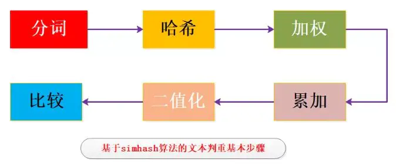
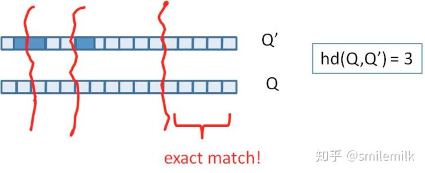
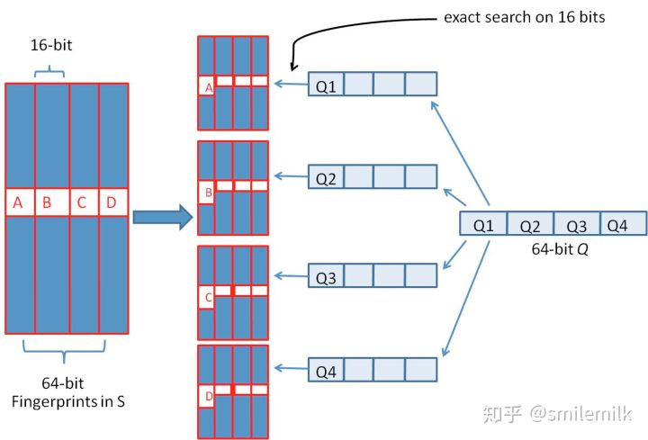

### 1. 简介

传统的Hash算法只负责将原始内容尽量均匀随机地映射为一个签名值，原理上仅相当于伪随机数产生算法。即便是两个原始内容只相差一个字节，所产生的签名也很可能差别很大，所以传统的Hash是无法在签名的维度上来衡量原内容的相似度。而SimHash本身属于一种局部敏感hash，其主要思想是降维，将高维的特征向量转化成一个f位的指纹（fingerprint），通过算出两个指纹的海明距离（hamming distince）来确定两篇文章的相似度，海明距离越小，相似度越低（根据 Detecting Near-Duplicates for Web Crawling 论文中所说），一般海明距离为3就代表两篇文章相同。     

simhash也有其局限性，在处理小于500字的短文本时，simhash的表现并不是很好，所以在使用simhash前一定要注意这个细节。

### 2. 原理

simhash是google用来处理海量文本去重的算法。 google出品，你懂的。 simhash最牛逼的一点就是将一个文档，最后转换成一个64位的字节，暂且称之为特征字，然后判断重复只需要判断他们的特征字的距离是不是<n（根据经验这个n一般取值为3），就可以判断两个文档是否相似。

### 3. 实现

#### 3.1 算法过程大致如下

1. 对文本分词，得到N维特征向量（默认为64维）

1. 为分词设置权重（tf-idf）

1. 为特征向量计算哈希

1. 对所有特征向量加权，累加（目前仅进行非加权累加）

1. 对累加结果，大于零置一，小于零置零

1. 得到文本指纹（fingerprint）

#### 3.2 具体实现流程



1. 分词

	给定一段语句或者一段文本，进行分词，得到有效的特征向量，然后为每一个特征向量设置一个5个级别（1—5）权值。例如给定一段语句：“生活本没有路，走的人多了就成了路，要相信阳光总在风雨后”，分词后结果为：生活 没有 成了 相信 阳光 风雨，然后为每个特征向量赋予权值： 生活(5) 没有(2) 成了(1) 相信(2) 阳光(3) 风雨(2)，其中括号里的数字代表这个单词在整条语句中的重要程度，数字越大代表越重要。


1. hash

	通过hash函数计算各个特征向量的hash值，hash值为二进制数01组成的n-bit签名。比如“生活”的hash值Hash(生活)为110101，“没有”的hash值Hash(没有)为“101001”。就这样，字符串就变成了一系列数字。


1. 加权

	在hash值的基础上，给所有特征向量进行加权，即W = Hash * weight，且遇到1则hash值和权值正相乘，遇到0则hash值和权值负相乘。例如给“生活”的hash值“110101”加权得到：W(生活) = 110101 5 = 5 5 -5 5 -5 5，给“没有”的hash值“101001”加权得到：W(没有)=101001 2 = 2 -2 2 -2 -2 2，其余特征向量类似此般操作。


1. 合并

	将上述各个特征向量的加权结果累加，变成只有一个序列串。拿前两个特征向量举例，例如“生活”的“5 5 -5 5 -5 5”和“没有”的“2 -2 2 -2 -2 2”进行累加，得到“5+2 5-2 -5+2 5-2 -5-2 5+2”，得到“7 3 -3 3 -7 7”。


1. 降维

	对于n-bit签名的累加结果，如果大于0则置1，否则置0，从而得到该语句的simhash值，最后我们便可以根据不同语句simhash的海明距离来判断它们的相似度。例如把上面计算出来的“9 -9 1 -1 1 9”降维（某位大于0记为1，小于0记为0），得到的01串为：“1 1 0 1 0 1”，从而形成它们的simhash签名。


#### 3.3 海明距离

我们把库里的文本都转换为simhash签名，并转换为long类型存储，空间大大减少。现在我们虽然解决了空间，但是如何计算两个simhash的相似度呢？难道是比较两个simhash的01有多少个不同吗？对的，其实也就是这样，我们通过海明距离（Hamming distance）就可以计算出两个simhash到底相似不相似。两个simhash对应二进制（01串）取值不同的数量称为这两个simhash的海明距离。举例如下： 10101 和 00110 从第一位开始依次有第一位、第四、第五位不同，则海明距离为3。对于二进制字符串的a和b，海明距离为等于在a XOR b运算结果中1的个数（普遍算法）。

我们可以把 64 位的二进制simhash签名均分成4块，每块16位。根据鸽巢原理（也称抽屉原理），如果两个签名的海明距离在 3 以内，它们必有一块完全相同。如下图所示：



### 4. 实际应用

1. 我们需要将64位simhash均分为4份，然后每份作为key存储到redis

1. 采用精确匹配的方式查找前16位

1. 找到则拿出来计算与被比较的simahsh距离，小于3则判断为相似（当然具体问题具体分析，这个值可以调整）

1. 如果样本库中存有2^34（差不多10亿）的哈希指纹，则每个table返回2^(34-16)=262144个候选结果，大大减少了海明距离的计算成本



### 5. 代码实现

- POM依赖

```
<dependency>
     <groupId>org.ansj</groupId>
     <artifactId>ansj_seg</artifactId>
     <version>5.1.6</version>
</dependency>
```

- 分词

```java
package com.zving.mvtech.util.SimHash;
import java.util.Comparator;
import java.util.Iterator;
import java.util.List;
import java.util.Map;
import org.ansj.domain.Result;
import org.ansj.domain.Term;
import org.ansj.recognition.impl.StopRecognition;
import org.ansj.splitWord.analysis.ToAnalysis;
import com.google.common.collect.Lists;
import com.google.common.collect.Maps;
public class WordSegmentationUtils {
	/**
	 * 停词过滤器
	 */
	private static StopRecognition filter = new StopRecognition();
	
	static {
		filter.insertStopNatures("Bg");
		filter.insertStopNatures("b");
		filter.insertStopNatures("c");
		filter.insertStopNatures("e");
		filter.insertStopNatures("f");
		filter.insertStopNatures("h");
		filter.insertStopNatures("i");
		filter.insertStopNatures("i");
		filter.insertStopNatures("j");
		filter.insertStopNatures("k");
		filter.insertStopNatures("l");
		filter.insertStopNatures("Mg");
		filter.insertStopNatures("m");
		filter.insertStopNatures("o");
		filter.insertStopNatures("p");
		filter.insertStopNatures("q");
		filter.insertStopNatures("Rg");
		filter.insertStopNatures("r");
		filter.insertStopNatures("s");
		filter.insertStopNatures("Tg");
		filter.insertStopNatures("t");
		filter.insertStopNatures("u");
		filter.insertStopNatures("w");
		filter.insertStopNatures("x");
		filter.insertStopNatures("Yg");
		filter.insertStopNatures("y");
		filter.insertStopNatures("z");
		filter.insertStopNatures("en");
		filter.insertStopNatures("null");
	}
	/**
	 * 分词
	 * 
	 * @param content 文本内容
	 * @return
	 */
	public static List<String> getWords(String content) {
		Result segWords = ToAnalysis.parse(content).recognition(filter);
		// 提取分词
		Iterator<Term> segTerms = segWords.iterator();
		List<String> words = Lists.newArrayList();
		while (segTerms.hasNext()) {
			Term term = segTerms.next();
			words.add(term.getName());
		}
		return words;
	}
	/**
	 * 词频映射+排序
	 * 
	 * @param words 分词表
	 * @return
	 */
	public static Map<String, Integer> getSortedFreq(List<String> words) {
		Map<String, Integer> wordFrequencyMapping = Maps.newHashMap();
		Map<String, Integer> wordFrequencyMappingSorted = Maps.newLinkedHashMap();
		words.forEach(word -> {
			int freq = wordFrequencyMapping.getOrDefault(word, 0);
			wordFrequencyMapping.put(word, freq + 1);
		});
		wordFrequencyMapping.entrySet().stream().sorted(Map.Entry.comparingByValue(Comparator.reverseOrder())).forEachOrdered(x -> wordFrequencyMappingSorted.put(x.getKey(), x.getValue()));
		return wordFrequencyMappingSorted;
	}
	/**
	 * 词频映射+排序
	 * 
	 * @param words 分词表
	 * @return
	 */
	public static Map<String, Integer> getSortedFreqLimitWords(List<String> words, int topN) {
		Map<String, Integer> wordFrequencyMapping = Maps.newHashMap();
		Map<String, Integer> wordFrequencyMappingSorted = Maps.newLinkedHashMap();
		words.forEach(word -> {
			int freq = wordFrequencyMapping.getOrDefault(word, 0);
			wordFrequencyMapping.put(word, freq + 1);
		});
		wordFrequencyMapping.entrySet().stream().sorted(Map.Entry.comparingByValue(Comparator.reverseOrder())).forEachOrdered(x -> {
			if (wordFrequencyMappingSorted.size() < topN) {
				wordFrequencyMappingSorted.put(x.getKey(), x.getValue());
			}
		});
		return wordFrequencyMappingSorted;
	}
}
```

- FNVHash

```java
package com.zving.mvtech.util.SimHash;
import java.math.BigInteger;
public class FNVHashUtils {
    // 初始值32位
    private static final BigInteger 
FNV_OFFSET_BASIS_32 = new BigInteger("2166136261");
    // 初始值64位
    private static final BigInteger 
FNV_OFFSET_BASIS_64 = new 
BigInteger("14695981039346656037");
    // 初始值128位
    private static final BigInteger 
FNV_OFFSET_BASIS_128 = new 
BigInteger("144066263297769815596495629667062367629");
    // 初始值256位
    private static final BigInteger 
FNV_OFFSET_BASIS_256 = new 
BigInteger("100029257958052580907070968620625704837092796014241193945225284501741471925557");
    // 初始值512位
    private static final BigInteger 
FNV_OFFSET_BASIS_512 = new 
BigInteger("9659303129496669498009435400716310466090418745672637896108374329434462657994582932197716438449813051892206539805784495328239340083876191928701583869517785");
    // 初始值1024位
    private static final BigInteger 
FNV_OFFSET_BASIS_1024 = new 
BigInteger("14197795064947621068722070641403218320880622795441933960878474914617582723252296732303717722150864096521202355549365628174669108571814760471015076148029755969804077320157692458563003215304957150157403644460363550505412711285966361610267868082893823963790439336411086884584107735010676915");
    // 质数32位
    private static final BigInteger FNV_PRIME_32 = 
new BigInteger("16777619");
    // 质数64位
    private static final BigInteger FNV_PRIME_64 = 
new BigInteger("1099511628211");
    // 质数128位
    private static final BigInteger FNV_PRIME_128 = 
new BigInteger("309485009821345068724781371");
    // 质数256位
    private static final BigInteger FNV_PRIME_256 = 
new 
BigInteger("374144419156711147060143317175368453031918731002211");
    // 质数512位
    private static final BigInteger FNV_PRIME_512 = 
new 
BigInteger("35835915874844867368919076489095108449946327955754392558399825615420669938882575126094039892345713852759");
    // 质数1024位
    private static final BigInteger FNV_PRIME_1024 
= new 
BigInteger("5016456510113118655434598811035278955030765345404790744303017523831112055108147451509157692220295382716162651878526895249385292291816524375083746691371804094271873160484737966720260389217684476157468082573");
    public static BigInteger 
toFNV1aHash32Bit(String word) {
         BigInteger hash = FNV_OFFSET_BASIS_32;
         int len = word.length();
         for (int i = 0; i < len; i++) {
             hash = 
hash.xor(BigInteger.valueOf(word.charAt(i)));
             hash = hash.multiply(FNV_PRIME_32);
         }
         return hash;
    }
    public static BigInteger 
toFNV1aHash64Bit(String word) {
         BigInteger hash = FNV_OFFSET_BASIS_64;
         int len = word.length();
         for (int i = 0; i < len; i++) {
             hash = 
hash.xor(BigInteger.valueOf(word.charAt(i)));
             hash = hash.multiply(FNV_PRIME_64);
         }
         return hash;
    }
    public static BigInteger 
toFNV1aHash128Bit(String word) {
         BigInteger hash = FNV_OFFSET_BASIS_128;
         int len = word.length();
         for (int i = 0; i < len; i++) {
             hash = 
hash.xor(BigInteger.valueOf(word.charAt(i)));
             hash = hash.multiply(FNV_PRIME_128);
         }
         return hash;
    }
    public static BigInteger 
toFNV1aHash256Bit(String word) {
         BigInteger hash = FNV_OFFSET_BASIS_256;
         int len = word.length();
         for (int i = 0; i < len; i++) {
             hash = 
hash.xor(BigInteger.valueOf(word.charAt(i)));
             hash = hash.multiply(FNV_PRIME_256);
         }
         return hash;
    }
    public static BigInteger 
toFNV1aHash512Bit(String word) {
         BigInteger hash = FNV_OFFSET_BASIS_512;
         int len = word.length();
         for (int i = 0; i < len; i++) {
             hash = 
hash.xor(BigInteger.valueOf(word.charAt(i)));
             hash = hash.multiply(FNV_PRIME_512);
         }
         return hash;
    }
    public static BigInteger 
toFNV1aHash1024Bit(String word) {
         BigInteger hash = FNV_OFFSET_BASIS_1024;
         int len = word.length();
         for (int i = 0; i < len; i++) {
             hash = 
hash.xor(BigInteger.valueOf(word.charAt(i)));
             hash = hash.multiply(FNV_PRIME_1024);
         }
         return hash;
    }
    public static BigInteger toFNVHash32Bit(String 
word) {
         BigInteger hash = FNV_OFFSET_BASIS_32;
         int len = word.length();
         for (int i = 0; i < len; i++) {
             hash = hash.multiply(FNV_PRIME_32);
             hash = 
hash.xor(BigInteger.valueOf(word.charAt(i)));
         }
         return hash;
    }
    public static BigInteger toFNVHash64Bit(String 
word) {
         BigInteger hash = FNV_OFFSET_BASIS_64;
         int len = word.length();
         for (int i = 0; i < len; i++) {
             hash = hash.multiply(FNV_PRIME_64);
             hash = 
hash.xor(BigInteger.valueOf(word.charAt(i)));
         }
         return hash;
    }
    public static BigInteger toFNVHash128Bit(String 
word) {
         BigInteger hash = FNV_OFFSET_BASIS_128;
         int len = word.length();
         for (int i = 0; i < len; i++) {
             hash = hash.multiply(FNV_PRIME_128);
             hash = 
hash.xor(BigInteger.valueOf(word.charAt(i)));
         }
         return hash;
    }
    public static BigInteger toFNVHash256Bit(String 
word) {
         BigInteger hash = FNV_OFFSET_BASIS_256;
         int len = word.length();
         for (int i = 0; i < len; i++) {
             hash = hash.multiply(FNV_PRIME_256);
             hash = 
hash.xor(BigInteger.valueOf(word.charAt(i)));
         }
         return hash;
    }
    public static BigInteger toFNVHash512Bit(String 
word) {
         BigInteger hash = FNV_OFFSET_BASIS_512;
         int len = word.length();
         for (int i = 0; i < len; i++) {
             hash = hash.multiply(FNV_PRIME_512);
             hash = 
hash.xor(BigInteger.valueOf(word.charAt(i)));
         }
         return hash;
    }
    public static BigInteger 
toFNVHash1024Bit(String word) {
         BigInteger hash = FNV_OFFSET_BASIS_1024;
         int len = word.length();
         for (int i = 0; i < len; i++) {
             hash = hash.multiply(FNV_PRIME_1024);
             hash = 
hash.xor(BigInteger.valueOf(word.charAt(i)));
         }
         return hash;
    }
}
```

- SimHash

```java
package com.zving.mvtech.util.SimHash;
import java.math.BigInteger;
import java.util.List;
import java.util.Map;
import java.util.Set;
import java.util.Timer;
import java.util.TimerTask;
import java.util.UUID;
import java.util.concurrent.TimeUnit;
import org.slf4j.Logger;
import org.slf4j.LoggerFactory;
import com.google.common.collect.Sets;
import com.zving.framework.nosql.redis.Redis;
import com.zving.framework.nosql.redis.RedisSync;
import com.zving.mvtech.front.model.RemoveDuplicateResultModel;
public class SimHashUtils {
	public static final Logger LOG = LoggerFactory.getLogger(SimHashUtils.class);
	public static RedisSync<String, String> redis = Redis.sync();
	/**
	 * redis去重KEY前缀
	 */
	private static final String DUPLICATE_PREFIX = "{cms}-duplicate-";
	/**
	 * redis去重锁
	 */
	private static final String DUPLICATE_LOCK = "{cms}-duplicate-lock";
	/**
	 * 文本是否重复
	 * 
	 * @param content 文本内容
	 * @param id      文本ID
	 * @return
	 */
	public static RemoveDuplicateResultModel isDuplicate(String content, String id) {
		return isDuplicate(content, id, false, false);
	}
	/**
	 * 文本是否重复
	 * 
	 * @param content 文本内容
	 * @param id      文本ID
	 * @param topN    排名前N的词汇
	 * @return
	 */
	public static RemoveDuplicateResultModel isDuplicate(String content, String id, int topN) {
		return isDuplicate(content, id, false, false, topN);
	}
	/**
	 * 文本是否重复
	 * 
	 * @param content                文本内容
	 * @param id                     文本ID
	 * @param isIndexWhenNoDuplicate 是否索引当不重复时
	 * @param isLock                 是否加锁
	 * @return
	 */
	public static RemoveDuplicateResultModel isDuplicate(String content, String id, boolean isIndexWhenNoDuplicate, boolean isLock) {
		// 获取指纹
		BigInteger signature = getSimHash(content);
		if (isLock) {
			return isDuplicateWithLock(signature, id, isIndexWhenNoDuplicate);
		} else {
			return isDuplicateWithoutLock(signature, id, isIndexWhenNoDuplicate);
		}
	}
	/**
	 * 文本是否重复
	 * 
	 * @param content                文本内容
	 * @param id                     文本ID
	 * @param isIndexWhenNoDuplicate 是否索引当不重复时
	 * @param isLock                 是否加锁
	 * @param topN                   排名前N的词汇
	 * @return
	 */
	public static RemoveDuplicateResultModel isDuplicate(String content, String id, boolean isIndexWhenNoDuplicate, boolean isLock, int topN) {
		// 获取指纹
		BigInteger signature = getSimHashTopN(content, topN <= 0 ? 1 : topN);
		if (isLock) {
			return isDuplicateWithLock(signature, id, isIndexWhenNoDuplicate);
		} else {
			return isDuplicateWithoutLock(signature, id, isIndexWhenNoDuplicate);
		}
	}
	/**
	 * 指纹是否重复(无锁)
	 * 
	 * @param signature              指纹
	 * @param id                     文本ID
	 * @param isIndexWhenNoDuplicate 是否索引当不重复时
	 * @return
	 */
	public static RemoveDuplicateResultModel isDuplicateWithoutLock(BigInteger signature, String id, boolean isIndexWhenNoDuplicate) {
		RemoveDuplicateResultModel result = new RemoveDuplicateResultModel();
		// 鸽巢原理
		String signatureBinaryString = String.format("%64s", Long.toBinaryString(signature.longValue())).replace(' ', '0');
		// 指纹分片集合
		Set<String> signatureShardingSet = Sets.newConcurrentHashSet();
		// 指纹分片0-16位
		signatureShardingSet.add(signatureBinaryString.substring(0, 16));
		// 指纹分片16-32位
		signatureShardingSet.add(signatureBinaryString.substring(16, 32));
		// 指纹分片32-48位
		signatureShardingSet.add(signatureBinaryString.substring(32, 48));
		// 指纹分片48-64位
		signatureShardingSet.add(signatureBinaryString.substring(48, 64));
		// 分片查重
		if (signatureShardingSet.stream().anyMatch(signatureSharding -> {
			if (redis.exists(DUPLICATE_PREFIX + signatureSharding) > 0) {
				Set<String> signatures = redis.smembers(DUPLICATE_PREFIX + signatureSharding);
				if (signatures.stream().anyMatch(str -> {
					if (!id.equals(str.split("-")[1])) {
						BigInteger signature2 = new BigInteger(str.split("-")[0]);
						if (getHammingDistance(signature, signature2) <= 3) {
							result.setId(str.split("-")[1]);
							return true;
						} else {
							return false;
						}
					} else {
						return false;
					}
				})) {
					return true;
				}
			}
			return false;
		})) {
			result.setDuplicate(true);
		} else {
			// 索引指纹
			if (isIndexWhenNoDuplicate) {
				signatureShardingSet.stream().forEach(signatureSharding -> {
					redis.sadd(DUPLICATE_PREFIX + signatureSharding, signature.toString() + "-" + id);
				});
			}
			result.setDuplicate(false);
		}
		return result;
	}
	/**
	 * 指纹是否重复(有锁)
	 * 
	 * @param signature              指纹
	 * @param id                     文本ID
	 * @param isIndexWhenNoDuplicate 是否索引当不重复时
	 * @return
	 */
	public static RemoveDuplicateResultModel isDuplicateWithLock(BigInteger signature, String id, boolean isIndexWhenNoDuplicate) {
		RemoveDuplicateResultModel result = new RemoveDuplicateResultModel();
		// 鸽巢原理
		String signatureBinaryString = String.format("%64s", Long.toBinaryString(signature.longValue())).replace(' ', '0');
		// 指纹分片集合
		Set<String> signatureShardingSet = Sets.newConcurrentHashSet();
		// 指纹分片0-16位
		signatureShardingSet.add(signatureBinaryString.substring(0, 16));
		// 指纹分片16-32位
		signatureShardingSet.add(signatureBinaryString.substring(16, 32));
		// 指纹分片32-48位
		signatureShardingSet.add(signatureBinaryString.substring(32, 48));
		// 指纹分片48-64位
		signatureShardingSet.add(signatureBinaryString.substring(48, 64));
		// 生成客户端ID
		String clientId = UUID.randomUUID().toString();
		try {
			// 获取锁
			boolean isLock = getLock(clientId);
			// 重新尝试获取锁
			while (!isLock) {
				TimeUnit.MILLISECONDS.sleep(100);
				isLock = getLock(clientId);
			}
			// 分片查重
			if (signatureShardingSet.stream().anyMatch(signatureSharding -> {
				if (redis.exists(DUPLICATE_PREFIX + signatureSharding) > 0) {
					Set<String> signatures = redis.smembers(DUPLICATE_PREFIX + signatureSharding);
					if (signatures.stream().anyMatch(str -> {
						if (!id.equals(str.split("-")[1])) {
							BigInteger signature2 = new BigInteger(str.split("-")[0]);
							if (getHammingDistance(signature, signature2) <= 3) {
								result.setId(str.split("-")[1]);
								return true;
							} else {
								return false;
							}
						} else {
							return false;
						}
					})) {
						return true;
					}
				}
				return false;
			})) {
				result.setDuplicate(true);
			} else {
				// 索引指纹
				if (isIndexWhenNoDuplicate) {
					signatureShardingSet.stream().forEach(signatureSharding -> {
						redis.sadd(DUPLICATE_PREFIX + signatureSharding, signature.toString() + "-" + id);
					});
				}
				result.setDuplicate(false);
			}
		} catch (Exception e) {
			LOG.error("查重异常", e);
		} finally {
			releaseLock(clientId);
		}
		return result;
	}
	/**
	 * 指纹
	 * 
	 * @param content 文本内容
	 * @return
	 */
	public static BigInteger getSimHash(String content) {
		// 1.分词
		List<String> words = WordSegmentationUtils.getWords(content);
		// 2.聚合倒排
		Map<String, Integer> wordFrequencyMappingSorted = WordSegmentationUtils.getSortedFreq(words);
		// 3.hash+加权+合并
		int[] weights = new int[64];
		wordFrequencyMappingSorted.forEach((word, weight) -> {
			// hash
			BigInteger hash = FNVHashUtils.toFNV1aHash64Bit(word);
			System.out.println("word=" + word + ",weight=" + weight + ",hash=" + hash);
			for (int i = 0; i < weights.length; i++) {
				BigInteger bitmask = BigInteger.ONE.shiftLeft(weights.length - i - 1);
				// 加权 合并
				if (hash.and(bitmask).signum() != 0) {
					weights[i] += weight;
				} else {
					weights[i] -= weight;
				}
			}
		});
		// 4.降维
		BigInteger signature = BigInteger.ZERO;
		for (int i = 0; i < weights.length; i++) {
			if (weights[i] >= 0) {
				signature = signature.add(BigInteger.ONE.shiftLeft(weights.length - i - 1));
			}
		}
		return signature;
	}
	/**
	 * 指纹
	 * 
	 * @param content 文本内容
	 * @param topN    排名前N的词汇
	 * @return
	 */
	public static BigInteger getSimHashTopN(String content, int topN) {
		// 1.分词
		List<String> words = WordSegmentationUtils.getWords(content);
		// 2.聚合倒排
		Map<String, Integer> wordFrequencyMappingSorted = WordSegmentationUtils.getSortedFreqLimitWords(words, topN);
		// 3.hash+加权+合并
		int[] weights = new int[64];
		wordFrequencyMappingSorted.forEach((word, weight) -> {
			// hash
			BigInteger hash = FNVHashUtils.toFNV1aHash64Bit(word);
			for (int i = 0; i < weights.length; i++) {
				BigInteger bitmask = BigInteger.ONE.shiftLeft(weights.length - i - 1);
				// 加权 合并
				if (hash.and(bitmask).signum() != 0) {
					weights[i] += weight;
				} else {
					weights[i] -= weight;
				}
			}
		});
		// 4.降维
		BigInteger signature = BigInteger.ZERO;
		for (int i = 0; i < weights.length; i++) {
			if (weights[i] >= 0) {
				signature = signature.add(BigInteger.ONE.shiftLeft(weights.length - i - 1));
			}
		}
		return signature;
	}
	/**
	 * 海明距离
	 * 
	 * @param sign1 指纹1
	 * @param sign2 指纹2
	 * @return
	 */
	public static int getHammingDistance(BigInteger sign1, BigInteger sign2) {
		BigInteger x = sign1.xor(sign2);
		int hammingDistance = 0;
		while (x.signum() != 0) {
			hammingDistance += 1;
			x = x.and(x.subtract(new BigInteger("1")));
		}
		return hammingDistance;
	}
	/**
	 * 索引指纹(无锁)
	 * 
	 * @param content 文本内容
	 * @param id      文本ID
	 * @return
	 */
	public static void indexSignatureWithoutLock(String content, String id) {
		// 1.获取指纹
		BigInteger signature = getSimHash(content);
		// 2.鸽巢原理
		String signatureBinaryString = String.format("%64s", Long.toBinaryString(signature.longValue())).replace(' ', '0');
		Set<String> signatureShardingSet = Sets.newConcurrentHashSet();
		// 指纹分片0-16位
		signatureShardingSet.add(signatureBinaryString.substring(0, 16));
		// 指纹分片16-32位
		signatureShardingSet.add(signatureBinaryString.substring(16, 32));
		// 指纹分片32-48位
		signatureShardingSet.add(signatureBinaryString.substring(32, 48));
		// 指纹分片48-64位
		signatureShardingSet.add(signatureBinaryString.substring(48, 64));
		// 索引指纹
		signatureShardingSet.stream().forEach(signatureSharding -> {
			redis.sadd(DUPLICATE_PREFIX + signatureSharding, signature.toString() + "-" + id);
		});
	}
	/**
	 * 索引指纹(有锁)
	 * 
	 * @param content 文本内容
	 * @param id      文本ID
	 * @return
	 */
	public static void indexSignatureWithLock(String content, String id) {
		// 1.获取指纹
		BigInteger signature = getSimHash(content);
		// 2.鸽巢原理
		String signatureBinaryString = String.format("%64s", Long.toBinaryString(signature.longValue())).replace(' ', '0');
		Set<String> signatureShardingSet = Sets.newConcurrentHashSet();
		// 指纹分片0-16位
		signatureShardingSet.add(signatureBinaryString.substring(0, 16));
		// 指纹分片16-32位
		signatureShardingSet.add(signatureBinaryString.substring(16, 32));
		// 指纹分片32-48位
		signatureShardingSet.add(signatureBinaryString.substring(32, 48));
		// 指纹分片48-64位
		signatureShardingSet.add(signatureBinaryString.substring(48, 64));
		// 生成客户端ID
		String clientId = UUID.randomUUID().toString();
		try {
			// 获取锁
			boolean isLock = getLock(clientId);
			// 重新尝试获取锁
			while (!isLock) {
				TimeUnit.MILLISECONDS.sleep(100);
				isLock = getLock(clientId);
			}
			// 索引指纹
			signatureShardingSet.stream().forEach(signatureSharding -> {
				redis.sadd(DUPLICATE_PREFIX + signatureSharding, signature.toString() + "-" + id);
			});
		} catch (Exception e) {
			LOG.error("查重异常", e);
		} finally {
			releaseLock(clientId);
		}
	}
	/**
	 * 删除指纹(无锁)
	 * 
	 * @param content 文本内容
	 * @param id      文本ID
	 * @return
	 */
	public static void deleteSignatureWithoutLock(String content, String id) {
		// 1.获取指纹
		BigInteger signature = getSimHash(content);
		// 2.鸽巢原理
		String signatureBinaryString = String.format("%64s", Long.toBinaryString(signature.longValue())).replace(' ', '0');
		Set<String> signatureShardingSet = Sets.newConcurrentHashSet();
		// 指纹分片0-16位
		signatureShardingSet.add(signatureBinaryString.substring(0, 16));
		// 指纹分片16-32位
		signatureShardingSet.add(signatureBinaryString.substring(16, 32));
		// 指纹分片32-48位
		signatureShardingSet.add(signatureBinaryString.substring(32, 48));
		// 指纹分片48-64位
		signatureShardingSet.add(signatureBinaryString.substring(48, 64));
		// 删除指纹
		signatureShardingSet.stream().forEach(signatureSharding -> {
			redis.srem(DUPLICATE_PREFIX + signatureSharding, signature.toString() + "-" + id);
		});
	}
	/**
	 * 删除指纹(有锁)
	 * 
	 * @param content 文本内容
	 * @param id      文本ID
	 * @return
	 */
	public static void deleteSignatureWithLock(String content, String id) {
		// 1.获取指纹
		BigInteger signature = getSimHash(content);
		// 2.鸽巢原理
		String signatureBinaryString = String.format("%64s", Long.toBinaryString(signature.longValue())).replace(' ', '0');
		Set<String> signatureShardingSet = Sets.newConcurrentHashSet();
		// 指纹分片0-16位
		signatureShardingSet.add(signatureBinaryString.substring(0, 16));
		// 指纹分片16-32位
		signatureShardingSet.add(signatureBinaryString.substring(16, 32));
		// 指纹分片32-48位
		signatureShardingSet.add(signatureBinaryString.substring(32, 48));
		// 指纹分片48-64位
		signatureShardingSet.add(signatureBinaryString.substring(48, 64));
		// 生成客户端ID
		String clientId = UUID.randomUUID().toString();
		try {
			// 获取锁
			boolean isLock = getLock(clientId);
			// 重新尝试获取锁
			while (!isLock) {
				TimeUnit.MILLISECONDS.sleep(100);
				isLock = getLock(clientId);
			}
			// 删除指纹
			signatureShardingSet.stream().forEach(signatureSharding -> {
				redis.srem(DUPLICATE_PREFIX + signatureSharding, signature.toString() + "-" + id);
			});
		} catch (Exception e) {
			LOG.error("查重异常", e);
		} finally {
			releaseLock(clientId);
		}
	}
	private static Timer timer = new Timer();
	private static TimerTask timerTask;
	/**
	 * 超时时间
	 */
	private static final long EXPIRE = 30L;
	static {
		// 程序启动检测是否死锁
		if (-1 == redis.ttl(DUPLICATE_LOCK)) {
			// 设置锁超时时间
			redis.expire(DUPLICATE_LOCK, EXPIRE / 3);
		}
	}
	/**
	 * 获取锁
	 * 
	 * @param clientId 客户端ID
	 * @return
	 */
	public static boolean getLock(String clientId) {
		// 是否获取锁
		boolean isLock = redis.setnx(DUPLICATE_LOCK, clientId);
		if (isLock) {
			// 设置锁超时时间
			redis.expire(DUPLICATE_LOCK, EXPIRE);
			// 锁自动续期
			timerTask = new TimerTask() {
				@Override
				public void run() {
					redis.expire(DUPLICATE_LOCK, EXPIRE);
				}
			};
			timer.schedule(timerTask, 0L, EXPIRE / 3);
		} else {
			if (-1 == redis.ttl(DUPLICATE_LOCK)) {
				// 设置锁超时时间
				redis.expire(DUPLICATE_LOCK, EXPIRE / 3);
			}
		}
		return isLock;
	}
	/**
	 * 释放锁
	 * 
	 * @param clientId 客户端ID
	 */
	public static void releaseLock(String clientId) {
		// 判断是否是锁的持有者
		if (redis.get(DUPLICATE_LOCK).equals(clientId)) {
			// 取消锁自动续期
			timerTask.cancel();
			// 释放锁
			redis.del(DUPLICATE_LOCK);
		}
	}
}
```