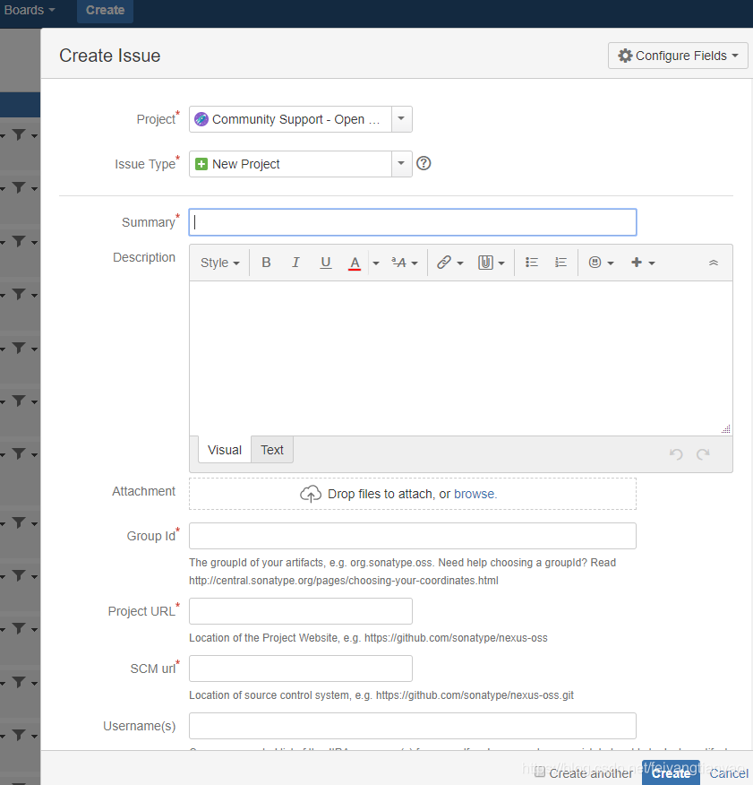
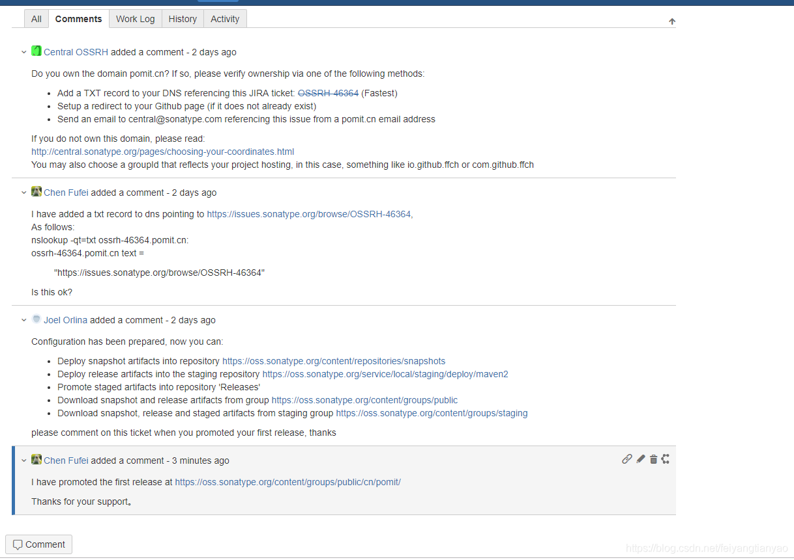
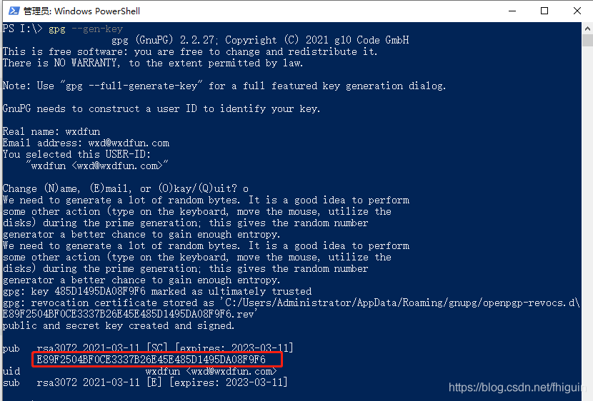

### 如何发布Jar包到maven中央仓库（个人域名）

我们通常使用的Jar包，大多都是从镜像上拉取的，也有私人仓库，也有直接从Maven中央仓库拉取的，无论从镜像还是仓库，发布到中央仓库的Jar包，都是可以直接拉取下来的。所以，当我们自己打包了一个Jar包之后，打算开源出去的时候，我们就可以将Jar包发布到sonatype.org，这个地址看起来不是maven，但是发布上去之后，我们在mvnrepository.com和search.maven.org都可以看到自己的Jar包了。

#### 1. 地址

工单管理地址：[https://issues.sonatype.org/secure/Dashboard.jspa](https://issues.sonatype.org/secure/Dashboard.jspa)

说明：注册账号、创建和管理issue，Jar包的发布是以解决issue的方式起步的。

#### 2. 创建工单

创建工单是必须的，也很简单，在工单管理中提交下Jar包相关信息即可。

首先要注册账号，如果没有账号，需要先注册一个，记住用户名密码，后边要配置到setting.xml中。

点击Create，弹出如下窗口：



Project：Community Support - Open Source Project Repository Hosting

Issue Type：New Project

Group Id：个人域名，如blueisacat.cn

Project URL：项目站点，如[https://github.com/134********/browser](https://github.com/134********/browser)

SCM url：[https://github.com/134********/browser.git](https://github.com/134********/browser.git)

创建Issue后，Sonatype的工作人员审核处理，一般一个工作日以内，当Issue的Status变为RESOLVED后，就可以进行下一步操作了。

申请过程如下：



首先Central OSSRH会问你，这个域名是你的么，怎么证明这个域名是你的呢？

方法有三个：

1. 在域名解析中加上要给TXT记录，指向你发布的这个Issues。（最快）

1. 设置一个指向你的github主页的跳转（麻烦）

1. 用域名的邮箱发送邮件到central@sonatype.com（麻烦）

所以选择第一种方式，到购买域名的地方添加一条TXT记录，然后回去评论告诉他，等他看完之后就会告诉你，“可以上传Jar包了，上传完成后告诉我下”，然后就上传Jar包吧。

#### 3. 配置maven

3.1 settings-sonatype.xml文件

```xml
<?xml version="1.0" encoding="UTF-8"?>
<settings xmlns="
          xmlns:xsi="
          xsi:schemaLocation="
          
  <servers>
    <server>
      <id>ossrh</id>
      <username>134********</username>
      <password>Gc*******!@#</password>
    </server>
  </servers>
</settings>
```

3.2 配置pom.xml

```xml
<?xml version="1.0" encoding="UTF-8"?>
<project xmlns="
         xmlns:xsi="
         xsi:schemaLocation="
    <modelVersion>4.0.0</modelVersion>
    <groupId>cn.blueisacat</groupId>
    <artifactId>browser</artifactId>
    <version>1.0</version>
    <packaging>jar</packaging>
    <name>browser</name>
    <description>a tool for crawler by selenium</description>
    <url>
    <licenses>
        <license>
            <name>The Apache Software License, Version 2.0</name>
            <url>
            <distribution>actable</distribution>
        </license>
    </licenses>
    <developers>
        <developer>
            <name>gc</name>
            <email>134********@163.com</email>
            <organization>blueisacat</organization>
            <url>
        </developer>
    </developers>
    <scm>
        <tag>master</tag>
        <url>
        <connection>scm:git:
        <developerConnection>scm:git:
    </scm>
    <properties>
        <java.version>1.8</java.version>
        <project.build.sourceEncoding>UTF-8</project.build.sourceEncoding>
        <maven.compiler.source>8</maven.compiler.source>
        <maven.compiler.target>8</maven.compiler.target>
    </properties>
    <dependencies>
        <!-- 
        <dependency>
            <groupId>org.seleniumhq.selenium</groupId>
            <artifactId>selenium-java</artifactId>
            <version>3.141.59</version>
        </dependency>
        <!-- 
        <dependency>
            <groupId>commons-io</groupId>
            <artifactId>commons-io</artifactId>
            <version>2.10.0</version>
        </dependency>
        <!-- 
        <dependency>
            <groupId>org.yaml</groupId>
            <artifactId>snakeyaml</artifactId>
            <version>1.29</version>
        </dependency>
    </dependencies>
    <distributionManagement>
        <snapshotRepository>
            <id>ossrh</id>
            <url>
        </snapshotRepository>
        <repository>
            <id>ossrh</id>
            <url>
        </repository>
    </distributionManagement>
    <profiles>
        <profile>
            <id>sonatype-oss-release</id>
            <build>
                <plugins>
                    <plugin>
                        <groupId>org.sonatype.plugins</groupId>
                        <artifactId>nexus-staging-maven-plugin</artifactId>
                        <version>1.6.7</version>
                        <extensions>true</extensions>
                        <configuration>
                            <serverId>ossrh</serverId>
                            <nexusUrl>
                            <autoReleaseAfterClose>true</autoReleaseAfterClose>
                        </configuration>
                    </plugin>
                    <plugin>
                        <groupId>org.apache.maven.plugins</groupId>
                        <artifactId>maven-source-plugin</artifactId>
                        <version>2.2.1</version>
                        <executions>
                            <execution>
                                <id>attach-sources</id>
                                <goals>
                                    <goal>jar-no-fork</goal>
                                </goals>
                            </execution>
                        </executions>
                    </plugin>
                    <plugin>
                        <groupId>org.apache.maven.plugins</groupId>
                        <artifactId>maven-javadoc-plugin</artifactId>
                        <version>2.9.1</version>
                        <executions>
                            <execution>
                                <id>attach-javadocs</id>
                                <goals>
                                    <goal>jar</goal>
                                </goals>
                            </execution>
                        </executions>
                        <configuration>
                            <additionalJOptions>
                                <additionalJOption>-Xdoclint:none</additionalJOption>
                            </additionalJOptions>
                        </configuration>
                    </plugin>
                    <plugin>
                        <groupId>org.apache.maven.plugins</groupId>
                        <artifactId>maven-gpg-plugin</artifactId>
                        <version>1.5</version>
                        <executions>
                            <execution>
                                <id>sign-artifacts</id>
                                <phase>verify</phase>
                                <goals>
                                    <goal>sign</goal>
                                </goals>
                            </execution>
                        </executions>
                    </plugin>
                </plugins>
            </build>
        </profile>
    </profiles>
</project>
```

3.3 配置gpg-key

如果是使用的windows，可以下载gpg4win，地址[https://www.gpg4win.org/download.html](https://www.gpg4win.org/download.html)，安装后在命令中执行

```
gpg --gen-key
```

生成过程中，需要填写名字、邮箱等，其他步骤可以使用默认值，不过有个叫Passphase的参数需要记住（g*******），这个相当于密钥的密码，下一步发布过程进行签名操作的时候会用到。

命令执行之后，会提示输入真实姓名和邮箱，之后提示输入密码。



之后会的搭配pub，将pub上传到key验证库

```
gpg --keyserver hkp://keyserver.ubuntu.com:11371 --send-keys 760AD2869B86677B7D2B1A0BAA207942B2D26012
```

3.5 上传Jar包

使用maven命令上传Jar包：

```
mvn clean deploy -P sonatype-oss-release -Darguments="gpg.passphrase=760AD2869B86677B7D2B1A0BAA207942B2D26012" -s "D:\Tools\apache-maven\conf\settings-sonatype.xml"
```

上传成功后，等待1~2个小时后即可同步到maven的中央仓库。