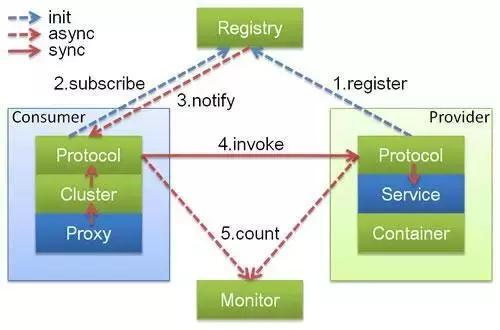
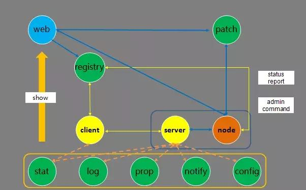
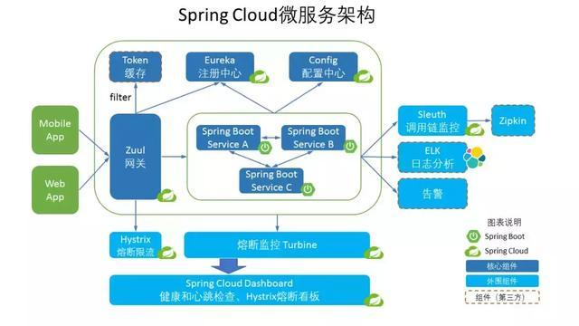
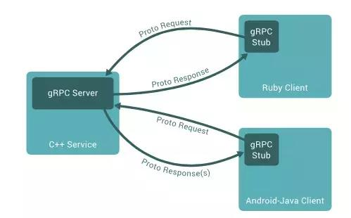
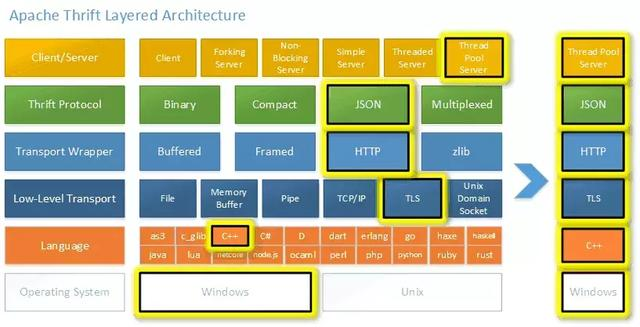

### 开源RPC框架有哪些呢？

1. Dubbo：国内最早开源的RPC框架，由阿里巴巴公司开发并于2011年末对外开源，仅支持Java语言。

1. Motan：微博内部使用的RPC框架，于2016年对外开源，仅支持Java语言。

1. Tars：腾讯内部使用的RPC框架，于2017年对外开源，仅支持C++语言。

1. Spring Cloud：国外Pivotal公司2014年对外开源的RPC框架，仅支持Java语言。

1. gRPC：Google于2015年对外开源的跨语言RPC框架，支持多种语言。

1. Thrift：最初是由Facebook开发的内部系统跨语言RPC框架，2007年贡献给了Apache基金，成为Apache开源项目之一，支持多种语言。

#### Dubbo

架构如下：

从图中能看到，Dubbo的架构主要包含四个角色，其中Consumer是服务消费者，Provider是服务提供者，Registry是注册中心，Monitor是监控系统。

具体的交互流程是Consumer一端通过注册中心获取到Provider节点后，通过Dubbo的客户端SDK与Provider建立连接，并发起调用。Provider一端通过Dubbo的服务端SDK接收到Consumer的请求，处理后再把结果返回给Consumer。

#### Motan

架构如下：

Motan与Dubbo的架构类似，都需要在Client端（服务消费者）和Server端（服务提供者）引入SDK，其中Motan框架主要包含下面几个功能模块。

- register：用来和注册中心交互，包括注册服务、订阅服务、服务变更通知、服务心跳发送等功能。

- protocol：用来进行RPC服务的描述和RPC服务的配置管理，这一层还可以添加不同功能的filter用来完成统计、并发限制等功能。

- serialize：将RPC请求的参数、结果等对象进行序列化与反序列化

- transport：用来进行远程通信，默认使用Netty NIO的TCP长连接方式。

- cluster：请求时会根据不同的高可用与负载均衡策略选择一个可用的Server发起远程调用。

#### Tars

架构如下：

- 服务发布流程：在web系统上传server的发布包到patch，上传成功后，在web上提交发布server请求，由registry服务传达到node，然后node拉取server的发布包到本地，拉起服务。

- 管理命令流程：web系统上的可以提交管理server服务命令请求，由registry服务传达到node服务，然后由node向server发送管理命令。

- 心跳上报流程：server服务运行后，会定期上报心跳到node，node然后把五福心跳信息报到registry服务，由registry进行统一管理。

- 信息上报流程：server服务运行后，会定期上报统计信息到stat，打印远程日志到log，定期上报属性信息到prop、上报异常信息到notify、从config拉取服务配置信息。

- client访问server流程：client可以通过server的对象名Obj间接访问server，client会从reistry上拉取server的路由信息（如IP、Port信息），然后根据具体的业务特性（同步或者异步，TCP或者UDP方式）访问server（当然client也可以通过IP/Port直接访问server）。

#### Spring Cloud

架构如下：

- 请求统一通过API网关Zuul来访问内部服务，先经过Token进行安全认证。

- 通过安全认证后，网管Zuul从注册中心Eureka获取可用服务节点列表。

- 从可用服务节点中选取一个可用节点，然后把请求分发到这个节点。

- 整个请求过程中，Hystrix组件负责处理服务超时熔断，Turbine组件负责监控服务间的调用和熔断相关指标，Sleuth组件负责调用链监控，ELK负责日志分析。

#### gRPC

gRPC的原理是通过IDL（Interface Definition Language）文件定义服务接口的参数和返回值类型，然后通过代码生成程序生成服务端和客户端的具体实现代码，这样在gRPC里，客户端应用可以像调用本地对象一样调用另一台服务器上对应的方法。

- 通信协议采用了HTTP/2，因为HTTP/2提供了连接复用、双向流、服务器推送、请求优先级、首部压缩等机制。

- IDL使用了ProtoBuf，ProtoBuf是由Google开发的一种数据序列化协议，它的压缩和传输效率极高，语法也简单。

- 多语言支持，能够基于多种语言自动生成对应语言的客户端和服务端的代码。

#### Thrift

架构如下：

- 支持多种序列化格式：如Binary、Compact、JSON、Multiplexed等。

- 支持多种通信方式：如Socket、Framed、File、Memory、zlib等。

- 服务端支持多种处理方式：如Simple、Thread Pool、Non-Blocking等。