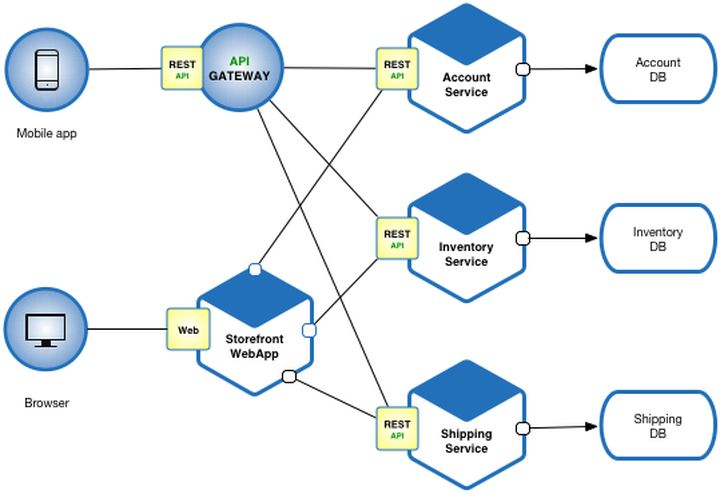

#### 什么是微服务

在认识微服务之前，需要先了解一下与微服务对应的单体式（Monolithic）架构。在Monolithic架构中，系统通常采用分层架构模式，按技术维度对系统进行划分，比如持久化层、业务逻辑层、表示层。Monolithic架构主要存在以下问题：

1. 系统间通常以API的形式互相访问，耦合紧密导致难以维护；

1. 各业务领域需要采用相同的技术栈，难以快速应用新技术；

1. 对系统的任何修改都必须整个系统一起重新部署/升级，运维成本高；

1. 在系统负载增加时，难以进行水平扩展；

1. 在系统中一处出现问题，会影响整个系统；

为了解决这些问题，微服务架构应运而生。微服务，又叫微服务架构。微服务架构是一种架构风格，它将一个复杂的应用拆分成多个独立自治的服务，服务与服务间通过松耦合的形式交互。

比如下面的示例，将一个系统的后端划分成Account/Inventory/Shipping三个微服务，每个微服务有自己的数据库存储，对外提供风格统一的REST API。

#### 微服务的主要特点

##### 单一职责

每个微服务都需要满足单一职责原则，微服务本身是内聚的，因此微服务通常比较小。比如示例中每个微服务按业务逻辑划分，每个微服务仅负责自己归属于自己业务领域的功能。

微服务的开发通常与DevOps结合在一起，比如根据亚马逊给出的经验，一个微服务应该可以由一个Two Pizza Team负责设计、开发、测试与运维。

> 什么是两个披萨团队？亚马逊内部有所谓的“两个披萨团队”，指的是团队的人数相当于可以吃掉2个披萨，就是说让团队保持在两个披萨能让队员吃饱的小规模的概念。团队要小到让每个成员都能做出显著的贡献，并且相互依赖，有共同目标，以及统一的成功标准。

##### 自治

一个微服务就是一个独立的实体，它可以独立部署、升级，服务与服务之间通过REST等形式的标准接口进行通信，并且一个微服务实例可以被替换成另一种实现，而对其它的微服务不产生影响。

比如，我们可以对示例中的Account Service替换成一个具备相同接口不同实现方式的实例，在替换后将不会对其它服务产生影响。或者在我们修改了它的一个BUG时，可以通过灰度升级技术保证其它服务在升级期间仍然可以使用Account Service提供的服务。

#### 为什么需要微服务

##### 逻辑清晰

这个特点是由微服务的单一职责的要求所带来的。一个仅负责一项很明确业务的微服务，在逻辑上肯定比一个复杂的系统更容易让人理解。

逻辑清晰带来的是微服务的可维护性，在我们对一个微服务进行修改时，能够更容易分析到这个修改到底会产生什么影响，从而通过完备的测试保证修改质量。

##### 简化部署

在一个单块系统中，只要修改了一行代码，就需要对整个系统进行重新的构建、测试，然后将整个系统进行部署。而微服务则可以对一个微服务进行部署。

这样带来的一个好处是，我们可以更频繁的去更改我们的软件，通过很低的集成成本，快速的发布新的功能。

##### 可扩展

应对系统业务增长的方法通常采用横向（Scale out）或纵向（Scale up）的方向进行扩展。分布式系统中通常要采用Scale out的方式进行扩展。因为不同的功能会面对不同的负荷变化，因此采用微服务的系统相对单块系统具备更好的可拓展性。

##### 灵活组合

在微服务架构中，可以通过组合已有的微服务以达到功能重用的目的。

比如在示例中，如果我们要新增一个Booking Service，在预定时可以直接重用Account Service和Inventory Service检查用户权限和库存情况。

##### 技术异构

在一个大型系统中，不同的功能具有不同的特点，并且不同的团队可能具备不同的技术能力。因为微服务间松耦合，不同的微服务可以选择不同的技术栈进行开发。

同时，在应用新技术时，可以仅针对一个微服务进行快速改造，而不会影响系统中的其它微服务，有利于系统的演进。

比如在示例中，如果因为库存系统数据量变大，我们需要数据由当前的sqlite数据库修改为MySQL，可以仅修改Inventory Service，而不需要要求整个系统的数据库全部替换。

##### 高可靠

微服务间独立部署，一个微服务的异常不会导致其它微服务同时异常。通过隔离、融断等技术可以极大的提升微服务的可靠性。

#### 微服务的缺点

##### 复杂度高

微服务间通过REST、RPC等形式交互，当对于Monolithic模式下的API形式，需要考虑被调用方故障、过载、消息丢失等各种异常情况，代码逻辑更加复杂。

对于微服务间的事务性操作，因为不同的微服务采用了不同的数据库，将无法利用数据库本身的事务机制保证一致性，需要引入二阶段提交等技术。

同时，在微服务间存在少部分共用功能但又无法提取成微服务时，各个微服务对于这部分功能通常需要重复开发，或至少要做代码复制，以避免微服务间的耦合，增加了开发成本。

##### 运维复杂

在采用微服务架构时，系统由多个独立运行的微服务构成，需要一个设计良好的监控系统对各个微服务的运行状态进行监控。运维人员需要对系统由细致的了解才能够更好的运维系统。

##### 影响性能

想丢与Monolithic架构，微服务之间通过REST、RPC等形式交互，通信的时延会受到较大的影响。

#### 总结

微服务在近几年大火，它具备了灵活部署、可扩展、技术异构等优点，但同时也带来了开发、运维的复杂性。是否要采用微服务架构需要根据系统的特点，结合企业的组织架构、团队能力等多个方面进行综合的判断，而不是为了微服务而微服务。