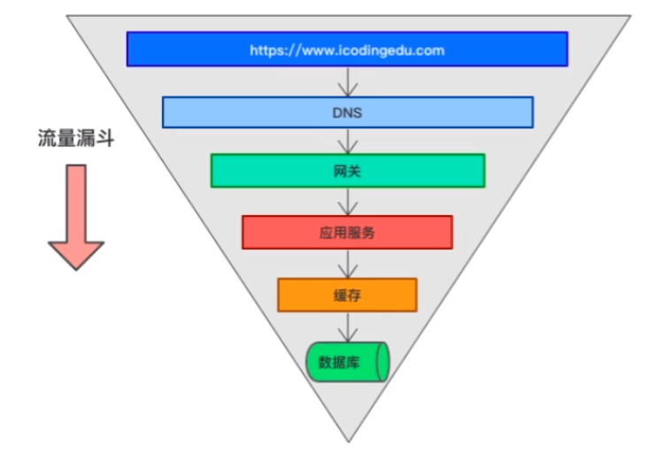
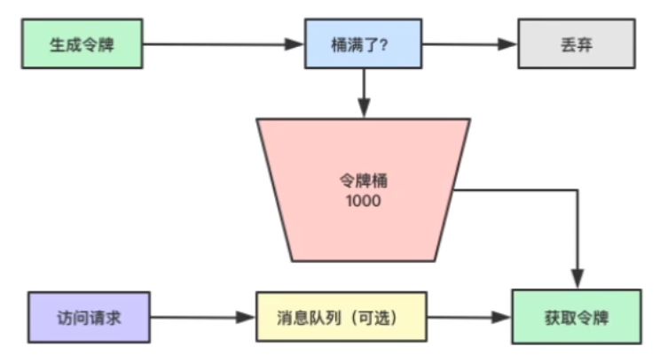
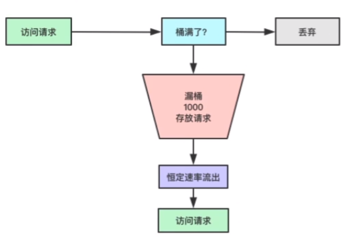

### 1. 亿级流量系统如何架构设计应对流量问题



### 2. 突发流量过高的情况下如何进行系统保护

Q：对于高并发大流量系统，你的架构是如何设计的？

- 动静分离：前后端业务代码拆分，将静态资源发到CDN上进行加速

- 扩容：将系统进行柔性扩展

    1. 系统节点的无状态（例：session）

    1. 有状态的数据进行中心化（例：文件系统）

    1. 数据库则可以使用分库分表

- 缓存：Redis（RDB/AOF），将CPU-I/O方式转成内存形式

Q： 以上都是计划性的设计，主要应对的已知的问题和风险，如何面对突发性的高并发大流量？ * 降级：主动降级，被动降级-熔断（快速失败，防止应用雪崩），非核心链路的应用给核心链路让资源

- 限流：确保系统最后的生存底线，不能因为流量过大将系统挤垮

### 3. 系统保护的终极方案：限流设计

降低系统压力最有效的方式：限流

- 业务限流：验证码

- 技术限流：阻塞式，非阻塞式

### 4. 分布式限流的维度、算法、解决方案分析

#### 4.1 分布式限流的纬度

- 时间：时间窗口，比如每秒2个请求

- 资源：基于可用资源的限制，比如最大访问次数，最高连接数，限制下载带宽

一般我们再进行限流的时候不会仅使用一种限流方案，会多种组合

##### 4.1.1 QPS和连接数控制

同时设置，一定是哪个先达到，就限制性哪个

##### 4.1.2 传输速率

10KB/s，100MB/s

##### 4.1.3 黑白名单

尤其是大厂，黑白名单方式是常用的

#### 4.2 分布式限流环境

一台服务100QPS，你有10台机器，这10台机器做负载均衡，100*10QPS

这个时候，就需要将分布式限流的计算放在中心化的组件上

- 网关：Nginx/HAProxy/LVS，F5

- 中间件：Redis

#### 4.3 分布式限流的算法分析

##### 4.3.1 令牌桶算法



自定义生成令牌的时间，限制令牌桶大小

##### 4.3.2 漏桶算法



#### 4.4 分布式限流的主流方案

- Google Guava实现单机限流

- 网关层限流：Nginx/F5/HAProxy/LVS

- 中间件限流：Redis

- 第三方组件：SpringCloud Alibaba Sentinel

### 5. 通过Google Guava实现客户端方式限流

- POM依赖

```
<dependency>
    <groupId>com.google.guava</groupId>
    <artifactId>guava</artifactId>
    <version>28.2-jre</version>
</dependency>
```

- 实现

```java
RateLimiter rateLimiter = RateLimiter.create(2.0)
@GetMapping("tryAcquire")
public String tryAcquire(Integer count){
    if(rateLimiter.tryAcquire(count)){
        return "guava success";
    }else{
        return "fail";
    }
}
@GetMapping("tryAcquire")
public String tryAcquireTime(Integer count,Integer timeout){
    if(rateLimiter.tryAcquire(count,timeout,TimeUnit.SECONDS)){
        return "guava success";
    }else{
        return "fail";
    }
}
@GetMapping("acquire")
public String tryAcquire(Integer count){
    double d = rateLimiter.acquire(count);
    return "guava success";
}
```

### 6. 使用Nginx实现网关层限流和数据响应

#### 6.1 来源IP限流

```
# 根据IP地址限流
# $binary_remote_addr 获得远程IP地址
# myiplimit 可以自定义名，就是一个内存区域
# rate=1r/s 每秒1次，rate=100r/m
limit_req_zoon $binary_remote_addr zone=myiplimit:10m rate=1r/s;
server {
    server name xxx.com;
    location / {
        proxy_pass 
        # 1.zone=myiplimit 引用zone的变量
        # 2.burst=2，请求缓冲区大小
        # 3.nodelay
        limit_req zone=myiplimit burst=2 nodelay;
    }
}
```

#### 6.2 服务器级别限流

```
# 根据IP地址限流
# $binary_remote_addr 获得远程IP地址
# myiplimit 可以自定义名，就是一个内存区域
# rate=1r/s 每秒1次，rate=100r/m
limit_req_zoon $binary_remote_addr zone=myiplimit:10m rate=1r/s;
# 根据服务器进行限流
limit_req_zone $server_name zone=serverlimit:10m rate=1r/s;
server {
    server name xxx.com;
    location / {
        proxy_pass 
        # 1.zone=myiplimit 引用zone的变量
        # 2.burst=2，请求缓冲区大小
        # 3.nodelay
        limit_req zone=myiplimit burst=2 nodelay;
        limit_req_zone=serverlimit burst=1 nodelay;
        limit_req_status 504;
    }
}
error_page 504 /504;
location /504 {
    default_type application/json;
    add_header Content-Type 'text/html;charset=utf-8';
    return 200 '{"code":"666","msg":"访问高峰期，请稍后再试..."}'
}
```

### 7. 使用Ridis+Lua脚本实现中间件限流

- POM依赖

```
<dependency>
    <groupId>org.springframework.boot</groupId>
    <artifactId>spring-boot-starter-data-redis</artifactId>
</dependency>
```

- service

```java
public class AccessLimiterService {
    @Autowired
    private StringRedisTemplate stringRedisTemplate;
    @Autowired
    priate RedisScript<Boolean> rateLimitLua;
    
    public void limitAccess(String key,Integer limit){
        boolean acquire = stringRedisTemplate.execute(
        rateLimitLua, // lua脚本本身
        Lists.newArrayList(key), // lua脚本中需要的key列表
        limit.toString() // lua脚本的value列表
        );
        if(!acquire){
            throw new RuntimeException("YOU ACCESS IS BLOCKED");
        }
    }
}
```

- lua脚本

```lua
-- 获取业务id
local busKey = KEYS[1]
-- 调用脚本传入的限流大小
local limit = tonumber(ARGV[1])
-- 获取当前流量大小
local count = tonumber(redis.call('get',busKey) or "0")
-- 是否超出流量限制
if count +1 > limit then
    -- 超过了拒绝
    return false
else 
    -- 没超过数量+1
    redis.call("incrby",busKey,1)
    redis.call("expire",busKey,1)
    return true
```

### 8. SpringCloud Alibaba限流组件Sentinel实现微服务模块间限流

- POM依赖

```
<dependency>
    <groupId>org.springframework.cloud</groupId>
    <artifactId>spring-cloud-starter-alibaba-sentinel</artifactId>
    <version>0.9.0.RELEASE</version>
</dependency>
```

- 配置application.properties

```
spring.application.name=xxx
spring.cloud.sentinel.transport.dashboard=localhost:8080
```