# 一、Flink、Storm、Spark对比

我们知道，大数据的计算模式主要分为批量计算（batch computing）、流式计算（stream computing）、交互计算（interactive computing）、图计算（graph computing）等。其中，流式计算和批量计算是两种主要的大数据计算模式，分别适用于不同的大数据应用场景。

目前主流的流式计算框架有

- Apache Storm

    在Storm中，需要先设计一个实时计算结构，我们称之为拓扑（topology）。之后，这个拓扑结构会被提交给集群，其中主节点（master node）负责给工作节点（worker node）分配代码，工作节点负责执行代码。在一个拓扑结构中，包含spout和bolt两个角色。数据在spouts之间传递，这些spouts将数据流以tuple元组的形式发送，而bolt则负责转换数据流。

    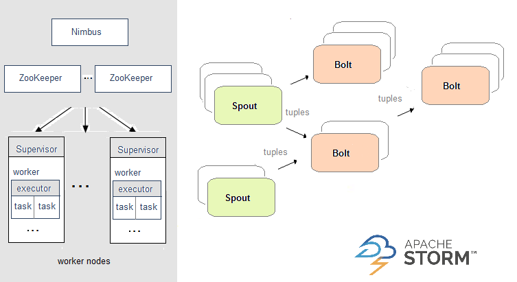

- Apache Spark

    Spark Streaming，即核心Spark API的扩展，不像Storm那样一次处理一个数据流。相反，它在处理数据流之前，会按照时间间隔对数据流进行分段切分。Spark针对连续数据流的抽象，我们称为DStream（Discretized Stream）。DStream是小批处理的RDD（弹性分布式数据集），RDD则是分布式数据集，可以通过任意函数和滑动数据窗口（窗口计算）进行转换，实现并行操作。

    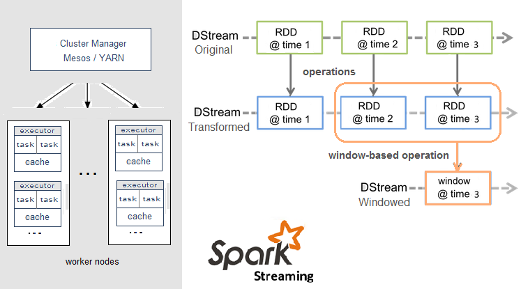

- Apache Flink

    针对流数据+批数据的计算框架。把批数据看作流数据的一种特例，延迟性较低（毫秒级），且能够保证消息传输不丢失不重复。

    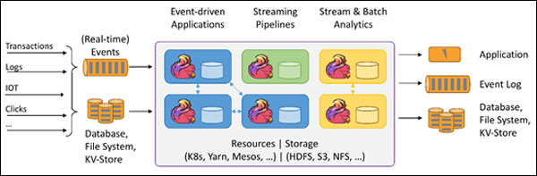

    Flink创造性的统一了流处理和批处理，作为流处理看待时输入数据流是无界的，而批处理被作为一种特殊的流处理，只是它的输入数据流被定义为有界的。Flink程序由Stream和Transformation这两个基本构建块组成，其中Stream是一个中间结果数据，而Transformation是一个操作，它对一个或多个输入Stream进行计算处理，输出一个或多个结果Stream。

这三种计算框架的对比如下：

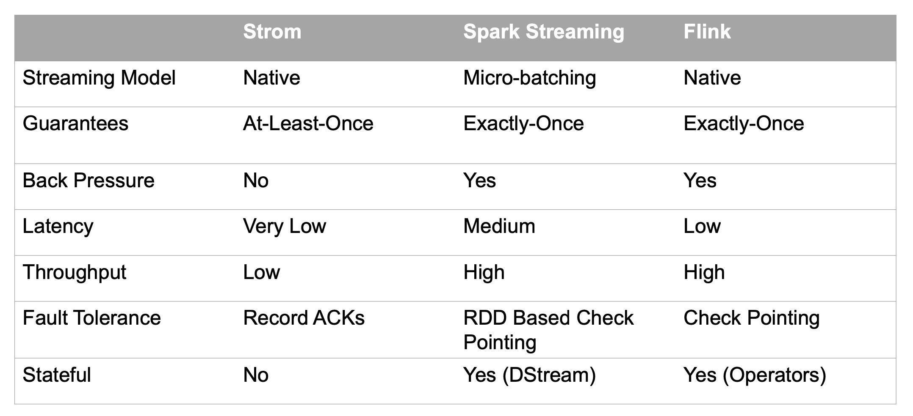

# 二、Spark VS Flink（上）

## 1. 下一代大数据计算引擎

自从数据处理需求超过了传统数据库能有效处理的数据量之后，Hadoop等各种基于MapReduce的海量数据处理系统应运而生。从2004年Google发表MapReduce论文开始，经过近10年的发展，基于Hadoop开源生态或者其它相应系统的海量数据处理已经成为业界的基本需求。

但是，很多机构在开发自己的数据处理系统时都会发现需要面临一系列的问题。从数据中获取价值需要的投入远远超过预期。常见的问题包括：

- 非常陡峭的学习曲线

    刚接触这个领域的人经常会被需要学习的技术的数量砸晕。不像经过几十年发展的数据库一个系统可以解决大部分数据处理需求，Hadoop等大数据生态里的一个系统往往在一些数据处理场景上比较擅长，另一些场景凑合能用，还有一些场景完全无法满足需求。结果就是需要好几个系统来处理不同的场景。

    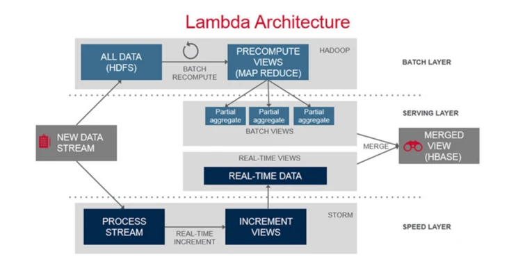

    上图是一个典型的lambda架构，只是包含了批处理和流处理两种场景，就已经牵涉到至少四五种技术了，还不算每种技术的可替代选择。在加上实时查询，交互式分析，机器学习等场景，每个场景都有几种技术可以选择，每个技术涵盖的领域还有不同方式的重叠。结果就是一个业务经常需要使用四五种以上的技术才能支持好一个完整的数据处理流程。加上调研选型，需要了解的数目还要多得多。

    下图是大数据领域的全景。有没有晕？

    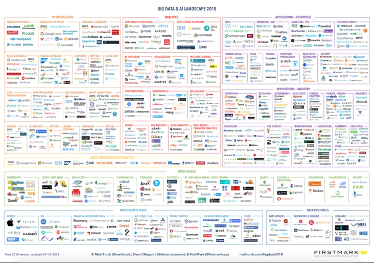

- 开发和运行效率低下

    因为牵涉到多种系统，每种系统有自己的开发语言和工具，开发效率可想而知。而因为采用了多套系统，数据需要在各个系统之间传输，也造成了额外的开发和运行代价，数据的一致也难以保证。在很多机构，实际上一半以上的开发精力花在了数据在各个系统之间的传输上。

- 复杂的运维

    多个系统，每个需要自己的运维，带来更高的运维代价的同时也提高了系统出问题的可能。

- 数据质量难以保证

    数据除了问题难以跟踪解决。

- 最后，还有人的问题

    在很多机构，由于系统的复杂性，各个子系统的支持和使用落实在不同部门负责。

    了解了这些问题以后，对Spark从2014年左右开始迅速流行就比较容易理解了。Spark在当时除了在某些场景比Hadoop MapReduce带来几十到上百倍的性能提升外，还提出了用一个统一的引擎支持批处理，流处理，交互式查询，机器学习等常见的数据处理场景。看过在一个Notebook里完成上述所有场景的Spark演示，对比之前的数据流程开发，对很多开发者来说不难做出选择。经过几年的发展，Spark已经被视为可以完全取代Hadoop中的MapReduce引擎。

    正在Spark如日中天高速发展的时候，2016年左右Flink开始进入大众的视野并逐渐广为人知。为什么呢？原来在人们开始使用Spark之后，发现Spark虽然支持各种常见场景，但并不是每一种都同样好用。数据流的实时处理就是其中相对较弱的一环。Flink凭借更优的流处理引擎，同时也支持各种处理场景，成为Spark的有力挑战者。

    Spark和Flink是怎么做到这些的，它们之间又有哪些异同，下面我们来具体看一下。

## 2. Spark和Flink的引擎技术

这一部分主要着眼于Spark和Flink引擎的架构方面，更看重架构带来的潜力和限制。现阶段的实现成熟度和局限会在后续生态盆探讨。

### 2.1 数据模型和处理模型

要理解Spark和Flink的引擎特点，首先从数据模型开始。

Spark的数据模型是弹性分布式数据集RDD（Resilient Distriuted Datasets）。比起MapReduce的文件模型，RDD是一个更抽象的模型，RDD靠血缘（lineage）等方式来保证可恢复性。很多时候RDD可以实现为分布式共享内存或者完全虚拟化（既有的中间结果RDD当下游处理完全在本地时可以直接优化省略掉）。这样可以省掉很多不必要的I/O，是早期Spark性能优势的主要原因。

Spark用RDD上的变换（算子）来描述数据处理。每个算子（如map，filter，join）生成一个新的RDD。所有的算子组成一个有向无环图（DAG）。Spark比较简单的把边分为宽依赖和窄依赖。上下游数据不需要shuffle的即窄依赖，可以把上下游的算子放在一个阶段（stage）里在本地连续处理，这时上游的结果RDD可以省略。下图展示了相关的基本概念。

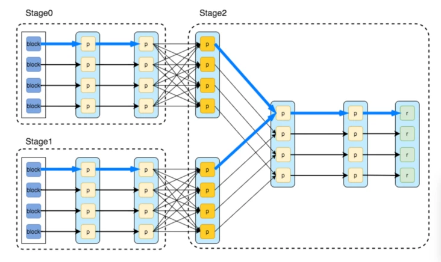

Flink的基本数据模型是数据流，即事件（Event）的序列。数据流作为数据的基本模型可能没有表或者数据块直观熟悉，但是可以证明是完全等效的。流可以是无边界的无限流，即一般意义上的流处理。也可以是有边界的有限流，这样就是批处理。

Flink用数据流上的变换（算子）来描述数据处理。每个算子生成一个新的数据流。在算子，DAG，和上下游算子链接（chaining）这些方面，和Spark大致等价。Flink的节点（vertex）大致相当于Spark的阶段（stage），划分也会和上图的Spark DAG基本一样。

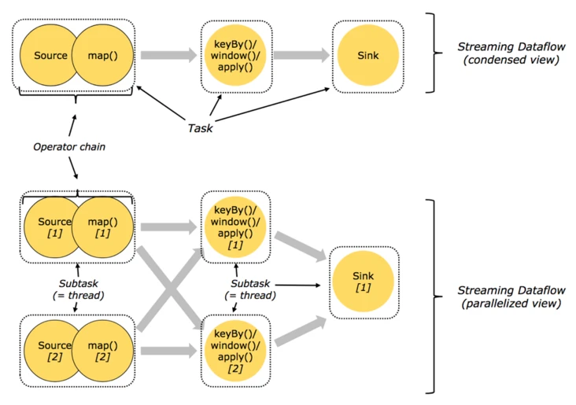

在DAG的执行上，Spark和Flink有一个比较显著的区别。在Flink的流执行模式中，一个事件在一个节点处理完后的输出就可以发到下一个节点立即处理。这样执行引擎并不会引入额外的延迟。与之相应的，所有节点的需要同时运行的。而Spark的micro batch和一般batch执行一样，处理完上游的stage得到输出之后才开始下游的stage。

在Flink的流执行模式中，为了提高效率也可以把多个事件放在一起传输或者计算。但这完全是执行时的优化，可以在每个算子独立决定，也不用像RDD等批处理模型中一样和数据集边界绑定，可以做更加灵活的优化同时可以兼顾低延迟需求。

Flink使用异步的checkpoint机制来达到任务状态的可恢复性，以保证处理的一致性，所以在处理的主流程上可以做到数据源和输出之间数据完全不用落盘，达到更高的性能和更低的延迟。

### 2.2 数据处理场景

除了批处理之外，Spark还支持实时数据流处理，交互式查询和机器学习，图计算等。

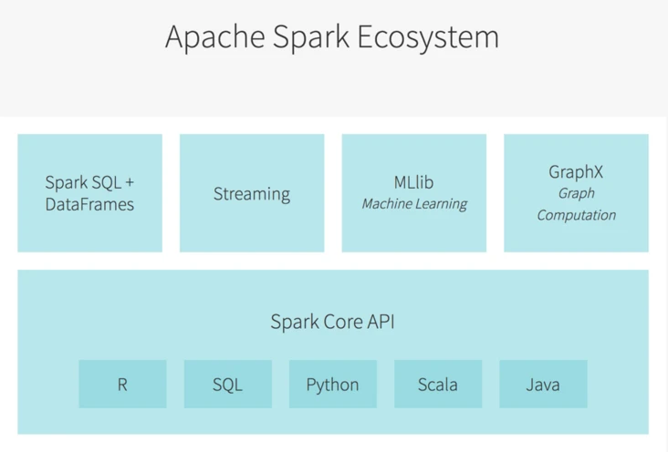

- 实时数据流处理和批处理主要区别就是对低延迟的要求。Spark因为RDD是基于内存的，可以比较容易切成较小的块来处理。如果能对这些小块处理的足够快，就能达到低延迟的效果。

- 交互式查询场景，如果数据能全在内存，处理的足够快的话，就可以支持交互式查询。

- 机器学习和图计算其实是和前几种场景不同的RDD算子类型。Spark提供了库莱支持常用的操作，用户或者第三方库也可以自己拓展。值得一提的是，Spark的RDD模型和机器学习模型训练的迭代计算非常契合，从一开始就在有的场景带来了非常显著的性能提升。

从这些可以看出来，比起Hadoop MapReduce，Spark本质上就是基于内存的更快的批处理。然后用足够快的批处理来实现各种场景。

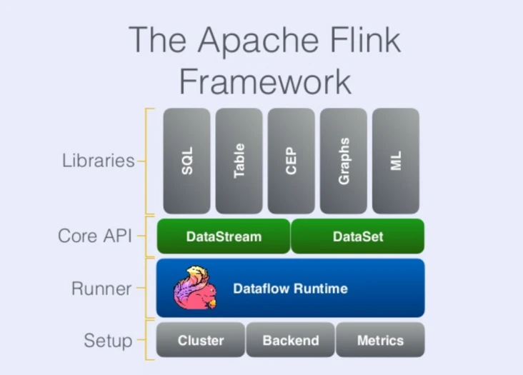

前面说过，在Flink中，如果输入数据流是边界的，就自然达到了批处理的效果。这样流和批的区别完全是逻辑上的，和处理实现独立，用户需要实现的逻辑也完全一样，应该是更干净的一种抽象。

Flink也提供了库来支持机器学习，图计算等场景。从这方面来说和Spark没有太大区别。

一个有意思的事情是用Flink的底层API可以支持只用Flink集群实现一些数据驱动的分布式服务。有一些公司用Flink集群实现了社交网络，网络爬虫等服务。这个也体现了Flink作为计算引擎的通用性，并得益于Flink内置的灵活的状态支持。

总的来说，Spark和Flink都瞄准了在一个执行引擎上同时支持大多数数据处理场景，也应该都能做到这一点。主要区别就在于因为架构本身的局限在一些场景会受到限制。比较突出的地方就是Spark Streaming的micro batch执行模式。Spark社区应该也意识到了这一点，最近在持续执行模式（continuous processing）方面开始发力。

### 2.3 有状态处理

Flink还有一个非常独特的地方是在引擎中引入了托管状态（managed state）。要理解托管状态，首先要从有状态处理说起。如果处理一个事件（或一条数据）的结果只跟事件本身的内容有关，称为无状态处理；反之结果还和之前处理过的事件有关，称为有状态处理。稍微复杂一点的数据处理，比如说基本的聚合，都是有状态处理。Flink很早就认为没有好的状态支持是做不好流处理的，因此引入了managed state并提供了API接口。

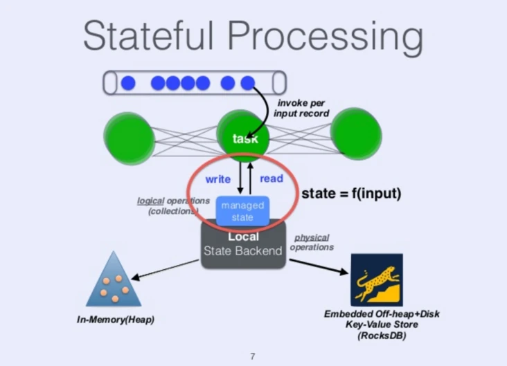

一般在流处理的时候会比较关注有状态处理，但是仔细看的话批处理也是会受到影响的。比如常见的窗口聚合，如果批处理的数据时间段比窗口大，是可以不考虑状态的，用户逻辑经常会忽略这个问题。但是当批处理时间段变得比窗口小的时候，一个批的结果实际上依赖于以前处理过的批。这时，因为批处理引擎一般没有这个需求不会有很好的内置支持，维护状态就成为了用户需要解决的事情。比如窗口聚合的情况用户就要加一个中间结果表记住还没有完成的窗口的结果。这样当用户把批处理时间段变短的时候就会发现逻辑变复杂了。这是早期Spark Streaming用户经常碰到的问题。知道Structured Streaming出来才得到缓解。

而像Flink这样以流处理为基本模型的引擎，因为一开始就避不开这个问题，所以引入了managed state来提供了一个通用的解决方案。比起用户实现的特定解决方案，不但用户开发更简单，而且能提供更好的性能。最重要的是能更好的保证处理结果的一致性。

简单来说，就是有一些内部的数据处理逻辑，在批处理中容易被忽略或简化处理掉也能得到可用的结果，而在流处理中问题被暴露出来解决掉了。所以流计算引擎用有限流来处理批在逻辑上比较严谨，能自然达到正确性。主要做一些不同的实现来优化性能就可以了。而用更小的批来模拟流需要处理一些以前没有的问题。当计算引擎还没有通用解决方案的时候就需要用户自己解决了。类似的问题还有维表的变化（比如用户信息的更新），批处理数据的边界和迟到数据等等。

### 2.4 编程模型

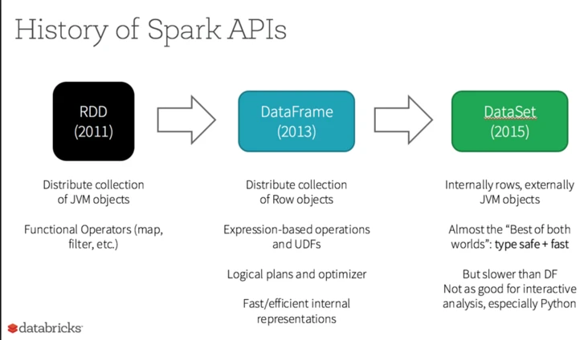

Spark的初衷之一就是用统一的变成模型来解决用户的各种需求。在这方面一直很下功夫。最初基于RDD的API就可以做各种类型的数据处理。后来为了简化用户开发，逐渐推出了更高层的DataFrame（在RDD中加了列变成结构化数据）和Datasets（在DataFrame的列上加了类型），并在Spark2.0中做了整合（DataFrame=DataSet[Row]）。Spark SQL的支持也比较早就引入了。在加上各个处理类型API的不断改进比如Structrued Streaming以及和机器学习深度学习的交互，到了今天Spark的API可以说是非常好用的，也是Spark最强的方面之一。

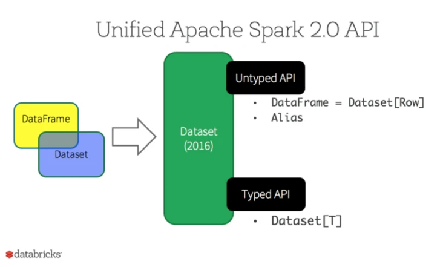

Flink的API也有类似的目标和发展路线。Flink和Spark的核心API可以说是基本对应的。今天Spark API总体上更完备，比如说最近一两年大力投入的机器学习和深度学习的整合方面。Flink在流处理相关方面还是领先一些，比如对watermark，window，trigger的各种支持。

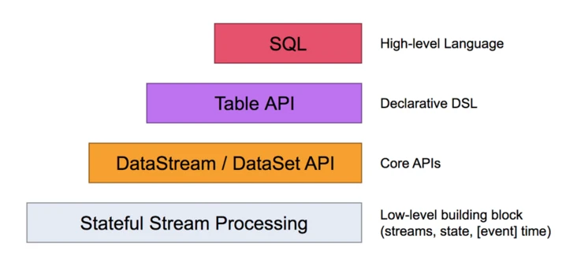

## 3. 小结

Spark和Flink都是通用的能够支持超大规模数据处理，支持各种处理类型的计算引擎。两个系统都有很多值得探讨的方面在这里没有触及，比如SQL的优化，和机器学习的集成等等。这里主要是试图从最基本的架构和设计方面来比较一下两个系统。因为上层的功能在一定程度上是可以互相借鉴的，有足够的投入应该都能做好。而基本的设计改变起来会伤筋动骨，更困难一些。

Spark和Flink的不同执行模型带来的最大的区别应该还是在对流计算的支持上。最开始Spark Streaming对流计算想的过于简单，对复杂一点的计算用起来会有不少问题。从Spark2.0开始引入的Structured Streaming重新整理了流计算的语义，支持按事件时间处理和端到端的一致性。虽然在功能上还有不少限制，比之前已经有了长足的进步。不过micro batch执行方式带来的问题还是存在，特别在规模上去以后性能会比较突出。最近Spark受一些应用场景的推动，也开始开发持续执行模式。

# 三、Spark VS Flink（下）

## 1. 统一分析平台

最近的Spark + AI峰会上，Databricks主打的主题是统一分析平台（Unified Analytics Platform）。三大新发布：Databricks delta、Databricks Runtime for ML和ML flow，都是围绕这一主题。随着近年来机器学习（包括深度学习）在数据处理中占比越来越高，可以说Databricks又一次把握住了时代的脉搏。

统一分析平台回应了Spark的初衷。经过几年的探索，对初始问题，即用户可以在一个系统里解决绝大部分大数据的需求，有了一个比较明确具体的解决方案。

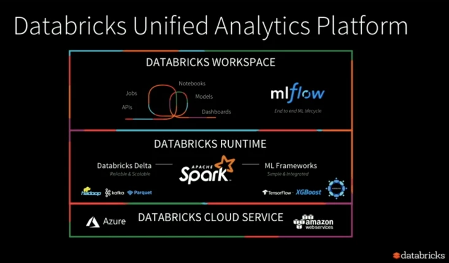

不过有意思的是可以看出Databricks在AI方面策略的转变。在深度学习流行前，Spark自带的MLLib功能上应该是够用的，但是可能是由于兼容性原因并没有取得预期中的广泛采用。

对深度学习的新宠Tensorflow，Spark曾经推出过TensorFrames和Spark引擎做了一些集成。结果应该不是很成功，可能还没有Yahoo从外面搭建的TensorflowOnSpark影响力大。

从这次来看，Spark转向了集成的策略。Databricks Runtime for ML实际上就是预装了各个机器学习框架，然后支持在Spark任务里启动一个比如Tensorflow自己的集群。Spark引擎方面做的主要改进就是gang scheduling，即支持一次申请多个executor以便Tensorflow集群能正常启动。

MLFlow更是和Spark引擎无关。作为一个工作流工具，MLFlow的目标是帮助数据科学家提高工作效率。主要功能是以项目为单位记录和管理所做的机器学习试验，并支持分享。设计要点是可重复试验，以及对各种工具的灵活易用的支持。看起来Spark暂时在作为AI引擎方面可能没什么大动作了。

Flink的目标其实和Spark很相似。包含AI的统一平台也是Flink的发展方向。Flink从技术上也是可以支持较好的机器学习继承和整条链路的，而且有一些大规模线上学习的使用实例。不过看起来在现阶段Flink这方面的平台化还没有Spark成熟。值得一提的是Flink由于流处理引擎的优势，在线上学习方面可能会支持的更好一些。

## 2. 数据使用者

产品和生态归根结底是要解决大数据使用者的问题，从数据中产生价值。了解数据的使用者和他们的需求可以帮助我们在讨论生态的各方面时有一个比较清晰的脉络。

数据相关的工作者大致可以分为以下角色。实际情况中一个组织里很可能几个角色在人员上是重合的。各个角色也没有公认的定义和明确的界限。

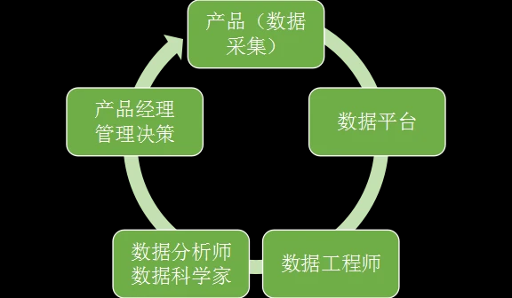

- 数据采集：在产品和系统中合适的地方产生或收集数据发送到数据平台。

- 平台：提供数据导入，存储，计算的环境和工具等等。

- 数据工程师：使用数据平台把原始数据加工成可以供后续高效使用的数据集。把分析师和数据科学家创建的指标和模型等等生产化成为高效可靠的自动处理。

- 数据分析师和数据科学家：为数据赋予意义，发现内含的价值。

- 产品经理，管理和决策层：根据以上产生的数据调整产品和组织行为。

这些构成了一个完整的环。上面的顺序是数据流动的方向，而需求的驱动是反过来的方向。

本文所说的Spark和Flink的生态主要是对应到数据平台这一层。直接面向的用户主要是数据工程师、数据分析师和数据科学家。好的生态能够大大简化数据平台和数据工程师的工作，并使得数据分析师和数据科学家更加爱自主化同时提高效率。

## 3. 开发环境

### 3.1 API

从API上来看，Spark和Flink提供的功能领域大致相当。当然具体看各个方向支持的成都会有差异。总体来看Spark的API经过几轮迭代，在易用性，特别是机器学习的集成方面，更强一些。Flink在流计算方面更成熟一些。

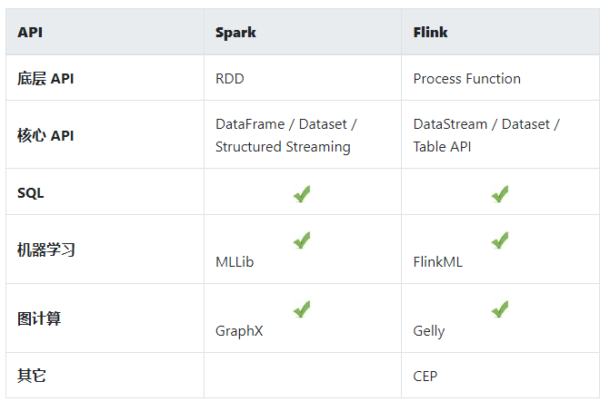

支持的语言也大致相当。Spark发展的实践长一些还是有优势，特别是数据分析常用的Python和R。

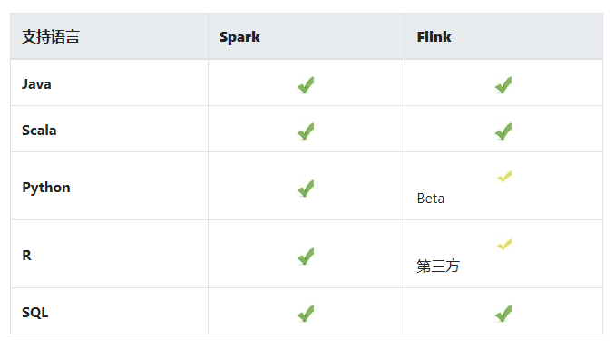

### 3.2 Connectors

有了API，再有数据就可以开工了。Spark和Flink都能对接大部分比较常用的系统。如果暂时还没有支持的，也都能比较好的支持自己写一个connector。

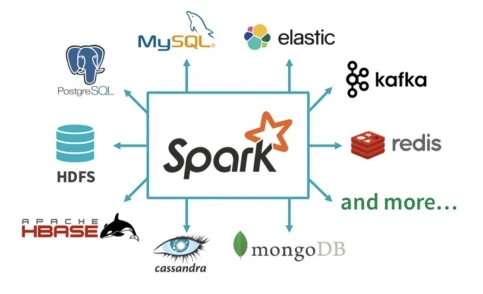

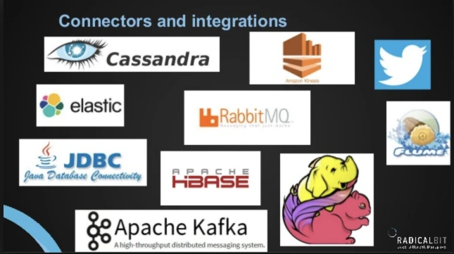

### 3.3 集成开发工具

这方面数据工程师和数据分析师的需求有一些不同。

数据分析的工作性质比较偏探索性，更强调交互性和分享。Notebook能比较好地满足这些需求，是比较理想的开发工具，用来做演示效果也相当不错。比较流程的Notebook有Apache Zeppelin，Jupyter等。Databricks更是自己开发了Databricks Notebook并将之作为服务的主要入口。Zeppelin支持Spark和Flink，Jupyter还只支持Spark。

数据工程师的工作更倾向于把比较确定的数据处理生产化，能快速把代码写出来是一方面。另外还有项目管理，版本管理，测试，配置，调试，部署，监控等等工作，需求和传统的集成开发工具比较相似。还经常出现需要服用已有的业务逻辑代码库的情况。Notebook对其中一些需求并不能很好的满足。比较理想的开发工具可能是类似IntelliJ加上Spark/Flink插件，再加上一些插件能直接提交任务到集群并进行调试，并对接Apache Oozie之类的工作流管理等等。在开源社区还没有见到能把这些集成在一起的。在商业茶品中倒是见过一些比较接近的。Spark和Flink在这方面差不多。

## 4. 运行环境

### 4.1 部署模式/集群管理/开源闭源

应用开发完后要提交到运行环境。Spark和Flink都支持各种主流的部署环境，在这方面都算做的比较好的。

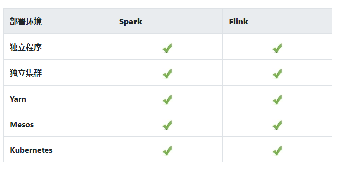

### 4.2 企业级平台

既然Spark和Flink都支持各种部署方式，那一个企业是否可以使用开源代码快速搭建一个支持Spark或者Flink的平台呢？

这个要看想要达到什么效果了。最简单的模式可能是给每个任务起一个独占集群，或者给小团队一个对立集群。这个确实可以很快做到，但是用户多了以后，统一运维的成本可能太高，需要用户参与运维。还有一个缺点是资源分配固定，而负载会有变化，导致资源利用率上不去。比较理想的是多租户的共享大集群，可以提高运维效率的同时最大限度地提高资源利用率。而这就需要一些列的工作，比如不同的作业提交方式，数据安全与隔离等等。对一些企业来说，可能利用托管服务（包括云服务）是一种值得考虑的开始方式。

## 5. 社区

Spark社区在规模和活跃度上都是领先的，毕竟多了几年发展时间。而且作为一个德国公司，Data Artisans想在美国扩大影响力要更难一些。不过Flink社区也有一批稳定的支持者，达到了可持续发展的规模。

## 6. 未来发展趋势

近两年一个明显的趋势就是机器学习在数据处理中的比重增长。Spark和Flink都能支持在一个系统中做机器学习和其它数据处理。谁能做的更好就能掌握先机。

另一个可能没有那么明显的趋势是，随着IOT的增长以及计算资源和网络的持续发展，实时处理需求会越来越多。现在其实正对低延迟有高追求的业务并没有那么多，所以每一次流计算新技术的出现都能看到那几家公司的身影。随着新应用场景的出现和竞争环境的发展，实时处理可能会变得越来越重要。Flink现在在这方面是领先的，如果发挥的好可以成为核心优势。

还有一点值得一提的是，因为用户不想锁定供应商，担心持续的支持等原因，是否开源已经成为用户选择数据茶品的一个重要考量。闭源产品如果没有决定性优势会越来越难和给予开源技术的产品竞争。

## 7. 总结

Spark和Flink都是通用的开源大规模处理引擎，目标是在一个系统中支持所有的数据处理以带来效能的提升。两者都有相对比较成熟的生态系统。是下一代大数据引擎最有力的竞争者。Spark的生态总体更完善一些，在机器学习的集成和易用性上暂时领先。Flink在流计算上有明显优势，核心架构和模型也更透彻和灵活一些。在易用性方面两者都还有一些地方有较大的改进空间。接下来谁能尽快补上短板发挥强项就有更多的机会。

# 四、Storm VS Flink

## 1. 背景

Apache Flink和Apache Storm是当前业界广泛使用的两个分布式实时计算框架。其中Apache Storm在美团点评实时计算业务中已有较为成熟的运用，有管理平台、常用API和相应的文档，大量实时作业基于Storm构建。而Apache Flink在近期备受关注，具有高吞吐、低延迟、高可靠和精确计算等特性，对事件窗口有很好的支持，目前在美团点评实时计算业务中也已有一定应用。

为了深入熟悉了解Flink框架，验证其稳定性和可靠性，评估其实时处理性能，识别该体系中的缺点，找到其性能瓶颈并进行优化，给用户提供最适合的实时计算引擎，我们以实践经验丰富的Storm框架作为对照，进行了一系列实验测试Flink框架的性能，计算Flink作为确保『至少一次』和『恰好一次』语义的实时计算框架时对资源的消耗，为实时计算平台资源规划、框架选择、性能调优等决策及Flink平台的建设提出建议并提供数据支持，为后续的SLA建设提供一定参考。

Flink和Storm两个框架对比：

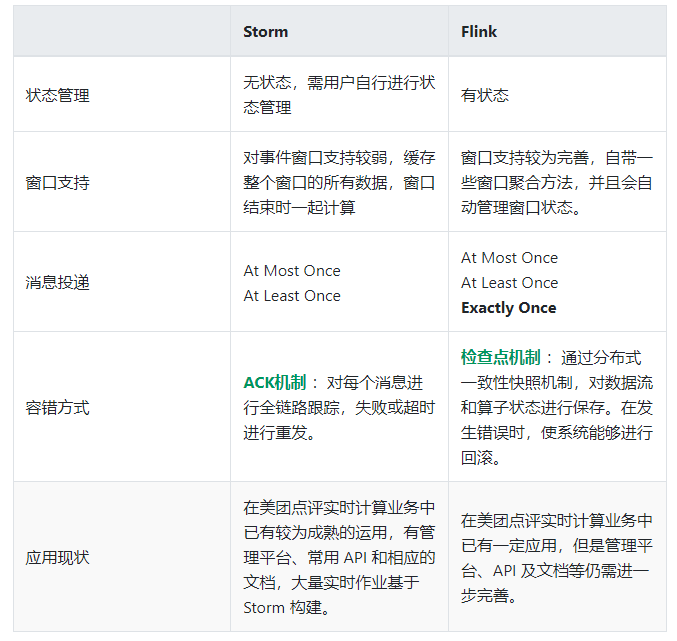

## 2. 测试目标

评估不同场景、不同数据压力下Flink和Storm两个实时计算框架的性能表现，获取其详细性能数据并找到处理性能的极限；了解不同配置对Flink性能影响的成都，分析各种配置的适用场景，从而得出调优建议。

### 2.1 测试场景

#### “输入-输出”简单处理场景

通过对“输入-输出”这样简单处理逻辑场景的测试，尽可能减少其它因素的干扰，反映两个框架本身的性能。

同时测算框架处理能力的极限，处理更加复杂的逻辑的性能不会比纯粹“输入-输出”更高。

#### 用户作业耗时较长的场景

如果用户的处理逻辑较为复杂，或是访问了数据库等外部组件，其执行时间会增大，作业的性能会受到影响。因此，我们测试了用户作业耗时较长的场景下两个框架的调度性能。

#### 窗口统计场景

实时计算中常有对时间窗口或计数窗口进行统计的需求，例如一天中每五分钟的访问量，每100个订单中有多少个使用了优惠等。Flink在窗口上的功能比Storm更加强大，API更加完善，但是我们同时也想了解在窗口统计这个场景下两个框架的性能。

#### 精确计算场景（即消息投递语义为『恰好一次』）

Storm仅能保证『至多一次』（At Most Once）和『至少一次』（At Least Once）的消息投递语义，即可能存在重复发送的情况。有很多业务场景对数据的精确性要求较高，希望消息投递不重不漏。Flink支持『恰好一次』（Exactly Once）语义，但是在限定的资源条件下，更加严格的精确度要求可能带来更高的代价，从而影响性能。因此，我们测试了在不同消息投递语义下两个框架的性能，希望为精确计算场景的资源规划提供数据参考。

### 2.2 性能指标

吞吐量（Throughput）

- 单位时间内计算框架成功的传送数据的数量，本次测试吞吐量的单位为：条/秒。

- 反映了系统的负载能力，在相应的资源条件下，单位时间内系统能处理多少数据。

- 吞吐量常用于资源规划，同时也用于协助分析性能瓶颈，从而进行相应的资源调整以保证系统能达到用户所要求的处理能力。假设商家每小时能做二十分午餐（吞吐量20份/小时），一个外卖小哥每小时只能送两份（吞吐量2份/小时），这个系统的瓶颈就在小哥配送这个环节，可以给该商家安排十个外卖小哥配送。

延迟（Latency）

- 数据从进入系统到流出系统所用的时间，本次测试延迟的单位为：毫秒。

- 反映了系统处理的实时性。

- 金融交易分析等大量实时计算业务对延迟有较高要求，延迟越低，数据实时性越强。

- 假设商家做一份午餐需要5分钟，小哥配送需要25分钟，这个流程中用户感受到了30分钟的延迟。如果更换配送方案后延迟变成了60分钟，等送到了饭菜都凉了，这个新的方案就是无法接受的。

## 3. 测试环境

为Storm和Flink分别搭建由1台主节点和2台从节点构成的Standalone集群进行本次测试。其中为了观察Flink在实际生产环境中的性能，对于部分测试内容也进行了on Yarn环境的测试。

### 3.1 集群参数

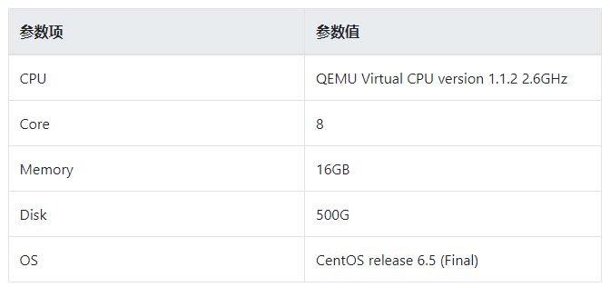

### 3.2 框架参数

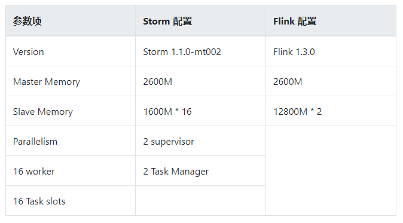

## 4. 测试方法

### 4.1 测试流程

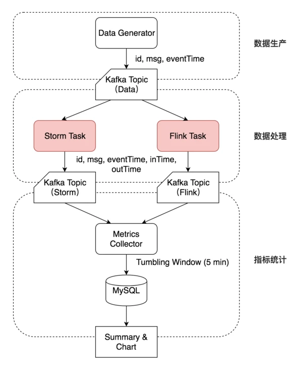

#### 数据生产

Data Generator按特定速率生产数据，带上自增的id和eventTime时间戳写入Kafka的一个Topic（Topic Data）。

#### 数据处理

Storm Task和Flink Task从Kafka Topic Data相同的Offset开始消费，并将结果及相应inTime、outTime时间戳分别写入两个Topic（Topic Storm和Topic Flink）中。

#### 指标统计

Metrics Collector按outTime的时间窗口从这两个Topic中统计测试指标，每五分钟将相应的指标写入MySQL表中。

Metrics Collector按outTIme取五分钟的滚动时间窗口，计算五分钟的平均吞吐（输出数据的条数）、五分钟内的延迟（outTime-eventTime或outTime-inTime）的中位数及99线等指标，写入MySQL相应的数据表中。最后对MySQL表中的吞吐计算均值，延迟中位数及延迟99线选取中位数，绘制图像并分析。

### 4.2 默认参数

- Storm和Flink默认均为At Least Once语义。

- Storm开启ACK，ACKer数量为1。

- Flink的Checkpoint时间间隔为30秒，默认StateBackend为Memory。

- 保证Kafka不是性能瓶颈，尽可能排除Kafka对测试结果的影响。

- 测试延迟时数据生产速率小于数据处理能力，假设数据被写入Kafka后立即被读取，即eventTime等于数据进入系统的时间。

- 测试吞吐量时从Kafka Topic的最旧开始读取，假设该Topic中的测试数据量充足。

### 4.3 测试用例

#### Identity

- Identity用例主要模拟“输入-输出”简单处理场景，反应两个

- 输入数据为“msgId，eventTime”，其中eventTime视为数据生成时间。单条输入数据约20B。

- 进入作业处理流程时记录inTime，作业处理完后记录outTime。

- 作业从Kafka Topic Data中却数据后，在字符串末尾追加时间戳，然后直接输出到Kafka。

- 输出数据为“msgId，eventTime，inTime，outTime”。单条输出数据约50B。

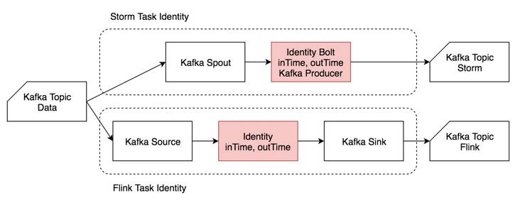

#### Sleep

- Sleep用例主要模拟用户作业耗时较长的场景，反映

- 输入数据和输出数据均与Identity相同。

- 读入数据后，等待一定时长（1ms）后再字符串末尾追加时间戳后输出。

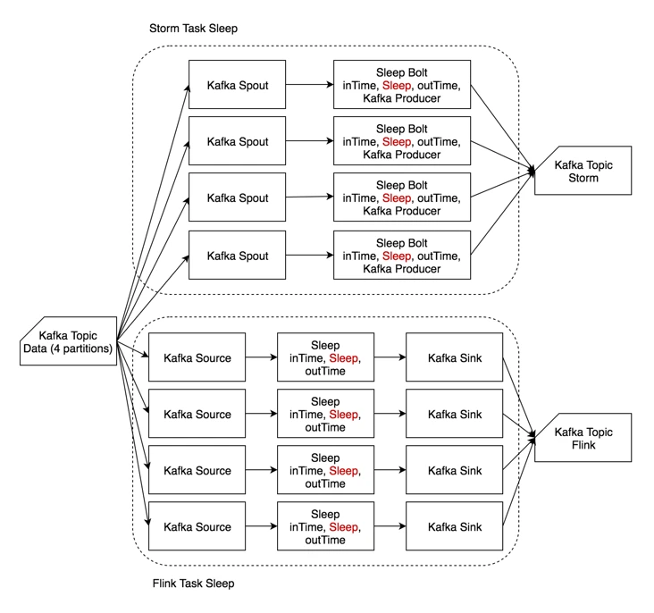

#### Windowed Word Count

- Windowed Word Count用例主要模拟窗口统计场景，反映两个

- 此外，还用其进行了精确计算场景的测试，反映Flink『恰好一次』投递的性能。

- 输入为JSON格式，包含msgId、eventTime和一个由若干单词组成的句子，单词之间由空格分隔。单条输入数据约150B。

- 读入数据后解析JSON，然后将句子分割为响应单词，带eventTime和inTime时间戳发给CountWindow进行单词计数，同时记录一个窗口中最大最小的eventTime和inTime，最后带outTime时间戳输出到Kafka相应的Topic。

- Spout/Souorce及OutputBolt/Output/Sink并发度恒为1，增大并发度时仅增大JSONParser、CountWindow的并发度。

- 由于Storm对window的支持较弱CountWindow使用一个HashMap手动实现，Flink用了原生的CountWindow和相应的Reduce函数。

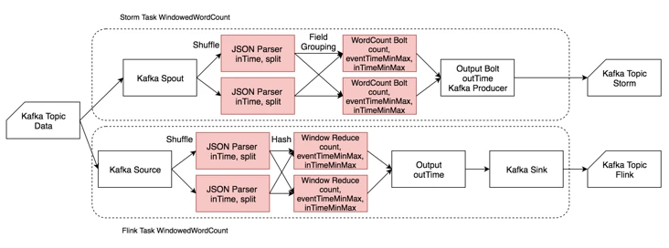

## 5. 测试结果

### 5.1 Identity单线程吞吐量

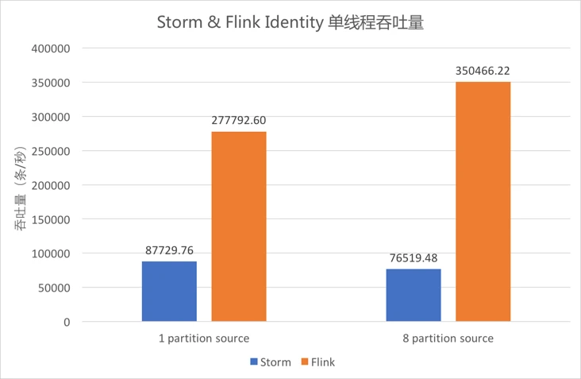

- 上图中蓝色柱形为单线程Storm作业的吞吐，橙色柱形为单线程Flink作业的吞吐。

- Identity逻辑下，Storm单线程吞吐为8.7万条/秒，Flink单线程吞吐可达35万条/秒。

- 当Kafka Data的Partition数为1时，Flink的吞吐约为Storm的3.2倍；当其Partition数为8时，Flink的吞吐约为Storm的4.6倍。

- 由此可以看出，Flink吞吐约为Storm3-5倍。

### 5.2 Identity单线程作业延迟

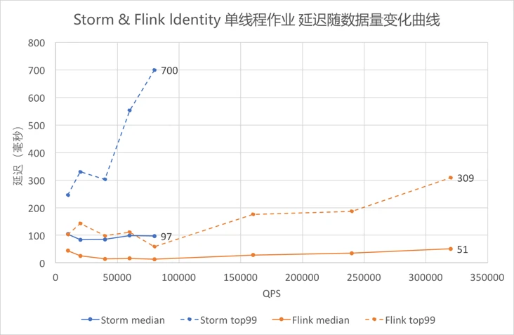

- 采用outTime-eventTime作为延迟，图中蓝色折线为Storm，橙色折线为Flink。虚线为99线，实线为中位数。

- 从图中可以看出随着数据量逐渐增大，Identity的延迟逐渐增大。其中99线的增大速度比中卫数快，Storm的增大速度比Flink快。

- 其中QPS在80000以上的测试数据超过了Storm单线程的吞吐能力，无法对Storm进行测试，只有Flink曲线。

- 对比折线最右端的数据可以看出，Storm QPS接近吞吐时延迟中位数约10毫秒，99线约700毫秒，Flink中位数约50毫秒，99线约300毫秒。Flink在满吞吐时的延迟约为Storm的一半。

### 5.3 Sleep吞吐量

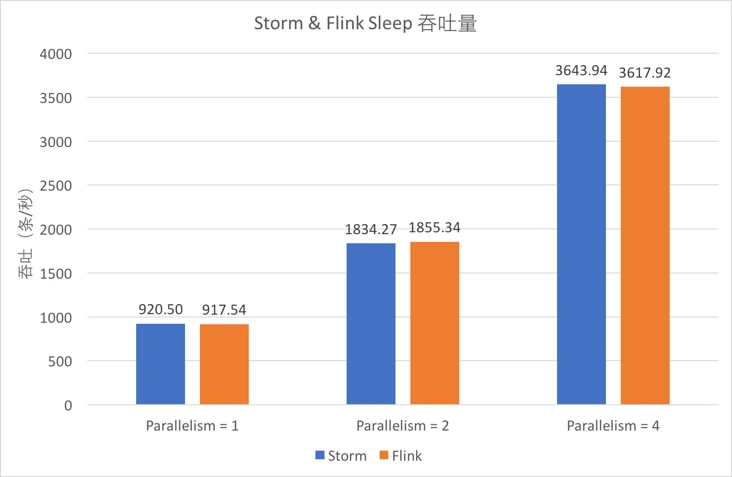

- 从图中可以看出，Sleep1毫秒时，Storm和Flink单线程的吞吐均在900条/秒左右，且随着并发增大基本呈线性增大。

- 对比蓝色和橙色的柱形可以发现，

### 5.4 Sleep单线程作业延迟（中位数）

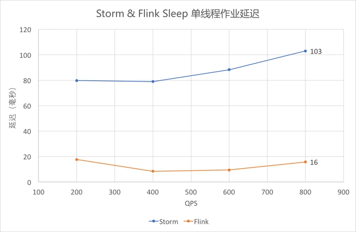

- 依然采用outTime-eventTime作为延迟，从图中可以看出，Sleep1毫秒时，Flink的延迟仍低于Storm。

### 5.5 Windowed Word Count单线程吞吐量

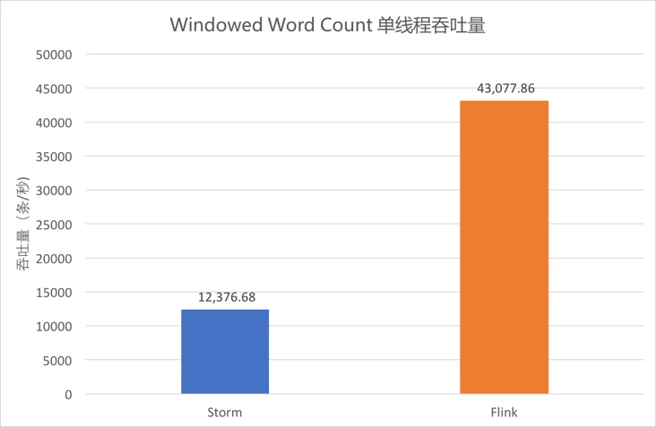

- 单线程执行大小为10的计数窗口，吞吐量统计如图。

- 从图中可以看出，Storm吞吐约为1.2万条/秒，Flink Standalone约为4.3万条/秒。

### 5.6 Windowed Word Count Flink At Least Once与Exactly Once吞吐量对比

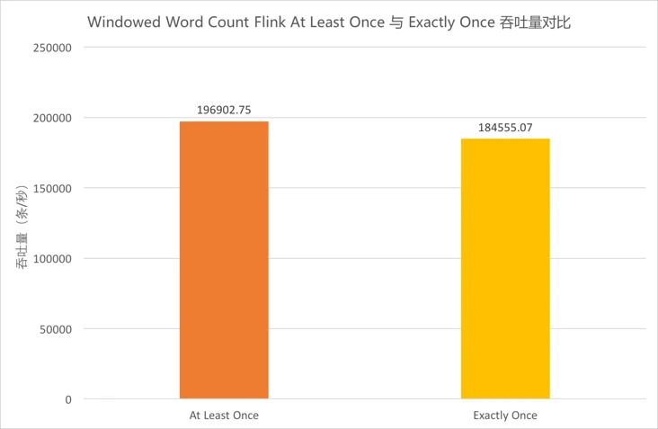

- 由于同一算子的多个并行任务处理速度可能不同，在上游算子中不同快照里的内容，经过中间并行算子的处理，到达下游算子时可能被计入同一个快照中。这样一来，这部分数据会被重复处理。因此，Flink在Exactly Once语义下需要进行对齐，即当前最早的快照中所有数据处理完之前，属于下一个快照的数据不进行处理，而是在缓冲区等待。当前测试用例中，在JSON Parser和CountWindow、CountWindow和Output之间均需要进行对齐，有一定消耗。为体现出对齐场景，Source/Output/Sink并发度仍为1，提高了JSONParser/CountWindow的并发度。

- 上图中橙色柱形为At Least Once的吞吐量，黄色柱形为Exactly Once的吞吐量，对比两者可以看出，在当前并发条件下，

### 5.7 Windowed Word Count Storm At Least Once与At Most Once吞吐量对比

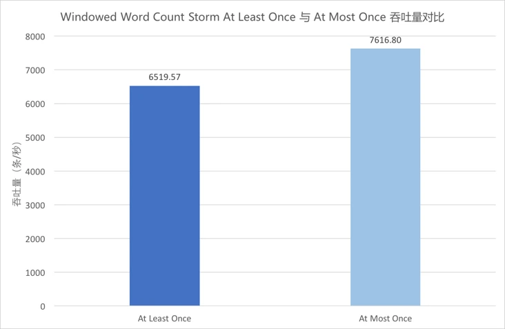

- Storm将ACKer数量设置为零后，每条消息在发送时就自动ACK，不再等待Bolt的ACK，也不再重发消息，为At Most Once语义。

- 上图中蓝色柱形为At Least Once的吞吐量，浅蓝色柱形为At Most Once的吞吐量。对比两者可以看出，在当前并发条件下，

### 5.8 Windowed Word Count单线程作业延迟

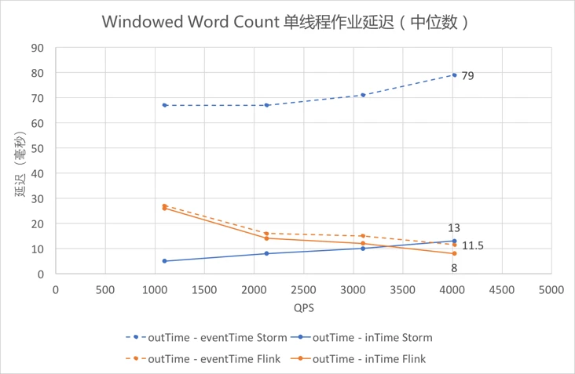

- Identity和Sleep观测的都是outTime-eventTime，因为作业处理时间较短或Thread.sleep()精度不高，outTime-inTime为零或没有比较意义；Windowed Word Count中可以有效的测得outTime-inTime的数值，将其与outTime-eventTime画在同一张图上，其中outTime-eventTime为虚线，outTime-inTime为实线。

- 观察橙色的两条折线可以发现，Flink用两种功能方式统计的延迟都维持在较低水平；观察两条蓝色的曲线可以发现，Storm的outTime-inTime较低，outTime-eventTime一直较高，即inTime和eventTime之间的差值一直较大，可能与Storm和Flink的数据读入方式有关。

- 蓝色折线表明Storm的延迟随数据量的增大而增大，而橙色折线表明Flink的延迟随着数据量的增大而减小（此处未测至Flink吞吐量，接近吞吐时延迟依然会上升）。

- 即使仅关注outTime-inTime，依然可以发现，

### 5.9 Windowed Word Count Flink At Least Once与Exactly Once延迟对比

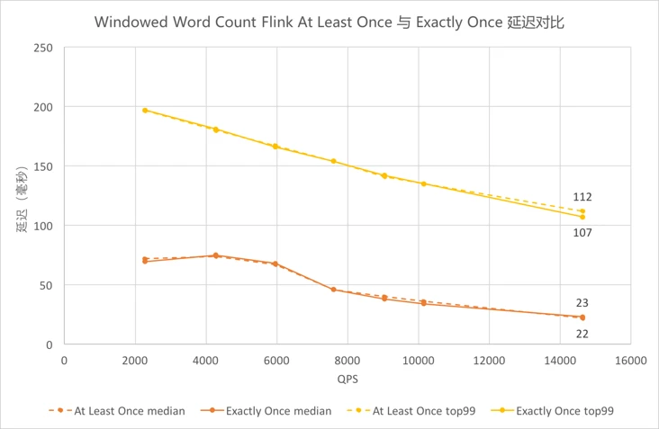

- 图中黄色为99线，橙色为中位数，虚线为At Least Once，实线为Exactly Once。图中相应颜色的虚实曲线都基本重合，可以看出

### 5.10 Windowed Word Count Storm At Least Once与At Most Once延迟对比

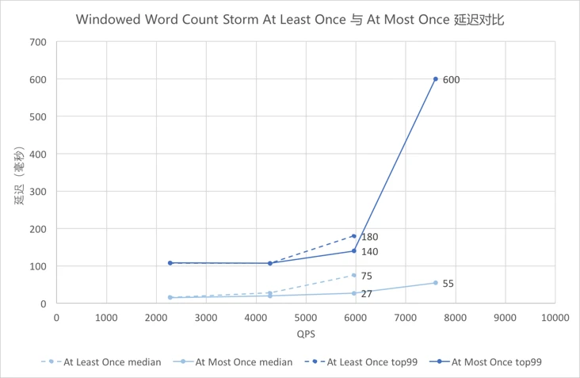

- 图中蓝色为9线，浅蓝色为中位数，虚线为At Least Once，实线为At Most Once。QPS在4000及以前的时候，虚线实线基本重合；QPS在6000时两者已有差异，虚线略高；QPS接近8000时，已超过At Least Once语义下Storm的吞吐，因此只有实线上的点。

- 可以看出，QPS较低时Storm At Most Once与At Least Once的延迟观察不到差异，

### 5.11 Windowed Word Cont Flink不同StateBackends吞吐量对比

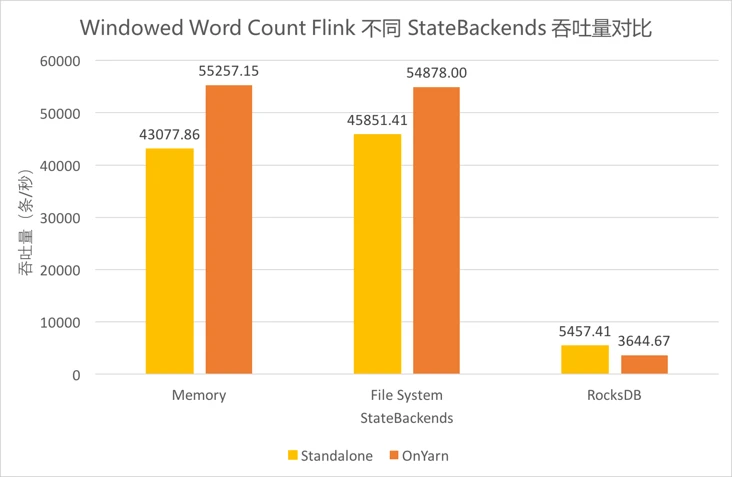

- Flink支持Standalone和on Yarn的集群部署模式，同时支持Memory、FileSystem、RocksDB三种状态存储后端（StateBackends）。由于线上作业需要，测试了这三种StateBackends在两种集群部署模式上的性能差异。其中，Standalone时的存储路径为JobManager上的一个文件目录，on Yarn时存储路径为HDFS上一个文件目录。

- 对比三组柱形可以发现，

- 对比两种颜色可以发现，

### 5.12 Windowed Word Count Flink不同StateBackends延迟对比

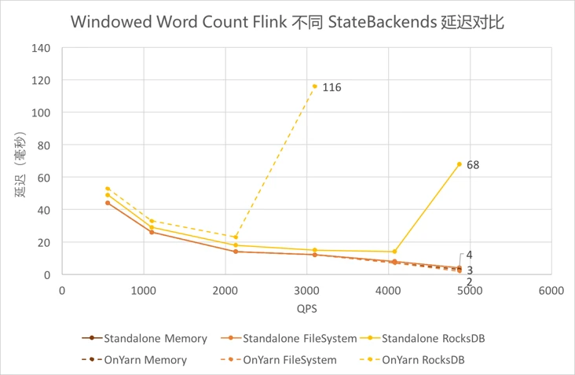

- 使用FileSystem和Memory作为Backends时，延迟基本一致且较低。

- 使用RocksDB作为Backends时，延迟稍高，且由于吞吐较低，在到达吞吐瓶颈前的延迟陡增。其中on Yarn模式下吞吐更低，接近吞吐时的延迟最高。

## 6. 结论及建议

### 6.1 框架本身性能

- 由5.1、5.5的测试结果可以看出，Storm单线程吞吐约为8.7万条/秒，Flink单线程吞吐可达35万条/秒。Flink吞吐约为Storm的3-5倍。

- 由5.2、5.8的测试结果可以看出，Storm QPS接近吞吐时延迟中位数约为100毫秒，99线誉为700毫秒，Flink中位数约50毫秒，99线约300毫秒。Flink在满吞吐时的延迟约为Storm的一半，且随着QPS逐渐增大，Flink在延迟上的优势开始体现出来。

- 综上可得，

### 6.2 复杂用户逻辑对框架差异的削弱

- 对比5.1和5.3、5.2和5.4的 测试结果可以发现，单个Bolt Sleep时长达到1毫秒时，Flink的延迟仍低于Storm，但吞吐优势已基本无法体现。

- 因此，用户逻辑越复杂，本身耗时越长，针对该逻辑的测试体现出来的框架的差异越小。

### 6.3 不同消息投递语义的差异

- 由 5.6、5.7、5.9、5.10 的测试结果可以看出，Flink Exactly Once 的吞吐较 At Least Once 而言下降 6.3%，延迟差异不大；Storm At Most Once 语义下的吞吐较 At Least Once 提升 16.8%，延迟稍有下降。

- 由于 Storm 会对每条消息进行 ACK，Flink 是基于一批消息做的检查点，不同的实现原理导致两者在 At Least Once 语义的花费差异较大，从而影响了性能。而 Flink 实现 Exactly Once 语义仅增加了对齐操作，因此

### 6.4 Flink 状态存储后端选择

Flink 提供了内存、文件系统、RocksDB 三种 StateBackends，结合 5.11、5.12 的测试结果，三者的对比如下：

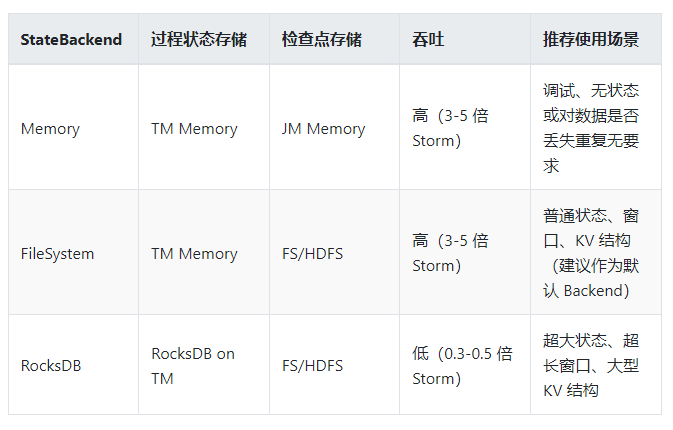

### 6.5 推荐使用 Flink 的场景

综合上述测试结果，以下实时计算场景建议考虑使用 Flink 框架进行计算：

- 要求消息投递语义为

- 数据量较大，要求

- 需要进行

## 7. 展望

- 本次测试中尚有一些内容没有进行更加深入的测试，有待后续测试补充。例如：

- Exactly Once 在并发量增大的时候是否吞吐会明显下降？

- 用户耗时到 1ms 时框架的差异已经不再明显（Thread.sleep() 的精度只能到毫秒），用户耗时在什么范围内 Flink 的优势依然能体现出来？

- 本次测试仅观察了吞吐量和延迟两项指标，对于系统的可靠性、可扩展性等重要的性能指标没有在统计数据层面进行关注，有待后续补充。

- Flink 使用 RocksDBStateBackend 时的吞吐较低，有待进一步探索和优化。

- 关于 Flink 的更高级 API，如 Table API & SQL 及 CEP 等，需要进一步了解和完善。