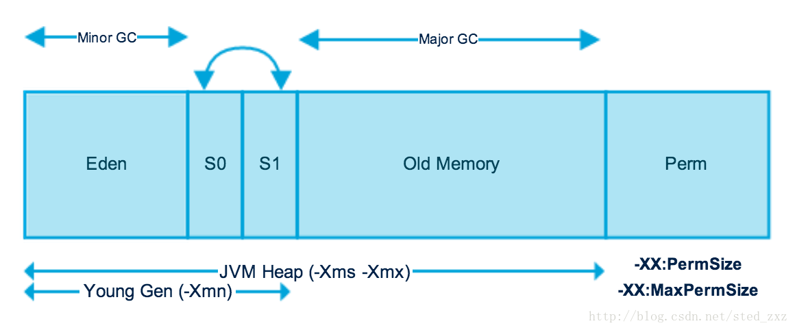

# GC机制

Jvm区域总体分两类，heap区和非heap区。heap区又分：Eden Space（伊甸园）、Survivor Space(幸存者区)、Tenured Gen（老年代-养老区）。 非heap区又分：Code Cache(代码缓存区)、Perm Gen（永久代）、Jvm Stack(java虚拟机栈)、Local Method Statck(本地方法栈)。

**HotSpot虚拟机GC算法采用分代收集算法：**

> 一个人（对象）出来（new 出来）后会在Eden Space（伊甸园）无忧无虑的生活，直到GC到来打破了他们平静的生活。GC会逐一问清楚每个对象的情况，有没有钱（此对象的引用）啊，因为GC想赚钱呀，有钱的才可以敲诈嘛。然后富人就会进入Survivor Space（幸存者区），穷人的就直接kill掉。
> 并不是进入Survivor Space（幸存者区）后就保证人身是安全的，但至少可以活段时间。GC会定期（可以自定义）会对这些人进行敲诈，亿万富翁每次都给钱，GC很满意，就让其进入了Genured Gen(养老区)。万元户经不住几次敲诈就没钱了，GC看没有啥价值啦，就直接kill掉了。
> 进入到养老区的人基本就可以保证人身安全啦，但是亿万富豪有的也会挥霍成穷光蛋，只要钱没了，GC还是kill掉。

**简单来讲，jvm的内存回收过程是这样的：**

> 对象在Eden Space创建，当Eden Space满了的时候，gc就把所有在Eden Space中的对象扫描一次，把所有有效的对象复制到第一个Survivor Space，同时把无效的对象所占用的空间释放。当Eden Space再次变满了的时候，就启动移动程序把Eden Space中有效的对象复制到第二个Survivor Space，同时，也将第一个Survivor Space中的有效对象复制到第二个Survivor Space。如果填充到第二个Survivor Space中的有效对象被第一个Survivor Space或Eden Space中的对象引用，那么这些对象就是长期存在的，此时这些对象将被复制到Permanent Generation。
> 
> 若垃圾收集器依据这种小幅度的调整收集不能腾出足够的空间，就会运行Full GC，此时jvm gc停止所有在堆中运行的线程并执行清除动作。

# 年轻代

年轻代用来存放新近创建的对象，尺寸随堆大小的增大和减小而相应的变化，默认值是保持为堆大小的1/15，可以通过 -Xmn 参数设置年轻代为固定大小，也可以通过 -XX:NewRatio 来设置年轻代与年老代的大小比例，年青代的特点是对象更新速度快，在短时间内产生大量的“死亡对象”。

年轻代的特点是产生大量的死亡对象,并且要是产生连续可用的空间, 所以使用复制清除算法和并行收集器进行垃圾回收.对年轻代的垃圾回收称作初级回收 (minor gc)。

初级回收将年轻代分为三个区域, 一个新生代 , 2个大小相同的复活代, 应用程序只能使用一个新生代和一个复活代, 当发生初级垃圾回收的时候,gc挂起程序, 然后将新生代和复活代中的存活对象复制到另外一个非活动的复活代中,然后一次性清除新生代和复活代，将原来的非复活代标记成为活动复活代。将在指定次数回收后仍然存在的对象移动到老年代中，初级回收后，得到一个空的可用的新生代。

新生代几乎是所有 Java 对象出生的地方，即 Java 对象申请的内存以及存放都是在这个地方。Java 中的大部分对象通常不需长久存活，具有朝生夕灭的性质。 当一个对象被判定为 “死亡” 的时候，GC 就有责任来回收掉这部分对象的内存空间。新生代是 GC 收集垃圾的频繁区域。 当对象在 Eden 出生后，在经过一次 Minor GC 后，如果对象还存活，并且能够被另外一块 Survivor 区域所容纳，则使用复制算法将这些仍然还存活的对象复制到另外一块 Survivor 区域中，然后清理所使用过的 Eden 以及 Survivor 区域，并且将这些对象的年龄设置为1，以后对象在 Survivor 区每熬过一次 Minor GC，就将对象的年龄 + 1，当对象的年龄达到某个值时 ( 默认是 15 岁，可以通过参数 -XX:MaxTenuringThreshold 来设定 )，这些对象就会成为老年代。 但这也不是一定的，对于一些较大的对象 ( 即需要分配一块较大的连续内存空间 ) 则是直接进入到老年代。

# 老年代

Full GC 是发生在老年代的垃圾收集动作，所采用的是标记-清除算法。

现实的生活中，老年代的人通常会比新生代的人 “早死”。堆内存中的老年代(Old)不同于这个，老年代里面的对象几乎个个都是在 Survivor 区域中熬过来的，它们是不会那么容易就 “死掉” 了的。因此，Full GC 发生的次数不会有 Minor GC 那么频繁，并且做一次 Full GC 要比进行一次 Minor GC 的时间更长。 另外，标记-清除算法收集垃圾的时候会产生许多的内存碎片 ( 即不连续的内存空间 )，此后需要为较大的对象分配内存空间时，若无法找到足够的连续的内存空间，就会提前触发一次 GC 的收集动作。

# 永久代/元空间

永久代是Hotspot虚拟机特有的概念，是方法区的一种实现，别的JVM都没有这个东西。在Java 8中，永久代被彻底移除，取而代之的是另一块与堆不相连的本地内存——元空间。 

永久代或者“Perm Gen”包含了JVM需要的应用元数据，这些元数据描述了在应用里使用的类和方法。注意，永久代不是Java堆内存的一部分。永久代存放JVM运行时使用的类。永久代同样包含了Java SE库的类和方法。永久代的对象在full GC时进行垃圾收集。

# 典型GC方式

1. Serial收集器

一个单线程的收集器，在进行垃圾收集时候，必须暂停其他所有的工作线程直到它收集结束。

特点：CPU利用率最高，停顿时间即用户等待时间比较长。

适用场景：小型应用

通过JVM参数-XX:+UseSerialGC可以使用串行垃圾回收器。

2. Parallel收集器

采用多线程来通过扫描并压缩堆

特点：停顿时间短，回收效率高，对吞吐量要求高。

适用场景：大型应用，科学计算，大规模数据采集等。

通过JVM参数 XX:+USeParNewGC 打开并发标记扫描垃圾回收器。

3. CMS收集器

采用“标记-清除”算法实现，使用多线程的算法去扫描堆，对发现未使用的对象进行回收。

（1）初始标记

（2）并发标记

（3）并发预处理

（4）重新标记

（5）并发清除

（6）并发重置

特点：响应时间优先，减少垃圾收集停顿时间

适应场景：服务器、电信领域等。

通过JVM参数 -XX:+UseConcMarkSweepGC设置

4. G1收集器

在G1中，堆被划分成 许多个连续的区域(region)。采用G1算法进行回收，吸收了CMS收集器特点。

特点：支持很大的堆，高吞吐量

  --支持多CPU和垃圾回收线程

  --在主线程暂停的情况下，使用并行收集

  --在主线程运行的情况下，使用并发收集

实时目标：可配置在N毫秒内最多只占用M毫秒的时间进行垃圾回收

通过JVM参数 –XX:+UseG1GC 使用G1垃圾回收器