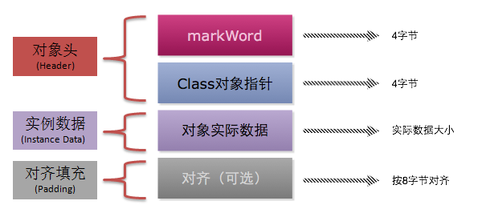

### 线程的6种状态

#### 1. 初始(NEW)

新创建了一个线程对象，但还没有调用start()方法。


#### 2. 运行(RUNNABLE)

Java线程中将就绪（ready）和运行中（running）两种状态笼统的称为“运行”。
线程对象创建后，其他线程(比如main线程）调用了该对象的start()方法。该状态的线程位于可运行线程池中，等待被线程调度选中，获取CPU的使用权，此时处于就绪状态（ready）。就绪状态的线程在获得CPU时间片后变为运行中状态（running）。


#### 3. 阻塞(BLOCKED)

表示线程阻塞于锁。


#### 4. 等待(WAITING)

进入该状态的线程需要等待其他线程做出一些特定动作（通知或中断）。


#### 5. 超时等待(TIMED_WAITING)

该状态不同于WAITING，它可以在指定的时间后自行返回。


#### 6. 终止(TERMINATED)

表示该线程已经执行完毕。


### synchronized关键字

#### 1. 同步块不应该加在String或基本包装类型上

如Byte、Short、Integer、Long、Float、Double、Boolean、Character等会产生多个对象导致锁失效。


#### 2. 锁的是对象而不是代码

#### 3. 锁升级

1. 偏向锁

无实际竞争，且将来只有第一个申请锁的线程会使用锁。


1. 自旋锁

无实际竞争，多个线程交替使用锁；允许短时间的锁竞争。

- Q：对象的内存布局？
HotSpot虚拟机中，对象在内存中存储的布局可以分为三块区域：对象头（Header）、实例数据（Instance Data）和对齐填充（Padding）。




- Mark Word(标记字段)：对象的Mark Word部分占4个字节，其内容是一系列的标记位，比如轻量级锁的标记位，偏向锁标记位等等。

- Klass Pointer（Class对象指针）：Class对象指针的大小也是4个字节，其指向的位置是对象对应的Class对象（其对应的元数据对象）的内存地址


- 对象实际数据：这里面包括了对象的所有成员变量，其大小由各个成员变量的大小决定，比如：byte和boolean是1个字节，short和char是2个字节，int和float是4个字节，long和double是8个字节，reference是4个字节


- 对齐：最后一部分是对齐填充的字节，按8个字节填充。


1. 重量级锁

有实际竞争，且锁竞争时间长。


- Q：何时用lock何使用synchronized？
并发量小，且锁住的代码运行时间短用lock
并发量大，且所著的代码运行时间长用synchronized


### volatile关键字

#### 1. 保证线程可见性

通过缓存一致性协议（MESI）实现

- Q：什么是缓存一致性协议？
当CPU写数据时，如果发现操作的变量是共享变量，即在其他CPU中也存在该变量的副本，会发出信号通知其他CPU将该变量的缓存行置为无效状态，因此当其他CPU需要读取这个变量时，发现自己缓存中缓存该变量的缓存行是无效的，那么它就会从内存重新读取。


#### 2. 禁止指令重排序

- Q：什么是指令重排序？
处理器为了提高程序运行效率，可能会对输入代码进行优化，它不保证程序中各个语句的执行先后顺序同代码中的顺序一致，但是它会保证程序最终执行结果和代码顺序执行的结果是一致的


### Atomic*

#### 1. 使用CAS（无锁优化 自旋）实现

- Q：什么是CAS？
Compare and swap，即比较并交换，也是实现我们平时所说的自旋锁或乐观锁的核心操作。


```java
cas(V,Expected,New)
if  V == Expected
    V = New
else
    try again or fail
```

#### 2. ABA问题

- Q：什么是ABA问题？
一个线程把数据A变为了B，然后又重新变成了A。此时另外一个线程读取的时候，发现A没有变化，就误以为是原来的那个A。
如果是基础类型，不用考虑ABA问题。
如果是引用类型，可以使用AtomicStampedReference，增加版本号信息解决。

