# Class文件数据类型

Class文件是一组以字节为基础单位的二进制流。

根据Java虚拟机规范的规定，Class文件格式采用一种类似于C语言结构体的伪结构来存储数据，这种伪结构中只有两种数据类型，无符号数和表。

- 无符号数

无符号数属于基本的数据类型，以u1、u2、u4、u8来分别代表1个字节、2个字节、4个字节和8个字节；无符号数可以用来描述数字、索引引用、数量值或者按照UTF-8编码构成的字符串值。

- 表

表是由多个无符号数或者其他表作为数据项构成的复合数据类型，所有表都习惯性地以“info”结尾。表用于表述有层次关系的复合结构的数据，整个Class文件本质上就是一张表。

# Class文件格式示意图

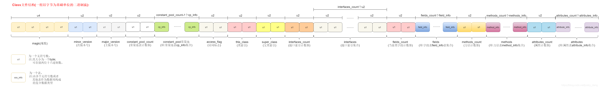

上图中的u、info均表示数据类型，而不代表数据本身；我们可以任意打开一个Class文件，如下：

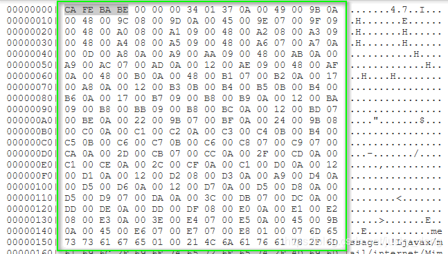

上图中被绿色框圈起来的则为标准的Class文件的样子（与示意图相比，只是有换行而已）。左侧为软件本身提供的辅助信息，记录当前行前面总共有多少个字节（或者说多少个u1），用于快速定位数据（通过数据偏移量的方式，例如当前u2数据的数据偏移量是0x00000012，那么就可以定位到这两个字节数据分别在字节数组的第19个和第20个），右侧为直接以编辑器打开Class文件的样子。

查看Class文件结构，可使用JDK自带的javap指令，也可以使用WinHex等工具，此例使用的是classpy。

# Class文件所含内容汇总

| 名称 | 数据类型（无符号数/表） | 数量 | 
| -- | -- | -- |
| magic（魔数） | u4 | 1 | 
| minor_version（次版本号） | u2 | 1 | 
| major_version（主版本号） | u2 | 1 | 
| constant_pool_count（常量池表计数器） | u2 | 1 | 
| constant_pool常量池（常量池表cp_info集合） | cp_info集合 | constant_pool_count - 1 | 
| access_flag（访问标志） | u2 | 1 | 
| this_class（类索引） | u2 | 1 | 
| super_class（父类索引） | u2 | 1 | 
| interfaces_count（接口索引计数器） | u2 | 1 | 
| interfaces（接口索引） | u2 | interfaces_count | 
| fields_count（当前类字段设计器） | u2 | 1 | 
| fields（字段表field_info表集合） | field_info集合 | fields_count | 
| methods_count（方法计数器） | u2 | 1 | 
| methods（方法表method_info集合） | method_info集合 | methods_count | 
| attributes_count（属性计数器） | u2 | 1 | 
| attributes（属性表attributes_info集合） | attributes_info集合 | attributes_count | 


## **魔数**

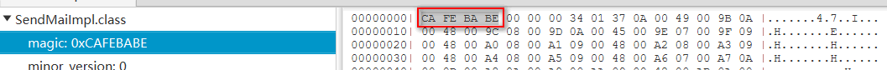

```
每个Class文件的前4个字节称为魔数（Magic Number），它的唯一作用是确定这个文件是否为一个能被虚拟机接受的Class文件。所有Class文件，魔数均为0xCAFEBABE。
不仅仅是Class文件，还有很多文件（如gif、jpeg等）都是以魔数（而不是后缀名）来进行身份识别的。
```

## **次版本号、主版本号**

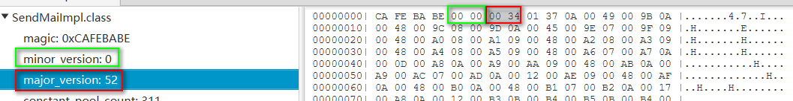

Class文件中第五、六个字节存储的是次版本号（minor version），第七、八个字节存储的是主版本号（major version）。假设Class文件的版本号十进制下为45.3，那么major version在十进制下为45，minor version在十进制下为3。

Class文件能够被版本号对应JDK版本（或比对应版本高）的JDK加载，不能被比对应JDK版本低的JDK加载。JDK中的版本号是从45开始的，每个JDK的target参数的值对应一个主版本号如下：

| JDK的target参数值 | 十进制Class版本号 | 
| -- | -- |
| -target 1.1 | 45 | 
| -target 1.2 | 46 | 
| -target 1.3 | 47 | 
| -target 1.4 | 48 | 
| -target 1.5 | 49 | 
| -target 1.6 | 50 | 
| -target 1.7 | 51 | 
| -target 1.8 | 52 | 


## **常量池计数器、常量池**

常量池可以理解为Class文件中的资源仓库，它是Class文件结构中与其他项目关联最多的数据类型，也是占用Class文件空间最多的数据项目之一，同时它还是Class文件中第一个出现的表类型数据项目。

### **常量池计数器**

由于常量池中的常数的数量是不固定的，所以在常量池的入口放置了一个u2类型的数据，来代表常量池容器计数值（constant_pool_count）。

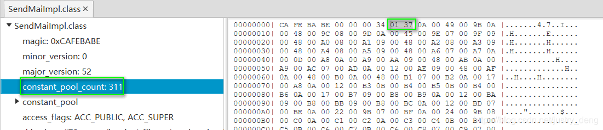

由于constant_pool_count数据类型为u2，所以constant_pool_count不能超过65535。

常量池计数器默认从1开始而不是从0开始，当constant_pool_count=1时，常量池中的cp_info个数为0，当constant_pool_count为n时，常量池中的cp_info个数为n-1。

在制定Class文件规范的时候，将索引#0项空出来是有特殊考虑的，当某些数据在特定的情况下想表达“不引用任何一个常量池项”的意思时，就可以将其引用的常量的索引值设置为#0来表示。可以参考下面这个概念图来辅助理解：

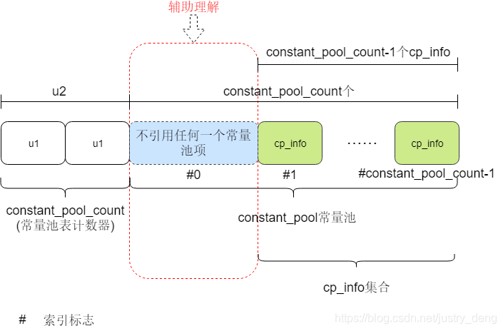

### **常量池**

常量池紧随着常量池计数器（由于常量池数据太长，以下仅展示部分）：

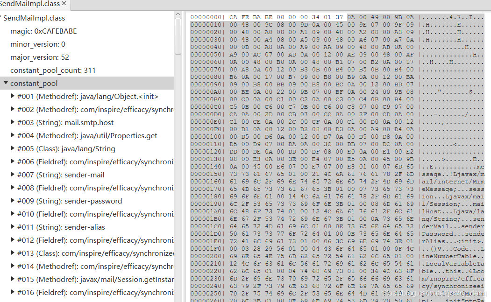

常量池中主要存放着两种常量，字面量（Literal）和符号引用（Synbolic References）。

- 字面量包括：文本字符、声明为final的常量值、基础数据类型的值等。

- 符号引用包括：类和接口的全限定名、字段的名称和描述符、方法的名称和描述符。

全限定类名中的“.”会被“/”替代，存储进常量池中。如“com.aspire.water.MyClass”存进常量池中为“com/aspire/water/MyClass”。

常量池中存储着最基本的信息，不仅程序中（将常量池加载为运行时常量池）会用到该信息，Class文件本身的一些地方，也会通过#索引的方式用到常量池中的值。

**符号引用与直接引用**

符号引用在javac编译时产生，完全符合Java虚拟机规范。编译产生Class文件，而Class文件此时还没有被JVM加载，此时的符号引用仅仅是一个标识而已，符号引用并不知道其对应的数据放在哪一处内存。当JVM加载Class文件时，会将具体的信息提取出来放入内存，进而就知道了哪一条信息处于哪一处内存，由于符号引用完全符合Java虚拟机规范，所以这时根据每一处信息的内容，逆推出该信息对应的符号引用，然后再使用该信息的实际的内存地址来替代符号引用。这种替换操作发生在类加载过程（加载→连接（验证、准备、解析）→初始化）中的解析阶段，会将符号引用转换为对应的直接引用，放入运行时常量池中。

直接引用可以是指向目标内存的指针，也可以是偏移量，也可以是一个能定位到目标内存的句柄。

**cp_info的结构**

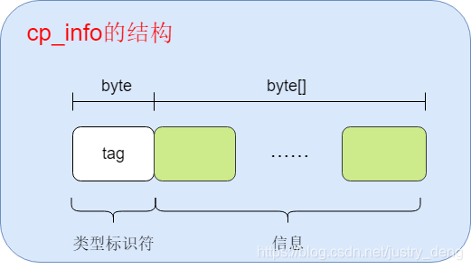

cp_info又可细分为14种类型

| 类型 | 标志 | 描述 | 
| -- | -- | -- |
| CONSTANT_Utf8_info | 1 | UTF-8编码的字符串 | 
| CONSTANT_Integer_info | 3 | 整型字面量 | 
| CONSTANT_Float_info | 4 | 浮点型字面量 | 
| CONSTANT_Long_info | 5 | 长整型字面量 | 
| CONSTANT_Double_info | 6 | 双精度浮点型字面量 | 
| CONSTANT_Class_info | 7 | 类或接口的符号引用 | 
| CONSTANT_String_info | 8 | 字符串类型字面量 | 
| CONSTANT_Fieldref_info | 9 | 字段的符号引用 | 
| CONSTANT_Methodref_info | 10 | 类中方法的符号引用 | 
| CONSTANT_InterfaceMethodref_info | 11 | 接口中方法的符号引用 | 
| CONSTANT_NameAndType_info | 12 | 字段或方法的部分符号引用 | 
| CONSTANT_MethodHandle_info | 15 | 表示方法句柄 | 
| CONSTANT_MethodType_info | 16 | 表示方法类型 | 
| CONSTANT_InvokeDynamic_info | 18 | 表示一个动态方法调用点 | 


- CONSTANT_Utf8_info

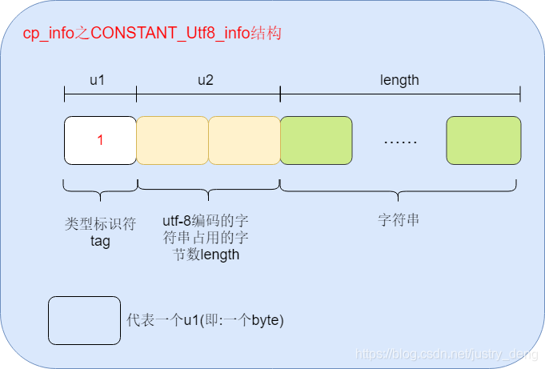

- CONSTANT_Integer_info

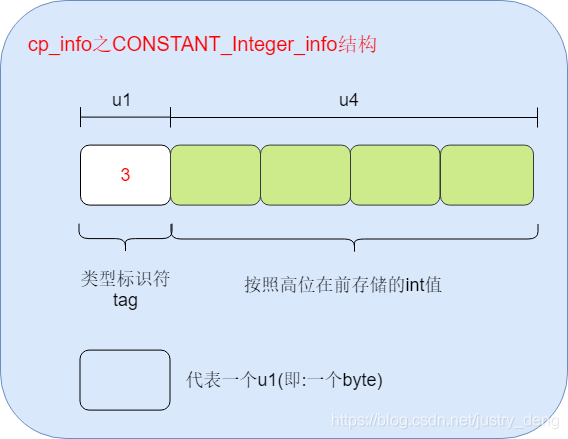

- CONSTANT_Float_info

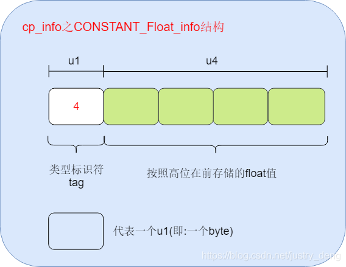

- CONSTANT_Long_info


- CONSTANT_Double_info

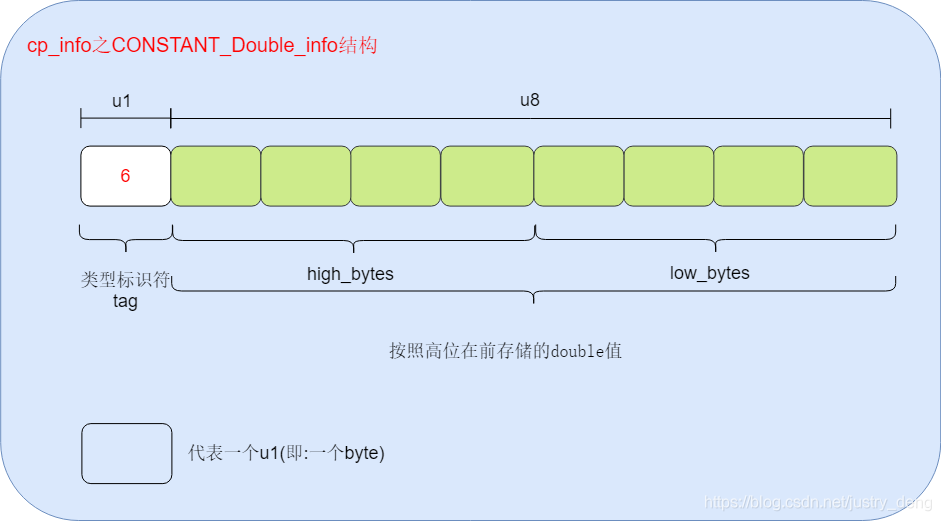

- CONSTANT_Class_info

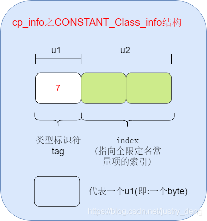

- CONSTANT_String_info

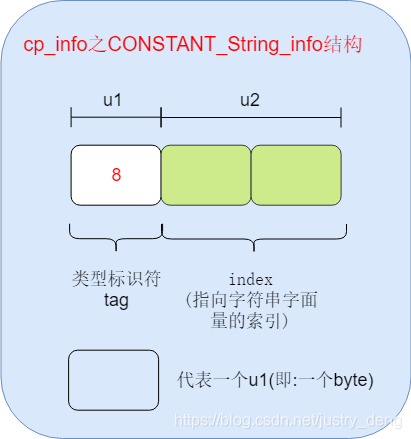

- CONSTANT_Fieldref_info

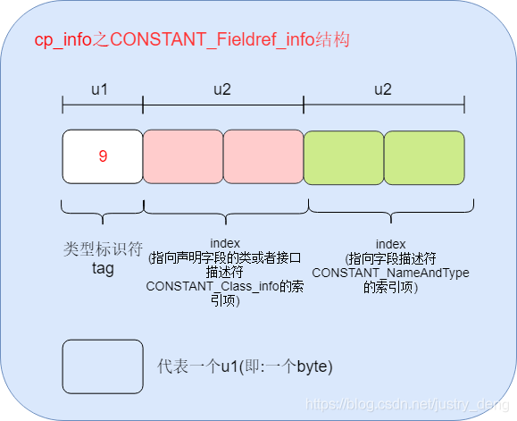

- CONSTANT_Methodref_info

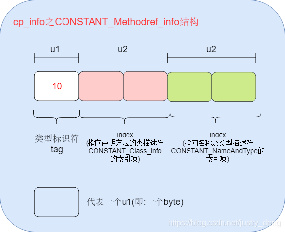

- CONSTANT_InterfaceMethodref_info

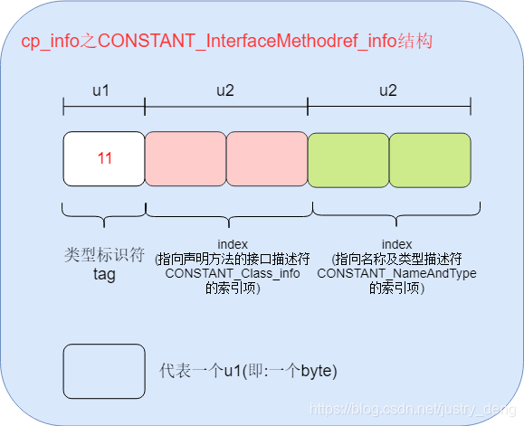

- CONSTANT_NameAndType_info

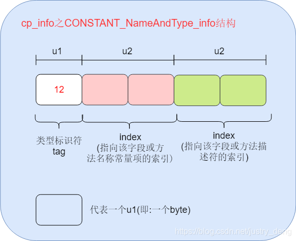

- CONSTANT_MethodHandle_info

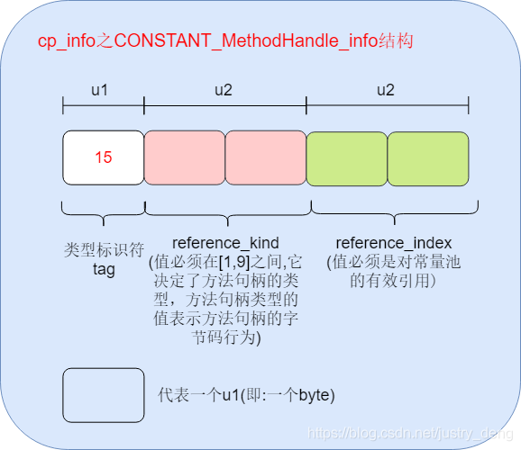

- CONSTANT_MethodType_info

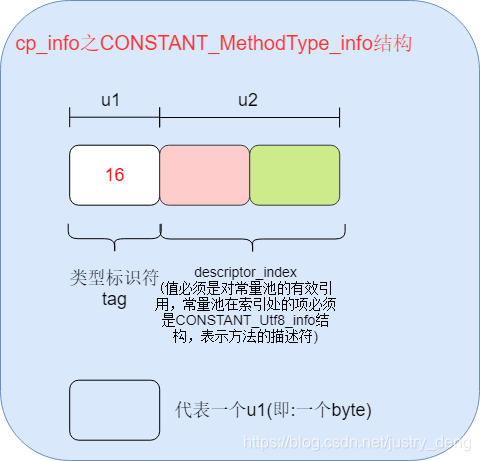

- CONSTANT_InvokeDynamic_info

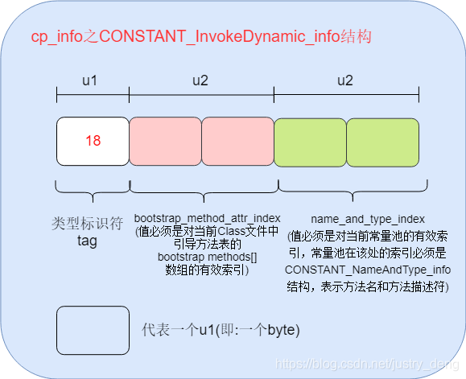

## **访问标志**

在常量池结束之后，紧接着的两个字节代表访问标志。

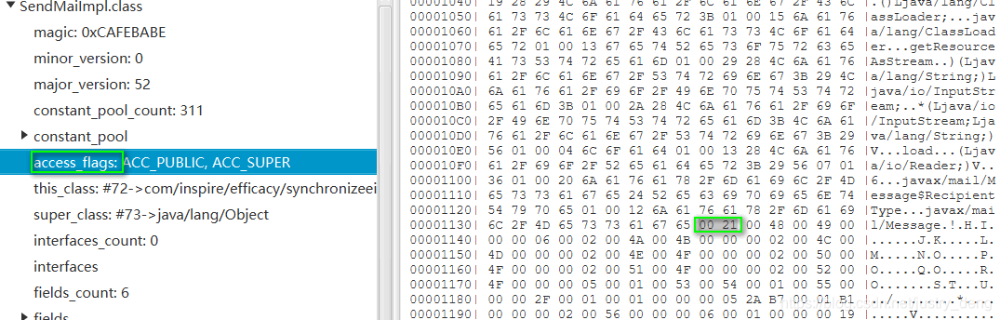

**访问标志用于识别一些类或接口层次的访问信息**

| 标志名称 | 标志值 | 含义 | 
| -- | -- | -- |
| ACC_PUBLIC | 0x0001 | 是否为publi类型 | 
| ACC_FINAL | 0x0010 | 是否被声明为final，只有类可以设置 | 
| ACC_SUPER | 0x0020 | 是否允许使用invokespecial字节码指令的新语意，invokespecial指令的语意在JDK1.0.2发生过改变，为了区别这条指令使用哪种语意，JDK1.0.2之后编译出来的类的这个标志必须为真 | 
| ACC_INTERFACE | 0x0200 | 标志这是一个接口 | 
| ACC_ABSTRACT | 0x0400 | 是否为abstract类型，对于接口或者抽象类，此标志为真，其他类型为假 | 
| ACC_SYNTHETIC | 0x1000 | 标识这个类并非由用户代码生成 | 
| ACC_ANNOTATION | 0x2000 | 标识这是一个注解 | 
| ACC_ENUM | 0x4000 | 标识这是一个枚举 | 


多个标识符的话，access_flags的值累加即可。由于标识符对应的值的特殊性，累加后的结果，可以唯一定位有哪些标识符，如0x0021只有ACC_SUPER与ACC_PUBLIC的值累加后才能得到。

## 类索引、父类索引、接口索引计数器、接口索引集合

类索引和父类索引都是一个u2类型的数据，接口索引计数器也是一个u2类型的数据，接口索引集合则是一组u2类型数据的集合。Class文件中的这几项数据来确定这个类的继承关系。

- 类索引

确定当前类的全限定名。

- 父类索引

确定当前类的父类的全限定名。由于Java单继承的原则，父类只可能有一个；由于Object是所有其他类的基类，所以除了Object类本身的super_class为0外，其余所有类的super_class都不为0。

- 接口索引（接口索引计数器、接口索引集合）

按照当前类implements（或者当前接口extends）的接口顺序，从左到右排列在接口索引集合中。

类索引的直接值、父类索引的直接值、接口索引集合中的索引的直接值，代表的是一个常量池中的索引值。该索引值对应为一个CONSTANT_Class_info，该CONSTANT_Class_info又指向CONSTANT_Utf8_info，该CONSTANT_Utf8_info中存储着全限定名字符串信息。

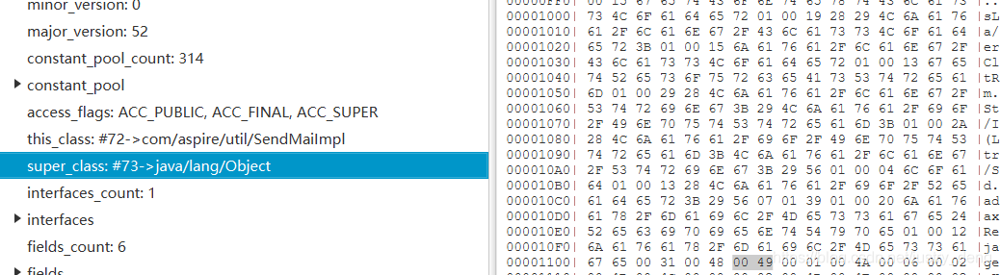

类索引查找全限定名的过程如下：

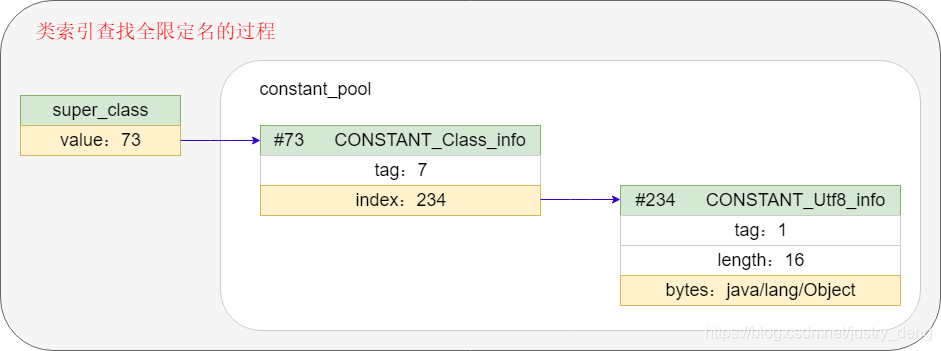

## 字段表集合（当前类字段计数器、字段表集合）

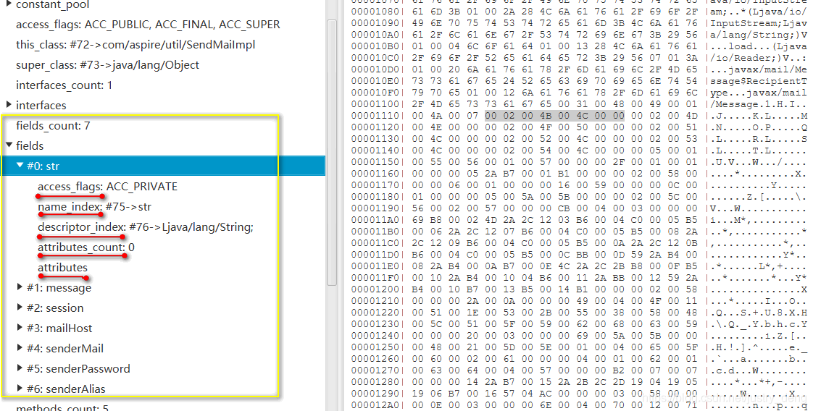

字段表（field_info）用于描述接口或者类中声明的变量。字段（field）包括类级别变量（静态变量）以及实例变量（非静态变量），但不包括在方法内部声明的局部变量。

**field_info**

| 名称 | 类型 | 数量 | 
| -- | -- | -- |
| access_flag | u2 | 1 | 
| name_index | u2 | 1 | 
| descriptor_index | u2 | 1 | 
| attributes_count | u2 | 1 | 
| attributes | attributes_info | attributes_count | 


**access_flags**

| 标志名称 | 标志值 | 含义 | 
| -- | -- | -- |
| ACC_PUBLIC | 0x0001 | 字段是否public | 
| ACC_PRIVATE | 0x0002 | 字段是否private | 
| ACC_PROTECTED | 0x0004 | 字段是否protected | 
| ACC_STATIC | 0x0008 | 字段是否static | 
| ACC_FINAL | 0x0010 | 字段是否final | 
| ACC_VOLATILE | 0x0040 | 字段是否volatile | 
| ACC_TRANSIENT | 0x0080 | 字段是否transient | 
| ACC_SYNTHETIC | 0x1000 | 字段是否由编译器自动产生 | 
| ACC_ENUM | 0x4000 | 字段是否enum | 


## **name_index**

field的自定义名称，如：

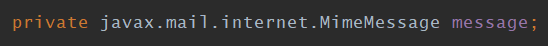

其name_index为message

**descriptor_index**

| 标识字符 | 含义 | 
| -- | -- |
| B | 基本类型byte | 
| C | 基本类型char | 
| D | 基本类型double | 
| F | 基本类型float | 
| I | 基本类型int | 
| J | 基本类型long | 
| S | 基本类型short | 
| Z | 基本类型boolean | 
| V | 特殊类型void | 
| L + 类全限定名 + “;”号 | 对象类型，如Ljava/lang/String; | 


数组类型的描述，每一维度，需要在前面加一个“[”，例如二维数组java.lang.String[][]，将被记录为“[[Ljava/lang/String;”，int[]将被记录为“[I”。

## 方法表集合（方法计数器、方法表）

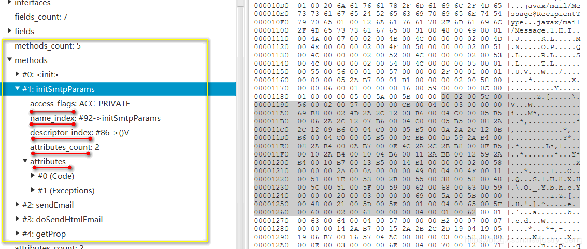

method_info结构为：

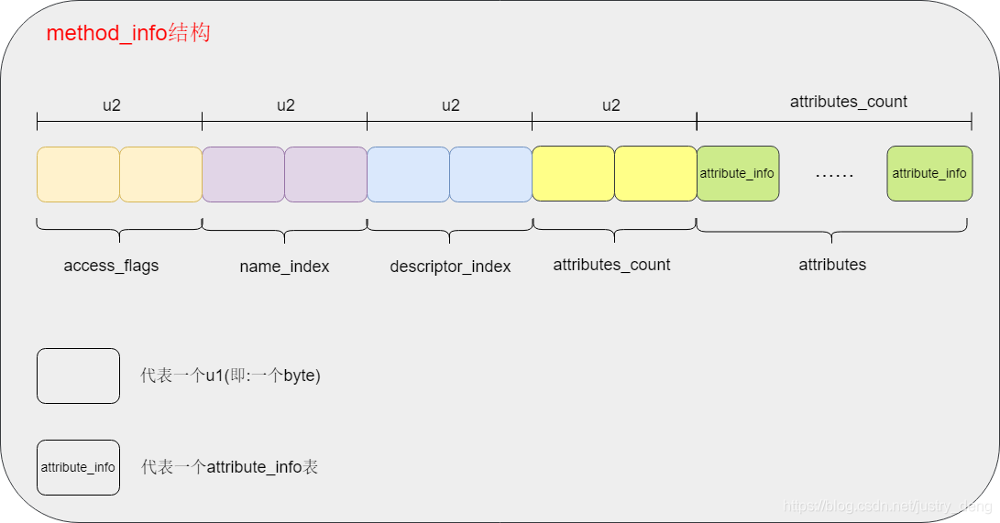

| 名称 | 类型 | 数量 | 
| -- | -- | -- |
| access_flags | u2 | 1 | 
| name_index | u2 | 1 | 
| descriptor_index | u2 | 1 | 
| attributes_count | u2 | 1 | 
| attributes | attribute_info | attributes_count | 


**access_flags**

| 标志名称 | 标志值 | 含义 | 
| -- | -- | -- |
| ACC_PUBLIC | 0x0001 | 方法是否为public | 
| ACC_PRIVATE | 0x0002 | 方式是否为private | 
| ACC_PROTECTED | 0x0004 | 方式是否为protected | 
| ACC_STATIC | 0x0008 | 方法是否为static | 
| ACC_FINAL | 0x0010 | 方法是否为final | 
| ACC_SYNCHRONIZED | 0x0020 | 方法是否为synchronized | 
| ACC_BRIDGE | 0x0040 | 方法是否由编译器产生的桥接方法 | 
| ACC_VARARGS | 0x0080 | 字段是否接受不定参数 | 
| ACC_NATIVE | 0x0100 | 字段是否为native | 
| ACC_ABSTRACT | 0x0400 | 方法是否为abstract | 
| ACC_STRICTFP | 0x0800 | 方法是否为strictfp | 
| ACC_SYNTHETIC | 0x1000 | 方法是否是由编译器自动产生的 | 


**name_index**

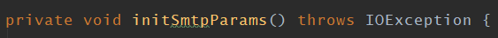

name_index为initSmtpParams。

**descriptor_index**

描述符，可描述方法的参数类型、返回值类型。

方法各个形参（严格按照从左到右的顺序）的标识字符+方法返回值类型的标识字符。

| 标识字符 | 含义 | 
| -- | -- |
| B | 基本类型byte | 
| C | 基本类型char | 
| D | 基本类型double | 
| F | 基本类型float | 
| I | 基本类型int | 
| J | 基本类型long | 
| S | 基本类型short | 
| Z | 基本类型boolean | 
| V | 特殊类型void | 
| L + 类全限定名 + “;”号 | 对象类型，如Ljava/lang/String; | 


**attributes**

方法声明的异常信息、方法的实际逻辑代码，放在attributes里面。

## 属性表集合

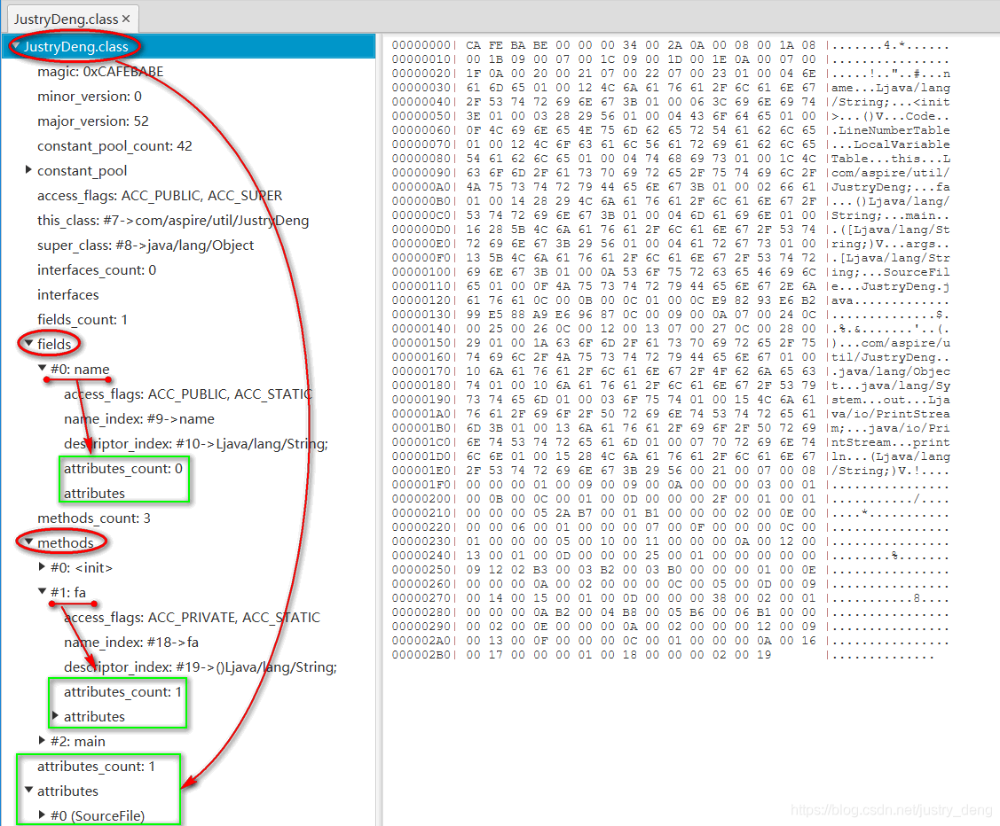

Class文件、字段表、方法表都可以携带自己的属性表集合，以描述某些场景专有的信息。

与Class文件中其他的数据项目要求严格的顺序、长度和内容不同，属性表集合的限制稍微宽松一些，不再要求各个属性表具有严格的顺序，并且只要不与已有属性名重复，任何人实现的编译器都可以向属性表中写入自己定义的属性信息，Java虚拟机运行时会忽略掉它不能识别的属性。

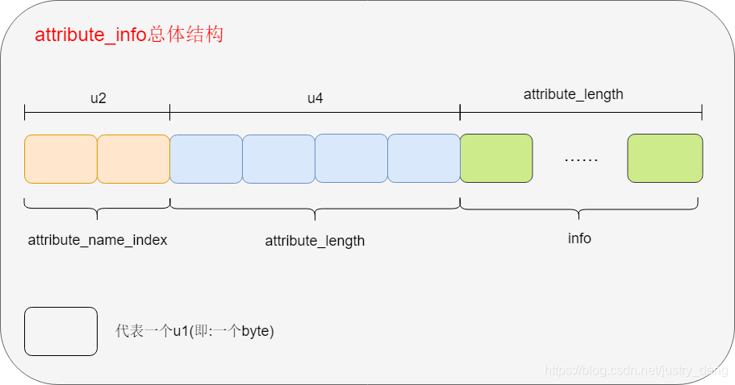

| 名称 | 类型 | 数量 | 
| -- | -- | -- |
| u2 | attribute_name_index | 1 | 
| u4 | attribute_length | 1 | 
| u1 | info | attribute_length | 


attribute_info又可细分为以下21种（即《Java虚拟机规范（Java SE 7）》中预定义了的21项虚拟机实现应当识别的属性）：

| 属性名称 | 使用位置 | 含义 | 
| -- | -- | -- |
| Code | 方法表中 | Java代码编译成的字节码指令 | 
| ConstantValue | 字段表中 | final关键字定义的常量值 | 
| Deprecated | 类中、方法表中、字段表中 | 被声明为deprecated的方法和字段 | 
| Exceptions | 方法表中 | 方法声明的异常 | 
| LocalVariableTable | Code属性中 | 方法的局部变量描述 | 
| LocalVariableTypeTable | 类中 | JDK1.5中新增的属性，它使用特征签名代替描述符，是为了引入泛型语法之后能描述泛型参数化类型而添加 | 
| InnerClasses | 类中 | 内部类列表 | 
| EnclosingMethod | 类中 | 仅当一个类为局部类或者匿名类时，才能拥有这个属性，这个属性用于表示这个类所在的外围方法 | 
| LineNumberTable | Code属性中 | Java源码的行号与字节码指令的对应关系 | 
| StackMapTable | Code属性中 | JDK1.6中新增的属性，供新的类型检查验证器检查和处理目标方法的局部变量和操作数栈所需要的类型是否匹配 | 
| Signature | 类中、方法表中、字段表中 | JDK1.5新增的属性，这个属性用于支持泛型情况下的方法签名，在Java语言中，任何类、接口、初始化方法或成员的泛型签名如果包含了类型变量(Type Variables)或参数类型(Parameterized Types),则Signature属性会为它记录泛型签名信息。由于Java的泛型采用擦除法实现，在为了避免类型信息被擦除后导致签名混乱，需要这个属性记录泛型中的相关信息 | 
| SourecFile | 类中 | 记录源文件名称 | 
| SourceDebugExtension | 类中 | JDK1.6中新增的属性，SourceDebugExtension用于存储额外的调试信息。如在进行JSP文件调试时，无法通过Java堆栈来定位到JSP文件的行号，JSR-45规范为这些非Java语言编写，却需要编译成字节码运行在Java虚拟机汇中的程序提供了一个进行调试的标准机制，使用SourceDebugExtension就可以存储这些调试信息 | 
| Synthetic | 类中、方法表中、字段表中 | 标识方法或字段为编译器自动产生的 | 
| RuntimeVisibleAnnotations | 类中、方法表中、字段表中 | JDK1.5中新增的属性，为动态注解提供支持。RuntimeVisibleAnnotations属性，用于指明哪些注解是运行时(实际上运行时就是进行反射调用)可见的 | 
| RuntimeInvisibleAnnotations | 类中、方法表中、字段表中 | JDK1.5中新增的属性，作用与RuntimeVisibleAnnotations相反用于指明哪些注解是运行时不可见的 | 
| RuntimeVisibleParameterAnnotations | 方法表中 | JDK1.5中新增的属性，作用与RuntimeVisibleAnnotations类似，只不过作用对象为方法的参数 | 
| RuntimeInvisibleParameterAnnotations | 方法表中 | JDK1.5中新增的属性，作用与RuntimeInvisibleAnnotations类似，只不过作用对象为方法的参数 | 
| AnnotationDefault | 方法表中 | JDK1.5中新增的属性，用于记录注解类元素的默认值 | 
| BootstrapMethods | 类中 | JDK1.7新增的属性，用于保存invokedynamic指令引用的引导方法限定符 | 
