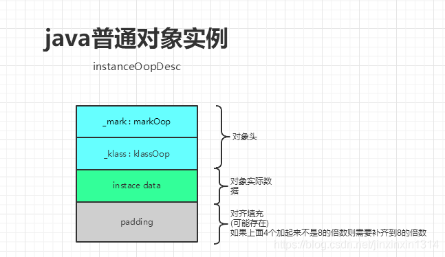
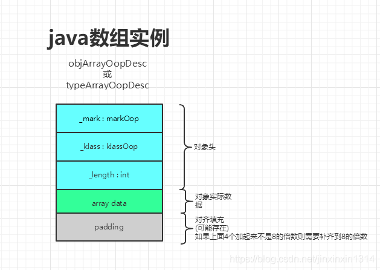
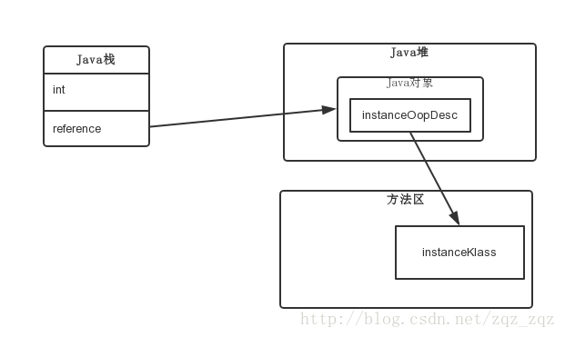

### 概念

在Hotspot虚拟机中，对象在内存中存储的布局可以分为3块区域：对象头（Header）、实例数据（Instance Data）和对齐填充（Padding）。

java普通对象结构

java数组对象结构

### 对象结构

#### 对象头

HotSpot虚拟机的对象头包括两部分信息：

1. Mark Word

第一部分Mark Word，用于存储对象自身的运行时数据，如哈希码（HashCode）、GC分代年龄、锁状态标志、线程持有的锁、偏向线程ID、偏向时间戳等，这部分数据的长度在32位和64位的虚拟机（未开启压缩指针）中分别为32位和64位。

2. 类型指针

对象头的另外一部分是类型指针，即对象指向它的类元数据的指针，虚拟机通过这个指针来确定这个对象是哪个类的实例。

3. 数组长度（只有数组对象有）

如果对象是一个数组，那在对象头中必须有一块数据用于记录数组长度。

#### 实例数据

实例数据部分是对象真正存储的有效信息，也是在程序代码中所定义的各种类型的字段内容。无论是从父类继承下来的，还是在子类中定义的，都需要记录起来。

对象引用（reference）类型在64位机器上，关闭指针压缩时占用8字节，开启时占用4字节。

原生类型（primitive type）的内存占用如下：

| Primitive Type | Memory Required(bytes) | 
| -- | -- |
| byte, boolean | 1 字节 | 
| short, char | 2 字节 | 
| int, float | 4 字节 | 
| long, double | 8 字节 | 

包装类型
包装类（Boolean/Byte/Short/Character/Integer/Long/Double/Float）占用内存的大小等于对象头大小加上底层基础数据类型的大小。
包装类型的对象内存占用情况如下：

|   |   |   | 
| -- | -- | -- |
|   |   |   | 
|   |   |   | 
|   |   |   | 
|   |   |   | 

#### 对齐填充

第三部分对齐填充并不是必然存在的，也没有特别的含义，它仅仅起着占位符的作用。由于HotSpot VM的自动内存管理系统要求对象起始地址必须是8字节的整数倍，换句话说，就是对象的大小必须是8字节的整数倍。而对象头部分正好是8字节的倍数（1倍或者2倍），因此，当对象实例数据部分没有对齐时，就需要通过对齐填充来补全。

HotSpot的对齐方式为8字节对齐：

（对象头 + 实例数据 + padding）% 8 =0 且 0 < padding < 8

### 对象大小

1. 在32位系统中，存放Class指针的空间大小是4字节，MarkWord是4字节，对象头为8字节。

1. 在64位系统中，存放Class指针的空间大小是8字节，MarkWord是8字节，对象头是16字节。

1. 在64位系统中，开启指针压缩的情况下，存放Class指针的空间大小是4字节，MarkWord是8字节，对象头为12字节。

1. 数组长度4字节+数组对象头8字节（对象引用4字节/8字节（未开启指针压缩的64位）+数组MarkWord4字节/8字节（未开启指针压缩的64位））+对齐4字节=16字节

1. 静态属性不算在对象大小内。

### 对象模型

HotSpot采用了OOP-Klass模型，它是描述Java对象实例的模型，它分为两部分：

类被加载到内存时，就被封装成了Klass，Klass包含类的元数据信息，像类的方法、常量池这些信息都是在Klass里的，可以认为它是java里面的java.lang.class对象，记录了类的全部信息。

OOP（Ordinary Object Pointer）指的是普通对象指针，它包含MarkWord和元数据指针：

- MarkWord用来存储与当前指针指向的对象运行时的一些状态数据；

- 元数据指针则指向Klass，用来说明当前指针指向的对象是什么类型，也就是使用哪个类来创建出来的；

那么为何要设计这样一个一分为二的对象模型呢？这是因为HotSpot VM的设计者不想让每个对象中都含有一个vtable（虚函数表），所以就把对象模型拆成Klass和oop，其中oop不含有任何虚函数，而Klass就含有虚函数表，可以进行method dispatch。

HotSpot中，OOP-Klass实现的代码都在/hotspot/src/share/vm/oops/路径下，oop的实现为instanceOop和arrayOop，他们来描述对象头，其中arrayOop对象用于描述数组类型。

一个Java对象在内存中的布局可以连续分成两部分：instanceOop（继承自oop.hpp）和实例数据

上图可以看到，通过栈帧中的对象引用reference找到Java堆中的对象，再通过对象的instantceOop中的元数据指针Klass来找到方法区中的instanceKlass，从而确定该对象的类型。

下面来分析下，执行new A()的时候，JVM做了什么工作。首先，如果这个类没有被加载过，JVM就会进行类的加载，并在JVM内部传固件一个instantceKlass对象表示这个类的运行时元数据（相当于Java层的Class对象）。初始化对象的时候（执行invokespecial A::），JVM就会创建一个instanceOopDesc对象表示这个对象的实例，然后进行Mark Word的填充，将元数据指针指向Klass对象，并填充实例变量。

元数据——instanceKlass对象会存在元空间（方法区），而对象实例——instanceOopDesc会存在Java堆，Java堆栈中会存有这个对象实例的引用。