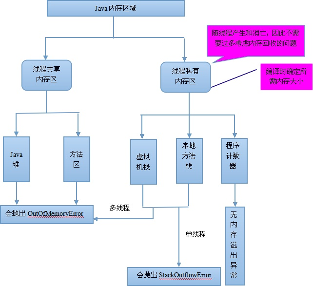

### 什么是RAM？

随机访问储存器：Random Access Memory, 在关闭电源的时候内存上的内容即会被删除。

### 什么是ROM？

只读存储器:Read-Only Memory, 只能读取而不能写入，但是现在的ROM已经不再局限了，可写入也可以擦除。

### JAVA数据存储

1. 寄存器

这是最快的保存区域，因为它位于和其他所有保存方式不同的地方：处理器内部。然而，寄存器的数量十分有限，所以寄存器是根据需要由编译器分配。我们对此没有直接的控制权，也不可能在自己的程序里找到寄存器存在的任何踪迹。

**最快的存储区，由编译器根据需求进行分配，我们在程序中无法控制。**

1. 堆栈

驻留于常规RAM（随机访问存储器）区域，但可通过它的“堆栈指针”获得处理的直接支持。堆栈指针若向下移，会创建新的内存；若向上移，则会释放那些内存。这是一种特别快、特别有效的数据保存方式，仅次于寄存器。创建程序时，Java编译器必须准确地知道堆栈内保存的所有数据的“长度”以及“存在时间”。这是由于它必须生成相应的代码，以便向上和向下移动指针。这一限制无疑影响了程序的灵活性，所以尽管有些Java数据要保存在堆栈里——特别是对象句柄，但Java对象并不放到其中。

**存放基本类型的变量数据和对象、数组的引用，但对象本身不存放在栈中，而是存放在堆（new出来的对象）或者常量池中（字符串常量对象存放在常量池中）**

1. 堆

一种常规用途的内存池（也在RAM区域），其中保存了Java对象。和堆栈不同，“内存堆”或“堆”（Heap）最吸引人的地方在于编译器不必知道要从堆里分配多少存储空间，也不必知道存储的数据要在堆里停留多长的时间。因此，用堆保存数据时会得到更大的灵活性。要求创建一个对象时，只需用new命令编制相关的代码即可。执行这些代码时，会在堆里自动进行数据的保存。当然，为达到这种灵活性，必然会付出一定的代价：在堆里分配存储空间时会花掉更长的时间！

**存放所有new出来的对象**

1. 静态存储

这儿的“静态”（Static）是指“位于固定位置”（尽管也在RAM里）。程序运行期间，静态存储的数据将随时等候调用。可用static关键字指出一个对象的特定元素是静态的。但Java对象本身永远都不会置入静态存储空间。

**存放静态成员（static定义的）**

1. 常数存储

常数值通常直接置于程序代码内部。这样做是安全的，因为它们永远都不会改变。有的常数需要严格地保护，所以可考虑将它们置入只读存储器（ROM）。

**存放字符串常量和基本类型常量（public static final）**

1. 非RAM存储

若数据完全独立于一个程序之外，则程序不运行时仍可存在，并在程序的控制范围之外。其中两个最主要的例子便是“流式对象”和“固定对象”。对于流式对象，对象会变成字节流，通常会发给另一台机器。而对于固定对象，对象保存在磁盘中。即使程序中止运行，它们仍可保持自己的状态不变。对于这些类型的数据存储，一个特别有用的技巧就是它们能存在于其他媒体中。一旦需要，甚至能将它们恢复成普通的、基于RAM的对象。

**硬盘等永久存储空间**

### JAVA内存结构

1. 程序计数器（Program Counter Register）

是一块较小的内存空间，可以看作是当前线程所执行的字节码的行号指示器。在虚拟机的概念模型中字节码解释器的工作就是通过改变这个计数器的值来选取下一条需要执行的字节码指令，分支、循环、跳转、异常处理、线程恢复等基础功能都依赖于此计数器。JVM中的程序计数器也是在Java虚拟机规范中唯一一个没有规定任何OutOfMemoryError情况的区域。在任意时刻一条JVM线程只能执行一个方法的代码，方法可以是Java方法，或者是native方法。

1. Java虚拟机栈（Java Virtual Machine Stacks）

也是线程私有的，即生命周期和线程相同。Java虚拟机栈和线程同时创建，用于存储栈帧。每个方法在执行时都会创建一个栈帧(Stack Frame)，用于存储局部变量表、操作数栈、动态链接、方法出口等信息。每一个方法从调用直到执行完成的过程就对应着一个栈帧在虚拟机栈中从入栈到出栈的过程。

1. 本地方法栈（Native Method Stack）

和Java虚拟机栈类似，区别在于Java虚拟机栈是为了Java方法服务的，而本地方法栈是为了native方法服务的。在虚拟机规范中并没有对本地方法实现所采用的编程语言与数据结构采取强制规定，因此不同的JVM虚拟机可以自己实现自己的native方法。此处需要说明：Sun HotSpot虚拟机就直接将本地方法栈和Java虚拟机栈合二为一了。

1. Java堆（Java Heap）

前面所说的程序计数器、Java虚拟机栈、本地方法栈通常只占很小一部分的内存空间，对与大多数应用来说，Java堆(Java Heap)才是JVM管理的内存空间中最大的一块。此区域存在的唯一目的就是存放对象实例，几乎所有的对象实例都会在这被分配内存，而且Java堆是被所有线程共享的一块内存区域。Java堆是Java中垃圾收集器管理的主要区域，因此也被称为GC堆—Garbage Collected Heap。

1. 方法区（Method Area）

与Java堆一样是各个线程共享的内存区域。用于存储被JVM加载的类信息、常量、静态变量、即时编译器编译后的代码等数据。虽然Java虚拟机规范将方法区描述为堆的一个逻辑部分，但是它却有个别名叫做Non-Heap(非堆),目的就是和Java堆区分开来。

Java虚拟机规范对方法区的限制十分宽松，除了和Java堆一样不需要连续的内存空间分配和可选择固定大小或可拓展内存以外，方法区也可以被垃圾回收器管理或不受其管理。

首先，要明确一个「概念」——方法区，是一个概念，是Java虚拟机规范中定义的概念，一个「非堆」的运行时数据区域，用于存放被JVM加载的类信息、常量、静态变量、即时编译器编译后的代码等数据，运行时常量池也是存放于方法区中。逻辑上的「非堆」表示和Java堆独立，那物理上呢？Java虚拟机规范中定义了方法区这个概念，但是并没有规定此区域的是否需要垃圾收集。

在Java8以前，HotSpot虚拟机中，方法区也被称为“永久代”，因为在物理上，方法区使用的是由JVM开辟的堆内存，由于和Java堆共享内存且内存空间由垃圾收集器统一分配和管理，自然的垃圾收集也拓展到了方法区上。此时，Java堆中分区为青年代Young Generation和老年代Old Generation，而方法区自然地被称为永久代Permanent Generation 。（JVM虚拟机有不同的实现，比较主流的是sun公司的HotSpot虚拟机，在此才有“永久代的概念”，其他虚拟机不存在“永久代”这个概念）

在Java8中，HotSpot虚拟机改变了原有方法区的物理实现，将原本由JVM管理内存的方法区的内存移到了虚拟机以外的计算机本地内存，并将其称为元空间（Metaspace）。这样一来，现在的方法区实际存储在于元空间，再也不用和Java堆共享内存了，“永久代”也就永久地被撤销了。

尽管永久代撤销了，方法区这个逻辑上的空间一直是存在的，所以在java8以后，方法区的垃圾回收在物理上就是对元空间的垃圾回收。由于元空间用的是计算机本地内存，所以理论上来说只要内存足够大，方法区就能有多大，实际上Metaspace的大小是可以通过参数设定的，如果Metaspace的空间占用达到了设定的最大值，那么就会触发GC来收集死亡对象和类的加载器。常用的G1和CMS垃圾收集器都能很好地回收Metaspace区。

**运行时常量池**

- 存放编译器生成的各种字面量和符号引用。当虚拟机运行时，需要从常量池获得对应的符号引用，再在类创建或运行时解析、翻译到具体的内存地址之中。

- 字面量（Literal）通俗理解就是Java中的常量，如文本字符串、生命为final的常量值等。

- 符号引用（Symbolic References）则是属于编译原理中的概念，包括了类和接口的全限定名、字段的名称和描述符、方法的名称和描述符。

简单来说：

- 堆中存储的是对象实例。

- 栈中存储的是基础数据类型和对象的引用。

- 方法区存储的是类信息、常量、静态变量、即时编译的代码。