### 概念

“虚拟机”是一个相对于“物理机”的概念，这两种机器都有代码执行能力，其区别在于物理机的执行引擎是直接建立在CPU处理器、指令集、操作系统和硬件层面上的；而

Java虚拟机的字节码指令由1个字节长度的操作码（Opcode）以及紧随其后的0~多个操作数（Operands）构成。如果忽略异常处理，那么Java虚拟机的解释通过下面这个伪代码的循环即可有效工作：

```
do{
    自动计算pc寄存器以及从pc寄存器的位置取出操作码;
    if(存在操作数){
        去除操作数;
    }
    执行操作码所定义的操作;
} while(处理下一次循环);
```

由于字节码指令集限制了其操作码长度为1个字节（0~255），即意味着整个指令集中包含的指令总数不超过256条。在虚拟机处理超过1个字节的数据时，会在运行时重新构建出具体的数据结构。譬如：如果要将一个16位无符号的整数使用两个无符号字节存储起来（命名位byte1和byte2）那么这个16位无符号数的值应该这样表示：(byte1 << 8) | byte2

> 这种操作在某种程度上会导致执行字节码时损失一些性能。但这样做的优势也非常明显，放弃了操作数长度对齐，就意味着可以节省很多填充和间隔符号；用一个字节来代表操作码，也是为了尽可能获得短小精干的编译代码。这种追求尽可能小数据量、高传输效率的设计是由Java语言设计之初面向网络、智能家电的技术背景所决定的并沿用至今。


### Java语言中的8大基本数据类型和Java虚拟机中的数据类型

在讲字节码指令之前，我们需要了解下，字节码指令操作的操作数时什么类型的，这些Java虚拟机概念的数值类型又和Java编程语言中的8大基本数据类型如何对应的？

#### Java变成语言中的8大基本数据类型

整型：byte、short、int、long

浮点型：double、float

字符型：char

布尔型：boolean

#### Java虚拟机中的数据类型

Java程序语言中定义了8大基本数据类型，但是在虚拟机中只分为两大类：

- 原始类型（primitive type）

- 引用类型（reference type）

原始类型对应的数值称为原始值、引用类型的数值称为引用值。

1. 原始类型

- 数值类型

byte、short、int、long、char、float、double

- boolean类型

true和false，默认位false，虽然在Java虚拟机中定义了boolean这种类型，但是却没有指令直接支持其操作，所以，对boolean类型都需要在编译后用虚拟机中的int类型来表示——1表示true、0表示false。

- returnAddress类型

一个指向某个操作码opcode的指针，此操作与虚拟机指令相对应。

以上可以看出，在Java虚拟机的

1. 引用类型

- 类类型（class type）

- 数组类型（array type）

- 接口类型（interface type）

这三种引用类型的值分别指向动态创建的类实例、数组实例和实现了某个接口的类/数组实例，在引用类型中还有一个特殊的值null，当一个引用不指向任何对象时，它jiuyognll表示，null作为引用类型的初始默认值可以转型成任意的引用类型。

#### 字节码与数据类型

在Java虚拟机的指令集中，大多数指令都包含了其操作数对应的数据类型信息。如：iload指令用于从局部变量表中加载int型数据到操作数栈，fload指令加载的时float类型的数据，而aload指令加载的是一个引用类型的数据。这些指令都是和数据类型相关的指令，即指令中直接包含了对应操作数的数据类型信息。类似的指令中，i代表int类型的数据类型、l代表long、s代表short、c代表char、f代表float、d代表double、a代表reference。

还有一些没有明确指示操作类型的指令如arraylength指令，其操作数只能是一个数组类型的对象、goto指令表示无条件跳转也和数据类型无关。

在Java虚拟机指令集设计的过程中，由于操作码长度为1字节，导致所有指令的总数必须控制在256个以内，而Java有8大基本数据类型，如果给每种类型都设计一套指令，那么就会产生8套冗余的指令，指令总数肯定是超过256个的，所以为了避免这个问题，Java虚拟机指令集在设计时刻意避开了一些数据类型。

大部分的指令都没有直接支持byte、char、short、boolean类型数据。编译器会在编译期或运行期将byte和short类型的数据（采用了类型转换指令）带符号拓展为相应的int类型数据，将boolean和char类型数据零位拓展为相应int类型数据。

#### 加载和存储指令

加载和存储指令用于将数据在栈帧中的局部变量表和操作数栈之间来回传输，这类指令包括如下内容。

将一个局部变量加载到操作数栈：

iload,iload_<n>,lload,load<n>,fload,fload_<n>,dload,dload_<n>,aload,aload_<n>

将一个数值从操作数栈存储到局部变量表：

istore,istore_<n>,lstore,lstore_<n>,fstore,fstore_<n>,dstore,dstore_<n>,astore,astore_<n>

将一个常量加载到操作数栈：

bipush,sipush,ldc,ldc_w,ldc2_w,aconst_null,iconst_m1,iconst_<i>,lconst_<l>,fconst_<f>,dconst_<d>

扩充局部变量表的访问索引：

wide

上面所列举的指令助记符中，有一部分是以_<n>结尾的，这些指令助记符实际上是代表了一组指令。如iload_<n>代表了iload_0、iload_1、iload_2和iload_3这几条指令，此时操作数隐藏于指令之中。

```
iload_0表示从当前栈帧局部变量表中0号位置取int类型的数值加载到操作数栈
iload_1表示从当前栈帧局部变量表中1号位置取int类型的数值加载到操作数栈
...
```

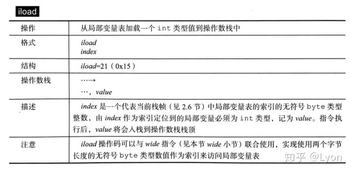

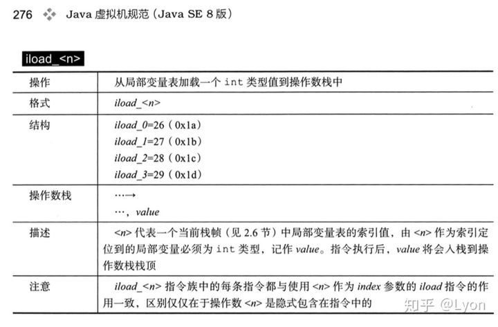

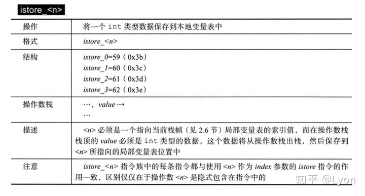

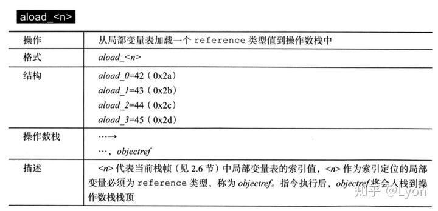

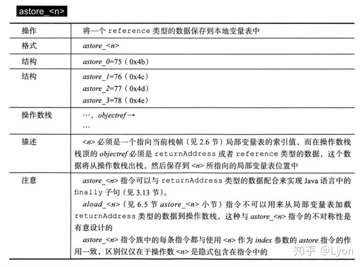

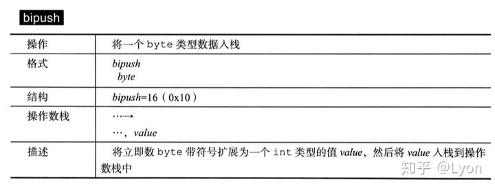

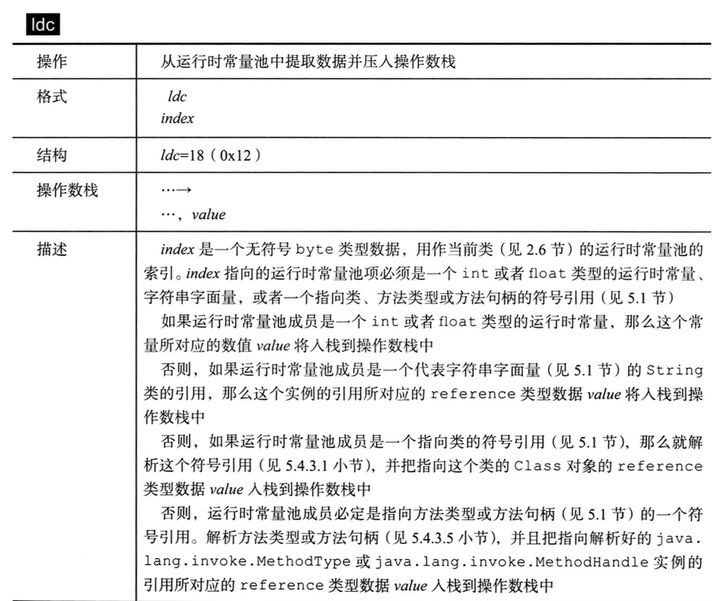

#### 运算指令

运算OR算术指令用于对两个操作数栈上的值进行某种运算，并把结果重新存储到操作数栈顶。运算指令大体上可分为2种：整型数据运算、浮点型数据运算。

> 无论是整型还是浮点型，一律采用Java虚拟机中的数据类型，而不是Java语法中的八大基本数据类型。由于没有对byte、short、char和boolean类型直接支持的算术指令，故这些类型，会使用int型的指令代替。


加法指令：xadd
减法指令：xsub
乘法指令：xmul
除法指令：xdiv
求余指令：xrem
取反指令：xneg
以上x=i、l、f、d分别表示int型、long型、float型、double型
位移指令：ishl、ishr、iushr、lshl、lshr、lushr
按位或指令：ior、lor
按位与指令：iand、land
按位异或指令：ixor、lxor
局部变量自增指令：iinc
比较指令：dcmpg、dcmpl、fcmpg、fcmpl、lcmp


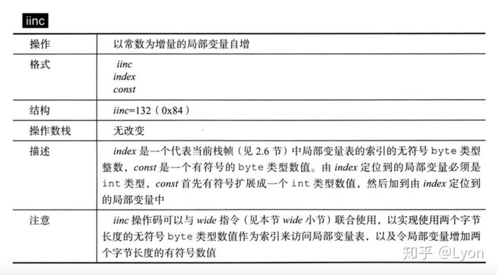


#### 类型转换指令

类型转换指令可以将两种不同的数值类型进行相互转换。Java虚拟机直接支持（无需转换指令）以下数值类型的宽化类型转换（即小范围类型向大范围类型的安全转换）

int类型到long、float、double

long类型到float、double

float类型到double

相对的，处理窄化类型转换时，需要通过相应的类型转换指令来完成，这些指令包括i2b、i2c、i2s、l2i、f2i、f2l、d2i、d2l、d2f

#### 对象创建和访问指令

在Java中类实例和数组都是对象，但是JVM对类Class对象和数组对象的创建使用了不同的字节码指令。

创建类实例的指令：new

创建数组的指令：newarray、anewarray、multianewarray

访问类变量（static字段）的指令：getstatic、putstatic

访问实例变量的指令：getfield、putfield

将一个数组元素加载到操作数栈的指令：baload,caload,saload,iaload,laload,faload,daload,aaload

将一个操作数栈的值存到数组元素中的指令：bastore,castore,sastore,iastore,fastore,dastore,aastore

取数组长度的指令：arraylength

检查类实例类型的指令：instanceof,checkcast

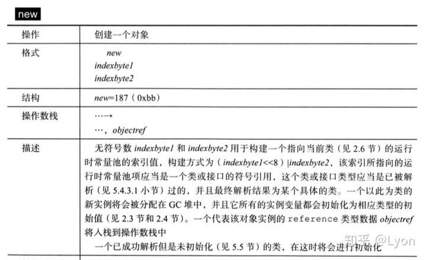

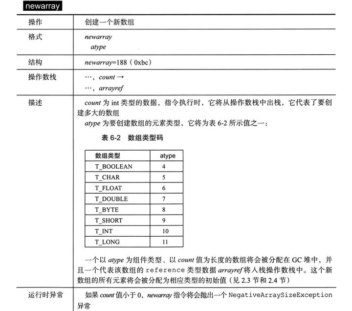

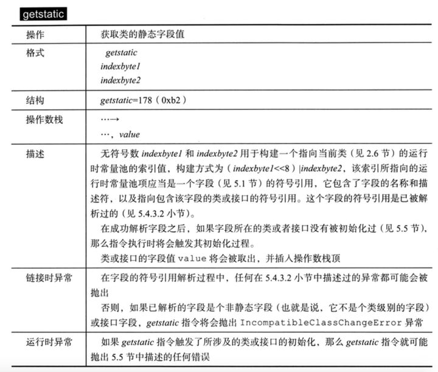

#### 操作数栈管理指令

将操作数栈栈顶元素出栈：pop

将操作数栈栈顶2个元素出栈：pop2

复制栈顶1个或2个数值，并将复制的值重新压入栈顶：dup，dup2,dupx1,dup2_x1,dup_x2,dup2_x2

将栈顶两个数值互换：swap

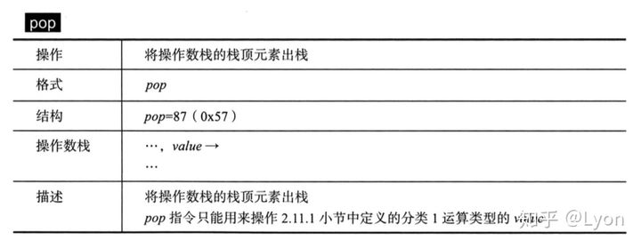

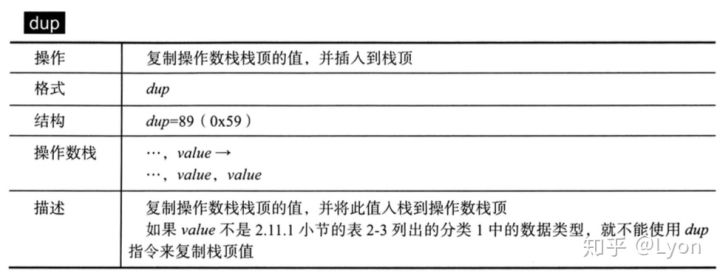

#### 控制转移指令

控制转移指令可以让Java虚拟机从指定位置的指令继续执行(而不是当前指令的下一条指令)，所以从概念模型上理解，可以认为控制转移指令就是在有条件或无条件地修改PC寄存器的值。控制转移指令如下：

条件分支：ifeq,iflt,ifle,ifne,ifgt,ifge,jfnull,ifnonnull,ificmpeq,ificmpne,ificmplt,ificmpgt,if_icmple,if_icmpge,if_acmpeq,if_acmpne

复合条件分支：tableswitch,lookupswitch

无条件分支：goto,goto_w,jsr,jsr_w,ret

#### 方法调用和返回指令

**方法调用指令**

方法调用(分派、执行过程)指令非常重要，这里仅列举5条常用的方法调用指令：

invokevirtual：用于调用对象的实例方法，根据对象的实际类型进行分派(虚方法分派)，这也是Java语言中最常见的方法分派方式。

invokeinterface：用于调用接口方法，它会在运行时搜索一个实现了此接口的对象，找出合适的方法进行调用。

invokespecial：用于调用一些需要特殊处理的实例方法、包括实例初始化方法、私有方法和父类方法。

invokestatic：用于调用类方法(static方法)

invokedynamic:指令用于在运行时动态解析出调用点限定符所引用的方法，并执行该方法，前面的4条调用指令的分派逻辑都固话在Java虚拟机内部，而invokedynamic指令的分派逻辑则是由用户所设定的引导方法所决定的。

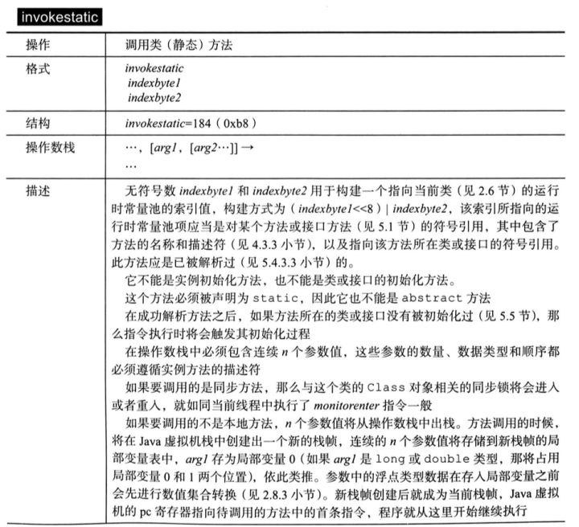

**方法返回指令**

方法调用指令与数据类型无关， 方法返回指令是根据返回值的类型区分的，包括：

return：提供声明为void的方法、实例初始化方法、类和接口的类初始化方法使用

ireturn：返回int类型的数据，当返回值是boolean、byte、char、short和int时使用其他类型的返回指令：lreturn、freturn、dreturn、areturn

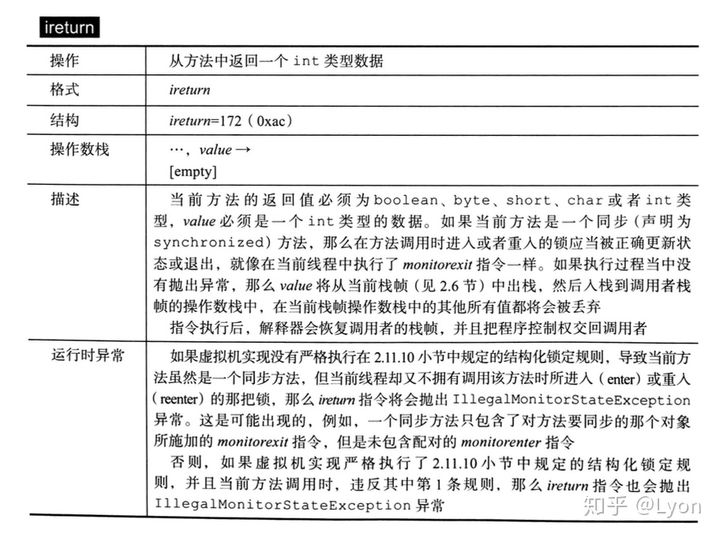

#### 异常处理指令

在Java程序中显示抛出异常的操作(throw语句)都由athrow指令来实现，除了用throw语句显示抛出的异常以外，Java虚拟机规范还规定了许多会在JVM检查到异常状况时自动抛出的运行时异常。如在整数运算中，当除数为0时，虚拟机会在idiv或ldiv指令中抛出ArithmeticException异常。

此处需要注意的是，在Java虚拟机中处理异常(catch语句)不是由字节码指令实现的，而是采用异常处理器(异常表)来完成的。

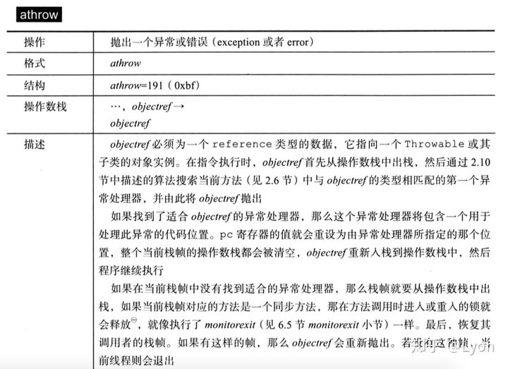

由Java虚拟机执行的每个方法都会配有零至多个异常处理器(Exception handler),异常处理器描述了其在方法代码中的有效作用范围、能处理的异常类型以及处理异常代码所在的位置。要判断某个异常处理器是否可以处理某个具体的异常，需要同时检查异常出现的位置是否在异常处理器的有效作用范围内，以及异常是否为其声明的可以处理的异常类型。

当异常抛出时，Java虚拟机搜索当前方法中的所有异常处理器，如果能匹配，则将代码控制权转向异常处理器的分支之中，否则丢弃当前方法操作数栈和局部变量表，并将当前方法的栈帧出虚拟机栈，程序恢复到当前方法的调用者的栈帧中。

示例如下，是一个方法test2()的字节码指令，其中Code部分是字节码指令(行号0~29)，Exception table中为异常表，定义了一个异常处理器：

```
public static int test2(int);
    descriptor: (I)I
    flags: (0x0009) ACC_PUBLIC, ACC_STATIC
    Code:
      stack=2, locals=3, args_size=1
         0: iinc          0, 20
         3: iload_0
         4: istore_1
         5: iinc          0, 30
         8: getstatic     #2                  // Field java/lang/System.out:Ljava/io/PrintStream;
        11: iload_0
        12: invokevirtual #3                  // Method java/io/PrintStream.println:(I)V
        15: iload_1
        16: ireturn
        17: astore_2
        18: iinc          0, 30
        21: getstatic     #2                  // Field java/lang/System.out:Ljava/io/PrintStream;
        24: iload_0
        25: invokevirtual #3                  // Method java/io/PrintStream.println:(I)V
        28: aload_2
        29: athrow
      Exception table:
         from    to  target type
             0     5    17   any
      LineNumberTable:
        line 17: 0
        line 18: 3
        line 20: 5
        line 21: 8
        line 18: 15
        line 20: 17
        line 21: 21
        line 22: 28
      LocalVariableTable:
        Start  Length  Slot  Name   Signature
            0      30     0     b   I
      StackMapTable: number_of_entries = 1
        frame_type = 81 /* same_locals_1_stack_item */
          stack = [ class java/lang/Throwable ]
```

重点看一下这个test2()方法的异常表：

```
Exception table:
    from    to  target type
        0     5    17   any
```

异常表中有一项内容，即一个异常处理器。from0，to5，target17，any表示了在第0~5范围内的字节码指令内若发生异常，且异常的类型type为任意类型时，程序跳转到第17行继续执行。如果异常发生在5以后，则不能被此异常处理器捕获，此时test2()方法的局部变量表已经操作数栈将被清空，test2()方法栈帧将被销毁，程序返回到test2()方法的调用者处继续执行。

#### 同步指令

Java虚拟机可以支持方法级的同步和方法内部一段指令序列的同步，两种同步都是使用管程(Monitor)来支持的。

方法级的同步

方法级的同步时隐式的，即无需通过字节码指令控制，它实现在方法调用和返回操作之中。虚拟机可以从方法常量池的方法表中ACC_SYNCHRONIZED访问标志得知此方法是否声明为同步方法。当方法调用时，如果此方法为同步方法，则执行线程就要去先成功持有管程，然后才能执行方法，方法(无论是否正常完成)完成后释放管程。如果这个同步方法执行期间抛出异常，并且方法内部无法处理，那么此方法持有的管程将在异常抛出去后自动释放。

指令序列级的同步

同步一段指令序列通常是由Java中的synchronized语句块来表示的，Java虚拟机指令集中有monitorenter和monitorexit两条指令来支持synchronized关键字。