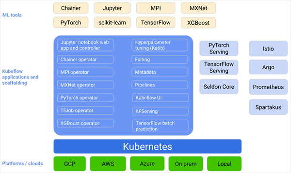
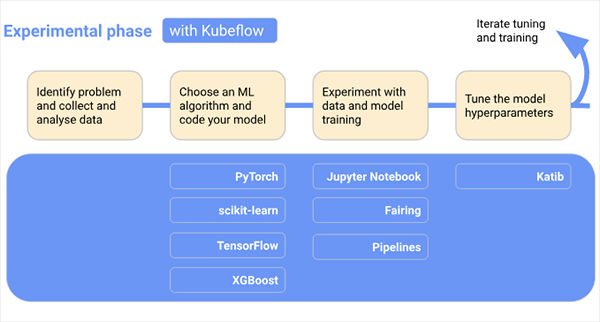
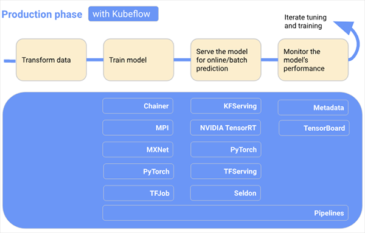
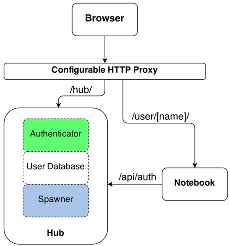
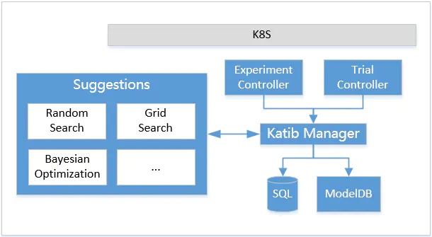
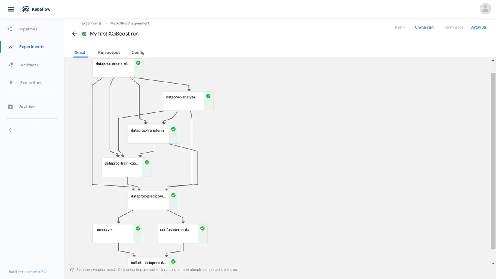
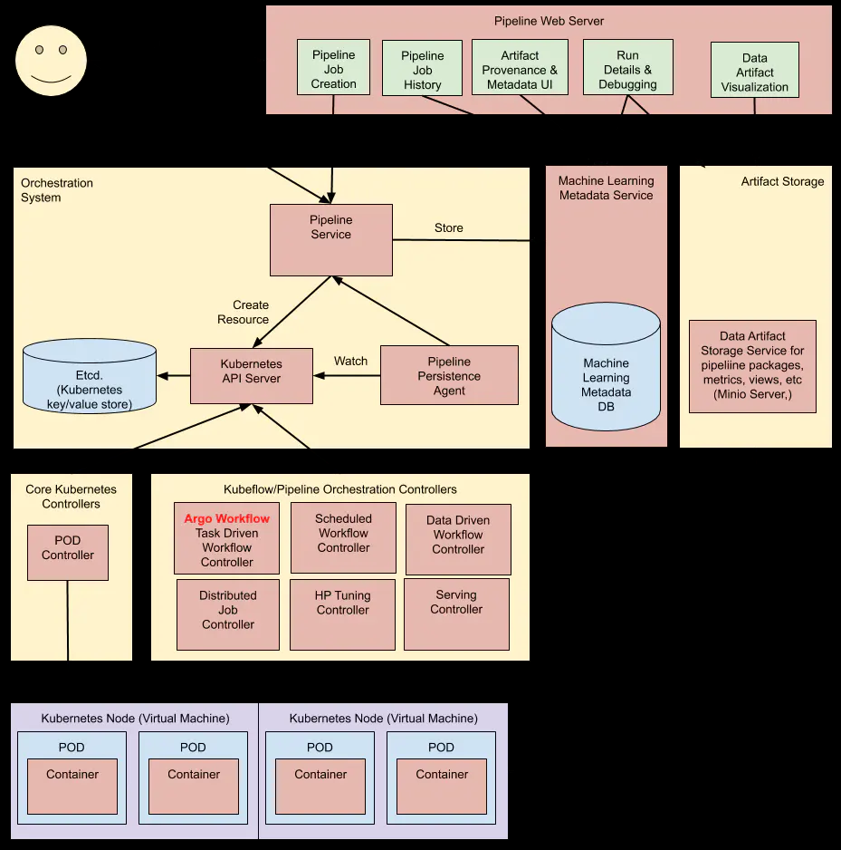
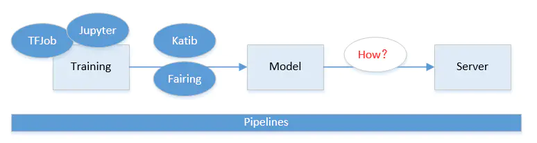
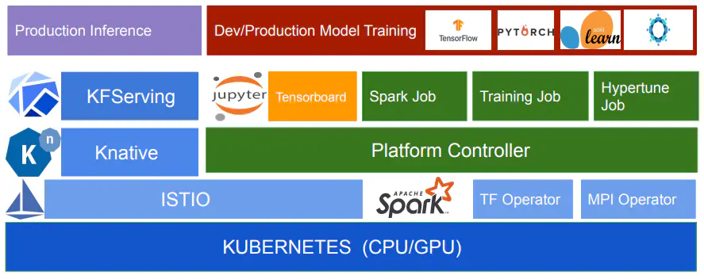
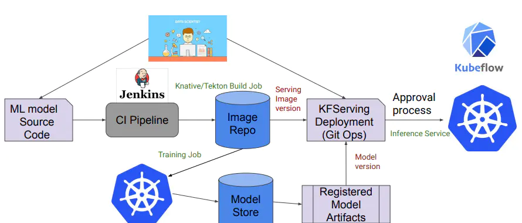

### Kubeflow平台组件

当我们开发和部署ML系统时，ML工作流程通常包括几个阶段。开发ML系统是一个反复的过程。我们需要评估ML工作流各个阶段的输出，并在必要时对模型和参数进行更改，以确保模型不断产生所需的结果。为了便于理解，下图安顺序显示了工作流程阶段，并将Kubeflow添加到工作流中，显示在每个阶段都有哪些Kubeflow组件有用。工作流末尾的箭头指向流程，以表示流程的迭代属性：

- 在实验阶段，我们将基于初始假设来开发模型，并反复测试和更新模型以产生所需的结果：

- 确定我们要ML系统解决的问题

- 收集和分析训练ML模型所需的数据

- 选择一个ML框架和算法，并为模型的初始版本编码

- 试验数据并训练模型

- 调整模型超参数以确保最有效的处理和最准确的结果

- 在生产阶段，我们将部署执行一下过程的系统：

- 将数据转换为训练系统所需的格式(为了确保我们的模型在训练和预测过程中型位始终一致，转换过程在实验阶段和生产阶段必须相同)

- 训练ML模型

- 服务模型以进行在线预测或批处理模式运行

- 监督模型的性能，并将结果输入到我们的程序中，以调整或重新训练模型

由此可以看出，Kubeflow的目标是基于K8S，构建一整套统一的机器学习平台，覆盖最主要的机器学习流程(数据->特征->建模->服务->监控)，同时兼顾机器学习的实验探索阶段和正式的生产环境。

#### 1. Central Dashboard(Stable)

> **Kubeflow的dashboard看板页面**

#### 2. Metadata(Beta)

> **用于跟踪各数据集、作业与模型**

#### 3. Jupyter Notebooks

> **一个交互式业务IDE编码环境**

Jupyter本身抱恨很多组件。对于个人用户，使用Jupyter+Notebook就足够了。但是如果把Jupyter当成一个公司级的平台来看待的话就远远不够了。这时候需要考虑的事情就比较多了，比如多用户、资源分配、数据持久化、数据隔离、高可用、权限控制等等。而这些问题恰恰是K8S的特长。因此把Jupyter和K8S结合起来使用就非常顺利成章。
JuphterHub是一个多用户的Jupyter门户，在设计之初就把多用户创建、资源分配、数据持久化等功能做成了插件模式。其工作机制如下图所示：

既然JupyterHub是个框架，因此出现了各种各样的插件。比如可以单机部署利用OS用户实现多用户和数据隔离；也可以使用OAuth完成用户鉴权等。当然，将真个JupyterHub和K8S结合起来，是最完美的姿势。

#### 4. Frameworks for Training

> **支持的ML框架**

#### 5. Katib

> **超参数服务器**
> TFJob支持分布式
> PyTorchJob支持分布式
> K8sJob不支持分布式

在了解katib的处理流程之前，先介绍下katib目前由哪些组件：

- Experiment Controller：提供对Experiment CRD的生命周期管理。

- Trail Controller：提供对Trail CRD的生命周期管理。

- Suggestions：以Deployment的方式部署，用Service方式暴露服务，提供超参数搜索服务。目前由随机搜索，网格搜索，贝叶斯优化等。

- Katib Manager：一个GRPC server，提供了对Katib DB的操作接口，同时充当Suggestion与Experiment之间的代理。

- Katib DB：数据库。其中会存储Trail和Experiment，以及Trail的训练指标。目前默认的数据库为MySQL。

**Katib架构**

**Katib工作原理**

当一个Experiment被创建的时候，Experiment Controller会先通过Katib Manager在Katib DB中创建一个Experiment对象，并且打赏Finalizer表名这一个对象使用了外部资源(数据库)。随后，Experiment Controller会根据自身的状态和关于并行的定义，通过Katib Manager提供的GRPC接口，让Manager通过Suggestion提供的GRPC接口获取超参数取值，然后再转发给ExperimentController。在这个过程中，Katib Manager是一个代理的角色，它代理了Experiment Controller对Suggestion的请求。拿到超参数去之后，Experiment Controller会根据Trail Template和超参数的取值，构造出Trail的定义，然后在集群中创建它。Trail被创建后， 与Experiment Controller的行为类似，Trail Controller同样会通过Katib Manager在Katib DB中创建一个Trail对象。随后会构造出期望的Job(入batchv1 Job，TFJob，PyTorchJob等)和Metrics Collector Job，然后在集群上创建出来。这些Job运行结束后，Trail Conroller会更新Trail的状态，进而Experiment Controller会更新Experiment的状态。

然后Experiment会继续下一轮的迭代。之前的Trail已经被训练完成，而且训练的指标已经被收集起来了。Experiment会根据配置，判断是否要再创建新的Trial，如果需要则再重复之前的流程。

#### 5.1 Hyperparameter Tuning(Beta)

> **超参数调整**

#### 5.2 Neural architecture search(Alpha)

> **神经架构搜索**
> Grid search
> Random search
> Bayesian optimization
> HYPERBAND
> Hyperopt TPE
> NAS based on reinforcement learning(Alpha)

### 6. Pipelines

> 

pipelines实现了一个工作流模型。所谓工作流，或者称之为流水线，可以将其当作一个有向无环图。其中的每一个节点被乘坐组件。组件处理真正的逻辑，比如预处理，数据清晰，模型训练等。每一个组件负责的功能不同，但有一个共同点，即组件都是以Docker镜像的方式被打包，以容器的方式被运行的。

**Piplines架构**

下图显示了Kubeflow Pipelines UI中管道的运行时执行图：

experiment是一个工作空间，在其中可以针对流水线尝试不同的配置。用户在执的过程中可以看到每一步的输出文件，以及日志。step是组件的一次运行，step output artifacts是在组件的一次运行结束后输出的，能被系统的前端理解并渲染可视化的文件。

下图是官方提供的pipelines架构图：

看起来还是比较复杂的，但整体可以将pipelines主要划分为八部分：

- Python SDK：用于创建pipelines组件的特定语言(DSL)

- DSL compiler：将Python代码转换成YAML静态配置文件(DSL编译器)

- Pipeline Web Server：pipeline的前端服务，它收集各种数据以显示相关视图，当前正在运行的pipeline列表，pipeline执行的历史记录，有关各个pipeline运行的调试信息和执行状态等。

- Pipeline Servie：pipeline的后端服务，调用K8S服务从YAML创建pipeline运行。

- Kubernetes Resources：创建CRDs运行piipeline。

- Machine Learning Metadata Service：用于监视由Pipeline Service创建的Kubernetes资源，并将这些资源的状态持久化在ML元数据服务中(存储任务流容器之间的input/output数据交互)

- Artifact Storage：用于存储Metadata和Artifact。Kubeflow Pipelines将元数据存储在MySQL数据库中，将工件存储在Cloud Storage等工件存储中。

- Orchestration Controllers：任务编排，比如Argo Workflow控制器，它可以协调任务驱动的工作流。

**Pipelines工作原理**

流水线的定义可以分为两步，首先是定义组件，组件可以从镜像开始完全自定义。

第一步：首先需要打包一个Docker镜像，这个镜像是组件的依赖，每一个组件的运行，就是一个Docker容器。其次需要为其定义一个python函数，描述组件的输入输出等信息，这一定义是为了能够让流水线理解组件在流水线中的结构，有几个输入节点，几个输出节点等。接下来组件的使用就与普通的组件并无二致了。

第二步：根据定义好的组件组成流水线，在流水线中，由输入输出关系会确定图上的边以及方向。在定义好流水线后，可以通过python中实现好的流水线客户端提交到系统中运行。

虽然pipelines的使用略显复杂，但它的实现其实并不麻烦。震哥哥的架构可以分为五个部分，分别是ScheduledWorkflow CRD以及其operator流水线前端，流水线后端，Python SDK和persistence agent。

- ScheduledWorkflow CRD扩展了argo的Workflow定义。这也是流水线项目中的核心部分，它负责真正的在K8S上按照拓扑序创建出对应的容器完成流水线的逻辑。

- Python SDK负责构造出流水线，并且根据流水线构造出ScheduledWorkflow的YAML定义，随后将其作为参数传递给流水线系统的后端服务。

- 后端服务依赖关系存储数据库(入MySQL)和兑现存储(入S3)，处理所有流水线重得CRUD请求。

- 前端负责可视化整个流水线的过程，以及获取日志，发起新的运行等。

- Persistence agent负责把数据从Kubernetes Master的etcd中sync到后端服务的关系型数据库中，其实显得方式与CRDoperator类似，通过infomer来监听Kubernetes apiserver对应资源实现。

### 7. Tools for Serving

> **ML的模型部署**
> KFServing(Beta)
> Seldon Core Serving(Stable)
> BentoML
> NVIDIA Triton Inference Server
> TensorFlow Serving(Stable)
> TensorFlow Batch Prediction(Alpha)

对于深度学习的产品化来说，训练只是手段不是目的，目的是将通过训练产生的模型放到手机的程序里或者互联网的应用中，用于语音或者文字的识别等应用场景中。

Kubeflow提供两个支持多框架的模型服务工具：KFServing和Seldon Core Serving。或者，可以使用独立的模型服务系统，以便可以选择最能满足模型服务要求的框架。
对于TensorFlow模型，可以使用TensorFlow Serving将TFJob导出的模型进行实时预测。但是，如果打算使用多个框架，则应考虑如上所述使用KFServing或Seldon Core Serving。KFServing是Kubeflow项目生态系统的一部分，Seldon Core Serving是Kubeflow支持的外部项目。
KFServing提供了Kubernetes CRD，用于在任意框架上服务机器学习模型。它旨在通过为常见ML框架(Tensorflow，XGBoost，ScikitLearn，PyTorch和ONNX等)提供高性能，高抽象的接口来解决模型服务用例。

NVIDIA Triton Inference Server是一项REST和GRPC服务，用于对TensorRT，TensorFlow，PyTorch，ONNX和Caffe2模型进行深度学习推理。该服务器经过优化，可以在GPU和CPU上大规模部署机器学习算法。Triton推理服务器以前称为TensorRT推理服务器。
我们可以将NVIDIA Triton Inference Server用作独立系统，但如上所述，更应该考虑使用KFServing。KFServing也包括对NIDIA Triton Inference Server的支持。

虽然Kubeflow最开始只是基于tf-operator，但后来随着项目发展最后变成一个基于云原生构建的机器学习任务工具大集合。从数据采集，验证，到模型训练和服务发布，几乎所有步骤Kubeflow都提供解决方案的组件。

### 8. Multi-Tenancy in Kubeflow(Stable)

> **Kubeflow的多租户**

### 9. Fairing

> **一个将code打包构建image的组件，Kubeflow中大多数组建的实现都是通过定义CRD来工作**
