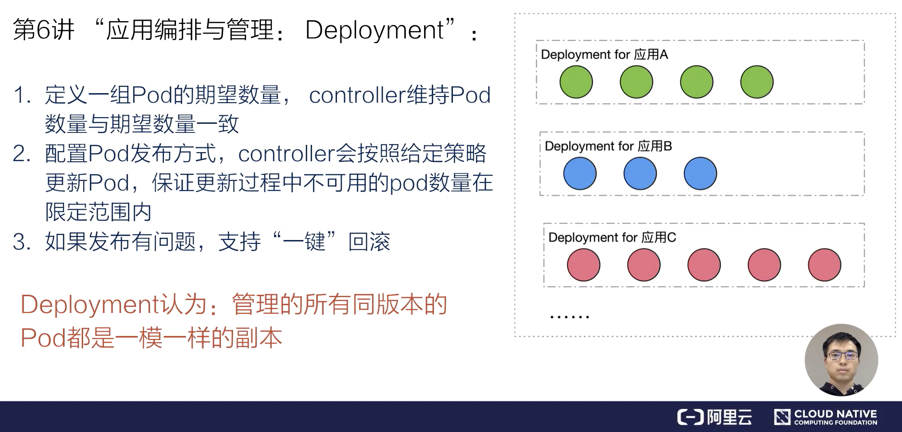
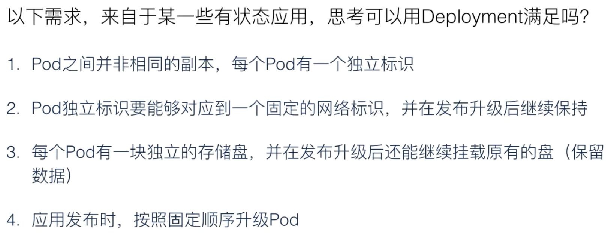
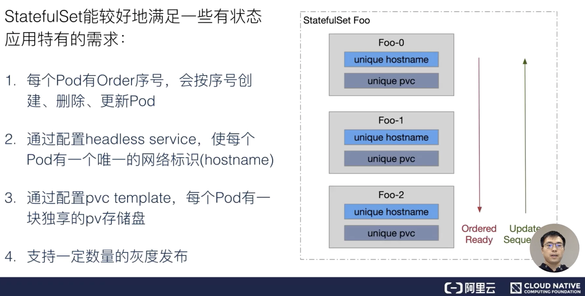
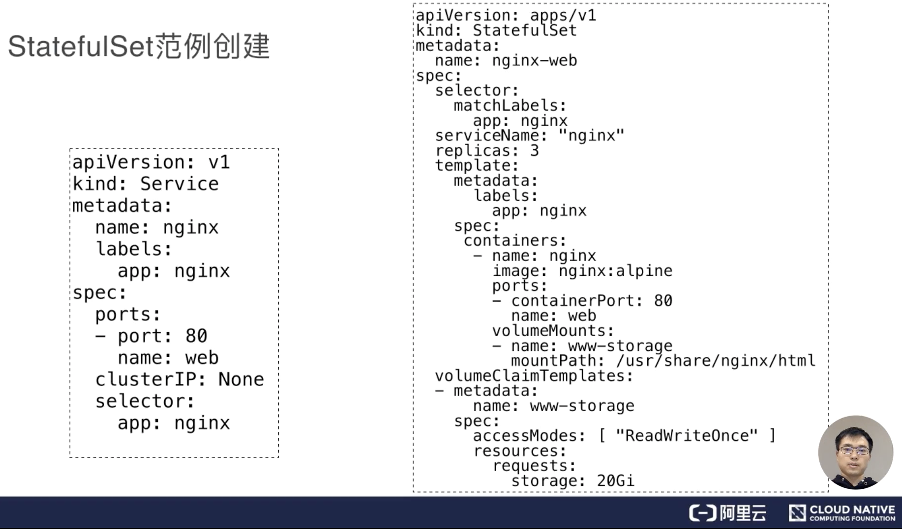
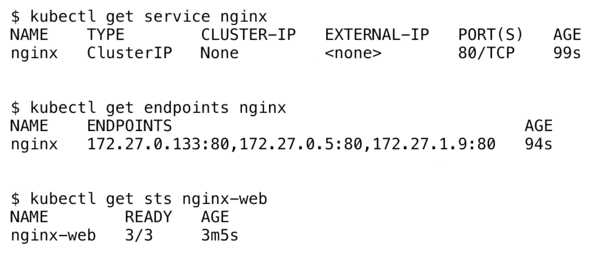
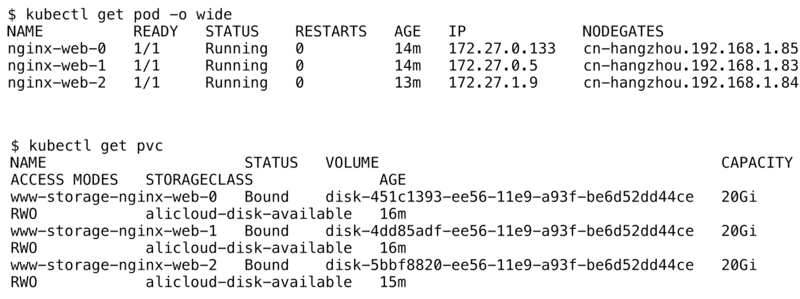
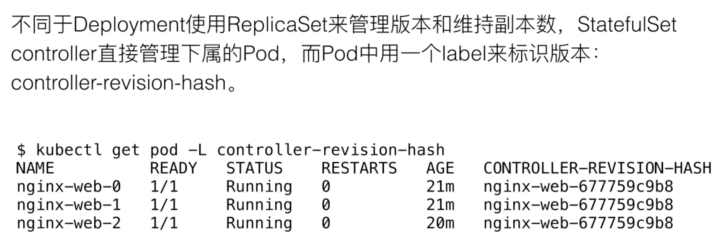
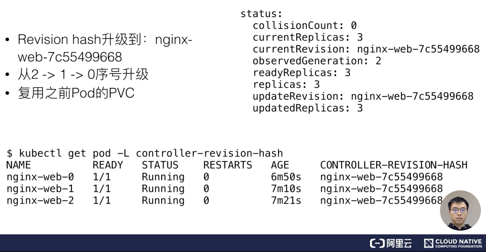
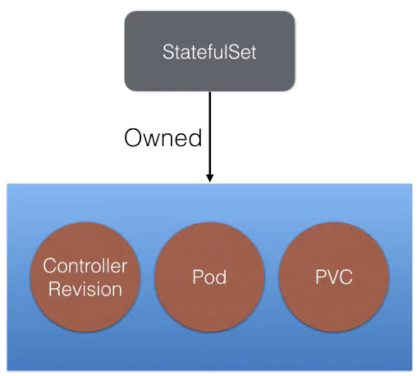
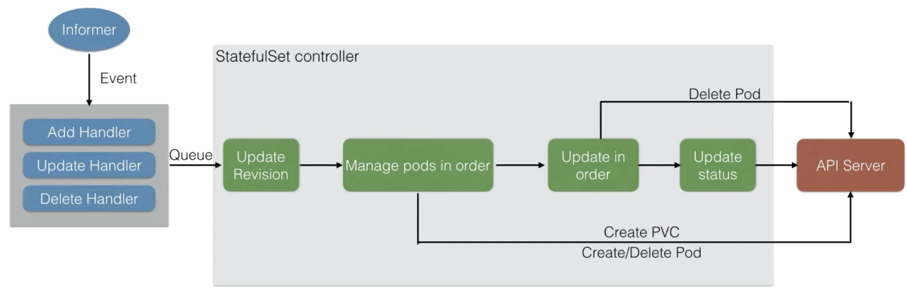

### 一、 "有状态"需求

我们之前讲到过Deployment作为一个应用不该拿牌管理工具，它为我们提供了哪些功能?

如下图所示：

- 首先它支持定义一组Pod的期望数量，Controller会为我们维持Pod的数量在期望的版本以及期望的数量；

- 第二它支持配置Pod发布方式，配置完成后Controller会按照我们给出的策略来更新Pod，同时在更新的过程中，也会保证不可用Pod数量在我们定义的范围内；

- 如果我们在发布的过程中遇到问题，Deployment也支持一键来回滚。

可以简单的说，

#### 需求分析

比如下图所示的一些需求：

以上的这些需求都是Deployment无法满足的，因此K8S社区为我们提供了一个叫StatefulSet的资源，用来管理有状态应用。

#### StatefulSet：主要面向有状态应用管理的控制器

其实现在社区很多无状态应用也通过StatefulSet来管理，通过本文的学习，大家也会明白为什么我们将部分无状态应用也通过StatefulSet来管理。

如上图右侧所示，StatefulSet中的Pod都是有序号的，从0开始一直到定义的replica数量减一。每个Pod都有独立的网络标识：一个hostname、一块独立的pvc以及pv存储。这样的话，同一个StatefulSet下不同的Pod，有不同的网络标识、有自己独享的存储盘，这就能很好的满足了绝大部分有状态应用的需求。

如上图右侧所示：

- 首先，每个Pod会有Order序号，会按照序号来创建，删除和更新Pod；

- 其次，通过配置一个headless Service，使每个Pod有一个唯一的网络标识(hostname)；

- 第三，通过配置pvc模板，就是pvc template，使每个Pod有一块或者多块pv存储盘；

- 最后，支持一定数量的灰度发布。比如现在有三个副本的StatefulSet，我们可以指定只升级其中的一个或者两个，更甚至是三个到新版本。通过这样的方式，来达到灰度升级的目的。

### 二、用例解读

#### StatefulSet范例创建

上图左侧是一个Service的配置，我们通过配置headless Service，其实想要达到的目标是：期望StatefuleSet里面的Pod有独立的网络标识。这里的Service name叫nginx。

上图右侧是一个Stateful的配置，在spec中有个serviceName也叫nginx。通过这个serviceName来指定这个StatefulSet要对应哪个Service。

这个spec中还有其他几个很熟悉的字段，比如selector和template。selector是一个标签选择器，selector定义的标签选择逻辑，必须匹配template中metadata中labels包含app:nginx。在template中定义一个nginx container，这个container用的image版本是alpine版本，对外暴露的80端口作为一个web服务。

最后，template.spec里面定义了一个volumeMounts，这个volumeMounts并不是来源于spec中的一个Volumes，而是来自于volumeClaimTemplates，也就是pvc模板。我们在pvc模板中定义了一个叫www-storage的pvc名称。这个pvc名称，我们也会写到volumeMounts作为一个volume name，挂载到/user/share/nginx/html这个目录下。通过这样的方式来达到每个Pod都有独立的一个pvc，并且挂载到容器中对应目录得一个需求。

#### Service、StatefulSet状态

通过将上文中的两个对象创建之后，我们可以通过get命令可以看到Service nginx资源已经创建成功。

同时可以通过查看endpoints看到，这个后端已经注册了三个IP和端口，这三个IP对应了Pod的IP，端口对应了之前spec中配置的80端口。

最后通过get sts(StatefulSet缩写) nginx-web。从结果可以看到有一列叫做READY，值为3/3。分母3是StatefuleSet中期望的数量，而分子3表示Pod已经达到期望READY的状态数量。

#### Pod、PVC状态

下图中的get pod可以看到三个Pod的状态都是Running状态，并且已经READY。它的IP就是前面看到的endpoint地址。

通过get pvc可以看到NAME那一列名称，前缀为www-storage，中间是nginx-web，后缀是一个序号。通过分析可以知道www-storage是volumeClaimTemplates中定义的name，中间为StatefulSet定义的name，末尾的序号对应着Pod的序号，也就是三个PVC分别被三个Pod绑定。通过这样一种方式，达到不同的Pod享有不同的PVC；PVC也会绑定相应的一个PV，来达到不同的Pod绑定不同PV的目的。

#### Pod的版本

之前我们学到Deployment使用ReplicaSet来管理Pod的版本和所期望的Pod数量，但是在StatefulSet中，是由StatefulSet Controller来管理下属的Pod，因此StatefulSet通过Pod的label来标识这个Pod所属的版本，这里叫controller-revision-hash。这个label表示和Deployment以及StatefulSet在Pod中注入的Pod template hash是类似的。

如上图所示，通过get pod查看到controller-revision-hash，这里的hash就是i第一次创建Pod对应的template版本，可以看到后缀是677759c9b8。这里先记录一下，接下来会做Pod升级，再来看一下controller-revision-hash会不会发生改变。

#### 更新镜像

通过执行上图的命令，可以看到上图下方的StatefulSet配置中，已经把StatefulSet中的image更新到了mainline新版本。

#### 查看新版本状态

通过get pod命令查询Revision hash，可以看到三个Pod后面的controller-revision-hash都已经升级到了新的Revision hash，后面变成了7c55499668。通过这三个Pod创建的时间可以发现：序号为2的Pod创建的是最早的，之后是序号是1和0。这表示在升级的过程中，真实的升级顺序为2-1-0，通过这么一个倒序的顺序来逐渐把Pod升级为新版本，并且我们升级的Pod，还复用了之前Pod使用的PVC。所以之前在PV存储盘中的数据，仍然会挂载到新的Pod上。

上图右上方是在StatefulSet的status中看到的数据，这里有几个重要的字段：

- currentReplica：表示当前版本的数量

- currentRevision：表示当前版本号

- updateReplica：表示新版本的数量

- updateRevision：表示当前要更新的版本号

当然这里也能看到currentReplica和updateReplica，以及curentRevision和updateRevision都是一样的，这就表示所有Pod已经升级到了所需要的版本。

### 三、架构设计

#### 管理模式

StatefulSet可能会创建三种类型的资源。

- 第一种资源：ControllerRevison

    **通过这个资源，StatefulSet可以很方便的管理不同版本的template模板。**

    举个例子：比如上文中提到的nginx，在创建之初拥有的第一个template版本，都会创建一个对应的ControllerRevision。而当修改了image版本之后，StatefulSet Controller会创建也给新的ControllerRevision，大家可以理解为每一个ControllerResion对应了每一个版本得Template，也对应了每一个版本的ControllerResion hash。其实在Pod label中定义的ControllerRevision hash，就是ControllerRevison的名字。通过这个资源StatefulSet Controller来管理不同版本的tmeplate资源。

- 第二种资源：PVC

    **如果在StatefulSet中定义了volumeClaimTemplates，StatefulSet会在创建Pod之前，先更具这个模板创建PVC，并把PVC加到Pod volume中。**

    如果用户在spec的pvc模板中定义了volumeClaimTemplates，StatefulSet在创建Pod之前，根据模板创建PVC，并加到Pod对应的volume中。当然也可以在spec中不定义pvc template，那么所创建出来的Pod就不会挂载单独的一个pv。

- 第三种资源：Pod

    **StatefulSet按照顺序创建、删除、更新Pod，每个Pod有唯一的序号。**

    

    如上图所示，StatefulSet Controller是Owned三个资源：ControllerRevision、Pod、PVC。

    这里不同的地方在于，当前版本的StatefulSet只会在ControllerRevision和Pod种添加OwnerReference，而不会在PVC种添加OwnerReference。拥有OwnerReference的资源，在管理的这个资源进行删除的默认情况下，会关联级联删除下属资源。因此默认情况下删除StatefulSet之后，StatefulSet创建的ControllerRevision和Pod都会被删除，但是PVC因为没有写入OwnerReference，PVC并不会被级联删除。

#### StatefuleSet控制器

上图为StatefulSet控制器的工作流程，下面来简单介绍一下整个工作处理流程。

首先通过注册Infomer的Event Handler(事件处理)，来处理StatefulSet和Pod的变化。在Controller逻辑中，每一次收到StatefulSet或者是Pod的变化，都会找到对应的StatefulSet放到队列。紧接着从队列取出来处理后，先做的操作是Update Revision，也就是先查看当前拿到的StatefulSet种的template，有没有对应的ControllerRevision。如果没有，说明template已经更新过，Controller就会创建也给新版本的Revision，也就有了一个新的ControllerRevision hash版本号。

然后Controller会把所有版本号拿出来，并且按照序号整理一遍。这个整理的过程中，如果发现有缺少的Pod，它就会按照序号去创建，如果发现有多余的Pod，就会按照序号去删除。当保证了Pod数量和Pod序号满足Replica数量之后，Controller回去查看是否需要更新Pod。也就是说这两步的区别在于，Manager pods in order去查看所有的Pod是否满足序号；而后者Update in order查看Pod期望的版本是否符合要求，并且通过序号来更新。

Update in order其更新过程如上图所示，其实这个过程比较简单，就是删除Pod。删除Pod之后，其实是在下一次触发事件，Controller拿到这个success之后会发现缺少Pod，然后再从前一个步骤Manager pod in order中把新的Pod创建出来。再这之后Controller会做一次Update status，也就是之前通过命令行看到的status信息。

通过整个这样的一个流程，StatefulSet达到了管理有状态应用的能力。