### 一、etcd项目的发展历程

etcd诞生于CoreOS公司，它最初是用于解决集群管理系统中OS升级的分布式并发控制以及配置文件的存储于分发等问题。基于此，etcd被设计为提供高可用、强一致的小型key-value数据存储服务。

项目当前隶属于CNCF基金会，被AWS、Google、Microsoft、Alibaba等大型互联网公司广泛使用。

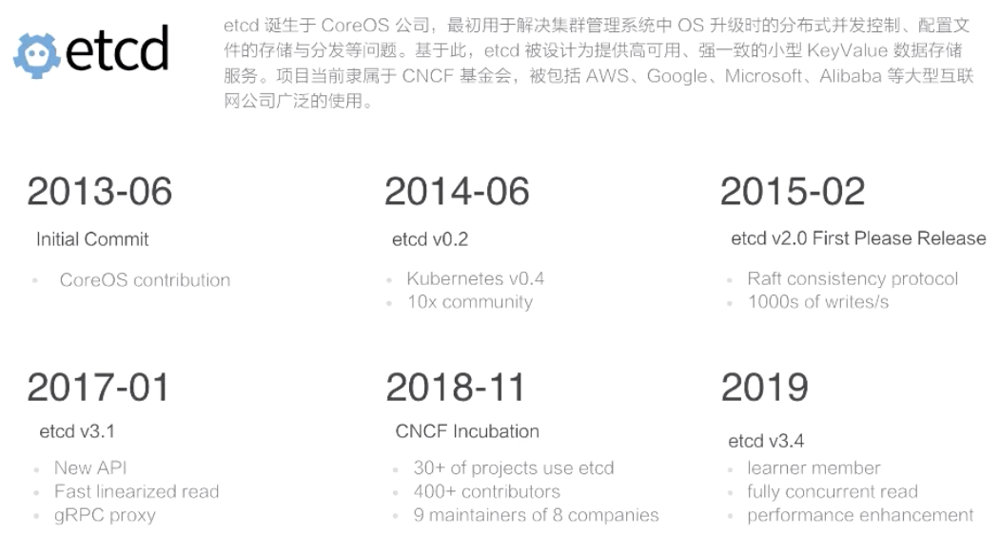

最初，在2013年6月份由CoreOS公司向GitHub中提交了第一个版本的初始代码。

到了2014年的6月，社区发生了以减事情，K8S v0.4版本发布。这里由必要介绍一下K8S项目，它首先是一个容器管理平台，由谷歌开发并贡献给社区，因为它集齐了谷歌在容器调度以及集群管理等领域的多年经验，从诞生之初就备受瞩目。在K8S v0.4版本中，它使用了etcd 0.2版本作为实验核心元数据的存储服务，自此etcd社区得到了飞速的发展。

很快，在2015年2月份，etcd发布了第一个正式的稳定版本2.0。在2.0版本中，etcd重新设计了Raft一致性算法，并为用户提供了一个简单的树形数据视图，在2.0本本中etcd支持每秒超过1000次的写入性能，满足了当时绝大多数的应用场景需求。2.0版本发布之后，经过不断地迭代与改进，其原有的数据存储方案逐渐成为了新时期的性能瓶颈，之后etcd启动了v3版本的方案设计。

2017年1月份的时候，etcd发布了3.1版本，v3版本方案基本上标志着etcd技术上全面成熟。在v3版本中etcd提供了一套全新的API，重新实现了更高效的一致性读取方法，并且提供了一个gRPC的proxy用于扩展etcd的读取性能。同时，在v3版本的方案中包含了大量的GC优化，在性能优化方面取得了长足的进步，在该版本中etcd可以支持每秒超过10000次的写入。

2018年，CNCF基金会下的众多项目都使用了etcd作为其核心的数据存储。据不完全统计，使用etcd的项目超过了30个，在同年11月份，etcd项目自身也成为了CNCF旗下的孵化项目。进入CNCF基金会后，etcd拥有了超过400个贡献组，其中包含了来自AWS、Google、Alibaba等8个公司的9个项目维护者。

2019年，etcd即将发布全新的3.4版本，该版本由Google、Alibaba等公司联合打造，将进一步改进etcd的性能及稳定性，以满足在超大型公司使用中苛刻的场景要求。

### 二、架构及内部机制解析

#### 总体结构

etcd是一个分布式的、可靠的key-value存储系统，它用于存储分布式系统中的关键数据，这个定义非常重要。

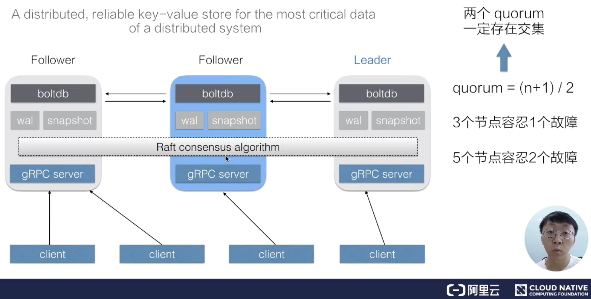

一个etcd集群，通常会由3个或者5个节点组成，多个节点之间通过Raft一致性算法完成分布式一致性协同，算法会选举出一个主节点作为leader，由leader负责数据的同步与数据的分发。当leader出现故障后系统会自动的选取另一个节点成为leader，并重新完成数据的同步。客户端在多个节点中，仅需要选择其中的任意一个就可以完成数据的读写，内部的状态及数据协同由etcd自身完成。

在etcd整个架构中，有一个非常关键的概念叫做quorum，quorum的定义是(n+1)/2，也就是说超过集群中半数节点组成的一个团体，在3个节点的集群中，etcd可以容许1个节点故障，也就是只要有任何2个节点可用，etcd就可以继续提供服务，这也是etcd集群高可用的关键。

在允许部分节点故障之后继续提供服务，就需要解决一个非常复杂的问题：分布式一致性。在etcd中，该分布式一致性算法由Raft一致性算法完成。Raft一致性算法能够工作的一个关键点是：任意两个quorum的成员之间一定会有一个交集(公共成员)，也就是说只要有任意一个quorum存货，其中一定存在某一个节点(公共成员)，它包含着集群中所有的被确认提交的数据。正式基于这一原理，Raft一致性算法设计了一套数据同步机制，在leader任期切换后能够重新同步上一个quorum被提交得所有数据，从而保证整个集群状态向前推进的过程中保持数据的一致。

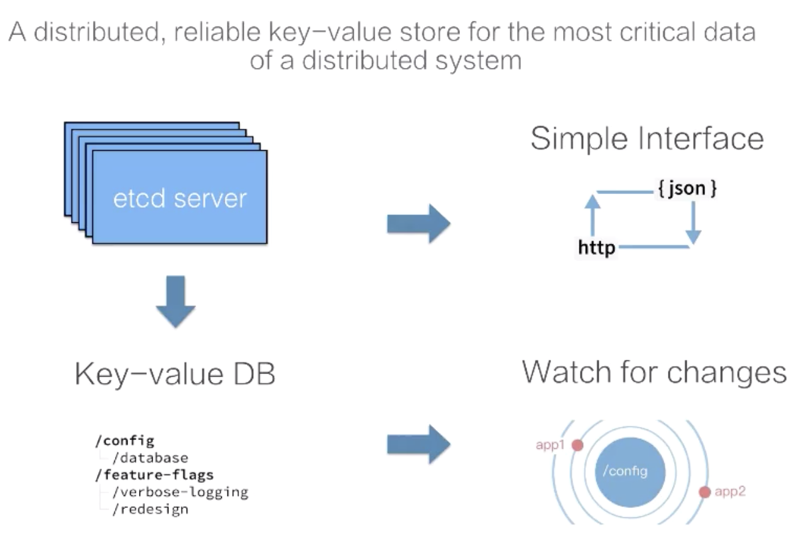

etcd内部的机制比较复杂，但etcd给客户提供的接口是简单直接的。如上图所示，我们可以通过etcd提供的客户端去访问集群的数据，也可以直接通过http的方式(类似curl命令)直接访问etcd。在etcd内部，其数据表示也是比较简单的，我们可以直接把etcd的数据存储理解为一个有序的map，它存储着key-value数据。同时etcd为了方便客户端去定于数据得变更，也支持了一个watch机制，通过watch实时的拿到etcd中数据得增量更新，从而实现与etcd中的数据同步等业务逻辑。

#### API介绍

接下来我们看一下etcd提供的接口，这里将etcd的接口分为了5组：

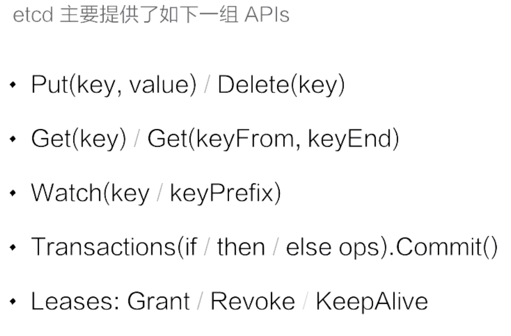

- 第一组是Put与Delete。上图可以看到put与delete的操作都非常简单，只需要提供一个key和一个value，就可以向集群中写入数据了，删除数据得时候只需要指定key即可

- 第二组是查询操作。etcd支持两种类型的查询：第一种是指定单个key的查询，第二种是指定的一个key的范围

- 第三组是数据订阅。etcd提供了Watch机制，我们可以利用watch实时订阅到etcd中增量的数据更新，watch支持指定单个key，也可以指定一个key的前缀，在实际应用场景中的通常会采用第二种形式

- 第四组事务操作。etcd提供了一个简单的事务支持，用户可以通过指定一组条件满足时执行某些动作，当条件不成立的时候执行另一组操作，类似于diamagnetic中的if else语句，etcd确保整个操作的原子性

- 第五组时Leases接口。Leases接口是分布式系统中常用的一种设计模式。

#### 数据版本机制

要正确使用etcd的API，必须要知道内部对应数据版本号的基本原理。

首先etcd中有个term的概念，代表的是整个集群Leader的任期。当其中发生Leader切换，term的值就会+1。在节点故障，或者Leader节点网络出现问题，再或者是将整个集群停止后再次拉起，都会发生Leader的切换。

第二个版本号叫做revision，revision代表的是全局数据的版本。当数据发生变更，包括创建、修改、删除，其revision对应的都会+1。特别的，再集群中跨Leader任期之间，revision都会保持全局单调递增。正是revision的这一特性，使得集群中任意一次的修改都对应着一个唯一的revision，因此我们可以通过revision来支持数据的MVCC，也可以支持数据得Watch。

对于每一个Key-Value数据节点，etcd中都记录了三个版本：

- 第一个版本叫做create_revision，是Key-Value在创建时对应的revision

- 第二个叫做mod_revision，是其数据被操作的时候对应的revision

- 第三个version就是一个计数器，代表了Key-Value被修改了多少次

这里可以用图的方式给大家展示一下：

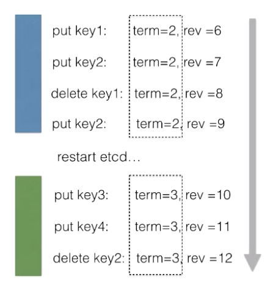

在同一个Leader任期之内，我们发现所有的修改操作，其对应的term值始终都等于2，而revision则保持单调递增。当重启集群之后，我们会发现所有的修改操作对应的term值都变成了3。在新的Leader任期内，所有的term值都等于3，且不会发生变化，而对应的revision值同样保持单调递增。从一个更大的维度去看，可以发现在term=2和term=3的两个Leader任期之间，数据对应的revision值一九保持了全局单调递增。

#### mvcc & streaming watch

了解etcd的版本号控制后，接下来如何使用etcd多版本号来实现并发控制以及数据订阅。

在etcd中支持对同一个Key发起多次数据修改，每次数据修改对应一个版本号。etcd在实现上记录了每一次修改对应的数据，也就意味着一个Key在etcd中粗壮乃多个历史版本。在查询数据的时候如果不指定版本号，etcd会返回Key对应的最新版本，当然etcd也支持指定一个版本号来查询历史数据。

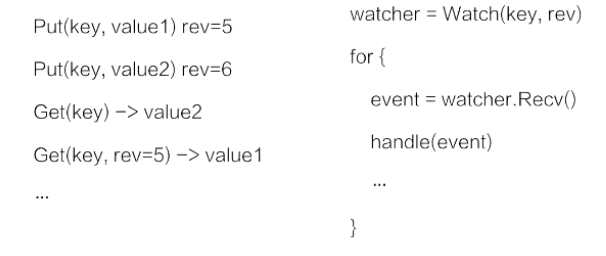

因为etcd将每一个修改都记录了下来，使用watch订阅数据时，可以支持从任意历史时刻(指定revision)开始创建一个watcher，在客户端与etcd之间建立一个数据管道，etcd会推送从指定revision开始的所有数据变更。etcd提供的watch机制保证，该Key的数据后续的被修改之后，通过这个数据管道即时的推送给客户端。

如下图所示，etcd中所有的数据都存储在一个b+tree中(灰色)，该b+tree保存在磁盘中，并通过mmap的方式映射到内存眼红来支持快速的访问。灰色的b+tree中维护着revision到value的映射关系，支持通过revision查询对应的数据。因为revision时单挑递增的，当我们通过watch来订阅指定revision之后的数据时，仅需要订阅该b+tree的数据变化即可。

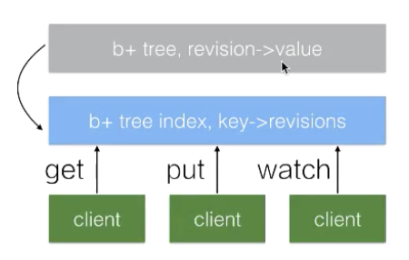

在etcd内部还维护着另外一个btree(蓝色)，它管理者key到revision的映射关系。当客户端使用key查询数据时，首先需要经过蓝色的btree将key转化为对应的revision，再通过灰色的btree查询到对应的数据。

etcd将每一次修改都记录下来会导致数据持续增长，这会带来内存及磁盘的空间消耗，同时也会影响b+tree的查询效率。为了解决这一问题，在etcd中会运行一个周期性的Compaction的机制来清理历史数据，将一段时间之前的同一个Key的多个历史版本数据清理掉。最终的结果是灰色的b+tree依旧保持单调递增，但可能会出现一些空洞。

#### mini-transactions

在理解了mvcc机制及watch机制之后，继续看etcd提供的mini-transactions机制。etcd的transaction机制比较简单，基本可以理解为一段if-else程序，在if中可以提供多个操作，如下图所示：

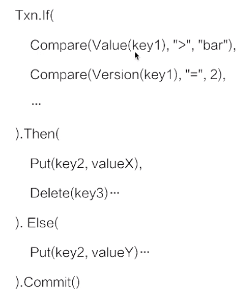

If里面写了两个条件，当Value(key1)大于"bar"并且Version(Key1)的版本等于2的时候，执行Then里面指定的操作：修改Key2的数据为valueX，同时删除Key3的数据。如果不满足条件，则执行另外一个操作：Key2修改为valueY。

在etcd内部会保证整个事务操作的原子性。也就是说If操作所有的比较条件，其看到的视图一定是一致的。同时它能够确保多个操作的原子性不会出现Then中的操作仅执行了一半的情况。

通过etcd提供的事务操作，我们可以在多个竞争中保证数据独写的一致性，比如说前面已经提到过的K8S项目，它正式利用了etcd的事务机制，来实现多个K8S API Server对同一个数据修改的一致性。

#### lease的概念及用法

lease是分布式系统中一个常见的概念，用于代表一个分布式租约。典型情况下，在分布式系统中需要去检测一个节点是否存活的时候，就需要租约机制。

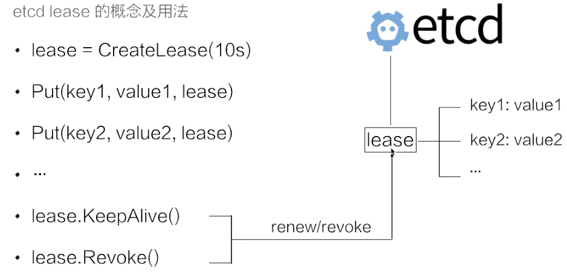

上图示例中的代码首先创建了一个10s的租约，如果创建租约后不做任何的操作，那么10s之后，这个租约就会自动过期。接着将key1和key2两个key value绑定到这个租约之上，这样当租约过期时etcd就会自动清理掉key1和key2，使得节点key1和key2具备了超时自动删除的能力。

如果希望这个租约永不过期，需要周期性的调用KeepAlive方法刷新租约。比如说需要检测分布式系统中一个进程是否存活，可以在进程中去创建一个租约，并在该进行中周期性的调用KeepAlive的方法。如果一切正常，该节点的租约会一直保持，如果这个进程挂掉了，最终这个租约就会自动过期。

在etcd中，允许将多个key关联在同一个lease之上，这个设计是非常巧妙的，可以大幅减少lease对象书信带来的开销。试想一下，如果有大量的key都需要支持类似的租约机制，每一个key都需要独立的去刷新租约，这会给etcd带来非常大的压力。通过多个key绑定在同一个lease的模式，我们可以将超时时间相似的key聚合在一起，从而大幅减小租约刷新的开销，在不是灵活性的同时能够大幅提高etcd支持的使用规模。

### 三、典型的使用场景介绍

#### 元数据存储

K8S将自身作用的状态存储在etcd中，其状态数据的高可用交给etcd来解决，K8S系统自身不需要再应对复杂的分布式系统状态处理，自身的系统架构得到了大幅的简化。

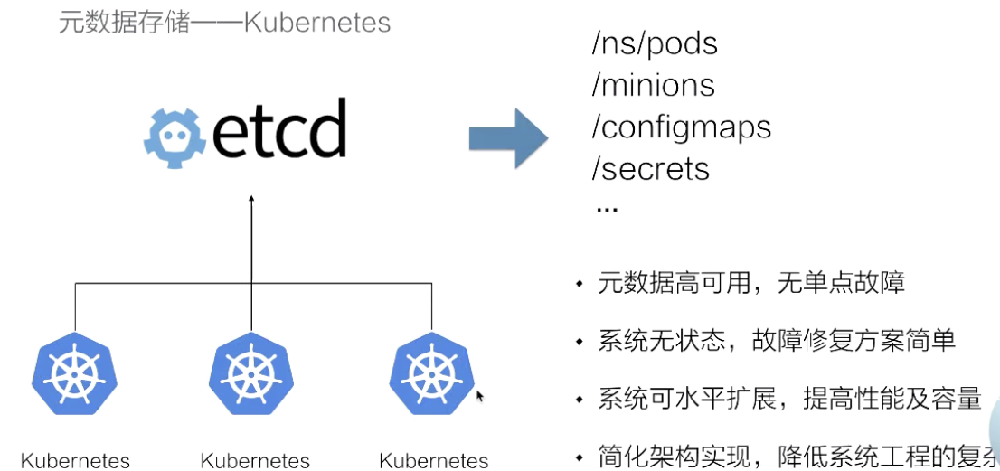

#### Server Discovery(Naming Service)

第二个场景是Service Discovery，也叫做名字服务。在分布式系统中，通常会出现的一个模式就是需要多个后端(可能是成百上千个进程)来提供一组对等的服务，比如说检索服务、推荐服务。

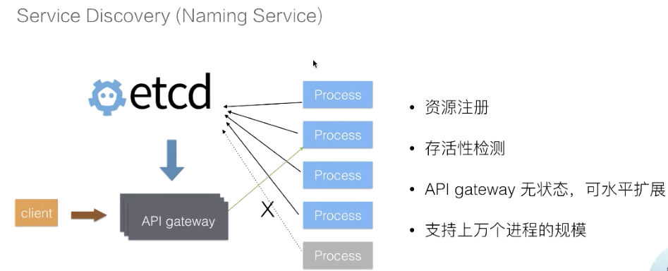

对于这样一种后端服务，通常情况下为了简化后端服务的运维成本(节点故障时随时被替换)，后端的这一进程会被类似K8S这样的集群管理系统所调度，这样当用户(或上游服务)调用过来时，我们就需要一个服务发现机制来解决服务路由问题。这一服务发现问题可以利用etcd来搞笑解决，方式如下：

- 在进程内部启动之后，可以将自身所在的地址注册到etcd

- API网关通过etcd及时感知到后端进程的地址，当后端进程发生故障迁移时会重新注册到etcd中，API网关也能够及时的感知到新的地址

- 利用etcd提供的lease机制，如果提供服务的进程运行过程中出现了异常(crash)，API网关也可以摘除其流量避免调用超时。

在这一架构中，服务状态数据被etcd接管，API网关本身也是无状态的，可以水平的扩展来服务更多的客户。同时得益于etcd的良好性能，可以支持上万个后端进行的节点，使得这一架构可以服务于大型的企业。

#### Distributed Coordination：leader election

在分布式系统中，有一种类型的设计模式就是Master+Slave。通常情况下，Slave提供了CPU、内存、磁盘以及网络等各种资源，而Master用来调和这些节点以使其对外提供一个服务(比如分布式存储，分布式计算)。典型的分布式存储服务(HDFS)以及分布式计算服务(Hadoop)他们都是采用了类似这样的设计模式。这样的设计模式会有一个典型的问题：Master节点的可用性。当Master故障以后，整个集群的服务就挂掉了，没有办法再服务用户的请求。

为了解决这个问题，典型的做法就是启动多个Master节点。因为Master节点内会包含控制逻辑，多个节点之间的状态同步时非常复杂的，这里最典型的做法就是通过选主的方式，选出其中一个节点作为主节点来提供服务，另一个节点处于等待状态。

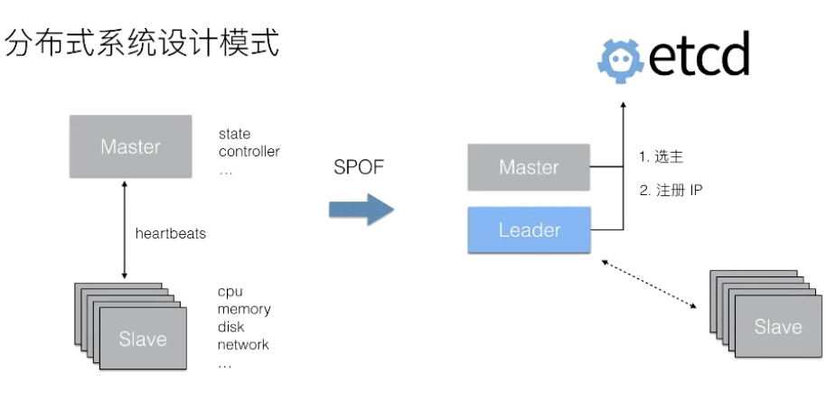

通过etcd提供的机制可以很容易的实现分布式进程的选主功能，比如可以通过对同一个key的事务写来实现抢主的逻辑。一般而言，被选主的Leader会将自己的IP注册到etcd中，使得Slave节点能够及时获取到当前的Leader地址，从而使得系统按照之前单个Master节点的方式继续工作。当Leader节点发生异常之后，通过etcd能够选取出一个新的节点成为主节点，并且注册新的IP之后，Slave又能够拉取新的主节点的IP，继续恢复服务。

#### Distributed Coordination 分布式系统并发控制

在分布式系统中，当我们去执行一些任务，比如说去升级OS、或者说升级OS上的软件的时候、又或者去执行一些计算任务的时候，处于对后端服务的瓶颈或者是业务稳定性的考虑，通常情况下需要控制任务得并发度。如果该任务缺少一个调和的Master节点，可以通过etcd来完成这样的分布式系统工作。

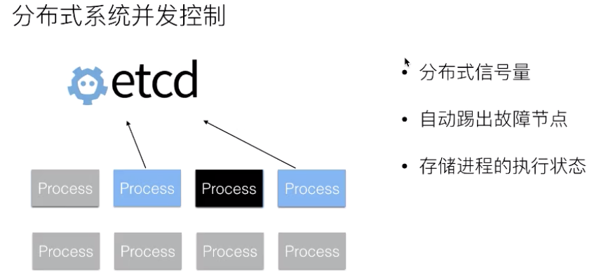

在这个模式中通过etcd去实现一个分布式的信号量，并且可以利用etcd leases机制来实现自动地剔除掉故障节点。在进程执行过程中，如果进程的运行周期比较长，我们可以将进程运行过程中的一些状态数据存储到etcd，从而使得当进程故障之后且需要恢复到其他地方时，能够从etcd中恢复一些执行状态，而不需要重新去完成整个的计算逻辑，以此来加速整个任务的执行效率。