### 一、K8S API请求访问控制

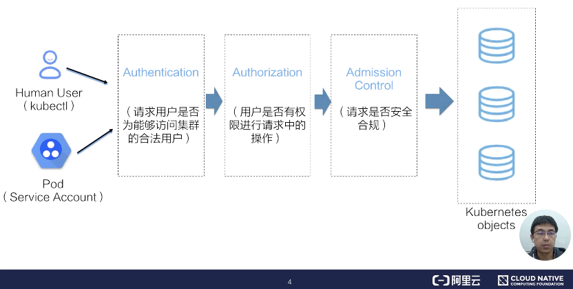

由上图来介绍一下K8S API的请求从发起到其持久化入库的一个流程。

首先看一下请求的发起，请求的发起分为两个部分：

- 第一个部分是人机交互的过程。是大家非常熟悉的kubectl对apiserver的一个请求过程

- 第二个部分是Pod中的业务逻辑与apiserver之间的交互

当我们的apiserver收到请求后，就会开启访问控制流程。这里面分为三个步骤：

- Authentication认证阶段：判断请求用户是否为能够访问集群的合法用户。如果用户是个非法用户，那apiserver会返回一个401的状态码，并终止该请求

- 如果用户合法的话，我们的apiserver会经入到访问控制的第二阶段Authorization：鉴权阶段。在该阶段中apiserver会判断用户是否有权限进行请求中的操作。如果无权进行操作，apiserver会返回403的状态码，并同样终止该请求

- 如果用户有权进行该操作的话，访问控制会进入到第三个阶段：AdmissionControl。在该阶段中apiserver的admission controller会判断请求是否是一个安全合规的请求。如果最终验证通过的话，访问控制流程才会结束。

此时我们的请求将会转换为一个K8S objects相应得变更请求，最终持久化到ETCD中。

### 二、K8S认证

#### K8S中的用户模型

对于认证来说，首先我们要确定请求的发起方是谁。并最终通过认证过程将其转换为一个系统可识别的用户模型用于后期的鉴权，那么先来看一下K8S中的用户模型。

1. K8S没有自身的用户管理能力

什么是用户管理能力呢?我们无法像操作Pod一样，通过API的方式创建删除一个用户实例。同时我们也无法在Etcd中找到用户对应的存储对象。

1. K8S中的用户通常是通过请求凭证设置

在K8S的访问控制流程中用户模型是如何产生的呢?答案就是在请求方的访问控制凭证中，也就是我们平时使用的kube-config中的证书，或者是Pod中引入的ServerAccount。经过K8S认证流程之后，apiserver会将请求中凭证中的用户身份转化为对应的User和Groups这样的用户模型。在随后的鉴权操作和审计操作流程中，apiserver都会使用到该用户模型实例。

1. K8S支持的请求认证方式主要包括：

- Basic认证

该认证方式下，管理员会将Username和Password组成的白名单放置在apiserver读取的静态配置文件上面进行认证，该方式一般用于测试场景，在安全方面是不推荐且不可拓展的一种方式。

- X509证书认证

该方式是apiserver中相对应用较多的使用方式，首先访问者会使用由集群CA签发的，或是添加在apiserver Client CA中授信CA签发的客户端证书去访问apiserver。apiserver服务端在接收到请求后，会进行TLS的握手流程。除了验证证书的合法性，apiserver还会校验客户端证书的请求源地址等信息。开启双向认证，X509认证是一个比较安全的方式，也是K8S组件之间默认使用的认证方式，同时也是kubectl客户端对应的kube-config中经常使用到的访问凭证。

- Bearer Tokens(JWT)

- Service Accouont

- OpenID Connect

- Webhooks

该方式的Tokens是通过JWT的形式，其中包含了签发者、用户的身份、过期时间等多种元信息。它的认证方式也是常见的私钥加签，公钥验签的一个基本流程。基于Token的认证使用场景也很广泛，比如K8S Pod应用中经常使用道德Service Account，其中就是自动绑定一个签名后JWT Token用于请求apiserver。

### 三、K8S鉴权-RBAC

当一个请求在完成apiserver认证后，可以认为它是一个合法的用户，那么如何控制该用户在集群中的哪些namespcae中访问哪些资源，对这些资源又能进行哪些操作呢?

这就由访问控制的第二步K8S鉴权来完成。apiserver本身支持多种鉴权方式，我们主要介绍在安全上推荐的鉴权方式RBAC。

#### RBAC鉴权三要素

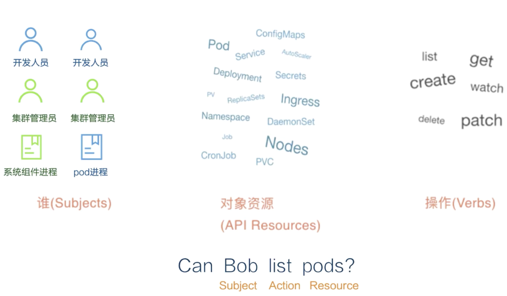

- 第一要素是Subjects，也就是主体。可以是开发人员、集群管理员这样的自热人，也可以是系统组件进程，或者是Pod中的逻辑进程

- 第二个要素是API Resource，也就是请求对应的访问目标。在K8S集群中也就是各类资源

- 第三个要素是Verbs，对应为请求对象资源可以进行哪些操作，包括增删改查、list、get、watch等。

这里举个例子，假设有个通过合法认证的用户Bob，他请求list某个namespace下的Pods，改请求的鉴权语义记为：Can Bob list pods?其中Bob即为请求中的Subject，list为对应的请求动作Action，而pods为对应的请求资源Resource。

#### RBAC权限粒度

上面介绍了RBAC角色模型的三要素，在整个RBAC策略定义下，还需要将这个角色绑定到一个具体的控制域内。这就是K8S大家熟悉的命名空间。通过namespace可以将K8S API资源限定在不同的作用域内。从而帮助我们在一个多租户集群中，对用户进行逻辑上的隔离。

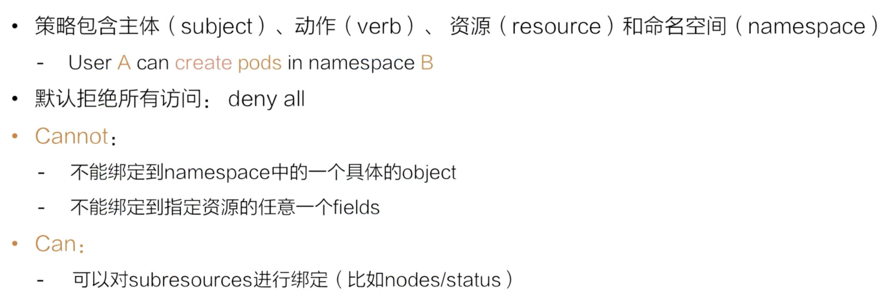

上面的事例可以改为User A can create pods in namespace B。这里需要注意的是，如果不进行任何的权限绑定，RBAC会拒绝所有访问。

通常RBAC会进行对apiserver的细粒度访问控制，但是这个细粒度是个相对的概念，RBAC是面向模型级别的绑定。它不能绑定到namesapce中的一个具体的object实例，更不能绑定到指定资源的任意一个field。

RBAC对访问权限的控制粒度上，它可以细化到K8S API的subresources级别。比如针对一个访问者，我们可以控制其在指定namespace下对nodes/status模型的访问。

#### RBAC-Role

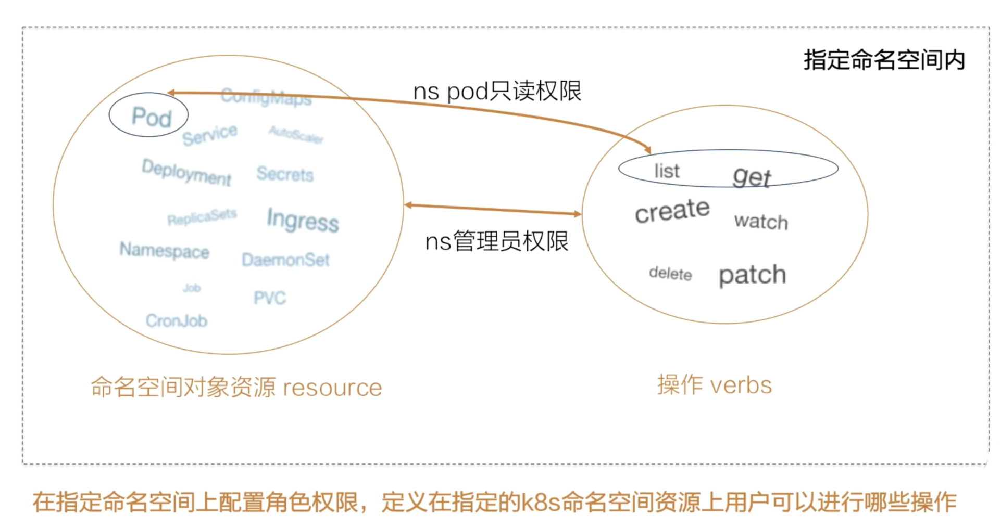

首先是角色Role，它定义了用户在指定的K8S命名空间资源上可以进行哪些操作。比如可以定义一个namespace中的pod的只读权限，同时还可以顶一个namespace管理员权限，它具有对这个命名空间下所有对象资源的所有操作权限。

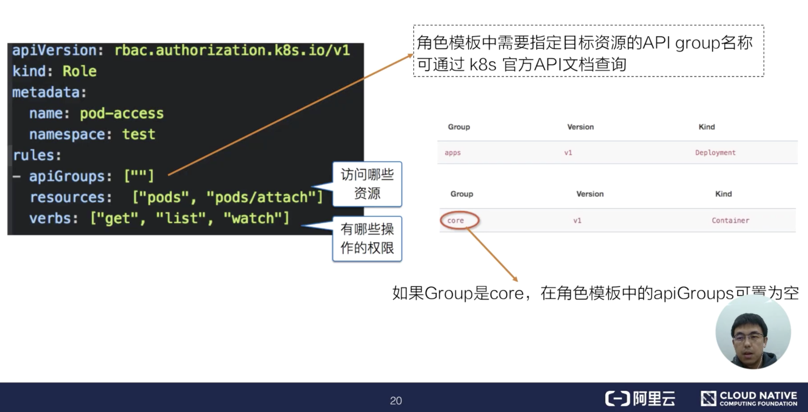

如上图所示，是一个Role的定义模板编排文件，其中resource字段定义了这个角色可以访问哪些资源，verbs字段定义了这个角色有哪些操作的权限。在apiGroups中，需要指定目标资源的apiGroups名称，这里可以通过官方API文档查询，如果指定的Group是core，那么在角色模板中的apiGroups可置为空。

#### RBAC-RoleBinding

当我们完成了一个namespace下的角色定义之后，还需要建立其与使用这个角色的主体之间在namespace下的绑定关系，这里需要一个RoleBinding模型。使用RoleBinding可以将Role对应的权限模型绑定到对应的Subject上。

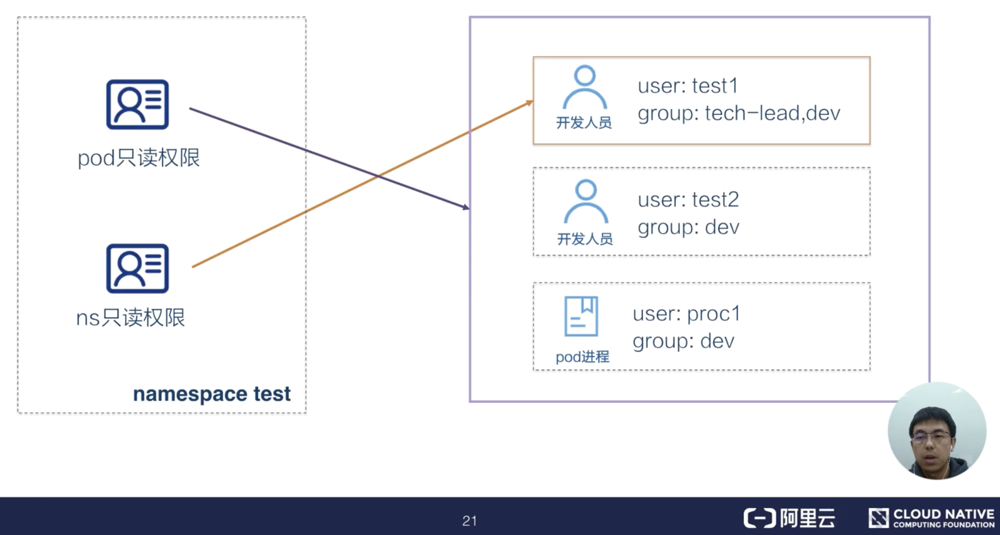

比如这里可以将名为test的namespace中的pod只读权限同时绑定给用户test1和test2以及proc1。也可以将namespace test只读权限绑定tech-lead group中的test1用户，这样用户test2和proc1是没有get namespace权限的。

接着看一下对应的RoleBinding编排文件模板。

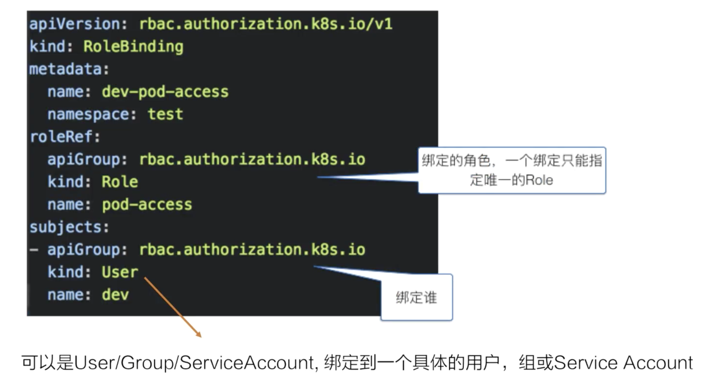

其中roleRef字段中声明了我们需要绑定的角色，一个绑定只能指定唯一的Role。在subject字段中定义了我们要绑定的对象，这里可以是User，Group或者是Service Account。它同时支持绑定多个对象。

#### RBAC-ClusterRole

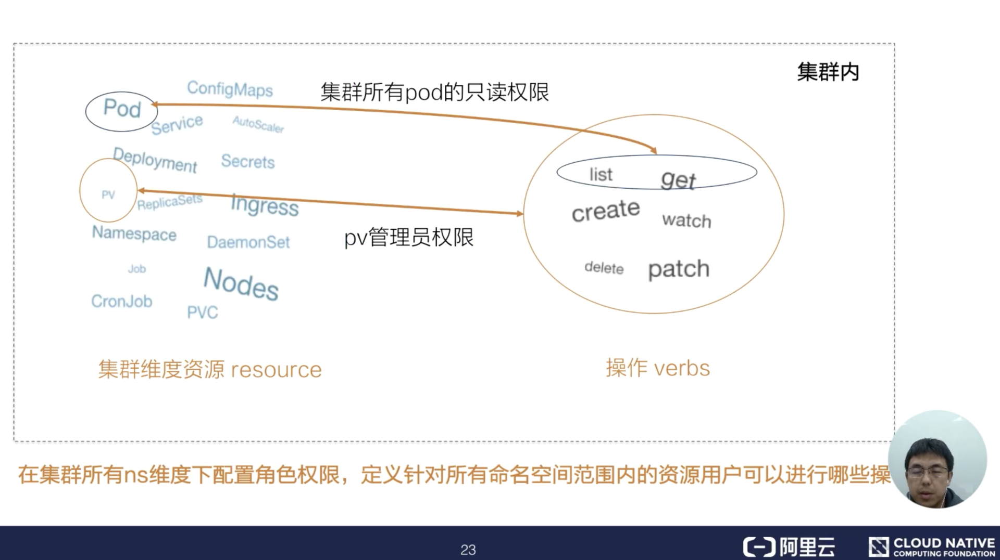

除了定义指定namespace中的权限模型，也可以通过ClusterRole定义一个集群维度的权限模型。在一个Cluster实例中，可以定义集群维度的权限使用权限，比如像PV、Nodes在namespace中不可兼得资源权限，可以在ClusterRole中定义，而操作这些资源的动作同样式之前Role中支持的增删改查和list、watch等操作。

下图为ClusterRole编排文件模板：

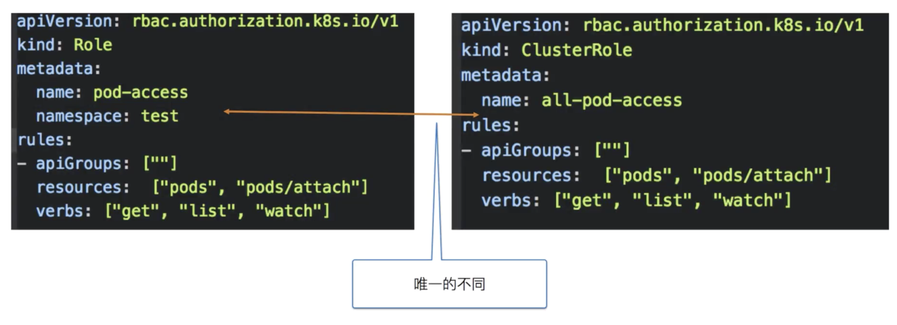

ClusterRole编排文件几乎和Role是一模一样的，唯一不同的地方是ClusterRole中是所有集群维度的权限定义，不支持namespace定义。

#### RBAC-ClusterRoleBinding

同样在ClusterRole的基础上，可以将其绑定在对应的Subject主体上。而ClusterRoleBinding模型实例可以帮助我们在集群所有命名空间上将ClusterRole绑定到具体的Subject对象上。

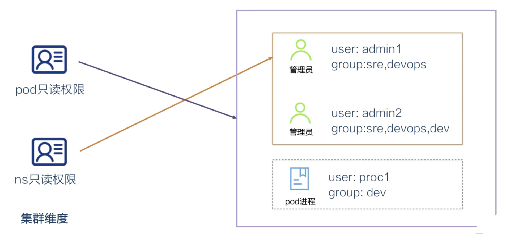

比如这里可以将所有namespace的list权限绑定给group为sre或者devops的管理员admin1和admin2。

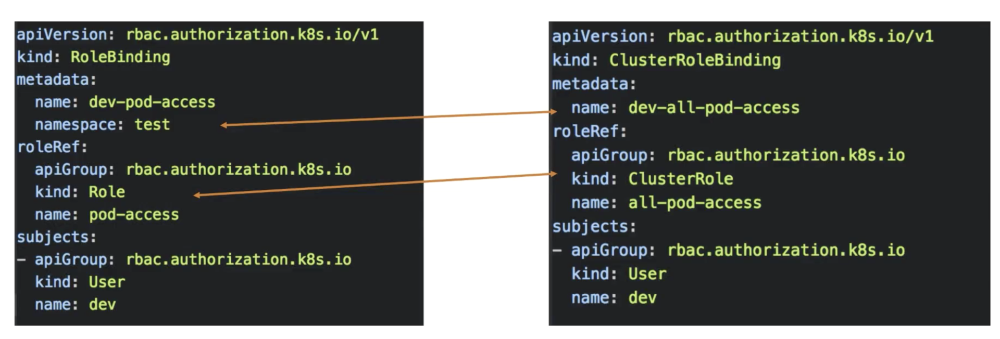

相较于RoleBinding，CLusterRoleBinding模板定义也是在namespace和roleRef中的权限对象模型定义上有不同，其他的定义格式是一样的。

#### RBAC-Default ClusterRoleBinding

通过上文的学习，我们知道在不进行任何权限的绑定下，RBAC会拒绝所有的访问。那么我们的系统组件之间是如何互相请求呢?

其实在集群创建的时候，处理系统各组件的客户端证书，它们各自的角色和环境对象也会被创建出来，以满足组件业务之间交互必须的权限要求。

下面看几个预置的集群角色：

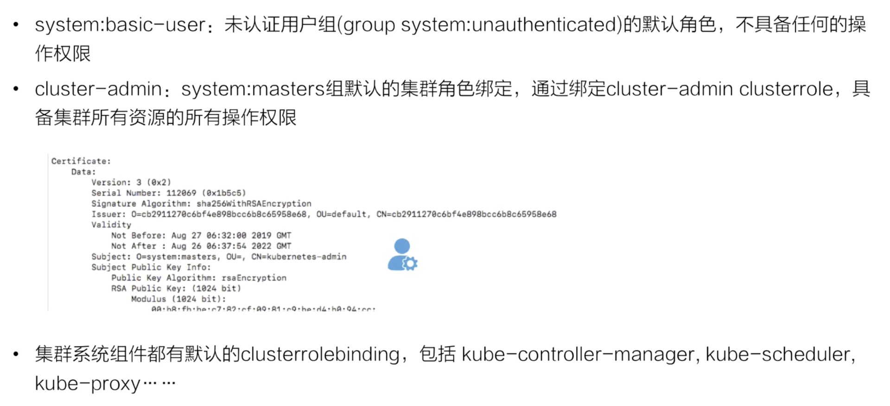

#### 角色中的verbs如何设置?

通过以上对RBAC的学习，大家应该对K8S中RBAC的模型定义有了一定的了解，但是在某些复杂的多租户业务场景下，如何在权限模板中针对各个API模型定义的动作策略，还是需要一定的理论和实践基础的。而对一个应用开发人员来说，kubectl可能更为直观和熟悉些，这里也给出了一些kubectl操作和RBAC重得对应关系。

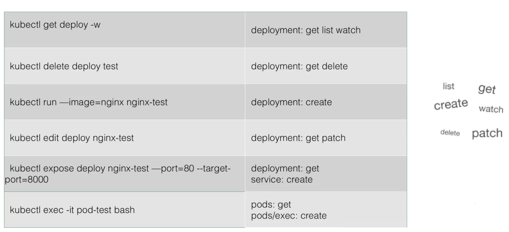

比如当我们希望edit一个deploy的时候，需要在相应的角色模板中增加对Deployment资源的get、patch这样的权限。如果希望exec到一个pod中，需要在相应的角色模板中增加对pod的get权限，以及针对pod/exec模型的create权限。