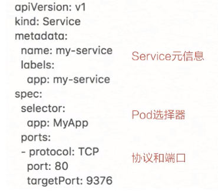
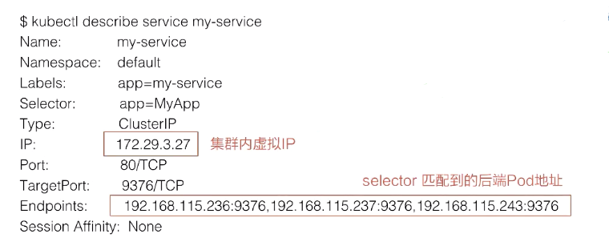
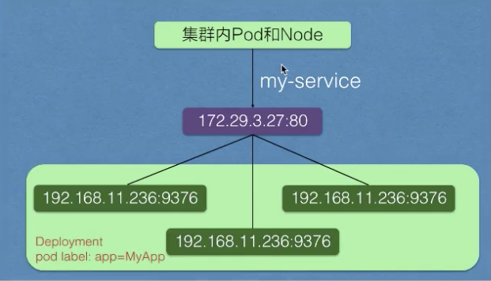
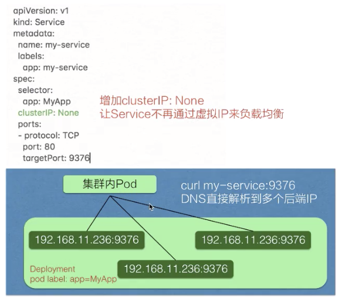
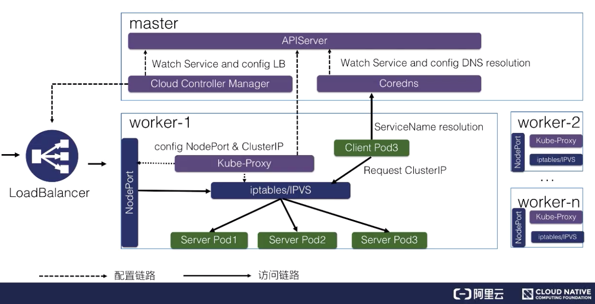

### 一、K8S中的服务发现与负载均衡(Service)

应用服务需要暴露到外部去访问，需要提供给外部的用户取调用，那么怎么让pod网络暴露出去给外部访问呢?这就需要用到服务发现。


在K8S里面，服务发现与负载均衡就是K8S Service。上图就是在K8S里Service的架构，K8S Service向上提供了外部网络以及pod网络的访问，即外部网络可以通过Service去访问，pod网络也可以通过K8S Service去访问。

向下，K8S对接了另外一组pod，即可以通过K8S Service的方式去负载均衡到一组pod上面去，这样相当于解决了前面所说的复发性问题，或者提供了统一的访问入口去做服务发现，然后又可以给外部网络访问，解决不同的pod之间的访问，提供统一的访问地址。

### 二、Service语法



首先来看K8S Service的一个语法，上图实际就是K8S的一个声明结构。这个结构里有很多语法，跟之前所介绍的K8S的一些标准对象又很多相似之处。比如说标签label去做一些选择、selector去做一些选择、lable去声明它的一些label标签等。

这里有一个新的知识点，就是定义了用于K8S Service服务发现的一个协议以及端口。继续来看这个模板，声明了一个名叫my-service的一个K8S Service，它有一个app:my-service的label，它选择了app:MyApp这样一个lable的pod作为它的后端。

最后是定义的服务发现的协议以及端口，这个示例中我们定义的是TCP协议，端口是80，目的端口是9376，效果是访问到这个Service 80 端口会被路由到后端的targetPort，就是只要访问到这个Service 80 端口的都会负载均衡到后端app:MyApp这种label的pod的9376端口。

### 三、创建核查看Service

如何去创建刚才生命的这个Service对象，以及它创建之后是什么样的效果呢?通过简单的命令：

```
kubectl apply -f service.yaml
```

后者是

```
kubectl created -f service.yaml
```

上面的命令可以简单的去创建这样一个Service。创建好之后，可以通过：

```
kubectl discribe service
```

去查看Service创建之后的一个结果。



Service创建好之后，你可以看到它的名字是my-service。Namespace、Label、Selector这些都跟我们之前声明的一样，这里声明完之后会生成一个IP地址，这个IP地址就是service的IP地址，这个IP地址在集群里面可以被其他pod所访问，相当于通过这个IP地址提供了统一的一个pod的访问入口，以及服务发现。

这里还有一个Endpoints的属性，就是我们通过Endpoints可以看到：通过前面所声明的selector去选择了哪些pod?以及这些pod都是什么样一个状态?比如说通过selector，我们看到它选择了这些pod的一个IP，以及这些pod所声明的targetPort的一个端口。



实际的架构如上图所示。在Service创建之后，它会在集群里面创建一个虚拟的IP地址以及端口，在集群里，所有的pod和node都可以通过这样一个IP地址和端口去访问到这个Service。这个Service会把它选择的pod及其IP地址都挂载到后端。这样通过service的IP地址访问时，就可以负载均衡到后端这些pod上面去。

当pod的声明周期又变化时，比如说其中一个pod销毁，Service就会自动从后端摘除这个pod。这样实现了：就算pod的声明周期有变化，它访问的端点是不会发生变化的。

### 四、集群内访问Service

在集群里面，其他pod要怎么访问到我们所创建的这个Service呢?有三种方式：

- 首先哦我们可以通过Service的虚拟IP去访问，比如说刚创建的my-service这个服务，通过kubectl get svc或者kubectl discribe service都可以看到它的虚拟IP地址是172.29.3.27，端口80，让后就可以通过这个虚拟IP及端口在pod里面直接访问到这个Sercie的地址。

- 第二种方式直接访问服务名，依靠NDS解析，就是同一个namespace里pod可以直接通过sercie的名字去访问到刚才所声明的这个Service。不同的namespace里面，我们可以通过Service名字加"."，然后加Service所在的哪个namespace去访问这个Service，例如我们直接用curl去访问，就是my-service:80就可以访问到这个service。

- 第三种是通过环境变量访问，在同一个namespcae里得pod启动时，K8S会把Service的一些IP地址、端口号，以及一些简单的配置，通过环境变量的方式放到K8S的pod里面。在K8S pod的容器启动之后，通过读取系统的环境变量来读取到namespace里面其他Service配置得一个地址，或者它的端口号等等。比如在集群的某一个pod里面，可以直接通过curl $ 取到一个环境变量的值，比如取到MY_SERVICE_SERVICE_HOST就是它的一个IP地址，MY_SERVICE就是我们刚才声明的MY_SERVICE，SERVICE_PORT就是它的端口号，这样也可以请求到集群里面的MY_SERVICE这个Service。

### 五、Headless Service

service有一个特别的形态就是Headless Service。Service创建的时候可以指定clusterIP:None，告诉K8S不需要clusterIP(就是刚才所说的集群里面的一个虚拟IP)，然后K8S就不会分配给这个Service一个虚拟IP地址，它没有虚拟IP地址怎么作导负载均衡以及统一的访问入口呢?

它是这样来操作的：pod可以直接通过service_name用DNS的方式解析到所有会断pod的IP地址，通过DNS的A记录的方式会解析到所有后端的pod的地址，由客户端选择一个后端的IP地址，这个A记录会随着pod的声明周期变化，返回的A记录列表也发生变化，这样就要求客户端应用要从A记录把所有DNS返回到A记录的列表里面IP地址中，客户端自己去选择一个合适的地址去访问pod。



可以从上图看一下跟刚才我们声明的模板的区别，就是在中间加了一个clusterIP:None，即表名不需要虚拟IP。实际效果就是集群的pod访问my-service时，会直接解析到所有的servcie对应pod的IP地址，返回给pod，然后pod里面自己去选择一个IP地址去直接访问。

### 六、向集群外暴露Service

前面介绍的都是在集群里面node或者pod去访问Servcie，Service怎么去向外暴露呢?怎么把应用实际暴露给公网去访问呢?这里Service也有两种类型去解决这个问题，一个时NodePort，一个时LoadBalancer。

- NodePort的方式就是在集群的node上面(即集群的节点的宿主机上面)去暴露节点上的一个端口，这样相当于在节点的一个端口上面访问到之后就会再去做一层转发，转发到虚拟的IP地址上面，就是刚刚宿主机上面Service虚拟IP地址。

- LoadBalancer类型就是在NodePort上面又做了一层转换，刚才所说的NodePort其实是集群里面每个节点上面一个端口，LoadBalancer是在所有的节点前又挂一个负载均衡。比如在阿里云上挂一个SLB，这个负载均衡会提供一个统一的入口，并把所有它接触到的流量负载均衡到每一个集群节点的node pod上面去。然后node pod再转化成ClusterIP，去访问到实际的pod上面。

### 七、K8S服务发现架构



如上图所示，K8S服务发现以及K8S Service是这样整体的一个架构。

K8S分为master节点和worker节点：

- master里面主要是K8S管控的内容

- worker节点里面是实际跑用户应用的一个地方

再K8S master节点里面又APIServer，就是统一管理K8S所有对象的地方，所有的组件都会注册到APIServer上面去监听这个对象的变化，比如说我们刚才的组件pod生命周期发生变化，这些事件。

这里面最关键的有三个组件：

- 一个是Cloud Controller Manager，负责去配置LoadBalancer的一个负载均衡器给外部去访问

- 另外一个就是Coredns，就是通过Coredns去观测APIServer里面的Service后端pod的一个变化，去配置Service的DNS解析，实现可以通过Service的名字直接访问到Service的虚拟IP，或者是Headless类型的Service重得IP列表的解析

- 然后再每个node里面会有kube-proxy这个组件，它通过监听Service以及pod变化，然后实际去配置集群里面的node pod或者是虚拟IP地址的一个访问。

实际访问链路是什么样的呢?比如说从集群内部的一个Client Pod3去访问Service。Client Pod3首先通过Coredns这里去解析出ServiceIP，Coredns会返回给它ServcieName所对应的Service IP是什么，这个Client Pod3就会拿这个Service IP去做请求，它的请求到宿主机的网络之后，就会被kube-proxy所配置的iptables或者IPVS去做一层拦截处理，之后去负载均衡到每一个实际的后端pod上面去，这样就实现了一个负载均很以及服务发现。

对于外部的流量。它是通过外部的一个负载均衡器Cloud Controller Manager去监听Service的变化之后，去配置的一个负载均衡器，然后转发到节点上的一个NodePort上面去，NodePort也会经过kube-proxy的一个配置的一个iptables，把NodePort的流量转换成ClusterIP，紧接着转换成后端的一个pod的IP地址，去做负载均衡以及服务发现。这就是整个K8S服务发现以及K8S Service整体的结构。