### 一、K8S调度过程

首先来看第一部分，K8S的调度过程。如下图所示，画了一个很简单的K8S集群架构，它包括了一个kube-ApiServer，一组Web-hook Controllers，以及一个默认的调度器kube-Scheduler，还有两台物理机节点Node1和Node2，分别在上面部署了两个kubelet。

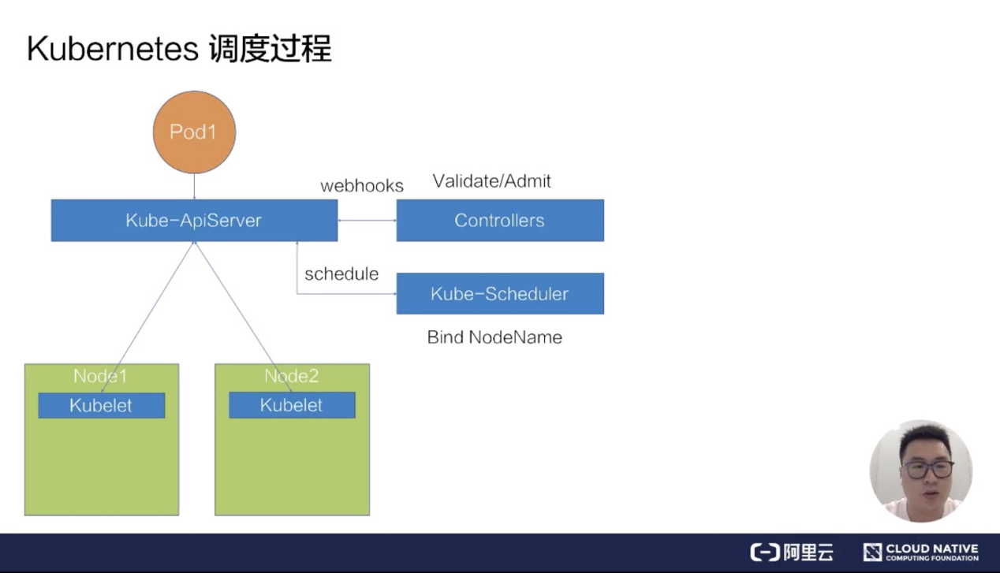

我们来看一下，加入要向这个K8S集群提交一个pod，它的调度过程是什么样的一个流程?

假设我们已经写好了一个yaml文件，就是下图中的橙色圆圈pod1，然后往kube-ApiServer里提交这个yaml文件。

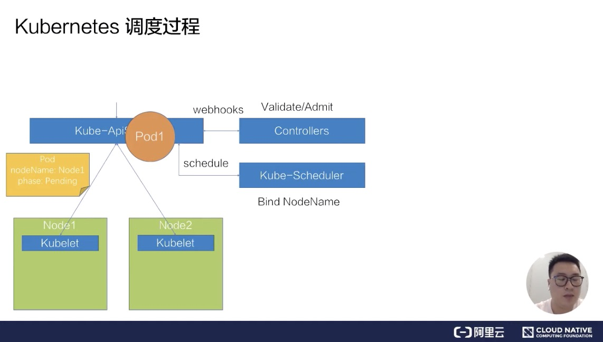

此时ApiServer会先把这个待创建的请求路由给我们的webhook Controllers进行校验。

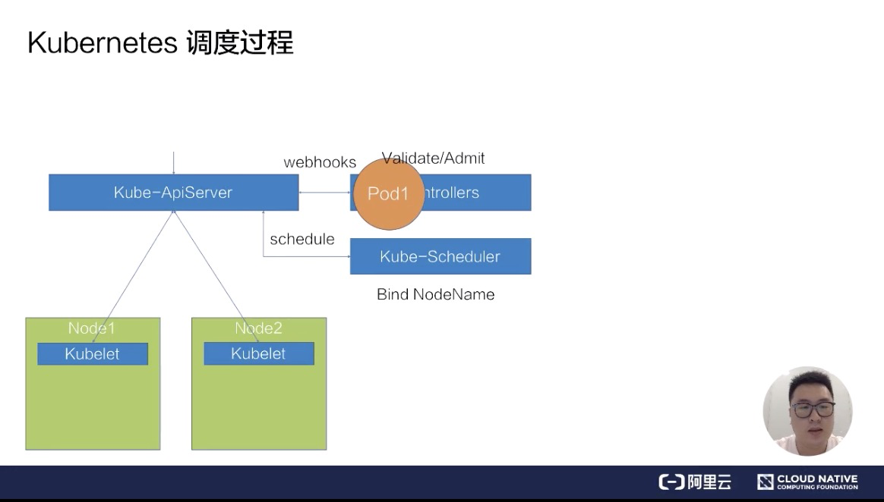

通过校验之后，ApiServer会在集群里生成一个pod，此时生成的pod，它的nodeName是空的，并且它是Pending状态。在生成了这个pod之后，kube-Scheduler以及kubelet都能watch到这个pod的生成事件，kube-Scheduler发现这个pod的nodeName是空的之后，会认为这个pod是处于未调度状态。

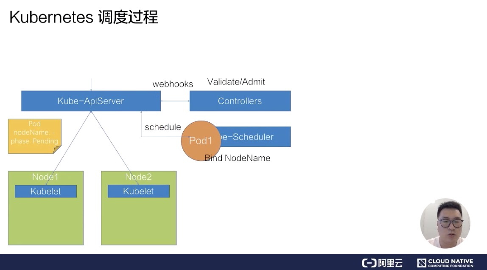

接下来，它会把这个pod拿到自己里面进行调度，通过一系列的调度算法，包括一些列的过滤和打分的算法后，Schedule会选出一台最合适的节点，并且把这一台节点的名称绑定在这个pod的spec上，完成一次调度的过程。

此时我们发现，pod的spec上，nodeName已经更新成了Node1这个node，更新完nodeName之后，在Node1上的这台kubelet会watch到这个pod是属于自己节点上的一个pod。

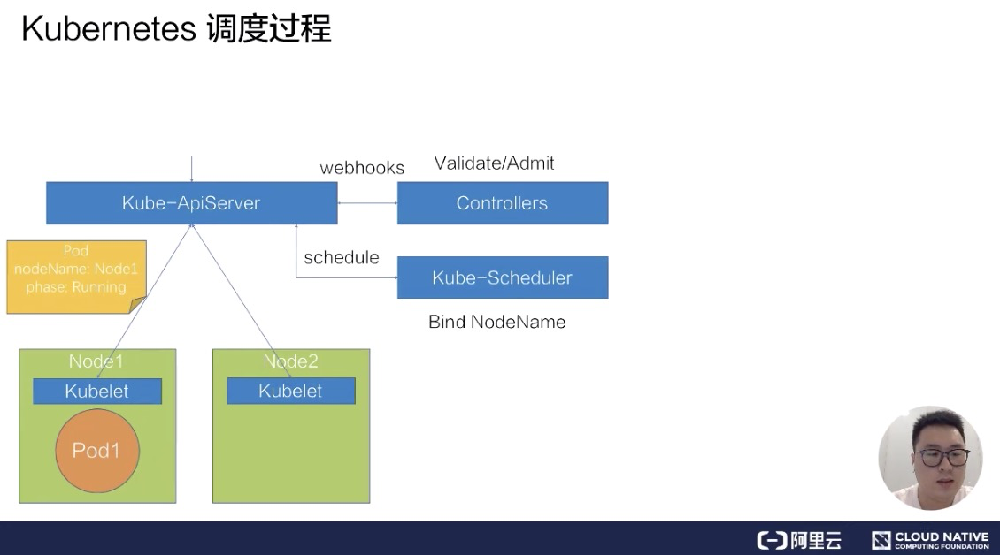

然后它会把这个pod拿到节点上进行操作，包括创建一些容器storage以及network，最后等所有的资源都准备完成，kubelet会把状态更新为Running，这样一个完成的调度过程就结束了。

通过刚刚一个调度过程的演示，我们用一句话来概括一下调度过程：它其实就是在做一件事情，即把pod放到合适的node上。

这里有个关键字"合适"，什么是合适呢?下面给出几点合适定义的特点：

- 首先要满足pod的资源要求

- 其次要满足pod的一些特殊关系的要求

- 再次要满足node的一些限制条件的要求

- 最后还要做到整个集群资源的合理利用

做到以上的要求后，可以认为我们把pod放到了一个合适的节点上了。

接下来我会为大家介绍K8S是怎么作导满足这些pod和node的要求的。

### 二、K8S基础调度力

下面为大家介绍一下K8S的基础调度能力，K8S的基础调度能力会以两部分来展开介绍：

- 第一部分是资源调度

介绍一下K8S基本的一些Resources的配置方式，还有Qos的概念，以及Resource Quota的概念和使用方式

- 第二部分是关系调度

在关系调度上，介绍两种广西场景：

- pod和pod之间的关系场景，包括怎么去亲和一个pod，怎么去互斥一个pod?

- pod和node之间的关系场景，包括怎么去亲和一个node，以及有一些node怎么去限制pod调度上来。

#### 如何满足Pod资源要求

pod的资源配置方法

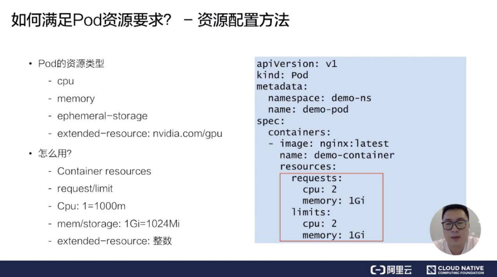

上图是pod spec的一个demo，我们的资源其实是填在pod spec中，具体在containers的resources里。

resources包含两个部分：

- 第一部分是requests

- 第二部分是limits

这两部分里面的内容是一模一样的，但是它代表的含义有所不同。request代表的是对这个pod基本保底的一些资源要求，limit代表的是对这个pod可用能力上限的一种限制。request、limit的实现是一个map结构，它里面可以填不同的资源的key/value。

我们可以大概分成四大类的基础资源：

- 第一类是CPU资源

- 第二类是memory

- 第三类是ephemeral-storage，是一种临时存储

- 第四类是通用的扩展资源，比如说像GPU。

CPU资源，比如说上面的例子填的是2，申请的是两个CPU，也可以写成2000m这种十进制的转换方式，来表达有些时候可能对CPU是一个小数的需求，比如说像0.2个CPU，可以填200m。而这种方式在memory和storage之上，它是一个二进制的表达方式，如上图右侧所示，申请的是1GB的memory，同样也可以填成一个1024mi的表达方式，这样可以更清楚地表大我们对memory的需求。

在扩展资源上，K8S有一个要求，即扩展资源必须是整数的，所以我们没法申请到0.5个GPU这样的资源，只能申请1个GPU或者2个GPU。

这里为大家介绍完了基础资源的申请方式。

接下来，我会详细给大家介绍一下request和limit到底有什么区别，以及如何通过request/limit来表示Qos。

#### Pod Qos类型

K8S在pod resource里面提供了两种填写方式：第一种是request，第二种是limit。

它其实是为用户提供了对Pod一种弹性能力的定义。比如说我们可以对request填2个CPU，对limit填4个CPU，这样代表了我希望是有2个CPU的保底能力，但其实在闲置的时候，可以使用4个GPU。

说到这个弹性能力，我们不得不提到一个概念：Qos的概念。什么是Qos呢?Qos全称是Quality of Service，它是K8S用来表大一个pod在资源能力上的服务质量的标准，K8S提供了三类Qos Class：

- 第一类是Guaranteed，它是一类高Qos Class，一般拿Guaranteed配置给一些需要资源保障能力的pods

- 第二类是Burstable，它是中等的一个Qos Class，一般会为一些希望有弹性能力的pod来配置Burstable

- 第三类是BestEffort，它是低Qos Class，它是一种尽力而为式的服务质量，K8S不承诺保障这类Pods服务质量

K8S其实有一个不太好的地方，就是用户没法直接指定自己的pod是属于哪一类Qos，

而是通过request和limit的组合来自动的映射上Qos Class。

通过上图的例子，大家可以看到：例如我提交的是上面的一个spec，在spec提交成功之后，K8S会自动补上一个status，里面是qosClass:Guaranteed，用户自己提交的时候，是没法定义自己的Qos等级。所以将这种方式称之为隐性的Qos Class用法。

#### Pod Qos配置

接下来介绍一下，我们怎么通过request和limit的组合来确定我们想要的Qos level。

##### Guaranteed Pod

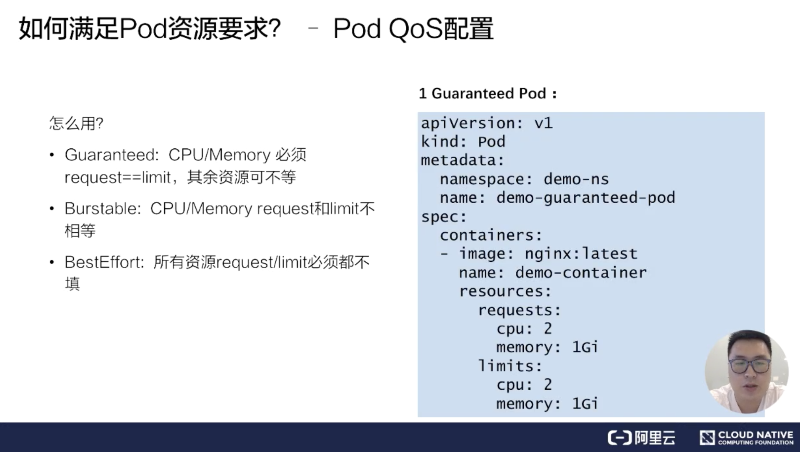

首先我们如何创建出来一个Guaranteed Pod?

K8S里面有一个要求：如果你要创建出一个Guaranteed Pod，那么你的基础资源(包括CPU和memory)，必须它的request==limit，其他的资源可以不相等。只有在这种条件下，它创建出来的pod才是一种Guaranteed Pod，否则它会属于Burstable，或者是BestEffort Pod。

##### Burstable Pod

然后看一下，我们怎么创建出来一个Burstable Pod，Burstable Pod的范围比较宽泛，它只要满足CPU/Memory的request和limit不相等，他就是一种Burstable Pod。

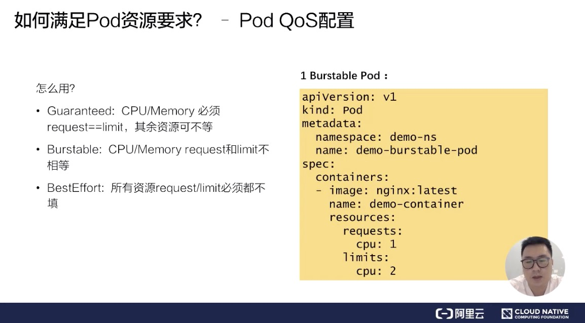

##### BestEffort Pod

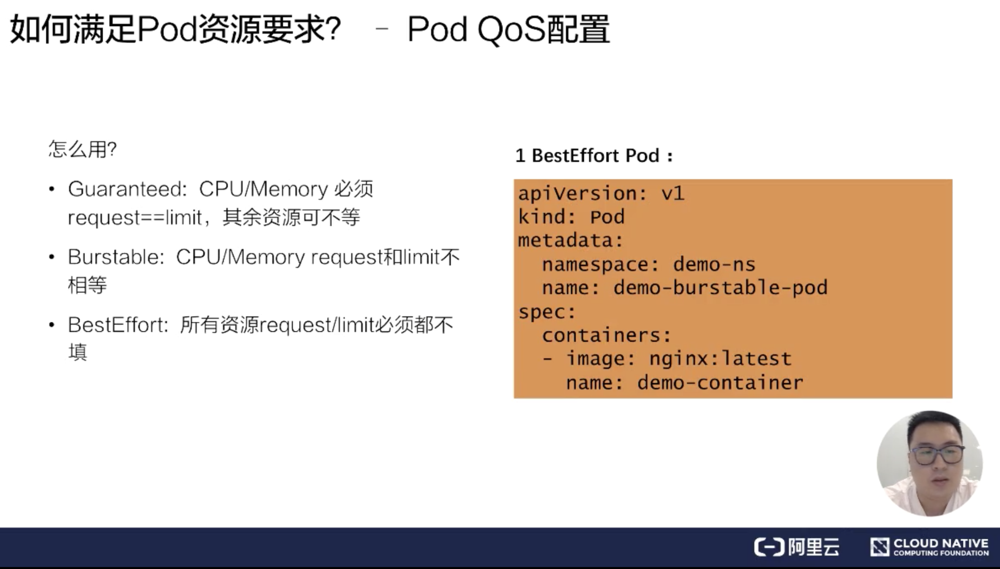

第三类BestEffort Pod，它也是条件比较死的一种使用方式。它必须是所有资源的request/limit都不填，才是一种BestEffort Pod。

#### 不同的Qos表现

接下来，为大家介绍一下：不同的Qos在调度和底层表现有什么样的不同?不同的Qos，它其实在调度和底层表现上都有一些不一样。比如说调度表现，调度器只会使用request进行调度也就是说不管你配了多大的limit，它都不会进行调度使用。

在底层上，不同的Qos表现更不相同。比如说CPU，它是按request来划分权重的，不同的Qos，它的request是完全不一样的，比如说像Burstable和BestEffort，它可能request可以填很小的数字或者不填，这样的话，它的时间片权重其实是非常低的。像BestEffort，它的权重可能只有2，而Burstable或Guaranteed，它的权重可以多到几千。

另外，当我们开启了kubelet的一个特性，叫cpu-manager-policy=static的时候，我们Guaranteed Qos，如果它的request是一个整数的话，比如说配置了2，它会对Guaranteed Pod进行绑核。具体的像下面这个例子，它分配CPU0和CPU1给Guaranteed Pod。

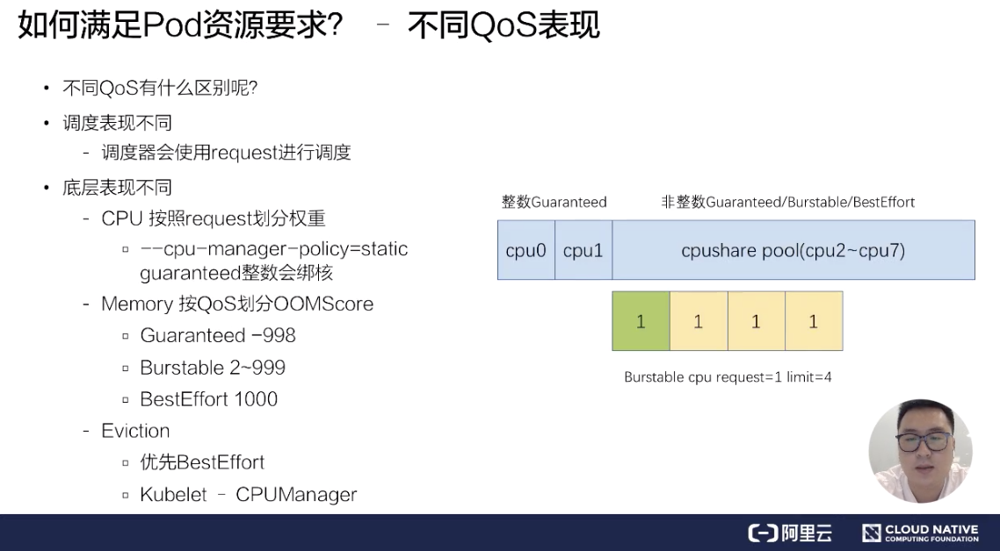

非整数的Guaraneed/Burstable/BestEffort，它们的CPU会放在一块，组成一个CPU share pool，比如说像上面这个例子，这台节点接入说有8个核，已经分配了2个核给整数的Guaranteed绑核，那么剩下的6个核CPU2~CPU7，它会被非整数的Guaranteed/Burstable/BestEffort共享，然后他们会根据不同的权重划分时间片来使用6个核的CPU。

另外在memory上也会按照不同的Qos进行划分OOMScore。比如说Guaranteed Pod，会固定配置默认的-998的OOMScore；而Burstable Pod会根据Pod内存设计的大小核节点内存的比例来分配2-999的OOMScore；BestEffort Pod会固定分配1000的OOMScore，OOMScore得分越高的话，在物理机出现OOM的时候会优先被kill掉。

另外在节点上的eviction动作上，不同的Qos行为也是不一样的，比如说发生eviction的时候，会优先考虑驱逐BestEffort的pod。所以不同的Qos在底层的表现是截然不同的。这反过来也要求我们在生产过程中，根据不同业务的要求和属性来配置资源的limits和requests，作导合理的规划Qos Class。

#### 资源Quota

在生产中我们还会遇到一个场景：假如集群是由多个人同时提交的，或者是多个业务同时在使用，我们肯定要限制某个业务或某个人提交的总量，防止整个集群的资源都被一个业务使用掉，导致另一个业务没有资源使用。

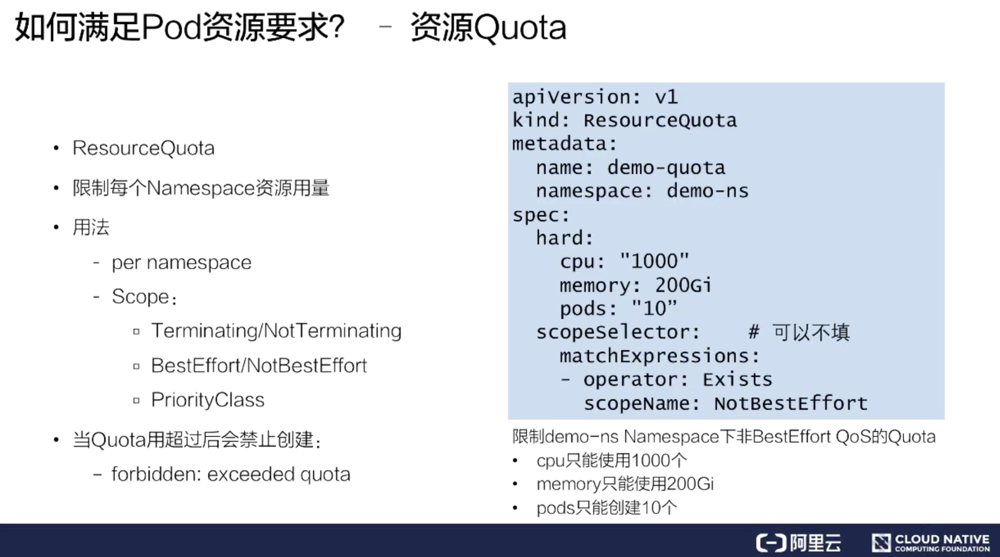

K8S给我们提供了一个能力叫ResourceQuota。它可以作导限制namespace资源用量。

具体的做法如上图右侧的yaml所示，可以看到它的spec包括了一个hard和scopeSelector。hard内容其实和Resource很像，这里可以填一些基础的资源。但是它比Resource list更丰富一点，还可以填写一些Pod，这样可以限制Pod数量。另外，scopeSelector还为这个ResourceQuota提供了更丰富的索引能力。

比如上面的例子中，索引出非BestEffort的pod，限制的cpu是1000个，memeory是200G，Pod是10个。

ScopreName除了提供NotBestEffort，它还提供了更丰富的索引范围，包括Terminating/Not Terminating，BestEffort/NotBestEffort，PriorityClass。

当我们创建了这样的ResourceQuota作用于集群，如果用户真的用超了资源，表现得行为是：它在提交Pod spec时，会收到一个forbidden的403错误，提示exceeded quota。这样用户就无法再提交对应用超的资源了。

而如果再提交一个没有包含再这个ResourceQuota里得资源，还是能成功地。

这就是K8S里ResourceQuota的基本用法。我们可以用ResourceQuota方法来做到限制每一个namespace的资源用量，从而保证其他用户的资源使用。

#### 小结：如何满足Pod资源要求?

上面介绍完了基础资源的使用方式，也就是我们做到了如何满足Pod资源要求。下面做一个小结：

- Pod要配置合理的资源要求

- CPU/Memory/EphemeralStrorage/GPU

- 通过Request和Limit来为不同业务特点的Pod选择不同的Qos

- Guaranteed：敏感型，需要业务保障

- Burstable：次敏感型，需要弹性业务

- BestEffort：可容忍性业务

- 为每个NS配置ResourceQuota来防止过量使用，保障其他人的资源可用

#### 如何满足Pod与Pod关系要求?

接下来给大家介绍一下Pod的关系调度，首先时Pod和Pod的关系调度。我们在平时使用中可能会遇到一些场景：比如说一个Pod必须要和另外一个Pod放在一起，或者不能和另外一个Pod放在一起。

在这种要求下，K8S提供了两类能力：

- 第一类能力称之为Pod亲和调度：PodAffinty

- 第二类就是Pod反亲和调度：PodAntAffinity

##### Pod亲和调度

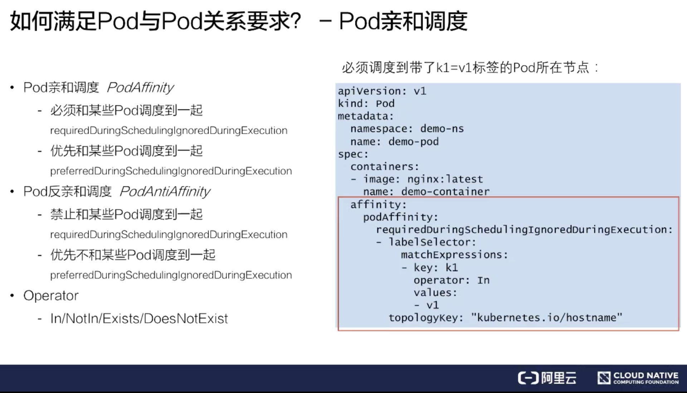

首先我们来看Pod亲和调度，假如我想把一个Pod和另一个Pod放在一起，这时我们可以看上图中的实例写法，填写上podAffinity，然后填上required要求。

在这个例子中，必须要调度到带了key:k1的Pod所在的节点，并且打散粒度是按照节点粒度去大三索引的。这种情况下，假如能找到带key:k1的Pod所在节点，就会调度成功。假如这个集群不存在这样的Pod节点，或者是资源不够的时候，那就会调度失败。这是一个严格的亲和调度，我们叫做强制亲和调度。

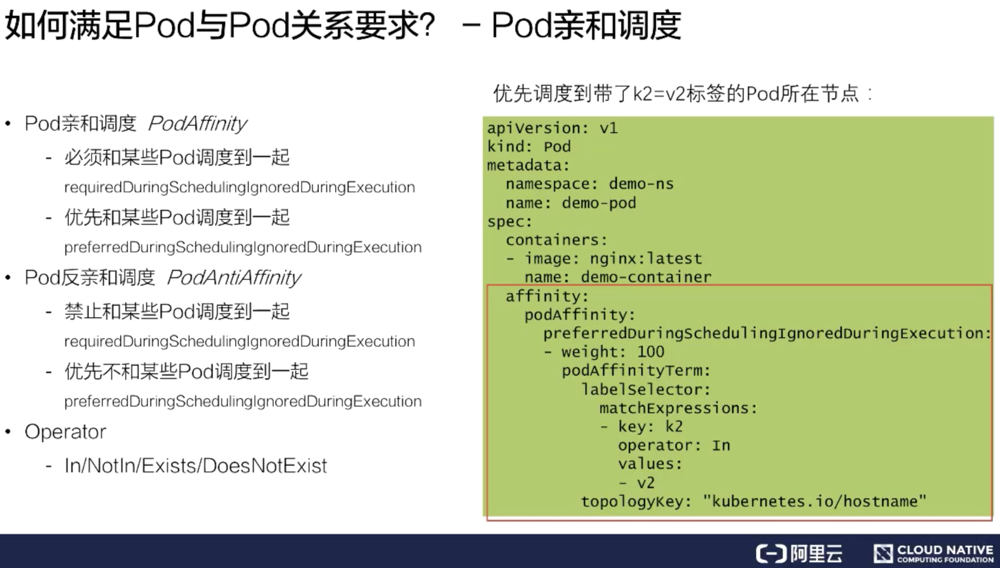

有些时候我们并不需要这么严格的调度策略。这时候可以把required改成preferred，变成一个优先亲和调度。也就是优先可以调度带key:k2的Pod所在节点。并且这个preferred里面可以是一个list选择，可以填上多个条件，比如权重等于100的是key:k2，权重等于10的是key:k1。那调度器在调度的的时候会优先把这个Pod分配到权重分更高的调度条件节点上去。

##### Pod反亲和调度

上面介绍了亲和调度，反亲和调度与亲和调度比较相似，功能上是取反的，但语法上基本上是一样的。仅是podAffinity换成了podAntiAffinity，也是包括required强制反亲和，以及一个preferred优先反亲和。

这里举了两个例子：一个是禁止调度到带了key:k1标签的Pod所在节点；另一个是优先反亲和调度到带了key:k2标签的Pod所在节点。

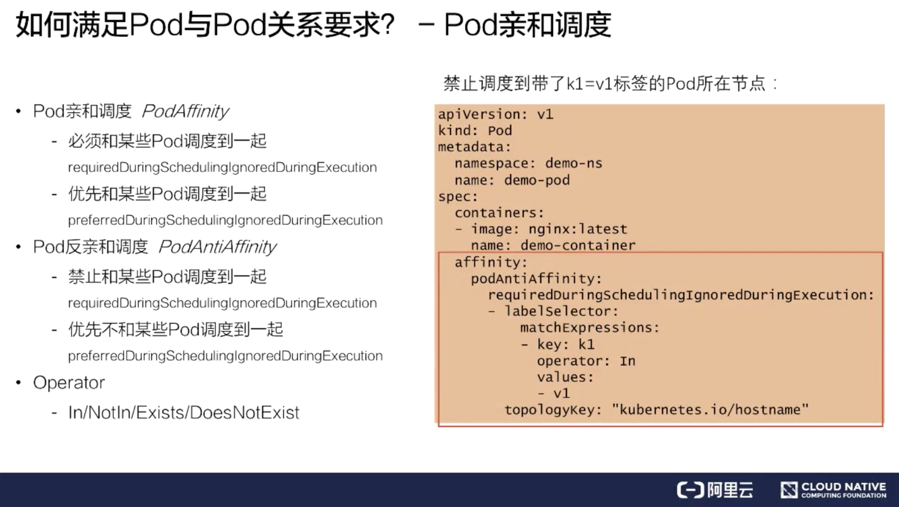

K8S除了In这个Operator语法之外，还提供了更多丰富的语法组合来给大家使用。比如说In/NotIn/Exists/DoesNotExist 这些组合方式。上图的例子用的是 In，比如说第一个强制反亲和例子里面，相当于我们必须要禁止调度到带了 key: k1 标签的 Pod 所在节点。

同样的功能也可以使用 Exists，Exists 范围可能会比 In 范围更大，当 Operator 填了 Exists，就不需要再填写 values。它做到的效果就是禁止调度到带了 key: k1 标签的 Pod 所在节点，不管 values 是什么值，只要带了 k1 这个 key 标签的 Pod 所在节点，都不能调度过去。

以上就是 Pod 与 Pod 之间的关系调度。

#### 如何满足 Pod 与 Node 关系调度

Pod 与 Node 的关系调度又称之为 Node 亲和调度，主要给大家介绍两类使用方法。

##### NodeSelector

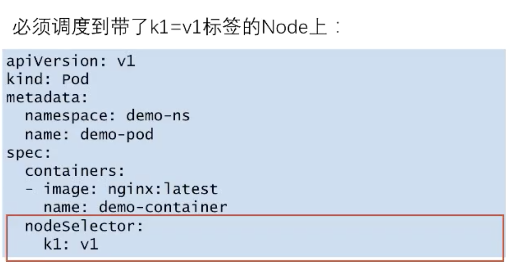

第一类是 NodeSelector，这是一类相对比较简单的用法。比如说有个场景：必须要调度 Pod 到带了 k1: v1 标签的 Node 上，这时可以在 Pod 的 spec 中填写一个 nodeSelector 要求。nodeSelector 本质是一个 map 结构，里面可以直接写上对 node 标签的要求，比如 k1: v1。这样我的 Pod 就会强制调度到带了 k1: v1 标签的 Node 上。

##### NodeAffinity

NodeSelector 是一个非常简单的用法，但这个用法有个问题：它只能强制亲和调度，假如我想优先调度，就没法用 nodeSelector 来做。于是 Kubernetes 社区又新加了一个用法，叫做 NodeAffinity。

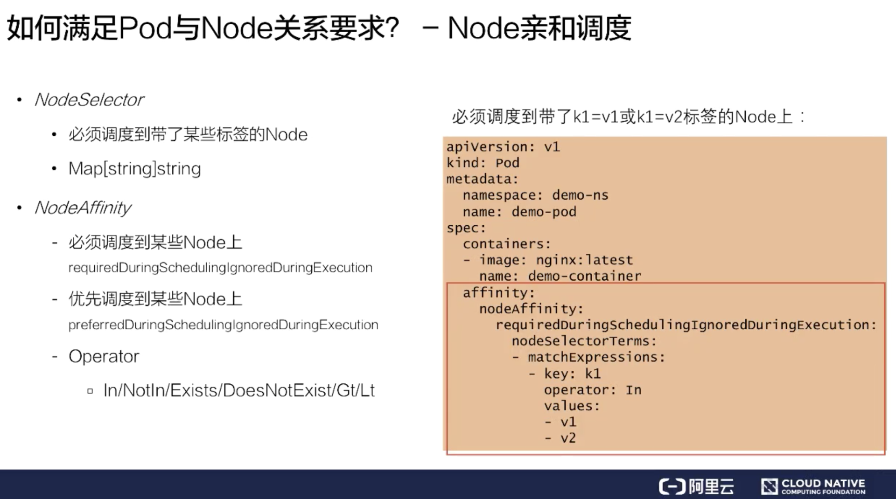

它和 PodAffinity 有点类似，也提供了两类调度的策略：

- 第一类是 required，必须调度到某一类 Node 上

- 第二类是 preferred，就是优先调度到某一类 Node 上

它的基本语法和上文中的 PodAffinity 以及 PodAntiAffinity 也是类似的。在 Operator 上，NodeAffinity 提供了比 PodAffinity 更丰富的 Operator 内容。增加了 Gt 和 Lt，数值比较的用法。当使用 Gt 的时候，values 只能填写数字。

#### Node 标记/容忍

还有第三类调度，可以通过给 Node 打一些标记，来限制 Pod 调度到某些 Node 上。Kubernetes 把这些标记称之为 Taints，它的字面意思是污染。

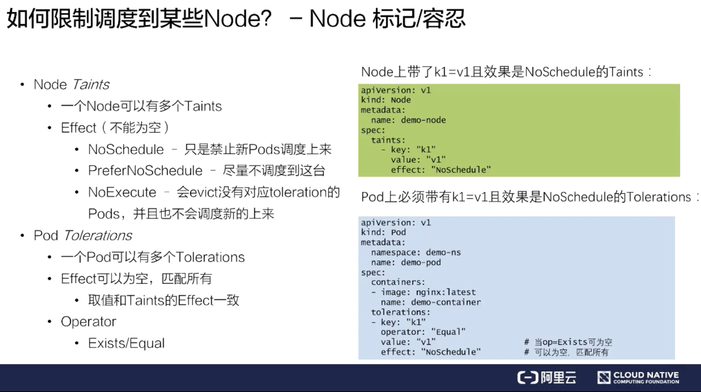

那我们如何限制 Pod 调度到某些 Node 上呢？比如说现在有个 node 叫 demo-node，这个节点有问题，我想限制一些 Pod 调度上来。这时可以给这个节点打一个 taints，taints 内容包括 key、value、effect：

- key 就是配置的键值

- value 就是内容

- effect 是标记了这个 taints 行为是什么

目前 Kubernetes 里面有三个 taints 行为：

- NoSchedule 禁止新的 Pod 调度上来

- PreferNoSchedul 尽量不调度到这台

- NoExecute 会 evict 没有对应 toleration 的 Pods，并且也不会调度新的上来。这个策略是非常严格的，大家在使用的时候要小心一点

如上图绿色部分，给这个 demo-node 打了 k1=v1，并且 effect 等于 NoSchedule 之后。它的效果是：新建的 Pod  没有专门容忍这个 taint，那就没法调度到这个节点上去了。

假如有些 Pod 是可以调度到这个节点上的，应该怎么来做呢？这时可以在 Pod 上打一个 Pod Tolerations。从上图中蓝色部分可以看到：在 Pod 的 spec 中填写一个 Tolerations，它里面也包含了 key、value、effect，这三个值和 taint 的值是完全对应的，taint 里面的 key，value，effect 是什么内容，Tolerations 里面也要填写相同的内容。

Tolerations 还多了一个选项 Operator，Operator 有两个 value：Exists/Equal。Equal 的概念是必须要填写 value，而 Exists 就跟上文说的 NodeAffinity 一样，不需要填写 value，只要 key 值对上了，就认为它跟 taints 是匹配的。

上图中的例子，给 Pod 打了一个 Tolerations，只有打了这个 Tolerations 的 Pod，才能调度到绿色部分打了 taints 的 Node 上去。这样的好处是 Node 可以有选择性的调度一些 Pod 上来，而不是所有的 Pod 都可以调度上来，这样就做到了限制某些 Pod 调度到某些 Node 的效果。

#### 小结

我们已经介绍完了 Pod/Node 的特殊关系和条件调度，来做一下小结。

首先假如有需求是处理 Pod 与 Pod 的时候，比如 Pod 和另一个 Pod 有亲和的关系或者是互斥的关系，可以给它们配置下面的参数：

- PodAffinity

- PodAntiAffinity

假如存在 Pod 和 Node 有亲和关系，可以配置下面的参数：

- NodeSelector

- NodeAffinity

假如有些 Node 是限制某些 Pod 调度的，比如说一些故障的 Node，或者说是一些特殊业务的 Node，可以配置下面的参数：

- Node — Taints

- Pod — Tolerations

### K8S高级调度能力

介绍完了基础调度能力之后，下面来了解一下高级调度能力。

#### 优先级调度

优先级调度和抢占，主要概念有：

- Priority

- Preemption

首先来看一下调度过程提到的四个特点，我们如何做到集群的合理利用？当集群资源足够的话，只需要通过基础调度能力就能组合出合理的使用方式。但是假如资源不够，我们怎么做到集群的合理利用呢？通常的策略有两类：

- 先到先得策略 (FIFO) -简单、相对公平，上手快

- 优先级策略 (Priority) – 比较符合日常公司业务特点

在实际生产中，如果使用先到先得策略，反而是一种不公平的策略，因为公司业务里面肯定是有高优先级的业务和低优先级的业务，所以优先级策略会比先到先得策略更能够符合日常公司业务特点。

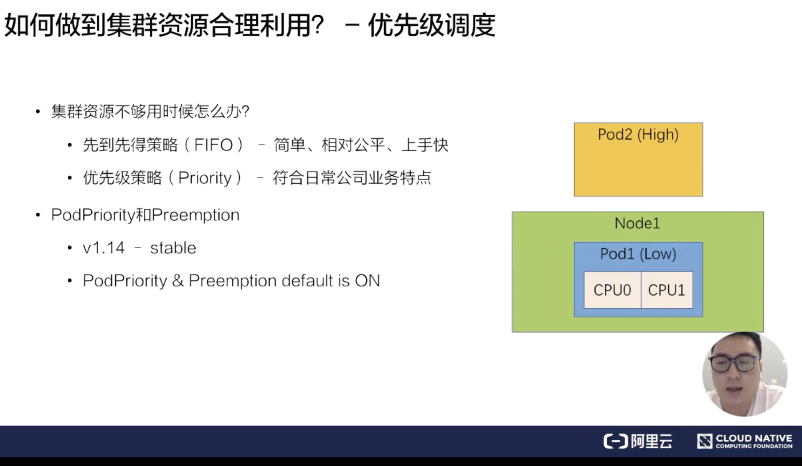

接下来介绍一下优先级策略下的优先级调度是什么样的一个概念。比如说有一个 Node 已经被一个 Pod 占用了，这个 Node 只有 2 个 CPU。另一个高优先级 Pod 来的时候，低优先级的 Pod 应该把这两个 CPU 让给高优先级的 Pod 去使用。低优先级的 Pod 需要回到等待队列，或者是业务重新提交。这样的流程就是优先级抢占调度的一个流程。

在 Kubernetes 里，PodPriority 和 Preemption，就是优先级和抢占的特点，在 v1.14 版本中变成了 stable。并且 PodPriority 和 Preemption 功能默认是开启的。

#### 优先级调度配置

##### 怎么使用?

如何使用优先级调度呢？需要创建一个 priorityClass，然后再为每个 Pod 配置上不同的 priorityClassName，这样就完成了优先级以及优先级调度的配置。

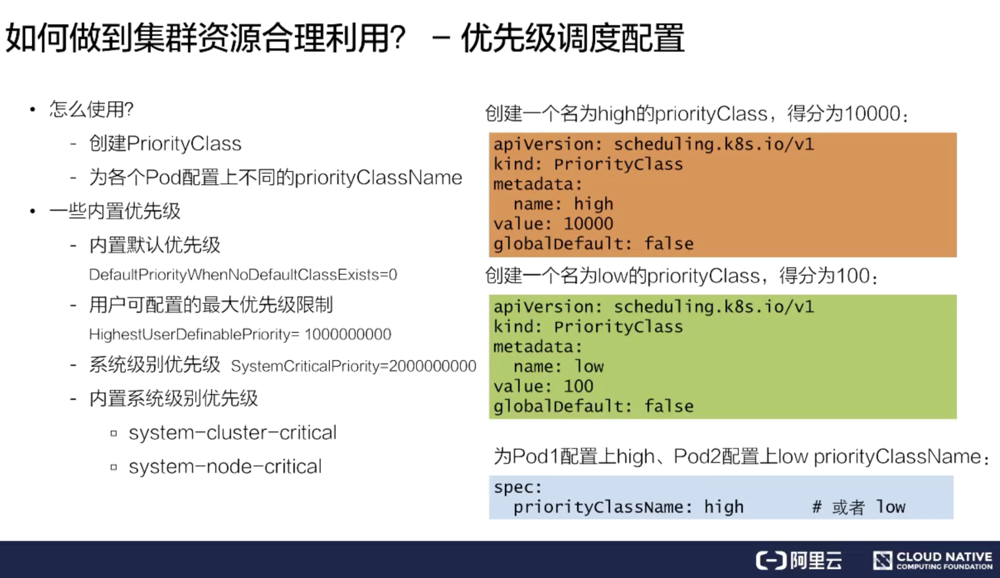

首先来看一下如何创建一个 priorityClass。上图右侧定义了两个 demo：

- 一个是创建了名为 high 的 priorityClass，它是高优先级，得分为 10000

- 另一个创建了名为 low 的 priorityClass，它的得分是 100

同时在第三部分给 Pod1 配置上了 high，Pod2 上配置了 low priorityClassName，蓝色部分显示了 pod 的 spec 的配置位置，就是在 spec 里面填写一个 priorityClassName: high。这样 Pod 和 priorityClass 做完配置，就为集群开启了一个 priorityClass 调度。

##### 内置优先级配置

当然 Kubernetes 里面还内置了默认的优先级。如 DefaultpriorityWhenNoDefaultClassExistis，如果集群中没有配置 DefaultpriorityWhenNoDefaultClassExistis，那所有的 Pod 关于此项数值都会被设置成 0。

用户可配置的最大优先级限制为：HighestUserDefinablePriority = 10000000000(10 亿)，会小于系统级别优先级：SystemCriticalPriority = 20000000000(20 亿)

其中内置了两个系统级别优先级：

- system-cluster-critical

- system-node-critical

##### 优先级调度过程

下面介绍简单的优先级调度过程：

首先介绍只触发优先级调度但是没有触发抢占调度的流程。

假如有一个 Pod1 和 Pod2，Pod1 配置了高优先级，Pod2 配置了低优先级。同时提交 Pod1 和 Pod2 到调度队列里。

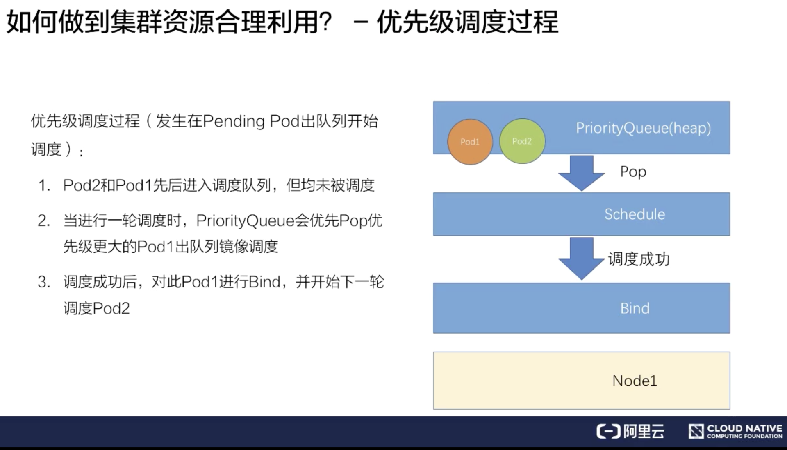

调度器处理队列的时候会挑选一个高优先级的 Pod1 进行调度，经过调度过程把 Pod1 绑定到 Node1 上。

其次再挑选一个低优先的 Pod2 进行同样的过程，绑定到 Node1 上。

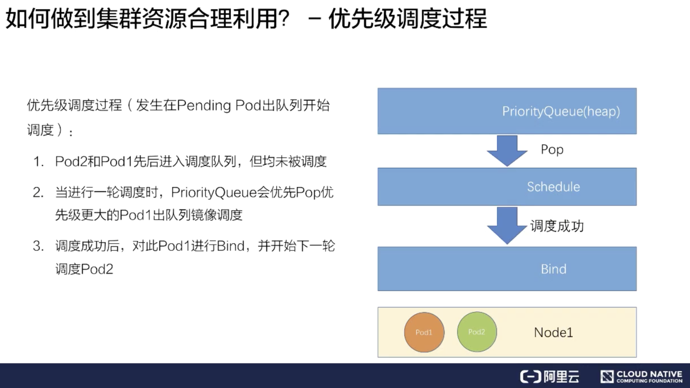

这样就完成了一个简单的优先级调度的流程。

##### 优先级抢占过程

假如高优先级的 Pod 在调度的时候没有资源，那么会是一个怎么样的流程呢？

首先是跟上文同样的场景，但是提前在 Node1 上放置了 Pod0，占去了一部分资源。同样有 Pod1 和 Pod2 待调度，Pod1 的优先级大于 Pod2。

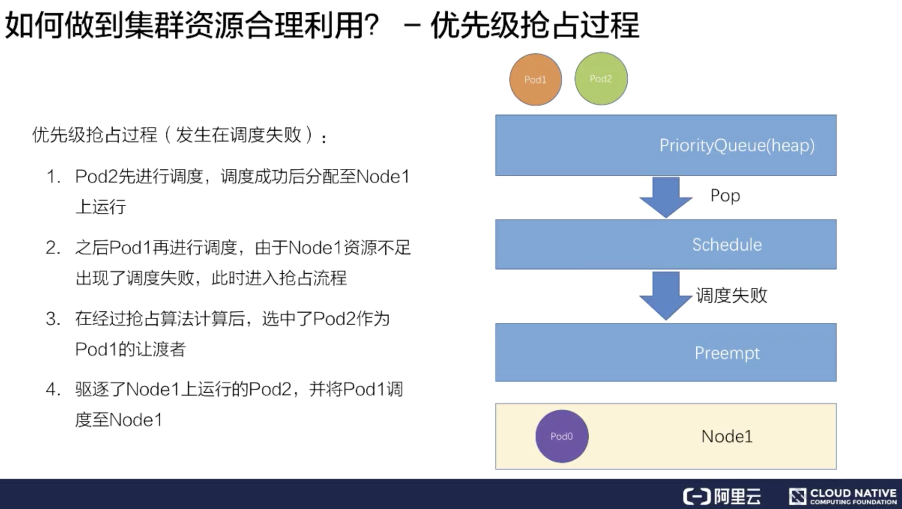

假如先把 Pod2 调度上去，它经过一系列的调度过程绑定到了 Node1 上。

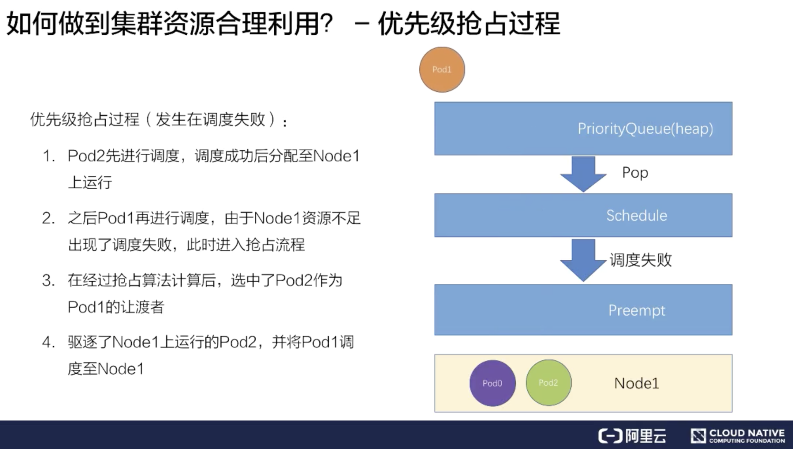

紧接着再调度 Pod1，因为 Node1 上已经存在了两个 Pod，资源不足，所以会遇到调度失败。

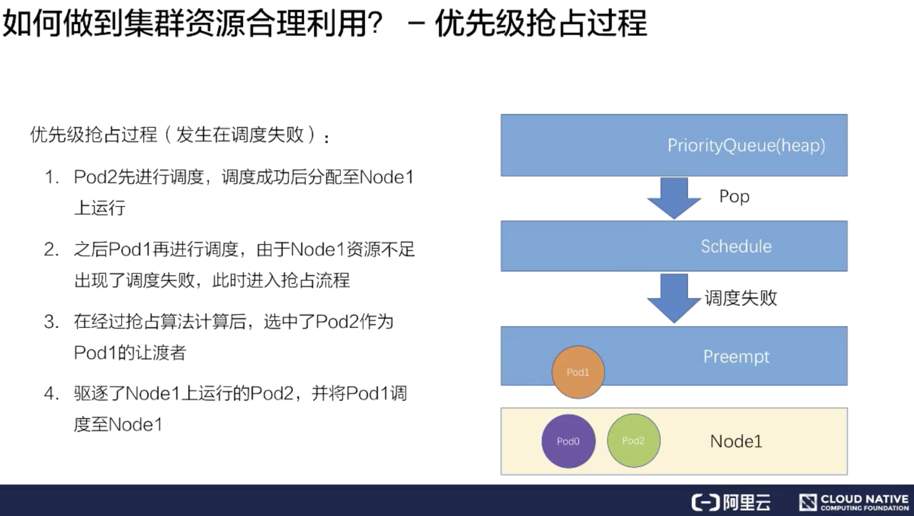

在调度失败时 Pod1 会进入抢占流程，这时会进行整个集群的节点筛选，最后挑出要抢占的 Pod 是 Pod2，此时调度器会把 Pod2 从 Node1 上移除数据。

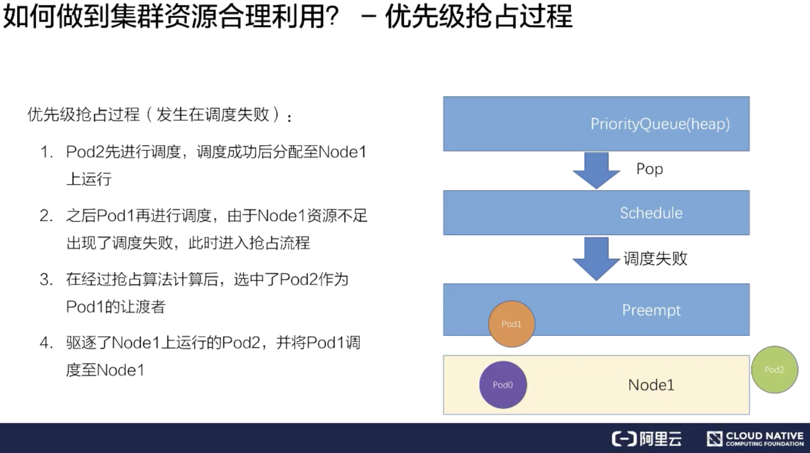

再把 Pod1 调度到 Node1 上。这样就完成了一次抢占调度的流程。

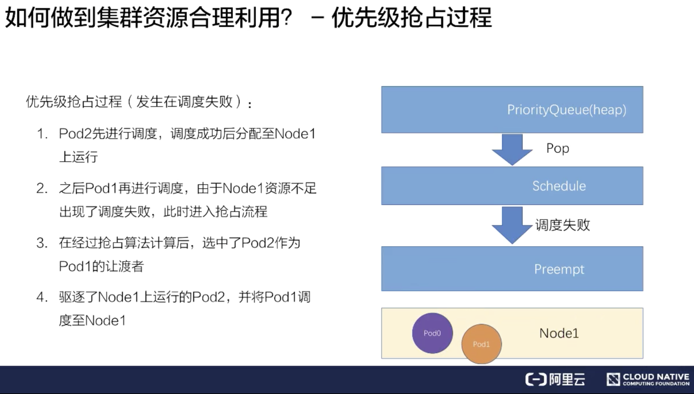

##### 优先级抢占策略

接下来介绍具体的抢占策略和抢占流程

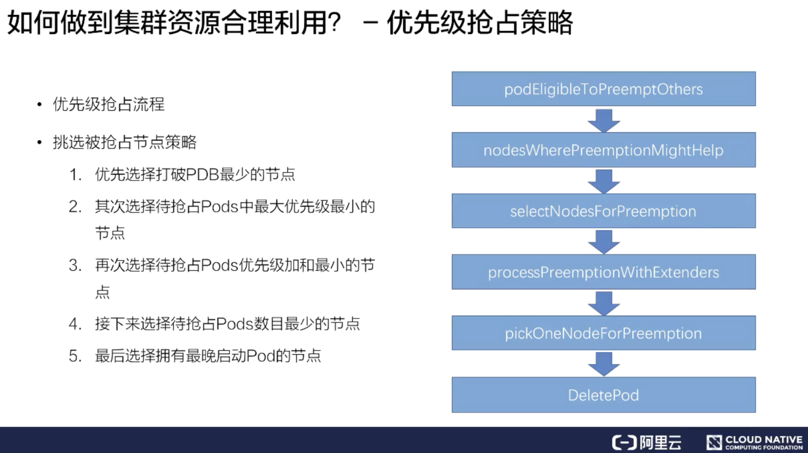

上图右侧是整个kube-scheduler优先级抢占的调度流程。首先一个 Pod 进入抢占的时候，会判断 Pod 是否拥有抢占的资格，有可能上次已经抢占过一次。如果符合抢占资格，它会先对所有的节点进行一次过滤，过滤出符合这次抢占要求的节点，如果不符合就过滤掉这批节点。

接着从过滤剩下的节点中，挑选出合适的节点进行抢占。这次抢占的过程会模拟一次调度，把上面优先级低的 Pod 先移除出去，再把待抢占的 Pod 尝试能否放置到此节点上。然后通过这个过程选出一批节点，进入下一个过程 ProcessPreemptionWithExtenders。这是一个扩展的钩子，用户可以在这里加一些自己抢占节点的策略，如果没有扩展钩子，这里面是不做任何动作的。

接下来的流程叫做 PickOneNodeForPreemption，就是从上面 selectNodeForPreemption list 里面挑选出最合适的一个节点，这是有一定的策略的。上图左侧简单介绍了一下策略：

- 优先选择打破 PDB 最少的节点

- 其次选择待抢占 Pods 中最大优先级最小的节点

- 再次选择待抢占 Pods 优先级加和最小的节点

- 接下来选择待抢占 Pods 数目最小的节点

- 最后选择拥有最晚启动 Pod 的节点

通过这五步串行策略过滤之后，会选出一个最合适的节点。然后对这个节点上待抢占的 Pod 进行 delete，这样就完成了一次待抢占的过程。

#### 小结

简单介绍了一下调度的高级策略，在集群资源紧张的时候也能合理调度资源。我们回顾一下做了哪些事情：

- 创建自定义的一些优先级类别 (PriorityClass)

- 给不同类型 Pods 配置不同的优先级 (PriorityClassName)

- 通过组合不同类型 Pods 运行和优先级抢占让集群资源和调度弹性起来。