### Kubernetes有如下几个核心的功能

- 服务的发现与负载的均衡

- 容器的自动装箱，我们也会把它叫做scheduling，就是“调度”，把一个容器放到一个集群的某一个机器上，Kubernetes会帮助我们去做存储的编排，让存储的生命周期与容器的生命周期能有一个链接；

- Kubernetes会帮助我们去做自动化的容器的恢复。在一个集群中，经常会出现宿主机的问题或者说是OS的问题，导致容器本身的不可用，Kubernetes会自动的对这些不可用的容器进行恢复；

- Kubernetes会帮助我们去做应用的自动发布与应用的回滚，以及与应用相关的配置密文的管理；

- 对于job类型任务，Kubernetes可以去做批量的执行；

- 为了让整个集群、整个应用更富有弹性，Kuburnetes也支持水平的伸缩。

下面，我们希望以三个例子跟大家更切实的介绍一下Kubernetes的能力。

#### 1. 调度

Kubernetes可以把用户提交得容器放到Kubernetes管理的集群的某一台节点上去。Kubernetes的调度器是执行这项能力的组件，他会观察正在被调度的这个容器的大小、规格。

比如说他所需要的CPU以及她所需要的memory，然后在集群中找一台相对比较空闲的机器来进行一次放置操作。

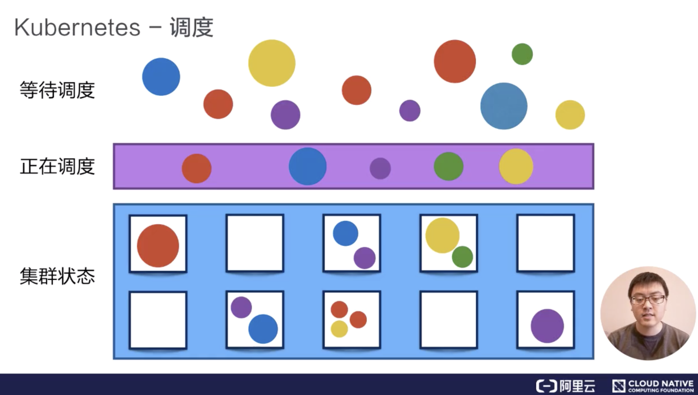

#### 2. 自动修复

Kubernetes有一个节点健康检查的功能，他会监测这个集群中所有的宿主机，当宿主机本身出现故障，或者软件出现故障的时候，这个节点健康检查会自动对他进行发现。

下面Kubernetes会把运行在这些失败节点上的容器进行自动迁移，迁移到一个正在健康运行的宿主机上，来完成集群内容器的一个自动恢复。

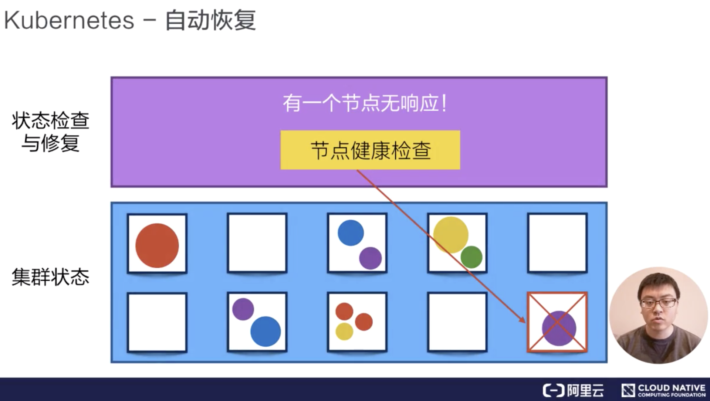

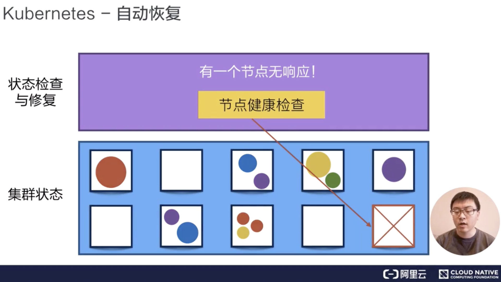

#### 3. 水平伸缩

Kubernetes有业务负载检查的能力，他会监测业务上所承担的负载，如果这个业务本身的CPU利用率过高，或者响应时间过长，它可以对这个业务进行一次扩容。

比如说在下面的例子中，黄颜色的过度忙碌，Kubernetes就可以把黄颜色负载从一份变为三份。接下来，他就可以通过负载均衡把原来打到第一个黄颜色上的负载平均分到三个黄颜色的负载上去，以此来提高响应的时间。

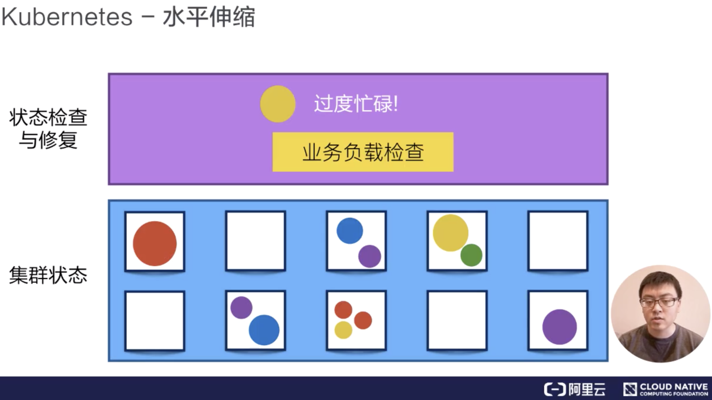

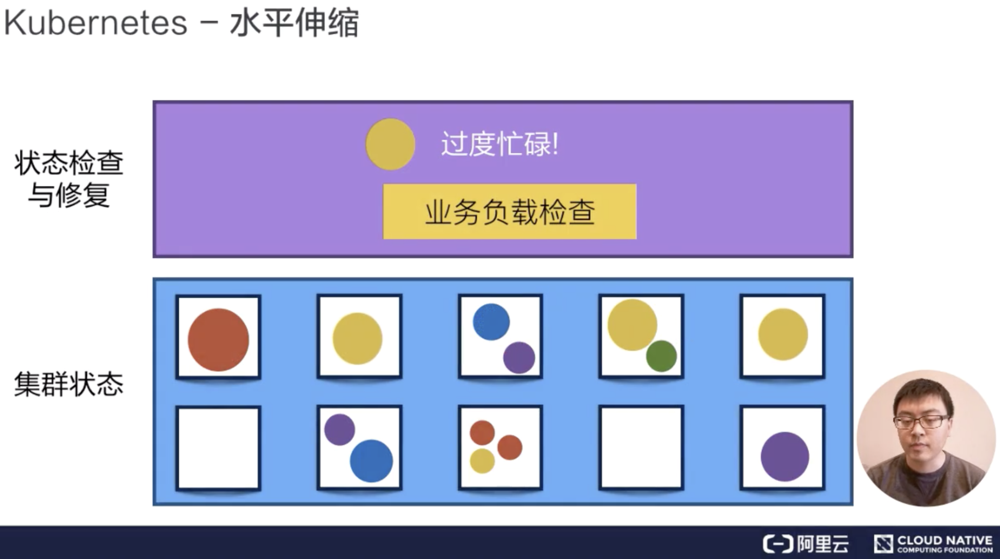

### Kubernetes的架构

Kubernetes架构是一个比较典型的二层架构和server-client架构。Master作为中央的管控节点，会去与Node进行一个链接。

所有UI的、clients、user侧的组件，只会和Master进行链接，把希望的状态或者想执行的命令下发给Master，Master会把这些命令或者状态下发给相应的节点，进行最终的执行。

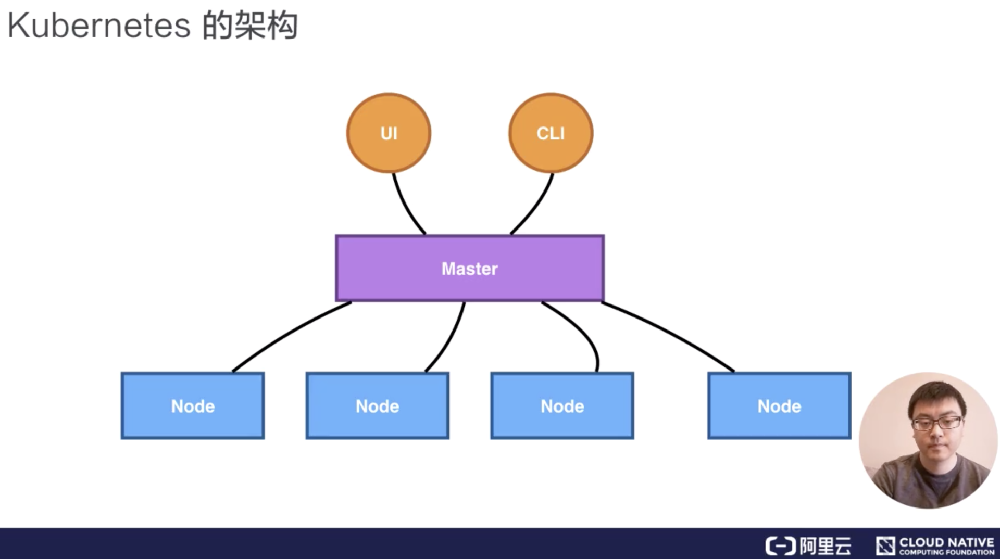

Kubernetes的Master包含四个主要的组件:API Server、Controller、Scheduler以及etcd。如下图所示:

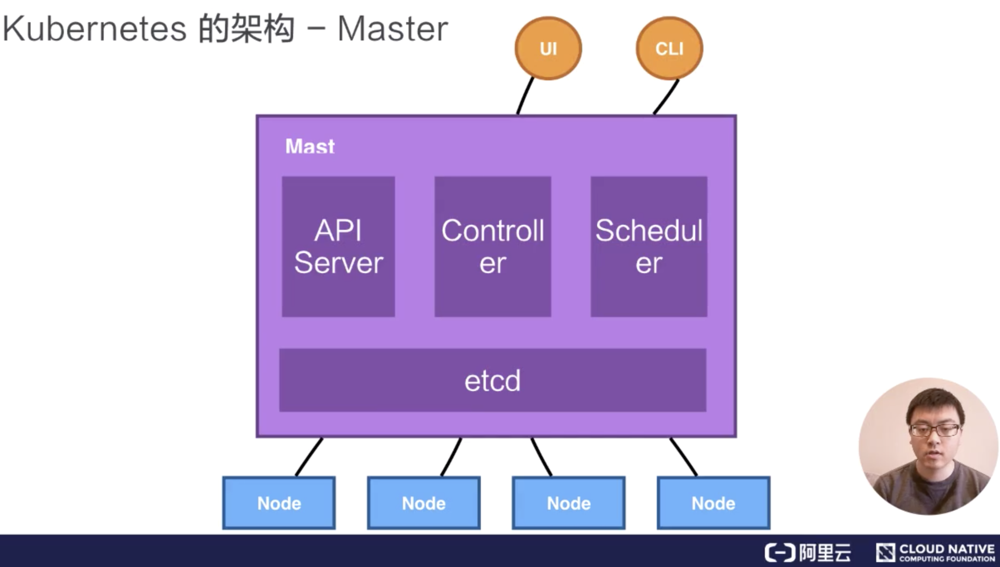

- API Server:

> 顾名思义是用来处理API操作的，Kubernetes中所有的组件都会和API Server进行连接，组件与组件之间一版不进行独立的连接，都依赖于API Server进行消息的传送；

- Controller:

> 是控制器，它用来完成对集群状态的一些管理。比如刚刚我们提到的两个例子之中，第一个自动对容器进行修复、第二个自动进行水平扩张，都是由Kubernetes中的Controller来进行完成的；

- Scheduler:

> 是调度器，顾名思义就是完成调度的操作，就是我们刚才介绍的第一个例子中，把一个用户提交的Container，依据它对CPU、对memory请求大小，找一台适合的节点，进行放置；

- etcd:

> 是一个分布式的存储系统，API Server中所需要的这些原信息都被放置在etcd中，etcd本身是一个高可用系统，通过etcd保证整个Kubernetes的Master组建的高可用性。我们刚刚提到的API Server，它本身在部署结构上是一个可以水平扩展的部署组件；Controller是一个可以进行热备的部署组件，他只有一个active，他的调度器也是相应的，虽然只有一个active，但是可以进行热备。

#### Kubernetes的架构:Node

Kubernetes的Node是真正运行业务负载的，每个业务负载会以Pod形式运行。一个Pod中运行的一个或者多个容器，真正去运行这些Pod的组件叫做kubelet，也就是Node上最关键的组件，它通过API Server接收到所需要Pod运行的状态，然后提交到我们下面滑得这个Container Runtime组件中。

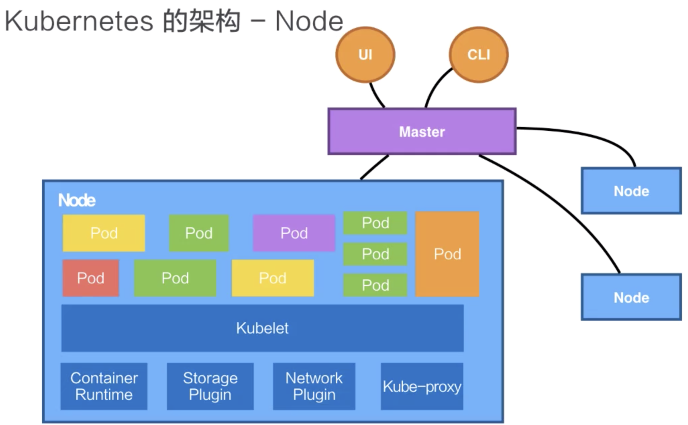

在 OS 上去创建容器所需要运行的环境，最终把容器或者 Pod 运行起来，也需要对存储跟网络进行管理。Kubernetes 并不会直接进行网络存储的操作，他们会靠 Storage Plugin 或者是网络的 Plugin 来进行操作。用户自己或者云厂商都会去写相应的 Storage Plugin 或者 Network Plugin，去完成存储操作或网络操作。

在 Kubernetes 自己的环境中，也会有 Kubernetes 的 Network，它是为了提供 Service network 来进行搭网组网的。（等一下我们也会去介绍“service”这个概念。）真正完成 service 组网的组件的是 Kube-proxy，它是利用了 iptable 的能力来进行组建 Kubernetes 的 Network，就是 cluster network，以上就是 Node 上面的四个组件。

Kubernetes 的 Node 并不会直接和 user 进行 interaction，它的 interaction 只会通过 Master。而 User 是通过 Master 向节点下发这些信息的。Kubernetes 每个 Node 上，都会运行我们刚才提到的这几个组件。

下面我们以一个例子再去看一下 Kubernetes 架构中的这些组件，是如何互相进行 interaction 的。

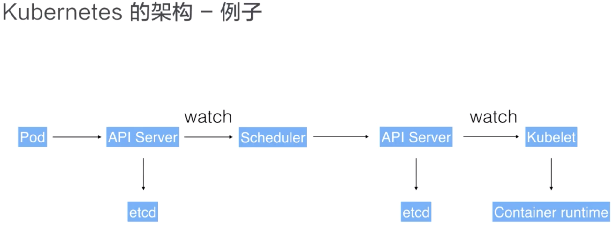

用户可以通过 UI 或者 CLI 提交一个 Pod 给 Kubernetes 进行部署，这个 Pod 请求首先会通过 CLI 或者 UI 提交给 Kubernetes API Server，下一步 API Server 会把这个信息写入到它的存储系统 etcd，之后 Scheduler 会通过 API Server 的 watch 或者叫做 notification 机制得到这个信息：有一个 Pod 需要被调度。

这个时候 Scheduler 会根据它的内存状态进行一次调度决策，在完成这次调度之后，它会向 API Server report 说：“OK！这个 Pod 需要被调度到某一个节点上。”

这个时候 API Server 接收到这次操作之后，会把这次的结果再次写到 etcd 中，然后 API Server 会通知相应的节点进行这次 Pod 真正的执行启动。相应节点的 kubelet 会得到这个通知，kubelet 就会去调 Container runtime 来真正去启动配置这个容器和这个容器的运行环境，去调度 Storage Plugin 来去配置存储，network Plugin 去配置网络。

这个例子我们可以看到：这些组件之间是如何相互沟通相互通信，协调来完成一次 Pod 的调度执行操作的。

### Kubernetes 的核心概念与它的 API

#### Pod

Pod 是 Kubernetes 的一个最小调度以及资源单元。用户可以通过 Kubernetes 的 Pod API 生产一个 Pod，让 Kubernetes 对这个 Pod 进行调度，也就是把它放在某一个 Kubernetes 管理的节点上运行起来。一个 Pod 简单来说是对一组容器的抽象，它里面会包含一个或多个容器。

比如像下面的这幅图里面，它包含了两个容器，每个容器可以指定它所需要资源大小。比如说，一个核一个 G，或者说 0.5 个核，0.5 个 G。

当然在这个 Pod 中也可以包含一些其他所需要的资源：比如说我们所看到的 Volume 卷这个存储资源；比如说我们需要 100 个 GB 的存储或者 20GB 的另外一个存储。

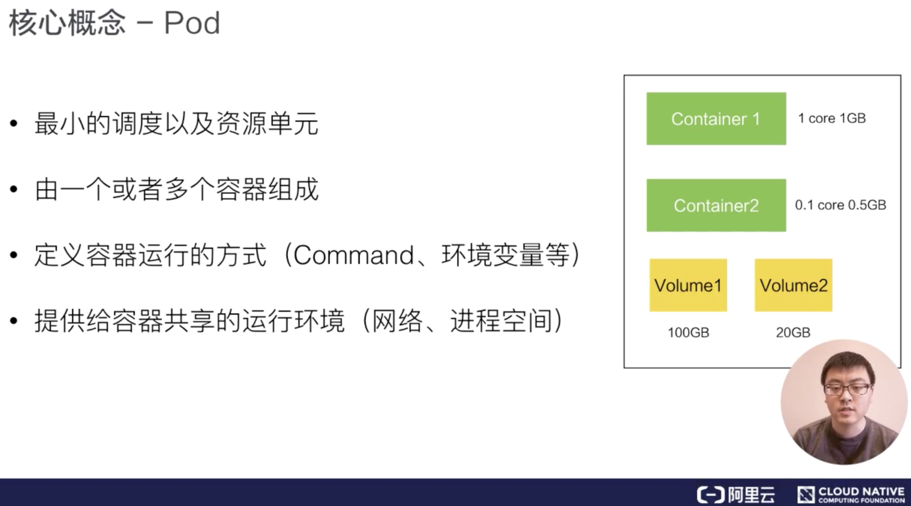

在 Pod 里面，我们也可以去定义容器所需要运行的方式。比如说运行容器的 Command，以及运行容器的环境变量等等。Pod 这个抽象也给这些容器提供了一个共享的运行环境，它们会共享同一个网络环境，这些容器可以用 localhost 来进行直接的连接。而 Pod 与 Pod 之间，是互相有 isolation 隔离的。

#### Volume

Volume 就是卷的概念，它是用来管理 Kubernetes 存储的，是用来声明在 Pod 中的容器可以访问文件目录的，一个卷可以被挂载在 Pod 中一个或者多个容器的指定路径下面。

而 Volume 本身是一个抽象的概念，一个 Volume 可以去支持多种的后端的存储。比如说 Kubernetes 的 Volume 就支持了很多存储插件，它可以支持本地的存储，可以支持分布式的存储，比如说像 ceph，GlusterFS ；它也可以支持云存储，比如说阿里云上的云盘、AWS 上的云盘、Google 上的云盘等等。

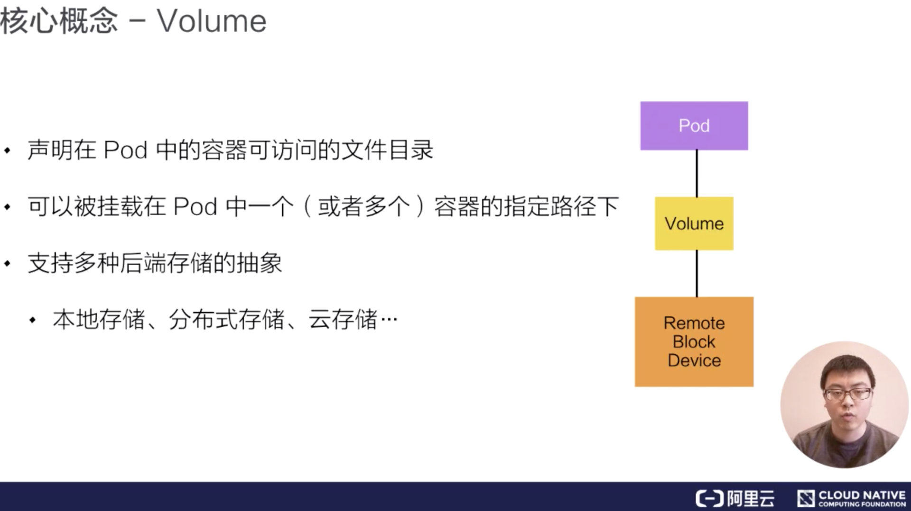

#### Deployment

Deployment 是在 Pod 这个抽象上更为上层的一个抽象，它可以定义一组 Pod 的副本数目、以及这个 Pod 的版本。一般大家用 Deployment 这个抽象来做应用的真正的管理，而 Pod 是组成 Deployment 最小的单元。

Kubernetes 是通过 Controller，也就是我们刚才提到的控制器去维护 Deployment 中 Pod 的数目，它也会去帮助 Deployment 自动恢复失败的 Pod。

比如说我可以定义一个 Deployment，这个 Deployment 里面需要两个 Pod，当一个 Pod 失败的时候，控制器就会监测到，它重新把 Deployment 中的 Pod 数目从一个恢复到两个，通过再去新生成一个 Pod。通过控制器，我们也会帮助完成发布的策略。比如说进行滚动升级，进行重新生成的升级，或者进行版本的回滚。

#### Service

Service 提供了一个或者多个 Pod 实例的稳定访问地址。

比如在上面的例子中，我们看到：一个 Deployment 可能有两个甚至更多个完全相同的 Pod。对于一个外部的用户来讲，访问哪个 Pod 其实都是一样的，所以它希望做一次负载均衡，在做负载均衡的同时，我只想访问某一个固定的 VIP，也就是 Virtual IP 地址，而不希望得知每一个具体的 Pod 的 IP 地址。

我们刚才提到，这个 pod 本身可能 terminal go（终止），如果一个 Pod 失败了，可能会换成另外一个新的。

对一个外部用户来讲，提供了多个具体的 Pod 地址，这个用户要不停地去更新 Pod 地址，当这个 Pod 再失败重启之后，我们希望有一个抽象，把所有 Pod 的访问能力抽象成一个第三方的一个 IP 地址，实现这个的 Kubernetes 的抽象就叫 Service。

实现 Service 有多种方式，Kubernetes 支持 Cluster IP，上面我们讲过的 kuber-proxy 的组网，它也支持 nodePort、 LoadBalancer 等其他的一些访问的能力。

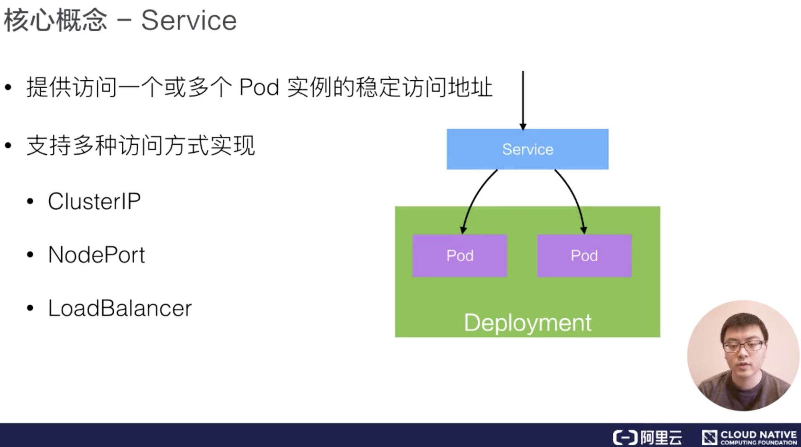

#### Namespace

Namespace 是用来做一个集群内部的逻辑隔离的，它包括鉴权、资源管理等。Kubernetes 的每个资源，比如刚才讲的 Pod、Deployment、Service 都属于一个 Namespace，同一个 Namespace 中的资源需要命名的唯一性，不同的 Namespace 中的资源可以重名。

Namespace 一个用例，比如像在阿里巴巴，我们内部会有很多个 business units，在每一个 business units 之间，希望有一个视图上的隔离，并且在鉴权上也不一样，在 cuda 上面也不一样，我们就会用 Namespace 来去给每一个 BU 提供一个他所看到的这么一个看到的隔离的机制。

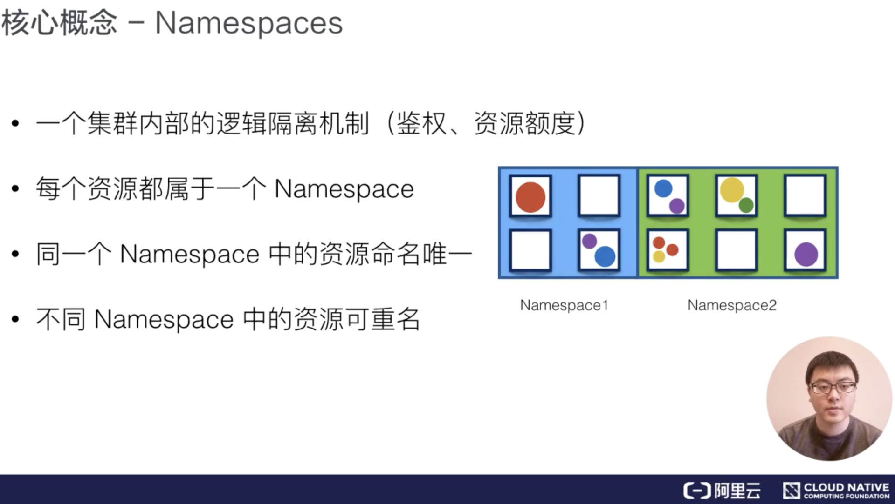

#### Kubernetes的API

下面我们介绍一下 Kubernetes 的 API 的基础知识。从 high-level 上看，Kubernetes API 是由 

Kubernetes 的 kubectl 也就是 command tool，Kubernetes UI，或者有时候用 curl，直接与 Kubernetes 进行沟通，都是使用 HTTP + JSON 这种形式。

下面有个例子：比如说，对于这个 Pod 类型的资源，它的 HTTP 访问的路径，就是 API，然后是 apiVesion: V1, 之后是相应的 Namespaces，以及 Pods 资源，最终是 Podname，也就是 Pod 的名字。

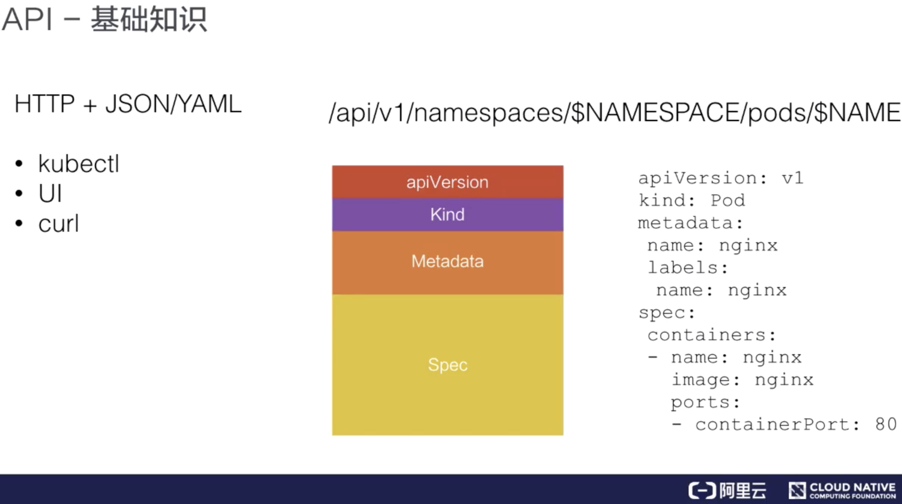

如果我们去提交一个 Pod，或者 get 一个 Pod 的时候，它的 content 内容都是用 JSON 或者是 YAML 表达的。上图中有个 yaml 的例子，在这个 yaml file 中，对 Pod 资源的描述也分为几个部分。

第一个部分，一般来讲会是 API 的 version。比如在这个例子中是 V1，它也会描述我在操作哪个资源；比如说我的 kind 如果是 pod，在 Metadata 中，就写上这个 Pod 的名字；比如说 nginx，我们也会给它打一些 label，我们等下会讲到 label 的概念。在 Metadata 中，有时候也会去写 annotation，也就是对资源的额外的一些用户层次的描述。

比较重要的一个部分叫做 Spec，Spec 也就是我们希望 Pod 达到的一个预期的状态。比如说它内部需要有哪些 container 被运行；比如说这里面有一个 nginx 的 container，它的 image 是什么？它暴露的 port 是什么？

当我们从 Kubernetes API 中去获取这个资源的时候，一般来讲在 Spec 下面会有一个项目叫 status，它表达了这个资源当前的状态；比如说一个 Pod 的状态可能是正在被调度、或者是已经 running、或者是已经被 terminates，就是被执行完毕了。

刚刚在 API 之中，我们讲了一个比较有意思的 metadata 叫做“label”，这个 label 可以是一组 KeyValuePair。

比如下图的第一个 pod 中，label 就可能是一个 color 等于 red，即它的颜色是红颜色。当然你也可以加其他 label，比如说 size: big 就是大小，定义为大的，它可以是一组 label。

这些 label 是可以被 selector，也就是选择器所查询的。这个能力实际上跟我们的 sql 类型的 select 语句是非常相似的，比如下图中的三个 Pod 资源中，我们就可以进行 select。name color 等于 red，就是它的颜色是红色的，我们也可以看到，只有两个被选中了，因为只有他们的 label 是红色的，另外一个 label 中写的 color 等于 yellow，也就是它的颜色是黄色，是不会被选中的。

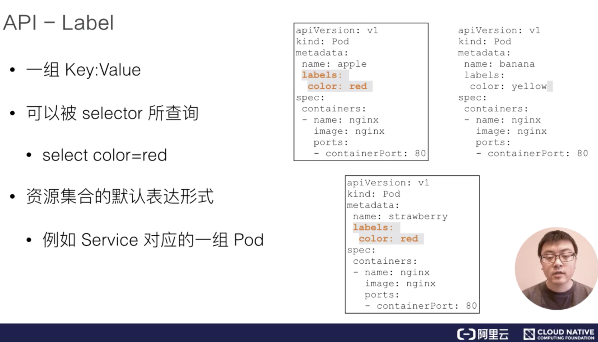

通过 label，kubernetes 的 API 层就可以对这些资源进行一个筛选，那这些筛选也是 kubernetes 对资源的集合所表达默认的一种方式。

例如说，我们刚刚介绍的 Deployment，它可能是代表一组的 Pod，它是一组 Pod 的抽象，一组 Pod 就是通过 label selector 来表达的。当然我们刚才讲到说 service 对应的一组 Pod，就是一个 service 要对应一个或者多个的 Pod，来对它们进行统一的访问，这个描述也是通过 label selector 来进行 select 选取的一组 Pod。

所以可以看到 label 是一个非常核心的 kubernetes API 的概念，我们在接下来的课程中也会着重地去讲解和介绍 label 这个概念，以及如何更好地去使用它。